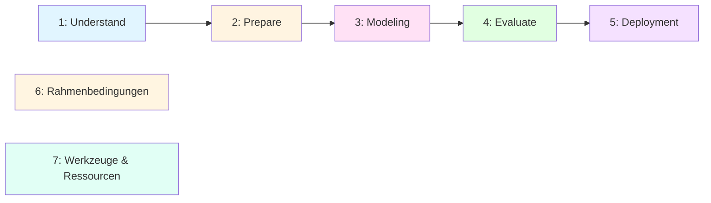

# Migration zur neuen GitHub Pages Struktur

> **Analyse der ML_Intro-Inhalte und Zuordnung zur neuen Machine Learning Workflow-Struktur**

**Datum:** 2026-01-11
**Version:** 1.0
**Status:** Analyse abgeschlossen - Umsetzung ausstehend

---

## Inhaltsverzeichnis

1. [Überblick](#überblick)
2. [Aktuelle Struktur](#aktuelle-struktur)
3. [Zielstruktur](#zielstruktur)
4. [Zuordnung der Inhalte](#zuordnung-der-inhalte)
5. [ToDo-Liste](#todo-liste)
6. [Migrationsplan](#migrationsplan)
7. [Risiken & Empfehlungen](#risiken--empfehlungen)

---

## Überblick

### Zielsetzung

Die vorhandenen ML_Intro-Inhalte sollen in eine neue, workflow-orientierte Struktur überführt werden, die sich stärker am praktischen ML-Prozess orientiert:

**Von:** Thematische Gruppierung (Konzepte, Ressourcen, Regulatorisches)
**Zu:** Workflow-orientierte Struktur (5-Phasen-Prozess mit Rahmenbedingungen)

### Analyse-Ergebnis

**Deckungsgrad: ~85%**

- ✅ **Vollständig abgedeckt:** Modeling, Evaluation, Rahmenbedingungen, Werkzeuge
- ⚠️ **Teilweise abgedeckt:** Problem-/Datenverständnis, Prepare, Deployment
- ❌ **Fehlend:** Modellalterung, Feature Engineering Details, Datenqualitäts-Framework

---

## Aktuelle Struktur

```
docs/
├── index.md                    # Startseite
├── concepts.md                 # Konzepte (Parent)
│   ├── 01_grundlagen.md
│   ├── 02_prepare.md
│   ├── 03_modeling.md
│   ├── 04_evaluate.md
│   ├── 05_deployment.md
│   ├── 08_xai.md
│   ├── grundlagen/             # Unterseiten
│   ├── prepare/                # Unterseiten
│   ├── modeling/               # Unterseiten (13 Dateien)
│   └── evaluate/               # Unterseiten (10 Dateien)
├── frameworks.md               # Frameworks & Tools
├── ressourcen.md               # Ressourcen (Parent)
│   ├── interaktive-visualisierung.md
│   └── links.md
├── regulatorisches.md          # Regulatorisches (Parent)
│   └── regulatorisches/        # Unterseiten (3 Dateien)
├── projekte.md                 # Projekte
└── rechtliches.md              # Legal (Impressum, Datenschutz)
```

**Charakteristik:** Thematische Gruppierung nach Inhaltstypen

---

## Zielstruktur

```
Machine Learning
│
├── Start                                    # Einstiegsseite
│
├── 1. Problem- & Datenverständnis
│   ├── Motivation & Anwendungsfälle
│   ├── Was Machine Learning kann – und was nicht
│   ├── Zielgrößen & Metriken (fachlich vs. technisch)
│   ├── Datentypen & Datenquellen
│   ├── Datenqualität
│   └── Bias & Repräsentativität
│
├── 2. Data Preparation
│   ├── Prepare
│   ├── Feature Engineering
│   └── Train/Test-Split
│
├── 3. Modeling
│   ├── Modelle & Lernarten
│   ├── Regularisierung
│   └── Hyperparameter
│
├── 4. Evaluation
│   ├── Evaluate
│   ├── Metriken
│   ├── Cross-Validation
│   └── XAI
│
├── 5. Deployment
│   ├── Deployment
│   ├── Monitoring (Grundidee)
│   └── Modellalterung
│
├── 6. Rahmenbedingungen
│   ├── EU AI Act
│   ├── Ethik
│   ├── Digitale Souveränität
│   └── Generative KI (Einordnung)
│
└── 7. Werkzeuge & Ressourcen
    ├── Frameworks
    ├── Interaktive Visualisierungen
    └── Links
```

**Charakteristik:** Workflow-orientierte Struktur nach ML-Prozess

---

## Zuordnung der Inhalte

### ✅ Start

| Zielseite | Quelle | Status |
|-----------|--------|--------|
| **Start** | `docs/index.md` | ✅ Vorhanden |

**Inhalt:**
- Überblick über Machine Learning
- Perspektiven: Verstehen, Anwenden, Gestalten
- Einführung in Lernparadigmen

---

### 📋 1. Problem- & Datenverständnis

| Baustein | Quelle | Status | Notizen |
|----------|--------|--------|---------|
| **Motivation & Anwendungsfälle** | `docs/index.md` | ⚠️ Teilweise | Perspektiven vorhanden, konkrete Use Cases fehlen |
| **Was ML kann – und was nicht** | `docs/concepts/01_grundlagen.md` → `machine_learning_grundlagen.md` | ✅ Vorhanden | Lernparadigmen, Aufgabentypen |
| **Zielgrößen & Metriken (fachlich vs. technisch)** | `docs/concepts/04_evaluate.md` | ⚠️ Nur technisch | Technische Metriken umfassend, fachliche Perspektive fehlt |
| **Datentypen & Datenquellen** | `02_daten/` Verzeichnisstruktur | ⚠️ Implizit | Struktur vorhanden (text, bild, audio, video, tabellen), Dokumentation fehlt |
| **Datenqualität** | `docs/concepts/02_prepare.md` | ⚠️ Erwähnt | Data Cleaning erwähnt, Framework fehlt |
| **Bias & Repräsentativität** | `docs/regulatorisches/M22b_Ethik und Generative KI.md` | ✅ Vorhanden | Bias & Fairness dokumentiert |

**Interaktive Ressourcen:**
- `docs/ressourcen/interaktive-visualisierung.md` → Understand-Sektion:
  - Statistik (Lage- und Streuungsmaße)
  - Verteilungsmaße (Quantile, Boxplots)
  - Korrelation & Kovarianz
  - Häufigkeit & Entropie

---

### ✂️ 2. Data Preparation

| Baustein | Quelle | Status | Notizen |
|----------|--------|--------|---------|
| **Prepare (allgemein)** | `docs/concepts/02_prepare.md` | ✅ Vorhanden | Überblick vorhanden |
| **Feature Engineering** | `docs/concepts/02_prepare.md` | ⚠️ Erwähnt | Struktur erwähnt, Details fehlen |
| **Train/Test-Split** | `docs/concepts/prepare/train_test_split.md` | ✅ Vorhanden | Vollständig dokumentiert |

**Detaillierte Unterseiten (vorhanden):**
- `docs/concepts/prepare/missing_values.md` ✅
- `docs/concepts/prepare/outlier.md` ✅
- `docs/concepts/prepare/skalierung.md` ✅
- `docs/concepts/prepare/kodierung_kategorialer_daten.md` ✅

**Interaktive Ressourcen:**
- `docs/ressourcen/interaktive-visualisierung.md` → Prepare-Sektion:
  - Missing Values
  - Kodierung (One-Hot, Label Encoding)
  - Skalierung (Standardisierung & Normalisierung)
  - Outlier (Ausreißererkennung)

---

### 🏃 3. Modeling

| Baustein | Quelle | Status | Notizen |
|----------|--------|--------|---------|
| **Modelle & Lernarten** | `docs/concepts/03_modeling.md` | ✅ Umfassend | Supervised, Unsupervised, Deep Learning, AutoML |
| **Regularisierung** | `docs/concepts/evaluate/regularisierung.md` | ✅ Vorhanden | L1, L2, Elastic Net |
| **Hyperparameter** | `docs/concepts/evaluate/hyperparameter_tuning.md` | ✅ Vorhanden | Grid Search, Random Search, Bayesian Optimization |

**Supervised Learning (13 Unterseiten):**
- `docs/concepts/modeling/decision_tree.md` ✅
- `docs/concepts/modeling/regression.md` ✅
- `docs/concepts/modeling/random-forest.md` ✅
- `docs/concepts/modeling/xgboost.md` ✅
- `docs/concepts/modeling/stacking.md` ✅
- `docs/concepts/modeling/ensemble.md` ✅

**Unsupervised Learning:**
- `docs/concepts/modeling/kmeans-dbscan.md` ✅
- `docs/concepts/modeling/isolation_forest.md` ✅
- `docs/concepts/modeling/apriori.md` ✅
- `docs/concepts/modeling/pca-lda.md` ✅

**Deep Learning:**
- `docs/concepts/modeling/neuronale-netze.md` ✅
- `docs/concepts/modeling/spezielle-neuronale-netze.md` ✅ (CNN, RNN, LSTM, AutoEncoder)

**Automatisierung:**
- `docs/concepts/modeling/automl.md` ✅ (PyCaret)

**Interaktive Ressourcen:**
- `docs/ressourcen/interaktive-visualisierung.md` → Modeling-Sektion:
  - **Supervised:** Entscheidungsbaum, Entropie, Lineare Regression, Random Forest, XGBoost, Ensemble Stacking
  - **Unsupervised:** K-Means, DBSCAN, Apriori, PCA
  - **Neural Networks:** 6 Demos (Training, Forward/Backward Pass, Gewichte, Architektur)
  - **CNN:** 2 Demos (Filter Demo, Filter Matrix)
  - **Weitere:** Regularisierung, Reinforcement Learning

---

### 🔭 4. Evaluation

| Baustein | Quelle | Status | Notizen |
|----------|--------|--------|---------|
| **Evaluate (allgemein)** | `docs/concepts/04_evaluate.md` | ✅ Vorhanden | Überblick über Metriken und Methoden |
| **Metriken** | Multiple Dateien | ✅ Umfassend | Nach Aufgabentyp strukturiert |
| **Cross-Validation** | `docs/concepts/evaluate/cross_validation.md` | ✅ Vorhanden | K-Fold, Stratified K-Fold, Time Series |
| **XAI** | `docs/concepts/08_xai.md` + `xai_erklaerbare_ki.md` | ✅ Umfassend | SHAP, LIME, ELI5, InterpretML |

**Metriken nach Aufgabentyp (5 Unterseiten):**
- `docs/concepts/evaluate/bewertung_allgemein.md` ✅
- `docs/concepts/evaluate/bewertung_klassifizierung.md` ✅
- `docs/concepts/evaluate/bewertung_regression.md` ✅
- `docs/concepts/evaluate/bewertung_clustering.md` ✅
- `docs/concepts/evaluate/bewertung_anomalie.md` ✅

**Weitere Evaluationsinhalte (5 Unterseiten):**
- `docs/concepts/evaluate/overfitting.md` ✅
- `docs/concepts/evaluate/bootstrapping.md` ✅
- `docs/concepts/evaluate/hyperparameter_tuning.md` ✅
- `docs/concepts/evaluate/regularisierung.md` ✅
- `docs/concepts/evaluate/cross_validation.md` ✅

**Interaktive Ressourcen:**
- `docs/ressourcen/interaktive-visualisierung.md` → Evaluate-Sektion:
  - Klassifikationsmetriken (Precision, Recall, F1-Score)
  - Threshold Optimization
  - Cross Validation
  - Bootstrapping

---

### 🚀 5. Deployment

| Baustein | Quelle | Status | Notizen |
|----------|--------|--------|---------|
| **Deployment** | `docs/concepts/05_deployment.md` + `deploy.md` | ✅ Vorhanden | Web Apps, Model Persistence, Cloud, MLOps |
| **Monitoring (Grundidee)** | `docs/concepts/05_deployment.md` | ⚠️ Erwähnt | Im MLOps-Kontext erwähnt, nicht detailliert |
| **Modellalterung** | - | ❌ Fehlt | Data Drift, Concept Drift nicht behandelt |

**Deployment-Ansätze (dokumentiert):**
- Web Applications (Gradio, Streamlit, Flask/FastAPI)
- Model Persistence (joblib, pickle, ONNX, PMML)
- Cloud Deployment (Hugging Face Spaces, AWS SageMaker, Google Cloud, Azure ML)
- Container & Orchestrierung (Docker, Kubernetes)
- MLOps (CI/CD, Model Registry, Monitoring, Experiment Tracking)

---

### ⚖️ 6. Rahmenbedingungen

| Baustein | Quelle | Status | Notizen |
|----------|--------|--------|---------|
| **EU AI Act** | `docs/regulatorisches/M22_EU AI Act.md` | ✅ Vorhanden | Rechtliche Rahmenbedingungen, Risikostufen, Compliance |
| **Ethik** | `docs/regulatorisches/M22b_Ethik und Generative KI.md` | ✅ Vorhanden | Ethische Aspekte, Bias & Fairness, Best Practices |
| **Digitale Souveränität** | `docs/regulatorisches/Digitale_Souveraenitaet.md` | ✅ Vorhanden | Definition, Reifegrade, Europäische Initiativen |
| **Generative KI (Einordnung)** | `docs/regulatorisches/M22b_Ethik und Generative KI.md` | ✅ Vorhanden | GenAI-spezifische Aspekte |

**Zusätzliche Inhalte:**
- `docs/rechtliches.md` (Sammlung)
- `docs/legal/impressum.md`
- `docs/legal/datenschutz.md`
- `docs/legal/haftungsausschluss.md`

---

### 🛠️ 7. Werkzeuge & Ressourcen

| Baustein | Quelle | Status | Notizen |
|----------|--------|--------|---------|
| **Frameworks** | `docs/frameworks.md` | ✅ Umfassend | Data Processing, Core ML, Visualization, XAI, AutoML |
| **Interaktive Visualisierungen** | `docs/ressourcen/interaktive-visualisierung.md` | ✅ Umfassend | 40+ interaktive p5.js Demos |
| **Links** | `docs/ressourcen/links.md` | ✅ Umfassend | Videos, Tutorials, Bücher, Tools |

**Framework-Kategorien (6 Kategorien):**
- Data Processing & Analysis (Pandas, NumPy, ydata-profiling)
- Core ML Frameworks (scikit-learn, Keras, mlxtend)
- Visualization & Model Diagnostics (Plotly, Yellowbrick, dtreeviz)
- Explainable AI (SHAP, LIME, ELI5, InterpretML)
- AutoML & Specialized Tools (PyCaret, Gradio, MediaPipe)
- Learning Resources (Data Science Guide)

**Link-Kategorien (11 Kategorien):**
- StatQuest Videos (YouTube) - 40+ Videos
- KNIME Kurse & Tutorials
- Towards Data Science / Medium Artikel
- Machine Learning Mastery
- Google ML Crash Course
- Wissenschaftliche Paper
- Interaktive Lerntools (9 Tools)
- Bücher & E-Books (kostenlos) - 10+ Bücher
- Dokumentation & Referenzen
- KI-Tool-Sammlungen (4 Plattformen)
- Sonstige nützliche Ressourcen

---

## ToDo-Liste

### 🔴 Priorität 1: Kritische Lücken

#### 1.1 Modellalterung & Drift Detection

**Was fehlt:**
- [ ] **Data Drift**: Änderungen in der Datenverteilung über Zeit
- [ ] **Concept Drift**: Änderungen in der Beziehung zwischen Features und Target
- [ ] **Model Decay**: Performance-Degradation über Zeit
- [ ] **Retraining-Strategien**: Wann und wie Modelle neu trainiert werden sollten

**Zielort:** `docs/concepts/05_deployment.md` oder neue Datei `docs/concepts/deployment/modellalterung.md`

**Geschätzter Aufwand:** 4-6 Stunden (inkl. Recherche, Visualisierungen)

**Ressourcen:**
- [Evidently AI - Data Drift Guide](https://www.evidentlyai.com/blog/data-drift-detection-tools)
- [Aporia ML Monitoring](https://www.aporia.com/learn/)

---

#### 1.2 Feature Engineering (Detailliert)

**Was fehlt:**
- [ ] **Feature Creation**: Domain-spezifische Features erstellen
- [ ] **Feature Selection**: Filter, Wrapper, Embedded Methods
- [ ] **Feature Extraction**: PCA, LDA, Autoencoders
- [ ] **Domain Knowledge Integration**: Wie Fachwissen in Features einfließt
- [ ] **Temporal Features**: Zeitreihen-Features (Lag, Rolling Windows)
- [ ] **Text Features**: TF-IDF, Word Embeddings
- [ ] **Image Features**: HOG, SIFT, CNN-basiert

**Zielort:** `docs/concepts/02_prepare.md` erweitern oder neue Datei `docs/concepts/prepare/feature_engineering.md`

**Geschätzter Aufwand:** 6-8 Stunden

**Ressourcen:**
- Feature Engineering Book (Alice Zheng)
- scikit-learn Feature Selection Guide

---

#### 1.3 Datenqualitäts-Framework

**Was fehlt:**
- [ ] **Datenqualitätsdimensionen**: Vollständigkeit, Korrektheit, Konsistenz, Aktualität
- [ ] **Data Profiling**: Automatisierte Datenqualitätsprüfung
- [ ] **Data Validation**: Schema-Checks, Range-Checks
- [ ] **Data Lineage**: Herkunft und Transformation von Daten
- [ ] **Tools**: ydata-profiling, Great Expectations, Pandera

**Zielort:** Neue Datei `docs/concepts/01_understand/datenqualitaet.md`

**Geschätzter Aufwand:** 4-5 Stunden

**Ressourcen:**
- Great Expectations Dokumentation
- ydata-profiling Examples

---

### 🟡 Priorität 2: Erweiterungen

#### 2.1 Problem- & Datenverständnis erweitern

**Was fehlt:**
- [ ] **Motivation & Anwendungsfälle**: Konkrete Use Cases aus verschiedenen Branchen
  - Healthcare (Diagnose, Prognose)
  - Finance (Fraud Detection, Credit Scoring)
  - Retail (Recommender Systems, Demand Forecasting)
  - Manufacturing (Predictive Maintenance, Quality Control)

- [ ] **Zielgrößen - Fachliche Perspektive**:
  - Business Metrics vs. ML Metrics
  - Beispiel: "Umsatzsteigerung" (fachlich) vs. "Accuracy" (technisch)
  - Trade-offs zwischen Metriken

- [ ] **Datentypen & Datenquellen - Dokumentation**:
  - Strukturierte Daten (Tabellen, Datenbanken)
  - Unstrukturierte Daten (Text, Bilder, Audio, Video)
  - Semi-strukturierte Daten (JSON, XML)
  - Datenquellen (APIs, Web Scraping, Sensoren, Logs)

**Zielort:**
- Neue Datei `docs/concepts/01_understand/anwendungsfaelle.md`
- Neue Datei `docs/concepts/01_understand/metriken_perspektiven.md`
- Neue Datei `docs/concepts/01_understand/datentypen.md`

**Geschätzter Aufwand:** 8-10 Stunden (alle 3 Themen)

---

#### 2.2 Deployment - Monitoring detaillieren

**Was fehlt:**
- [ ] **Monitoring-Metriken**: Latency, Throughput, Error Rates
- [ ] **Alerting**: Threshold-basiert, Anomaly-basiert
- [ ] **Logging**: Structured Logging, Log Aggregation
- [ ] **Dashboards**: Grafana, Kibana, Custom Dashboards
- [ ] **A/B Testing**: Model Comparison in Production

**Zielort:** `docs/concepts/05_deployment.md` erweitern oder neue Datei `docs/concepts/deployment/monitoring.md`

**Geschätzter Aufwand:** 3-4 Stunden

---

### 🟢 Priorität 3: Optimierungen

#### 3.1 Interaktive Visualisierungen erweitern

**Mögliche Ergänzungen:**
- [ ] **Feature Engineering Demo**: Visualisierung von Feature Creation
- [ ] **Data Drift Demo**: Visualisierung von Distribution Shifts
- [ ] **Confusion Matrix Interactive**: Interaktive Confusion Matrix mit Threshold
- [ ] **Learning Curves**: Interaktive Learning Curves (Bias-Variance)

**Zielort:** `docs/ressourcen/interaktive-visualisierung.md` erweitern

**Geschätzter Aufwand:** 10-15 Stunden (p5.js Entwicklung)

---

#### 3.2 Weitere Link-Ressourcen

**Mögliche Ergänzungen:**
- [ ] **MLOps-Ressourcen**: MLflow, Weights & Biases, Neptune.ai
- [ ] **Data Drift Tools**: Evidently AI, Aporia, Fiddler
- [ ] **Fairness Tools**: Fairlearn, AI Fairness 360, What-If Tool
- [ ] **Weitere Bücher**: Deep Learning (Goodfellow), Probabilistic ML (Murphy)

**Zielort:** `docs/ressourcen/links.md` erweitern

**Geschätzter Aufwand:** 2-3 Stunden

---

### 📋 Aufgaben-Übersicht

| Priorität | Task | Aufwand | Status |
|-----------|------|---------|--------|
| 🔴 | Modellalterung & Drift Detection | 4-6h | ❌ ToDo |
| 🔴 | Feature Engineering (Detailliert) | 6-8h | ❌ ToDo |
| 🔴 | Datenqualitäts-Framework | 4-5h | ❌ ToDo |
| 🟡 | Problem- & Datenverständnis erweitern | 8-10h | ❌ ToDo |
| 🟡 | Deployment - Monitoring detaillieren | 3-4h | ❌ ToDo |
| 🟢 | Interaktive Visualisierungen erweitern | 10-15h | ❌ ToDo |
| 🟢 | Weitere Link-Ressourcen | 2-3h | ❌ ToDo |

**Gesamtaufwand:** 37-51 Stunden

---

## Migrationsplan

### Phase 0: Vorbereitung (vor der Migration)

#### 0.1 Backup & Git-Tag erstellen

```bash
# Im ML_Intro Verzeichnis
cd ML_Intro

# Aktuellen Stand committen
git add .
git commit -m "Pre-migration snapshot"

# Tag für aktuellen Stand
git tag -a pre-migration-v1.0 -m "Snapshot vor Struktur-Migration"
git push origin pre-migration-v1.0
```

#### 0.2 Branch für Migration erstellen

```bash
# Neuen Branch erstellen
git checkout -b migration/workflow-struktur

# Oder Feature Branch
git checkout -b feature/neue-navigation
```

#### 0.3 Jekyll-Konfiguration prüfen

```yaml
# _config.yml prüfen
# - Navigations-Tiefe (max 3 Ebenen)
# - URL-Struktur
# - Collections
```

---

### Phase 1: Strukturplanung (1-2 Stunden)

#### 1.1 Zielstruktur definieren

**Neue Verzeichnisstruktur:**

```
docs/
├── index.md                              # Start (überarbeitet)
│
├── 01_understand/                        # NEU: Problem- & Datenverständnis
│   ├── 01_understand.md                  # Parent-Seite
│   ├── motivation.md                     # NEU
│   ├── was_ml_kann.md                    # Umbenannt von machine_learning_grundlagen.md
│   ├── metriken_perspektiven.md          # NEU
│   ├── datentypen.md                     # NEU
│   ├── datenqualitaet.md                 # NEU
│   └── bias_repraesentativitaet.md      # Aus regulatorisches/ verschoben
│
├── 02_prepare/                           # Umbenannt von concepts/prepare/
│   ├── 02_prepare.md                     # Parent-Seite
│   ├── feature_engineering.md            # NEU (Detailliert)
│   ├── train_test_split.md               # Behalten
│   ├── missing_values.md                 # Behalten
│   ├── outlier.md                        # Behalten
│   ├── skalierung.md                     # Behalten
│   └── kodierung_kategorialer_daten.md   # Behalten
│
├── 03_modeling/                          # Umbenannt von concepts/modeling/
│   ├── 03_modeling.md                    # Parent-Seite
│   ├── supervised/                       # NEU: Untergruppe
│   │   ├── decision_tree.md
│   │   ├── regression.md
│   │   ├── random-forest.md
│   │   ├── xgboost.md
│   │   ├── stacking.md
│   │   └── ensemble.md
│   ├── unsupervised/                     # NEU: Untergruppe
│   │   ├── kmeans-dbscan.md
│   │   ├── isolation_forest.md
│   │   ├── apriori.md
│   │   └── pca-lda.md
│   ├── deep_learning/                    # NEU: Untergruppe
│   │   ├── neuronale-netze.md
│   │   └── spezielle-neuronale-netze.md
│   ├── automl.md                         # Behalten
│   ├── regularisierung.md                # Von evaluate/ verschoben
│   └── hyperparameter.md                 # Von evaluate/ verschoben
│
├── 04_evaluate/                          # Umbenannt von concepts/evaluate/
│   ├── 04_evaluate.md                    # Parent-Seite
│   ├── metriken/                         # NEU: Untergruppe
│   │   ├── bewertung_allgemein.md
│   │   ├── bewertung_klassifizierung.md
│   │   ├── bewertung_regression.md
│   │   ├── bewertung_clustering.md
│   │   └── bewertung_anomalie.md
│   ├── cross_validation.md               # Behalten
│   ├── bootstrapping.md                  # Behalten
│   ├── overfitting.md                    # Behalten
│   └── xai/                              # NEU: Untergruppe
│       ├── xai_overview.md               # Umbenannt von xai_erklaerbare_ki.md
│       ├── shap.md                       # Optional: Details
│       ├── lime.md                       # Optional: Details
│       └── eli5.md                       # Optional: Details
│
├── 05_deployment/                        # Umbenannt von concepts/deployment/
│   ├── 05_deployment.md                  # Parent-Seite (überarbeitet)
│   ├── deployment_ansaetze.md            # Aus deploy.md
│   ├── monitoring.md                     # NEU (Detailliert)
│   └── modellalterung.md                 # NEU (Kritisch!)
│
├── 06_rahmenbedingungen/                 # Umbenannt von regulatorisches/
│   ├── 06_rahmenbedingungen.md           # Parent-Seite
│   ├── eu_ai_act.md                      # Behalten
│   ├── ethik.md                          # Behalten
│   ├── digitale_souveraenitaet.md        # Behalten
│   └── generative_ki.md                  # Extrahiert aus ethik.md
│
├── 07_werkzeuge/                         # Umbenannt von ressourcen/
│   ├── 07_werkzeuge.md                   # Parent-Seite
│   ├── frameworks.md                     # Verschoben von Top-Level
│   ├── interaktive-visualisierung.md     # Behalten
│   └── links.md                          # Behalten
│
├── projekte.md                           # Behalten (Optional)
└── rechtliches/                          # Behalten
    ├── rechtliches.md
    ├── impressum.md
    ├── datenschutz.md
    └── haftungsausschluss.md
```

#### 1.2 Navigation (Jekyll Just-the-Docs)

**Wichtig:** Just-the-Docs unterstützt **maximal 3 Navigations-Ebenen**:

```yaml
# Level 1: Parent
nav_order: 1
title: Problem- & Datenverständnis

# Level 2: Child
parent: Problem- & Datenverständnis
nav_order: 1
title: Motivation

# Level 3: Grandchild
parent: Motivation
grand_parent: Problem- & Datenverständnis
nav_order: 1
title: Use Cases Healthcare
```

**Empfehlung:** Modelle **nicht** in 3. Ebene unterteilen, sondern alle auf gleicher Ebene lassen.

---

### Phase 2: Dateien vorbereiten (2-4 Stunden)

#### 2.1 Neue Verzeichnisse erstellen

```bash
# Im docs/ Verzeichnis
mkdir -p 01_understand
mkdir -p 02_prepare
mkdir -p 03_modeling/supervised
mkdir -p 03_modeling/unsupervised
mkdir -p 03_modeling/deep_learning
mkdir -p 04_evaluate/metriken
mkdir -p 04_evaluate/xai
mkdir -p 05_deployment
mkdir -p 06_rahmenbedingungen
mkdir -p 07_werkzeuge
```

#### 2.2 Dateien umbenennen & verschieben (Trockenübung)

```bash
# Beispiel-Befehle (NICHT AUSFÜHREN - nur Planung!)

# 1. Understand
git mv docs/concepts/grundlagen/machine_learning_grundlagen.md docs/01_understand/was_ml_kann.md
git mv docs/regulatorisches/M22b_Ethik\ und\ Generative\ KI.md docs/01_understand/bias_repraesentativitaet.md

# 2. Prepare (Verzeichnis umbenennen)
git mv docs/concepts/prepare docs/02_prepare

# 3. Modeling (Untergruppen erstellen)
git mv docs/concepts/modeling/decision_tree.md docs/03_modeling/supervised/
git mv docs/concepts/modeling/kmeans-dbscan.md docs/03_modeling/unsupervised/
git mv docs/concepts/modeling/neuronale-netze.md docs/03_modeling/deep_learning/

# 4. Evaluate
git mv docs/concepts/evaluate docs/04_evaluate
git mv docs/04_evaluate/bewertung_*.md docs/04_evaluate/metriken/

# 5. Deployment
git mv docs/concepts/deployment docs/05_deployment
git mv docs/concepts/deploy.md docs/05_deployment/deployment_ansaetze.md

# 6. Rahmenbedingungen
git mv docs/regulatorisches docs/06_rahmenbedingungen

# 7. Werkzeuge
git mv docs/ressourcen docs/07_werkzeuge
git mv docs/frameworks.md docs/07_werkzeuge/
```

#### 2.3 YAML Front Matter aktualisieren

**Jede verschobene Datei benötigt neue YAML Front Matter:**

```yaml
---
layout: default
title: Was Machine Learning kann
parent: Problem- & Datenverständnis        # NEU
nav_order: 2                                # NEU
description: "Lernparadigmen und Aufgabentypen"
has_toc: true
---
```

**Tool zum automatischen Update:** Python-Script (siehe Phase 3)

---

### Phase 3: Migration ausführen (4-6 Stunden)

#### 3.1 Python-Script für Massen-Update

**Script:** `update_frontmatter.py`

```python
#!/usr/bin/env python3
"""
Aktualisiert YAML Front Matter in Markdown-Dateien nach Migration.
"""

import os
import re
from pathlib import Path

# Mapping: Alte Parent -> Neue Parent
PARENT_MAPPING = {
    "Konzepte": None,  # Entfernen
    "Grundlagen": "Problem- & Datenverständnis",
    "Prepare": "Data Preparation",
    "Modeling": "Modeling",
    "Evaluate": "Evaluation",
    "Deployment": "Deployment",
    "Ressourcen": "Werkzeuge & Ressourcen",
}

def update_frontmatter(file_path: Path, parent_mapping: dict):
    """Aktualisiert YAML Front Matter in einer Datei."""
    with open(file_path, 'r', encoding='utf-8') as f:
        content = f.read()

    # YAML Front Matter extrahieren
    match = re.match(r'^---\n(.*?)\n---\n', content, re.DOTALL)
    if not match:
        print(f"⚠️  Keine YAML Front Matter: {file_path}")
        return

    frontmatter = match.group(1)
    body = content[match.end():]

    # Parent aktualisieren
    for old_parent, new_parent in parent_mapping.items():
        if f"parent: {old_parent}" in frontmatter:
            if new_parent:
                frontmatter = frontmatter.replace(
                    f"parent: {old_parent}",
                    f"parent: {new_parent}"
                )
            else:
                # Parent entfernen
                frontmatter = re.sub(
                    r'parent: .*\n',
                    '',
                    frontmatter
                )
            print(f"✅ Updated: {file_path.name} ({old_parent} -> {new_parent})")

    # Datei zurückschreiben
    new_content = f"---\n{frontmatter}\n---\n{body}"
    with open(file_path, 'w', encoding='utf-8') as f:
        f.write(new_content)

def main():
    docs_dir = Path("docs")

    # Alle .md Dateien finden
    md_files = list(docs_dir.rglob("*.md"))

    print(f"📂 Gefundene Dateien: {len(md_files)}")

    for md_file in md_files:
        if md_file.name.startswith("_"):
            continue  # Jekyll-interne Dateien überspringen

        update_frontmatter(md_file, PARENT_MAPPING)

    print("\n✅ Migration abgeschlossen!")

if __name__ == "__main__":
    main()
```

**Verwendung:**

```bash
# Trockenübung (nur Anzeige)
python update_frontmatter.py --dry-run

# Tatsächlich ausführen
python update_frontmatter.py
```

#### 3.2 Manuelle Schritte (Checkliste)

- [ ] **Startseite überarbeiten** (`docs/index.md`)
  - Neue Struktur erklären
  - Workflow-Diagramm einfügen (Mermaid)

- [ ] **Parent-Seiten erstellen** (7 Dateien):
  - [ ] `docs/01_understand/01_understand.md`
  - [ ] `docs/02_prepare/02_prepare.md`
  - [ ] `docs/03_modeling/03_modeling.md`
  - [ ] `docs/04_evaluate/04_evaluate.md`
  - [ ] `docs/05_deployment/05_deployment.md`
  - [ ] `docs/06_rahmenbedingungen/06_rahmenbedingungen.md`
  - [ ] `docs/07_werkzeuge/07_werkzeuge.md`

- [ ] **Verzeichnisse verschieben** (siehe Phase 2.2)

- [ ] **Interne Links aktualisieren**:
  - Alle relativen Links prüfen
  - Beispiel: `[XAI](../xai_erklaerbare_ki.md)` → `[XAI](../04_evaluate/xai/xai_overview.md)`

- [ ] **Alte Verzeichnisse löschen**:
  - `docs/concepts/` (leer)
  - `docs/ressourcen/` (leer)
  - `docs/regulatorisches/` (leer)

---

### Phase 4: Testing (2-3 Stunden)

#### 4.1 Lokales Jekyll-Build

```bash
# Im ML_Intro Verzeichnis
cd docs

# Jekyll installieren (falls nicht vorhanden)
bundle install

# Lokalen Server starten
bundle exec jekyll serve

# Im Browser öffnen
open http://localhost:4000
```

#### 4.2 Checkliste für Testing

- [ ] **Navigation prüfen**:
  - [ ] Alle 7 Hauptkategorien sichtbar?
  - [ ] Unterseiten erreichbar?
  - [ ] Reihenfolge korrekt (`nav_order`)?

- [ ] **Links prüfen**:
  - [ ] Interne Links funktionieren?
  - [ ] Externe Links funktionieren?
  - [ ] Bilder werden geladen?

- [ ] **Inhalt prüfen**:
  - [ ] YAML Front Matter korrekt?
  - [ ] Markdown-Rendering korrekt?
  - [ ] Code-Blöcke funktionieren?

- [ ] **Suche testen**:
  - [ ] Suchfunktion findet Seiten?
  - [ ] Relevanz der Ergebnisse?

#### 4.3 Broken Links finden

**Tool:** `markdown-link-check`

```bash
# NPM-Tool installieren
npm install -g markdown-link-check

# Alle Markdown-Dateien prüfen
find docs -name "*.md" -exec markdown-link-check {} \;

# Oder Python-Alternative
pip install linkchecker
linkchecker http://localhost:4000
```

---

### Phase 5: Deployment (1 Stunde)

#### 5.1 GitHub Push

```bash
# Änderungen committen
git add docs/
git commit -m "Migration zu workflow-orientierter Struktur

- Reorganisation in 7 Hauptkategorien (Understand, Prepare, Modeling, Evaluate, Deployment, Rahmenbedingungen, Werkzeuge)
- Neue Navigation nach ML-Workflow
- YAML Front Matter aktualisiert
- Interne Links aktualisiert"

# Branch pushen
git push origin migration/workflow-struktur
```

#### 5.2 Pull Request erstellen

**PR-Beschreibung Template:**

```markdown
# Migration zur workflow-orientierten Struktur

## Änderungen

### Neue Struktur
- ✅ 7 Hauptkategorien nach ML-Workflow
- ✅ 40+ Unterseiten reorganisiert
- ✅ Navigation optimiert (max 3 Ebenen)

### Verschobene Inhalte
- `concepts/` → `01_understand/`, `02_prepare/`, `03_modeling/`, `04_evaluate/`, `05_deployment/`
- `regulatorisches/` → `06_rahmenbedingungen/`
- `ressourcen/` → `07_werkzeuge/`

### Aktualisierte Inhalte
- YAML Front Matter (parent, nav_order)
- Interne Links
- Startseite (docs/index.md)

## Testing

- [x] Lokaler Jekyll-Build erfolgreich
- [x] Navigation funktioniert
- [x] Interne Links geprüft
- [x] Externe Links geprüft

## Breaking Changes

⚠️ **URLs ändern sich!**

Alte URLs funktionieren nicht mehr. Beispiel:
- Alt: `/concepts/modeling/decision_tree.html`
- Neu: `/03_modeling/supervised/decision_tree.html`

**Empfehlung:** Redirects einrichten (siehe unten)

## Review-Checklist

- [ ] Navigation in Ordnung?
- [ ] Inhalte vollständig?
- [ ] Links funktionieren?
- [ ] Bilder werden geladen?
```

#### 5.3 Redirects einrichten (Optional)

**Jekyll-Redirects mit `jekyll-redirect-from`:**

```yaml
# In jeder verschobenen Datei
---
title: Decision Tree
parent: Modeling
redirect_from:
  - /concepts/modeling/decision_tree.html
  - /concepts/modeling/decision_tree/
---
```

**Netlify Redirects (`_redirects` Datei):**

```
# Legacy URLs -> Neue URLs
/concepts/modeling/decision_tree.html  /03_modeling/supervised/decision_tree.html  301
/concepts/evaluate/cross_validation.html  /04_evaluate/cross_validation.html  301
```

---

### Phase 6: Post-Migration (1-2 Stunden)

#### 6.1 Google Analytics / Search Console aktualisieren

- [ ] Neue Sitemap einreichen
- [ ] Alte URLs aus Index entfernen (optional)
- [ ] 301 Redirects in Search Console bestätigen

#### 6.2 Dokumentation aktualisieren

- [ ] `README.md` aktualisieren (neue Struktur beschreiben)
- [ ] `CLAUDE.md` aktualisieren (neue Navigations-Hierarchie)
- [ ] `DEV_GUIDE.md` aktualisieren (falls vorhanden)

#### 6.3 Cleanup

```bash
# Alten Branch löschen (nach Merge)
git branch -d migration/workflow-struktur
git push origin --delete migration/workflow-struktur

# Tag für neue Version
git tag -a v2.0-workflow-struktur -m "Migration zu workflow-orientierter Struktur"
git push origin v2.0-workflow-struktur
```

---

### 🕐 Zeitplanung (Gesamt: 11-19 Stunden)

| Phase | Beschreibung | Aufwand |
|-------|--------------|---------|
| **Phase 0** | Vorbereitung (Backup, Branch) | 0.5h |
| **Phase 1** | Strukturplanung | 1-2h |
| **Phase 2** | Dateien vorbereiten | 2-4h |
| **Phase 3** | Migration ausführen | 4-6h |
| **Phase 4** | Testing | 2-3h |
| **Phase 5** | Deployment | 1h |
| **Phase 6** | Post-Migration | 1-2h |
| **TOTAL** | | **11-19h** |

**Empfehlung:** Migration schrittweise über 2-3 Tage durchführen, nicht in einer Session.

---

## Risiken & Empfehlungen

### 🔴 Risiken

#### 1. Broken Links nach Migration

**Problem:** Interne Links funktionieren nicht mehr, da URLs sich ändern.

**Lösung:**
- ✅ Script zum automatischen Link-Update verwenden
- ✅ Redirects einrichten (Jekyll oder Netlify)
- ✅ Vor Go-Live: Alle Links testen (`linkchecker`)

#### 2. Navigation zu tief (>3 Ebenen)

**Problem:** Just-the-Docs unterstützt nur 3 Navigations-Ebenen.

**Lösung:**
- ✅ Modelle **nicht** in Untergruppen (supervised/unsupervised) auf 3. Ebene packen
- ✅ Alternative: Alle Modelle auf gleicher Ebene, mit Präfix im Titel
  - Beispiel: `Supervised: Decision Tree`, `Unsupervised: K-Means`

#### 3. Git-History wird unübersichtlich

**Problem:** Viele `git mv` Befehle machen History schwer nachvollziehbar.

**Lösung:**
- ✅ Migration in **einem Commit** durchführen (mit detaillierter Commit-Message)
- ✅ Git-Tag vor Migration setzen (`pre-migration-v1.0`)
- ✅ Git-Option `--follow` nutzt beim Verfolgen verschobener Dateien:
  ```bash
  git log --follow docs/03_modeling/supervised/decision_tree.md
  ```

#### 4. Performance (zu viele Dateien)

**Problem:** Jekyll-Build dauert lange bei vielen Dateien.

**Lösung:**
- ✅ Incremental Build aktivieren (`jekyll serve --incremental`)
- ✅ Cache nutzen (GitHub Actions: Cache für `_site/`)
- ✅ Große Dateien in `_sass/` oder `assets/` auslagern

---

### ✅ Empfehlungen

#### 1. Schrittweise Migration

**Nicht empfohlen:** Alles auf einmal migrieren

**Empfohlen:**
1. Phase 1: Understand + Prepare migrieren (klein, überschaubar)
2. Phase 2: Modeling + Evaluate migrieren (groß, viele Dateien)
3. Phase 3: Deployment + Rahmenbedingungen + Werkzeuge migrieren (klein)

**Vorteil:**
- Fehler früher erkennbar
- Testing einfacher
- Rollback möglich

#### 2. Redirects einrichten

**Warum:** Alte URLs (von externen Seiten verlinkt) funktionieren sonst nicht mehr.

**Wie:** Jekyll `jekyll-redirect-from` Plugin nutzen:

```yaml
# Gemfile
gem "jekyll-redirect-from"

# _config.yml
plugins:
  - jekyll-redirect-from
```

#### 3. URL-Struktur konsistent halten

**Empfehlung:**
- Numerische Präfixe in Verzeichnisnamen behalten (`01_understand/`, `02_prepare/`)
- Vorteil: Alphabetische Sortierung = logische Reihenfolge
- Nachteil: URLs enthalten Zahlen (`/01_understand/motivation.html`)

**Alternative:**
- Präfixe nur in Dateinamen, nicht in Verzeichnissen
- Vorteil: Sauberere URLs (`/understand/motivation.html`)
- Nachteil: `nav_order` manuell pflegen erforderlich

#### 4. Workflow-Diagramm auf Startseite

**Empfehlung:** Mermaid-Diagramm des ML-Workflows auf `index.md` einfügen:



#### 5. Konsistente Emojis in Titeln

**Aktuell:** Emojis in Unterseiten (✂️, 🏃, 🔭)

**Empfehlung:** Auch in Navigation nutzen (optional):

```yaml
---
title: "✂️ Data Preparation"
nav_order: 2
---
```

**Nachteil:** Emoji-Support in älteren Browsern?

---

### 📊 Erfolgs-Metriken

Nach Migration folgende KPIs prüfen:

| Metrik | Ziel | Messung |
|--------|------|---------|
| **Broken Links** | 0 | `linkchecker` |
| **Page Load Time** | < 2s | Google PageSpeed Insights |
| **Navigation Depth** | Max 3 Ebenen | Manuelle Prüfung |
| **404 Errors** | < 5% | Google Search Console |
| **User Navigation** | Durchschnittliche Klicks bis Ziel < 3 | Google Analytics |

---

## Zusammenfassung

### ✅ Vorteile der neuen Struktur

1. **Workflow-orientiert**: Struktur folgt dem ML-Prozess (Understand → Prepare → Modeling → Evaluate → Deployment)
2. **Bessere Auffindbarkeit**: Inhalte nach Phase gruppiert, nicht nach Thema
3. **Logische Progression**: Nutzer durchlaufen natürliche Lernreihenfolge
4. **Klare Trennung**: Rahmenbedingungen & Werkzeuge separat
5. **Skalierbar**: Neue Inhalte leicht zuordenbar

### ⚠️ Herausforderungen

1. **URL-Änderungen**: Alte Links brechen (Redirects erforderlich)
2. **Aufwand**: 11-19 Stunden Migration + 37-51 Stunden neue Inhalte
3. **Navigation**: 3-Ebenen-Limit von Just-the-Docs
4. **Testing**: Alle Links und Navigation prüfen

### 🎯 Empfehlung

**GO für Migration!**

Die neue Struktur ist:
- ✅ Didaktisch sinnvoll (folgt ML-Workflow)
- ✅ Gut umsetzbar (85% Inhalte vorhanden)
- ✅ Zukunftssicher (Raum für Erweiterungen)

**Zeitplan:**
- Woche 1: Migration durchführen (11-19h)
- Woche 2-4: Fehlende Inhalte ergänzen (37-51h)
- Woche 5: Testing & Feinschliff

---

**Version:** 1.0    
**Stand:** 2026-01-11    
**Autor:** Claude Sonnet 4.5    
**Projekt:** ML_Intro - Machine Learning. Verstehen. Anwenden. Gestalten.    
