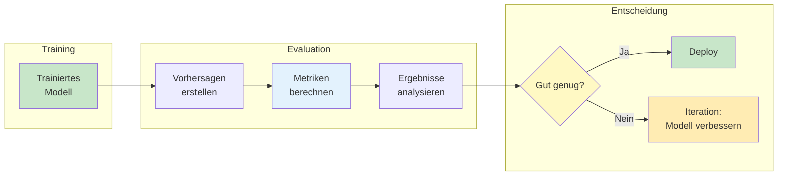
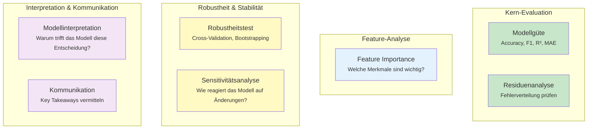
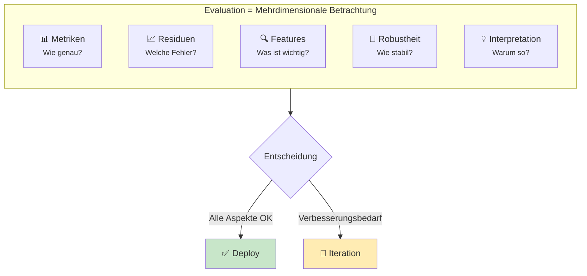

# Evaluation
{: .no_toc }

> **Modellbewertung ist der Teilprozess, der die Qualität der Vorhersagen eines ML-Systems quantifiziert und Möglichkeiten zur Leistungsverbesserung aufzeigt.**

---

## Inhaltsverzeichnis
{: .no_toc .text-delta }

1. TOC
{:toc}

---

## Überblick

Nach dem Training eines Modells stellt sich die entscheidende Frage: *Wie gut funktioniert es wirklich?* Die Evaluation liefert darauf fundierte Antworten. Sie misst die Leistung des trainierten Modells anhand der Qualität seiner Vorhersagen und hilft dabei, Stärken und Schwächen zu identifizieren.



---

## Zentrale Fragen der Evaluation

Die Modellbewertung beantwortet drei fundamentale Fragen:

| Frage | Was sie bedeutet | Konsequenz |
|-------|------------------|------------|
| **Wie gut funktioniert das Modell?** | Quantifizierung der Vorhersagegenauigkeit auf ungesehenen Daten | Objektive Leistungsmessung |
| **Ist das Modell gut genug für den Produktivbetrieb?** | Vergleich mit definierten Schwellenwerten oder Baseline-Modellen | Go/No-Go-Entscheidung |
| **Werden mehr Daten die Leistung verbessern?** | Analyse von Learning Curves und Generalisierungsverhalten | Strategieentscheidung für nächste Schritte |

> **Hinweis:** Die Evaluation erfolgt immer auf Daten, die das Modell während des Trainings *nicht* gesehen hat – typischerweise dem Test-Set.

---

## Good Practices der Evaluation

Eine gründliche Modellbewertung umfasst mehrere Perspektiven. Jede beleuchtet einen anderen Aspekt der Modellqualität:



### Bewertung der Modellgüte

Die Modellgüte wird durch aufgabenspezifische Metriken quantifiziert:

| Aufgabe | Typische Metriken |
|---------|-------------------|
| **Klassifikation** | Accuracy, Precision, Recall, F1-Score, AUC-ROC |
| **Regression** | R², MAE, MSE, RMSE |
| **Clustering** | Silhouetten-Koeffizient, Davies-Bouldin-Index |

### Residuenanalyse

Die Residuen (Differenz zwischen tatsächlichem und vorhergesagtem Wert) geben Aufschluss über systematische Fehler:

- **Zufällige Verteilung um Null** → Modell erfasst die Muster gut
- **Erkennbare Muster** → Hinweis auf nicht erfasste Zusammenhänge
- **Ausreißer** → Einzelne problematische Vorhersagen identifizieren

### Feature Importance / Selection

Welche Merkmale tragen am meisten zur Vorhersage bei?

- Irrelevante Features können entfernt werden
- Wichtige Features sollten besonders sorgfältig aufbereitet werden
- Interpretierbarkeit des Modells verbessern

### Robustheitstests

Prüfung, ob das Modell konsistente Ergebnisse liefert:

- **Cross-Validation:** Mehrfache Aufteilung der Daten
- **Bootstrapping:** Konfidenzintervalle für Metriken
- **Learning Curve:** Verhalten bei unterschiedlichen Datenmengen

### Sensitivitätsanalyse

Wie reagiert das Modell auf Veränderungen in den Eingabedaten?

- Partial Dependence Plots
- Ceteris-Paribus-Analysen
- Identifikation kritischer Feature-Bereiche

### Modellinterpretation

Ganzheitliche Analyse der Ergebnisse:

- Explorative Analyse der prognostizierten Werte
- Vergleich mit Domänenwissen
- Plausibilitätsprüfung der Vorhersagen

### Kommunikation der Ergebnisse

Zusammenfassung für Stakeholder:

- **Key Takeaways** klar formulieren
- Einschränkungen transparent machen
- Handlungsempfehlungen ableiten

---

## Evaluation-Techniken im Überblick

Die folgende Tabelle zeigt, welche Techniken für lokale (einzelne Vorhersagen) und globale (gesamtes Modell) Evaluation eingesetzt werden:

| Aspekt | Lokal (einzelne Vorhersage) | Global (gesamtes Modell) |
|--------|---------------------------|-------------------------|
| **Modellgüte** | Probability | Accuracy, F1-Score, Confusion Matrix, R², MAE, Silhouette-Koeffizient, Hyperparameter-Tuning |
| **Residuenanalyse** | Δ real / predicted | Δ real / predicted, Residual-Plots |
| **Feature Importance** | Break-Down-Analyse, Shapley Values | Feature Importance/Selection, Recursive Feature Elimination |
| **Robustheitstest** | Δ real / predicted, Ceteris-Paribus-Analyse | Cross-Validation, Bootstrapping, Learning Curve, Validation Curve, ROC, AUC |
| **Modellinterpretation** | Break-Down-Analyse, Shapley Values | Histogramm, Box-Plot, Scattergramm, Trees, Feature Importance |
| **Sensitivitätsanalyse** | Ceteris-Paribus-Analyse | Ceteris-Paribus-Profile (CDP), Accumulated Local Dependence Profile (ALDP), Partial Dependence Plot |
| **Kommunikation** | Best of above, keep it simple | Best of above, keep it simple |

---

## Praktische Umsetzung

Ein typischer Evaluations-Workflow in Python:

```python
from sklearn.metrics import accuracy_score, classification_report
from sklearn.metrics import confusion_matrix, ConfusionMatrixDisplay
import matplotlib.pyplot as plt

# Vorhersagen auf Test-Daten
y_pred = model.predict(X_test)

# Grundlegende Metriken
print("Accuracy:", accuracy_score(y_test, y_pred))
print("\nKlassifikationsbericht:")
print(classification_report(y_test, y_pred))

# Confusion Matrix visualisieren
cm = confusion_matrix(y_test, y_pred)
disp = ConfusionMatrixDisplay(confusion_matrix=cm)
disp.plot()
plt.title("Confusion Matrix")
plt.show()
```

---

## Zusammenfassung



Die Evaluation ist kein einmaliger Schritt, sondern ein iterativer Prozess. Die gewonnenen Erkenntnisse fließen zurück in die Modellentwicklung – sei es durch bessere Datenaufbereitung, andere Algorithmen oder optimierte Hyperparameter.

> **Merksatz:** Ein Modell ist erst dann gut, wenn es auch auf ungesehenen Daten zuverlässig funktioniert – und genau das prüft die Evaluation.

---

## Weiterführende Themen

- **Classification:** Confusion Matrix, ROC-Kurve, AUC
- **Regression:** R², MAE, Residual-Plots
- **Cross-Validation:** Robustere Modellbewertung
- **XAI (Explainable AI):** SHAP Values, LIME

---

*Referenzen:*
- Machine Learning Skript, Kapitel Evaluate (S. 60-62)
- scikit-learn Dokumentation: [Model Evaluation](https://scikit-learn.org/stable/modules/model_evaluation.html)
