# Deployment
{: .no_toc }

> **ML-Modelle produktiv bereitstellen: Von der Entwicklung zur Anwendung mit Gradio.**

---

# Inhaltsverzeichnis
{: .no_toc .text-delta }

1. TOC
{:toc}

---

## Einführung

Die Bereitstellung (Deployment) eines ML-Modells unterscheidet sich grundlegend von dessen Entwicklung. Während in der Entwicklungsphase Jupyter Notebooks und lokale Experimente ausreichen, erfordert der produktive Einsatz robuste, skalierbare Lösungen.


---

## Herausforderungen beim Deployment

Beim Übergang von der Entwicklung zur Produktion treten typische Herausforderungen auf:

### Technische Herausforderungen

| Herausforderung | Beschreibung | Lösungsansatz |
|-----------------|--------------|---------------|
| **Performance-Diskrepanz** | Modell verhält sich in Produktion anders als im Training | Umfangreiche Tests mit Produktionsdaten |
| **Ressourcenverbrauch** | Hoher Speicher- oder Rechenbedarf | Modelloptimierung, Quantisierung |
| **Latenz** | Zu lange Antwortzeiten | Caching, Batch-Processing, Hardware-Optimierung |
| **Skalierbarkeit** | Umgang mit vielen gleichzeitigen Anfragen | Load Balancing, Cloud-Deployment |

### Organisatorische Herausforderungen

| Herausforderung | Beschreibung | Lösungsansatz |
|-----------------|--------------|---------------|
| **Transparenz** | Nachvollziehbarkeit der Modellergebnisse | Explainable AI (XAI) Methoden |
| **Versionsverwaltung** | Tracking von Modell- und Datenversionen | MLflow, DVC |
| **Monitoring** | Überwachung der Modell-Performance | Alerting-Systeme, Drift-Detection |
| **Verantwortlichkeit** | Klare Zuständigkeiten für Produktionsbetrieb | MLOps-Prozesse etablieren |

```mermaid
flowchart TD
    subgraph "Deployment-Herausforderungen"
        A[ML-Modell] --> B{Bereit für<br/>Produktion?}
        
        B -->|Nein| C[Technische Probleme]
        B -->|Nein| D[Organisatorische Probleme]
        B -->|Ja| E[Deployment]
        
        C --> C1[Performance]
        C --> C2[Skalierbarkeit]
        C --> C3[Latenz]
        
        D --> D1[Transparenz]
        D --> D2[Monitoring]
        D --> D3[Verantwortlichkeit]
        
        C1 & C2 & C3 --> F[Lösung implementieren]
        D1 & D2 & D3 --> F
        F --> B
    end
    
    style E fill:#c8e6c9
    style B fill:#fff3e0
```



---

## Gradio: Schnelle Web-Interfaces für ML

Gradio ist ein Open-Source-Framework, das die Erstellung interaktiver Web-Anwendungen für ML-Modelle erheblich vereinfacht. Mit wenigen Codezeilen lassen sich Benutzeroberflächen erstellen, die Modelle demonstrieren und testen.

### Vorteile von Gradio

```mermaid
mindmap
  root((Gradio))
    Einfachheit
      Wenige Codezeilen
      Keine Frontend-Kenntnisse nötig
      Automatische UI-Generierung
    Flexibilität
      Viele Input-Typen
      Anpassbare Komponenten
      Custom CSS möglich
    Deployment
      Lokaler Server
      Hugging Face Spaces
      Cloud-Deployment
    Integration
      scikit-learn
      TensorFlow/Keras
      PyTorch
      Hugging Face
```



---

## Grundlegende Gradio-Interfaces

### Einfaches Beispiel: Textklassifikation

```python
import gradio as gr
from sklearn.feature_extraction.text import TfidfVectorizer
from sklearn.naive_bayes import MultinomialNB
import joblib

# Modell laden (vortrainiert)
model = joblib.load('sentiment_model.pkl')
vectorizer = joblib.load('tfidf_vectorizer.pkl')

def predict_sentiment(text):
    """Sentiment-Vorhersage für eingegebenen Text."""
    # Text vektorisieren
    text_vectorized = vectorizer.transform([text])
    
    # Vorhersage
    prediction = model.predict(text_vectorized)[0]
    probabilities = model.predict_proba(text_vectorized)[0]
    
    # Ergebnis formatieren
    labels = ['Negativ', 'Positiv']
    result = {label: float(prob) for label, prob in zip(labels, probabilities)}
    
    return result

# Gradio Interface erstellen
demo = gr.Interface(
    fn=predict_sentiment,
    inputs=gr.Textbox(
        label="Text eingeben",
        placeholder="Schreiben Sie hier Ihren Text...",
        lines=3
    ),
    outputs=gr.Label(
        label="Sentiment-Analyse",
        num_top_classes=2
    ),
    title="🎭 Sentiment-Analyse",
    description="Analysiert die Stimmung eines Textes (positiv/negativ).",
    examples=[
        ["Das Produkt ist großartig und übertrifft meine Erwartungen!"],
        ["Leider bin ich sehr enttäuscht von der Qualität."],
        ["Der Service war in Ordnung, nichts Besonderes."]
    ]
)

# App starten
demo.launch()
```

### Numerische Vorhersage: Hauspreise

```python
import gradio as gr
import numpy as np
import joblib

# Modell laden
model = joblib.load('house_price_model.pkl')
scaler = joblib.load('feature_scaler.pkl')

def predict_price(wohnflaeche, zimmer, baujahr, entfernung_zentrum):
    """Hauspreis-Vorhersage basierend auf Features."""
    # Features zusammenstellen
    features = np.array([[wohnflaeche, zimmer, baujahr, entfernung_zentrum]])
    
    # Skalierung anwenden
    features_scaled = scaler.transform(features)
    
    # Vorhersage
    prediction = model.predict(features_scaled)[0]
    
    return f"Geschätzter Preis: {prediction:,.0f} €"

# Interface mit mehreren Inputs
demo = gr.Interface(
    fn=predict_price,
    inputs=[
        gr.Slider(30, 300, value=100, step=5, label="Wohnfläche (m²)"),
        gr.Slider(1, 10, value=4, step=1, label="Anzahl Zimmer"),
        gr.Slider(1900, 2024, value=2000, step=1, label="Baujahr"),
        gr.Slider(0, 50, value=10, step=1, label="Entfernung zum Zentrum (km)")
    ],
    outputs=gr.Textbox(label="Preisschätzung"),
    title="🏠 Hauspreis-Schätzer",
    description="Schätzt den Verkaufspreis einer Immobilie basierend auf den Eigenschaften."
)

demo.launch()
```

---

## Fortgeschrittene Gradio-Komponenten

### Bildklassifikation

```python
import gradio as gr
from tensorflow.keras.models import load_model
from tensorflow.keras.preprocessing import image
import numpy as np

# Modell laden
model = load_model('image_classifier.h5')
class_names = ['Katze', 'Hund', 'Vogel']

def classify_image(img):
    """Klassifiziert ein hochgeladenes Bild."""
    # Bild vorverarbeiten
    img_resized = img.resize((224, 224))
    img_array = np.array(img_resized) / 255.0
    img_batch = np.expand_dims(img_array, axis=0)
    
    # Vorhersage
    predictions = model.predict(img_batch)[0]
    
    # Ergebnis als Dictionary
    return {name: float(pred) for name, pred in zip(class_names, predictions)}

demo = gr.Interface(
    fn=classify_image,
    inputs=gr.Image(type="pil", label="Bild hochladen"),
    outputs=gr.Label(num_top_classes=3, label="Klassifikation"),
    title="🖼️ Bildklassifikation",
    description="Erkennt Tiere in hochgeladenen Bildern."
)

demo.launch()
```

### Mehrere Ein- und Ausgaben

```python
import gradio as gr
import pandas as pd
import matplotlib.pyplot as plt
import io
import base64

def analyze_data(file, column_name, chart_type):
    """Analysiert CSV-Daten und erstellt Visualisierung."""
    # Daten laden
    df = pd.read_csv(file.name)
    
    # Statistiken berechnen
    stats = df[column_name].describe().to_string()
    
    # Diagramm erstellen
    fig, ax = plt.subplots(figsize=(8, 5))
    
    if chart_type == "Histogramm":
        df[column_name].hist(ax=ax, bins=20, edgecolor='black')
    elif chart_type == "Boxplot":
        df.boxplot(column=column_name, ax=ax)
    elif chart_type == "Liniendiagramm":
        df[column_name].plot(ax=ax)
    
    ax.set_title(f'{chart_type} von {column_name}')
    plt.tight_layout()
    
    return stats, fig

demo = gr.Interface(
    fn=analyze_data,
    inputs=[
        gr.File(label="CSV-Datei hochladen", file_types=[".csv"]),
        gr.Textbox(label="Spaltenname"),
        gr.Radio(
            choices=["Histogramm", "Boxplot", "Liniendiagramm"],
            label="Diagrammtyp",
            value="Histogramm"
        )
    ],
    outputs=[
        gr.Textbox(label="Statistiken"),
        gr.Plot(label="Visualisierung")
    ],
    title="📊 Datenanalyse-Tool",
    description="Lädt CSV-Daten und erstellt Analysen mit Visualisierungen."
)

demo.launch()
```

---

## Gradio Blocks: Komplexere Layouts

Für anspruchsvollere Interfaces bietet Gradio die `Blocks`-API:

```python
import gradio as gr
import joblib
import numpy as np

# Modelle laden
classifier = joblib.load('classifier.pkl')
regressor = joblib.load('regressor.pkl')

def classify(features):
    prediction = classifier.predict([features])[0]
    proba = classifier.predict_proba([features])[0]
    return f"Klasse: {prediction}", f"Konfidenz: {max(proba):.1%}"

def regress(features):
    prediction = regressor.predict([features])[0]
    return f"Vorhersage: {prediction:.2f}"

# Blocks Interface
with gr.Blocks(title="ML Dashboard") as demo:
    gr.Markdown("# 🤖 Machine Learning Dashboard")
    gr.Markdown("Wählen Sie ein Modell und geben Sie die Features ein.")
    
    with gr.Tabs():
        # Tab 1: Klassifikation
        with gr.TabItem("Klassifikation"):
            with gr.Row():
                with gr.Column():
                    clf_input1 = gr.Slider(0, 10, label="Feature 1")
                    clf_input2 = gr.Slider(0, 10, label="Feature 2")
                    clf_input3 = gr.Slider(0, 10, label="Feature 3")
                    clf_btn = gr.Button("Klassifizieren", variant="primary")
                
                with gr.Column():
                    clf_output1 = gr.Textbox(label="Ergebnis")
                    clf_output2 = gr.Textbox(label="Konfidenz")
            
            clf_btn.click(
                fn=lambda f1, f2, f3: classify([f1, f2, f3]),
                inputs=[clf_input1, clf_input2, clf_input3],
                outputs=[clf_output1, clf_output2]
            )
        
        # Tab 2: Regression
        with gr.TabItem("Regression"):
            with gr.Row():
                with gr.Column():
                    reg_input1 = gr.Number(label="Feature 1")
                    reg_input2 = gr.Number(label="Feature 2")
                    reg_btn = gr.Button("Vorhersagen", variant="primary")
                
                with gr.Column():
                    reg_output = gr.Textbox(label="Ergebnis")
            
            reg_btn.click(
                fn=lambda f1, f2: regress([f1, f2]),
                inputs=[reg_input1, reg_input2],
                outputs=reg_output
            )
    
    gr.Markdown("---")
    gr.Markdown("*Powered by Gradio & scikit-learn*")

demo.launch()
```


---

## Deployment-Optionen für Gradio

### Lokales Deployment

```python
# Standardmäßig auf localhost:7860
demo.launch()

# Mit spezifischem Port
demo.launch(server_port=8080)

# Im Netzwerk verfügbar machen
demo.launch(server_name="0.0.0.0", server_port=8080)

# Mit Authentifizierung
demo.launch(auth=("username", "password"))
```

### Hugging Face Spaces

Die einfachste Möglichkeit, Gradio-Apps öffentlich bereitzustellen:

```python
# app.py für Hugging Face Spaces
import gradio as gr

def greet(name):
    return f"Hallo {name}!"

demo = gr.Interface(fn=greet, inputs="text", outputs="text")

# Wichtig: Kein demo.launch() am Ende für Spaces
```

**Schritte:**
1. Account auf huggingface.co erstellen
2. Neuen Space erstellen (Gradio SDK wählen)
3. `app.py` und `requirements.txt` hochladen
4. Space wird automatisch deployed

### Docker Deployment

```dockerfile
# Dockerfile
FROM python:3.10-slim

WORKDIR /app

COPY requirements.txt .
RUN pip install --no-cache-dir -r requirements.txt

COPY . .

EXPOSE 7860

CMD ["python", "app.py"]
```

```python
# app.py für Docker
import gradio as gr

# ... Interface Definition ...

demo.launch(server_name="0.0.0.0", server_port=7860)
```

---


## Best Practices für Gradio-Deployment

### Code-Organisation


### Checkliste für Deployment

| Aspekt | Empfehlung |
|--------|------------|
| **Modell-Serialisierung** | `joblib` für scikit-learn, `model.save()` für Keras |
| **Fehlerbehandlung** | Try-Except in Prediction-Funktionen |
| **Input-Validierung** | Grenzwerte für Slider, Typenprüfung |
| **Dokumentation** | Klare Beschreibungen, Beispiele |
| **Performance** | Caching für aufwendige Berechnungen |
| **Sicherheit** | Authentifizierung bei sensiblen Daten |

### Häufige Fehler vermeiden

> **Tipp: Modell nicht im Interface trainieren**
>
> Trainieren Sie Modelle separat und laden Sie nur das fertige Modell 
> in die Gradio-App. Dies verbessert Startzeit und Zuverlässigkeit.

```python
# ❌ Falsch: Training in der App
def predict(text):
    model = train_model()  # Jedes Mal neu trainieren
    return model.predict(text)

# ✅ Richtig: Vortrainiertes Modell laden
model = joblib.load('model.pkl')  # Einmal beim Start

def predict(text):
    return model.predict(text)
```

---

## Zusammenfassung

Gradio ermöglicht die schnelle Erstellung von Web-Interfaces für ML-Modelle:


**Kernpunkte:**
- **Einfache Syntax:** Wenige Zeilen Code für funktionale Interfaces
- **Flexible Komponenten:** Slider, Textfelder, Bilder, Dateien
- **Blocks API:** Für komplexere Layouts mit Tabs und Spalten
- **Deployment-Optionen:** Lokal, Hugging Face Spaces, Docker

---

## Weiterführende Ressourcen

- [Gradio Dokumentation](https://gradio.app/docs/)
- [Hugging Face Spaces](https://huggingface.co/spaces)
- [Gradio GitHub Repository](https://github.com/gradio-app/gradio)

---

**Version:** 1.0    
**Stand:** Januar 2026    
**Kurs:** Machine Learning. Verstehen. Anwenden. Gestalten.    
