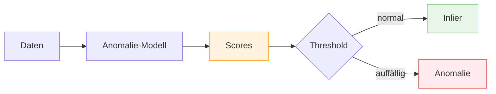
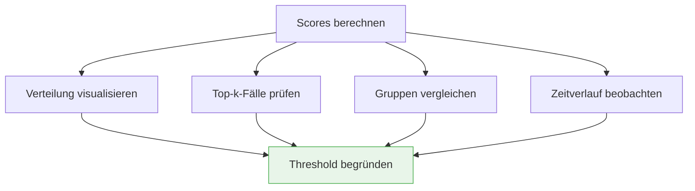

# Bewertung: Anomalieerkennung
{: .no_toc }

> **Anomalieerkennung bewertet nicht nur Klassen, sondern vor allem Auffälligkeitswerte.**    
> Ein Modell liefert meist zuerst einen Score pro Datenpunkt. Erst ein Schwellenwert macht daraus die Entscheidung "normal" oder "anomal".

---

## Inhaltsverzeichnis
{: .no_toc .text-delta }

1. TOC
{:toc}

---

## Grundidee

Bei Anomalieerkennung ist die Evaluation schwieriger als bei klassischer Klassifikation. Häufig gibt es keine vollständigen Labels, und der Anteil echter Anomalien ist klein. Deshalb stehen drei Fragen im Mittelpunkt:

| Frage | Bedeutung |
|-------|-----------|
| **Wie auffällig ist ein Punkt?** | Das Modell berechnet einen kontinuierlichen Score. |
| **Ab wann gilt ein Punkt als anomal?** | Ein Threshold übersetzt Scores in Labels. |
| **Sind die markierten Fälle fachlich plausibel?** | Top-Fälle müssen oft manuell oder fachlich geprüft werden. |


```mermaid
flowchart LR
    D["Daten"] --> M["Anomalie-Modell"]
    M --> S["Scores"]
    S --> T{"Threshold"}
    T -->|"normal"| N["Inlier"]
    T -->|"auffällig"| A["Anomalie"]
    
    style S fill:#fff3e0,stroke:#ff9800
    style N fill:#e8f5e9,stroke:#4caf50
    style A fill:#ffebee,stroke:#f44336
```

---

## Anomalie-Scores berechnen

Viele scikit-learn-Modelle für Anomalieerkennung stellen eine Methode `decision_function` bereit. Für Isolation Forest sieht der typische Schritt so aus:

```python
# Anomalie-Scores berechnen
scores = model.decision_function(data)
```

Diese Zeile berechnet für jede Zeile in `data` einen numerischen Score.

Wichtig bei `IsolationForest` in scikit-learn:

| Score | Interpretation |
|-------|----------------|
| **Großer positiver Wert** | Datenpunkt wirkt normaler |
| **Wert nahe 0** | Datenpunkt liegt nahe an der Entscheidungsgrenze |
| **Negativer Wert** | Datenpunkt wird als auffällig bzw. anomal eingestuft |

Das ist eine häufige Stolperfalle: Bei `decision_function` bedeutet **größer nicht stärker anomal**, sondern stärker auf der normalen Seite der Entscheidungsgrenze. Wenn für Visualisierungen ein "Anomaly Score" gebraucht wird, bei dem höhere Werte auffälliger sind, kann man das Vorzeichen drehen:

```python
# Höherer Wert = auffälliger
anomaly_scores = -model.decision_function(data)
```

### Zusammenhang mit `predict`

`predict` erzeugt direkt Klassenlabels:

```python
labels = model.predict(data)
```

Bei `IsolationForest` gilt:

| Label | Bedeutung |
|-------|-----------|
| `1` | Inlier, also normaler Datenpunkt |
| `-1` | Outlier, also auffälliger Datenpunkt |

`decision_function` ist für Analyse und Ranking meist hilfreicher als `predict`, weil Scores zeigen, **wie stark** ein Punkt auffällt.

---

## Score-Verteilung interpretieren

Eine sinnvolle Auswertung beginnt oft mit der Score-Verteilung:

```python
import pandas as pd

result = pd.DataFrame(data).copy()
result["score"] = model.decision_function(data)
result["anomaly_score"] = -result["score"]
result["label"] = model.predict(data)

top_anomalies = result.sort_values("anomaly_score", ascending=False).head(10)
```

Typische Prüfungen:

| Prüfung | Zweck |
|---------|-------|
| **Histogramm der Scores** | Erkennen, ob es eine klare Trennung oder nur fließende Übergänge gibt |
| **Top-k-Anomalien** | Die auffälligsten Fälle fachlich prüfen |
| **Score pro Segment** | Prüfen, ob bestimmte Gruppen systematisch häufiger markiert werden |
| **Zeitlicher Verlauf** | Monitoring: Drift, neue Muster oder Alarmhäufungen erkennen |


```mermaid
flowchart TD
    S["Scores berechnen"] --> H["Verteilung visualisieren"]
    S --> K["Top-k-Fälle prüfen"]
    S --> G["Gruppen vergleichen"]
    S --> Z["Zeitverlauf beobachten"]
    
    H --> E["Threshold begründen"]
    K --> E
    G --> E
    Z --> E
    
    style E fill:#e8f5e9,stroke:#4caf50
```

---

## Bewertung mit Labels

Wenn bekannte Anomalien vorhanden sind, kann Anomalieerkennung wie eine stark unbalancierte Klassifikation bewertet werden.

| Metrik | Aussage |
|--------|---------|
| **Precision** | Wie viele markierte Anomalien sind wirklich anomal? |
| **Recall** | Wie viele echte Anomalien wurden gefunden? |
| **F1-Score** | Balance aus Precision und Recall |
| **PR-AUC** | Besonders hilfreich bei seltenen Anomalien |
| **ROC-AUC** | Trennfähigkeit über verschiedene Thresholds |

Bei seltenen Anomalien ist **PR-AUC** oft aussagekräftiger als ROC-AUC, weil sie stärker auf die Qualität der positiven Treffer fokussiert.

```python
from sklearn.metrics import precision_score, recall_score, f1_score, average_precision_score

# Beispiel: y_true enthält 1 für Anomalie und 0 für normal
anomaly_scores = -model.decision_function(data)
y_pred = (model.predict(data) == -1).astype(int)

precision = precision_score(y_true, y_pred)
recall = recall_score(y_true, y_pred)
f1 = f1_score(y_true, y_pred)
pr_auc = average_precision_score(y_true, anomaly_scores)
```

---

## Bewertung ohne Labels

Ohne Labels ist keine echte Genauigkeitsmessung möglich. Dann geht es um Plausibilität, Stabilität und Kosten der Fehlalarme.

| Ansatz | Leitfrage |
|--------|-----------|
| **Top-k-Review** | Sind die auffälligsten Fälle fachlich nachvollziehbar? |
| **Stabilitätstest** | Bleiben Top-Anomalien bei anderen Stichproben ähnlich? |
| **Sensitivität gegen Threshold** | Wie stark ändert sich die Anzahl der Alarme? |
| **Vergleich mit Regeln** | Findet das Modell bekannte Grenzfälle wieder? |
| **Alarmrate** | Ist die Menge der gemeldeten Fälle praktisch bearbeitbar? |

> **Praxisregel:** Ohne Labels sollte das Ergebnis nicht als "richtig" verkauft werden. Es ist eine priorisierte Liste auffälliger Fälle, die fachlich geprüft werden muss.

---

## Threshold wählen

Der Threshold bestimmt, wie viele Punkte als Anomalien gelten. Bei `IsolationForest` wird er stark durch `contamination` beeinflusst.

| Strategie | Geeignet wenn |
|-----------|---------------|
| **Fester Anteil** | Eine realistische erwartete Anomalierate bekannt ist |
| **Top-k-Auswahl** | Nur eine begrenzte Zahl Fälle geprüft werden kann |
| **Kostenbasierter Threshold** | False Positives und False Negatives unterschiedlich teuer sind |
| **Validierungslabels** | Einige bestätigte Anomalien vorhanden sind |

```python
import numpy as np

anomaly_scores = -model.decision_function(data)

# Beispiel: die auffälligsten 2 Prozent markieren
threshold = np.quantile(anomaly_scores, 0.98)
y_pred = (anomaly_scores >= threshold).astype(int)
```

---

## Häufige Fehler

| Fehler | Problem | Besser |
|--------|---------|--------|
| `decision_function` falsch herum interpretieren | Bei Isolation Forest sind niedrigere Werte auffälliger | Für Anomaly-Ranking `-decision_function(...)` nutzen |
| Nur `predict` betrachten | Stärke der Auffälligkeit geht verloren | Scores zusätzlich speichern und sortieren |
| Threshold nicht dokumentieren | Ergebnisse sind nicht reproduzierbar begründet | `contamination`, Quantil oder Kostenlogik festhalten |
| Accuracy verwenden | Bei seltenen Anomalien fast immer irreführend | Precision, Recall, PR-AUC oder Top-k-Review nutzen |
| Anomalien automatisch löschen | Echte Sonderfälle oder Betrugssignale gehen verloren | Erst prüfen, markieren und fachlich entscheiden |

## Abgrenzung zu verwandten Dokumenten

| Dokument | Frage |
|---|---|
| [Isolation Forest](../modeling/isolation-forest.html) | Wie funktioniert das Modell, das die Scores erzeugt? |
| [Outlier](../prepare/outlier.html) | Wie werden Ausreißer vor oder nach der Erkennung behandelt? |
| [Bewertung Klassifizierung](./bewertung_klassifizierung.html) | Welche Metriken gelten, wenn Anomalien als Klassenlabels vorliegen? |
| [Bewertung Clustering](./bewertung_clustering.html) | Wie wird eine Gruppierung bewertet, nicht ein Anomaly Ranking? |

---

**Version:** 1.0<br>
**Stand:** Mai 2026<br>
**Kurs:** Machine Learning. Verstehen. Anwenden. Gestalten.
