# Anomalie-Erkennung
{: .no_toc }

> **Anomalie-Erkennung identifiziert Datenpunkte, die signifikant vom erwarteten Muster abweichen.**    
> Der Anomalie-Score quantifiziert dabei, wie untypisch ein Datenpunkt im Vergleich zum Rest des Datensatzes ist.

---

# Inhaltsverzeichnis
{: .no_toc .text-delta }

1. TOC
{:toc}

---

## Der Anomalie-Score

Der Anomalie-Score bewertet quantitativ, wie anomal oder atypisch ein bestimmter Datenpunkt im Vergleich zum Rest des Datensatzes ist.

### Interpretation der Werte

| Score-Bereich | Interpretation | Bedeutung |
|:-------------:|:---------------|:----------|
| **nahe -1** | Sehr wahrscheinlich anomal | Datenpunkt weicht stark vom Rest ab |
| **nahe 0** | Grenzfall | Datenpunkt liegt an der Entscheidungsgrenze |
| **nahe +1** | Sehr wahrscheinlich normal | Datenpunkt passt gut zum Rest der Daten |

> **Hinweis:** Die exakte Score-Interpretation hängt vom verwendeten Algorithmus ab. Bei verschiedenen Anomalie-Erkennungsverfahren werden unterschiedliche Bewertungsskalen verwendet.

### Visualisierung des Konzepts

```mermaid
flowchart LR
    subgraph Score["Anomalie-Score Skala"]
        direction LR
        A["🔴 -1<br>Anomal"] ~~~ M["⚪ 0<br>Grenzfall"] ~~~ N["🟢 +1<br>Normal"]
    end
    
    style A fill:#ff6b6b,stroke:#c92a2a,color:#fff
    style M fill:#ced4da,stroke:#868e96,color:#000
    style N fill:#51cf66,stroke:#2f9e44,color:#fff
```



---

## Algorithmen zur Anomalie-Erkennung

Für die praktische Implementierung von Anomalie-Erkennung eignet sich besonders **DBSCAN** (Density-Based Spatial Clustering of Applications with Noise).

> **DBSCAN** identifiziert automatisch Rauschpunkte (Noise), die als Anomalien interpretiert werden können. Der Algorithmus klassifiziert Datenpunkte als:
> - **Core Points**: Punkte in dichten Bereichen
> - **Border Points**: Punkte am Rand von Clustern
> - **Noise Points**: Isolierte Punkte = **Anomalien**

Für eine detaillierte Beschreibung und Implementierung siehe: [K-Means & DBSCAN Dokumentation](../modeling/kmeans-dbscan)

### Beispiel: DBSCAN für Anomalie-Erkennung

```python
import numpy as np
from sklearn.cluster import DBSCAN
from sklearn.preprocessing import StandardScaler

# Beispieldaten generieren
np.random.seed(42)
# Normale Daten: Cluster um (0, 0)
data_normal = np.random.randn(200, 2)
# Anomalien: verstreute Punkte
data_anomalies = np.random.uniform(low=-4, high=4, size=(20, 2))
data = np.vstack([data_normal, data_anomalies])

# Daten skalieren
scaler = StandardScaler()
data_scaled = scaler.fit_transform(data)

# DBSCAN anwenden
model = DBSCAN(eps=0.3, min_samples=5)
predictions = model.fit_predict(data_scaled)

# -1 = Anomalie (Noise), andere Werte = Cluster
n_anomalies = (predictions == -1).sum()
n_clusters = len(set(predictions)) - (1 if -1 in predictions else 0)

print(f"Erkannte Cluster: {n_clusters}")
print(f"Erkannte Anomalien (Noise): {n_anomalies}")
```

### Wichtige Hyperparameter (DBSCAN)

| Parameter | Beschreibung | Typische Werte |
|:----------|:-------------|:---------------|
| `eps` | Radius für Nachbarsuche | 0.3-1.0 (abhängig von Skalierung) |
| `min_samples` | Minimale Punkte für Core Point | 5-10 |
| `metric` | Distanzmetrik | 'euclidean', 'manhattan' |


## Evaluation

### Metriken für Anomalie-Erkennung

Da Anomalie-Erkennung oft unüberwacht erfolgt, ist die Evaluation herausfordernd. Bei vorhandenen Labels können folgende Metriken verwendet werden:

```python
from sklearn.metrics import classification_report, confusion_matrix
import seaborn as sns

# Bei bekannten Labels (target_true: 1=normal, -1=anomalie)
print(classification_report(target_true, predictions,
                           target_names=['Anomalie', 'Normal']))

# Confusion Matrix
cm = confusion_matrix(target_true, predictions)
sns.heatmap(cm, annot=True, fmt='d', cmap='Blues',
            xticklabels=['Anomalie', 'Normal'],
            yticklabels=['Anomalie', 'Normal'])
plt.xlabel('Vorhersage')
plt.ylabel('Tatsächlich')
plt.title('Confusion Matrix - Anomalie-Erkennung')
plt.show()
```

### Silhouette-Score für Clustering-Qualität

```python
from sklearn.metrics import silhouette_score

# Bei DBSCAN: Nur nicht-Noise-Punkte bewerten
mask = predictions != -1
if mask.sum() > 1 and len(set(predictions[mask])) > 1:
    score = silhouette_score(data_scaled[mask], predictions[mask])
    print(f"Silhouette Score (ohne Noise): {score:.3f}")
```

---


## Best Practices

### Empfehlungen für die Praxis

1. **Parameter-Tuning:** Nutze den k-Distanz-Graph zur Bestimmung von `eps` bei DBSCAN

2. **Feature-Skalierung:** Standardisiere Features vor der Anwendung (essentiell bei distanzbasierten Methoden)

3. **Mehrere Algorithmen testen:** Vergleiche DBSCAN mit anderen Methoden wie One-Class SVM oder Local Outlier Factor

4. **Visualisierung:** Plotte die Ergebnisse, um Anomalien visuell zu validieren

5. **Ergebnisse validieren:** Lass Domänenexperten die erkannten Anomalien prüfen

### Häufige Fallstricke

> **Vorsicht vor Überinterpretation:** Nicht jede erkannte Anomalie ist problematisch. Manche "Anomalien" sind einfach seltene, aber valide Datenpunkte.

```mermaid
flowchart TD
    A[Anomalie erkannt] --> B{Domänenexperte<br>prüfen}
    B --> |"Tatsächliche Anomalie"| C[Aktion einleiten]
    B --> |"Seltener, aber valider Fall"| D[In Modell aufnehmen]
    B --> |"Datenfehler"| E[Daten korrigieren]
    
    style A fill:#ff6b6b,stroke:#c92a2a,color:#fff
    style C fill:#ffd43b,stroke:#fab005,color:#000
    style D fill:#51cf66,stroke:#2f9e44,color:#fff
    style E fill:#748ffc,stroke:#4c6ef5,color:#fff
```




---

## Zusammenfassung

- **Anomalie-Erkennung** identifiziert untypische Datenpunkte im Vergleich zum Normalverhalten
- **Drei Anomalie-Typen:** Punkt-, kontextuelle und kollektive Anomalien
- **Anomalie-Score:** Quantifiziert die Abweichung vom normalen Verhalten
- **DBSCAN:** Dichtebasierter Algorithmus, der Anomalien als Rauschpunkte (Noise) automatisch identifiziert
- **Wichtig:** Domänenwissen für Parameter-Wahl und Ergebnisvalidierung nutzen

---

**Version:** 1.0    
**Stand:** Januar 2026    
**Kurs:** Machine Learning. Verstehen. Anwenden. Gestalten.    
