# Anomalie-Erkennung
{: .no_toc }

> **Anomalie-Erkennung identifiziert Datenpunkte, die signifikant vom erwarteten Muster abweichen.**    
> Der Anomalie-Score quantifiziert dabei, wie untypisch ein Datenpunkt im Vergleich zum Rest des Datensatzes ist.

---

# Inhaltsverzeichnis
{: .no_toc .text-delta }

1. TOC
{:toc}

---

## Was ist Anomalie-Erkennung?

Anomalie-Erkennung ist ein Verfahren des unüberwachten Lernens, das Datensätze identifiziert, die für die gesamte Datenbasis untypisch sind. Anomalien – auch als Ausreißer oder Outliers bezeichnet – weichen signifikant vom normalen Verhalten ab.

```mermaid
flowchart LR
    subgraph Datensatz
        N1[Normal] 
        N2[Normal]
        N3[Normal]
        N4[Normal]
        A1[🔴 Anomalie]
    end
    
    N1 & N2 & N3 & N4 --> C[Cluster normaler Daten]
    A1 -.-> |"stark abweichend"| C
    
    style A1 fill:#ff6b6b,stroke:#c92a2a,color:#fff
    style C fill:#51cf66,stroke:#2f9e44,color:#fff
```



---

## Anomalie-Typen

Anomalien lassen sich in drei grundlegende Kategorien einteilen:

### Punkt-/Globale Anomalien

Ein einzelner Datenpunkt, der in Bezug auf den gesamten Datensatz als anomal zu klassifizieren ist.

**Beispiel:** Eine einzelne Transaktion von 50.000 € bei einem Kunden mit durchschnittlichen Transaktionen von 100 €.

### Kontextuelle Anomalien

Ein Datenpunkt, der nur in einem bestimmten Kontext anomal erscheint.

**Beispiel:** Eine Außentemperatur von +30°C im Dezember in Deutschland ist anomal, im Juli jedoch normal.

### Kollektive Anomalien

Eine Menge verwandter Datenpunkte ist gemeinsam anomal, obwohl einzelne Punkte normal erscheinen können.

**Beispiel:** Kreditkartendaten zeigen Käufe in den USA und Frankreich zur gleichen Zeit – einzeln normal, zusammen verdächtig.

```mermaid
flowchart TD
    A[Anomalie-Typen] --> P[Punkt-Anomalie]
    A --> K[Kontextuelle Anomalie]
    A --> C[Kollektive Anomalie]
    
    P --> PE["Einzelner extremer Wert<br>z.B. ungewöhnlich hohe Transaktion"]
    K --> KE["Kontext-abhängig anomal<br>z.B. 30°C im Winter"]
    C --> CE["Gruppe gemeinsam anomal<br>z.B. gleichzeitige Käufe in verschiedenen Ländern"]
    
    style P fill:#e7f5ff,stroke:#1971c2
    style K fill:#fff3bf,stroke:#f59f00
    style C fill:#ffe3e3,stroke:#fa5252
```



---

## Der Anomalie-Score

Der Anomalie-Score bewertet quantitativ, wie anomal oder atypisch ein bestimmter Datenpunkt im Vergleich zum Rest des Datensatzes ist.

### Interpretation der Werte

| Score-Bereich | Interpretation | Bedeutung |
|:-------------:|:---------------|:----------|
| **nahe -1** | Sehr wahrscheinlich anomal | Datenpunkt weicht stark vom Rest ab |
| **nahe 0** | Grenzfall | Datenpunkt liegt an der Entscheidungsgrenze |
| **nahe +1** | Sehr wahrscheinlich normal | Datenpunkt passt gut zum Rest der Daten |

> **Hinweis:** Die exakte Score-Interpretation hängt vom verwendeten Algorithmus ab. Bei scikit-learn's `IsolationForest` werden normale Punkte mit +1 und Anomalien mit -1 gekennzeichnet.

### Visualisierung des Konzepts

```mermaid
flowchart LR
    subgraph Score["Anomalie-Score Skala"]
        direction LR
        A["🔴 -1<br>Anomal"] ~~~ M["⚪ 0<br>Grenzfall"] ~~~ N["🟢 +1<br>Normal"]
    end
    
    style A fill:#ff6b6b,stroke:#c92a2a,color:#fff
    style M fill:#ced4da,stroke:#868e96,color:#000
    style N fill:#51cf66,stroke:#2f9e44,color:#fff
```



---


## Praktische Implementierung

### Grundlegende Anwendung

```python
import numpy as np
import pandas as pd
from sklearn.ensemble import IsolationForest
import matplotlib.pyplot as plt

# Beispieldaten generieren
np.random.seed(42)
# Normale Daten: Cluster um (0, 0)
X_normal = np.random.randn(200, 2)
# Anomalien: verstreute Punkte
X_anomalies = np.random.uniform(low=-4, high=4, size=(20, 2))
X = np.vstack([X_normal, X_anomalies])

# Isolation Forest erstellen und trainieren
iso_forest = IsolationForest(
    n_estimators=100,      # Anzahl der Bäume
    contamination=0.1,     # Erwarteter Anteil Anomalien
    random_state=42
)

# Vorhersage: 1 = normal, -1 = Anomalie
predictions = iso_forest.fit_predict(X)

# Anomalie-Scores abrufen (negativ = anomaler)
scores = iso_forest.decision_function(X)

print(f"Erkannte Anomalien: {(predictions == -1).sum()}")
print(f"Score-Bereich: {scores.min():.3f} bis {scores.max():.3f}")
```

### Wichtige Hyperparameter

| Parameter | Beschreibung | Typische Werte |
|:----------|:-------------|:---------------|
| `n_estimators` | Anzahl der Bäume im Ensemble | 100-200 |
| `contamination` | Erwarteter Anteil Anomalien | 0.01-0.1 (1%-10%) |
| `max_samples` | Stichprobengröße pro Baum | 'auto' oder Anzahl |
| `max_features` | Features pro Baum | 1.0 (alle) |

### Visualisierung der Ergebnisse

```python
import matplotlib.pyplot as plt

# Visualisierung
fig, axes = plt.subplots(1, 2, figsize=(14, 5))

# Links: Klassifikation
colors = ['#51cf66' if p == 1 else '#ff6b6b' for p in predictions]
axes[0].scatter(X[:, 0], X[:, 1], c=colors, alpha=0.7, edgecolors='white')
axes[0].set_title('Anomalie-Erkennung')
axes[0].set_xlabel('Feature 1')
axes[0].set_ylabel('Feature 2')

# Legende hinzufügen
from matplotlib.patches import Patch
legend_elements = [
    Patch(facecolor='#51cf66', label='Normal'),
    Patch(facecolor='#ff6b6b', label='Anomalie')
]
axes[0].legend(handles=legend_elements)

# Rechts: Anomalie-Scores
scatter = axes[1].scatter(X[:, 0], X[:, 1], c=scores, cmap='RdYlGn', alpha=0.7)
axes[1].set_title('Anomalie-Scores')
axes[1].set_xlabel('Feature 1')
axes[1].set_ylabel('Feature 2')
plt.colorbar(scatter, ax=axes[1], label='Score (niedriger = anomaler)')

plt.tight_layout()
plt.show()
```

## Evaluation

### Metriken für Anomalie-Erkennung

Da Anomalie-Erkennung oft unüberwacht erfolgt, ist die Evaluation herausfordernd. Bei vorhandenen Labels können folgende Metriken verwendet werden:

```python
from sklearn.metrics import classification_report, confusion_matrix
import seaborn as sns

# Bei bekannten Labels (y_true: 1=normal, -1=anomalie)
print(classification_report(y_true, predictions, 
                           target_names=['Anomalie', 'Normal']))

# Confusion Matrix
cm = confusion_matrix(y_true, predictions)
sns.heatmap(cm, annot=True, fmt='d', cmap='Blues',
            xticklabels=['Anomalie', 'Normal'],
            yticklabels=['Anomalie', 'Normal'])
plt.xlabel('Vorhersage')
plt.ylabel('Tatsächlich')
plt.title('Confusion Matrix - Anomalie-Erkennung')
plt.show()
```

### ROC-Kurve mit Anomalie-Scores

```python
from sklearn.metrics import roc_curve, roc_auc_score

# Scores für ROC (invertieren, da niedrigere Scores = anomaler)
scores_for_roc = -iso_forest.decision_function(X_test)

fpr, tpr, thresholds = roc_curve(y_true_binary, scores_for_roc)
auc_score = roc_auc_score(y_true_binary, scores_for_roc)

plt.figure(figsize=(8, 6))
plt.plot(fpr, tpr, label=f'Isolation Forest (AUC = {auc_score:.3f})')
plt.plot([0, 1], [0, 1], 'k--', label='Zufall')
plt.xlabel('False Positive Rate')
plt.ylabel('True Positive Rate')
plt.title('ROC-Kurve - Anomalie-Erkennung')
plt.legend()
plt.show()
```

---


## Best Practices

### Empfehlungen für die Praxis

1. **Contamination schätzen:** Nutze Domänenwissen, um den erwarteten Anomalie-Anteil realistisch einzuschätzen

2. **Feature-Skalierung:** Standardisiere Features vor der Anwendung, besonders bei unterschiedlichen Wertebereichen

3. **Mehrere Algorithmen testen:** Vergleiche Isolation Forest mit anderen Methoden wie One-Class SVM oder Autoencoder

4. **Schwellenwert anpassen:** Der Standard-Schwellenwert ist nicht immer optimal – experimentiere mit verschiedenen Werten

5. **Ergebnisse validieren:** Lass Domänenexperten die erkannten Anomalien prüfen

### Häufige Fallstricke

> **Vorsicht vor Überinterpretation:** Nicht jede erkannte Anomalie ist problematisch. Manche "Anomalien" sind einfach seltene, aber valide Datenpunkte.

```mermaid
flowchart TD
    A[Anomalie erkannt] --> B{Domänenexperte<br>prüfen}
    B --> |"Tatsächliche Anomalie"| C[Aktion einleiten]
    B --> |"Seltener, aber valider Fall"| D[In Modell aufnehmen]
    B --> |"Datenfehler"| E[Daten korrigieren]
    
    style A fill:#ff6b6b,stroke:#c92a2a,color:#fff
    style C fill:#ffd43b,stroke:#fab005,color:#000
    style D fill:#51cf66,stroke:#2f9e44,color:#fff
    style E fill:#748ffc,stroke:#4c6ef5,color:#fff
```




---

## Zusammenfassung

- **Anomalie-Erkennung** identifiziert untypische Datenpunkte im Vergleich zum Normalverhalten
- **Drei Anomalie-Typen:** Punkt-, kontextuelle und kollektive Anomalien
- **Anomalie-Score:** Quantifiziert die Abweichung (-1 = anomal, +1 = normal)
- **Isolation Forest:** Standard-Algorithmus basierend auf der leichten Isolierbarkeit von Anomalien
- **Wichtig:** Domänenwissen für Contamination-Parameter und Ergebnisvalidierung nutzen

---

**Version:** 1.0    
**Stand:** Januar 2026    
**Kurs:** Machine Learning. Verstehen. Anwenden. Gestalten.    
