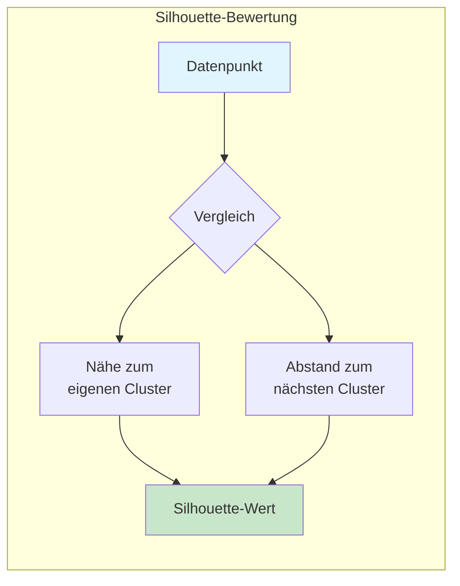
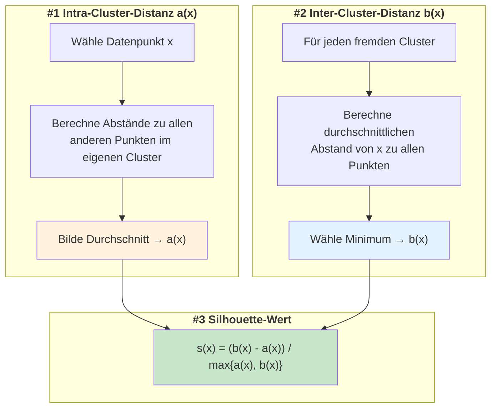
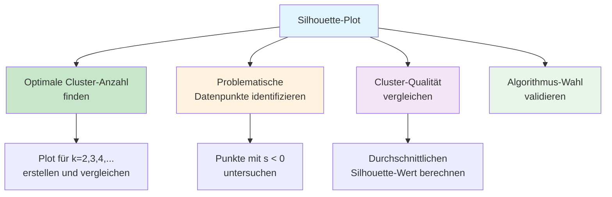
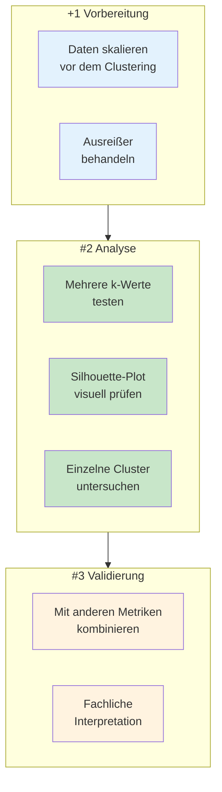

# Silhouette-Koeffizient
{: .no_toc }

> **Der Silhouette-Koeffizient bewertet die Qualität von Clustering-Ergebnissen, indem er misst, wie gut Datenpunkte zu ihrem eigenen Cluster passen im Vergleich zu benachbarten Clustern.**

---

## Inhaltsverzeichnis
{: .no_toc .text-delta }

1. TOC
{:toc}

---

## Grundkonzept

Der Silhouette-Koeffizient ist ein weit verbreitetes Maß zur Bewertung der Qualität einer Clusterbildung. Er beantwortet die zentrale Frage: **Wie gut passt jeder Datenpunkt zu seinem zugewiesenen Cluster?**

### Kernidee

Der Koeffizient kombiniert zwei Perspektiven:

| Aspekt | Beschreibung | Wünschenswert |
|--------|--------------|---------------|
| **Kompaktheit** | Wie nah ist der Punkt an den anderen Punkten seines Clusters? | Möglichst nah |
| **Separation** | Wie weit ist der Punkt von Punkten anderer Cluster entfernt? | Möglichst weit |

Ein gutes Clustering zeichnet sich durch **hohe Kompaktheit innerhalb** der Cluster und **große Separation zwischen** den Clustern aus.

---

## Mathematische Berechnung

### Formel

Für jeden Datenpunkt x wird der Silhouette-Wert s(x) berechnet:

$$s(x) = \frac{b(x) - a(x)}{\max\{a(x), b(x)\}}$$

Dabei gilt:

| Symbol   | Bedeutung                                                                                                        |
| -------- | ---------------------------------------------------------------------------------------------------------------- |
| **a(x)** | Durchschnittlicher Abstand von x zu allen anderen Punkten im **eigenen Cluster** (Intra-Cluster-Distanz)         |
| **b(x)** | Durchschnittlicher Abstand von x zu allen Punkten im **nächstgelegenen fremden Cluster** (Inter-Cluster-Distanz) |

### Berechnungsschritte

---

## Wertebereich und Interpretation

Der Silhouette-Koeffizient liegt immer im Bereich **[-1, +1]**:

### Detaillierte Interpretation

| Wertebereich | Bedeutung | Handlungsempfehlung |
|--------------|-----------|---------------------|
| **0.71 – 1.00** | Starke Clusterstruktur | Clustering ist sehr gut |
| **0.51 – 0.70** | Vernünftige Struktur | Clustering ist akzeptabel |
| **0.26 – 0.50** | Schwache Struktur | Clustering überprüfen |
| **≤ 0.25** | Keine substanzielle Struktur | Clustering fragwürdig |
| **< 0** | Falsche Zuordnung | Punkt gehört wahrscheinlich in anderes Cluster |

---

### Interpretation der Szenarien

| Szenario | Charakteristik | Silhouette-Wert |
|----------|----------------|-----------------|
| **Gutes Clustering** | Punkt liegt zentral im eigenen Cluster, weit entfernt von anderen | ≈ +1 |
| **Grenzfall** | Punkt liegt zwischen zwei Clustern, könnte zu beiden gehören | ≈ 0 |
| **Schlechtes Clustering** | Punkt ist näher an fremdem Cluster als am eigenen | ≈ -1 |

---

## Silhouette-Plot

Der Silhouette-Plot ist eine Visualisierung, die die Qualität **aller Datenpunkte** auf einen Blick zeigt.

### Aufbau des Plots

### Interpretation des Silhouette-Plots

| Merkmal | Gute Qualität | Schlechte Qualität |
|---------|---------------|-------------------|
| **Balkenbreite** | Breite, gleichmäßige Balken | Schmale, unregelmäßige Balken |
| **Negative Werte** | Keine oder wenige | Viele Balken links der 0-Linie |
| **Clustergröße** | Ähnlich große Cluster | Stark unterschiedliche Größen |
| **Durchschnittslinie** | Weit rechts (> 0.5) | Nahe bei 0 oder links |

### Anwendungen des Silhouette-Plots

Der Silhouette-Plot hilft bei wichtigen Entscheidungen:

---

## Best Practices

### Empfehlungen für die Praxis

### Wichtige Hinweise

| Aspekt | Empfehlung |
|--------|------------|
| **Skalierung** | Immer Daten vor dem Clustering skalieren (StandardScaler oder MinMaxScaler) |
| **Stichprobengröße** | Bei sehr großen Datensätzen ggf. Stichprobe verwenden |
| **Distanzmetrik** | Silhouette nutzt standardmäßig euklidische Distanz – bei anderen Distanzen anpassen |
| **Interpretation** | Silhouette allein reicht nicht – immer auch fachlich interpretieren |
| **Grenzwert** | Silhouette > 0.5 ist ein guter Richtwert, aber kontextabhängig |

### Häufige Fehler vermeiden

| Fehler | Problem | Lösung |
|--------|---------|--------|
| Unskalierte Daten | Features mit größerem Wertebereich dominieren | StandardScaler verwenden |
| Nur Durchschnitt betrachten | Versteckt problematische Cluster | Silhouette-Plot analysieren |
| k=1 testen | Silhouette für einzelnes Cluster undefiniert | Minimum k=2 verwenden |
| Negative Werte ignorieren | Falsch zugeordnete Punkte übersehen | Punkte mit s < 0 untersuchen |

---

**Version:** 1.0    
**Stand:** Januar 2026    
**Kurs:** Machine Learning. Verstehen. Anwenden. Gestalten.    