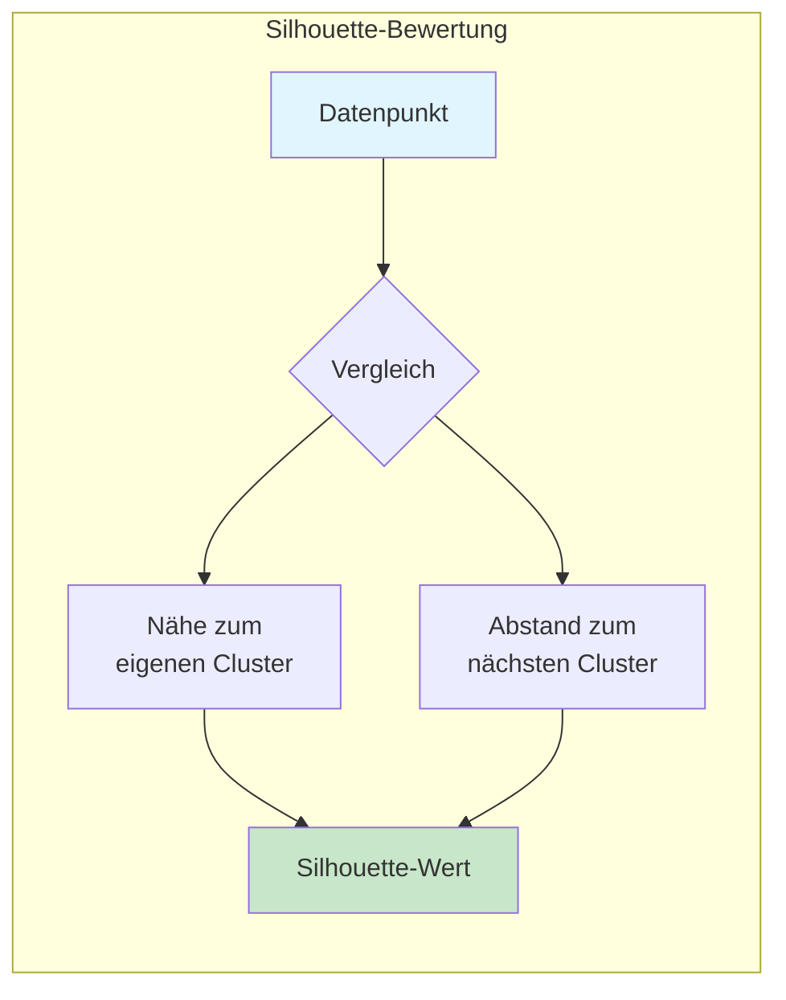
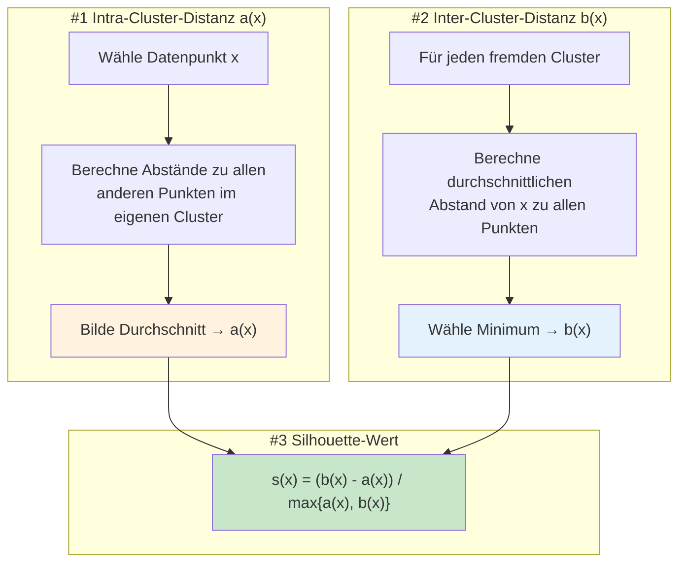
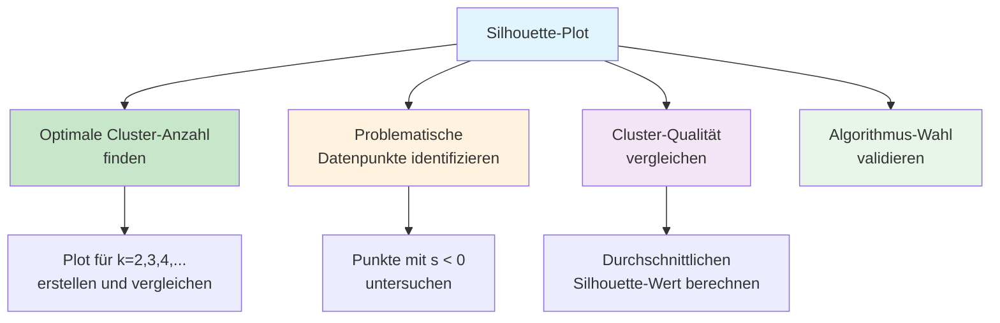
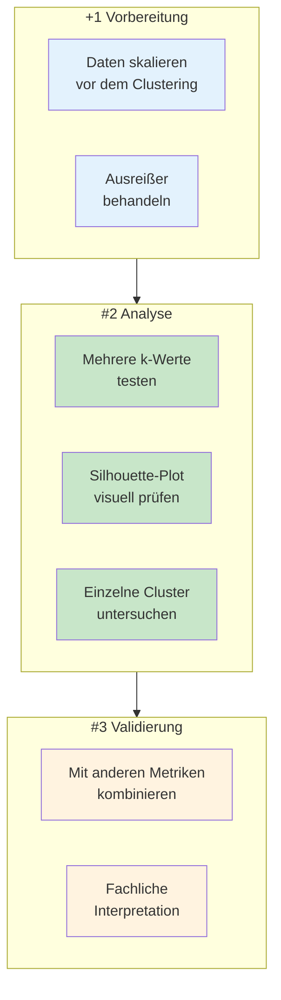

# Silhouette-Koeffizient
{: .no_toc }

> **Der Silhouette-Koeffizient bewertet die Qualität von Clustering-Ergebnissen, indem er misst, wie gut Datenpunkte zu ihrem eigenen Cluster passen im Vergleich zu benachbarten Clustern.**

---

## Inhaltsverzeichnis
{: .no_toc .text-delta }

1. TOC
{:toc}

---

## Grundkonzept

Der Silhouette-Koeffizient ist ein weit verbreitetes Maß zur Bewertung der Qualität einer Clusterbildung. Er beantwortet die zentrale Frage: **Wie gut passt jeder Datenpunkt zu seinem zugewiesenen Cluster?**



### Kernidee

Der Koeffizient kombiniert zwei Perspektiven:

| Aspekt | Beschreibung | Wünschenswert |
|--------|--------------|---------------|
| **Kompaktheit** | Wie nah ist der Punkt an den anderen Punkten seines Clusters? | Möglichst nah |
| **Separation** | Wie weit ist der Punkt von Punkten anderer Cluster entfernt? | Möglichst weit |

Ein gutes Clustering zeichnet sich durch **hohe Kompaktheit innerhalb** der Cluster und **große Separation zwischen** den Clustern aus.

---

## Mathematische Berechnung

### Formel

Für jeden Datenpunkt x wird der Silhouette-Wert s(x) berechnet:

$$s(x) = \frac{b(x) - a(x)}{\max\{a(x), b(x)\}}$$

Dabei gilt:

| Symbol   | Bedeutung                                                                                                        |
| -------- | ---------------------------------------------------------------------------------------------------------------- |
| **a(x)** | Durchschnittlicher Abstand von x zu allen anderen Punkten im **eigenen Cluster** (Intra-Cluster-Distanz)         |
| **b(x)** | Durchschnittlicher Abstand von x zu allen Punkten im **nächstgelegenen fremden Cluster** (Inter-Cluster-Distanz) |

### Berechnungsschritte



---

## Wertebereich und Interpretation

Der Silhouette-Koeffizient liegt immer im Bereich **[-1, +1]**:


### Detaillierte Interpretation

| Wertebereich | Bedeutung | Handlungsempfehlung |
|--------------|-----------|---------------------|
| **0.71 – 1.00** | Starke Clusterstruktur | Clustering ist sehr gut |
| **0.51 – 0.70** | Vernünftige Struktur | Clustering ist akzeptabel |
| **0.26 – 0.50** | Schwache Struktur | Clustering überprüfen |
| **≤ 0.25** | Keine substanzielle Struktur | Clustering fragwürdig |
| **< 0** | Falsche Zuordnung | Punkt gehört wahrscheinlich in anderes Cluster |

---


### Interpretation der Szenarien

| Szenario | Charakteristik | Silhouette-Wert |
|----------|----------------|-----------------|
| **Gutes Clustering** | Punkt liegt zentral im eigenen Cluster, weit entfernt von anderen | ≈ +1 |
| **Grenzfall** | Punkt liegt zwischen zwei Clustern, könnte zu beiden gehören | ≈ 0 |
| **Schlechtes Clustering** | Punkt ist näher an fremdem Cluster als am eigenen | ≈ -1 |

---

## Silhouette-Plot

Der Silhouette-Plot ist eine Visualisierung, die die Qualität **aller Datenpunkte** auf einen Blick zeigt.

### Aufbau des Plots


### Interpretation des Silhouette-Plots

| Merkmal | Gute Qualität | Schlechte Qualität |
|---------|---------------|-------------------|
| **Balkenbreite** | Breite, gleichmäßige Balken | Schmale, unregelmäßige Balken |
| **Negative Werte** | Keine oder wenige | Viele Balken links der 0-Linie |
| **Clustergröße** | Ähnlich große Cluster | Stark unterschiedliche Größen |
| **Durchschnittslinie** | Weit rechts (> 0.5) | Nahe bei 0 oder links |

### Anwendungen des Silhouette-Plots

Der Silhouette-Plot hilft bei wichtigen Entscheidungen:



---

## Implementierung mit scikit-learn

### Grundlegende Berechnung

```python
from sklearn.cluster import KMeans
from sklearn.metrics import silhouette_score, silhouette_samples
from sklearn.datasets import make_blobs
import numpy as np

# Beispieldaten erzeugen
X, y_true = make_blobs(n_samples=300, centers=4, 
                       cluster_std=0.60, random_state=42)

# K-Means Clustering
kmeans = KMeans(n_clusters=4, random_state=42, n_init=10)
cluster_labels = kmeans.fit_predict(X)

# Silhouette-Koeffizient berechnen (Durchschnitt über alle Punkte)
silhouette_avg = silhouette_score(X, cluster_labels)
print(f"Durchschnittlicher Silhouette-Koeffizient: {silhouette_avg:.3f}")

# Silhouette-Werte für jeden einzelnen Punkt
sample_silhouette_values = silhouette_samples(X, cluster_labels)
print(f"Min: {sample_silhouette_values.min():.3f}")
print(f"Max: {sample_silhouette_values.max():.3f}")
```

### Optimale Cluster-Anzahl finden

```python
from sklearn.cluster import KMeans
from sklearn.metrics import silhouette_score
import matplotlib.pyplot as plt

def find_optimal_clusters(X, k_range=range(2, 11)):
    """
    Findet die optimale Cluster-Anzahl basierend auf dem Silhouette-Koeffizienten.
    
    Parameters:
    -----------
    X : array-like
        Die Daten zum Clustern
    k_range : range
        Bereich der zu testenden Cluster-Anzahlen
    
    Returns:
    --------
    int : Optimale Cluster-Anzahl
    """
    silhouette_scores = []
    
    for k in k_range:
        kmeans = KMeans(n_clusters=k, random_state=42, n_init=10)
        labels = kmeans.fit_predict(X)
        score = silhouette_score(X, labels)
        silhouette_scores.append(score)
        print(f"k={k}: Silhouette-Score = {score:.3f}")
    
    # Visualisierung
    plt.figure(figsize=(10, 5))
    plt.plot(list(k_range), silhouette_scores, 'bo-', linewidth=2, markersize=8)
    plt.xlabel('Anzahl Cluster (k)')
    plt.ylabel('Silhouette-Koeffizient')
    plt.title('Silhouette-Analyse zur Bestimmung der optimalen Cluster-Anzahl')
    plt.axhline(y=max(silhouette_scores), color='r', linestyle='--', 
                label=f'Maximum: {max(silhouette_scores):.3f}')
    plt.legend()
    plt.grid(True, alpha=0.3)
    plt.show()
    
    # Optimale Anzahl zurückgeben
    optimal_k = list(k_range)[silhouette_scores.index(max(silhouette_scores))]
    return optimal_k

# Anwendung
optimal_clusters = find_optimal_clusters(X)
print(f"\nOptimale Cluster-Anzahl: {optimal_clusters}")
```

### Silhouette-Plot erstellen

```python
import matplotlib.pyplot as plt
import matplotlib.cm as cm
import numpy as np
from sklearn.cluster import KMeans
from sklearn.metrics import silhouette_samples, silhouette_score

def plot_silhouette(X, n_clusters):
    """
    Erstellt einen Silhouette-Plot für die gegebenen Daten.
    
    Parameters:
    -----------
    X : array-like
        Die Daten
    n_clusters : int
        Anzahl der Cluster
    """
    # Clustering durchführen
    clusterer = KMeans(n_clusters=n_clusters, random_state=42, n_init=10)
    cluster_labels = clusterer.fit_predict(X)
    
    # Silhouette-Werte berechnen
    silhouette_avg = silhouette_score(X, cluster_labels)
    sample_silhouette_values = silhouette_samples(X, cluster_labels)
    
    # Plot erstellen
    fig, ax = plt.subplots(figsize=(10, 7))
    
    y_lower = 10
    for i in range(n_clusters):
        # Silhouette-Werte für Cluster i
        ith_cluster_silhouette_values = sample_silhouette_values[cluster_labels == i]
        ith_cluster_silhouette_values.sort()
        
        size_cluster_i = ith_cluster_silhouette_values.shape[0]
        y_upper = y_lower + size_cluster_i
        
        # Farbe für Cluster
        color = cm.nipy_spectral(float(i) / n_clusters)
        ax.fill_betweenx(np.arange(y_lower, y_upper),
                         0, ith_cluster_silhouette_values,
                         facecolor=color, edgecolor=color, alpha=0.7)
        
        # Cluster-Label
        ax.text(-0.05, y_lower + 0.5 * size_cluster_i, str(i))
        y_lower = y_upper + 10
    
    # Durchschnittslinie
    ax.axvline(x=silhouette_avg, color="red", linestyle="--",
               label=f'Durchschnitt: {silhouette_avg:.3f}')
    
    ax.set_xlabel("Silhouette-Koeffizient")
    ax.set_ylabel("Cluster")
    ax.set_title(f"Silhouette-Plot für {n_clusters} Cluster")
    ax.set_xlim([-0.1, 1])
    ax.legend(loc='best')
    
    plt.tight_layout()
    plt.show()
    
    return silhouette_avg

# Anwendung
avg_score = plot_silhouette(X, n_clusters=4)
```

---

## Vergleich verschiedener Clustering-Algorithmen

Der Silhouette-Koeffizient eignet sich hervorragend zum Vergleich verschiedener Algorithmen:

```python
from sklearn.cluster import KMeans, AgglomerativeClustering, DBSCAN
from sklearn.metrics import silhouette_score
from sklearn.preprocessing import StandardScaler

def compare_clustering_algorithms(X, n_clusters=4):
    """
    Vergleicht verschiedene Clustering-Algorithmen anhand des Silhouette-Koeffizienten.
    """
    # Daten skalieren
    scaler = StandardScaler()
    X_scaled = scaler.fit_transform(X)
    
    results = {}
    
    # K-Means
    kmeans = KMeans(n_clusters=n_clusters, random_state=42, n_init=10)
    labels_kmeans = kmeans.fit_predict(X_scaled)
    results['K-Means'] = silhouette_score(X_scaled, labels_kmeans)
    
    # Hierarchisches Clustering
    hierarchical = AgglomerativeClustering(n_clusters=n_clusters)
    labels_hier = hierarchical.fit_predict(X_scaled)
    results['Hierarchisch'] = silhouette_score(X_scaled, labels_hier)
    
    # DBSCAN (benötigt keine Cluster-Anzahl)
    dbscan = DBSCAN(eps=0.5, min_samples=5)
    labels_dbscan = dbscan.fit_predict(X_scaled)
    # Nur berechnen wenn mehr als 1 Cluster gefunden
    if len(set(labels_dbscan)) > 1 and -1 not in labels_dbscan:
        results['DBSCAN'] = silhouette_score(X_scaled, labels_dbscan)
    else:
        results['DBSCAN'] = 'N/A (zu wenig Cluster oder Rauschen)'
    
    # Ergebnisse ausgeben
    print("Vergleich der Clustering-Algorithmen:")
    print("-" * 40)
    for algo, score in results.items():
        if isinstance(score, float):
            print(f"{algo:15} | Silhouette: {score:.3f}")
        else:
            print(f"{algo:15} | {score}")
    
    return results

# Anwendung
comparison = compare_clustering_algorithms(X)
```

---

## Best Practices

### Empfehlungen für die Praxis



### Wichtige Hinweise

| Aspekt | Empfehlung |
|--------|------------|
| **Skalierung** | Immer Daten vor dem Clustering skalieren (StandardScaler oder MinMaxScaler) |
| **Stichprobengröße** | Bei sehr großen Datensätzen ggf. Stichprobe verwenden |
| **Distanzmetrik** | Silhouette nutzt standardmäßig euklidische Distanz – bei anderen Distanzen anpassen |
| **Interpretation** | Silhouette allein reicht nicht – immer auch fachlich interpretieren |
| **Grenzwert** | Silhouette > 0.5 ist ein guter Richtwert, aber kontextabhängig |

### Häufige Fehler vermeiden

| Fehler | Problem | Lösung |
|--------|---------|--------|
| Unskalierte Daten | Features mit größerem Wertebereich dominieren | StandardScaler verwenden |
| Nur Durchschnitt betrachten | Versteckt problematische Cluster | Silhouette-Plot analysieren |
| k=1 testen | Silhouette für einzelnes Cluster undefiniert | Minimum k=2 verwenden |
| Negative Werte ignorieren | Falsch zugeordnete Punkte übersehen | Punkte mit s < 0 untersuchen |

---

**Version:** 1.0    
**Stand:** Januar 2026    
**Kurs:** Machine Learning. Verstehen. Anwenden. Gestalten.    