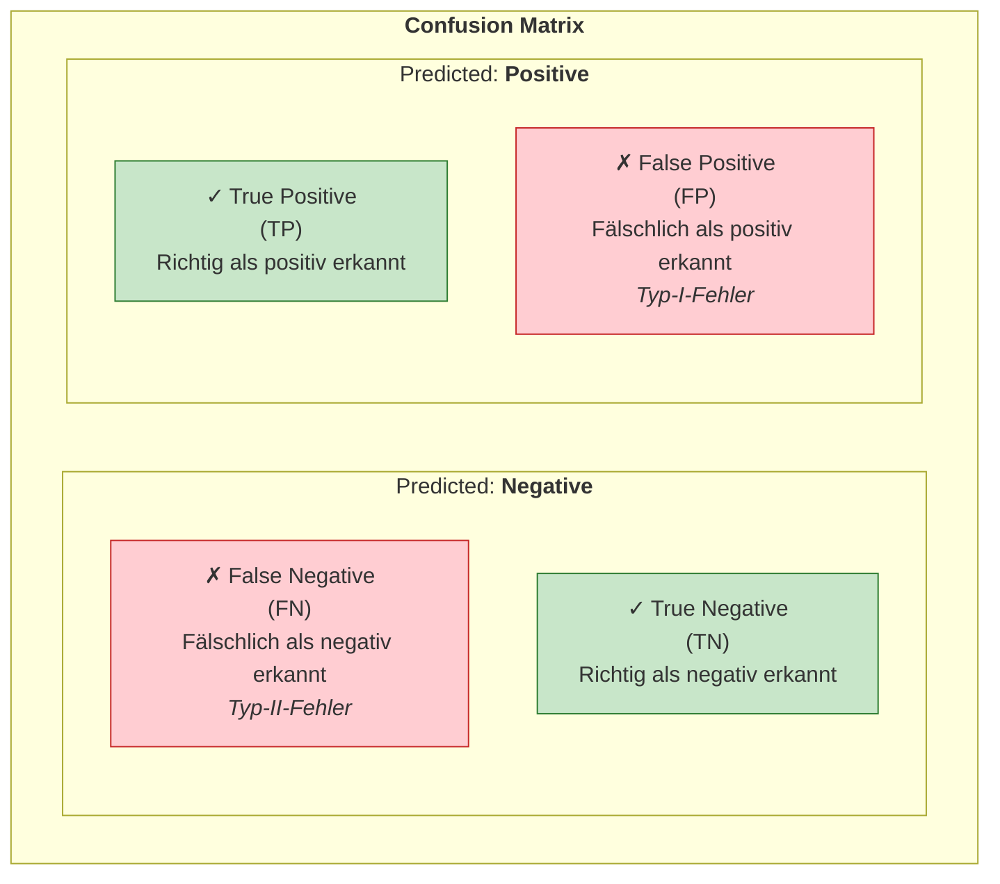
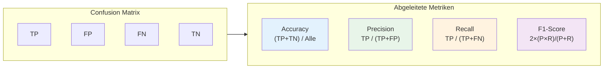
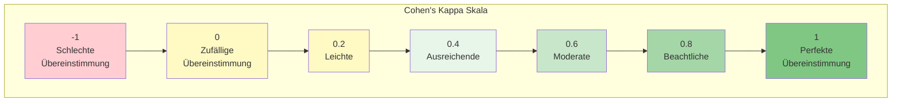
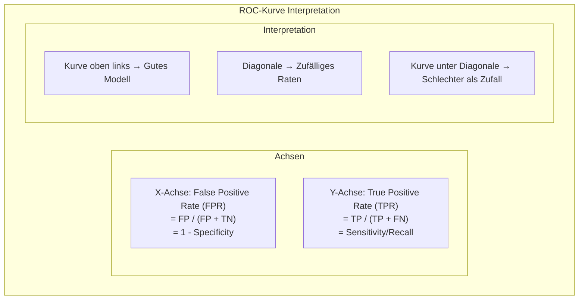
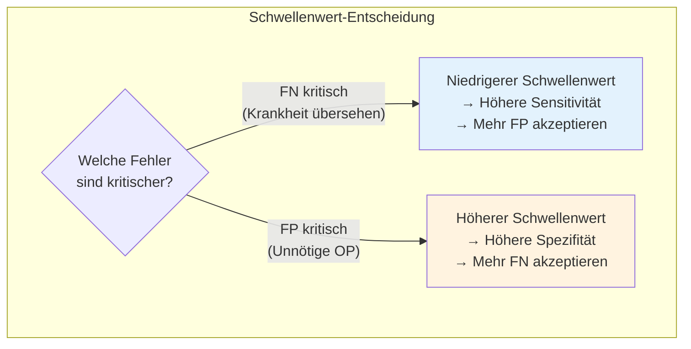
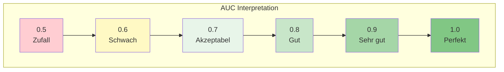
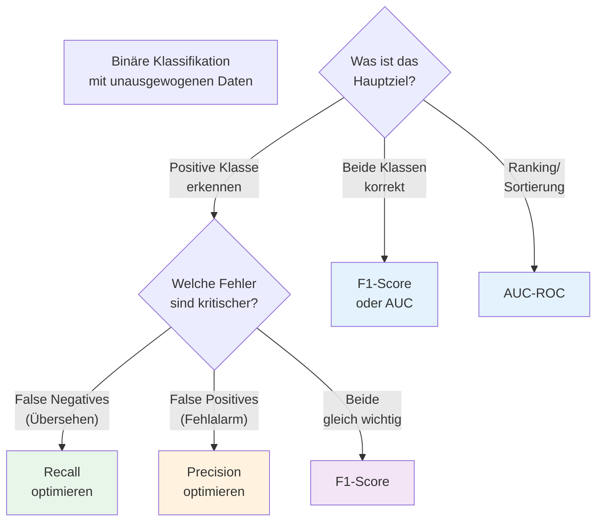
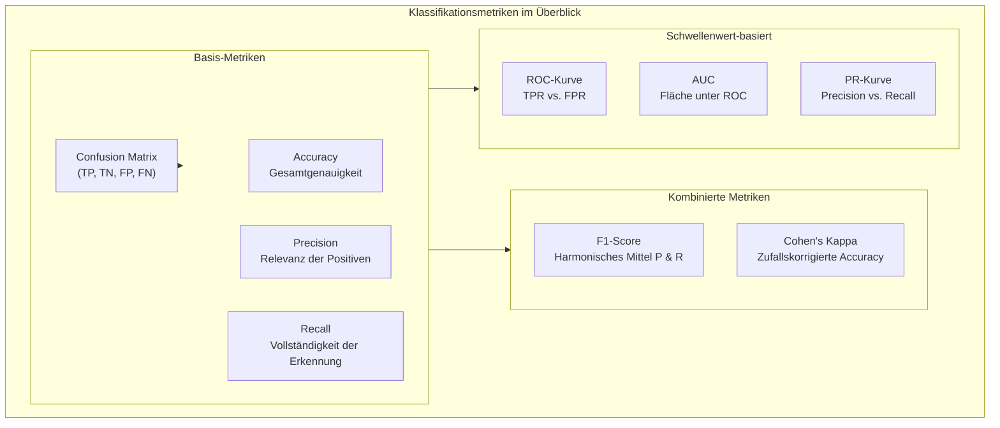

# Bewertung Klassifizierung
{: .no_toc }

> **Klassifikationsmodelle erfordern spezifische Metriken zur Leistungsbewertung.**        
>  Dieses Kapitel behandelt die wichtigsten Werkzeuge: Confusion Matrix, Precision, Recall, F1-Score, Cohen's Kappa, ROC-Kurve und AUC. Besondere Aufmerksamkeit gilt dem Umgang mit unausgewogenen Datensätzen.

---

# Inhaltsverzeichnis
{: .no_toc .text-delta }

1. TOC
{:toc}

---

## Confusion Matrix

Die Konfusionsmatrix (Confusion Matrix) ist das fundamentale Werkzeug zur Bewertung von Klassifikationsmodellen. Sie zeigt, wie die Vorhersagen des Modells mit den tatsächlichen Werten übereinstimmen.

### Aufbau der binären Confusion Matrix



### Die vier Kategorien

| Kategorie | Beschreibung | Beispiel (Spam-Erkennung) |
|-----------|--------------|---------------------------|
| **True Positive (TP)** | Positives Ergebnis vorhergesagt, tatsächlich positiv | Spam korrekt als Spam erkannt |
| **False Positive (FP)** | Positives Ergebnis vorhergesagt, tatsächlich negativ | Normale E-Mail fälschlich als Spam markiert |
| **True Negative (TN)** | Negatives Ergebnis vorhergesagt, tatsächlich negativ | Normale E-Mail korrekt durchgelassen |
| **False Negative (FN)** | Negatives Ergebnis vorhergesagt, tatsächlich positiv | Spam fälschlich als normale E-Mail durchgelassen |

### Implementierung mit scikit-learn

```python
from sklearn.metrics import confusion_matrix, ConfusionMatrixDisplay
import matplotlib.pyplot as plt

# Confusion Matrix berechnen
cm = confusion_matrix(target_test, target_pred)
print("Confusion Matrix:")
print(cm)

# Visualisierung
disp = ConfusionMatrixDisplay(confusion_matrix=cm,
                               display_labels=['Negativ', 'Positiv'])
disp.plot(cmap='Blues')
plt.title('Confusion Matrix')
plt.show()
```

---

## Metriken aus der Confusion Matrix

Aus den vier Grundwerten der Confusion Matrix lassen sich verschiedene Leistungsmetriken ableiten, die unterschiedliche Aspekte der Modellqualität bewerten.



### Accuracy (Genauigkeit)

Die Accuracy misst den Anteil aller **korrekten Vorhersagen** an der Gesamtzahl der Fälle.

$$\text{Accuracy} = \frac{TP + TN}{TP + TN + FP + FN}$$

```python
from sklearn.metrics import accuracy_score

accuracy = accuracy_score(target_test, target_pred)
print(f"Accuracy: {accuracy:.4f}")
```

> **Achtung:** Die Accuracy kann bei unausgewogenen Datensätzen irreführend sein! Ein Modell, das bei 95% negativen Fällen immer "negativ" vorhersagt, erreicht 95% Accuracy – ohne einen einzigen positiven Fall zu erkennen.

### Precision (Relevanz/Präzision)

Die Precision gibt an, wie viele der als **positiv vorhergesagten Fälle tatsächlich positiv** sind.

$$\text{Precision} = \frac{TP}{TP + FP}$$

```python
from sklearn.metrics import precision_score

precision = precision_score(target_test, target_pred)
print(f"Precision: {precision:.4f}")
```

**Wann ist Precision wichtig?**
- Wenn False Positives teuer oder problematisch sind
- Beispiel: Spam-Filter (normale E-Mails sollen nicht blockiert werden)
- Beispiel: Qualitätskontrolle (gute Produkte sollen nicht aussortiert werden)

### Recall (Sensitivität/Trefferquote)

Der Recall gibt an, wie viele der **tatsächlich positiven Fälle korrekt** erkannt wurden.

$$\text{Recall} = \frac{TP}{TP + FN}$$

```python
from sklearn.metrics import recall_score

recall = recall_score(target_test, target_pred)
print(f"Recall: {recall:.4f}")
```

**Wann ist Recall wichtig?**
- Wenn False Negatives teuer oder gefährlich sind
- Beispiel: Krankheitsdiagnose (Kranke sollen nicht übersehen werden)
- Beispiel: Betrugserkennung (Betrug soll nicht unentdeckt bleiben)

### F1-Score

Der F1-Score ist das **harmonische Mittel aus Precision und Recall** und bietet eine ausgewogene Bewertung.

$$\text{F1-Score} = 2 \times \frac{\text{Precision} \times \text{Recall}}{\text{Precision} + \text{Recall}}$$

```python
from sklearn.metrics import f1_score

f1 = f1_score(target_test, target_pred)
print(f"F1-Score: {f1:.4f}")
```

**Interpretation:** Der F1-Score ist besonders nützlich, wenn ein Gleichgewicht zwischen Precision und Recall gewünscht ist und die Klassen unausgewogen sind.

### Beispielrechnung

Gegeben sei folgende Confusion Matrix:

|  | Predicted: Positiv | Predicted: Negativ |
|---|:---:|:---:|
| **Actual: Positiv** | TP = 20 | FN = 3 |
| **Actual: Negativ** | FP = 5 | TN = 15 |

**Berechnungen:**

- **Accuracy:** (20 + 15) / (20 + 15 + 5 + 3) = 35 / 43 ≈ **0.81**
- **Precision:** 20 / (20 + 5) = 20 / 25 = **0.80**
- **Recall:** 20 / (20 + 3) = 20 / 23 ≈ **0.87**
- **F1-Score:** 2 × (0.80 × 0.87) / (0.80 + 0.87) ≈ **0.83**

### Kompletter Classification Report

```python
from sklearn.metrics import classification_report

print(classification_report(target_test, target_pred, target_names=['Negativ', 'Positiv']))
```

**Beispielausgabe:**

```
              precision    recall  f1-score   support

     Negativ       0.83      0.75      0.79        20
     Positiv       0.80      0.87      0.83        23

    accuracy                           0.81        43
   macro avg       0.82      0.81      0.81        43
weighted avg       0.82      0.81      0.81        43
```

---

## Multi-Class Confusion Matrix

Bei Klassifikationsproblemen mit mehr als zwei Klassen wird die Confusion Matrix entsprechend erweitert. Die Berechnung der Metriken erfolgt dann klassenweise.


### Berechnung für einzelne Klassen

Bei Multi-Class-Problemen werden TP, TN, FP und FN für jede Klasse einzeln berechnet:

**Beispiel für Klasse "Apple" aus der obigen Matrix:**

| Metrik | Berechnung                                  | Ergebnis          |
| ------ | ------------------------------------------- | ----------------- |
| **TP** | Korrekt als Apple klassifiziert             | 7                 |
| **FN** | Apple, aber als andere Klasse klassifiziert | 1 + 3 = 4         |
| **FP** | Andere Klasse, aber als Apple klassifiziert | 8 + 9 = 17        |
| **TN** | Andere Klasse, korrekt nicht als Apple      | 2 + 3 + 2 + 1 = 8 |

### Implementierung

```python
from sklearn.metrics import confusion_matrix, classification_report

# Multi-Class Confusion Matrix
cm = confusion_matrix(target_test, target_pred)
print("Confusion Matrix:")
print(cm)

# Classification Report für alle Klassen
print("\nClassification Report:")
print(classification_report(target_test, target_pred, target_names=['Apple', 'Orange', 'Banana']))
```

### Aggregationsstrategien

Bei Multi-Class-Problemen gibt es verschiedene Möglichkeiten, die Metriken zu aggregieren:

| Strategie | Beschreibung | Verwendung |
|-----------|--------------|------------|
| **Macro Average** | Ungewichteter Durchschnitt aller Klassen | Wenn alle Klassen gleich wichtig sind |
| **Weighted Average** | Gewichtet nach Klassenhäufigkeit | Bei unausgewogenen Klassen |
| **Micro Average** | Gesamtsumme aller TP, FP, FN | Für Gesamtleistung |

```python
from sklearn.metrics import precision_score, recall_score, f1_score

# Verschiedene Averaging-Strategien
print(f"Macro F1:    {f1_score(target_test, target_pred, average='macro'):.4f}")
print(f"Weighted F1: {f1_score(target_test, target_pred, average='weighted'):.4f}")
print(f"Micro F1:    {f1_score(target_test, target_pred, average='micro'):.4f}")
```

---

## Cohen's Kappa

Cohen's Kappa ist eine robustere Metrik als die Accuracy, da sie die zufällige Übereinstimmung berücksichtigt. Sie ist besonders wertvoll bei unausgewogenen Klassen.

### Interpretation



| Kappa-Wert | Interpretation |
|------------|----------------|
| κ < 0.0 | Schlechte Übereinstimmung (schlechter als Zufall) |
| κ ≤ 0.2 | Leichte Übereinstimmung |
| κ ≤ 0.4 | Ausreichende Übereinstimmung |
| κ ≤ 0.6 | Moderate Übereinstimmung |
| κ ≤ 0.8 | Beachtliche Übereinstimmung |
| κ > 0.8 | (Fast) vollständige Übereinstimmung |

### Berechnung

$$\kappa = \frac{p_o - p_e}{1 - p_e}$$

Wobei:
- $p_o$ = beobachtete Übereinstimmung (Accuracy)
- $p_e$ = erwartete zufällige Übereinstimmung

### Implementierung

```python
from sklearn.metrics import cohen_kappa_score

kappa = cohen_kappa_score(target_test, target_pred)
print(f"Cohen's Kappa: {kappa:.4f}")
```

### Vorteile gegenüber Accuracy

```python
import numpy as np
from sklearn.metrics import accuracy_score, cohen_kappa_score

# Beispiel: Unausgewogener Datensatz (90% Klasse 0)
target_true = np.array([0]*90 + [1]*10)
target_pred_naive = np.array([0]*100)  # Sagt immer 0 voraus

print(f"Accuracy:      {accuracy_score(target_true, target_pred_naive):.2f}")  # 0.90
print(f"Cohen's Kappa: {cohen_kappa_score(target_true, target_pred_naive):.2f}")  # 0.00

# Kappa zeigt, dass das Modell nicht besser als Zufall ist!
```

---

## ROC-Kurve (Receiver Operating Characteristic)

Die ROC-Kurve ist ein leistungsstarkes Werkzeug zur Visualisierung der Klassifikationsleistung über verschiedene Schwellenwerte hinweg.

### Grundkonzept



### Sensitivität und Spezifität

| Metrik | Formel | Beschreibung |
|--------|--------|--------------|
| **Sensitivität (TPR)** | TP / (TP + FN) | Anteil der korrekt erkannten positiven Fälle |
| **Spezifität (TNR)** | TN / (TN + FP) | Anteil der korrekt erkannten negativen Fälle |
| **False Positive Rate** | FP / (FP + TN) = 1 - Spezifität | Anteil der fälschlich als positiv erkannten negativen Fälle |

### Implementierung

```python
from sklearn.metrics import roc_curve, RocCurveDisplay
import matplotlib.pyplot as plt

# Wahrscheinlichkeiten berechnen (nicht Labels!)
target_proba = model.predict_proba(data_test)[:, 1]

# ROC-Kurve
fpr, tpr, thresholds = roc_curve(target_test, target_proba)

# Visualisierung
RocCurveDisplay.from_predictions(target_test, target_proba)
plt.plot([0, 1], [0, 1], 'k--', label='Zufall')
plt.title('ROC-Kurve')
plt.legend()
plt.show()
```

### Schwellenwert-Optimierung

Der Standard-Schwellenwert von 0.5 ist nicht immer optimal. Je nach Anwendungsfall kann ein anderer Schwellenwert sinnvoller sein.



**Beispiel: Krebsdiagnose**

Bei einem Test auf eine ernsthafte, aber behandelbare Krankheit wie Krebs:

- **Hohe Sensitivität (TPR):** Fast alle tatsächlichen Fälle werden erkannt
- **Akzeptierte höhere FPR:** Einige Gesunde werden fälschlich positiv getestet

Dies ist vertretbar, weil:
1. Ein übersehener Krebsfall (FN) kann tödlich sein
2. Ein falscher Alarm (FP) führt "nur" zu weiteren Tests

### Optimalen Schwellenwert finden

```python
from sklearn.metrics import roc_curve
import numpy as np

# ROC-Kurve berechnen
fpr, tpr, thresholds = roc_curve(target_test, target_proba)

# Youden's J-Statistik: Maximiert TPR - FPR
j_scores = tpr - fpr
optimal_idx = np.argmax(j_scores)
optimal_threshold = thresholds[optimal_idx]

print(f"Optimaler Schwellenwert: {optimal_threshold:.4f}")
print(f"TPR bei optimalem Schwellenwert: {tpr[optimal_idx]:.4f}")
print(f"FPR bei optimalem Schwellenwert: {fpr[optimal_idx]:.4f}")
```

---

## Area Under the Curve (AUC)

Die AUC (Area Under the ROC Curve) fasst die Leistung eines Klassifikators in einer einzigen Zahl zusammen.

### Interpretation



| AUC-Wert | Interpretation |
|----------|----------------|
| 0.5 | Keine Unterscheidungsfähigkeit (Zufall) |
| 0.6 - 0.7 | Schwache Diskriminierung |
| 0.7 - 0.8 | Akzeptable Diskriminierung |
| 0.8 - 0.9 | Gute Diskriminierung |
| > 0.9 | Exzellente Diskriminierung |

### Vorteile der AUC

1. **Schwellenwert-unabhängig:** Bewertet die gesamte ROC-Kurve
2. **Vergleichbarkeit:** Ermöglicht einfachen Modellvergleich
3. **Robust:** Weniger anfällig für Klassenungleichgewichte als Accuracy

### Implementierung

```python
from sklearn.metrics import roc_auc_score

# AUC berechnen
auc = roc_auc_score(target_test, target_proba)
print(f"AUC: {auc:.4f}")

# Für Multi-Class
auc_ovr = roc_auc_score(target_test, target_proba_multi, multi_class='ovr')
print(f"AUC (One-vs-Rest): {auc_ovr:.4f}")
```

### Modellvergleich mit AUC

```python
from sklearn.metrics import roc_curve, auc
import matplotlib.pyplot as plt

# Mehrere Modelle vergleichen
models = [
    ('Logistische Regression', model_lr_proba),
    ('Random Forest', model_rf_proba),
    ('XGBoost', model_xgb_proba)
]

plt.figure(figsize=(10, 8))

for name, target_proba in models:
    fpr, tpr, _ = roc_curve(target_test, target_proba)
    roc_auc = auc(fpr, tpr)
    plt.plot(fpr, tpr, label=f'{name} (AUC = {roc_auc:.3f})')

plt.plot([0, 1], [0, 1], 'k--', label='Zufall')
plt.xlabel('False Positive Rate')
plt.ylabel('True Positive Rate')
plt.title('ROC-Kurven Vergleich')
plt.legend()
plt.show()
```

---

## Umgang mit unausgewogenen Klassen

Bei unausgewogenen Datensätzen (Imbalanced Classification) sind Standard-Metriken oft irreführend. Die richtige Metrikauswahl ist entscheidend.

### Entscheidungsbaum zur Metrikauswahl



### Empfehlungen nach Anwendungsfall

| Anwendungsfall | Empfohlene Metrik | Begründung |
|----------------|-------------------|------------|
| **Medizinische Diagnose** | Recall + Spezifität | Kranke nicht übersehen |
| **Spam-Erkennung** | Precision + F1 | Normale E-Mails nicht blockieren |
| **Betrugserkennung** | Recall + AUC | Betrug nicht durchlassen |
| **Qualitätskontrolle** | Precision + Recall | Balance je nach Kosten |
| **Kreditwürdigkeit** | AUC + F1 | Ranking und Gesamtleistung |

### Precision-Recall-Kurve als Alternative

Bei stark unausgewogenen Daten kann die Precision-Recall-Kurve informativer sein als die ROC-Kurve:

```python
from sklearn.metrics import precision_recall_curve, average_precision_score
import matplotlib.pyplot as plt

# Precision-Recall-Kurve
precision, recall, thresholds = precision_recall_curve(target_test, target_proba)
ap = average_precision_score(target_test, target_proba)

plt.figure(figsize=(8, 6))
plt.plot(recall, precision, label=f'AP = {ap:.3f}')
plt.xlabel('Recall')
plt.ylabel('Precision')
plt.title('Precision-Recall-Kurve')
plt.legend()
plt.show()
```

---

## Zusammenfassung: Metrik-Übersicht



### Quick Reference: Wann welche Metrik?

| Situation | Empfohlene Metrik(en) |
|-----------|----------------------|
| Ausgewogene Klassen | Accuracy, F1-Score |
| Unausgewogene Klassen | F1-Score, AUC, Cohen's Kappa |
| Kosten unterschiedlich | Precision oder Recall (je nach Kosten) |
| Modellvergleich | AUC |
| Schwellenwert-Optimierung | ROC-Kurve mit Youden's J |
| Sehr seltene positive Klasse | PR-Kurve, Average Precision |

### Komplettes Evaluations-Template

```python
from sklearn.metrics import (
    accuracy_score, precision_score, recall_score, f1_score,
    cohen_kappa_score, roc_auc_score, classification_report,
    confusion_matrix, ConfusionMatrixDisplay
)
import matplotlib.pyplot as plt

def evaluate_classifier(target_true, target_pred, target_proba=None, class_names=None):
    """
    Umfassende Evaluation eines Klassifikationsmodells.
    """
    print("=" * 50)
    print("KLASSIFIKATIONS-EVALUATION")
    print("=" * 50)

    # Basis-Metriken
    print(f"\nAccuracy:      {accuracy_score(target_true, target_pred):.4f}")
    print(f"Precision:     {precision_score(target_true, target_pred, average='weighted'):.4f}")
    print(f"Recall:        {recall_score(target_true, target_pred, average='weighted'):.4f}")
    print(f"F1-Score:      {f1_score(target_true, target_pred, average='weighted'):.4f}")
    print(f"Cohen's Kappa: {cohen_kappa_score(target_true, target_pred):.4f}")

    # AUC (falls Wahrscheinlichkeiten verfügbar)
    if target_proba is not None:
        if len(target_proba.shape) == 1 or target_proba.shape[1] == 2:
            proba = target_proba[:, 1] if len(target_proba.shape) > 1 else target_proba
            print(f"AUC-ROC:       {roc_auc_score(target_true, proba):.4f}")

    # Classification Report
    print("\n" + "-" * 50)
    print("Classification Report:")
    print("-" * 50)
    print(classification_report(target_true, target_pred, target_names=class_names))

    # Confusion Matrix visualisieren
    fig, ax = plt.subplots(figsize=(8, 6))
    ConfusionMatrixDisplay.from_predictions(
        target_true, target_pred,
        display_labels=class_names,
        cmap='Blues',
        ax=ax
    )
    plt.title('Confusion Matrix')
    plt.tight_layout()
    plt.show()

# Verwendung
evaluate_classifier(target_test, target_pred, target_proba, class_names=['Negativ', 'Positiv'])
```

---

## Weiterführende Themen

- **Cross-Validation:** Robustere Schätzung der Metriken durch mehrfache Splits
- **Learning Curves:** Diagnose von Over-/Underfitting
- **Calibration:** Zuverlässigkeit der Wahrscheinlichkeitsvorhersagen
- **Cost-Sensitive Learning:** Berücksichtigung unterschiedlicher Fehlerkosten

---

*Referenzen:*    
- scikit-learn Dokumentation: [Classification Metrics](https://scikit-learn.org/stable/modules/model_evaluation.html#classification-metrics)      
- StatQuest: [Confusion Matrix](https://www.youtube.com/watch?v=Kdsp6soqA7o), [ROC and AUC](https://www.youtube.com/watch?v=4jRBRDbJemM)      
- KNIME: [Confusion Matrix](https://www.knime.com/blog/confusion-matrix), [ROC Curve](https://www.knime.com/blog/roc-curve)     

---

**Version:** 1.0     
**Stand:** Januar 2026    
**Kurs:** Machine Learning. Verstehen. Anwenden. Gestalten.    
