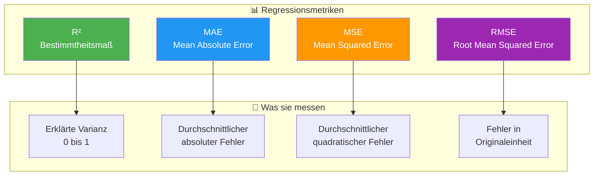
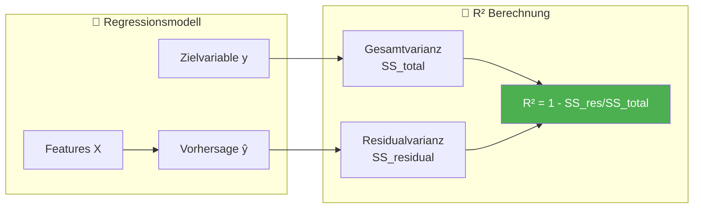
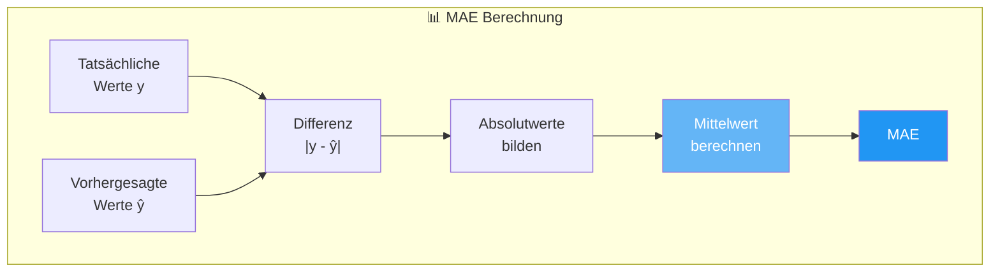
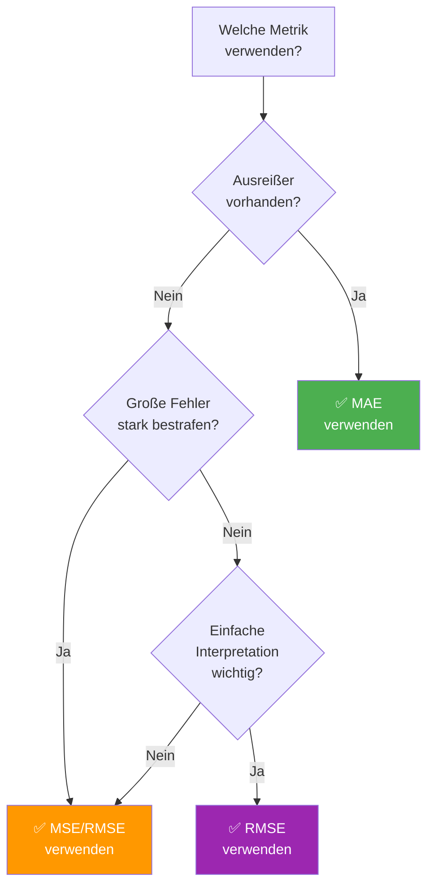
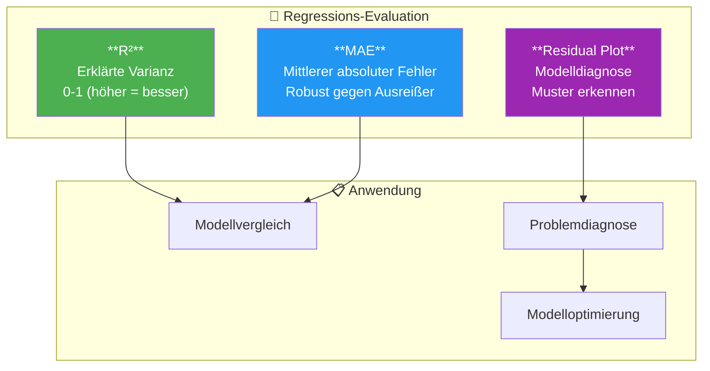

# Evaluation Regression
{: .no_toc }

> **Regressionsmodelle bewerten die Qualität ihrer Vorhersagen durch verschiedene Metriken.**       Das Bestimmtheitsmaß R², der Mean Absolute Error und die Residuenanalyse bilden das Fundament einer soliden Modellbewertung.

---

## Inhaltsverzeichnis
{: .no_toc .text-delta }

1. TOC
{:toc}

---

## Übersicht der Regressionsmetriken

Bei der Evaluation von Regressionsmodellen stehen verschiedene Metriken zur Verfügung, die unterschiedliche Aspekte der Vorhersagequalität beleuchten.



---

## Bestimmtheitsmaß (R²)

Das Bestimmtheitsmaß ist ein statistisches Maß, das verwendet wird, um den Grad der Erklärungskraft eines Modells oder einer Regressionsanalyse zu quantifizieren.

### Konzept

R² misst, wie gut die abhängige Variable durch die unabhängigen Variablen erklärt werden kann. Es beantwortet die Frage: **Wie viel der Varianz in den Daten kann das Modell erklären?**



### Interpretation

| R²-Wert | Interpretation |
|---------|----------------|
| **1.0** | Perfekte Erklärung – Modell erklärt 100% der Varianz |
| **0.8 - 1.0** | Sehr gute Erklärungskraft |
| **0.6 - 0.8** | Gute Erklärungskraft |
| **0.4 - 0.6** | Moderate Erklärungskraft |
| **0.0 - 0.4** | Schwache Erklärungskraft |
| **< 0** | Modell schlechter als Mittelwert-Vorhersage |

{: .warning }
> **Wichtig:** Ein hoher R²-Wert allein garantiert kein gutes Modell. R² sollte immer in Verbindung mit anderen Metriken und einer Residuenanalyse betrachtet werden.

### Mathematische Definition

Die Berechnung erfolgt über das Verhältnis von erklärter zu gesamter Varianz:

$$R^2 = 1 - \frac{SS_{residual}}{SS_{total}} = 1 - \frac{\sum_{i=1}^{n}(y_i - \hat{y}_i)^2}{\sum_{i=1}^{n}(y_i - \bar{y})^2}$$

Wobei:
- $y_i$ = tatsächlicher Wert
- $\hat{y}_i$ = vorhergesagter Wert
- $\bar{y}$ = Mittelwert der tatsächlichen Werte

### Implementation in Python

```python
from sklearn.metrics import r2_score
from sklearn.linear_model import LinearRegression
from sklearn.model_selection import train_test_split
import numpy as np

# Beispieldaten
data = np.array([[1], [2], [3], [4], [5], [6], [7], [8], [9], [10]])
target = np.array([2.1, 4.2, 5.8, 8.1, 10.2, 11.9, 14.1, 16.0, 18.2, 20.1])

# Train-Test-Split
data_train, data_test, target_train, target_test = train_test_split(data, target, test_size=0.2, random_state=42)

# Modell trainieren
model = LinearRegression()
model.fit(data_train, target_train)

# Vorhersagen
target_pred = model.predict(data_test)

# R² berechnen
r2 = r2_score(target_test, target_pred)
print(f"R² Score: {r2:.4f}")

# R² für Trainings- und Testdaten vergleichen
r2_train = r2_score(target_train, model.predict(data_train))
r2_test = r2_score(target_test, target_pred)

print(f"R² Training: {r2_train:.4f}")
print(f"R² Test:     {r2_test:.4f}")
```

---

## Mean Absolute Error (MAE)

Der Mean Absolute Error ist eine häufig verwendete Metrik zur Bewertung der Genauigkeit von Vorhersagemodellen.

### Konzept

MAE misst den durchschnittlichen absoluten Unterschied zwischen den tatsächlichen Werten und den vorhergesagten Werten. Er ist besonders nützlich, wenn Ausreißer in den Daten vorhanden sind, da er weniger empfindlich auf extreme Werte reagiert als andere Metriken.



### Eigenschaften

| Eigenschaft | Beschreibung |
|-------------|--------------|
| **Wertebereich** | 0 bis ∞ (je kleiner, desto besser) |
| **Einheit** | Gleiche Einheit wie Zielvariable |
| **Ausreißer** | Weniger empfindlich als MSE |
| **Interpretierbarkeit** | Leicht verständlich |

### Mathematische Definition

$$MAE = \frac{1}{n} \sum_{i=1}^{n} |y_i - \hat{y}_i|$$

### Vergleich MAE vs. MSE vs. RMSE


| Metrik | Formel | Besonderheit |
|--------|--------|--------------|
| **MAE** | $\frac{1}{n}\sum\|y-\hat{y}\|$ | Robust gegen Ausreißer |
| **MSE** | $\frac{1}{n}\sum(y-\hat{y})^2$ | Bestraft große Fehler quadratisch |
| **RMSE** | $\sqrt{MSE}$ | Interpretierbar in Originaleinheit |

### Implementation in Python

```python
from sklearn.metrics import mean_absolute_error, mean_squared_error
import numpy as np

# Beispiel: Tatsächliche und vorhergesagte Werte
target_true = np.array([3.0, -0.5, 2.0, 7.0, 4.5])
target_pred = np.array([2.5, 0.0, 2.1, 7.8, 4.2])

# Metriken berechnen
mae = mean_absolute_error(target_true, target_pred)
mse = mean_squared_error(target_true, target_pred)
rmse = np.sqrt(mse)

print(f"MAE:  {mae:.4f}")
print(f"MSE:  {mse:.4f}")
print(f"RMSE: {rmse:.4f}")
```

**Ausgabe:**
```
MAE:  0.3800
MSE:  0.2120
RMSE: 0.4604
```

### Wann welche Metrik verwenden?



---

## Residual Plot (Residuenanalyse)

Ein Residualplot ist eine statistische Analyse, die Unterschiede zwischen beobachteten und modellvorhergesagten Werten visualisiert.

### Konzept

Residuen sind die Differenzen zwischen den tatsächlichen und den vorhergesagten Werten. Ein Residualplot zeigt diese Modellfehler und hilft bei der Diagnose von Modellproblemen.

$$Residuum = y_i - \hat{y}_i$$


### Interpretation von Residual Plots

| Muster            | Bedeutung                       | Aktion                                     |
| ----------------- | ------------------------------- | ------------------------------------------ |
| **Zufällig um 0** | Modell erfasst Zusammenhang gut | ✅ Modell ist geeignet                      |
| **Trichterform**  | Heteroskedastizität             | Transformation der Zielvariable            |
| **Kurve/Bogen**   | Nicht-linearer Zusammenhang     | Polynomiale Features hinzufügen            |
| **Cluster**       | Subgruppen in Daten             | Separate Modelle oder zusätzliche Features |


### Visuelle Muster erkennen


### Implementation in Python

```python
import matplotlib.pyplot as plt
import numpy as np
from sklearn.linear_model import LinearRegression
from sklearn.model_selection import train_test_split

# Beispieldaten generieren
np.random.seed(42)
data = np.random.rand(100, 1) * 10
target = 2.5 * data.flatten() + np.random.randn(100) * 2

# Train-Test-Split
data_train, data_test, target_train, target_test = train_test_split(data, target, test_size=0.2, random_state=42)

# Modell trainieren
model = LinearRegression()
model.fit(data_train, target_train)

# Vorhersagen
target_pred_train = model.predict(data_train)
target_pred_test = model.predict(data_test)

# Residuen berechnen
residuals_train = target_train - target_pred_train
residuals_test = target_test - target_pred_test

# Residual Plot erstellen
fig, axes = plt.subplots(1, 2, figsize=(14, 5))

# Plot 1: Residuen vs. Vorhergesagte Werte
axes[0].scatter(target_pred_test, residuals_test, alpha=0.7, edgecolors='black')
axes[0].axhline(y=0, color='red', linestyle='--', linewidth=2)
axes[0].set_xlabel('Vorhergesagte Werte')
axes[0].set_ylabel('Residuen')
axes[0].set_title('Residual Plot')
axes[0].grid(True, alpha=0.3)

# Plot 2: Histogramm der Residuen
axes[1].hist(residuals_test, bins=15, edgecolor='black', alpha=0.7)
axes[1].axvline(x=0, color='red', linestyle='--', linewidth=2)
axes[1].set_xlabel('Residuen')
axes[1].set_ylabel('Häufigkeit')
axes[1].set_title('Verteilung der Residuen')
axes[1].grid(True, alpha=0.3)

plt.tight_layout()
plt.show()
```

### Vollständige Evaluation mit allen Metriken

```python
from sklearn.metrics import r2_score, mean_absolute_error, mean_squared_error
import numpy as np

def evaluate_regression(target_true, target_pred, dataset_name=""):
    """
    Vollständige Evaluation eines Regressionsmodells.

    Parameters:
    -----------
    target_true : array-like
        Tatsächliche Werte
    target_pred : array-like
        Vorhergesagte Werte
    dataset_name : str
        Name des Datensatzes (z.B. 'Training' oder 'Test')

    Returns:
    --------
    dict : Dictionary mit allen Metriken
    """
    metrics = {
        'R²': r2_score(target_true, target_pred),
        'MAE': mean_absolute_error(target_true, target_pred),
        'MSE': mean_squared_error(target_true, target_pred),
        'RMSE': np.sqrt(mean_squared_error(target_true, target_pred))
    }

    print(f"\n{'='*40}")
    print(f"Evaluation: {dataset_name}")
    print(f"{'='*40}")
    for metric, value in metrics.items():
        print(f"{metric:6s}: {value:.4f}")

    return metrics

# Anwendung
metrics_train = evaluate_regression(target_train, target_pred_train, "Training")
metrics_test = evaluate_regression(target_test, target_pred_test, "Test")
```

---

## Best Practices

### Checkliste für Regressions-Evaluation

- [ ] **R² für Training und Test berechnen** – Großer Unterschied deutet auf Overfitting hin
- [ ] **MAE und RMSE vergleichen** – Großer Unterschied deutet auf Ausreißer hin
- [ ] **Residual Plot analysieren** – Auf Muster und ungleiche Varianz prüfen
- [ ] **Residuen auf Normalverteilung prüfen** – Histogramm und Q-Q-Plot nutzen
- [ ] **Cross-Validation durchführen** – Stabilität der Metriken über Folds prüfen

### Typische Fehler vermeiden

| Fehler | Problem | Lösung |
|--------|---------|--------|
| Nur R² betrachten | Kann irreführend sein | Mehrere Metriken kombinieren |
| Train-Score als Maßstab | Overfitting übersehen | Test-Score priorisieren |
| Residuen ignorieren | Modellprobleme übersehen | Immer Residual Plot erstellen |
| Skala ignorieren | MAE/RMSE nicht vergleichbar | Auf Einheit der Zielvariable achten |

---

## Zusammenfassung



| Metrik | Stärke | Schwäche |
|--------|--------|----------|
| **R²** | Leicht interpretierbar, standardisiert | Kann bei nicht-linearen Zusammenhängen irreführen |
| **MAE** | Robust gegen Ausreißer | Keine Bestrafung großer Fehler |
| **RMSE** | Bestraft große Fehler, gleiche Einheit | Empfindlich gegen Ausreißer |
| **Residual Plot** | Zeigt Modellprobleme visuell | Subjektive Interpretation |


---

**Version:** 1.0     
**Stand:** Januar 2026    
**Kurs:** Machine Learning. Verstehen. Anwenden. Gestalten.    