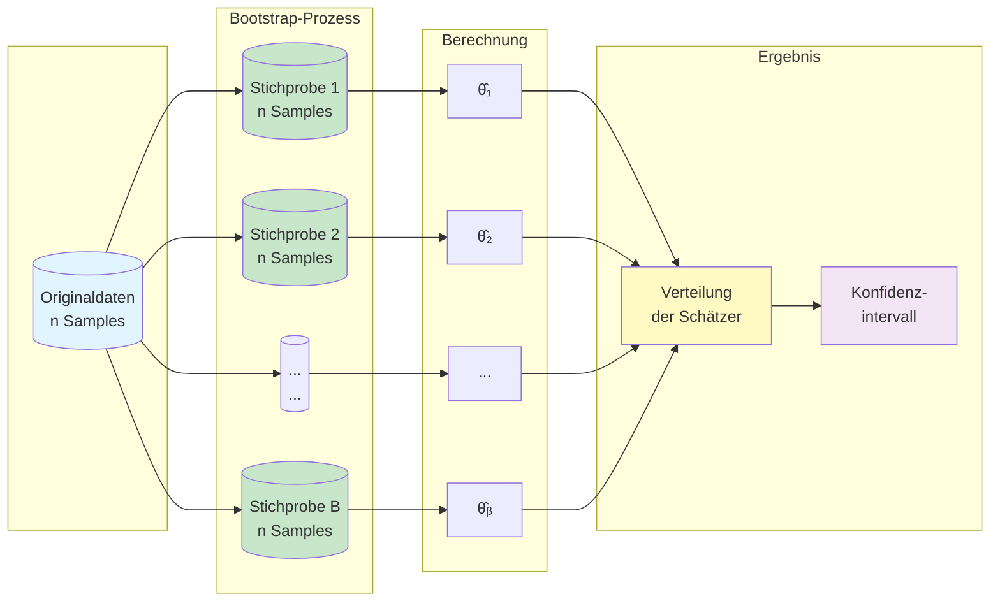
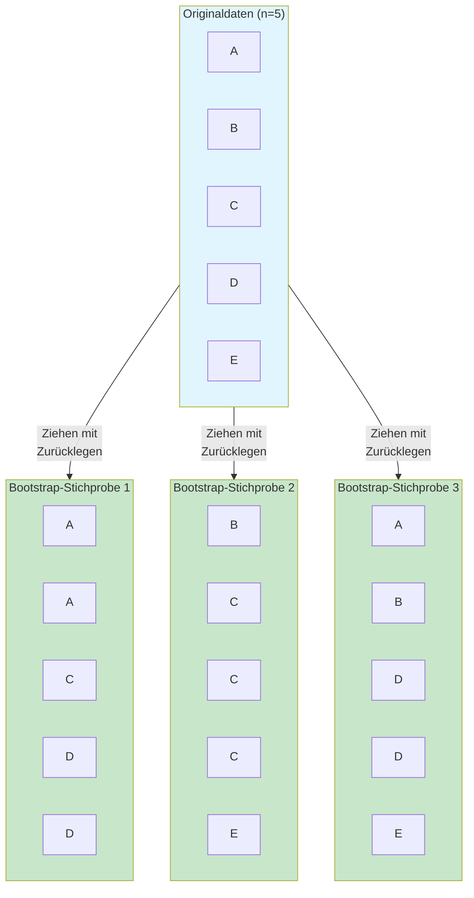
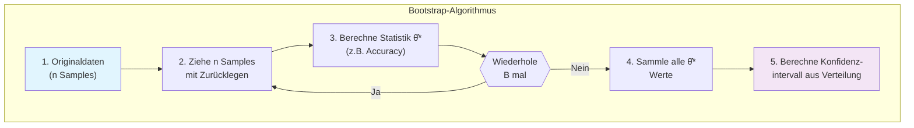
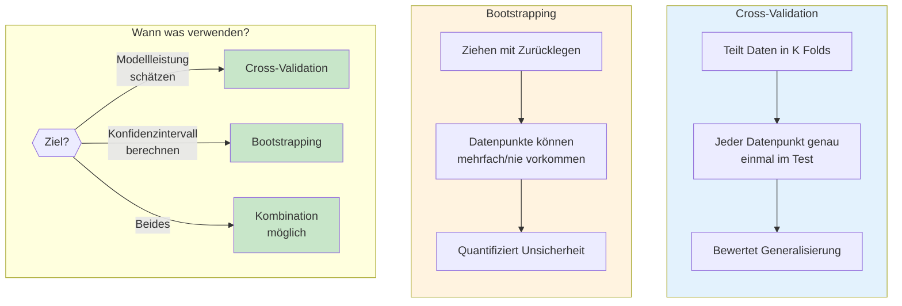
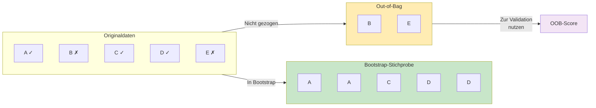
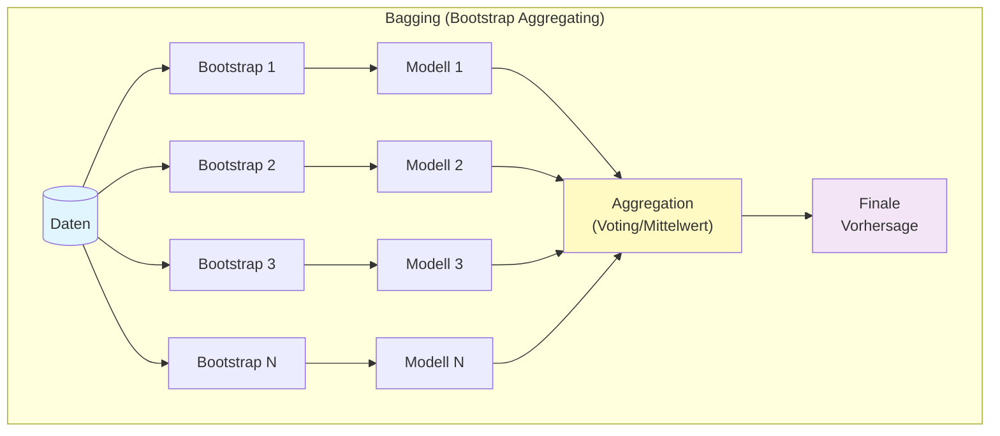
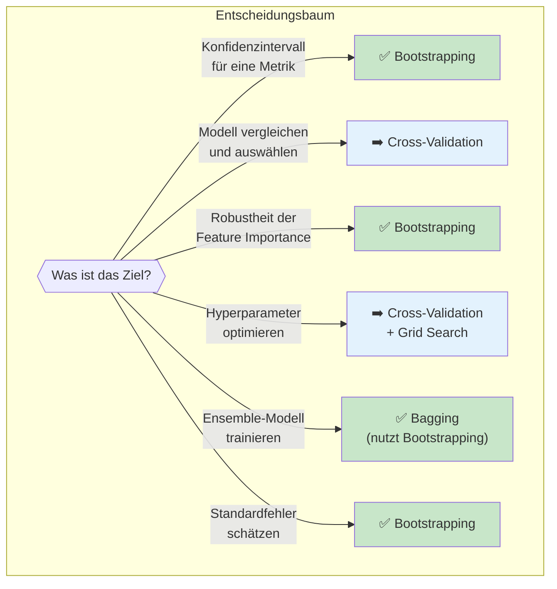

# Bootstrapping
{: .no_toc }

> **Resampling zur Schätzung von Unsicherheit**      
> Sampling mit Zurücklegen, Konfidenzintervalle und Bootstrap-Aggregating

---

## Überblick

Bootstrapping ist eine statistische Resampling-Methode zur Quantifizierung der Unsicherheit von Schätzern. Das Grundprinzip: Aus dem vorhandenen Datensatz werden wiederholt Stichproben **mit Zurücklegen** gezogen, um die Variabilität von Statistiken oder Modellvorhersagen zu schätzen.



**Kernidee:** Durch wiederholtes Ziehen mit Zurücklegen wird die ursprüngliche Stichprobe als "Population" behandelt, aus der viele neue Stichproben generiert werden. Die Variabilität dieser Bootstrap-Stichproben approximiert die wahre Unsicherheit der Schätzung.

## Warum Bootstrapping?

### Das Problem: Unsicherheit quantifizieren

Bei der Modellbewertung erhalten wir typischerweise eine einzelne Kennzahl (z.B. Accuracy = 0.85). Aber wie zuverlässig ist diese Schätzung? Würden wir mit anderen Daten ein ähnliches Ergebnis erhalten?

**Traditionelle Ansätze erfordern:**
- Annahmen über die Datenverteilung (z.B. Normalverteilung)
- Analytische Formeln für Standardfehler
- Oft unrealistische Voraussetzungen

**Bootstrapping bietet:**
- Verteilungsfreie Schätzung der Unsicherheit
- Konfidenzintervalle ohne Verteilungsannahmen
- Anwendbar auf nahezu beliebige Statistiken

### Anwendungsbereiche

| Anwendung | Beispiel |
|-----------|----------|
| **Konfidenzintervalle** | "Die Accuracy liegt mit 95% Sicherheit zwischen 0.82 und 0.88" |
| **Standardfehler** | Schätzung der Streuung von Modellmetriken |
| **Modellstabilität** | Wie stark variieren Vorhersagen bei unterschiedlichen Daten? |
| **Feature Importance** | Robustheit der Merkmalswichtigkeit überprüfen |
| **Ensemble-Methoden** | Bagging nutzt Bootstrapping für diverse Modelle |

## Funktionsweise

### Das Prinzip: Ziehen mit Zurücklegen

Bei einer Bootstrap-Stichprobe wird jeder Datenpunkt mit gleicher Wahrscheinlichkeit gezogen. Da **mit Zurücklegen** gezogen wird, kann ein Datenpunkt mehrfach oder gar nicht in einer Stichprobe vorkommen.



**Beobachtungen:**
- Stichprobe 1: A und D kommen doppelt vor, B und E fehlen
- Stichprobe 2: C kommt dreimal vor, A und D fehlen
- Stichprobe 3: D kommt doppelt vor, C fehlt

### Statistische Grundlagen

Bei n Datenpunkten und n Ziehungen mit Zurücklegen:

- **Wahrscheinlichkeit, dass ein Punkt nicht gezogen wird:** $(1 - \frac{1}{n})^n \approx e^{-1} \approx 0.368$
- **Etwa 63.2% der Originaldaten** erscheinen in jeder Bootstrap-Stichprobe
- **Etwa 36.8% bleiben "Out-of-Bag"** (OOB) und können zur Validierung genutzt werden

### Der Bootstrap-Algorithmus



**Typische Anzahl Bootstrap-Iterationen (B):**
- Standardfehler: B = 50-200 oft ausreichend
- Konfidenzintervalle: B = 1.000-10.000 empfohlen
- Publikationsreife Analysen: B ≥ 2.000

## Implementierung mit scikit-learn

### Grundlegende Verwendung mit resample

```python
import numpy as np
from sklearn.utils import resample
from sklearn.metrics import accuracy_score
from sklearn.ensemble import RandomForestClassifier

# Beispieldaten
X = np.array([[1, 2], [3, 4], [5, 6], [7, 8], [9, 10]])
y = np.array([0, 0, 1, 1, 1])

# Bootstrap-Stichprobe erstellen
X_boot, y_boot = resample(X, y, replace=True, n_samples=len(X), random_state=42)

print("Original Indizes: [0, 1, 2, 3, 4]")
print(f"Bootstrap enthält möglicherweise Duplikate")
```

### Konfidenzintervall für Modellmetriken

```python
import numpy as np
from sklearn.utils import resample
from sklearn.model_selection import train_test_split
from sklearn.ensemble import RandomForestClassifier
from sklearn.metrics import accuracy_score

def bootstrap_confidence_interval(model, X, y, n_iterations=1000, 
                                   confidence_level=0.95, random_state=42):
    """
    Berechnet Bootstrap-Konfidenzintervall für die Modell-Accuracy.
    
    Parameters
    ----------
    model : sklearn estimator
        Trainiertes oder untrainiertes Modell
    X : array-like
        Features
    y : array-like
        Zielvariable
    n_iterations : int
        Anzahl Bootstrap-Iterationen
    confidence_level : float
        Konfidenzniveau (z.B. 0.95 für 95%)
    random_state : int
        Seed für Reproduzierbarkeit
        
    Returns
    -------
    dict : Enthält Mittelwert, Standardfehler und Konfidenzintervall
    """
    np.random.seed(random_state)
    scores = []
    
    for i in range(n_iterations):
        # Bootstrap-Stichprobe ziehen
        X_boot, y_boot = resample(X, y, replace=True, random_state=random_state+i)
        
        # Modell trainieren und evaluieren
        model_clone = model.__class__(**model.get_params())
        model_clone.fit(X_boot, y_boot)
        
        # Out-of-Bag Samples für Evaluation finden
        oob_mask = ~np.isin(range(len(X)), 
                           np.unique([hash(tuple(x)) for x in X_boot]))
        
        if oob_mask.sum() > 0:
            score = accuracy_score(y[oob_mask], model_clone.predict(X[oob_mask]))
            scores.append(score)
    
    # Konfidenzintervall berechnen (Perzentil-Methode)
    alpha = 1 - confidence_level
    lower = np.percentile(scores, alpha/2 * 100)
    upper = np.percentile(scores, (1 - alpha/2) * 100)
    
    return {
        'mean': np.mean(scores),
        'std': np.std(scores),
        'ci_lower': lower,
        'ci_upper': upper,
        'confidence_level': confidence_level
    }

# Anwendungsbeispiel
from sklearn.datasets import load_iris

iris = load_iris()
X, y = iris.data, iris.target

model = RandomForestClassifier(n_estimators=100, random_state=42)
results = bootstrap_confidence_interval(model, X, y, n_iterations=500)

print(f"Accuracy: {results['mean']:.3f} ± {results['std']:.3f}")
print(f"{results['confidence_level']*100:.0f}% Konfidenzintervall: "
      f"[{results['ci_lower']:.3f}, {results['ci_upper']:.3f}]")
```

### Vereinfachte Variante mit fester Train-Test-Aufteilung

```python
import numpy as np
from sklearn.utils import resample
from sklearn.model_selection import train_test_split
from sklearn.ensemble import RandomForestClassifier
from sklearn.metrics import accuracy_score

def bootstrap_evaluate(X_train, y_train, X_test, y_test, model, n_bootstrap=1000):
    """
    Bootstrap-Evaluation mit fester Testmenge.
    """
    scores = []
    
    for i in range(n_bootstrap):
        # Bootstrap nur auf Trainingsdaten
        X_boot, y_boot = resample(X_train, y_train, replace=True)
        
        # Trainieren auf Bootstrap-Stichprobe
        model_clone = model.__class__(**model.get_params())
        model_clone.fit(X_boot, y_boot)
        
        # Evaluieren auf unveränderter Testmenge
        score = accuracy_score(y_test, model_clone.predict(X_test))
        scores.append(score)
    
    return np.array(scores)

# Anwendung
X_train, X_test, y_train, y_test = train_test_split(X, y, test_size=0.2, random_state=42)
model = RandomForestClassifier(n_estimators=50, random_state=42)

scores = bootstrap_evaluate(X_train, y_train, X_test, y_test, model, n_bootstrap=500)

print(f"Accuracy: {scores.mean():.3f} ± {scores.std():.3f}")
print(f"95% CI: [{np.percentile(scores, 2.5):.3f}, {np.percentile(scores, 97.5):.3f}]")
```

## Methoden zur Berechnung von Konfidenzintervallen

### Perzentil-Methode (Standard)

Die einfachste und gebräuchlichste Methode:

```python
def percentile_ci(bootstrap_scores, confidence_level=0.95):
    """
    Perzentil-Konfidenzintervall.
    """
    alpha = 1 - confidence_level
    lower = np.percentile(bootstrap_scores, alpha/2 * 100)
    upper = np.percentile(bootstrap_scores, (1 - alpha/2) * 100)
    return lower, upper

# Beispiel: 95% CI
lower, upper = percentile_ci(scores, 0.95)
print(f"95% Perzentil-CI: [{lower:.3f}, {upper:.3f}]")
```

### Bias-korrigierte Methode (BCa)

Korrigiert für Verzerrung und Schiefe der Bootstrap-Verteilung:

```python
from scipy import stats

def bca_ci(bootstrap_scores, original_score, confidence_level=0.95):
    """
    Bias-korrigiertes und beschleunigtes Konfidenzintervall.
    
    Genauer als Perzentil-Methode, besonders bei schiefen Verteilungen.
    """
    alpha = 1 - confidence_level
    
    # Bias-Korrektur
    z0 = stats.norm.ppf(np.mean(bootstrap_scores < original_score))
    
    # Beschleunigungsfaktor (Jackknife)
    n = len(bootstrap_scores)
    jackknife_scores = np.array([
        np.mean(np.delete(bootstrap_scores, i)) 
        for i in range(n)
    ])
    mean_jack = np.mean(jackknife_scores)
    a = np.sum((mean_jack - jackknife_scores)**3) / \
        (6 * np.sum((mean_jack - jackknife_scores)**2)**1.5)
    
    # Korrigierte Perzentile
    z_alpha = stats.norm.ppf(alpha/2)
    z_1_alpha = stats.norm.ppf(1 - alpha/2)
    
    p_lower = stats.norm.cdf(z0 + (z0 + z_alpha) / (1 - a * (z0 + z_alpha)))
    p_upper = stats.norm.cdf(z0 + (z0 + z_1_alpha) / (1 - a * (z0 + z_1_alpha)))
    
    lower = np.percentile(bootstrap_scores, p_lower * 100)
    upper = np.percentile(bootstrap_scores, p_upper * 100)
    
    return lower, upper
```

### Vergleich der Methoden

| Methode | Vorteile | Nachteile |
|---------|----------|-----------|
| **Perzentil** | Einfach, intuitiv | Kann bei Verzerrung ungenau sein |
| **BCa** | Korrigiert Verzerrung/Schiefe | Komplexer, mehr Rechenaufwand |
| **t-Intervall** | Gut bei Normalverteilung | Erfordert Normalverteilungsannahme |

## Bootstrapping vs. Cross-Validation



### Direkter Vergleich

| Aspekt | Cross-Validation | Bootstrapping |
|--------|------------------|---------------|
| **Hauptzweck** | Robuste Schätzung der Generalisierungsfähigkeit | Quantifizierung der Unsicherheit von Schätzern |
| **Stichprobenziehung** | Ohne Zurücklegen (disjunkte Folds) | Mit Zurücklegen (Überlappung möglich) |
| **Datenpunkt-Nutzung** | Jeder Punkt genau einmal im Test | ~63% in jeder Stichprobe, 37% OOB |
| **Output** | Durchschnittliche Metrik über K Folds | Verteilung der Metrik, Konfidenzintervalle |
| **Typische Iteration** | K = 5 oder 10 | B = 1.000 bis 10.000 |
| **Rechenaufwand** | Moderat (K Modelle) | Hoch (B Modelle) |
| **Anwendung** | Modellauswahl, Hyperparameter-Tuning | Standardfehler, Konfidenzintervalle |

### Empfehlung

```python
# Cross-Validation: Für Modellbewertung und -auswahl
from sklearn.model_selection import cross_val_score

cv_scores = cross_val_score(model, X, y, cv=5, scoring='accuracy')
print(f"CV Accuracy: {cv_scores.mean():.3f} ± {cv_scores.std():.3f}")

# Bootstrapping: Für Konfidenzintervalle der finalen Schätzung
bootstrap_scores = bootstrap_evaluate(X_train, y_train, X_test, y_test, model)
print(f"95% CI: [{np.percentile(bootstrap_scores, 2.5):.3f}, "
      f"{np.percentile(bootstrap_scores, 97.5):.3f}]")
```

## Out-of-Bag (OOB) Evaluation

Bei Bootstrapping werden etwa 36.8% der Daten nicht gezogen. Diese "Out-of-Bag"-Samples können zur Modellbewertung genutzt werden – ein Prinzip, das Random Forest automatisch nutzt.



### OOB-Score bei Random Forest

```python
from sklearn.ensemble import RandomForestClassifier

# OOB-Score automatisch berechnen lassen
rf = RandomForestClassifier(
    n_estimators=100,
    oob_score=True,      # OOB-Evaluation aktivieren
    random_state=42
)
rf.fit(X_train, y_train)

print(f"OOB-Score: {rf.oob_score_:.3f}")
print(f"Test-Score: {rf.score(X_test, y_test):.3f}")
```

## Bootstrapping in Ensemble-Methoden

Bootstrapping ist ein fundamentaler Bestandteil von Bagging (Bootstrap Aggregating) und wird von Random Forest genutzt.



### Implementierung von Bagging

```python
from sklearn.ensemble import BaggingClassifier
from sklearn.tree import DecisionTreeClassifier

# Bagging mit Entscheidungsbäumen (= vereinfachter Random Forest)
bagging = BaggingClassifier(
    estimator=DecisionTreeClassifier(),
    n_estimators=100,        # Anzahl Bootstrap-Modelle
    max_samples=1.0,         # Stichprobengröße (1.0 = gleich wie Original)
    bootstrap=True,          # Mit Zurücklegen (echtes Bootstrapping)
    oob_score=True,          # OOB-Evaluation
    random_state=42
)

bagging.fit(X_train, y_train)
print(f"OOB-Score: {bagging.oob_score_:.3f}")
print(f"Test-Score: {bagging.score(X_test, y_test):.3f}")
```

## Vollständiges Beispiel: Bootstrap-Analyse

```python
import numpy as np
import matplotlib.pyplot as plt
from sklearn.datasets import load_breast_cancer
from sklearn.model_selection import train_test_split
from sklearn.ensemble import RandomForestClassifier
from sklearn.utils import resample
from sklearn.metrics import accuracy_score, f1_score

# 1. Daten laden
data = load_breast_cancer()
X, y = data.data, data.target

# 2. Train-Test-Split
X_train, X_test, y_train, y_test = train_test_split(
    X, y, test_size=0.2, random_state=42, stratify=y
)

# 3. Bootstrap-Funktion für mehrere Metriken
def bootstrap_metrics(X_train, y_train, X_test, y_test, model, 
                      n_bootstrap=1000, random_state=42):
    """
    Berechnet Bootstrap-Verteilungen für Accuracy und F1-Score.
    """
    np.random.seed(random_state)
    accuracies = []
    f1_scores = []
    
    for i in range(n_bootstrap):
        # Bootstrap-Stichprobe
        X_boot, y_boot = resample(X_train, y_train, random_state=random_state+i)
        
        # Modell trainieren
        model_clone = model.__class__(**model.get_params())
        model_clone.fit(X_boot, y_boot)
        
        # Metriken berechnen
        y_pred = model_clone.predict(X_test)
        accuracies.append(accuracy_score(y_test, y_pred))
        f1_scores.append(f1_score(y_test, y_pred))
    
    return np.array(accuracies), np.array(f1_scores)

# 4. Bootstrap durchführen
model = RandomForestClassifier(n_estimators=100, random_state=42)
accuracies, f1_scores = bootstrap_metrics(
    X_train, y_train, X_test, y_test, model, n_bootstrap=1000
)

# 5. Ergebnisse zusammenfassen
def summarize_bootstrap(scores, metric_name, confidence_level=0.95):
    """Fasst Bootstrap-Ergebnisse zusammen."""
    alpha = 1 - confidence_level
    return {
        'metric': metric_name,
        'mean': np.mean(scores),
        'std': np.std(scores),
        'ci_lower': np.percentile(scores, alpha/2 * 100),
        'ci_upper': np.percentile(scores, (1 - alpha/2) * 100)
    }

acc_summary = summarize_bootstrap(accuracies, 'Accuracy')
f1_summary = summarize_bootstrap(f1_scores, 'F1-Score')

print("=" * 50)
print("Bootstrap-Ergebnisse (n=1000 Iterationen)")
print("=" * 50)
for summary in [acc_summary, f1_summary]:
    print(f"\n{summary['metric']}:")
    print(f"  Mittelwert:      {summary['mean']:.4f}")
    print(f"  Standardfehler:  {summary['std']:.4f}")
    print(f"  95% CI:          [{summary['ci_lower']:.4f}, {summary['ci_upper']:.4f}]")

# 6. Visualisierung
fig, axes = plt.subplots(1, 2, figsize=(12, 4))

for ax, scores, name in zip(axes, [accuracies, f1_scores], ['Accuracy', 'F1-Score']):
    ax.hist(scores, bins=30, edgecolor='black', alpha=0.7)
    ax.axvline(np.mean(scores), color='red', linestyle='--', 
               label=f'Mittelwert: {np.mean(scores):.3f}')
    ax.axvline(np.percentile(scores, 2.5), color='orange', linestyle=':', 
               label=f'95% CI')
    ax.axvline(np.percentile(scores, 97.5), color='orange', linestyle=':')
    ax.set_xlabel(name)
    ax.set_ylabel('Häufigkeit')
    ax.set_title(f'Bootstrap-Verteilung: {name}')
    ax.legend()

plt.tight_layout()
plt.savefig('bootstrap_distribution.png', dpi=150, bbox_inches='tight')
plt.show()
```

## Best Practices

### Dos ✅

- **Ausreichend viele Iterationen** verwenden (≥1000 für Konfidenzintervalle)
- **Reproduzierbarkeit** durch `random_state` sicherstellen
- **Mehrere Metriken** gleichzeitig bootstrappen für umfassende Analyse
- **Visualisierung** der Bootstrap-Verteilung zur Überprüfung
- **OOB-Scores** bei Ensemble-Methoden nutzen

### Don'ts ❌

- **Nicht zu wenige Iterationen** (B < 100 ist zu wenig für zuverlässige CI)
- **Nicht bei sehr kleinen Datensätzen** ohne Vorsicht (n < 20 problematisch)
- **Nicht als Ersatz für Cross-Validation** bei Modellauswahl
- **Nicht vergessen**: Bootstrap-CI sind Approximationen, keine exakten Werte

## Wann Bootstrapping verwenden?



## Zusammenfassung

| Aspekt | Details |
|--------|---------|
| **Was?** | Resampling-Methode durch Ziehen mit Zurücklegen |
| **Warum?** | Quantifizierung der Unsicherheit ohne Verteilungsannahmen |
| **Wann?** | Konfidenzintervalle, Standardfehler, Modellstabilität |
| **Wie viele?** | B ≥ 1.000 für zuverlässige Konfidenzintervalle |
| **Besonderheit** | ~63% der Daten in jeder Stichprobe, 37% OOB |
| **Integration** | Automatisch in Bagging/Random Forest integriert |

Bootstrapping ergänzt Cross-Validation optimal: Während Cross-Validation die Generalisierungsfähigkeit eines Modells bewertet, quantifiziert Bootstrapping die Unsicherheit dieser Schätzung. Beide Methoden zusammen liefern ein umfassendes Bild der Modellqualität.

## Weiterführende Themen

- **Cross-Validation**: Robustere Modellbewertung durch K-Fold
- **Nested Cross-Validation**: Kombination von Modellauswahl und Evaluation
- **Jackknife**: Alternative Resampling-Methode (Ziehen ohne Zurücklegen)
- **Bagging & Boosting**: Ensemble-Methoden mit Bootstrap-Grundlage

---

*Referenzen:*
- Efron, B., & Tibshirani, R. J. (1993). An Introduction to the Bootstrap
- scikit-learn Dokumentation: [resample](https://scikit-learn.org/stable/modules/generated/sklearn.utils.resample.html)
- StatQuest: [Bootstrapping](https://www.youtube.com/watch?v=Xz0x-8-cgaQ)

---

**Version:** 1.0    
**Stand:** Januar 2026    
**Kurs:** Machine Learning. Verstehen. Anwenden. Gestalten.    
