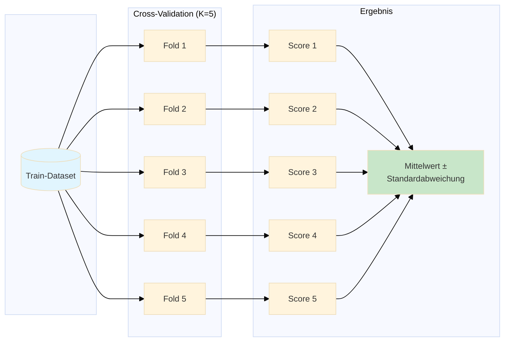
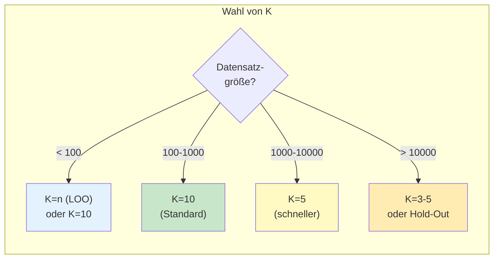
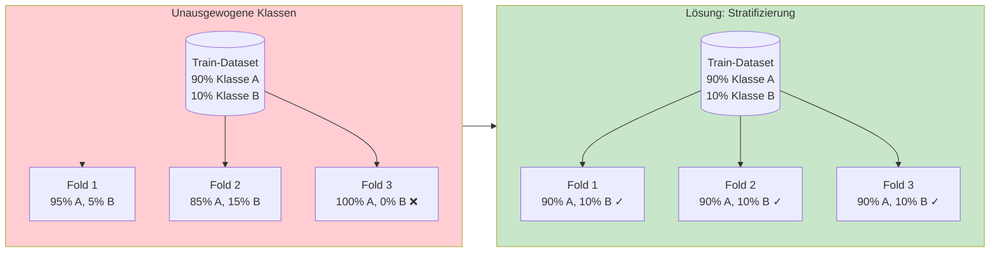
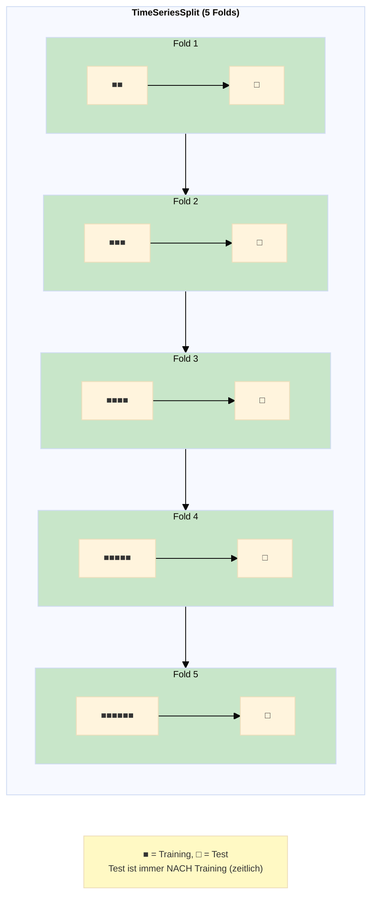
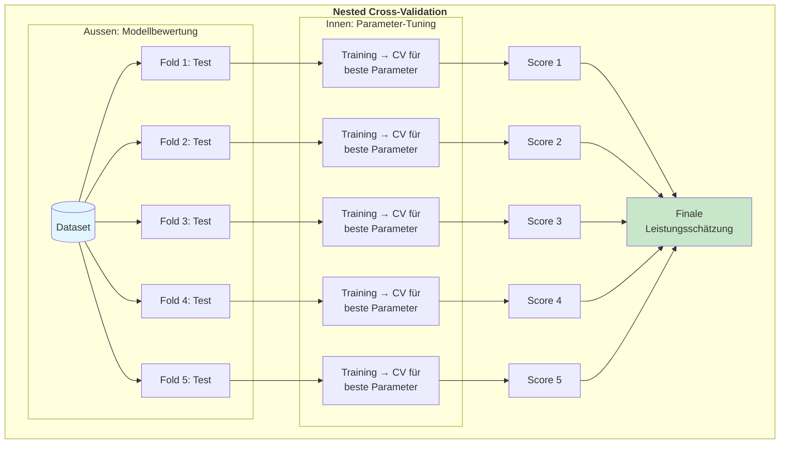
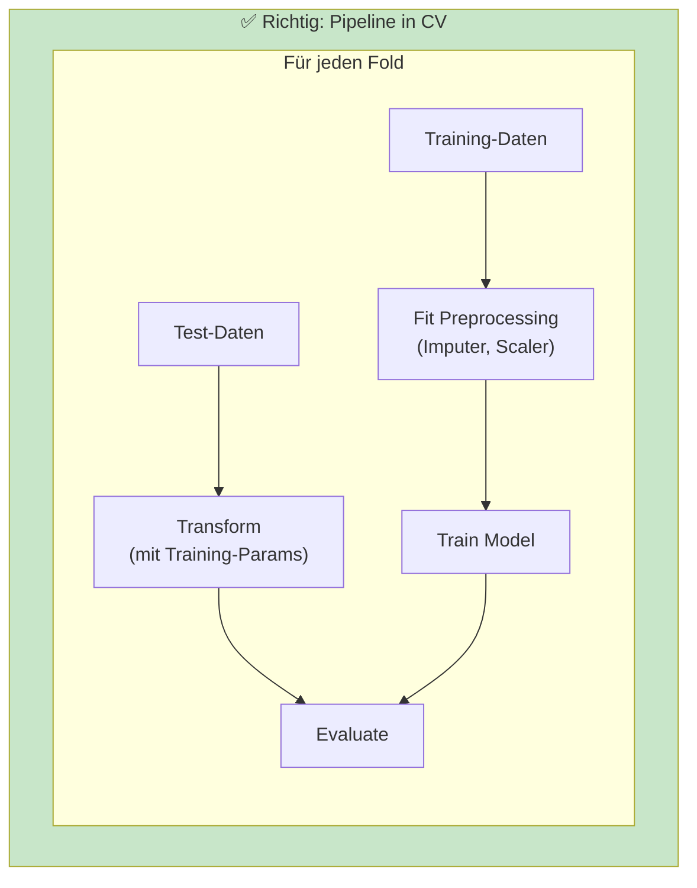
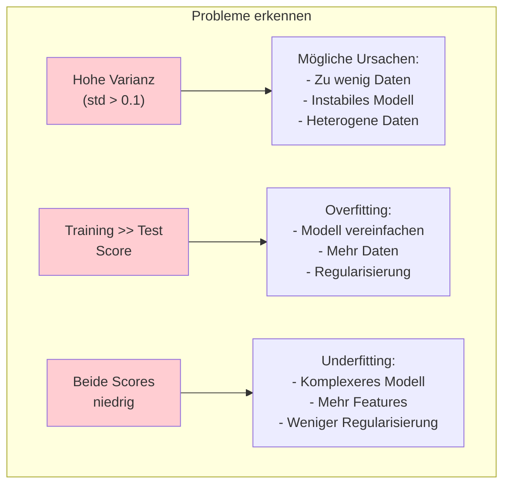
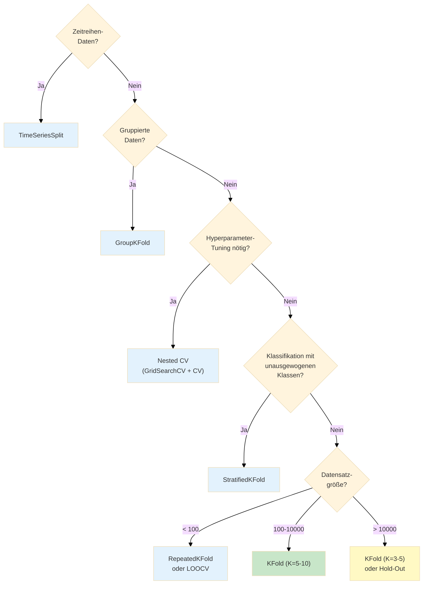

# Cross-Validation
{: .no_toc }

> **Robuste Modellbewertung durch Kreuzvalidierung**      
> K-Fold, Stratified K-Fold, Leave-One-Out und Time Series Split

---

# Inhaltsverzeichnis
{: .no_toc .text-delta }

1. TOC
{:toc}

---

## Überblick

Cross-Validation (Kreuzvalidierung) ist ein statistisches Verfahren zur Bewertung der **Generalisierungsfähigkeit** eines Machine-Learning-Modells. Im Gegensatz zum einfachen Train-Test-Split wird der Datensatz mehrfach unterschiedlich aufgeteilt, wodurch eine robustere und zuverlässigere Leistungsbewertung entsteht.

> [!NOTE] Warum CV?     
> Cross-Validation reduziert Zufallseffekte einzelner Splits und liefert stabilere Leistungsschätzungen.




## Warum Cross-Validation?

Ein einfacher Train-Test-Split hat Limitierungen:

| Problem | Auswirkung | Lösung durch CV |
|---------|------------|-----------------|
| **Zufällige Aufteilung** | Ein "glücklicher" Split kann unrealistisch gute Ergebnisse liefern | Mehrfache Splits mitteln Zufallseffekte aus |
| **Datenverlust** | 20-30% der Daten werden nicht zum Training genutzt | Jeder Datenpunkt wird einmal zum Testen verwendet |
| **Keine Varianzschätzung** | Unbekannt, wie stabil das Modell ist | Standardabweichung zeigt Stabilität |
| **Kleine Datensätze** | Zu wenig Daten für zuverlässige Evaluation | Effizientere Nutzung aller verfügbaren Daten |

**Generalisierungsfähigkeit** bedeutet: Wie gut kann ein trainiertes Modell auf neuen, bisher ungesehenen Daten Vorhersagen treffen? Cross-Validation liefert eine realistischere Schätzung dieser Fähigkeit.

## K-Fold Cross-Validation

Die gebräuchlichste Variante ist **K-Fold Cross-Validation**. Der Datensatz wird in K gleich große Teile (Folds) aufgeteilt. In K Durchläufen wird jeweils ein anderer Fold als Testset verwendet.

```mermaid
flowchart TB
    subgraph kfold["K-Fold Cross-Validation (K=5)"]
        subgraph run1["Durchlauf 1"]
            T1["Test"] --- TR1["Training"] --- TR2["Training"] --- TR3["Training"] --- TR4["Training"]
        end
        subgraph run2["Durchlauf 2"]
            TR5["Training"] --- T2["Test"] --- TR6["Training"] --- TR7["Training"] --- TR8["Training"]
        end
        subgraph run3["Durchlauf 3"]
            TR9["Training"] --- TR10["Training"] --- T3["Test"] --- TR11["Training"] --- TR12["Training"]
        end
        subgraph run4["Durchlauf 4"]
            TR13["Training"] --- TR14["Training"] --- TR15["Training"] --- T4["Test"] --- TR16["Training"]
        end
        subgraph run5["Durchlauf 5"]
            TR17["Training"] --- TR18["Training"] --- TR19["Training"] --- TR20["Training"] --- T5["Test"]
        end
    end
    
    run1 --> S1["Score 1"]
    run2 --> S2["Score 2"]
    run3 --> S3["Score 3"]
    run4 --> S4["Score 4"]
    run5 --> S5["Score 5"]
    
    S1 --> AVG["Durchschnitt: 0.85 ± 0.03"]
    S2 --> AVG
    S3 --> AVG
    S4 --> AVG
    S5 --> AVG
    
%% Blaues Farbschema für Test-Folds%% 
style T1 fill:#2196f3,color:#fff,stroke:#0d47a1 
style T2 fill:#2196f3,color:#fff,stroke:#0d47a1 
style T3 fill:#2196f3,color:#fff,stroke:#0d47a1 
style T4 fill:#2196f3,color:#fff,stroke:#0d47a1 
style T5 fill:#2196f3,color:#fff,stroke:#0d47a1 
style AVG fill:#c8e6c9
```



### Ablauf im Detail

1. **Aufteilung:** Datensatz wird in K Folds aufgeteilt
2. **Iteration:** Für jeden Fold k (von 1 bis K):
   - Fold k wird als Testset verwendet
   - Die restlichen K-1 Folds bilden das Trainingsset
   - Modell wird trainiert und auf dem Testset evaluiert
3. **Aggregation:** Mittelwert und Standardabweichung der K Scores berechnen

### Implementierung mit scikit-learn

#### Einfache Variante: `cross_val_score`

```python
from sklearn.model_selection import cross_val_score
from sklearn.ensemble import RandomForestClassifier
from sklearn.datasets import load_iris

# Daten laden
data, target = load_iris(return_X_y=True)

# Modell definieren
model = RandomForestClassifier(random_state=42)

# 5-Fold Cross-Validation durchführen
scores = cross_val_score(model, data, target, cv=5, scoring='accuracy')

print(f"Einzelne Scores: {scores}")
print(f"Accuracy: {scores.mean():.3f} (+/- {scores.std() * 2:.3f})")
```

**Ausgabe:**
```
Einzelne Scores: [0.967 0.967 0.933 0.967 1.000]
Accuracy: 0.967 (+/- 0.043)
```

#### Erweiterte Variante: `cross_validate`

Für mehrere Metriken gleichzeitig:

```python
from sklearn.model_selection import cross_validate
from sklearn.linear_model import LogisticRegression

model = LogisticRegression(max_iter=1000)

# Mehrere Metriken gleichzeitig
scoring = ['accuracy', 'precision_macro', 'recall_macro', 'f1_macro']

results = cross_validate(
    model, data, target,
    cv=5,
    scoring=scoring,
    return_train_score=True  # Auch Training-Scores zurückgeben
)

# Ergebnisse anzeigen
for metric in scoring:
    train_key = f'train_{metric}'
    test_key = f'test_{metric}'
    print(f"{metric}:")
    print(f"  Training: {results[train_key].mean():.3f} (+/- {results[train_key].std():.3f})")
    print(f"  Test:     {results[test_key].mean():.3f} (+/- {results[test_key].std():.3f})")
```

#### Manuelle Kontrolle: `KFold`

Für volle Kontrolle über den Prozess:

```python
from sklearn.model_selection import KFold
from sklearn.metrics import accuracy_score
import numpy as np

kf = KFold(n_splits=5, shuffle=True, random_state=42)
model = RandomForestClassifier(random_state=42)

scores = []
fold = 1

for train_index, test_index in kf.split(data):
    # Daten aufteilen
    data_train, data_test = data[train_index], data[test_index]
    target_train, target_test = target[train_index], target[test_index]

    # Modell trainieren und evaluieren
    model.fit(data_train, target_train)
    target_pred = model.predict(data_test)
    score = accuracy_score(target_test, target_pred)

    scores.append(score)
    print(f"Fold {fold}: Accuracy = {score:.3f}")
    fold += 1

print(f"\nGesamt: {np.mean(scores):.3f} (+/- {np.std(scores) * 2:.3f})")
```

## Wahl von K

> [!TIP] Startwerte     
> In der Praxis sind `K=5` oder `K=10` meist ein guter Kompromiss aus Rechenzeit und Stabilität.

Die Anzahl der Folds beeinflusst die Qualität der Schätzung:

| K-Wert | Vorteile | Nachteile | Empfehlung |
|--------|----------|-----------|------------|
| **K=5** | Gute Balance, schnell | Etwas höhere Varianz | Standard für mittlere Datensätze |
| **K=10** | Niedrigerer Bias | Höherer Rechenaufwand | Standard für die meisten Fälle |
| **K=n (LOO)** | Minimaler Bias, maximale Trainingsdaten | Sehr hoher Rechenaufwand, hohe Varianz | Nur für sehr kleine Datensätze |
| **K=3** | Sehr schnell | Höherer Bias | Nur für sehr große Datensätze |



**Faustregel:** K=5 oder K=10 sind in den meisten Fällen gute Standardwerte.

## Stratifizierte Cross-Validation

Bei **Klassifikationsproblemen** mit unausgewogenen Klassen sollte die Klassenverteilung in jedem Fold der Gesamtverteilung entsprechen:



### Implementierung

```python
from sklearn.model_selection import StratifiedKFold, cross_val_score

# Stratifizierte K-Fold CV
skf = StratifiedKFold(n_splits=5, shuffle=True, random_state=42)

# Mit cross_val_score (automatisch stratifiziert bei Klassifikation)
scores = cross_val_score(model, data, target, cv=skf, scoring='accuracy')

# Oder einfacher - cv=5 verwendet automatisch StratifiedKFold für Klassifikation
scores = cross_val_score(model, data, target, cv=5, scoring='accuracy')
```

### Überprüfung der Verteilung

```python
from sklearn.model_selection import StratifiedKFold
import numpy as np

target = np.array([0]*90 + [1]*10)  # Unausgewogen: 90% vs 10%
skf = StratifiedKFold(n_splits=5, shuffle=True, random_state=42)

print("Klassenverteilung pro Fold:")
for fold, (train_idx, test_idx) in enumerate(skf.split(np.zeros(len(target)), target), 1):
    train_dist = np.bincount(target[train_idx]) / len(train_idx) * 100
    test_dist = np.bincount(target[test_idx]) / len(test_idx) * 100
    print(f"Fold {fold}: Train [{train_dist[0]:.1f}%, {train_dist[1]:.1f}%] | "
          f"Test [{test_dist[0]:.1f}%, {test_dist[1]:.1f}%]")
```

## CV-Strategien im Vergleich

### Übersicht

| Strategie | Beschreibung | Rechenaufwand | Varianz | Bias |
|-----------|--------------|---------------|---------|------|
| **K-Fold** | Daten in K Teile, jeder einmal Test | Moderat (K Modelle) | Mittel | Mittel |
| **Stratified K-Fold** | Wie K-Fold, erhält Klassenverteilung | Moderat | Mittel | Mittel |
| **Leave-One-Out (LOO)** | Jeder Datenpunkt einmal Test | Sehr hoch (n Modelle) | Hoch | Niedrig |
| **Hold-Out** | Einmaliger Split | Niedrig (1 Modell) | Hoch | Variabel |
| **Repeated K-Fold** | K-Fold mehrfach mit verschiedenen Splits | Hoch | Niedrig | Niedrig |

### Leave-One-Out Cross-Validation (LOOCV)

Bei LOOCV wird jeder einzelne Datenpunkt einmal als Testset verwendet:

```python
from sklearn.model_selection import LeaveOneOut, cross_val_score

loo = LeaveOneOut()

# Achtung: Bei großen Datensätzen sehr langsam!
scores = cross_val_score(model, data, target, cv=loo, scoring='accuracy')

print(f"Anzahl Durchläufe: {len(scores)}")
print(f"Accuracy: {scores.mean():.3f}")
```

**Wann LOOCV verwenden?**
- Sehr kleine Datensätze (< 50-100 Samples)
- Wenn maximale Trainingsdaten benötigt werden
- Wenn Rechenzeit keine Rolle spielt

### Repeated K-Fold

Für stabilere Schätzungen wird K-Fold mehrfach mit unterschiedlichen Zufalls-Splits wiederholt:

```python
from sklearn.model_selection import RepeatedKFold, RepeatedStratifiedKFold

# 5-Fold CV, 10 Mal wiederholt = 50 Durchläufe
rkf = RepeatedKFold(n_splits=5, n_repeats=10, random_state=42)

# Stratifizierte Version
rskf = RepeatedStratifiedKFold(n_splits=5, n_repeats=10, random_state=42)

scores = cross_val_score(model, data, target, cv=rskf, scoring='accuracy')
print(f"Accuracy: {scores.mean():.3f} (+/- {scores.std() * 2:.3f})")
```

### Gruppierte Cross-Validation

Wenn Datenpunkte zu Gruppen gehören (z.B. mehrere Messungen pro Patient), müssen alle Samples einer Gruppe im selben Fold sein:

```python
from sklearn.model_selection import GroupKFold
import numpy as np

# Beispiel: 3 Patienten mit je mehreren Messungen
groups = np.array([1, 1, 1, 2, 2, 2, 3, 3, 3, 3])

gkf = GroupKFold(n_splits=3)

for fold, (train_idx, test_idx) in enumerate(gkf.split(data, target, groups), 1):
    print(f"Fold {fold}:")
    print(f"  Training-Gruppen: {np.unique(groups[train_idx])}")
    print(f"  Test-Gruppen: {np.unique(groups[test_idx])}")
```

### Zeitreihen Cross-Validation

Bei Zeitreihen darf die zeitliche Reihenfolge nicht verletzt werden:

```python
from sklearn.model_selection import TimeSeriesSplit

tscv = TimeSeriesSplit(n_splits=5)

# Visualisierung der Splits
for fold, (train_idx, test_idx) in enumerate(tscv.split(data), 1):
    print(f"Fold {fold}:")
    print(f"  Training: Index {train_idx[0]} bis {train_idx[-1]}")
    print(f"  Test:     Index {test_idx[0]} bis {test_idx[-1]}")
```



## Nested Cross-Validation

Bei der Kombination von **Hyperparameter-Tuning** und **Modellbewertung** besteht die Gefahr des Overfittings auf die Validierungsdaten. Nested CV löst dieses Problem:



### Zweck der zwei Ebenen

| Ebene | Zweck | Was wird gemacht? |
|-------|-------|-------------------|
| **Innere Schleife** | Hyperparameter-Tuning | Beste Parameter für das aktuelle Training finden |
| **Äußere Schleife** | Modellbewertung | Unvoreingenommene Leistungsschätzung |

### Implementierung

```python
from sklearn.model_selection import cross_val_score, GridSearchCV, KFold
from sklearn.ensemble import RandomForestClassifier
from sklearn.datasets import load_breast_cancer

# Daten laden
X, y = load_breast_cancer(return_X_y=True)

# Äußere CV-Schleife
outer_cv = KFold(n_splits=5, shuffle=True, random_state=42)

# Innere CV-Schleife (für Hyperparameter-Tuning)
inner_cv = KFold(n_splits=3, shuffle=True, random_state=42)

# Modell und Hyperparameter-Grid
model = RandomForestClassifier(random_state=42)
param_grid = {
    'n_estimators': [50, 100, 200],
    'max_depth': [5, 10, None],
    'min_samples_split': [2, 5, 10]
}

# GridSearchCV für innere Schleife
grid_search = GridSearchCV(
    model, param_grid,
    cv=inner_cv,
    scoring='accuracy',
    n_jobs=-1
)

# Nested CV durchführen
nested_scores = cross_val_score(
    grid_search, X, y,
    cv=outer_cv,
    scoring='accuracy'
)

print(f"Nested CV Accuracy: {nested_scores.mean():.3f} (+/- {nested_scores.std() * 2:.3f})")
```

### Vergleich: Einfache CV vs. Nested CV

```python
from sklearn.model_selection import cross_val_score, GridSearchCV

# ❌ FALSCH: Einfache CV nach GridSearch (optimistisch verzerrt)
grid_search = GridSearchCV(model, param_grid, cv=5)
grid_search.fit(X, y)
print(f"Beste CV-Score aus GridSearch: {grid_search.best_score_:.3f}")
# Dieser Score ist zu optimistisch!

# ✅ RICHTIG: Nested CV (unvoreingenommene Schätzung)
nested_scores = cross_val_score(grid_search, X, y, cv=5)
print(f"Nested CV Score: {nested_scores.mean():.3f}")
# Dieser Score ist realistischer!
```

## Cross-Validation mit Pipelines

> [!WARNING] Leakage-Risiko     
> Vorverarbeitung muss innerhalb der Pipeline passieren. Externes `fit_transform` vor CV führt oft zu zu optimistischen Ergebnissen.

Um **Data Leakage** zu vermeiden, muss die gesamte Vorverarbeitung innerhalb der CV-Schleife erfolgen:

```python
from sklearn.pipeline import Pipeline
from sklearn.preprocessing import StandardScaler
from sklearn.impute import SimpleImputer
from sklearn.svm import SVC
from sklearn.model_selection import cross_val_score

# Pipeline definieren
pipeline = Pipeline([
    ('imputer', SimpleImputer(strategy='mean')),
    ('scaler', StandardScaler()),
    ('classifier', SVC())
])

# Cross-Validation auf der Pipeline
# Preprocessing wird in JEDEM Fold neu gefittet!
scores = cross_val_score(pipeline, data, target, cv=5, scoring='accuracy')

print(f"Accuracy: {scores.mean():.3f} (+/- {scores.std() * 2:.3f})")
```



### Vollständiges Beispiel mit ColumnTransformer

```python
import pandas as pd
from sklearn.compose import ColumnTransformer
from sklearn.pipeline import Pipeline
from sklearn.preprocessing import StandardScaler, OneHotEncoder
from sklearn.impute import SimpleImputer
from sklearn.ensemble import GradientBoostingClassifier
from sklearn.model_selection import cross_val_score
import numpy as np

# Beispieldaten erstellen
np.random.seed(42)
df = pd.DataFrame({
    'alter': np.random.randint(18, 80, 200),
    'einkommen': np.random.randint(20000, 150000, 200),
    'stadt': np.random.choice(['Berlin', 'München', 'Hamburg'], 200),
    'beruf': np.random.choice(['IT', 'Finanzen', 'Gesundheit', 'Bildung'], 200),
    'target': np.random.randint(0, 2, 200)
})

# Features und Target
X = df.drop('target', axis=1)
y = df['target']

# Feature-Listen
numeric_features = ['alter', 'einkommen']
categorical_features = ['stadt', 'beruf']

# Preprocessing
numeric_transformer = Pipeline([
    ('imputer', SimpleImputer(strategy='median')),
    ('scaler', StandardScaler())
])

categorical_transformer = Pipeline([
    ('imputer', SimpleImputer(strategy='most_frequent')),
    ('encoder', OneHotEncoder(handle_unknown='ignore'))
])

preprocessor = ColumnTransformer([
    ('num', numeric_transformer, numeric_features),
    ('cat', categorical_transformer, categorical_features)
])

# Vollständige Pipeline
model_pipeline = Pipeline([
    ('preprocessor', preprocessor),
    ('classifier', GradientBoostingClassifier(random_state=42))
])

# Cross-Validation
scores = cross_val_score(model_pipeline, data, target, cv=5, scoring='accuracy')
print(f"Accuracy: {scores.mean():.3f} (+/- {scores.std() * 2:.3f})")
```

## Interpretation der Ergebnisse

### Was bedeuten die Scores?

```python
scores = cross_val_score(model, X, y, cv=5, scoring='accuracy')
# Ergebnis: [0.92, 0.88, 0.90, 0.87, 0.93]

mean_score = scores.mean()  # 0.90
std_score = scores.std()    # 0.024
```

| Maß                        | Bedeutung          | Interpretation                                     |
| -------------------------- | ------------------ | -------------------------------------------------- |
| **Mittelwert**             | Erwartete Leistung | "Im Durchschnitt erreicht das Modell 90% Accuracy" |
| **Standardabweichung**     | Stabilität         | "Die Leistung schwankt um ±2.4%"                   |
| **95% Konfidenzintervall** | Zuverlässigkeit    | mean ± 2*std = [85.2%, 94.8%]                      |

### Anzeichen für Probleme



### Detaillierte Analyse

```python
from sklearn.model_selection import cross_validate
import pandas as pd

# Mehrere Metriken und Train-Scores
results = cross_validate(
    model, data, target,
    cv=5,
    scoring=['accuracy', 'f1', 'roc_auc'],
    return_train_score=True
)

# Übersichtliche Darstellung
metrics = ['accuracy', 'f1', 'roc_auc']
summary = []

for metric in metrics:
    train_scores = results[f'train_{metric}']
    test_scores = results[f'test_{metric}']

    summary.append({
        'Metrik': metric,
        'Train (mean)': f"{train_scores.mean():.3f}",
        'Train (std)': f"{train_scores.std():.3f}",
        'Test (mean)': f"{test_scores.mean():.3f}",
        'Test (std)': f"{test_scores.std():.3f}",
        'Differenz': f"{(train_scores.mean() - test_scores.mean()):.3f}"
    })

print(pd.DataFrame(summary).to_string(index=False))
```

## Best Practices

> [!SUCCESS] Qualitätsmuster       
> Berichten Sie immer Mittelwert und Streuung der CV-Scores statt nur eines einzelnen Werts.

### Dos ✅

- **Immer stratifizieren** bei Klassifikation mit unausgewogenen Klassen
- **Pipelines verwenden** um Data Leakage zu vermeiden
- **Nested CV** für Hyperparameter-Tuning + finale Bewertung
- **`random_state` setzen** für Reproduzierbarkeit
- **Mehrere Metriken** betrachten, nicht nur Accuracy
- **Train- und Test-Scores vergleichen** zur Overfitting-Erkennung

### Don'ts ❌

- **Niemals Preprocessing vor CV** (außer innerhalb einer Pipeline)
- **Nicht nur den Mittelwert** betrachten – Standardabweichung ist wichtig
- **Keine CV bei Zeitreihen** ohne TimeSeriesSplit
- **Nicht zu viele Folds** bei kleinen Datensätzen (wenig Testdaten pro Fold)
- **GridSearchCV-Score nicht als finale Leistung** interpretieren

## Entscheidungsbaum: Welche CV-Strategie?



## Zusammenfassung

Cross-Validation ist ein unverzichtbares Werkzeug für die robuste Bewertung von Machine-Learning-Modellen:

| Aspekt | Einfacher Split | Cross-Validation |
|--------|-----------------|------------------|
| **Zuverlässigkeit** | Abhängig vom Zufall | Stabilere Schätzung |
| **Dateneffizienz** | 20-30% ungenutzt | Alle Daten werden genutzt |
| **Varianzschätzung** | Nicht möglich | Standardabweichung verfügbar |
| **Rechenaufwand** | Niedrig | Höher (K Modelle) |
| **Overfitting-Erkennung** | Schwieriger | Besser durch Train/Test-Vergleich |

**Kernpunkte:**

1. **K-Fold CV** ist der Standard – K=5 oder K=10 als Ausgangspunkt
2. **Stratifizierung** ist bei Klassifikation fast immer sinnvoll
3. **Pipelines** verhindern Data Leakage automatisch
4. **Nested CV** ist notwendig für unvoreingenommene Bewertung nach Hyperparameter-Tuning
5. **Spezielle Strategien** für Zeitreihen, gruppierte Daten etc.

---

*Referenzen:*
- scikit-learn Dokumentation: [Cross-validation](https://scikit-learn.org/stable/modules/cross_validation.html)
- StatQuest: [Cross Validation](https://www.youtube.com/watch?v=fSytzGwwBVw)

---

**Version:** 1.0    
**Stand:** Januar 2026    
**Kurs:** Machine Learning. Verstehen. Anwenden. Gestalten.    
