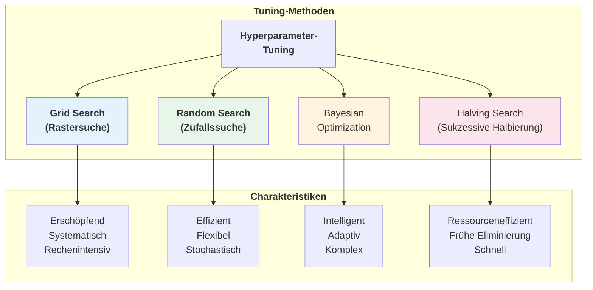

# Hyperparameter-Tuning
{: .no_toc }

> **Hyperparameter-Tuning ist die systematische Suche nach den optimalen Einstellungen eines Machine-Learning-Algorithmus, um die bestmögliche Modellleistung zu erzielen.**

---

# Inhaltsverzeichnis
{: .no_toc .text-delta }

1. TOC
{:toc}

---

## Überblick

Hyperparameter-Tuning ist ein entscheidender Schritt im Machine-Learning-Workflow. Während das Modell seine internen Parameter (Gewichte, Koeffizienten) während des Trainings selbst lernt, müssen Hyperparameter **vor** dem Training festgelegt werden. Die richtige Wahl dieser Einstellungen kann den Unterschied zwischen einem mittelmäßigen und einem exzellenten Modell ausmachen.


---

## Hyperparameter vs. Modellparameter

Ein fundamentales Verständnis des Unterschieds zwischen Hyperparametern und Modellparametern ist essentiell für erfolgreiches Machine Learning.

### Vergleichstabelle

| Aspekt | Hyperparameter | Modellparameter |
|--------|----------------|-----------------|
| **Definition** | Parameter, die vor dem Training festgelegt werden | Parameter, die während des Trainings gelernt werden |
| **Festlegung** | Manuell oder durch Tuning | Automatisch durch den Lernalgorithmus |
| **Beispiele** | Lernrate, Anzahl Bäume, Regularisierungsstärke | Gewichte, Koeffizienten, Schwellenwerte |
| **Änderung** | Erfordert neues Training | Ändern sich kontinuierlich beim Training |

### Beispiele nach Algorithmus


### Häufige Hyperparameter

| Algorithmus | Wichtige Hyperparameter | Typische Wertebereiche |
|-------------|------------------------|------------------------|
| **Random Forest** | `n_estimators` | 50, 100, 200, 500 |
| | `max_depth` | 5, 10, 20, None |
| | `min_samples_split` | 2, 5, 10 |
| **SVM** | `C` (Regularisierung) | 0.1, 1, 10, 100 |
| | `kernel` | 'linear', 'rbf', 'poly' |
| | `gamma` | 'scale', 'auto', 0.1, 1 |
| **Neural Network** | `learning_rate` | 0.001, 0.01, 0.1 |
| | `hidden_layer_sizes` | (50,), (100,), (100, 50) |
| | `alpha` | 0.0001, 0.001, 0.01 |
| **XGBoost** | `n_estimators` | 100, 200, 500 |
| | `max_depth` | 3, 5, 7, 10 |
| | `learning_rate` | 0.01, 0.1, 0.3 |

---

## Tuning-Methoden

Es gibt verschiedene Strategien zur Suche nach optimalen Hyperparametern. Jede hat ihre Vor- und Nachteile.



---

### Grid Search (Rastersuche)

Die Grid Search durchsucht systematisch alle möglichen Kombinationen aus einem vordefinierten Parametergitter.

#### Funktionsweise


#### Implementierung

```python
from sklearn.model_selection import GridSearchCV
from sklearn.ensemble import RandomForestClassifier

# Modell definieren
rf = RandomForestClassifier(random_state=42)

# Parametergitter festlegen
param_grid = {
    'n_estimators': [50, 100, 200],
    'max_depth': [5, 10, 20, None],
    'min_samples_split': [2, 5, 10],
    'min_samples_leaf': [1, 2, 4]
}

# Grid Search mit Cross-Validation
grid_search = GridSearchCV(
    estimator=rf,
    param_grid=param_grid,
    cv=5,                    # 5-Fold Cross-Validation
    scoring='accuracy',      # Bewertungsmetrik
    n_jobs=-1,               # Alle CPU-Kerne nutzen
    verbose=2                # Fortschrittsanzeige
)

# Suche durchführen
grid_search.fit(data_train, target_train)

# Beste Parameter und Score
print(f"Beste Parameter: {grid_search.best_params_}")
print(f"Bester CV-Score: {grid_search.best_score_:.4f}")

# Bestes Modell verwenden
best_model = grid_search.best_estimator_
target_pred = best_model.predict(data_test)
```

#### Vor- und Nachteile

| Vorteile | Nachteile |
|----------|-----------|
| ✅ Findet garantiert das Optimum im Gitter | ❌ Sehr rechenintensiv |
| ✅ Einfach zu verstehen und implementieren | ❌ Exponentielles Wachstum der Kombinationen |
| ✅ Reproduzierbare Ergebnisse | ❌ Nur diskrete Werte möglich |
| ✅ Vollständige Abdeckung des Suchraums | ❌ Ineffizient bei vielen Parametern |

---

### Random Search (Zufallssuche)

Die Random Search wählt zufällige Kombinationen aus dem Parameterraum aus. Überraschenderweise kann sie oft bessere Ergebnisse liefern als Grid Search – bei deutlich weniger Rechenaufwand.

#### Warum funktioniert Random Search?


> **Wichtige Erkenntnis:** Bei den meisten ML-Modellen sind nur wenige Hyperparameter wirklich einflussreich. Random Search testet mehr verschiedene Werte für diese wichtigen Parameter.

#### Implementierung

```python
from sklearn.model_selection import RandomizedSearchCV
from sklearn.ensemble import RandomForestClassifier
from scipy.stats import randint, uniform

# Modell definieren
rf = RandomForestClassifier(random_state=42)

# Parameterverteilungen festlegen
param_distributions = {
    'n_estimators': randint(50, 500),           # Ganzzahlen zwischen 50 und 500
    'max_depth': randint(3, 30),                # Ganzzahlen zwischen 3 und 30
    'min_samples_split': randint(2, 20),        # Ganzzahlen zwischen 2 und 20
    'min_samples_leaf': randint(1, 10),         # Ganzzahlen zwischen 1 und 10
    'max_features': uniform(0.1, 0.9)           # Float zwischen 0.1 und 1.0
}

# Random Search mit Cross-Validation
random_search = RandomizedSearchCV(
    estimator=rf,
    param_distributions=param_distributions,
    n_iter=100,              # Anzahl der Kombinationen
    cv=5,                    # 5-Fold Cross-Validation
    scoring='accuracy',
    n_jobs=-1,
    random_state=42,
    verbose=2
)

# Suche durchführen
random_search.fit(data_train, target_train)

# Ergebnisse
print(f"Beste Parameter: {random_search.best_params_}")
print(f"Bester CV-Score: {random_search.best_score_:.4f}")
```

#### Vor- und Nachteile

| Vorteile | Nachteile |
|----------|-----------|
| ✅ Deutlich schneller als Grid Search | ❌ Keine Garantie für das globale Optimum |
| ✅ Effizient bei vielen Hyperparametern | ❌ Ergebnisse variieren je nach Random Seed |
| ✅ Kontinuierliche Verteilungen möglich | ❌ Kann wichtige Kombinationen übersehen |
| ✅ Flexibel steuerbare Rechenzeit | ❌ Erfordert gute Wahl der Verteilungen |

---

### Vergleich: Grid Search vs. Random Search


| Kriterium | Grid Search | Random Search |
|-----------|-------------|---------------|
| **Rechenaufwand** | Hoch (exponentiell) | Kontrollierbar (n_iter) |
| **Suchraum** | Diskret (Gitterpunkte) | Kontinuierlich möglich |
| **Reproduzierbarkeit** | Vollständig | Mit random_state |
| **Beste Wahl bei** | Wenigen Parametern | Vielen Parametern |
| **Typische n_iter/Kombinationen** | Alle | 50-200 |

---

### Bayesian Optimization (Fortgeschritten)

Bayesian Optimization ist eine intelligentere Suchmethode, die aus vorherigen Evaluationen lernt und vielversprechende Regionen des Parameterraums priorisiert.


#### Implementierung mit Optuna

```python
import optuna
from sklearn.ensemble import RandomForestClassifier
from sklearn.model_selection import cross_val_score

def objective(trial):
    """Zielfunktion für Optuna"""
    # Hyperparameter vorschlagen
    params = {
        'n_estimators': trial.suggest_int('n_estimators', 50, 500),
        'max_depth': trial.suggest_int('max_depth', 3, 30),
        'min_samples_split': trial.suggest_int('min_samples_split', 2, 20),
        'min_samples_leaf': trial.suggest_int('min_samples_leaf', 1, 10),
        'max_features': trial.suggest_float('max_features', 0.1, 1.0)
    }
    
    # Modell mit vorgeschlagenen Parametern
    model = RandomForestClassifier(**params, random_state=42)
    
    # Cross-Validation Score
    score = cross_val_score(model, data_train, target_train, cv=5, scoring='accuracy')
    return score.mean()

# Studie erstellen und optimieren
study = optuna.create_study(direction='maximize')
study.optimize(objective, n_trials=100, show_progress_bar=True)

# Beste Parameter
print(f"Beste Parameter: {study.best_params}")
print(f"Bester Score: {study.best_value:.4f}")
```

---

### Halving Search (Sukzessive Halbierung)

Diese neuere Methode eliminiert schlechte Kandidaten frühzeitig und konzentriert Ressourcen auf vielversprechende Konfigurationen.


#### Implementierung

```python
from sklearn.experimental import enable_halving_search_cv
from sklearn.model_selection import HalvingRandomSearchCV
from sklearn.ensemble import RandomForestClassifier
from scipy.stats import randint

# Parametergitter
param_distributions = {
    'n_estimators': randint(50, 500),
    'max_depth': randint(3, 30),
    'min_samples_split': randint(2, 20)
}

# Halving Random Search
halving_search = HalvingRandomSearchCV(
    estimator=RandomForestClassifier(random_state=42),
    param_distributions=param_distributions,
    n_candidates=64,         # Startkandidaten
    factor=2,                # Halbierungsfaktor
    cv=5,
    scoring='accuracy',
    random_state=42,
    n_jobs=-1
)

halving_search.fit(data_train, target_train)
print(f"Beste Parameter: {halving_search.best_params_}")
```

---

## Cross-Validation beim Tuning

Cross-Validation ist unverzichtbar beim Hyperparameter-Tuning, um Overfitting auf die Trainingsdaten zu vermeiden.

### Standard K-Fold Cross-Validation


### Nested Cross-Validation

Bei der Kombination von Hyperparameter-Tuning und Modellbewertung ist Nested Cross-Validation der Goldstandard, um eine unvoreingenommene Schätzung der Modellleistung zu erhalten.


#### Implementierung Nested CV

```python
from sklearn.model_selection import cross_val_score, GridSearchCV
from sklearn.ensemble import RandomForestClassifier

# Innere CV: Hyperparameter-Tuning
inner_cv = 5

param_grid = {
    'n_estimators': [100, 200],
    'max_depth': [10, 20, None]
}

grid_search = GridSearchCV(
    estimator=RandomForestClassifier(random_state=42),
    param_grid=param_grid,
    cv=inner_cv,
    scoring='accuracy',
    n_jobs=-1
)

# Äußere CV: Modellbewertung
outer_cv = 5
nested_scores = cross_val_score(
    grid_search,
    X, y,
    cv=outer_cv,
    scoring='accuracy'
)

print(f"Nested CV Score: {nested_scores.mean():.4f} (+/- {nested_scores.std()*2:.4f})")
```

---

## Praktische Beispiele

### Beispiel 1: Random Forest Klassifikation

```python
import pandas as pd
import numpy as np
from sklearn.model_selection import train_test_split, RandomizedSearchCV
from sklearn.ensemble import RandomForestClassifier
from sklearn.metrics import classification_report
from scipy.stats import randint, uniform

# Daten laden (Beispiel)
# df = pd.read_csv('daten.csv')
# X = df.drop('target', axis=1)
# y = df['target']

# Train-Test-Split
data_train, data_test, target_train, target_test = train_test_split(
    data, target, test_size=0.2, random_state=42, stratify=target
)

# 1. Basis-Modell ohne Tuning
baseline = RandomForestClassifier(random_state=42)
baseline.fit(data_train, target_train)
print(f"Baseline Accuracy: {baseline.score(data_test, target_test):.4f}")

# 2. Random Search Tuning
param_dist = {
    'n_estimators': randint(100, 500),
    'max_depth': randint(5, 30),
    'min_samples_split': randint(2, 20),
    'min_samples_leaf': randint(1, 10),
    'max_features': ['sqrt', 'log2', None],
    'bootstrap': [True, False]
}

random_search = RandomizedSearchCV(
    RandomForestClassifier(random_state=42),
    param_distributions=param_dist,
    n_iter=100,
    cv=5,
    scoring='accuracy',
    n_jobs=-1,
    random_state=42
)

random_search.fit(data_train, target_train)

# 3. Ergebnisse vergleichen
print(f"\nBeste Parameter: {random_search.best_params_}")
print(f"Bester CV-Score: {random_search.best_score_:.4f}")
print(f"Test Accuracy: {random_search.score(data_test, target_test):.4f}")

# 4. Detaillierter Bericht
y_pred = random_search.predict(data_test)
print("\nClassification Report:")
print(classification_report(target_test, target_pred))
```

### Beispiel 2: XGBoost Regression

```python
from sklearn.model_selection import GridSearchCV
from xgboost import XGBRegressor
from sklearn.metrics import mean_squared_error, r2_score
import numpy as np

# Modell
xgb = XGBRegressor(random_state=42, objective='reg:squarederror')

# Parametergitter
param_grid = {
    'n_estimators': [100, 200, 300],
    'max_depth': [3, 5, 7],
    'learning_rate': [0.01, 0.1, 0.3],
    'subsample': [0.8, 1.0],
    'colsample_bytree': [0.8, 1.0]
}

# Grid Search
grid_search = GridSearchCV(
    xgb,
    param_grid=param_grid,
    cv=5,
    scoring='neg_mean_squared_error',
    n_jobs=-1,
    verbose=1
)

grid_search.fit(data_train, target_train)

# Ergebnisse
print(f"Beste Parameter: {grid_search.best_params_}")
print(f"Bester CV-RMSE: {np.sqrt(-grid_search.best_score_):.4f}")

# Test-Evaluation
y_pred = grid_search.predict(data_test)
print(f"Test R²: {r2_score(target_test, target_pred):.4f}")
print(f"Test RMSE: {np.sqrt(mean_squared_error(target_test, target_pred)):.4f}")
```

### Beispiel 3: Tuning mit Pipeline

```python
from sklearn.pipeline import Pipeline
from sklearn.compose import ColumnTransformer
from sklearn.preprocessing import StandardScaler, OneHotEncoder
from sklearn.impute import SimpleImputer
from sklearn.ensemble import GradientBoostingClassifier
from sklearn.model_selection import RandomizedSearchCV
from scipy.stats import randint, uniform

# Feature-Typen identifizieren
numeric_features = ['age', 'income', 'score']
categorical_features = ['category', 'region']

# Preprocessing
numeric_transformer = Pipeline([
    ('imputer', SimpleImputer(strategy='median')),
    ('scaler', StandardScaler())
])

categorical_transformer = Pipeline([
    ('imputer', SimpleImputer(strategy='most_frequent')),
    ('encoder', OneHotEncoder(handle_unknown='ignore'))
])

preprocessor = ColumnTransformer([
    ('num', numeric_transformer, numeric_features),
    ('cat', categorical_transformer, categorical_features)
])

# Vollständige Pipeline
pipeline = Pipeline([
    ('preprocessor', preprocessor),
    ('classifier', GradientBoostingClassifier(random_state=42))
])

# Parametergitter (Präfix 'classifier__' für Pipeline-Zugriff)
param_dist = {
    'classifier__n_estimators': randint(50, 300),
    'classifier__max_depth': randint(3, 10),
    'classifier__learning_rate': uniform(0.01, 0.29),
    'classifier__min_samples_split': randint(2, 20),
    'classifier__min_samples_leaf': randint(1, 10)
}

# Random Search
random_search = RandomizedSearchCV(
    pipeline,
    param_distributions=param_dist,
    n_iter=50,
    cv=5,
    scoring='accuracy',
    n_jobs=-1,
    random_state=42
)

random_search.fit(data_train, target_train)
print(f"Beste Parameter: {random_search.best_params_}")
print(f"Test Accuracy: {random_search.score(data_test, target_test):.4f}")
```

---

## Ergebnisse analysieren

### Tuning-Ergebnisse visualisieren

```python
import pandas as pd
import matplotlib.pyplot as plt
import seaborn as sns

# CV-Ergebnisse als DataFrame
results = pd.DataFrame(random_search.cv_results_)

# Top 10 Konfigurationen
top_10 = results.nsmallest(10, 'rank_test_score')[
    ['params', 'mean_test_score', 'std_test_score', 'rank_test_score']
]
print(top_10)

# Visualisierung: Parameter vs. Score
fig, axes = plt.subplots(1, 2, figsize=(14, 5))

# Scatter: n_estimators vs. Score
axes[0].scatter(
    results['param_n_estimators'],
    results['mean_test_score'],
    alpha=0.5
)
axes[0].set_xlabel('n_estimators')
axes[0].set_ylabel('Mean CV Score')
axes[0].set_title('n_estimators vs. Performance')

# Scatter: max_depth vs. Score
axes[1].scatter(
    results['param_max_depth'],
    results['mean_test_score'],
    alpha=0.5
)
axes[1].set_xlabel('max_depth')
axes[1].set_ylabel('Mean CV Score')
axes[1].set_title('max_depth vs. Performance')

plt.tight_layout()
plt.show()
```

### Parameter-Wichtigkeit analysieren

```python
# Korrelation zwischen Parametern und Score
param_cols = [col for col in results.columns if col.startswith('param_')]
for col in param_cols:
    # Nur für numerische Parameter
    if results[col].dtype in ['int64', 'float64']:
        corr = results[col].corr(results['mean_test_score'])
        print(f"{col}: Korrelation mit Score = {corr:.3f}")
```

---

## Best Practices

### Empfehlungen


### Dos ✅

- **Immer Cross-Validation verwenden** beim Tuning
- **Test-Set nur einmal** am Ende für finale Bewertung nutzen
- **Reproducibility sicherstellen** mit `random_state`
- **Mit Baseline-Modell beginnen** zum Vergleich
- **Suchraum schrittweise verfeinern** basierend auf Ergebnissen
- **Rechenzeit einplanen** – Tuning kann sehr lange dauern
- **Parallelisierung nutzen** (`n_jobs=-1`)

### Don'ts ❌

- **Niemals Test-Set für Tuning** verwenden (Data Leakage!)
- **Nicht blind alle Parameter** tunen – auf wichtige konzentrieren
- **Nicht zu feine Gitter** bei Grid Search (exponentieller Aufwand)
- **Keine unrealistischen Suchräume** definieren
- **Overfitting auf CV-Score** vermeiden – auf Robustheit achten

### Faustregel für Rechenzeit

| Anzahl Parameter | Grid Search | Random Search (n_iter) |
|------------------|-------------|------------------------|
| 2-3 | ✅ Praktikabel | 50-100 |
| 4-5 | ⚠️ Aufwändig | 100-200 |
| 6+ | ❌ Unpraktikabel | 200+ |

---

## Zusammenfassung


Hyperparameter-Tuning ist ein essenzieller Schritt, um das volle Potenzial von Machine-Learning-Modellen auszuschöpfen. Die Wahl der richtigen Tuning-Methode hängt von der Anzahl der Parameter, verfügbaren Rechenressourcen und den Anforderungen des Projekts ab. Mit den hier vorgestellten Techniken und Best Practices lässt sich dieser Prozess systematisch und effizient gestalten.

---

## Weiterführende Themen

- **Cross-Validation**: Verschiedene Strategien für unterschiedliche Datentypen
- **Regularisierung**: Hyperparameter zur Vermeidung von Overfitting
- **AutoML**: Automatisierte Modellauswahl und Hyperparameter-Tuning
- **Feature Selection**: Automatische Auswahl relevanter Merkmale als Teil des Tunings

---

*Referenzen:*
- scikit-learn Dokumentation: [GridSearchCV](https://scikit-learn.org/stable/modules/generated/sklearn.model_selection.GridSearchCV.html), [RandomizedSearchCV](https://scikit-learn.org/stable/modules/generated/sklearn.model_selection.RandomizedSearchCV.html)
- Bergstra & Bengio (2012): Random Search for Hyper-Parameter Optimization
- Optuna: [Dokumentation](https://optuna.readthedocs.io/)

---

**Version:** 1.0    
**Stand:** Januar 2026   
**Kurs:** Machine Learning. Verstehen. Anwenden. Gestalten.   
