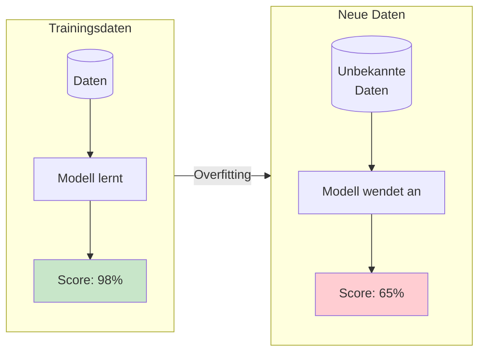
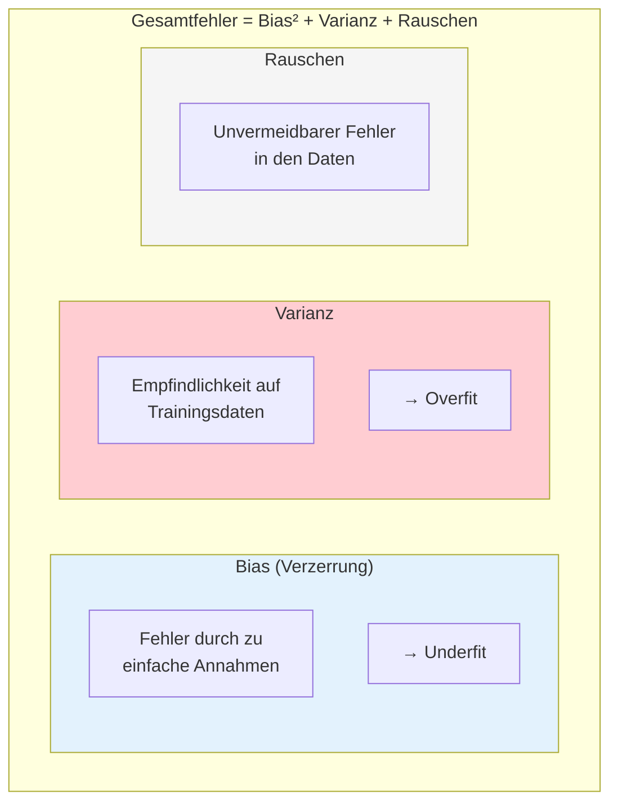
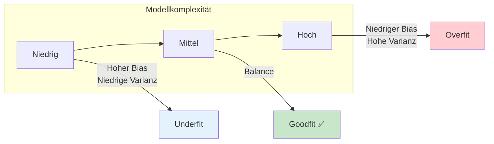
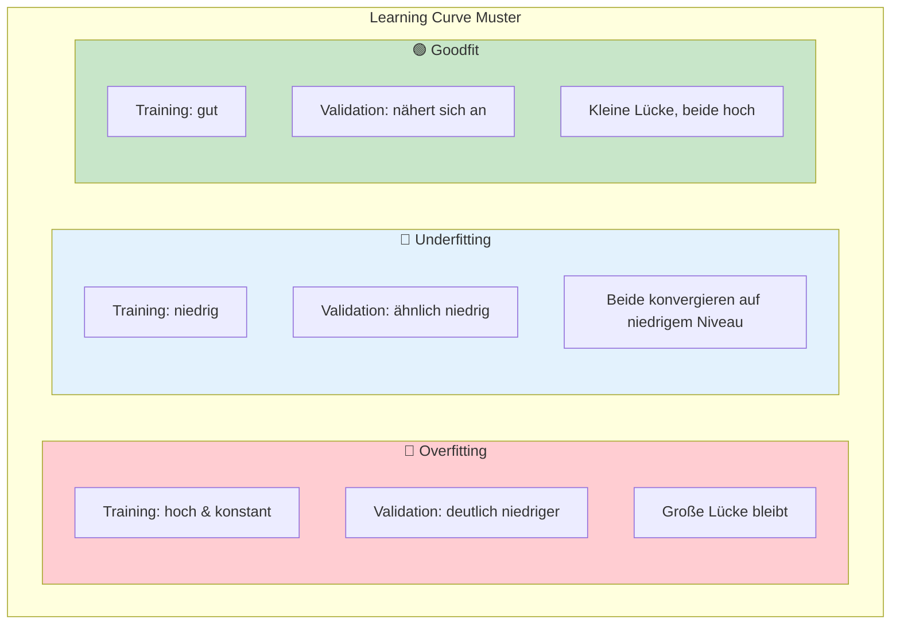
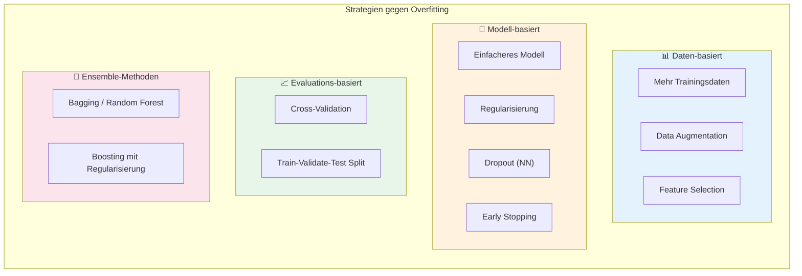
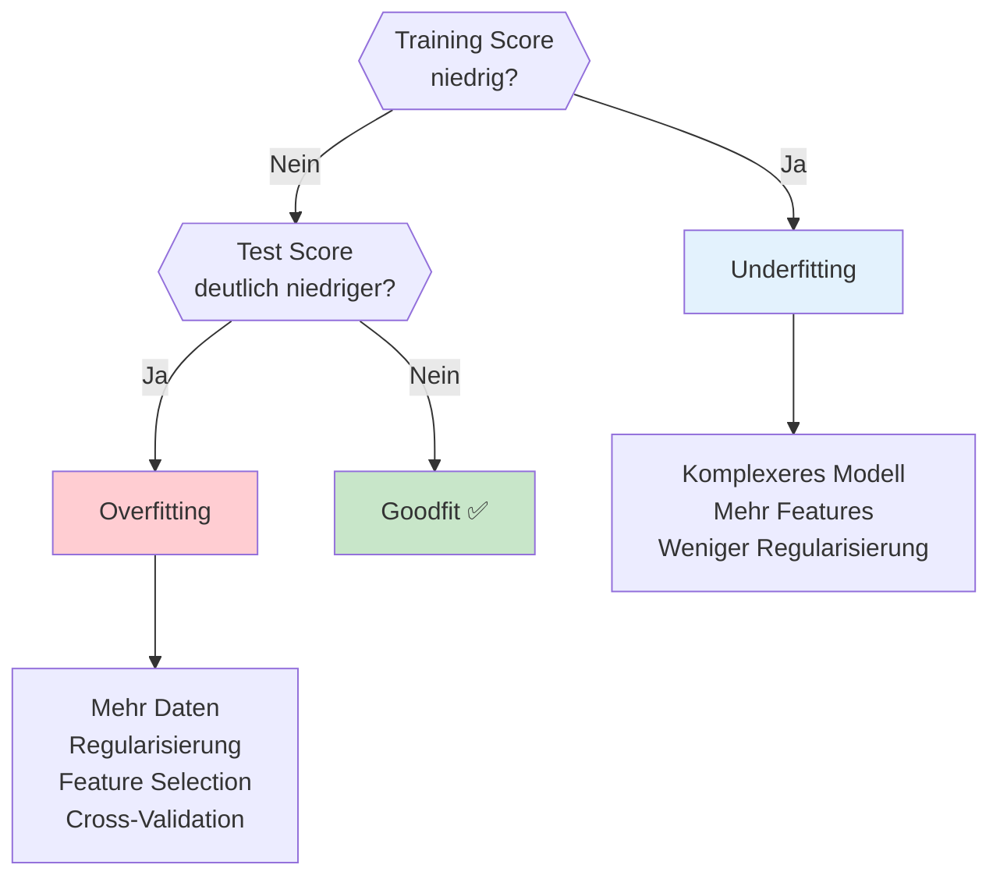

# Overfitting
{: .no_toc }

> **Das Problem des Auswendiglernens**    
> Overfitting-Erkennung, Learning Curves und Gegenmaßnahmen

---

## Überblick

Overfitting ist eines der zentralen Probleme im Machine Learning: Ein Modell lernt die Trainingsdaten "auswendig", anstatt allgemeine Muster zu erkennen. Das Ergebnis ist ein Modell, das auf Trainingsdaten hervorragend funktioniert, aber bei neuen, unbekannten Daten versagt.



**Das Problem:** Ein Modell, das nur auf bereits gesehenen Daten gut funktioniert, hat keinen praktischen Nutzen. Das Ziel ist immer die **Generalisierungsfähigkeit** – die Fähigkeit, auf neuen Daten zuverlässige Vorhersagen zu treffen.

## Underfit, Goodfit und Overfit

Die Qualität eines Machine-Learning-Modells lässt sich anhand seiner Fähigkeit beurteilen, sowohl Trainings- als auch Testdaten korrekt vorherzusagen.

```mermaid
flowchart TB
    subgraph underfit["Underfit"]
        U1["Zu einfaches Modell"]
        U2["Erfasst keine Muster"]
        U3["Training ❌ Test ❌"]
        U1 --> U2 --> U3
    end
    
    subgraph goodfit["Goodfit"]
        G1["Angemessene Komplexität"]
        G2["Erfasst allgemeine Muster"]
        G3["Training ✅ Test ✅"]
        G1 --> G2 --> G3
    end
    
    subgraph overfit["Overfit"]
        O1["Zu komplexes Modell"]
        O2["Lernt Rauschen mit"]
        O3["Training ✅ Test ❌"]
        O1 --> O2 --> O3
    end
    
    style underfit fill:#e3f2fd
    style goodfit fill:#c8e6c9
    style overfit fill:#ffcdd2
```



### Charakteristiken im Detail

| Aspekt | Underfit | Goodfit | Overfit |
|--------|----------|---------|---------|
| **Modellkomplexität** | Zu niedrig | Angemessen | Zu hoch |
| **Trainings-Performance** | Schlecht | Gut | Sehr gut (~100%) |
| **Test-Performance** | Schlecht | Gut | Schlecht |
| **Bias** | Hoch | Niedrig | Niedrig |
| **Varianz** | Niedrig | Niedrig | Hoch |
| **Problem** | Modell zu einfach | — | Modell zu komplex |

### Visuelle Analogie

Stell dir vor, ein Modell soll den Zusammenhang zwischen Lernzeit und Prüfungsergebnis lernen:

| Typ | Beschreibung | Analogie |
|-----|--------------|----------|
| **Underfit** | Gerade Linie durch gekrümmte Daten | "Mehr lernen = besser" (ignoriert Ermüdung) |
| **Goodfit** | Sanfte Kurve folgt dem Trend | Erfasst optimale Lernzeit mit Sättigungseffekt |
| **Overfit** | Kurve geht durch jeden einzelnen Punkt | "Merkt" sich jeden Schüler statt allgemeines Muster |

## Bias-Variance Tradeoff

Das Konzept hinter Underfit und Overfit lässt sich durch den Bias-Variance Tradeoff erklären:



### Der Tradeoff



**Merksatz:** 
- **Hoher Bias** = Modell macht systematische Fehler (zu einfach)
- **Hohe Varianz** = Modell reagiert stark auf kleine Änderungen in Trainingsdaten (zu komplex)

## Erkennung von Overfitting

### Methode 1: Train-Test-Vergleich

Der einfachste Weg, Overfitting zu erkennen:

```python
from sklearn.model_selection import train_test_split
from sklearn.ensemble import RandomForestClassifier
from sklearn.metrics import accuracy_score

# Daten aufteilen
X_train, X_test, y_train, y_test = train_test_split(
    X, y, test_size=0.2, random_state=42
)

# Modell trainieren
model = RandomForestClassifier(n_estimators=100, max_depth=None, random_state=42)
model.fit(X_train, y_train)

# Performance vergleichen
train_score = accuracy_score(y_train, model.predict(X_train))
test_score = accuracy_score(y_test, model.predict(X_test))

print(f"Training Accuracy: {train_score:.3f}")
print(f"Test Accuracy:     {test_score:.3f}")
print(f"Differenz:         {train_score - test_score:.3f}")

# Diagnose
if train_score - test_score > 0.1:
    print("⚠️ Mögliches Overfitting!")
elif train_score < 0.7:
    print("⚠️ Mögliches Underfitting!")
else:
    print("✅ Modell scheint gut zu generalisieren")
```

### Methode 2: Learning Curves

Learning Curves zeigen, wie sich Training- und Validierungsperformance mit zunehmender Datenmenge entwickeln.

```python
import numpy as np
import matplotlib.pyplot as plt
from sklearn.model_selection import learning_curve

def plot_learning_curve(estimator, X, y, title, cv=5, scoring='accuracy'):
    """
    Erstellt Learning Curve zur Overfitting-Diagnose.
    """
    train_sizes, train_scores, val_scores = learning_curve(
        estimator, X, y,
        cv=cv,
        scoring=scoring,
        train_sizes=np.linspace(0.1, 1.0, 10),
        n_jobs=-1
    )
    
    train_mean = train_scores.mean(axis=1)
    train_std = train_scores.std(axis=1)
    val_mean = val_scores.mean(axis=1)
    val_std = val_scores.std(axis=1)
    
    fig, ax = plt.subplots(figsize=(10, 6))
    
    # Konfidenzband
    ax.fill_between(train_sizes, train_mean - train_std, train_mean + train_std,
                    alpha=0.1, color='blue')
    ax.fill_between(train_sizes, val_mean - val_std, val_mean + val_std,
                    alpha=0.1, color='orange')
    
    # Linien
    ax.plot(train_sizes, train_mean, 'o-', color='blue', label='Training Score')
    ax.plot(train_sizes, val_mean, 'o-', color='orange', label='Validation Score')
    
    ax.set_xlabel('Anzahl Trainingsbeispiele')
    ax.set_ylabel(scoring.capitalize())
    ax.set_title(title)
    ax.legend(loc='best')
    ax.grid(True, alpha=0.3)
    
    plt.tight_layout()
    return fig

# Anwendung
from sklearn.tree import DecisionTreeClassifier

fig = plot_learning_curve(
    DecisionTreeClassifier(max_depth=None),
    X, y,
    'Learning Curve: Decision Tree (unbegrenzte Tiefe)'
)
plt.show()
```

### Interpretation der Learning Curves



| Muster | Training Score | Validation Score | Diagnose | Maßnahme |
|--------|---------------|------------------|----------|----------|
| **Große Lücke** | Hoch (~1.0) | Deutlich niedriger | Overfitting | Regularisierung, mehr Daten |
| **Beide niedrig** | Niedrig | Niedrig, ähnlich | Underfitting | Komplexeres Modell |
| **Konvergieren** | Gut | Nähert sich an | Goodfit | Ziel erreicht ✅ |
| **Steigend** | Steigt | Steigt noch | Mehr Daten helfen | Mehr Trainingsdaten |

### Methode 3: Validation Curves

Validation Curves zeigen, wie ein Hyperparameter die Performance beeinflusst.

```python
from sklearn.model_selection import validation_curve

def plot_validation_curve(estimator, X, y, param_name, param_range, title):
    """
    Erstellt Validation Curve für einen Hyperparameter.
    """
    train_scores, val_scores = validation_curve(
        estimator, X, y,
        param_name=param_name,
        param_range=param_range,
        cv=5,
        scoring='accuracy',
        n_jobs=-1
    )
    
    train_mean = train_scores.mean(axis=1)
    val_mean = val_scores.mean(axis=1)
    
    fig, ax = plt.subplots(figsize=(10, 6))
    
    ax.plot(param_range, train_mean, 'o-', color='blue', label='Training Score')
    ax.plot(param_range, val_mean, 'o-', color='orange', label='Validation Score')
    
    # Zonen markieren
    best_idx = np.argmax(val_mean)
    ax.axvline(param_range[best_idx], color='green', linestyle='--', 
               label=f'Optimal: {param_range[best_idx]}')
    
    ax.set_xlabel(param_name)
    ax.set_ylabel('Accuracy')
    ax.set_title(title)
    ax.legend(loc='best')
    ax.grid(True, alpha=0.3)
    
    # Annotationen
    ax.annotate('Underfit\nZone', xy=(param_range[0], val_mean[0]), fontsize=10, color='blue')
    ax.annotate('Overfit\nZone', xy=(param_range[-1], val_mean[-1]), fontsize=10, color='red')
    
    plt.tight_layout()
    return fig

# Anwendung: max_depth bei Decision Tree
from sklearn.tree import DecisionTreeClassifier

fig = plot_validation_curve(
    DecisionTreeClassifier(random_state=42),
    X, y,
    param_name='max_depth',
    param_range=range(1, 20),
    title='Validation Curve: Baumtiefe'
)
plt.show()
```

## Strategien gegen Overfitting



### Strategie 1: Mehr Trainingsdaten

Die effektivste Methode gegen Overfitting – wenn verfügbar.

```python
# Beispiel: Learning Curve zeigt, ob mehr Daten helfen würden
from sklearn.model_selection import learning_curve

train_sizes, train_scores, val_scores = learning_curve(
    model, X, y, 
    train_sizes=np.linspace(0.1, 1.0, 10),
    cv=5
)

# Wenn Validation Score noch steigt: Mehr Daten würden helfen
if val_scores.mean(axis=1)[-1] > val_scores.mean(axis=1)[-2]:
    print("Mehr Trainingsdaten würden wahrscheinlich helfen")
```

### Strategie 2: Feature Selection

Entfernen irrelevanter oder redundanter Features reduziert Overfitting-Risiko.

```python
from sklearn.feature_selection import SelectKBest, f_classif, RFE
from sklearn.ensemble import RandomForestClassifier

# Methode 1: Statistische Tests
selector = SelectKBest(f_classif, k=10)
X_selected = selector.fit_transform(X, y)
print(f"Reduziert von {X.shape[1]} auf {X_selected.shape[1]} Features")

# Methode 2: Recursive Feature Elimination
rfe = RFE(RandomForestClassifier(n_estimators=50), n_features_to_select=10)
X_rfe = rfe.fit_transform(X, y)

# Methode 3: Feature Importance
rf = RandomForestClassifier(n_estimators=100, random_state=42)
rf.fit(X, y)
importance = rf.feature_importances_

# Nur wichtigste Features behalten
threshold = np.percentile(importance, 50)  # Top 50%
X_important = X[:, importance > threshold]
```

### Strategie 3: Einfacheres Modell wählen

```python
from sklearn.tree import DecisionTreeClassifier
from sklearn.linear_model import LogisticRegression

# Statt unbegrenztem Baum...
complex_model = DecisionTreeClassifier(max_depth=None)  # Overfitting-Risiko

# ...begrenzten Baum oder lineares Modell verwenden
simple_tree = DecisionTreeClassifier(max_depth=5, min_samples_leaf=10)
linear_model = LogisticRegression()  # Oft weniger Overfitting
```

### Strategie 4: Regularisierung

Regularisierung fügt einen Strafterm für komplexe Modelle hinzu. → Siehe [regularisierung.md](regularisierung.md)

```python
from sklearn.linear_model import Ridge, Lasso, LogisticRegression

# Lineare Regression mit L2-Regularisierung
ridge = Ridge(alpha=1.0)

# Lineare Regression mit L1-Regularisierung (Feature Selection)
lasso = Lasso(alpha=0.1)

# Logistische Regression mit Regularisierung
log_reg = LogisticRegression(C=0.1)  # C = 1/lambda, klein = starke Reg.
```

### Strategie 5: Cross-Validation

Robustere Schätzung der Generalisierungsfähigkeit.

```python
from sklearn.model_selection import cross_val_score

# Statt einfachem Train-Test-Split
scores = cross_val_score(model, X, y, cv=5, scoring='accuracy')
print(f"CV Accuracy: {scores.mean():.3f} ± {scores.std():.3f}")

# Bei großer Standardabweichung: Modell ist instabil (Overfitting-Tendenz)
if scores.std() > 0.1:
    print("⚠️ Hohe Varianz zwischen Folds – Overfitting möglich")
```

### Strategie 6: Early Stopping (Neuronale Netze)

Training beenden, bevor das Modell anfängt zu overfitten.

```python
from tensorflow.keras.callbacks import EarlyStopping

early_stopping = EarlyStopping(
    monitor='val_loss',
    patience=10,
    restore_best_weights=True
)

history = model.fit(
    X_train, y_train,
    epochs=200,
    validation_split=0.2,
    callbacks=[early_stopping]
)
```

### Strategie 7: Dropout (Neuronale Netze)

Zufälliges Deaktivieren von Neuronen während des Trainings.

```python
from tensorflow.keras import layers

model = keras.Sequential([
    layers.Dense(128, activation='relu'),
    layers.Dropout(0.3),  # 30% der Neuronen deaktivieren
    layers.Dense(64, activation='relu'),
    layers.Dropout(0.2),
    layers.Dense(1, activation='sigmoid')
])
```

### Strategie 8: Ensemble-Methoden

Kombination mehrerer Modelle reduziert Varianz.

```python
from sklearn.ensemble import RandomForestClassifier, BaggingClassifier

# Random Forest: Bagging mit Entscheidungsbäumen
rf = RandomForestClassifier(
    n_estimators=100,
    max_depth=10,        # Begrenzte Tiefe
    min_samples_leaf=5,  # Mindestgröße der Blätter
    random_state=42
)

# Bagging: Funktioniert mit beliebigen Modellen
bagging = BaggingClassifier(
    estimator=DecisionTreeClassifier(max_depth=10),
    n_estimators=50,
    random_state=42
)
```

## Vollständiges Diagnose-Beispiel

```python
import numpy as np
import matplotlib.pyplot as plt
from sklearn.datasets import make_classification
from sklearn.model_selection import train_test_split, learning_curve, validation_curve
from sklearn.tree import DecisionTreeClassifier
from sklearn.metrics import accuracy_score

# 1. Synthetische Daten erstellen
X, y = make_classification(
    n_samples=1000,
    n_features=20,
    n_informative=10,
    n_redundant=5,
    random_state=42
)

X_train, X_test, y_train, y_test = train_test_split(
    X, y, test_size=0.2, random_state=42
)

# 2. Overfitting demonstrieren
print("=" * 50)
print("Overfitting-Demonstration")
print("=" * 50)

for max_depth in [2, 5, 10, None]:
    model = DecisionTreeClassifier(max_depth=max_depth, random_state=42)
    model.fit(X_train, y_train)
    
    train_acc = accuracy_score(y_train, model.predict(X_train))
    test_acc = accuracy_score(y_test, model.predict(X_test))
    
    depth_str = str(max_depth) if max_depth else "None"
    status = "⚠️" if train_acc - test_acc > 0.1 else "✅"
    
    print(f"max_depth={depth_str:>4}: Train={train_acc:.3f}, Test={test_acc:.3f}, "
          f"Gap={train_acc-test_acc:.3f} {status}")

# 3. Learning Curve erstellen
print("\n" + "=" * 50)
print("Learning Curve Analyse")
print("=" * 50)

fig, axes = plt.subplots(1, 2, figsize=(14, 5))

for ax, max_depth, title in zip(
    axes, 
    [3, None], 
    ['Begrenzte Tiefe (max_depth=3)', 'Unbegrenzte Tiefe (Overfit)']
):
    model = DecisionTreeClassifier(max_depth=max_depth, random_state=42)
    
    train_sizes, train_scores, val_scores = learning_curve(
        model, X, y, cv=5, train_sizes=np.linspace(0.1, 1.0, 10)
    )
    
    ax.fill_between(train_sizes, 
                    train_scores.mean(axis=1) - train_scores.std(axis=1),
                    train_scores.mean(axis=1) + train_scores.std(axis=1),
                    alpha=0.1, color='blue')
    ax.fill_between(train_sizes,
                    val_scores.mean(axis=1) - val_scores.std(axis=1),
                    val_scores.mean(axis=1) + val_scores.std(axis=1),
                    alpha=0.1, color='orange')
    
    ax.plot(train_sizes, train_scores.mean(axis=1), 'o-', label='Training')
    ax.plot(train_sizes, val_scores.mean(axis=1), 'o-', label='Validation')
    
    ax.set_xlabel('Trainingsbeispiele')
    ax.set_ylabel('Accuracy')
    ax.set_title(title)
    ax.legend()
    ax.grid(True, alpha=0.3)

plt.tight_layout()
plt.savefig('learning_curves_comparison.png', dpi=150)
plt.show()
```

## Entscheidungshilfe



## Best Practices

### Dos ✅

- **Immer Train-Test-Split** oder Cross-Validation verwenden
- **Learning Curves** erstellen zur Diagnose
- **Mit einfachen Modellen beginnen** und Komplexität schrittweise erhöhen
- **Validation Set** für Hyperparameter-Tuning (nicht Test Set!)
- **Mehrere Strategien kombinieren** (z.B. Feature Selection + Regularisierung)

### Don'ts ❌

- **Test-Daten beim Training verwenden** (Data Leakage)
- **Hyperparameter auf Test-Daten optimieren** (Overfitting auf Test Set)
- **Nur Training Score betrachten**
- **Zu früh komplexe Modelle einsetzen**

## Zusammenfassung

| Konzept | Beschreibung |
|---------|--------------|
| **Overfitting** | Modell lernt Trainingsdaten auswendig, generalisiert schlecht |
| **Underfitting** | Modell zu einfach, erfasst keine Muster |
| **Bias** | Systematischer Fehler durch zu einfache Annahmen |
| **Varianz** | Empfindlichkeit auf spezifische Trainingsdaten |
| **Erkennung** | Train-Test-Vergleich, Learning Curves, Validation Curves |
| **Hauptstrategien** | Mehr Daten, Regularisierung, Feature Selection, Ensemble |

## Weiterführende Themen

- **[Regularisierung](regularisierung.md)**: L1, L2, Elastic Net im Detail
- **Cross-Validation**: K-Fold zur robusten Modellbewertung
- **Hyperparameter-Tuning**: GridSearchCV, RandomizedSearchCV
- **Ensemble-Methoden**: Random Forest, Boosting

---

*Referenzen:*
- scikit-learn Dokumentation: [Learning Curve](https://scikit-learn.org/stable/modules/learning_curve.html)
- StatQuest: [Bias and Variance](https://www.youtube.com/watch?v=EuBBz3bI-aA)
- KNIME: Overfitting Tutorial

---

**Version:** 1.0    
**Stand:** Januar 2026   
**Kurs:** Machine Learning. Verstehen. Anwenden. Gestalten.   
