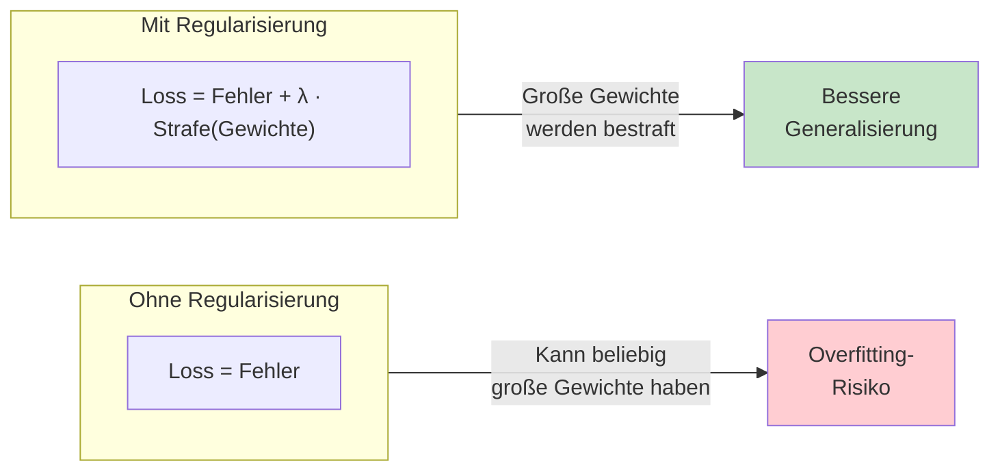
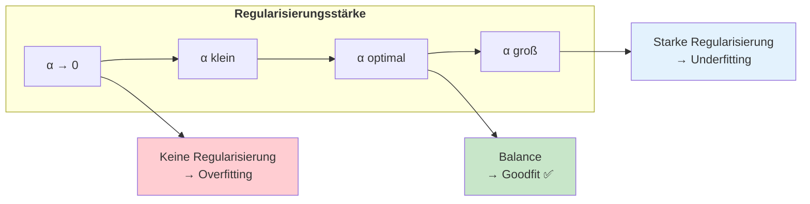
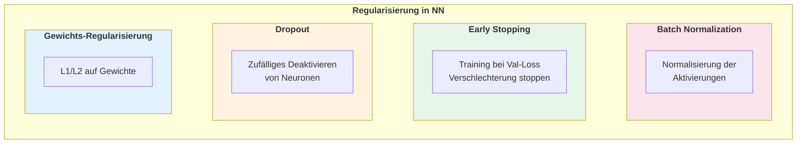
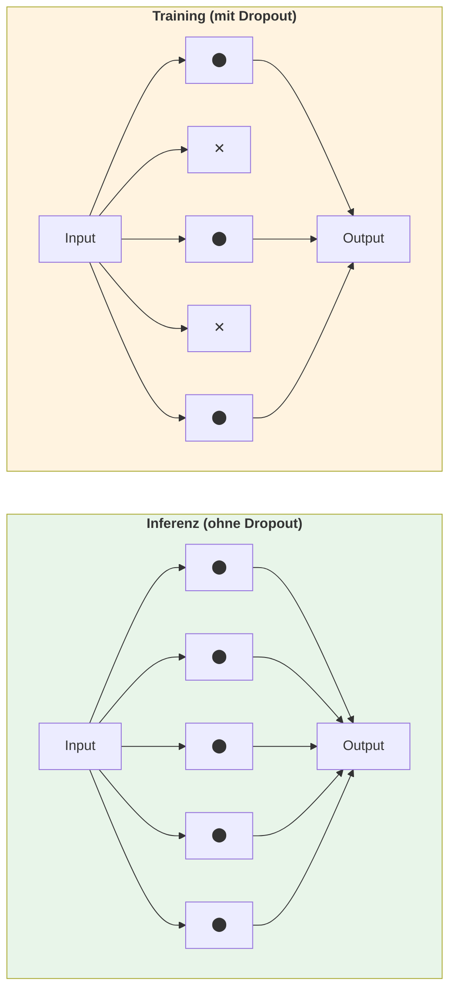
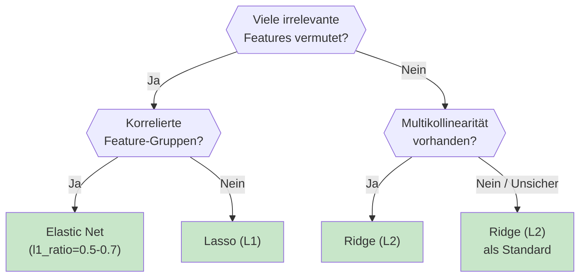

# Regularisierung
{: .no_toc }

> **Kontrolle der Modellkomplexität**     
> L1, L2, Elastic Net, Ridge und Lasso Regression

---

# Inhaltsverzeichnis
{: .no_toc .text-delta }

1. TOC
{:toc}

---

## Überblick

Regularisierung ist eine Technik zur Vermeidung von Overfitting, indem die Modellkomplexität kontrolliert wird. Das Grundprinzip: Ein Strafterm wird zur Loss-Funktion hinzugefügt, der große Modellgewichte "bestraft" und das Modell zu einfacheren Lösungen zwingt.



**Kernidee:** Große Gewichte ermöglichen es dem Modell, sich sehr genau an die Trainingsdaten anzupassen – oft zu genau. Durch Bestrafung großer Gewichte wird das Modell gezwungen, robustere, allgemeinere Muster zu lernen.

## Die drei Regularisierungsmethoden

> [!NOTE] Auswahlhilfe      
> L1 fördert Sparse-Modelle, L2 stabilisiert Gewichte, Elastic Net kombiniert beide Effekte.


## L1-Regularisierung (Lasso)

**Lasso** (Least Absolute Shrinkage and Selection Operator) verwendet die Summe der Absolutwerte der Gewichte als Strafterm.

### Mathematik

$$\text{Loss}_{L1} = \text{MSE} + \lambda \sum_{i=1}^{n} |w_i|$$

### Eigenschaften

| Eigenschaft | Beschreibung |
|-------------|--------------|
| **Feature Selection** | Kann Gewichte exakt auf 0 setzen |
| **Sparse Modelle** | Nur wenige Features mit Gewicht ≠ 0 |
| **Robustheit** | Weniger empfindlich gegenüber Ausreißern |
| **Beste Anwendung** | Viele vermutlich irrelevante Features |

### Implementierung

```python
from sklearn.linear_model import Lasso, LassoCV
from sklearn.preprocessing import StandardScaler
from sklearn.model_selection import train_test_split

# Wichtig: Skalierung vor Regularisierung!
scaler = StandardScaler()
data_train_scaled = scaler.fit_transform(data_train)
data_test_scaled = scaler.transform(data_test)

# Lasso mit festem Alpha
lasso = Lasso(alpha=0.1, random_state=42)
lasso.fit(data_train_scaled, target_train)

# Ergebnisse analysieren
n_features_total = data_train.shape[1]
n_features_used = (lasso.coef_ != 0).sum()

print(f"Features verwendet: {n_features_used} von {n_features_total}")
print(f"R² Score (Test): {lasso.score(data_test_scaled, target_test):.3f}")

# Feature Selection Ergebnis
import pandas as pd
coef_df = pd.DataFrame({
    'Feature': feature_names,
    'Coefficient': lasso.coef_
})
print("\nAusgewählte Features (Koeffizient ≠ 0):")
print(coef_df[coef_df['Coefficient'] != 0].sort_values('Coefficient', key=abs, ascending=False))
```

### Optimales Alpha mit Cross-Validation

```python
from sklearn.linear_model import LassoCV

# LassoCV findet automatisch das beste Alpha
lasso_cv = LassoCV(
    alphas=None,        # Automatische Auswahl
    cv=5,               # 5-Fold Cross-Validation
    random_state=42
)
lasso_cv.fit(data_train_scaled, target_train)

print(f"Optimales Alpha: {lasso_cv.alpha_:.4f}")
print(f"R² Score (Test): {lasso_cv.score(data_test_scaled, target_test):.3f}")
print(f"Nicht-Null Koeffizienten: {(lasso_cv.coef_ != 0).sum()}")
```

## L2-Regularisierung (Ridge)

**Ridge Regression** verwendet die Summe der quadrierten Gewichte als Strafterm.

### Mathematik

$$\text{Loss}_{L2} = \text{MSE} + \lambda \sum_{i=1}^{n} w_i^2$$

### Eigenschaften

| Eigenschaft | Beschreibung |
|-------------|--------------|
| **Keine Feature Selection** | Reduziert alle Gewichte, aber keines auf 0 |
| **Multikollinearität** | Besserer Umgang mit korrelierten Features |
| **Stabilität** | Numerisch stabiler als Lasso |
| **Beste Anwendung** | Alle Features vermutlich relevant |

### Implementierung

```python
from sklearn.linear_model import Ridge, RidgeCV

# Ridge mit festem Alpha
ridge = Ridge(alpha=1.0)
ridge.fit(data_train_scaled, target_train)

print(f"R² Score (Test): {ridge.score(data_test_scaled, target_test):.3f}")
print(f"Min. Koeffizient (absolut): {abs(ridge.coef_).min():.6f}")
print(f"Max. Koeffizient (absolut): {abs(ridge.coef_).max():.6f}")

# Optimales Alpha mit Cross-Validation
ridge_cv = RidgeCV(
    alphas=[0.001, 0.01, 0.1, 1.0, 10.0, 100.0],
    cv=5
)
ridge_cv.fit(data_train_scaled, target_train)

print(f"\nOptimales Alpha: {ridge_cv.alpha_:.4f}")
print(f"R² Score (Test): {ridge_cv.score(data_test_scaled, target_test):.3f}")
```

## Elastic Net

**Elastic Net** kombiniert L1 und L2 Regularisierung.

### Mathematik

$$\text{Loss}_{EN} = \text{MSE} + \lambda \left( \alpha \sum_{i=1}^{n} |w_i| + (1-\alpha) \sum_{i=1}^{n} w_i^2 \right)$$

Dabei ist:
- `alpha` (in scikit-learn: `l1_ratio`): Balance zwischen L1 und L2
- `l1_ratio=0`: Reines Ridge
- `l1_ratio=1`: Reines Lasso
- `l1_ratio=0.5`: Gleiche Mischung

### Eigenschaften

| Eigenschaft | Beschreibung |
|-------------|--------------|
| **Feature Selection** | Ja (durch L1-Anteil) |
| **Gruppierung** | Behält korrelierte Features zusammen (durch L2) |
| **Flexibilität** | Balance zwischen L1 und L2 steuerbar |
| **Beste Anwendung** | Korrelierte Feature-Gruppen |

### Implementierung

```python
from sklearn.linear_model import ElasticNet, ElasticNetCV

# Elastic Net mit festen Parametern
elastic = ElasticNet(
    alpha=0.1,          # Gesamtstärke der Regularisierung
    l1_ratio=0.5,       # Balance: 0=Ridge, 1=Lasso
    random_state=42
)
elastic.fit(data_train_scaled, target_train)

print(f"R² Score (Test): {elastic.score(data_test_scaled, target_test):.3f}")
print(f"Nicht-Null Koeffizienten: {(elastic.coef_ != 0).sum()}")

# Optimale Parameter mit Cross-Validation
elastic_cv = ElasticNetCV(
    l1_ratio=[0.1, 0.3, 0.5, 0.7, 0.9, 0.95, 1.0],
    alphas=None,        # Automatische Auswahl
    cv=5,
    random_state=42
)
elastic_cv.fit(data_train_scaled, target_train)

print(f"\nOptimales Alpha: {elastic_cv.alpha_:.4f}")
print(f"Optimales l1_ratio: {elastic_cv.l1_ratio_:.2f}")
print(f"R² Score (Test): {elastic_cv.score(data_test_scaled, target_test):.3f}")
```

## Vergleich der Methoden

### Theoretischer Vergleich

| Aspekt | L1 (Lasso) | L2 (Ridge) | Elastic Net |
|--------|------------|------------|-------------|
| **Strafterm** | Σ\|wᵢ\| | Σwᵢ² | α·L1 + (1-α)·L2 |
| **Feature Selection** | Ja | Nein | Ja |
| **Korrelierte Features** | Wählt eines aus | Behält alle | Gruppiert |
| **Ausreißer-Robustheit** | Robuster | Empfindlicher | Mittel |
| **Sparse Lösung** | Ja | Nein | Ja |
| **Numerische Stabilität** | Gut | Sehr gut | Sehr gut |

### Praktischer Vergleich

```python
import numpy as np
import matplotlib.pyplot as plt
from sklearn.linear_model import Lasso, Ridge, ElasticNet
from sklearn.model_selection import cross_val_score

# Vergleich bei verschiedenen Alpha-Werten
alphas = np.logspace(-4, 2, 20)
models = {
    'Lasso (L1)': Lasso,
    'Ridge (L2)': Ridge,
    'Elastic Net': lambda alpha: ElasticNet(alpha=alpha, l1_ratio=0.5)
}

results = {name: [] for name in models}

for alpha in alphas:
    for name, model_class in models.items():
        if name == 'Elastic Net':
            model = model_class(alpha)
        else:
            model = model_class(alpha=alpha)
        
        scores = cross_val_score(model, data_train_scaled, target_train, cv=5, scoring='r2')
        results[name].append(scores.mean())

# Visualisierung
fig, ax = plt.subplots(figsize=(10, 6))
for name, scores in results.items():
    ax.semilogx(alphas, scores, 'o-', label=name)

ax.set_xlabel('Alpha (Regularisierungsstärke)')
ax.set_ylabel('R² Score (Cross-Validation)')
ax.set_title('Vergleich der Regularisierungsmethoden')
ax.legend()
ax.grid(True, alpha=0.3)
plt.tight_layout()
plt.show()
```

## Der Regularisierungsparameter λ (Alpha)

> [!WARNING] Zu starke Regularisierung     
> Ein zu hoher Alpha-Wert kann relevante Signale unterdrücken und in Underfitting münden.

Der Parameter λ (in scikit-learn als `alpha` bezeichnet) steuert die Stärke der Regularisierung.



### Wichtig: C vs. Alpha

In scikit-learn gibt es zwei Konventionen:

| Modell | Parameter | Bedeutung |
|--------|-----------|-----------|
| `Ridge`, `Lasso`, `ElasticNet` | `alpha` | α = λ (direkt) |
| `LogisticRegression`, `SVC` | `C` | C = 1/λ (invers!) |

```python
# Bei LogisticRegression: C = 1/λ
# Kleine C → starke Regularisierung
# Große C → schwache Regularisierung

from sklearn.linear_model import LogisticRegression

strong_reg = LogisticRegression(C=0.01)   # Starke Regularisierung
weak_reg = LogisticRegression(C=100)      # Schwache Regularisierung
```

### Optimales Alpha finden

```python
import numpy as np
import matplotlib.pyplot as plt
from sklearn.linear_model import Ridge
from sklearn.model_selection import cross_val_score

# Alpha-Werte testen
alphas = np.logspace(-4, 4, 50)
scores = []

for alpha in alphas:
    model = Ridge(alpha=alpha)
    cv_scores = cross_val_score(model, data_train_scaled, target_train, cv=5, scoring='r2')
    scores.append(cv_scores.mean())

# Bestes Alpha finden
best_idx = np.argmax(scores)
best_alpha = alphas[best_idx]

# Visualisierung
fig, ax = plt.subplots(figsize=(10, 5))
ax.semilogx(alphas, scores, 'b-', linewidth=2)
ax.axvline(best_alpha, color='red', linestyle='--', label=f'Optimal: {best_alpha:.4f}')
ax.set_xlabel('Alpha')
ax.set_ylabel('R² Score (CV)')
ax.set_title('Auswahl des Regularisierungsparameters')
ax.legend()
ax.grid(True, alpha=0.3)
plt.show()

print(f"Optimales Alpha: {best_alpha:.4f}")
print(f"Bester CV-Score: {scores[best_idx]:.4f}")
```

## Regularisierung in Neuronalen Netzen

In neuronalen Netzen stehen zusätzliche Regularisierungstechniken zur Verfügung:



### L1/L2-Regularisierung in Keras

```python
from tensorflow import keras
from tensorflow.keras import layers, regularizers

# L2-Regularisierung (am häufigsten)
model_l2 = keras.Sequential([
    layers.Dense(128, activation='relu',
                 kernel_regularizer=regularizers.l2(0.01),
                 input_shape=(n_features,)),
    layers.Dense(64, activation='relu',
                 kernel_regularizer=regularizers.l2(0.01)),
    layers.Dense(1, activation='sigmoid')
])

# L1-Regularisierung
model_l1 = keras.Sequential([
    layers.Dense(128, activation='relu',
                 kernel_regularizer=regularizers.l1(0.01),
                 input_shape=(n_features,)),
    layers.Dense(1, activation='sigmoid')
])

# Elastic Net (L1 + L2)
model_elastic = keras.Sequential([
    layers.Dense(128, activation='relu',
                 kernel_regularizer=regularizers.l1_l2(l1=0.01, l2=0.01),
                 input_shape=(n_features,)),
    layers.Dense(1, activation='sigmoid')
])
```

### Dropout

Dropout deaktiviert während des **Trainings** zufällig einen Anteil der Neuronen.



```python
from tensorflow.keras import layers

model = keras.Sequential([
    layers.Dense(256, activation='relu', input_shape=(n_features,)),
    layers.Dropout(0.5),      # 50% der Neuronen deaktivieren
    
    layers.Dense(128, activation='relu'),
    layers.Dropout(0.3),      # 30% der Neuronen deaktivieren
    
    layers.Dense(64, activation='relu'),
    layers.Dropout(0.2),      # Weniger Dropout in späteren Schichten
    
    layers.Dense(1, activation='sigmoid')
])

# Typische Dropout-Raten:
# - Eingabeschicht: 0.2-0.3
# - Hidden Layers: 0.3-0.5
# - Späte Schichten: 0.2
```

### Early Stopping

Training automatisch beenden, wenn Validation Loss nicht mehr sinkt.

```python
from tensorflow.keras.callbacks import EarlyStopping

early_stopping = EarlyStopping(
    monitor='val_loss',           # Metrik überwachen
    patience=10,                  # Epochen ohne Verbesserung warten
    min_delta=0.001,              # Minimale Verbesserung
    restore_best_weights=True,    # Beste Gewichte wiederherstellen
    verbose=1
)

history = model.fit(
    data_train, target_train,
    epochs=200,                   # Maximale Epochen
    validation_split=0.2,
    callbacks=[early_stopping],
    verbose=1
)

print(f"Training nach {len(history.history['loss'])} Epochen gestoppt")
```

### Kombinierte Regularisierung

In der Praxis werden mehrere Techniken kombiniert:

```python
from tensorflow.keras.callbacks import EarlyStopping, ReduceLROnPlateau

# Modell mit mehreren Regularisierungstechniken
model = keras.Sequential([
    # Layer 1: L2 + BatchNorm + Dropout
    layers.Dense(128, activation='relu',
                 kernel_regularizer=regularizers.l2(0.001),
                 input_shape=(n_features,)),
    layers.BatchNormalization(),
    layers.Dropout(0.3),
    
    # Layer 2: L2 + BatchNorm + Dropout
    layers.Dense(64, activation='relu',
                 kernel_regularizer=regularizers.l2(0.001)),
    layers.BatchNormalization(),
    layers.Dropout(0.2),
    
    # Output
    layers.Dense(1, activation='sigmoid')
])

model.compile(
    optimizer='adam',
    loss='binary_crossentropy',
    metrics=['accuracy']
)

# Callbacks kombinieren
callbacks = [
    EarlyStopping(monitor='val_loss', patience=15, restore_best_weights=True),
    ReduceLROnPlateau(monitor='val_loss', factor=0.5, patience=5, min_lr=1e-6)
]

history = model.fit(
    data_train, target_train,
    epochs=200,
    validation_split=0.2,
    callbacks=callbacks,
    batch_size=32
)
```

## Wichtig: Skalierung vor Regularisierung

> [!TIP] Pipeline-Umsetzung     
> Skalierung und Regularisierung in einer Pipeline kapseln, damit `fit`/`transform` in CV und Test konsistent bleiben.

**Ohne Skalierung funktioniert Regularisierung nicht korrekt!**

```python
from sklearn.preprocessing import StandardScaler
from sklearn.pipeline import Pipeline
from sklearn.linear_model import Ridge

# ❌ FALSCH: Ohne Skalierung
ridge_wrong = Ridge(alpha=1.0)
ridge_wrong.fit(data_train, target_train)  # Features haben unterschiedliche Skalen!

# ✅ RICHTIG: Mit Skalierung
pipeline = Pipeline([
    ('scaler', StandardScaler()),
    ('ridge', Ridge(alpha=1.0))
])
pipeline.fit(data_train, target_train)

# Oder manuell
scaler = StandardScaler()
data_train_scaled = scaler.fit_transform(data_train)
data_test_scaled = scaler.transform(data_test)  # Wichtig: Nur transform!

ridge_correct = Ridge(alpha=1.0)
ridge_correct.fit(data_train_scaled, target_train)
```

**Warum?** Features mit größeren Wertebereichen haben automatisch kleinere Koeffizienten. Regularisierung bestraft dann die falschen Features.

## Vollständiges Beispiel

```python
import numpy as np
import pandas as pd
from sklearn.datasets import load_breast_cancer
from sklearn.model_selection import train_test_split, GridSearchCV
from sklearn.preprocessing import StandardScaler
from sklearn.pipeline import Pipeline
from sklearn.linear_model import LogisticRegression, Lasso, Ridge, ElasticNet
from sklearn.metrics import accuracy_score, classification_report

# 1. Daten laden
df = load_breast_cancer()
data, target = df.data, df.target
feature_names = data.feature_names

print(f"Dataset: {data.shape[0]} Samples, {data.shape[1]} Features")

# 2. Train-Test-Split
data_train, data_test, target_train, target_test = train_test_split(
    data, target, test_size=0.2, random_state=42, stratify=target
)

# 3. Pipeline mit Skalierung
pipeline = Pipeline([
    ('scaler', StandardScaler()),
    ('classifier', LogisticRegression(max_iter=1000))
])

# 4. GridSearch für optimale Regularisierung
param_grid = {
    'classifier__C': np.logspace(-3, 3, 20),       # C = 1/λ
    'classifier__penalty': ['l1', 'l2'],
    'classifier__solver': ['saga']                  # Unterstützt L1 und L2
}

grid_search = GridSearchCV(
    pipeline,
    param_grid,
    cv=5,
    scoring='accuracy',
    n_jobs=-1
)
grid_search.fit(data_train, target_train)

# 5. Ergebnisse
print("\n" + "=" * 50)
print("Beste Parameter")
print("=" * 50)
print(f"C (= 1/λ): {grid_search.best_params_['classifier__C']:.4f}")
print(f"Penalty: {grid_search.best_params_['classifier__penalty']}")
print(f"CV Accuracy: {grid_search.best_score_:.4f}")

# 6. Test-Evaluation
best_model = grid_search.best_estimator_
y_pred = best_model.predict(data_test)

print("\n" + "=" * 50)
print("Test-Ergebnisse")
print("=" * 50)
print(f"Test Accuracy: {accuracy_score(target_test, target_pred):.4f}")
print("\nKlassifikationsbericht:")
print(classification_report(target_test, target_pred, target_names=data.target_names))

# 7. Feature Importance
classifier = best_model.named_steps['classifier']
coef_df = pd.DataFrame({
    'Feature': feature_names,
    'Coefficient': classifier.coef_[0]
}).sort_values('Coefficient', key=abs, ascending=False)

print("\n" + "=" * 50)
print("Top 10 wichtigste Features")
print("=" * 50)
print(coef_df.head(10).to_string(index=False))

if grid_search.best_params_['classifier__penalty'] == 'l1':
    n_zero = (classifier.coef_ == 0).sum()
    print(f"\nFeatures auf 0 gesetzt: {n_zero} von {len(feature_names)}")
```

## Entscheidungshilfe





## Faustregeln

| Situation | Empfehlung | Begründung |
|-----------|------------|------------|
| Viele Features, vermutlich irrelevante | **Lasso (L1)** | Eliminiert unwichtige Features |
| Multikollinearität | **Ridge (L2)** | Behält alle Features, reduziert Gewichte |
| Sparsames Modell gewünscht | **Lasso (L1)** | Führt zu weniger Features |
| Mehr Features als Samples | **Lasso / Elastic Net** | Reduziert Dimensionalität |
| Robustheit gegenüber Ausreißern | **Ridge (L2)** | Weniger empfindlich |
| Korrelierte Feature-Gruppen | **Elastic Net** | Kombiniert Vorteile beider |
| Neuronales Netz | **Dropout + L2 + Early Stopping** | Kombinierte Techniken |
| Unsicher | **Ridge (L2)** | Guter Default |

## Best Practices

> [!SUCCESS] Robuste Praxis      
> Alpha und Modellvariante immer per Cross-Validation wählen und mit einer einfachen Baseline vergleichen.

### Dos ✅

- **Immer skalieren** vor Regularisierung (StandardScaler)
- **Cross-Validation** zur Auswahl von Alpha/C
- **Mit Ridge beginnen** als sichere Baseline
- **Pipeline verwenden** um Data Leakage zu vermeiden
- **Mehrere Methoden vergleichen** bei wichtigen Projekten

### Don'ts ❌

- **Ohne Skalierung** regularisieren (verzerrt Ergebnisse)
- **Alpha auf Test-Daten optimieren** (Overfitting auf Test Set)
- **Zu starke Regularisierung** (führt zu Underfitting)
- **Regularisierung vergessen** bei linearen Modellen

## Zusammenfassung

| Konzept | Beschreibung |
|---------|--------------|
| **Regularisierung** | Strafterm für komplexe Modelle im Loss |
| **L1 (Lasso)** | Feature Selection, sparse Modelle |
| **L2 (Ridge)** | Alle Features behalten, Gewichte klein |
| **Elastic Net** | Kombination L1 + L2 |
| **Alpha / Lambda** | Stärke der Regularisierung |
| **C** | Inverse von Lambda (C = 1/λ) |
| **Dropout** | Regularisierung für Neuronale Netze |
| **Skalierung** | **Immer erforderlich** vor Regularisierung |

Regularisierung ist ein unverzichtbares Werkzeug im Machine Learning. Die richtige Wahl und Stärke der Regularisierung kann den Unterschied zwischen einem überangepassten und einem robusten Modell ausmachen.


---

*Referenzen:*
- scikit-learn Dokumentation: [Linear Models](https://scikit-learn.org/stable/modules/linear_model.html)
- StatQuest: [Ridge Regression](https://www.youtube.com/watch?v=Q81RR3yKn30), [Lasso Regression](https://www.youtube.com/watch?v=NGf0voTMlcs)
- Keras Dokumentation: [Regularizers](https://keras.io/api/layers/regularizers/)

---

**Version:** 1.0    
**Stand:** Januar 2026    
**Kurs:** Machine Learning. Verstehen. Anwenden. Gestalten.     
