# Coding-Arbeitsweisen
{: .no_toc }

> **Effiziente Arbeitsweisen für die ML-Entwicklung: KI-Assistenz, Checklisten und Code-Snippets**

---

# Inhaltsverzeichnis
{: .no_toc .text-delta }

1. TOC
{:toc}

---

## Überblick

Professionelle ML-Entwicklung erfordert strukturierte Arbeitsweisen. Drei bewährte Methoden unterstützen dabei:

```mermaid
flowchart LR
    subgraph Arbeitsweisen
        A[🤖 KI-Assistenz] --> D[Effizienz]
        B[📋 Checklisten] --> D
        C[📝 Code-Snippets] --> D
    end
    D --> E[Qualität & Geschwindigkeit]
    
    style A fill:#e1f5fe
    style B fill:#fff3e0
    style C fill:#e8f5e9
    style D fill:#f3e5f5
    style E fill:#fce4ec
```



| Methode | Zweck | Zeitersparnis |
|---------|-------|---------------|
| **KI-Assistenz** | Schnelle Antworten, Code-Generierung | Hoch |
| **Checklisten** | Vollständigkeit sicherstellen | Mittel |
| **Code-Snippets** | Wiederverwendung bewährter Lösungen | Hoch |

---

## KI-Assistenz beim Programmieren

### Einsatzbereiche

Ein KI-Chatbot kann beim Coden unterstützend eingesetzt werden, wenn es darum geht, schnelle Antworten auf Fragen zu Syntax, Fehlerbehebungen oder Best Practices zu erhalten:

```mermaid
mindmap
  root((KI-Assistenz))
    Code-Erklärungen
      Funktionen verstehen
      Klassen analysieren
      Algorithmen nachvollziehen
    Bug-Fixes
      Fehlersuche
      Debugging-Tipps
      Lösungsvorschläge
    Code-Generierung
      Snippets erstellen
      Boilerplate-Code
      Erste Entwürfe
    Optimierung
      Performance verbessern
      Code-Qualität steigern
      Best Practices
    Lernunterstützung
      Konzepte erklären
      Schritt-für-Schritt
      Beispiele generieren
```



### Praktische Anwendung

| Aufgabe | Beispiel-Prompt |
|---------|-----------------|
| **Code erklären** | "Erkläre mir, was diese sklearn Pipeline macht" |
| **Fehler finden** | "Warum bekomme ich einen ValueError bei train_test_split?" |
| **Code generieren** | "Erstelle eine Funktion für Feature Scaling mit StandardScaler" |
| **Optimieren** | "Wie kann ich diesen Code effizienter gestalten?" |
| **Lernen** | "Erkläre mir Schritt für Schritt, wie Cross-Validation funktioniert" |

### Tipps für effektive KI-Nutzung

> **Best Practice**
>
> Je präziser die Frage, desto besser die Antwort. Kontext wie Fehlermeldungen, verwendete Bibliotheken und gewünschtes Ergebnis verbessern die Qualität der KI-Unterstützung erheblich.

**Effektive Prompts:**
- Kontext mitliefern (Framework, Python-Version)
- Fehlermeldungen vollständig einfügen
- Gewünschtes Ergebnis beschreiben
- Codeausschnitt bereitstellen

---

## Checklisten im ML-Prozess

### Warum Checklisten?

In der Fliegerei werden Checklisten verwendet, um sicherzustellen, dass wichtige Schritte ordnungsgemäß durchgeführt werden und keine Details übersehen werden. Diese Prinzipien lassen sich direkt auf ML-Projekte übertragen:

```mermaid
flowchart TD
    subgraph Vorteile["Vorteile von Checklisten"]
        A[🛡️ Sicherheit] --> A1[Standardisierte Abläufe]
        B[🧩 Komplexität] --> B1[Nichts vergessen]
        C[📐 Standardisierung] --> C1[Konsistente Ergebnisse]
    end
    
    style A fill:#e8f5e9
    style B fill:#fff3e0
    style C fill:#e1f5fe
```



| Prinzip | Fliegerei | ML-Entwicklung |
|---------|-----------|----------------|
| **Sicherheit** | Sicherheitsrelevante Verfahren standardisieren | Data Leakage vermeiden, Modellqualität sichern |
| **Komplexität** | Viele Systeme und Protokolle beachten | Viele Preprocessing-Schritte koordinieren |
| **Standardisierung** | Mehrere Piloten arbeiten nach gleichem Prozess | Reproduzierbare Experimente ermöglichen |

### ML Process Checkliste

Die folgende Checkliste deckt alle wesentlichen Phasen eines ML-Projekts ab:


#### Phase 1: Understand

- [ ] Aufgabe verstehen und definieren
- [ ] Daten sammeln und sichten
- [ ] Statistische Analyse durchführen
- [ ] Datenvisualisierung erstellen

#### Phase 2: Prepare

- [ ] Prepare-Schritte festlegen
- [ ] Nicht benötigte Features löschen
- [ ] Datentypen ermitteln/ändern
- [ ] Duplikate ermitteln/löschen
- [ ] Missing Values behandeln
- [ ] Ausreißer behandeln
- [ ] Kategorische Features codieren
- [ ] Numerische Features skalieren
- [ ] Feature Engineering (neue Features schaffen)
- [ ] Dimensionalität reduzieren
- [ ] Resampling (Over-/Undersampling) prüfen

#### Phase 3: Modeling

- [ ] Modellauswahl treffen
- [ ] Pipeline erstellen/konfigurieren
- [ ] Train-Test-Split erstellen
- [ ] Training durchführen
- [ ] Hyperparameter Tuning
- [ ] Cross-Validation
- [ ] Bootstrapping (optional)
- [ ] Regularization prüfen

#### Phase 4: Evaluate

- [ ] Prognose (Train, Test) erstellen
- [ ] Modellgüte prüfen (Metriken)
- [ ] Residuenanalyse erstellen
- [ ] Feature Importance/Selection prüfen
- [ ] Robustheitstest erstellen
- [ ] Modellinterpretation erstellen
- [ ] Sensitivitätsanalyse erstellen
- [ ] Key Takeaways kommunizieren

#### Phase 5: Deploy

- [ ] Modell exportieren/speichern
- [ ] Abhängigkeiten und Umgebung dokumentieren
- [ ] Sicherheit und Datenschutz prüfen
- [ ] In die Produktion integrieren
- [ ] Tests und Validierung durchführen
- [ ] Dokumentation & Wartungsplan erstellen

---

## Code-Snippets

### Was sind Code-Snippets?

Code-Snippets sind vorgefertigte Codefragmente, die in der Programmierung wiederverwendet werden können. Sie werden in verschiedenen IDEs (Integrated Development Environments) eingesetzt, um Zeit zu sparen und die Effizienz zu steigern.

```mermaid
flowchart TD
    subgraph Vorteile["<b>Einsatzmöglichkeiten</b>"]
        A[♻️ Wiederverwendung] --> A1[Häufig verwendete<br/>Codeblöcke]
        B[⚡ Schnelle<br/>Implementierung] --> B1[Standardfunktionen<br/>& Algorithmen]
        C[✅ Fehlervermeidung] --> C1[Getesteter &<br/>bewährter Code]
        D[📚 Dokumentation] --> D1[Best Practices<br/>als Vorlage]
    end
    
    style A fill:#e1f5fe
    style B fill:#fff3e0
    style C fill:#e8f5e9
    style D fill:#f3e5f5
```



### Beispiel-Snippets für ML

#### Data Loading & Exploration

```python
# Snippet: Daten laden und erste Exploration
import pandas as pd
import numpy as np

# Daten laden
df = pd.read_csv('data.csv')

# Erste Übersicht
print(f"Shape: {df.shape}")
print(f"\nDatentypen:\n{df.dtypes}")
print(f"\nMissing Values:\n{df.isnull().sum()}")
print(f"\nStatistik:\n{df.describe()}")
```

#### Train-Test-Split mit Pipeline

```python
# Snippet: Standard Train-Test-Split
from sklearn.model_selection import train_test_split

data = df.drop('target', axis=1)
target = df['target']

data_train, data_test, target_train, target_test = train_test_split(
    data, target,
    test_size=0.2,
    random_state=42,
    stratify=target  # Bei Klassifikation
)
```

#### Preprocessing Pipeline

```python
# Snippet: Vollständige Preprocessing-Pipeline
from sklearn.pipeline import Pipeline
from sklearn.compose import ColumnTransformer
from sklearn.preprocessing import StandardScaler, OneHotEncoder
from sklearn.impute import SimpleImputer

# Feature-Listen definieren
numeric_features = ['age', 'income', 'score']
categorical_features = ['category', 'region']

# Transformers definieren
numeric_transformer = Pipeline(steps=[
    ('imputer', SimpleImputer(strategy='median')),
    ('scaler', StandardScaler())
])

categorical_transformer = Pipeline(steps=[
    ('imputer', SimpleImputer(strategy='most_frequent')),
    ('encoder', OneHotEncoder(handle_unknown='ignore'))
])

# ColumnTransformer zusammenbauen
preprocessor = ColumnTransformer(
    transformers=[
        ('num', numeric_transformer, numeric_features),
        ('cat', categorical_transformer, categorical_features)
    ]
)
```

#### Model Evaluation

```python
# Snippet: Klassifikations-Evaluation
from sklearn.metrics import (
    accuracy_score, precision_score, recall_score, 
    f1_score, classification_report, confusion_matrix
)

def evaluate_classifier(y_true, y_pred, model_name="Model"):
    """Umfassende Evaluation eines Klassifikationsmodells."""
    print(f"\n{'='*50}")
    print(f"Evaluation: {model_name}")
    print(f"{'='*50}")
    
    print(f"\nAccuracy:  {accuracy_score(y_true, y_pred):.4f}")
    print(f"Precision: {precision_score(y_true, y_pred, average='weighted'):.4f}")
    print(f"Recall:    {recall_score(y_true, y_pred, average='weighted'):.4f}")
    print(f"F1-Score:  {f1_score(y_true, y_pred, average='weighted'):.4f}")
    
    print(f"\nClassification Report:\n")
    print(classification_report(y_true, y_pred))
    
    return confusion_matrix(y_true, y_pred)
```

### Organisation von Snippets

| Methode | Beschreibung | Empfehlung |
|---------|--------------|------------|
| **IDE-Snippets** | In VS Code, PyCharm etc. speichern | Für häufig genutzte Patterns |
| **Utility-Module** | Python-Dateien mit Hilfsfunktionen | Für projektübergreifende Nutzung |
| **Notebooks** | Template-Notebooks für verschiedene Aufgaben | Für explorative Analysen |
| **Git Repository** | Versionierte Snippet-Sammlung | Für Team-Sharing |

> **Tipp**
>
> Erstelle eine persönliche Snippet-Bibliothek mit bewährten Lösungen. Mit der Zeit entsteht so ein wertvoller Werkzeugkasten, der die Entwicklungsgeschwindigkeit erheblich steigert.

---

## Zusammenfassung

Effiziente ML-Entwicklung basiert auf drei Säulen:


**Kernpunkte:**

- **KI-Assistenz** beschleunigt Problemlösung und Lernprozesse
- **Checklisten** stellen sicher, dass keine wichtigen Schritte vergessen werden
- **Code-Snippets** ermöglichen schnelle Implementierung bewährter Lösungen

Die Kombination dieser Methoden führt zu höherer Codequalität, besserer Reproduzierbarkeit und effizienterer Projektarbeit.

---

## Ressourcen

- [Google Colab](https://colab.research.google.com/) - Cloud-basierte Entwicklungsumgebung
- [scikit-learn User Guide](https://scikit-learn.org/stable/user_guide.html) - Offizielle Dokumentation
- [Pandas Cheat Sheet](https://pandas.pydata.org/Pandas_Cheat_Sheet.pdf) - Schnellreferenz


---

**Version:** 1.0       
**Stand:** Januar 2026     
**Kurs:** Machine Learning. Verstehen. Anwenden. Gestalten.     


