# Machine Learning Grundlagen
{: .no_toc }

> **Dieses Kapitel vermittelt die fundamentalen Konzepte des maschinellen Lernens.**        
> Sie lernen, was Machine Learning ist, welche Lernparadigmen existieren und wie sich verschiedene ML-Aufgaben unterscheiden.

---

# Inhaltsverzeichnis
{: .no_toc .text-delta }

1. TOC
{:toc}

---

## Was ist Lernen?

Bevor wir uns dem maschinellen Lernen widmen, lohnt sich ein Blick auf das Konzept des Lernens selbst:

**Lernen** ist ein Prozess, bei dem:
- **Wissen**, **Fähigkeiten**, **Verhaltensweisen** oder **Einstellungen** erworben, verändert oder verstärkt werden
- Informationen aufgenommen, verarbeitet und behalten werden
- Anpassung an neue Situationen ermöglicht wird

Lernen kann auf verschiedene Weisen erfolgen:

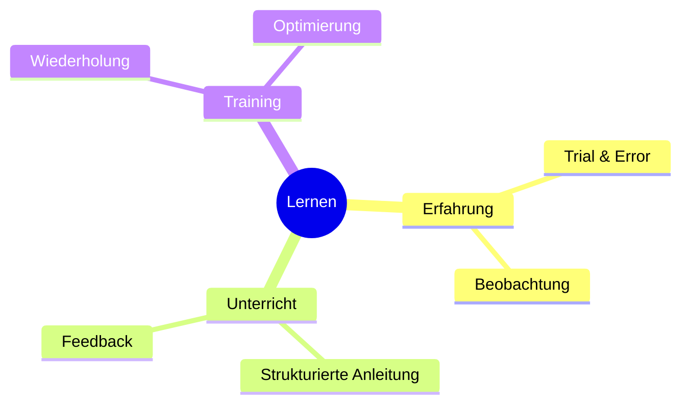

Diese menschlichen Lernprinzipien bilden die Grundlage für das maschinelle Lernen – übertragen auf Computer und Algorithmen.

---

## Was ist Machine Learning?

**Machine Learning** (maschinelles Lernen) bezeichnet einen Bereich der künstlichen Intelligenz, der es Computern ermöglicht:

1. **Automatisch aus Informationen und Erfahrung zu lernen**
2. **Ihre Leistung bei bestimmten Aufgaben kontinuierlich zu verbessern**
3. **Muster und Zusammenhänge zu erkennen** und diese in Vorhersagen, Entscheidungen oder Aktionen umzusetzen

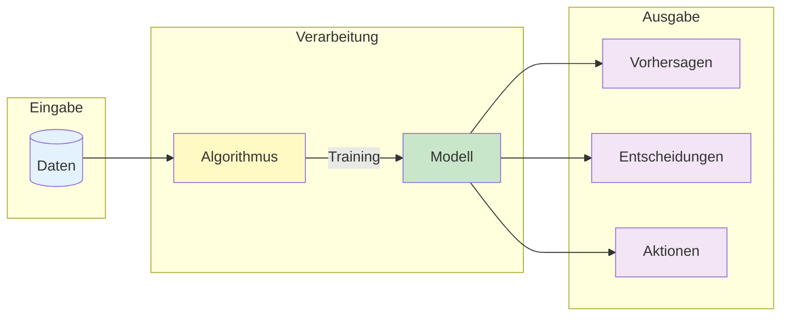

### Kernkonzepte

| Begriff | Beschreibung |
|---------|--------------|
| **Algorithmus** | Präzise, wohldefinierte Prozedur zur Lösung einer Aufgabe |
| **Modell** | Das Ergebnis des Lernprozesses – repräsentiert erkannte Muster |
| **Training** | Der Prozess, bei dem ein Algorithmus aus Daten lernt |
| **Vorhersage** | Anwendung des trainierten Modells auf neue Daten |

### Anwendungsgebiete

Machine Learning ist heute in vielen Bereichen verbreitet:

- **Bilderkennung**: Gesichtserkennung, medizinische Bildanalyse, autonomes Fahren
- **Spracherkennung**: Sprachassistenten, automatische Transkription
- **Datenanalyse**: Kundensegmentierung, Trendanalyse
- **Prognose**: Wettervorhersage, Aktienkurse, Nachfrageplanung
- **Automatisierte Entscheidungsfindung**: Kreditvergabe, Empfehlungssysteme

---

## Wie funktioniert Machine Learning?

Der grundlegende ML-Prozess folgt einem klaren Muster:

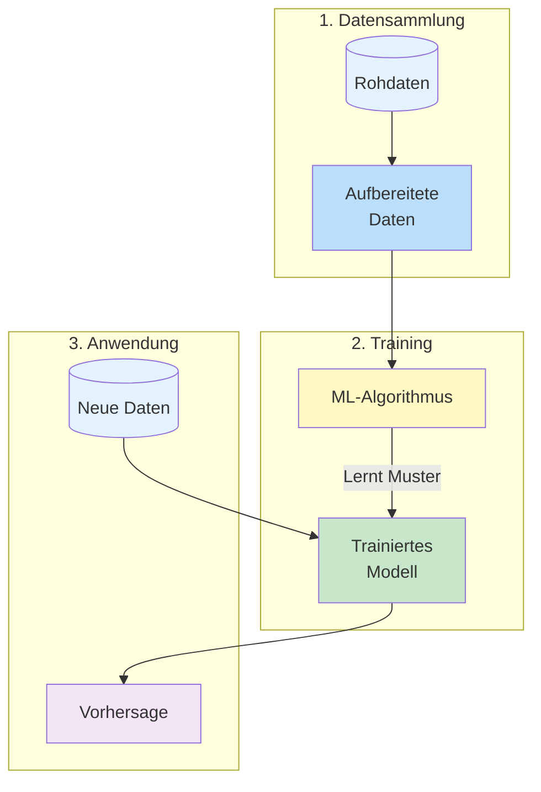

### Der Lernprozess im Detail

1. **Daten sammeln**: Relevante Beispieldaten für das Problem zusammentragen
2. **Daten aufbereiten**: Bereinigen, transformieren und für das Training vorbereiten
3. **Algorithmus wählen**: Passenden ML-Algorithmus für die Aufgabe auswählen
4. **Modell trainieren**: Algorithmus lernt Muster aus den Trainingsdaten
5. **Modell evaluieren**: Leistung auf ungesehenen Testdaten prüfen
6. **Modell anwenden**: Vorhersagen für neue Daten erstellen

---

## Lernparadigmen

Die Art der verfügbaren Daten bestimmt, welches Lernparadigma angewendet werden kann. Es gibt drei grundlegende Ansätze:

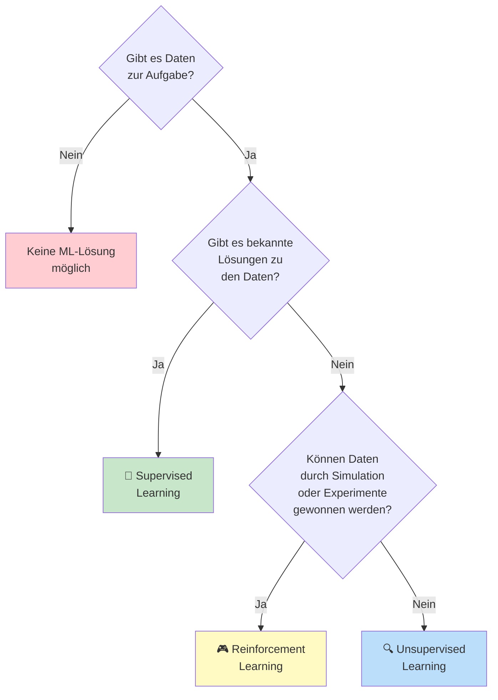

### Übersicht der Lernparadigmen

| Paradigma | Daten | Lernziel | Typische Anwendung |
|-----------|-------|----------|-------------------|
| **Supervised Learning** | Daten mit bekannten Lösungen (Labels) | Vorhersage für neue Daten | Spam-Erkennung, Preisvorhersage |
| **Unsupervised Learning** | Daten ohne Labels | Strukturen und Muster entdecken | Kundensegmentierung, Anomalieerkennung |
| **Reinforcement Learning** | Interaktion mit Umgebung | Optimale Strategie lernen | Spielstrategien, Robotersteuerung |

---

## Lernparadigmen und Aufgabentypen

Jedes Lernparadigma umfasst verschiedene Aufgabentypen:

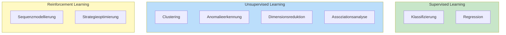

---

## Supervised Learning (Überwachtes Lernen)

Beim **Supervised Learning** werden Modelle mit **gelabelten Daten** trainiert – also Daten, bei denen die richtige Antwort bekannt ist. Das Modell lernt, die Beziehung zwischen Eingabe (Features) und Ausgabe (Label/Target) zu erkennen.

### Die zwei Hauptaufgaben

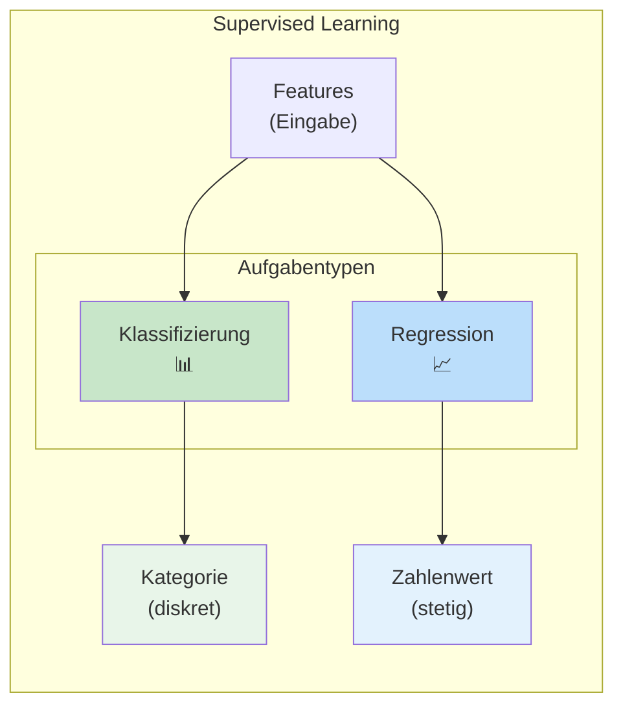

### Klassifizierung

Ein **Klassifizierungsmodell** sagt **kategoriale Werte** voraus – es ordnet Datenpunkte einer von mehreren vordefinierten Klassen zu.

**Beispiele:**

| Anwendung | Features (Eingabe) | Klassen (Ausgabe) |
|-----------|-------------------|-------------------|
| **Spam-Erkennung** | E-Mail-Text, Absender, Betreff | Spam / Kein Spam |
| **Medizinische Diagnose** | Symptome, Laborwerte | Gesund / Krank |
| **Fahrprüfung** | Übungsstunden, Theorie-Tests | Bestanden / Nicht bestanden |
| **Bilderkennung** | Pixel-Werte | Katze / Hund / Vogel / ... |

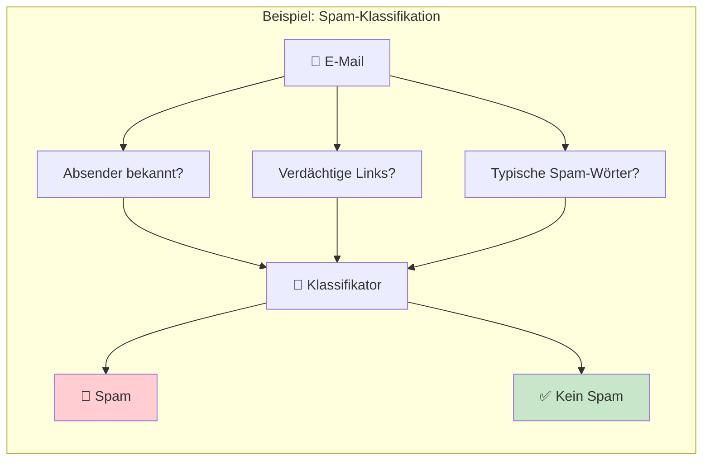

### Regression

Ein **Regressionsmodell** sagt **stetige, numerische Werte** voraus.

**Beispiele:**

| Anwendung | Features (Eingabe) | Ausgabe (numerisch) |
|-----------|-------------------|---------------------|
| **Immobilienbewertung** | Lage, Größe, Baujahr, Ausstattung | Preis in € |
| **Temperaturvorhersage** | Historische Daten, Luftdruck, Jahreszeit | Temperatur in °C |
| **Umsatzprognose** | Vergangene Verkäufe, Marketing, Saison | Umsatz in € |
| **Speiseeis-Konsum** | Außentemperatur, Wochentag | Absatzmenge |

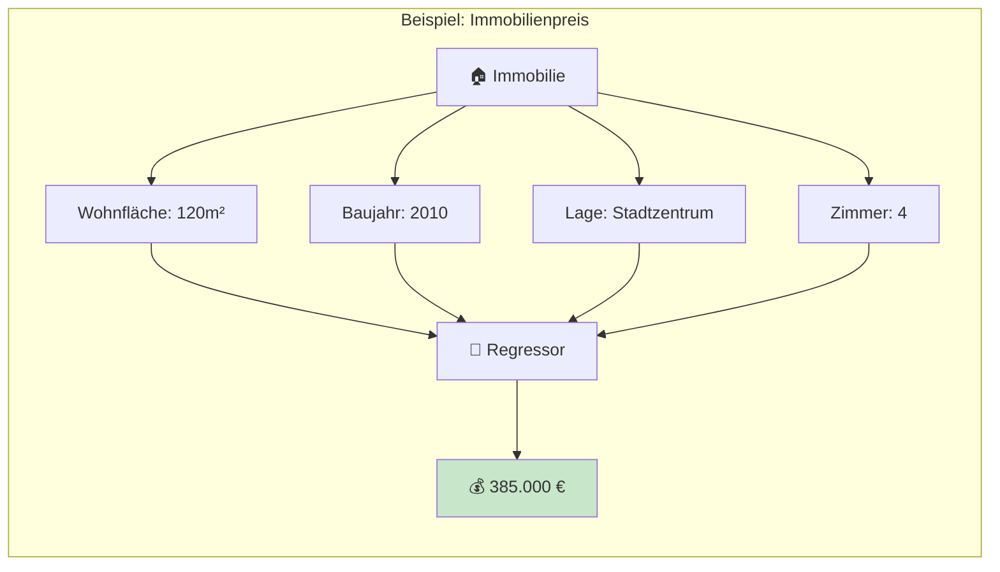

### Vergleich: Klassifizierung vs. Regression

| Aspekt | Klassifizierung | Regression |
|--------|----------------|------------|
| **Ausgabewert** | Kategorie (diskret) | Zahl (stetig) |
| **Beispiel-Frage** | "Ist es Spam?" | "Wie viel kostet es?" |
| **Anzahl möglicher Ausgaben** | Endlich viele Klassen | Unendlich viele Werte |
| **Typische Metriken** | Accuracy, Precision, Recall, F1 | MSE, RMSE, R² |
| **Beispiel-Algorithmen** | Logistische Regression, Decision Tree, Random Forest | Lineare Regression, Random Forest, XGBoost |

---

## Unsupervised Learning (Unüberwachtes Lernen)

Beim **Unsupervised Learning** arbeiten wir mit **ungelabelten Daten** – die "richtigen Antworten" sind nicht bekannt. Das Ziel ist es, **versteckte Strukturen und Muster** in den Daten zu entdecken.

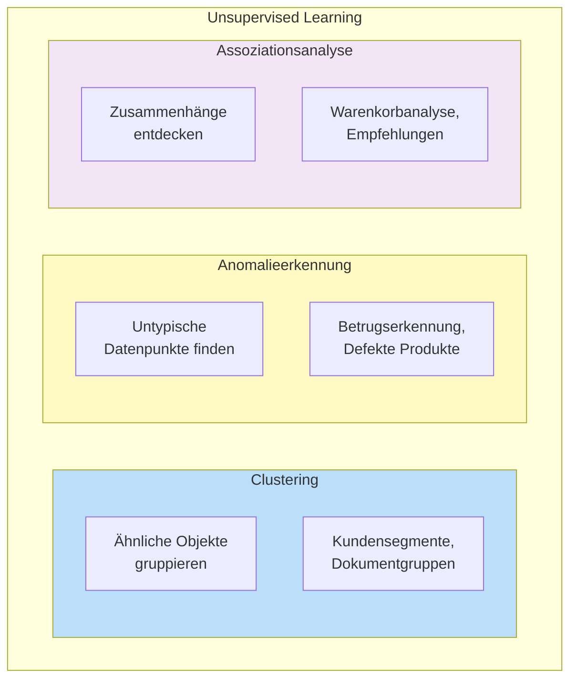

### Clustering (Segmentierung)

**Clustering** ist ein Verfahren zur Entdeckung von **Ähnlichkeitsstrukturen** in Daten. Die gefundenen Gruppen von "ähnlichen" Objekten werden als **Cluster** bezeichnet.

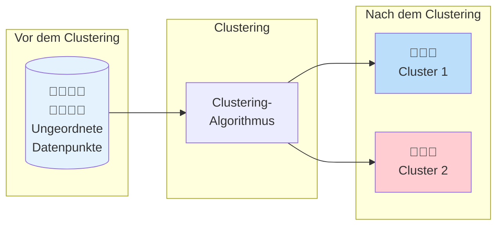

**Anwendungsbeispiele:**
- **Kundensegmentierung**: Gruppierung von Kunden nach Kaufverhalten
- **Dokumenten-Clustering**: Thematische Sortierung von Texten
- **Bildkompression**: Reduktion von Farbpaletten

### Anomalieerkennung

Die **Anomalieerkennung** identifiziert Datensätze, die für die gesamte Datenbasis **untypisch** sind.

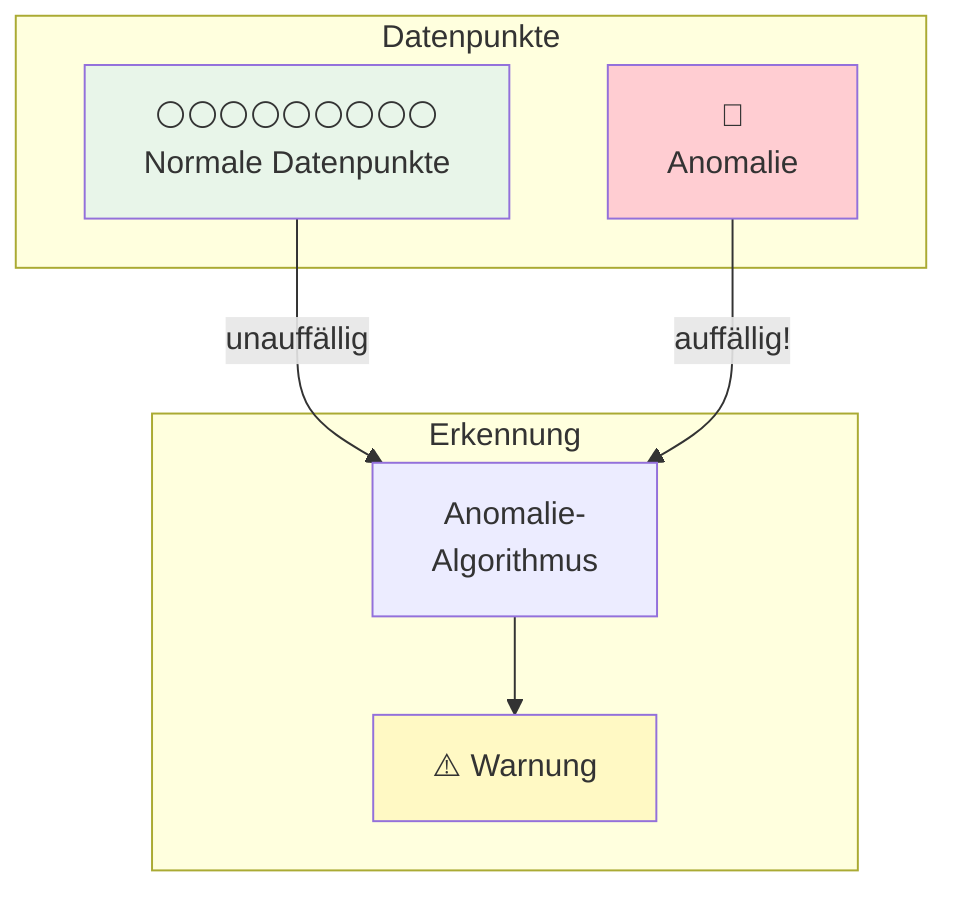

**Anwendungsbeispiele:**
- **Betrugserkennung**: Ungewöhnliche Kreditkartentransaktionen
- **Qualitätskontrolle**: Defekte Produkte in der Fertigung
- **Netzwerksicherheit**: Verdächtige Aktivitäten erkennen
- **Medizin**: Abnormale Messwerte identifizieren

### Assoziationsanalyse

Die **Assoziationsanalyse** dient dem Auffinden von **Zusammenhängen** in transaktionsbasierten Daten. Die Ergebnisse werden als **Assoziationsregeln** dargestellt.

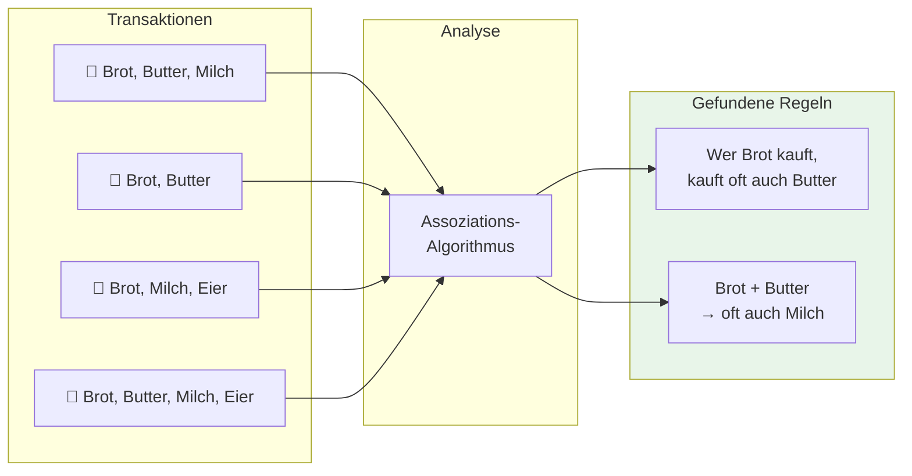

**Das klassische Beispiel: Warenkorbanalyse**

> **"Wer Windeln kauft, kauft oft auch Bier"** – Diese berühmte (wenn auch umstrittene) Entdeckung zeigt, wie Assoziationsanalyse unerwartete Zusammenhänge aufdecken kann.

**Anwendungsbeispiele:**
- **Empfehlungssysteme**: "Kunden, die X kauften, kauften auch Y"
- **Cross-Selling**: Produktempfehlungen im E-Commerce
- **Angebotsgestaltung**: Produktbündel und Rabattaktionen

---

## Zusammenfassung

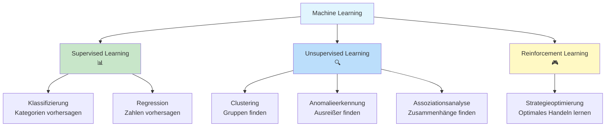

### Die wichtigsten Punkte

| Konzept | Kernaussage |
|---------|-------------|
| **Machine Learning** | Computer lernen aus Daten, Muster zu erkennen und Vorhersagen zu treffen |
| **Supervised Learning** | Lernen mit gelabelten Daten – die richtigen Antworten sind bekannt |
| **Unsupervised Learning** | Lernen ohne Labels – Strukturen und Muster selbst entdecken |
| **Klassifizierung** | Kategoriale Vorhersagen (z.B. Spam/Kein Spam) |
| **Regression** | Numerische Vorhersagen (z.B. Preis in €) |
| **Clustering** | Ähnliche Datenpunkte gruppieren |
| **Anomalieerkennung** | Ungewöhnliche Datenpunkte identifizieren |

### Entscheidungshilfe: Welcher Ansatz?

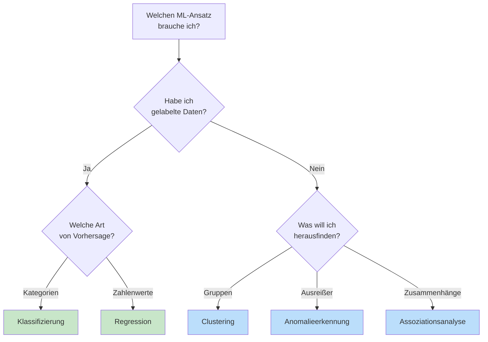

---

**Version:** 1.0       
**Stand:** Januar 2026     
**Kurs:** Machine Learning. Verstehen. Anwenden. Gestalten.     
