# Apriori-Algorithmus
{: .no_toc }

> **Der Apriori-Algorithmus für Assoziationsanalyse – Entdeckung von Zusammenhängen in Transaktionsdaten mit Support, Confidence und Lift**

---

# Inhaltsverzeichnis
{: .no_toc .text-delta }

1. TOC
{:toc}

---

## Überblick

Der **Apriori-Algorithmus** ist ein klassisches Verfahren zur Assoziationsanalyse im Bereich des unüberwachten Lernens. Er dient dem Auffinden von Zusammenhängen in transaktionsbasierten Datenbasen, die in Form sogenannter **Assoziationsregeln** dargestellt werden.

```mermaid
flowchart LR
    subgraph Eingabe
        T[(Transaktionsdaten)]
    end
    
    subgraph Apriori["Apriori-Algorithmus"]
        F[Häufige Itemsets<br>finden]
        R[Assoziationsregeln<br>generieren]
        F --> R
    end
    
    subgraph Ausgabe
        A["Regeln mit<br>Support, Confidence, Lift"]
    end
    
    T --> F
    R --> A
    
    style Apriori fill:#e8f4f8,stroke:#1a5276
    style T fill:#fdebd0,stroke:#d35400
    style A fill:#d5f5e3,stroke:#1e8449
```

### Anwendungsgebiete

Die häufigste Anwendung des Apriori-Algorithmus ist die **Warenkorbanalyse**:

| Anwendungsbereich | Beispiel |
|-------------------|----------|
| **Einzelhandel** | Welche Produkte werden häufig zusammen gekauft? |
| **E-Commerce** | Produktempfehlungen ("Kunden kauften auch...") |
| **Streaming** | Musik- oder Filmempfehlungen basierend auf Nutzungsmustern |
| **Ausbildung** | Individuelle Kursvorschläge basierend auf absolvierten Kursen |
| **Forstwirtschaft** | Analyse von Waldbrandmustern |
| **Suchmaschinen** | Autocomplete-Funktionen bei Google |

---

## Grundkonzept der Assoziationsregeln

Eine Assoziationsregel hat die Form **{A, B} → C**, was bedeutet: *"Wenn A und B vorkommen, dann ist C wahrscheinlich"*.

```mermaid
flowchart LR
    subgraph Antezedenz["Antezedenz (Wenn...)"]
        A["🥛 Milch"]
        B["🧷 Windel"]
    end
    
    subgraph Konsequenz["Konsequenz (...dann)"]
        C["🍺 Bier"]
    end
    
    A --> |"zusammen<br>gekauft"| B
    B --> |"führt zu"| C
    
    style Antezedenz fill:#fff3cd,stroke:#856404
    style Konsequenz fill:#d4edda,stroke:#155724
```

### Terminologie

| Begriff | Beschreibung |
|---------|--------------|
| **Item** | Einzelnes Element (z.B. ein Produkt) |
| **Itemset** | Menge von Items (z.B. {Milch, Windel, Bier}) |
| **Transaktion** | Ein Einkauf/Vorgang mit mehreren Items |
| **Antezedenz** | "Wenn"-Teil der Regel (Vorläufer) |
| **Konsequenz** | "Dann"-Teil der Regel (Nachfolger) |

---

## Metriken: Support, Confidence und Lift

Die Qualität von Assoziationsregeln wird durch drei zentrale Metriken bewertet:

```mermaid
flowchart TB
    subgraph Metriken["Bewertungsmetriken"]
        S["📊 Support<br><i>Wie häufig?</i>"]
        C["🎯 Confidence<br><i>Wie zuverlässig?</i>"]
        L["📈 Lift<br><i>Wie stark der Zusammenhang?</i>"]
    end
    
    S --> |"Mindest-<br>schwelle"| Filter["Regelfilterung"]
    C --> Filter
    L --> Filter
    Filter --> Result["Relevante<br>Assoziationsregeln"]
    
    style S fill:#e3f2fd,stroke:#1565c0
    style C fill:#fff8e1,stroke:#f9a825
    style L fill:#e8f5e9,stroke:#2e7d32
    style Result fill:#f3e5f5,stroke:#7b1fa2
```

### Support (Häufigkeit)

Der **Support** gibt an, wie häufig ein Itemset in allen Transaktionen vorkommt:

$$\text{Support}(A, B, C) = \frac{\text{Anzahl Transaktionen mit } \{A, B, C\}}{\text{Gesamtzahl Transaktionen}}$$

**Interpretation:**
- Hoher Support = Itemset kommt häufig vor
- Dient als erster Filter für relevante Itemsets

### Confidence (Zuverlässigkeit)

Die **Confidence** misst, wie oft die Regel zutrifft, wenn die Antezedenz vorliegt:

$$\text{Confidence}(\{A, B\} \Rightarrow C) = \frac{\text{Support}(A, B, C)}{\text{Support}(A, B)}$$

**Interpretation:**
- Wert zwischen 0 und 1 (oder 0% bis 100%)
- Confidence = 0.67 bedeutet: In 67% der Fälle, in denen A und B gekauft werden, wird auch C gekauft

### Lift (Abhängigkeitsstärke)

Der **Lift** zeigt, ob ein echter Zusammenhang besteht oder nur Zufall:

$$\text{Lift}(\{A, B\} \Rightarrow C) = \frac{\text{Support}(A, B, C)}{\text{Support}(A, B) \times \text{Support}(C)}$$

**Interpretation:**

| Lift-Wert | Bedeutung |
|-----------|-----------|
| **Lift = 1** | Kein Zusammenhang (unabhängig) |
| **Lift > 1** | Positiver Zusammenhang (Items werden häufiger zusammen gekauft als erwartet) |
| **Lift < 1** | Negativer Zusammenhang (Items werden seltener zusammen gekauft als erwartet) |

---

## Praktisches Beispiel: Warenkorbanalyse

### Beispieldaten

Betrachten wir folgende Einkaufstransaktionen:

| Transaktion | Gekaufte Items |
|-------------|----------------|
| T1 | Milch, Bier, Windel |
| T2 | Brot, Butter, Milch |
| T3 | Milch, Windel, Bier, Brot |
| T4 | Brot, Butter |
| T5 | Windel, Bier |

### Berechnung für {Milch, Windel} → Bier

```mermaid
flowchart TB
    subgraph Daten["📋 Transaktionsdaten (N=5)"]
        T1["T1: Milch, Bier, Windel ✓"]
        T2["T2: Brot, Butter, Milch"]
        T3["T3: Milch, Windel, Bier, Brot ✓"]
        T4["T4: Brot, Butter"]
        T5["T5: Windel, Bier"]
    end
    
    subgraph Counts["📊 Zählung"]
        C1["Milch, Windel, Bier: 2"]
        C2["Milch, Windel: 3"]
        C3["Bier: 3"]
    end
    
    subgraph Results["📈 Ergebnisse"]
        S["Support = 2/5 = 0.4"]
        Co["Confidence = 2/3 = 0.67"]
        L["Lift = 0.4/(0.6×0.6) = 1.11"]
    end
    
    Daten --> Counts
    Counts --> Results
    
    style T1 fill:#d4edda,stroke:#155724
    style T3 fill:#d4edda,stroke:#155724
```

**Schritt 1: Support berechnen**

$$\text{Support}(\text{Milch, Windel, Bier}) = \frac{2}{5} = 0.4$$

In 40% aller Einkäufe werden Milch, Windel und Bier zusammen gekauft.

**Schritt 2: Confidence berechnen**

$$\text{Confidence} = \frac{P(\text{Milch, Windel, Bier})}{P(\text{Milch, Windel})} = \frac{2}{3} = 0.67$$

Wenn Milch und Windel gekauft werden, wird in 67% der Fälle auch Bier gekauft.

**Schritt 3: Lift berechnen**

$$\text{Lift} = \frac{0.4}{0.6 \times 0.6} = \frac{0.4}{0.36} = 1.11$$

Der Lift von 1.11 zeigt einen leicht positiven Zusammenhang – Milch und Windel begünstigen den Kauf von Bier etwas mehr als der Zufall erwarten ließe.

---

## Parameterwahl und Schwellenwerte

Die Wahl geeigneter Schwellenwerte ist entscheidend für brauchbare Ergebnisse:

### Empfehlungen

| Szenario | min_support | min_confidence | min_lift |
|----------|-------------|----------------|----------|
| **Explorative Analyse** | 0.01 - 0.05 | 0.3 - 0.5 | > 1.0 |
| **Produktionsregeln** | 0.05 - 0.1 | 0.6 - 0.8 | > 1.2 |
| **Große Datensätze** | 0.001 - 0.01 | 0.5 - 0.7 | > 1.1 |

---

## Best Practices

### Datenaufbereitung

1. **Bereinigung**: Entferne sehr seltene Items (< 0.1% Vorkommen)
2. **Gruppierung**: Fasse ähnliche Items zusammen (z.B. "Cola", "Fanta" → "Softdrinks")
3. **Zeitfenster**: Berücksichtige saisonale Effekte durch separate Analysen

### Interpretation

1. **Lift priorisieren**: Regeln mit hohem Lift sind oft interessanter als solche mit hohem Support
2. **Domain-Wissen einbeziehen**: Prüfe, ob Regeln geschäftlich Sinn ergeben
3. **Vorsicht bei Trivialitäten**: "Burger → Pommes" ist offensichtlich und wenig hilfreich

### Typische Fallstricke

| Problem | Lösung |
|---------|--------|
| Zu viele Regeln | Support/Confidence erhöhen |
| Keine Regeln gefunden | Schwellenwerte senken |
| Triviale Regeln | Lift-Schwelle erhöhen (> 1.5) |
| Seltene Items ignoriert | Support senken oder Items gruppieren |

---

### Kernpunkte

| Aspekt | Beschreibung |
|--------|--------------|
| **Zweck** | Entdeckung von Zusammenhängen in Transaktionsdaten |
| **Eingabe** | Listen von Items pro Transaktion |
| **Ausgabe** | Assoziationsregeln mit Support, Confidence, Lift |
| **Hauptanwendung** | Warenkorbanalyse, Empfehlungssysteme |
| **Python-Bibliothek** | `mlxtend` |

### Wann Apriori einsetzen?

✅ **Geeignet für:**
- Warenkorbanalyse im Einzelhandel
- Empfehlungssysteme
- Analyse von Nutzerverhalten
- Entdeckung von Mustern in kategorialen Daten

❌ **Weniger geeignet für:**
- Kontinuierliche numerische Daten
- Sehr große Itemmengen (> 10.000)
- Echtzeitanalysen (besser: FP-Growth)

---

**Version:** 1.0    
**Stand:** Januar 2026    
**Kurs:** Machine Learning. Verstehen. Anwenden. Gestalten.    