# Apriori-Algorithmus
{: .no_toc }

> **Der Apriori-Algorithmus für Assoziationsanalyse – Entdeckung von Zusammenhängen in Transaktionsdaten mit Support, Confidence und Lift**

---

# Inhaltsverzeichnis
{: .no_toc .text-delta }

1. TOC
{:toc}

---

## Überblick

Der **Apriori-Algorithmus** ist ein klassisches Verfahren zur Assoziationsanalyse im Bereich des unüberwachten Lernens. Er dient dem Auffinden von Zusammenhängen in transaktionsbasierten Datenbasen, die in Form sogenannter **Assoziationsregeln** dargestellt werden.

```mermaid
flowchart LR
    subgraph Eingabe
        T[(Transaktionsdaten)]
    end
    
    subgraph Apriori["Apriori-Algorithmus"]
        F[Häufige Itemsets<br>finden]
        R[Assoziationsregeln<br>generieren]
        F --> R
    end
    
    subgraph Ausgabe
        A["Regeln mit<br>Support, Confidence, Lift"]
    end
    
    T --> F
    R --> A
    
    style Apriori fill:#e8f4f8,stroke:#1a5276
    style T fill:#fdebd0,stroke:#d35400
    style A fill:#d5f5e3,stroke:#1e8449
```



### Anwendungsgebiete

Die häufigste Anwendung des Apriori-Algorithmus ist die **Warenkorbanalyse**:

| Anwendungsbereich | Beispiel |
|-------------------|----------|
| **Einzelhandel** | Welche Produkte werden häufig zusammen gekauft? |
| **E-Commerce** | Produktempfehlungen ("Kunden kauften auch...") |
| **Streaming** | Musik- oder Filmempfehlungen basierend auf Nutzungsmustern |
| **Ausbildung** | Individuelle Kursvorschläge basierend auf absolvierten Kursen |
| **Forstwirtschaft** | Analyse von Waldbrandmustern |
| **Suchmaschinen** | Autocomplete-Funktionen bei Google |

---

## Grundkonzept der Assoziationsregeln

Eine Assoziationsregel hat die Form **{A, B} → C**, was bedeutet: *"Wenn A und B vorkommen, dann ist C wahrscheinlich"*.

```mermaid
flowchart LR
    subgraph Antezedenz["Antezedenz (Wenn...)"]
        A["🥛 Milch"]
        B["🧷 Windel"]
    end
    
    subgraph Konsequenz["Konsequenz (...dann)"]
        C["🍺 Bier"]
    end
    
    A --> |"zusammen<br>gekauft"| B
    B --> |"führt zu"| C
    
    style Antezedenz fill:#fff3cd,stroke:#856404
    style Konsequenz fill:#d4edda,stroke:#155724
```



### Terminologie

| Begriff | Beschreibung |
|---------|--------------|
| **Item** | Einzelnes Element (z.B. ein Produkt) |
| **Itemset** | Menge von Items (z.B. {Milch, Windel, Bier}) |
| **Transaktion** | Ein Einkauf/Vorgang mit mehreren Items |
| **Antezedenz** | "Wenn"-Teil der Regel (Vorläufer) |
| **Konsequenz** | "Dann"-Teil der Regel (Nachfolger) |

---

## Metriken: Support, Confidence und Lift

Die Qualität von Assoziationsregeln wird durch drei zentrale Metriken bewertet:


### Support (Häufigkeit)

Der **Support** gibt an, wie häufig ein Itemset in allen Transaktionen vorkommt:

$$\text{Support}(A, B, C) = \frac{\text{Anzahl Transaktionen mit } \{A, B, C\}}{\text{Gesamtzahl Transaktionen}}$$

**Interpretation:**
- Hoher Support = Itemset kommt häufig vor
- Dient als erster Filter für relevante Itemsets

### Confidence (Zuverlässigkeit)

Die **Confidence** misst, wie oft die Regel zutrifft, wenn die Antezedenz vorliegt:

$$\text{Confidence}(\{A, B\} \Rightarrow C) = \frac{\text{Support}(A, B, C)}{\text{Support}(A, B)}$$

**Interpretation:**
- Wert zwischen 0 und 1 (oder 0% bis 100%)
- Confidence = 0.67 bedeutet: In 67% der Fälle, in denen A und B gekauft werden, wird auch C gekauft

### Lift (Abhängigkeitsstärke)

Der **Lift** zeigt, ob ein echter Zusammenhang besteht oder nur Zufall:

$$\text{Lift}(\{A, B\} \Rightarrow C) = \frac{\text{Support}(A, B, C)}{\text{Support}(A, B) \times \text{Support}(C)}$$

**Interpretation:**

| Lift-Wert | Bedeutung |
|-----------|-----------|
| **Lift = 1** | Kein Zusammenhang (unabhängig) |
| **Lift > 1** | Positiver Zusammenhang (Items werden häufiger zusammen gekauft als erwartet) |
| **Lift < 1** | Negativer Zusammenhang (Items werden seltener zusammen gekauft als erwartet) |

---

## Praktisches Beispiel: Warenkorbanalyse

### Beispieldaten

Betrachten wir folgende Einkaufstransaktionen:

| Transaktion | Gekaufte Items |
|-------------|----------------|
| T1 | Milch, Bier, Windel |
| T2 | Brot, Butter, Milch |
| T3 | Milch, Windel, Bier, Brot |
| T4 | Brot, Butter |
| T5 | Windel, Bier |

### Berechnung für {Milch, Windel} → Bier

```mermaid
flowchart TB
    subgraph Daten["📋 Transaktionsdaten (N=5)"]
        T1["T1: Milch, Bier, Windel ✓"]
        T2["T2: Brot, Butter, Milch"]
        T3["T3: Milch, Windel, Bier, Brot ✓"]
        T4["T4: Brot, Butter"]
        T5["T5: Windel, Bier"]
    end
    
    subgraph Counts["📊 Zählung"]
        C1["Milch, Windel, Bier: 2"]
        C2["Milch, Windel: 3"]
        C3["Bier: 3"]
    end
    
    subgraph Results["📈 Ergebnisse"]
        S["Support = 2/5 = 0.4"]
        Co["Confidence = 2/3 = 0.67"]
        L["Lift = 0.4/(0.6×0.6) = 1.11"]
    end
    
    Daten --> Counts
    Counts --> Results
    
    style T1 fill:#d4edda,stroke:#155724
    style T3 fill:#d4edda,stroke:#155724
```



**Schritt 1: Support berechnen**

$$\text{Support}(\text{Milch, Windel, Bier}) = \frac{2}{5} = 0.4$$

In 40% aller Einkäufe werden Milch, Windel und Bier zusammen gekauft.

**Schritt 2: Confidence berechnen**

$$\text{Confidence} = \frac{P(\text{Milch, Windel, Bier})}{P(\text{Milch, Windel})} = \frac{2}{3} = 0.67$$

Wenn Milch und Windel gekauft werden, wird in 67% der Fälle auch Bier gekauft.

**Schritt 3: Lift berechnen**

$$\text{Lift} = \frac{0.4}{0.6 \times 0.6} = \frac{0.4}{0.36} = 1.11$$

Der Lift von 1.11 zeigt einen leicht positiven Zusammenhang – Milch und Windel begünstigen den Kauf von Bier etwas mehr als der Zufall erwarten ließe.

---

## Python-Implementierung


### Daten vorbereiten

```python
import pandas as pd
from mlxtend.preprocessing import TransactionEncoder
from mlxtend.frequent_patterns import apriori, association_rules

# Transaktionsdaten als Liste von Listen
transactions = [
    ['Milch', 'Bier', 'Windel'],
    ['Brot', 'Butter', 'Milch'],
    ['Milch', 'Windel', 'Bier', 'Brot'],
    ['Brot', 'Butter'],
    ['Windel', 'Bier']
]

# One-Hot-Encoding der Transaktionen
te = TransactionEncoder()
te_array = te.fit_transform(transactions)

# DataFrame erstellen
df = pd.DataFrame(te_array, columns=te.columns_)
print("Transaktionsmatrix:")
print(df)
```

**Ausgabe:**

| | Bier | Brot | Butter | Milch | Windel |
|---|------|------|--------|-------|--------|
| 0 | True | False | False | True | True |
| 1 | False | True | True | True | False |
| 2 | True | True | False | True | True |
| 3 | False | True | True | False | False |
| 4 | True | False | False | False | True |

### Häufige Itemsets finden

```python
# Häufige Itemsets mit Mindest-Support von 40%
frequent_itemsets = apriori(df, min_support=0.4, use_colnames=True)

print("\nHäufige Itemsets (Support >= 0.4):")
print(frequent_itemsets.sort_values('support', ascending=False))
```

### Assoziationsregeln generieren

```python
# Assoziationsregeln mit Mindest-Confidence von 60%
rules = association_rules(
    frequent_itemsets, 
    metric="confidence", 
    min_threshold=0.6
)

# Relevante Spalten auswählen
rules_display = rules[['antecedents', 'consequents', 'support', 
                       'confidence', 'lift']].round(3)

print("\nAssoziationsregeln (Confidence >= 0.6):")
print(rules_display)
```

### Ergebnisse visualisieren

```python
import matplotlib.pyplot as plt

# Scatter-Plot: Support vs. Confidence, Farbe = Lift
plt.figure(figsize=(10, 6))
scatter = plt.scatter(
    rules['support'], 
    rules['confidence'],
    c=rules['lift'],
    cmap='RdYlGn',
    s=100,
    alpha=0.7,
    edgecolors='black'
)

plt.colorbar(scatter, label='Lift')
plt.xlabel('Support', fontsize=12)
plt.ylabel('Confidence', fontsize=12)
plt.title('Assoziationsregeln: Support vs. Confidence', fontsize=14)
plt.grid(True, alpha=0.3)
plt.tight_layout()
plt.show()
```

---

## Vollständiges Beispiel: Supermarkt-Analyse

```python
import pandas as pd
import numpy as np
from mlxtend.preprocessing import TransactionEncoder
from mlxtend.frequent_patterns import apriori, association_rules
import matplotlib.pyplot as plt

# Größeres Beispiel-Dataset
transactions = [
    ['Brot', 'Milch', 'Butter'],
    ['Brot', 'Milch', 'Windel', 'Bier', 'Eier'],
    ['Milch', 'Windel', 'Bier', 'Cola'],
    ['Brot', 'Milch', 'Windel', 'Bier'],
    ['Brot', 'Milch', 'Windel', 'Cola'],
    ['Milch', 'Windel', 'Bier'],
    ['Brot', 'Butter', 'Eier'],
    ['Brot', 'Milch', 'Butter', 'Eier'],
    ['Milch', 'Windel', 'Bier', 'Brot'],
    ['Brot', 'Butter']
]

# Daten transformieren
te = TransactionEncoder()
te_array = te.fit_transform(transactions)
df = pd.DataFrame(te_array, columns=te.columns_)

# Häufige Itemsets finden
frequent_itemsets = apriori(df, min_support=0.3, use_colnames=True)

# Assoziationsregeln generieren
rules = association_rules(
    frequent_itemsets,
    metric="lift",
    min_threshold=1.0  # Nur positive Zusammenhänge
)

# Top-Regeln nach Lift sortieren
top_rules = rules.nlargest(10, 'lift')[
    ['antecedents', 'consequents', 'support', 'confidence', 'lift']
]

print("Top 10 Assoziationsregeln nach Lift:")
print(top_rules.round(3))

# Visualisierung
fig, axes = plt.subplots(1, 2, figsize=(14, 5))

# Plot 1: Support vs. Confidence
ax1 = axes[0]
scatter1 = ax1.scatter(
    rules['support'], 
    rules['confidence'],
    c=rules['lift'],
    cmap='viridis',
    s=80,
    alpha=0.7
)
ax1.set_xlabel('Support')
ax1.set_ylabel('Confidence')
ax1.set_title('Support vs. Confidence')
plt.colorbar(scatter1, ax=ax1, label='Lift')

# Plot 2: Lift-Verteilung
ax2 = axes[1]
rules['lift'].hist(bins=15, ax=ax2, color='steelblue', edgecolor='black')
ax2.axvline(x=1, color='red', linestyle='--', label='Lift = 1 (kein Zusammenhang)')
ax2.set_xlabel('Lift')
ax2.set_ylabel('Anzahl Regeln')
ax2.set_title('Verteilung der Lift-Werte')
ax2.legend()

plt.tight_layout()
plt.show()
```

---

## Parameterwahl und Schwellenwerte

Die Wahl geeigneter Schwellenwerte ist entscheidend für brauchbare Ergebnisse:

```mermaid
flowchart TB
    subgraph Parameter["⚙️ Parameter einstellen"]
        MS["min_support<br><i>Standard: 0.01-0.1</i>"]
        MC["min_confidence<br><i>Standard: 0.5-0.8</i>"]
        ML["min_lift<br><i>Standard: > 1.0</i>"]
    end
    
    subgraph Auswirkung["📊 Auswirkungen"]
        HS["Hoher Support<br>→ Wenige, häufige Regeln"]
        LS["Niedriger Support<br>→ Viele Regeln, mehr Rauschen"]
        HC["Hohe Confidence<br>→ Zuverlässigere Regeln"]
        HL["Hoher Lift<br>→ Stärkere Zusammenhänge"]
    end
    
    MS --> HS
    MS --> LS
    MC --> HC
    ML --> HL
    
    style MS fill:#e3f2fd,stroke:#1565c0
    style MC fill:#fff8e1,stroke:#f9a825
    style ML fill:#e8f5e9,stroke:#2e7d32
```



### Empfehlungen

| Szenario | min_support | min_confidence | min_lift |
|----------|-------------|----------------|----------|
| **Explorative Analyse** | 0.01 - 0.05 | 0.3 - 0.5 | > 1.0 |
| **Produktionsregeln** | 0.05 - 0.1 | 0.6 - 0.8 | > 1.2 |
| **Große Datensätze** | 0.001 - 0.01 | 0.5 - 0.7 | > 1.1 |

---

## Best Practices

### Datenaufbereitung

1. **Bereinigung**: Entferne sehr seltene Items (< 0.1% Vorkommen)
2. **Gruppierung**: Fasse ähnliche Items zusammen (z.B. "Cola", "Fanta" → "Softdrinks")
3. **Zeitfenster**: Berücksichtige saisonale Effekte durch separate Analysen

### Interpretation

1. **Lift priorisieren**: Regeln mit hohem Lift sind oft interessanter als solche mit hohem Support
2. **Domain-Wissen einbeziehen**: Prüfe, ob Regeln geschäftlich Sinn ergeben
3. **Vorsicht bei Trivialitäten**: "Burger → Pommes" ist offensichtlich und wenig hilfreich

### Typische Fallstricke

| Problem | Lösung |
|---------|--------|
| Zu viele Regeln | Support/Confidence erhöhen |
| Keine Regeln gefunden | Schwellenwerte senken |
| Triviale Regeln | Lift-Schwelle erhöhen (> 1.5) |
| Seltene Items ignoriert | Support senken oder Items gruppieren |

---

## Zusammenfassung

```mermaid
flowchart TB
    subgraph Apriori["🔍 Apriori-Algorithmus"]
        direction TB
        Input["Transaktionsdaten"]
        Step1["1️⃣ Häufige Itemsets<br>finden"]
        Step2["2️⃣ Assoziationsregeln<br>generieren"]
        Step3["3️⃣ Regeln bewerten<br>& filtern"]
        Output["Verwertbare<br>Geschäftsregeln"]
        
        Input --> Step1
        Step1 --> Step2
        Step2 --> Step3
        Step3 --> Output
    end
    
    subgraph Metriken["📊 Bewertungsmetriken"]
        S["Support<br><i>Häufigkeit</i>"]
        C["Confidence<br><i>Zuverlässigkeit</i>"]
        L["Lift<br><i>Zusammenhangsstärke</i>"]
    end
    
    Step3 --> S
    Step3 --> C
    Step3 --> L
    
    style Input fill:#fdebd0,stroke:#d35400
    style Output fill:#d5f5e3,stroke:#1e8449
    style S fill:#e3f2fd,stroke:#1565c0
    style C fill:#fff8e1,stroke:#f9a825
    style L fill:#e8f5e9,stroke:#2e7d32
```



### Kernpunkte

| Aspekt | Beschreibung |
|--------|--------------|
| **Zweck** | Entdeckung von Zusammenhängen in Transaktionsdaten |
| **Eingabe** | Listen von Items pro Transaktion |
| **Ausgabe** | Assoziationsregeln mit Support, Confidence, Lift |
| **Hauptanwendung** | Warenkorbanalyse, Empfehlungssysteme |
| **Python-Bibliothek** | `mlxtend` |

### Wann Apriori einsetzen?

✅ **Geeignet für:**
- Warenkorbanalyse im Einzelhandel
- Empfehlungssysteme
- Analyse von Nutzerverhalten
- Entdeckung von Mustern in kategorialen Daten

❌ **Weniger geeignet für:**
- Kontinuierliche numerische Daten
- Sehr große Itemmengen (> 10.000)
- Echtzeitanalysen (besser: FP-Growth)

---

## Weiterführende Ressourcen

- **KNIME**: [Association – Apriori](https://www.knime.com/nodeguide/analytics/mining/association-rule-learner)
- **Scikit-learn**: Keine native Implementierung, verwende `mlxtend`
- **Alternative Algorithmen**: FP-Growth (schneller für große Datensätze)

---

**Version:** 1.0    
**Stand:** Januar 2026    
**Kurs:** Machine Learning. Verstehen. Anwenden. Gestalten.    