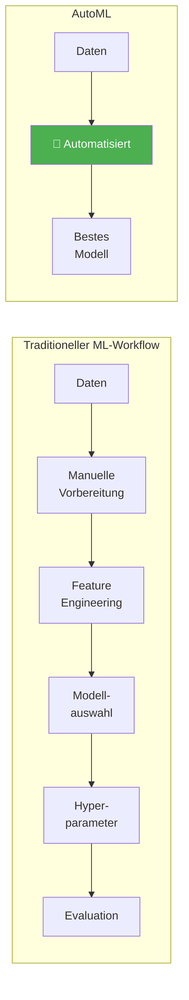
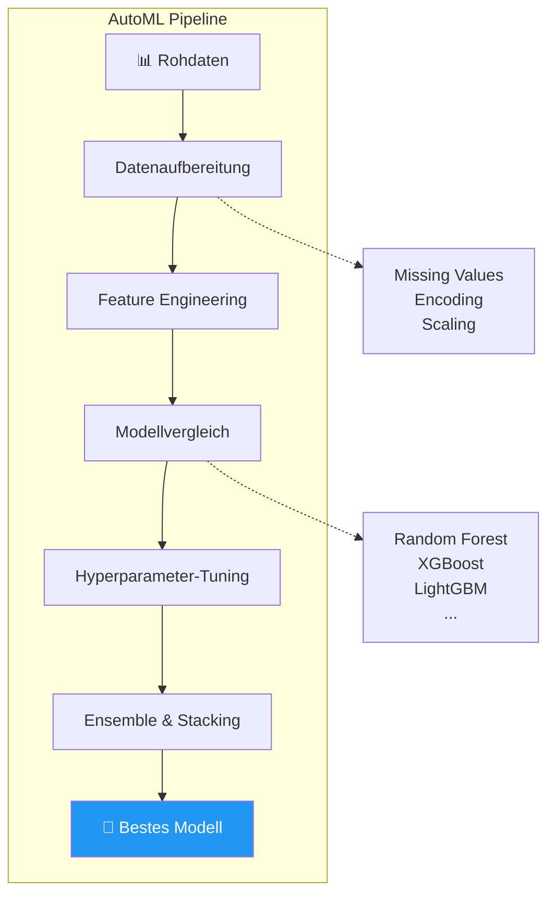
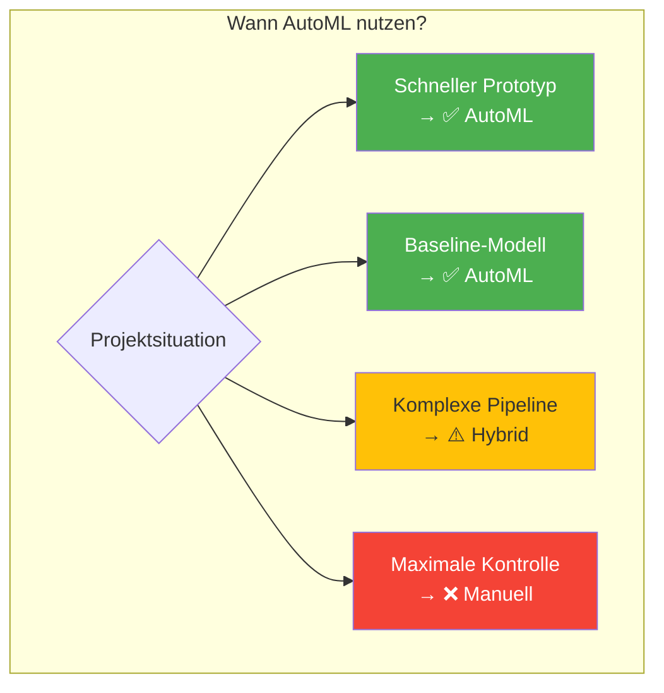

# AutoML
{: .no_toc }

> **Automatisiertes Machine Learning (AutoML) automatisiert den gesamten ML-Workflow – von der Datenvorbereitung über Feature Engineering bis zur Modellauswahl und Hyperparameter-Optimierung.**

---

## Inhaltsverzeichnis
{: .no_toc .text-delta }

1. TOC
{:toc}

---

## Was ist AutoML?

AutoML (Automated Machine Learning) ist ein Bereich der künstlichen Intelligenz, der darauf abzielt, den Prozess des maschinellen Lernens auf reale Probleme zu automatisieren.

---

## Kernfunktionen

AutoML-Systeme übernehmen automatisch die zeitaufwändigsten Schritte des ML-Prozesses:

| Funktion | Beschreibung |
|----------|-------------|
| **Automatische Datenvorbereitung** | Behandlung fehlender Daten, Kategorien kodieren, Transformationen auswählen |
| **Feature Engineering** | Automatische Identifikation und Erstellung wichtiger Merkmale |
| **Algorithmen-Auswahl** | Auswahl der am besten geeigneten ML-Algorithmen für das Problem |
| **Hyperparameter-Tuning** | Automatische Optimierung der Modelleinstellungen |
| **Kreuzvalidierung** | Gründliche Validierung zur Vermeidung von Overfitting |

---

## AutoML mit PyCaret

[PyCaret](https://pycaret.org/) ist eine Open-Source Python-Bibliothek für Low-Code Machine Learning. Sie automatisiert ML-Workflows und ermöglicht schnelles Experimentieren.

---

## AutoML-Plattformen im Vergleich

| Plattform | Open Source | Stärken | Einsatz |
|-----------|-------------|---------|---------|
| **PyCaret** | ✅ | Low-Code, schnell, umfangreich | Prototyping, Experimente |
| **Auto-sklearn** | ✅ | Scikit-learn basiert, robust | Forschung, Produktion |
| **H2O AutoML** | ✅ | Skalierbar, Enterprise-ready | Big Data, Unternehmen |
| **Google AutoML** | ❌ | Cloud-basiert, einfach | Cloud-native Projekte |
| **Azure AutoML** | ❌ | Microsoft-Integration | Enterprise, Azure-Nutzer |

---

## Vorteile und Grenzen

### Vorteile

- **Zeitersparnis:** Automatisierung repetitiver Aufgaben
- **Demokratisierung:** ML auch ohne tiefes Expertenwissen nutzbar
- **Konsistenz:** Standardisierte, reproduzierbare Pipelines
- **Exploration:** Schneller Überblick über geeignete Modelle

### Grenzen

- **Black-Box-Charakter:** Weniger Kontrolle über Entscheidungen
- **Domänenwissen:** Ersetzt nicht das Verständnis des Problems
- **Spezialfälle:** Komplexe, individuelle Anforderungen oft schwer abbildbar
- **Rechenaufwand:** Kann ressourcenintensiv sein

---

## Best Practices

1. **Datenqualität prüfen:** AutoML ersetzt keine Datenexploration
2. **Baseline etablieren:** Einfaches Modell zum Vergleich erstellen
3. **Ergebnisse verstehen:** Nicht blind dem besten Modell vertrauen
4. **Reproduzierbarkeit:** Immer `session_id` setzen
5. **Iteration:** AutoML als Startpunkt, dann manuell optimieren

---

**Version:** 1.0       
**Stand:** Januar 2026     
**Kurs:** Machine Learning. Verstehen. Anwenden. Gestalten.     
