# AutoML
{: .no_toc }

> **Automatisiertes Machine Learning (AutoML) automatisiert den gesamten ML-Workflow – von der Datenvorbereitung über Feature Engineering bis zur Modellauswahl und Hyperparameter-Optimierung.**

---

## Inhaltsverzeichnis
{: .no_toc .text-delta }

1. TOC
{:toc}

---

## Was ist AutoML?

AutoML (Automated Machine Learning) ist ein Bereich der künstlichen Intelligenz, der darauf abzielt, den Prozess des maschinellen Lernens auf reale Probleme zu automatisieren.

```mermaid
flowchart LR
    subgraph "Traditioneller ML-Workflow"
        A[Daten] --> B[Manuelle<br/>Vorbereitung]
        B --> C[Feature<br/>Engineering]
        C --> D[Modell-<br/>auswahl]
        D --> E[Hyper-<br/>parameter]
        E --> F[Evaluation]
    end
    
    subgraph "AutoML"
        G[Daten] --> H[🤖 Automatisiert]
        H --> I[Bestes<br/>Modell]
    end
    
    style H fill:#4CAF50,color:#fff
```



---

## Kernfunktionen

AutoML-Systeme übernehmen automatisch die zeitaufwändigsten Schritte des ML-Prozesses:

| Funktion | Beschreibung |
|----------|-------------|
| **Automatische Datenvorbereitung** | Behandlung fehlender Daten, Kategorien kodieren, Transformationen auswählen |
| **Feature Engineering** | Automatische Identifikation und Erstellung wichtiger Merkmale |
| **Algorithmen-Auswahl** | Auswahl der am besten geeigneten ML-Algorithmen für das Problem |
| **Hyperparameter-Tuning** | Automatische Optimierung der Modelleinstellungen |
| **Kreuzvalidierung** | Gründliche Validierung zur Vermeidung von Overfitting |

```mermaid
flowchart TD
    subgraph "AutoML Pipeline"
        A[📊 Rohdaten] --> B[Datenaufbereitung]
        B --> C[Feature Engineering]
        C --> D[Modellvergleich]
        D --> E[Hyperparameter-Tuning]
        E --> F[Ensemble & Stacking]
        F --> G[🎯 Bestes Modell]
    end
    
    B -.-> B1[Missing Values<br/>Encoding<br/>Scaling]
    D -.-> D1[Random Forest<br/>XGBoost<br/>LightGBM<br/>...]
    
    style G fill:#2196F3,color:#fff
```



---

## AutoML mit PyCaret

[PyCaret](https://pycaret.org/) ist eine Open-Source Python-Bibliothek für Low-Code Machine Learning. Sie automatisiert ML-Workflows und ermöglicht schnelles Experimentieren.

### Installation

```python
# PyCaret installieren
!pip install pycaret

# Für spezifische Module
!pip install pycaret[full]  # Alle Funktionen
```

### Workflow-Übersicht


---

## Praktisches Beispiel: Klassifikation

### Schritt 1: Daten laden und Setup

```python
# PyCaret Klassifikationsmodul importieren
from pycaret.classification import *

# Beispieldatensatz laden (Titanic)
from pycaret.datasets import get_data
data = get_data('titanic')

# Ersten Überblick verschaffen
print(f"Dataset Shape: {data.shape}")
data.head()
```

```python
# AutoML Setup - Initialisiert die Pipeline
clf = setup(
    data=data,
    target='Survived',           # Zielvariable
    session_id=42,               # Reproduzierbarkeit
    normalize=True,              # Automatische Normalisierung
    handle_unknown_categorical=True,
    remove_multicollinearity=True,
    multicollinearity_threshold=0.9,
    verbose=False
)
```

> **Hinweis:** `setup()` analysiert automatisch die Daten und wendet passende Transformationen an:
> - Erkennung von Datentypen (numerisch/kategorisch)
> - Handling von Missing Values
> - Encoding kategorialer Variablen
> - Feature-Skalierung

### Schritt 2: Modellvergleich

```python
# Alle verfügbaren Modelle vergleichen
best_models = compare_models(
    sort='AUC',        # Sortierung nach AUC
    n_select=3,        # Top 3 Modelle auswählen
    fold=5             # 5-Fold Cross-Validation
)

# Ausgabe: Tabelle mit allen Modellen und Metriken
```

Die Funktion `compare_models()` trainiert und evaluiert automatisch:
- Logistic Regression
- Random Forest
- Gradient Boosting (XGBoost, LightGBM, CatBoost)
- Support Vector Machine
- K-Nearest Neighbors
- Naive Bayes
- Und viele mehr...

### Schritt 3: Bestes Modell optimieren

```python
# Bestes Modell aus dem Vergleich
best = best_models[0]

# Hyperparameter-Tuning
tuned_model = tune_model(
    best,
    optimize='AUC',    # Optimierungsziel
    n_iter=50          # Anzahl der Iterationen
)

# Modelldetails anzeigen
print(tuned_model)
```

### Schritt 4: Modell finalisieren und speichern

```python
# Modell mit gesamten Daten trainieren
final_model = finalize_model(tuned_model)

# Vorhersagen auf neuen Daten
predictions = predict_model(final_model, data=data)

# Modell speichern
save_model(final_model, 'titanic_classifier')

# Modell später laden
loaded_model = load_model('titanic_classifier')
```

---

## Praktisches Beispiel: Regression

```python
# PyCaret Regressionsmodul
from pycaret.regression import *

# Beispieldatensatz (Immobilienpreise)
from pycaret.datasets import get_data
data = get_data('boston')

# Setup für Regression
reg = setup(
    data=data,
    target='medv',      # Median value (Hauspreis)
    session_id=42,
    normalize=True
)

# Modelle vergleichen
best = compare_models(sort='RMSE', n_select=1)

# Hyperparameter optimieren
tuned = tune_model(best, optimize='RMSE')

# Finalisieren
final = finalize_model(tuned)
```

---

## Visualisierung der Ergebnisse

PyCaret bietet integrierte Visualisierungen:

```python
# Verschiedene Plots erstellen
plot_model(tuned_model, plot='auc')          # ROC-Kurve
plot_model(tuned_model, plot='confusion_matrix')  # Confusion Matrix
plot_model(tuned_model, plot='feature')      # Feature Importance
plot_model(tuned_model, plot='learning')     # Learning Curve

# Für Regression
plot_model(tuned_model, plot='residuals')    # Residuenplot
plot_model(tuned_model, plot='error')        # Prediction Error
```


---

## Ensemble und Stacking

PyCaret ermöglicht einfaches Ensemble-Lernen:

```python
# Bagging
bagged = ensemble_model(best, method='Bagging', n_estimators=10)

# Boosting
boosted = ensemble_model(best, method='Boosting', n_estimators=10)

# Stacking mehrerer Modelle
top3 = compare_models(n_select=3)
stacked = stack_models(top3, meta_model=None)  # Automatische Meta-Modell-Auswahl

# Blending
blended = blend_models(top3)
```

---

## AutoML-Plattformen im Vergleich

| Plattform | Open Source | Stärken | Einsatz |
|-----------|-------------|---------|---------|
| **PyCaret** | ✅ | Low-Code, schnell, umfangreich | Prototyping, Experimente |
| **Auto-sklearn** | ✅ | Scikit-learn basiert, robust | Forschung, Produktion |
| **H2O AutoML** | ✅ | Skalierbar, Enterprise-ready | Big Data, Unternehmen |
| **Google AutoML** | ❌ | Cloud-basiert, einfach | Cloud-native Projekte |
| **Azure AutoML** | ❌ | Microsoft-Integration | Enterprise, Azure-Nutzer |

---

## Vorteile und Grenzen

### Vorteile

- **Zeitersparnis:** Automatisierung repetitiver Aufgaben
- **Demokratisierung:** ML auch ohne tiefes Expertenwissen nutzbar
- **Konsistenz:** Standardisierte, reproduzierbare Pipelines
- **Exploration:** Schneller Überblick über geeignete Modelle

### Grenzen

- **Black-Box-Charakter:** Weniger Kontrolle über Entscheidungen
- **Domänenwissen:** Ersetzt nicht das Verständnis des Problems
- **Spezialfälle:** Komplexe, individuelle Anforderungen oft schwer abbildbar
- **Rechenaufwand:** Kann ressourcenintensiv sein


---

## Best Practices

1. **Datenqualität prüfen:** AutoML ersetzt keine Datenexploration
2. **Baseline etablieren:** Einfaches Modell zum Vergleich erstellen
3. **Ergebnisse verstehen:** Nicht blind dem besten Modell vertrauen
4. **Reproduzierbarkeit:** Immer `session_id` setzen
5. **Iteration:** AutoML als Startpunkt, dann manuell optimieren

---

## Zusammenfassung


| Aspekt | Beschreibung |
|--------|-------------|
| **Was** | Automatisierung des ML-Workflows |
| **Warum** | Zeitersparnis, Konsistenz, schnelle Ergebnisse |
| **Wie** | PyCaret: `setup()` → `compare_models()` → `tune_model()` → `finalize_model()` |
| **Wann** | Prototyping, Baseline, Modellexploration |

---

## Weiterführende Ressourcen

- [PyCaret Dokumentation](https://pycaret.gitbook.io/docs/)
- [PyCaret GitHub](https://github.com/pycaret/pycaret)
- [Auto-sklearn](https://automl.github.io/auto-sklearn/)
- [H2O AutoML](https://docs.h2o.ai/h2o/latest-stable/h2o-docs/automl.html)


---

**Version:** 1.0       
**Stand:** Januar 2026     
**Kurs:** Machine Learning. Verstehen. Anwenden. Gestalten.     
