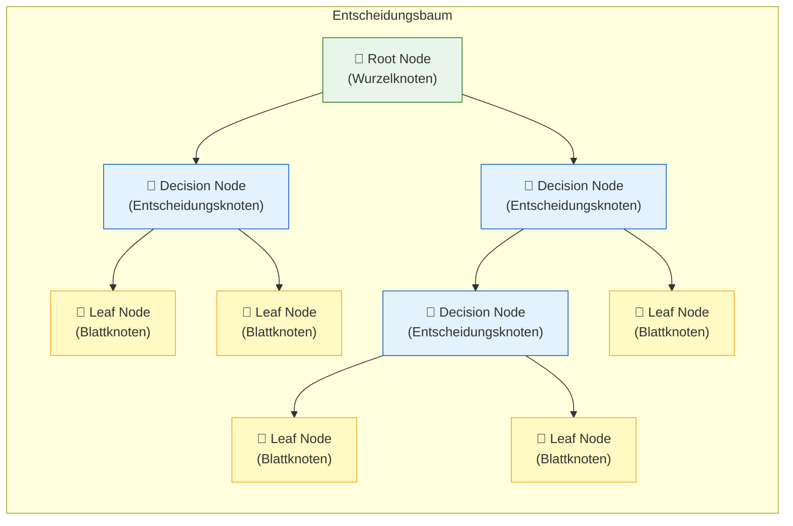
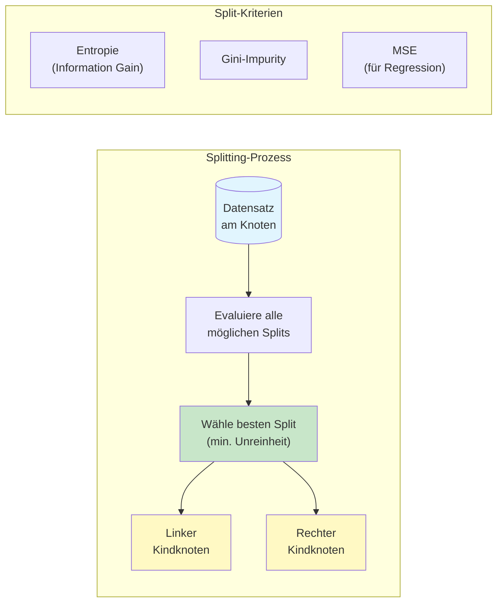
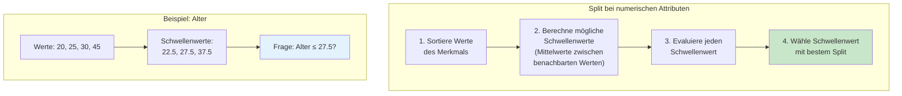
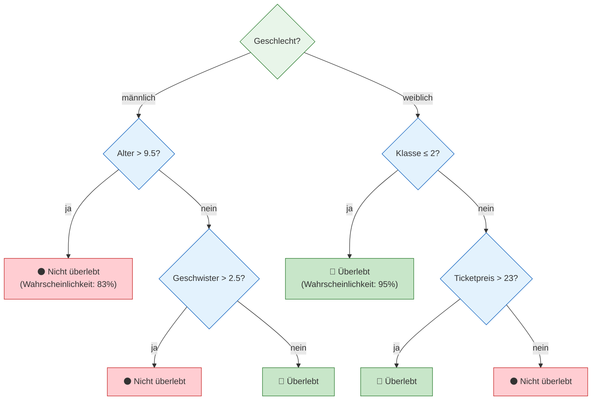
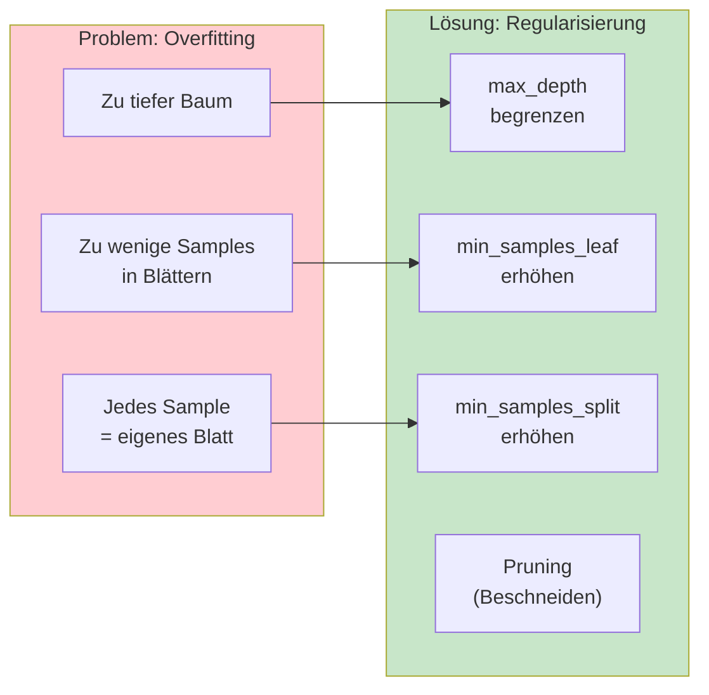
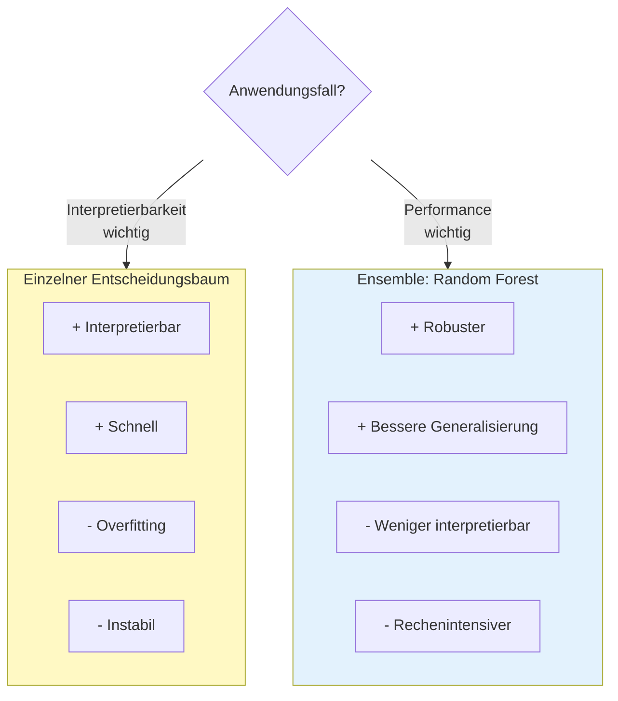
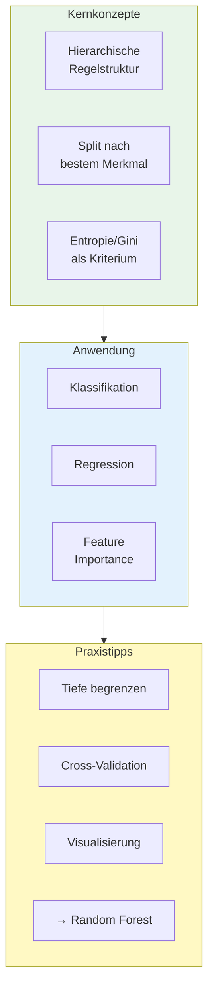

# Entscheidungsbaum (Decision Tree)
{: .no_toc }

> **Hierarchische Regelstruktur für ML-Modelle**
> Interpretierbare Entscheidungslogik für Klassifikation und Regression

---

# Inhaltsverzeichnis
{: .no_toc .text-delta }

1. TOC
{:toc}

---

## Überblick

Der Entscheidungsbaum ist ein fundamentaler Lernalgorithmus im überwachten maschinellen Lernen. Er eignet sich sowohl für **Klassifizierungs-** als auch für **Regressionsaufgaben** und zeichnet sich durch seine intuitive Interpretierbarkeit aus.

Das Grundprinzip: Aus dem Trainingsdatensatz wird eine hierarchische Struktur von Regeln abgeleitet. Ausgehend von der Wurzel werden regelbasierte Verzweigungen durchgeführt, bis eine Entscheidung (Vorhersage) getroffen werden kann.



## Komponenten des Entscheidungsbaums

| Komponente                              | Beschreibung                                           | Funktion                                       |
| --------------------------------------- | ------------------------------------------------------ | ---------------------------------------------- |
| **Root Node** (Wurzelknoten)            | Oberster Knoten des Baums                              | Erste Aufteilung des gesamten Datensatzes      |
| **Decision Node** (Entscheidungsknoten) | Innere Knoten mit Verzweigungen/<br>Entscheidungsregel | Weitere Aufteilung basierend auf Merkmalen     |
| **Leaf Node** (Blattknoten)             | Endknoten ohne Verzweigungen                           | Enthält die finale Vorhersage                  |
| **Subtree** (Teilbaum)                  | Unterbaum ab einem Knoten                              | Kann als eigenständiger Baum betrachtet werden |

## Das Splitting-Prinzip

Bei jedem Knoten wird das Merkmal ausgewählt, das zur **bestmöglichen Aufteilung** führt. Diese wird anhand von Kriterien wie **Entropie** oder **Gini-Impurity** ermittelt.



### Entropie und Information Gain

Die **Entropie** ist ein Maß für die Unsicherheit, Zufälligkeit oder Unordnung in den Daten:

- **Entropie = 0**: Alle Datenpunkte gehören zur selben Klasse (**perfekte** Ordnung)
- **Entropie = 1** (bei 2 Klassen): Gleichverteilung der Klassen (**maximale** Unordnung)

Der **Information Gain** misst, wie viel Entropie durch einen Split reduziert wird. Je **höher** der Information Gain, desto besser der Split.

### Gini-Impurity

Die **Gini-Impurity** ist ein alternatives Maß für die Unreinheit eines Knotens:

- **Gini = 0**: Alle Datenpunkte gehören zur selben Klasse
- **Gini = 0.5** (bei 2 Klassen): Gleichverteilung der Klassen

## Splitting bei numerischen Attributen

Bei numerischen Merkmalen muss der optimale Schwellenwert für die Aufteilung gefunden werden:



**Vorgehensweise:**
1. Die Werte des numerischen Merkmals werden sortiert
2. Zwischen jedem Paar benachbarter Werte wird ein potenzieller Schwellenwert berechnet
3. Für jeden Schwellenwert wird der Information Gain (oder Gini-Reduktion) berechnet
4. Der Schwellenwert mit dem höchsten Gain wird gewählt

## Beispiel: Titanic-Datensatz

Ein klassisches Beispiel für einen Entscheidungsbaum ist die Vorhersage der Überlebenschance auf der Titanic:



**Interpretation:**
- Der wichtigste Faktor ist das Geschlecht (Root Node)
- Bei Männern ist das Alter entscheidend
- Bei Frauen spielt die Reiseklasse eine große Rolle
- Jeder Pfad durch den Baum repräsentiert eine Regel

## Implementierung mit scikit-learn

### Klassifikation

```python
from sklearn.tree import DecisionTreeClassifier
from sklearn.model_selection import train_test_split
from sklearn.metrics import accuracy_score, classification_report
import pandas as pd

# Daten vorbereiten
data = df.drop('target', axis=1)
target = df['target']

# Train-Test-Split
data_train, data_test, target_train, target_test = train_test_split(
    data, target, test_size=0.2, random_state=42
)

# Modell erstellen und trainieren
model = DecisionTreeClassifier(
    criterion='gini',      # oder 'entropy'
    max_depth=5,           # Maximale Tiefe begrenzen
    min_samples_split=10,  # Mindestanzahl für Split
    min_samples_leaf=5,    # Mindestanzahl in Blättern
    random_state=42
)

model.fit(data_train, target_train)

# Vorhersage und Evaluation
target_pred = model.predict(data_test)
print(f"Accuracy: {accuracy_score(target_test, target_pred):.3f}")
print(classification_report(target_test, target_pred))
```

### Regression

```python
from sklearn.tree import DecisionTreeRegressor
from sklearn.metrics import mean_squared_error, r2_score

# Modell erstellen und trainieren
model = DecisionTreeRegressor(
    criterion='squared_error',  # MSE als Kriterium
    max_depth=5,
    min_samples_split=10,
    random_state=42
)

model.fit(data_train, target_train)

# Vorhersage und Evaluation
target_pred = model.predict(data_test)
print(f"MSE:  {mean_squared_error(target_test, target_pred):.3f}")
print(f"RMSE: {mean_squared_error(target_test, target_pred, squared=False):.3f}")
print(f"R²:   {r2_score(target_test, target_pred):.3f}")
```

## Wichtige Hyperparameter

| Parameter | Beschreibung | Typische Werte |
|-----------|--------------|----------------|
| `criterion` | Split-Kriterium | `'gini'`, `'entropy'` (Klassifikation), `'squared_error'` (Regression) |
| `max_depth` | Maximale Baumtiefe | 3-20, oder `None` für unbegrenzt |
| `min_samples_split` | Mindestanzahl für einen Split | 2-20 |
| `min_samples_leaf` | Mindestanzahl in Blattknoten | 1-10 |
| `max_features` | Anzahl der Features pro Split | `'sqrt'`, `'log2'`, oder Anzahl |

### Hyperparameter zur Vermeidung von Overfitting



## Visualisierung des Baums

### Mit matplotlib

```python
from sklearn.tree import plot_tree
import matplotlib.pyplot as plt

plt.figure(figsize=(20, 10))
plot_tree(
    model,
    feature_names=data.columns,
    class_names=['Klasse 0', 'Klasse 1'],
    filled=True,
    rounded=True,
    fontsize=10
)
plt.title("Entscheidungsbaum Visualisierung")
plt.tight_layout()
plt.show()
```

### Textuelle Darstellung

```python
from sklearn.tree import export_text

# Regeln als Text ausgeben
tree_rules = export_text(
    model,
    feature_names=list(data.columns)
)
print(tree_rules)
```

**Beispielausgabe:**
```
|--- Geschlecht <= 0.50
|   |--- Klasse <= 2.50
|   |   |--- class: Überlebt
|   |--- Klasse >  2.50
|   |   |--- Ticketpreis <= 23.00
|   |   |   |--- class: Nicht überlebt
|   |   |--- Ticketpreis >  23.00
|   |   |   |--- class: Überlebt
|--- Geschlecht >  0.50
|   |--- Alter <= 9.50
|   |   |--- class: Überlebt
|   |--- Alter >  9.50
|   |   |--- class: Nicht überlebt
```

## Feature Importance

Entscheidungsbäume liefern automatisch eine Bewertung der Feature-Wichtigkeit:

```python
import pandas as pd
import matplotlib.pyplot as plt

# Feature Importance extrahieren
importance = pd.DataFrame({
    'Feature': data.columns,
    'Importance': model.feature_importances_
}).sort_values('Importance', ascending=False)

# Visualisierung
plt.figure(figsize=(10, 6))
plt.barh(importance['Feature'], importance['Importance'])
plt.xlabel('Importance')
plt.title('Feature Importance des Entscheidungsbaums')
plt.gca().invert_yaxis()
plt.tight_layout()
plt.show()
```

## Vor- und Nachteile

### Vorteile ✅

- **Interpretierbarkeit**: Entscheidungsregeln sind leicht verständlich
- **Keine Skalierung nötig**: Funktioniert mit verschiedenen Wertebereichen
- **Gemischte Datentypen**: Kann numerische und kategoriale Features verarbeiten
- **Feature Selection**: Automatische Auswahl relevanter Features
- **Schnelles Training**: Effizient auch bei größeren Datensätzen

### Nachteile ❌

- **Overfitting-Tendenz**: Tiefe Bäume neigen zur Überanpassung
- **Instabilität**: Kleine Datenänderungen können zu völlig anderen Bäumen führen
- **Bias bei unausgewogenen Klassen**: Dominante Klassen werden bevorzugt
- **Lineare Grenzen**: Kann keine diagonalen Entscheidungsgrenzen modellieren
- **Einzelner Baum oft unzureichend**: → Ensemble-Methoden (Random Forest) bevorzugt

## Entscheidungsbaum vs. Ensemble-Methoden



**Empfehlung:** 
- Für explorative Analyse und Interpretierbarkeit: Einzelner Entscheidungsbaum
- Für Produktivmodelle mit hoher Accuracy: Random Forest oder Gradient Boosting

## Best Practices

### Dos ✅

- **Hyperparameter begrenzen** um Overfitting zu vermeiden (`max_depth`, `min_samples_leaf`)
- **Cross-Validation nutzen** für robuste Hyperparameter-Wahl
- **Feature Importance analysieren** um das Modell zu verstehen
- **Baum visualisieren** zur Kommunikation mit Stakeholdern
- **Für Produktion Random Forest nutzen** statt einzelnem Baum

### Don'ts ❌

- **Unbegrenztes Wachstum** ohne `max_depth` erlauben
- **Zu komplexe Bäume** erstellen (schwer interpretierbar)
- **Nur auf Training-Accuracy** achten (Overfitting-Gefahr)
- **Kategoriale Features mit vielen Kategorien** ohne Encoding verwenden

## Zusammenfassung



Der Entscheidungsbaum ist ein grundlegender Algorithmus, der das Fundament für fortgeschrittene Ensemble-Methoden wie Random Forest und Gradient Boosting bildet. Seine Stärke liegt in der Interpretierbarkeit – die Entscheidungslogik kann als Regelsystem visualisiert und kommuniziert werden.

---

*Referenzen:*
- scikit-learn Dokumentation: [DecisionTreeClassifier](https://scikit-learn.org/stable/modules/generated/sklearn.tree.DecisionTreeClassifier.html)
- StatQuest: Decision Trees

---

**Version:** 1.0    
**Stand:** Januar 2026    
**Kurs:** Machine Learning. Verstehen. Anwenden. Gestalten.    
