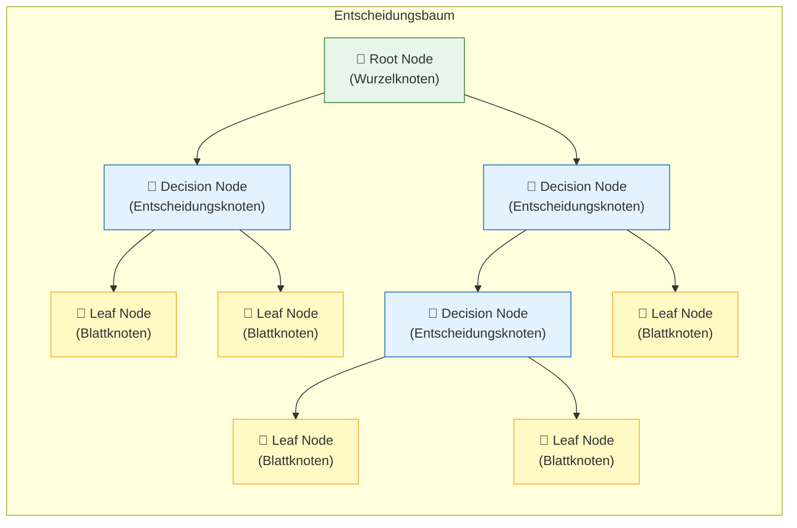
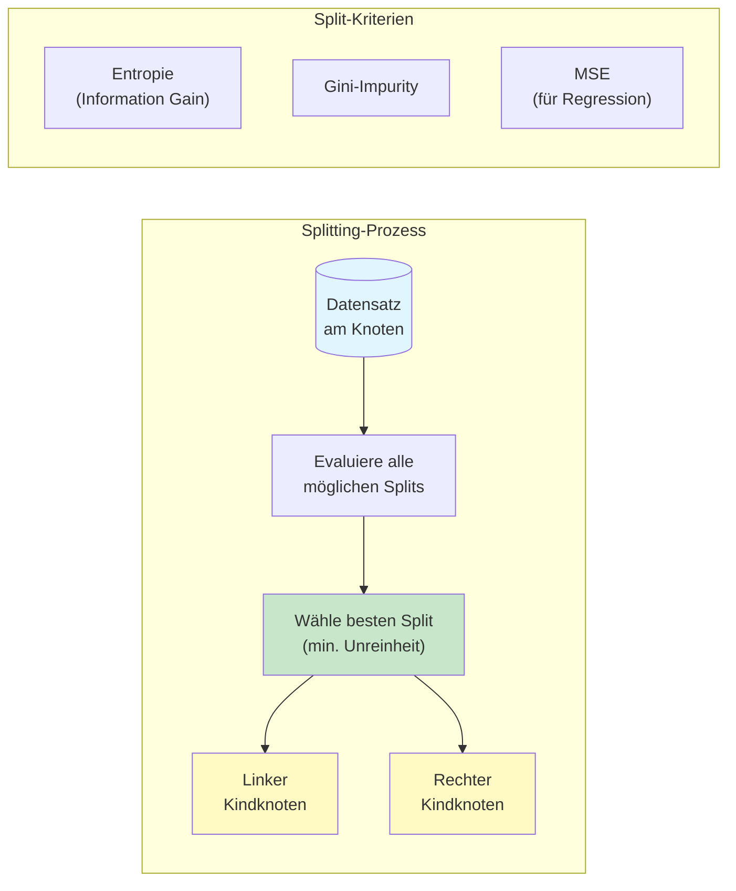
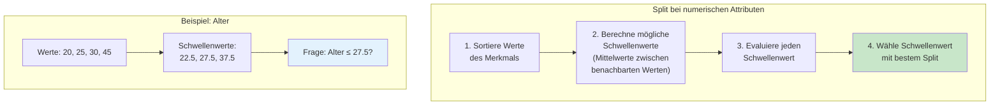
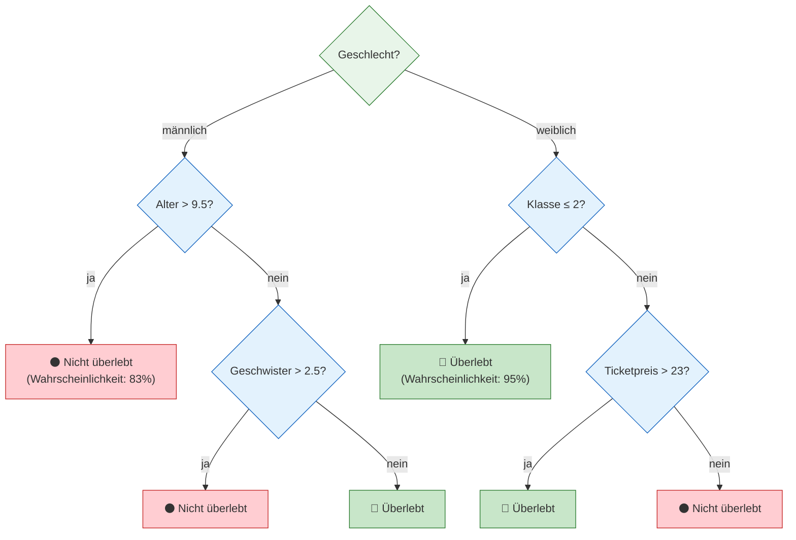
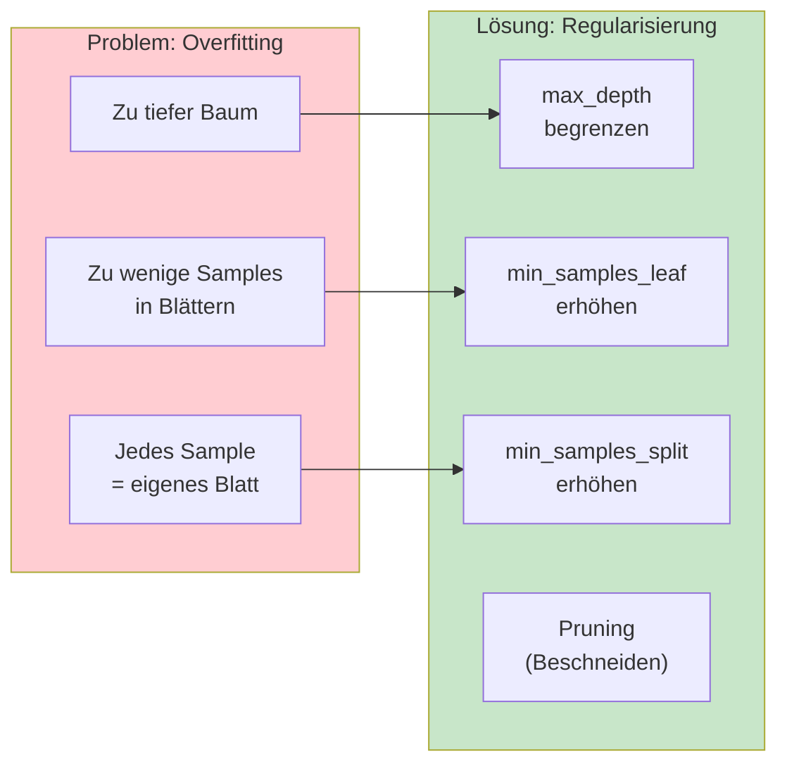
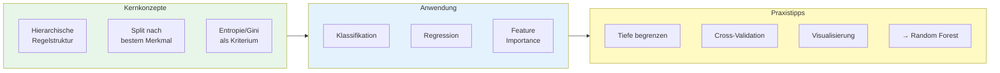

# Entscheidungsbaum (Decision Tree)
{: .no_toc }

> **Hierarchische Regelstruktur für ML-Modelle**
> Interpretierbare Entscheidungslogik für Klassifikation und Regression

---

# Inhaltsverzeichnis
{: .no_toc .text-delta }

1. TOC
{:toc}

---

## Überblick

Der Entscheidungsbaum ist ein fundamentaler Lernalgorithmus im überwachten maschinellen Lernen. Er eignet sich sowohl für **Klassifizierungs-** als auch für **Regressionsaufgaben** und zeichnet sich durch seine intuitive Interpretierbarkeit aus.

Das Grundprinzip: Aus dem Trainingsdatensatz wird eine hierarchische Struktur von Regeln abgeleitet. Ausgehend von der Wurzel werden regelbasierte Verzweigungen durchgeführt, bis eine Entscheidung (Vorhersage) getroffen werden kann.


```mermaid
flowchart LR
    subgraph struktur["Entscheidungsbaum"]
        R["🌳 Root Node<br/>(Wurzelknoten)"]
        R --> D1["🔀 Decision Node<br/>(Entscheidungsknoten)"]
        R --> D2["🔀 Decision Node<br/>(Entscheidungsknoten)"]
        D1 --> L1["🍃 Leaf Node<br/>(Blattknoten)"]
        D1 --> L2["🍃 Leaf Node<br/>(Blattknoten)"]
        D2 --> D3["🔀 Decision Node<br/>(Entscheidungsknoten)"]
        D2 --> L3["🍃 Leaf Node<br/>(Blattknoten)"]
        D3 --> L4["🍃 Leaf Node<br/>(Blattknoten)"]
        D3 --> L5["🍃 Leaf Node<br/>(Blattknoten)"]
    end
    
    style R fill:#e8f5e9,stroke:#2e7d32
    style D1 fill:#e3f2fd,stroke:#1565c0
    style D2 fill:#e3f2fd,stroke:#1565c0
    style D3 fill:#e3f2fd,stroke:#1565c0
    style L1 fill:#fff9c4,stroke:#f9a825
    style L2 fill:#fff9c4,stroke:#f9a825
    style L3 fill:#fff9c4,stroke:#f9a825
    style L4 fill:#fff9c4,stroke:#f9a825
    style L5 fill:#fff9c4,stroke:#f9a825
```

## Komponenten des Entscheidungsbaums

| Komponente                              | Beschreibung                                           | Funktion                                       |
| --------------------------------------- | ------------------------------------------------------ | ---------------------------------------------- |
| **Root Node** (Wurzelknoten)            | Oberster Knoten des Baums                              | Erste Aufteilung des gesamten Datensatzes      |
| **Decision Node** (Entscheidungsknoten) | Innere Knoten mit Verzweigungen/<br>Entscheidungsregel | Weitere Aufteilung basierend auf Merkmalen     |
| **Leaf Node** (Blattknoten)             | Endknoten ohne Verzweigungen                           | Enthält die finale Vorhersage                  |
| **Subtree** (Teilbaum)                  | Unterbaum ab einem Knoten                              | Kann als eigenständiger Baum betrachtet werden |

## Das Splitting-Prinzip

Bei jedem Knoten wird das Merkmal ausgewählt, das zur **bestmöglichen Aufteilung** führt. Diese wird anhand von Kriterien wie **Entropie** oder **Gini-Impurity** ermittelt.


```mermaid
flowchart LR
    subgraph prozess["Splitting-Prozess"]
        D[("Datensatz<br/>am Knoten")]
        D --> E["Evaluiere alle<br/>möglichen Splits"]
        E --> B["Wähle besten Split<br/>(min. Unreinheit)"]
        B --> L["Linker<br/>Kindknoten"]
        B --> R["Rechter<br/>Kindknoten"]
    end
    
    subgraph kriterien["Split-Kriterien"]
        K1["Entropie<br/>(Information Gain)"]
        K2["Gini-Impurity"]
        K3["MSE<br/>(für Regression)"]
    end
    
    style D fill:#e1f5fe
    style B fill:#c8e6c9
    style L fill:#fff9c4
    style R fill:#fff9c4
```

### Entropie und Information Gain

Die **Entropie** ist ein Maß für die Unsicherheit, Zufälligkeit oder Unordnung in den Daten:

- **Entropie = 0**: Alle Datenpunkte gehören zur selben Klasse (**perfekte** Ordnung)
- **Entropie = 1** (bei 2 Klassen): Gleichverteilung der Klassen (**maximale** Unordnung)

Der **Information Gain** misst, wie viel Entropie durch einen Split reduziert wird. Je **höher** der Information Gain, desto besser der Split.

### Gini-Impurity

Die **Gini-Impurity** ist ein alternatives Maß für die Unreinheit eines Knotens:

- **Gini = 0**: Alle Datenpunkte gehören zur selben Klasse
- **Gini = 0.5** (bei 2 Klassen): Gleichverteilung der Klassen

## Splitting bei numerischen Attributen

Bei numerischen Merkmalen muss der optimale Schwellenwert für die Aufteilung gefunden werden:


```mermaid
flowchart TB
    subgraph numerisch["Split bei numerischen Attributen"]
        S1["1. Sortiere Werte<br/>des Merkmals"]
        S2["2. Berechne mögliche<br/>Schwellenwerte<br/>(Mittelwerte zwischen<br/>benachbarten Werten)"]
        S3["3. Evaluiere jeden<br/>Schwellenwert"]
        S4["4. Wähle Schwellenwert<br/>mit bestem Split"]
        
        S1 --> S2 --> S3 --> S4
    end
    
    subgraph beispiel["Beispiel: Alter"]
        W["Werte: 20, 25, 30, 45"]
        T["Schwellenwerte:<br/>22.5, 27.5, 37.5"]
        F["Frage: Alter ≤ 27.5?"]
        
        W --> T --> F
    end
    
    style S4 fill:#c8e6c9
    style F fill:#e3f2fd
```

**Vorgehensweise:**
1. Die Werte des numerischen Merkmals werden sortiert
2. Zwischen jedem Paar benachbarter Werte wird ein potenzieller Schwellenwert berechnet
3. Für jeden Schwellenwert wird der Information Gain (oder Gini-Reduktion) berechnet
4. Der Schwellenwert mit dem höchsten Gain wird gewählt

## Beispiel: Titanic-Datensatz

Ein klassisches Beispiel für einen Entscheidungsbaum ist die Vorhersage der Überlebenschance auf der Titanic:


```mermaid
flowchart TB
    R{"Geschlecht?"}
    R -->|männlich| M{"Alter > 9.5?"}
    R -->|weiblich| F{"Klasse ≤ 2?"}
    
    M -->|ja| M1["⚫ Nicht überlebt<br/>(Wahrscheinlichkeit: 83%)"]
    M -->|nein| M2{"Geschwister > 2.5?"}
    
    M2 -->|ja| M2A["⚫ Nicht überlebt"]
    M2 -->|nein| M2B["🔵 Überlebt"]
    
    F -->|ja| F1["🔵 Überlebt<br/>(Wahrscheinlichkeit: 95%)"]
    F -->|nein| F2{"Ticketpreis > 23?"}
    
    F2 -->|ja| F2A["🔵 Überlebt"]
    F2 -->|nein| F2B["⚫ Nicht überlebt"]
    
    style R fill:#e8f5e9,stroke:#2e7d32
    style M fill:#e3f2fd,stroke:#1565c0
    style F fill:#e3f2fd,stroke:#1565c0
    style M2 fill:#e3f2fd,stroke:#1565c0
    style F2 fill:#e3f2fd,stroke:#1565c0
    style M1 fill:#ffcdd2,stroke:#c62828
    style M2A fill:#ffcdd2,stroke:#c62828
    style F2B fill:#ffcdd2,stroke:#c62828
    style M2B fill:#c8e6c9,stroke:#2e7d32
    style F1 fill:#c8e6c9,stroke:#2e7d32
    style F2A fill:#c8e6c9,stroke:#2e7d32
```

**Interpretation:**
- Der wichtigste Faktor ist das Geschlecht (Root Node)
- Bei Männern ist das Alter entscheidend
- Bei Frauen spielt die Reiseklasse eine große Rolle
- Jeder Pfad durch den Baum repräsentiert eine Regel


## Wichtige Hyperparameter

| Parameter | Beschreibung | Typische Werte |
|-----------|--------------|----------------|
| `criterion` | Split-Kriterium | `'gini'`, `'entropy'` (Klassifikation), `'squared_error'` (Regression) |
| `max_depth` | Maximale Baumtiefe | 3-20, oder `None` für unbegrenzt |
| `min_samples_split` | Mindestanzahl für einen Split | 2-20 |
| `min_samples_leaf` | Mindestanzahl in Blattknoten | 1-10 |
| `max_features` | Anzahl der Features pro Split | `'sqrt'`, `'log2'`, oder Anzahl |

### Hyperparameter zur Vermeidung von Overfitting


```mermaid
flowchart LR
    subgraph problem["Problem: Overfitting"]
        O1["Zu tiefer Baum"]
        O2["Zu wenige Samples<br/>in Blättern"]
        O3["Jedes Sample<br/>= eigenes Blatt"]
    end
    
    subgraph loesung["Lösung: Regularisierung"]
        L1["max_depth<br/>begrenzen"]
        L2["min_samples_leaf<br/>erhöhen"]
        L3["min_samples_split<br/>erhöhen"]
        L4["Pruning<br/>(Beschneiden)"]
    end
    
    O1 --> L1
    O2 --> L2
    O3 --> L3
    
    style problem fill:#ffcdd2
    style loesung fill:#c8e6c9
```

## Feature Importance

Entscheidungsbäume liefern automatisch eine Bewertung der Feature-Wichtigkeit:

```python
import pandas as pd
import matplotlib.pyplot as plt

# Feature Importance extrahieren
importance = pd.DataFrame({
    'Feature': data.columns,
    'Importance': model.feature_importances_
}).sort_values('Importance', ascending=False)

# Visualisierung
plt.figure(figsize=(10, 6))
plt.barh(importance['Feature'], importance['Importance'])
plt.xlabel('Importance')
plt.title('Feature Importance des Entscheidungsbaums')
plt.gca().invert_yaxis()
plt.tight_layout()
plt.show()
```

## Vor- und Nachteile

### Vorteile ✅

- **Interpretierbarkeit**: Entscheidungsregeln sind leicht verständlich
- **Keine Skalierung nötig**: Funktioniert mit verschiedenen Wertebereichen
- **Gemischte Datentypen**: Kann numerische und kategoriale Features verarbeiten
- **Feature Selection**: Automatische Auswahl relevanter Features
- **Schnelles Training**: Effizient auch bei größeren Datensätzen

### Nachteile ❌

- **Overfitting-Tendenz**: Tiefe Bäume neigen zur Überanpassung
- **Instabilität**: Kleine Datenänderungen können zu völlig anderen Bäumen führen
- **Bias bei unausgewogenen Klassen**: Dominante Klassen werden bevorzugt
- **Lineare Grenzen**: Kann keine diagonalen Entscheidungsgrenzen modellieren
- **Einzelner Baum oft unzureichend**: → Ensemble-Methoden (Random Forest) bevorzugt


## Best Practices

### Dos ✅

- **Hyperparameter begrenzen** um Overfitting zu vermeiden (`max_depth`, `min_samples_leaf`)
- **Cross-Validation nutzen** für robuste Hyperparameter-Wahl
- **Feature Importance analysieren** um das Modell zu verstehen
- **Baum visualisieren** zur Kommunikation mit Stakeholdern
- **Für Produktion Random Forest nutzen** statt einzelnem Baum

### Don'ts ❌

- **Unbegrenztes Wachstum** ohne `max_depth` erlauben
- **Zu komplexe Bäume** erstellen (schwer interpretierbar)
- **Nur auf Training-Accuracy** achten (Overfitting-Gefahr)
- **Kategoriale Features mit vielen Kategorien** ohne Encoding verwenden

## Zusammenfassung


```mermaid
flowchart LR
    subgraph konzept["Kernkonzepte"]
        K1["Hierarchische<br/>Regelstruktur"]
        K2["Split nach<br/>bestem Merkmal"]
        K3["Entropie/Gini<br/>als Kriterium"]
    end
    
    subgraph anwendung["Anwendung"]
        A1["Klassifikation"]
        A2["Regression"]
        A3["Feature<br/>Importance"]
    end
    
    subgraph praxis["Praxistipps"]
        P1["Tiefe begrenzen"]
        P2["Cross-Validation"]
        P3["Visualisierung"]
        P4["→ Random Forest"]
    end
    
    konzept --> anwendung --> praxis
    
    style konzept fill:#e8f5e9
    style anwendung fill:#e3f2fd
    style praxis fill:#fff9c4
```

Der Entscheidungsbaum ist ein grundlegender Algorithmus, der das Fundament für fortgeschrittene Ensemble-Methoden wie Random Forest und Gradient Boosting bildet. Seine Stärke liegt in der Interpretierbarkeit – die Entscheidungslogik kann als Regelsystem visualisiert und kommuniziert werden.
## Abgrenzung zu verwandten Themen

| Thema | Abgrenzung |
|-------|------------|
| [Random Forest](./random-forest.html) | Decision Tree ist der Basis-Algorithmus; Random Forest kombiniert viele Baeume zu einem robusteren Ensemble |
| [Ensemble-Methoden](./ensemble.html) | Ensemble-Methoden beschreiben Kombinationsstrategien; Decision Tree ist die grundlegende Komponente dieser Verfahren |
| [Modellauswahl](./modellauswahl.html) | Modellauswahl entscheidet, wann ein Decision Tree sinnvoll ist — z.B. bei Interpretierbarkeitsanforderungen |


---


**Version:** 1.0<br>
**Stand:** Januar 2026<br>
**Kurs:** Machine Learning. Verstehen. Anwenden. Gestalten.