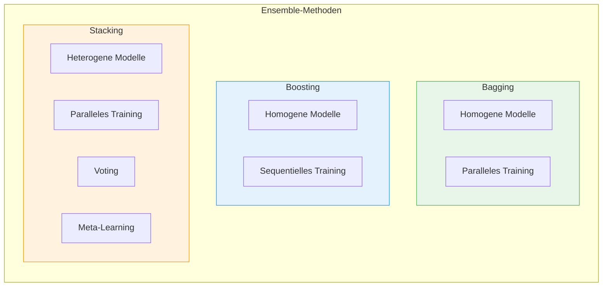
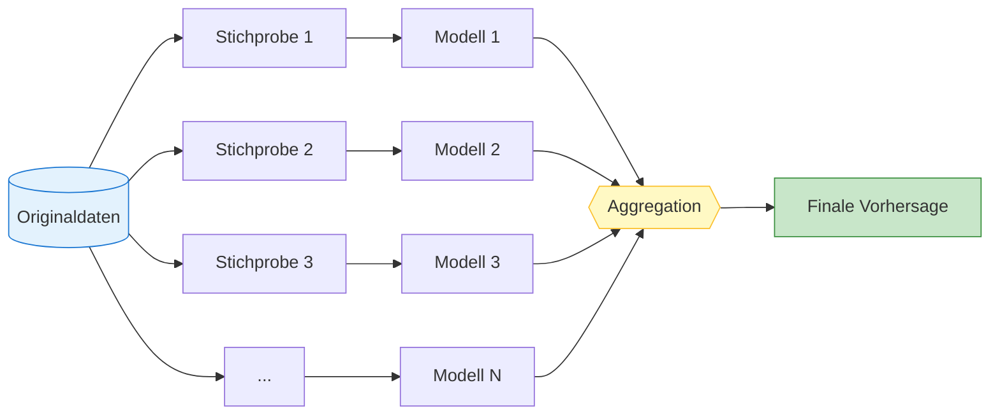
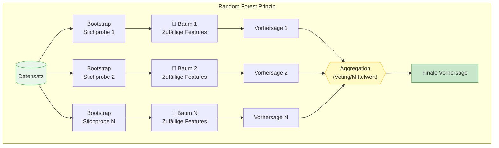
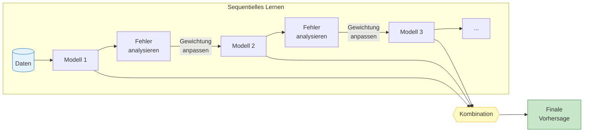
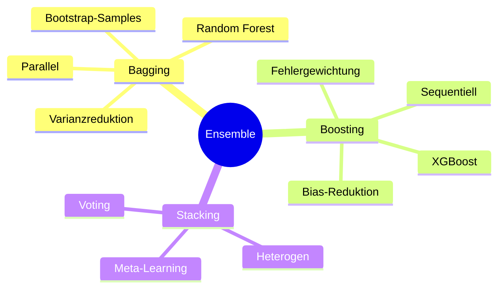

# Ensemble-Methoden
{: .no_toc }

> **Ensemble-Learning kombiniert mehrere Machine-Learning-Modelle, um bessere Vorhersagen zu erzielen als einzelne Modelle.**
> Die wichtigsten Strategien sind Bagging (parallele, homogene Modelle), Boosting (sequentielle, homogene Modelle) und Stacking (parallele, heterogene Modelle).

---

# Inhaltsverzeichnis
{: .no_toc .text-delta }

1. TOC
{:toc}

---

## Übersicht der Ensemble-Strategien

Ensemble-Methoden nutzen die "Weisheit der Vielen" – die Kombination mehrerer Modelle führt oft zu besseren und robusteren Ergebnissen als jedes einzelne Modell.

| Strategie | Modelltyp | Training | Beispiele |
|-----------|-----------|----------|-----------|
| **Bagging** | Homogen | Parallel | Random Forest |
| **Boosting** | Homogen | Sequentiell | XGBoost, AdaBoost |
| **Stacking** | Heterogen | Parallel | Voting, Meta-Learning |

---

## Bagging (Bootstrap Aggregating)

Beim **Bagging** werden mehrere gleichartige Modelle parallel trainiert und deren Vorhersagen kombiniert. Der Name steht für "Bootstrap Aggregating".

### Funktionsweise

**Die drei Schritte des Bagging:**

1. **Bootstrap-Sampling:** Es werden zufällige Stichproben aus den Daten gezogen (mit Zurücklegen)
2. **Paralleles Training:** Jedes Modell wird unabhängig auf seiner Stichprobe trainiert
3. **Aggregation:** Die Vorhersagen werden kombiniert:
   - **Klassifikation:** Mehrheitsentscheidung (Voting)
   - **Regression:** Mittelwert oder Median

> **Vorteile**
>
> - Reduziert Overfitting durch Varianzreduktion
> - Modelle können parallel trainiert werden
> - Robust gegenüber Ausreißern in einzelnen Stichproben

---

## Random Forest

**Random Forest** ist die bekannteste Bagging-Methode und besteht aus einem Ensemble von Entscheidungsbäumen.

### Besonderheiten

Random Forest erweitert das klassische Bagging um eine zusätzliche Zufallskomponente:

**Was Random Forest "zufällig" macht:**

| Komponente | Zufälligkeit |
|------------|--------------|
| **Datensätze** | Jeder Baum erhält eine andere Bootstrap-Stichprobe |
| **Features** | An jedem Knoten wird nur eine zufällige Teilmenge der Features für den Split betrachtet |
| **Splits** | Die Auswahl des besten Splits erfolgt nur aus den zufällig gewählten Features |

### Vorteile von Random Forest

- Kann sowohl für **Klassifikation** als auch **Regression** verwendet werden
- Funktioniert mit **kategorialen und numerischen** Features
- Liefert automatisch **Feature Importance**
- Robust gegenüber **Overfitting**
- Benötigt wenig **Hyperparameter-Tuning**

---

## Boosting

Beim **Boosting** werden Modelle sequentiell trainiert, wobei jedes neue Modell versucht, die Fehler der vorherigen Modelle zu korrigieren.

### Funktionsweise

**Das Boosting-Prinzip:**

1. **Erstes Modell** macht erste Vorhersagen (oft noch ungenau)
2. **Fehleranalyse:** Falsch klassifizierte Datenpunkte werden identifiziert
3. **Gewichtung:** Schwer zu klassifizierende Muster erhalten höhere Gewichte
4. **Nächstes Modell** fokussiert sich auf die schwierigen Fälle
5. **Finale Vorhersage** kombiniert alle Modellbeiträge

> **Kernidee**
>
> Muster, die noch nicht gut klassifiziert werden, bekommen im nächsten Durchlauf ein **höheres Gewicht**. Bereits erkannte Muster bekommen ein **geringeres Gewicht**. So spezialisiert sich jedes neue Modell auf die verbleibenden Fehler.

### Vergleich: Bagging vs. Boosting

| Aspekt | Bagging | Boosting |
|--------|---------|----------|
| **Training** | Parallel | Sequentiell |
| **Fokus** | Varianzreduktion | Bias-Reduktion |
| **Fehlerbehandlung** | Gleichmäßig | Gewichtet (schwierige Fälle) |
| **Overfitting-Risiko** | Geringer | Höher (aber kontrollierbar) |
| **Rechenzeit** | Parallelisierbar | Nicht parallelisierbar |

---

## Weiterführende Ressourcen

| Ressource | Beschreibung |
|-----------|--------------|
| [KNIME Bagging & Boosting](https://www.knime.com/) | Visuelle Erklärung der Ensemble-Methoden |
| [StatQuest Random Forest](https://www.youtube.com/c/joshstarmer) | Video-Tutorial zu Random Forest |

---

## Zusammenfassung

**Die wichtigsten Erkenntnisse:**

- **Ensemble-Methoden** kombinieren mehrere Modelle für bessere Vorhersagen
- **Bagging** (z.B. Random Forest) reduziert Varianz durch parallele, unabhängige Modelle
- **Boosting** (z.B. XGBoost) reduziert Bias durch sequentielles Lernen aus Fehlern
- **Stacking** kombiniert verschiedenartige Modelle durch Voting oder Meta-Learning
- Die Wahl der Methode hängt vom Problem und den verfügbaren Ressourcen ab

---

**Version:** 1.0    
**Stand:** Januar 2026    
**Kurs:** Machine Learning. Verstehen. Anwenden. Gestalten.    
