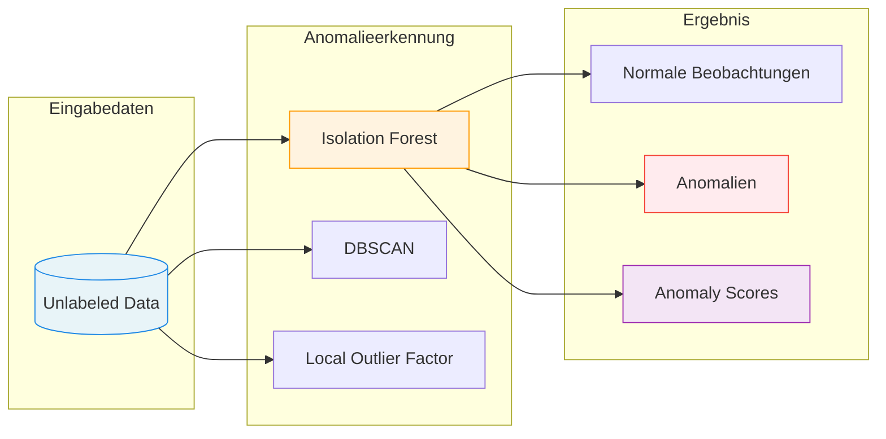
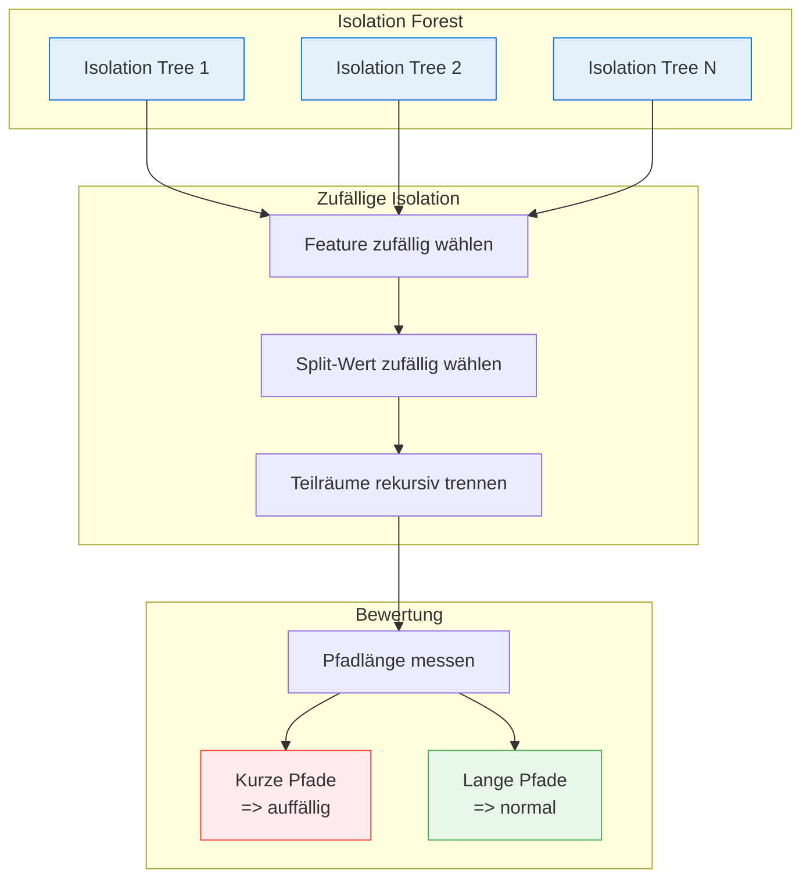
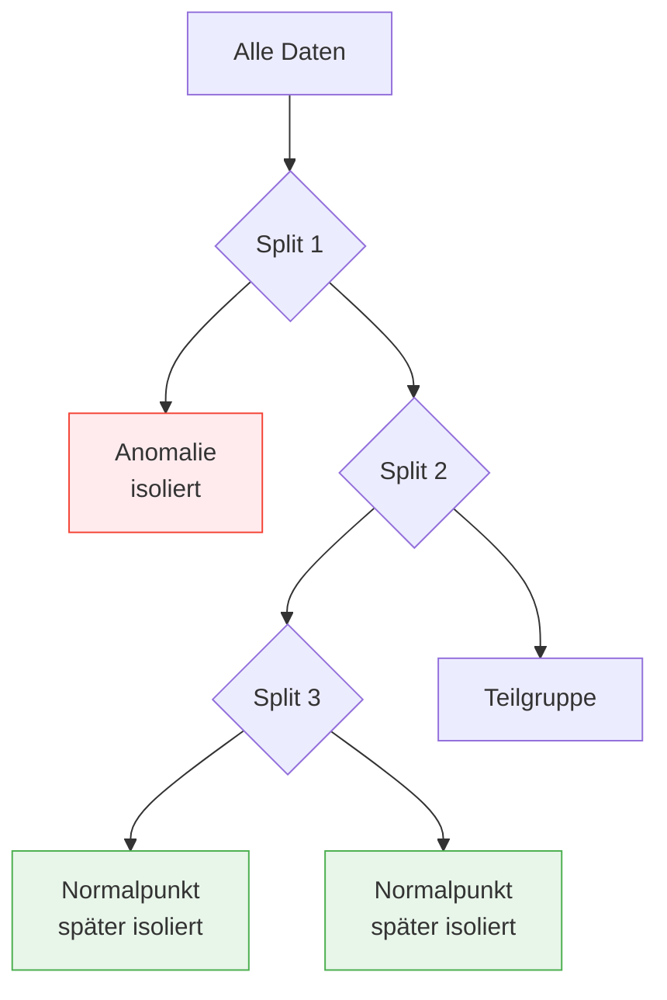
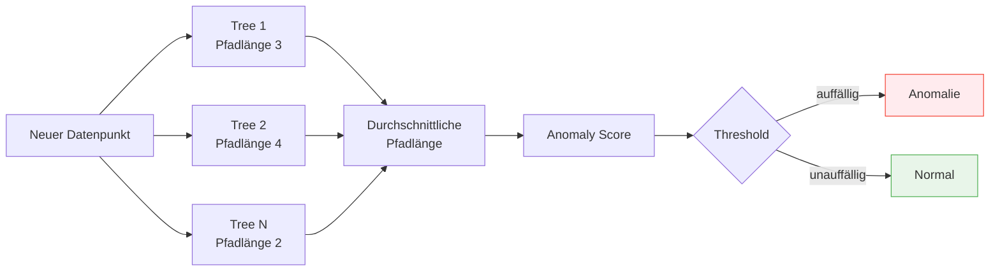
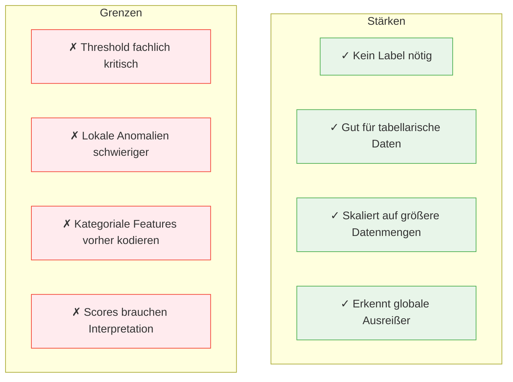

# Isolation Forest
{: .no_toc }

> **Isolation Forest erkennt Anomalien, indem ungewöhnliche Datenpunkte schneller isoliert werden als normale Beobachtungen.** 
> Das Verfahren ist besonders nützlich für tabellarische Daten, Betrugserkennung, Qualitätskontrolle und Monitoring-Szenarien ohne gelabelte Fehlerfälle.

---

## Inhaltsverzeichnis
{: .no_toc .text-delta }

1. TOC
{:toc}

---

## Einführung in Anomalieerkennung

Anomalieerkennung sucht Datenpunkte, die deutlich vom normalen Muster abweichen. Im Gegensatz zur klassischen Klassifikation liegen häufig keine verlässlichen Labels vor: Es ist bekannt, dass "ungewöhnliche Fälle" existieren können, aber nicht jeder Fall ist vorab als normal oder anomal markiert.

Typische Begriffe:

| Begriff | Bedeutung |
|---------|-----------|
| **Normalpunkt** | Beobachtung, die zum üblichen Datenmuster passt |
| **Anomalie / Outlier** | Beobachtung, die deutlich vom üblichen Muster abweicht |
| **Anomaly Score** | Kontinuierlicher Auffälligkeitswert eines Datenpunkts |
| **Threshold** | Schwellenwert, ab dem ein Punkt als Anomalie markiert wird |

---

## Grundprinzip

Isolation Forest basiert auf einer einfachen Idee: **Anomalien sind selten und andersartig**. Deshalb lassen sie sich durch zufällige Schnitte im Merkmalsraum meist mit wenigen Entscheidungen von den übrigen Daten trennen.

Normale Punkte liegen in dichteren Regionen. Um sie zu isolieren, braucht der Algorithmus typischerweise mehr zufällige Splits. Anomalien liegen dagegen eher am Rand oder in dünn besetzten Bereichen und werden schneller separiert.

---

## Isolation Trees

Ein Isolation Tree trennt Daten rekursiv durch zufällige Splits:

1. **Feature auswählen**: Wähle zufällig ein Merkmal.
2. **Split ziehen**: Wähle zufällig einen Wert zwischen Minimum und Maximum dieses Merkmals.
3. **Daten teilen**: Teile die Daten in zwei Teilmengen.
4. **Wiederholen**: Fahre fort, bis Punkte isoliert sind oder eine maximale Tiefe erreicht ist.

### Pfadlänge als Signal

Die zentrale Größe ist die **Pfadlänge**: Wie viele Splits sind nötig, bis ein Punkt isoliert wird?

| Pfadlänge | Interpretation |
|-----------|----------------|
| **Kurz** | Punkt wird schnell isoliert; wahrscheinlich anomal |
| **Mittel** | Punkt liegt in einer weniger klaren Randregion |
| **Lang** | Punkt liegt in dichter Normalregion |

> **Merksatz:** Isolation Forest lernt nicht "wie normal aussieht" im Sinne einer dichten Modellierung. Er misst, wie leicht ein Punkt von anderen getrennt werden kann.

---

## Algorithmus-Ablauf

### Training

Beim Training wird ein Ensemble vieler Isolation Trees aufgebaut.

| Schritt | Beschreibung |
|---------|--------------|
| **Subsampling** | Ziehe pro Baum eine Stichprobe aus den Trainingsdaten |
| **Zufällige Splits** | Erzeuge rekursive Feature-Splits ohne Zielvariable |
| **Baum-Ensemble** | Wiederhole den Prozess für viele Bäume |
| **Pfadlängen speichern** | Nutze durchschnittliche Pfadlängen als Grundlage für Scores |

### Scoring

Für neue Datenpunkte berechnet Isolation Forest einen Score aus der durchschnittlichen Pfadlänge über alle Bäume.

---

## Wichtige Hyperparameter

| Hyperparameter | Bedeutung | Praxis-Hinweis |
|----------------|-----------|----------------|
| `n_estimators` | Anzahl der Isolation Trees | Mehr Bäume stabilisieren Scores, erhöhen aber Rechenzeit |
| `max_samples` | Stichprobengröße pro Baum | Oft `auto` oder ein begrenzter Wert für schnelle, robuste Bäume |
| `contamination` | Erwarteter Anteil der Anomalien | Wichtig für die Entscheidungsschwelle |
| `max_features` | Anteil der Features pro Baum | Kann bei vielen Features helfen |
| `bootstrap` | Ziehen mit Zurücklegen | Selten nötig, kann Varianz beeinflussen |
| `random_state` | Reproduzierbarkeit | Für Kursbeispiele und Vergleiche setzen |

### Contamination richtig verstehen

`contamination` ist keine gelernte Wahrheit, sondern eine **Annahme über den erwarteten Anteil auffälliger Fälle**. Dieser Wert verschiebt den Schwellenwert:

| Einstellung | Wirkung |
|-------------|---------|
| **Zu niedrig** | Zu wenige Punkte werden als Anomalien markiert |
| **Zu hoch** | Viele Randfälle werden fälschlich als Anomalien markiert |
| **Fachlich begründet** | Ergebnis passt besser zur realistischen Fehlerquote |

---

## Stärken und Grenzen

### Typische Einsatzfälle

| Einsatzfall | Warum Isolation Forest passt |
|-------------|------------------------------|
| **Betrugserkennung** | Verdächtige Transaktionen sind selten und oft strukturell anders |
| **Qualitätskontrolle** | Fehlerhafte Produkte weichen von typischen Messmustern ab |
| **IT-Monitoring** | Ungewöhnliche Last-, Latenz- oder Zugriffsmuster fallen auf |
| **Datenbereinigung** | Extreme Fälle vor Modelltraining markieren und prüfen |

---

## Vergleich mit verwandten Verfahren

| Kriterium | Isolation Forest | DBSCAN | Local Outlier Factor | One-Class SVM |
|-----------|------------------|--------|----------------------|---------------|
| **Grundidee** | Punkte durch zufällige Splits isolieren | Dichtebasierte Cluster und Noise | Lokale Dichteabweichung | Grenze um Normaldaten lernen |
| **Skalierung nötig** | Empfohlen, aber weniger strikt als bei Distanzverfahren | Ja | Ja | Ja |
| **Gut bei großen Daten** | Ja | Mittel | Mittel | Eher schwierig |
| **Lokale Anomalien** | Mittel | Mittel | Gut | Mittel |
| **Interpretation** | Pfadlänge und Score | Noise-Punkte | Lokaler Dichtefaktor | Abstand zur Entscheidungsgrenze |
| **Typischer Engpass** | Threshold/Contamination | `eps`-Wahl | Nachbarschaftsgröße | Kernel- und Parameterwahl |

---

## Bewertung und Validierung

Anomalieerkennung ist schwerer zu evaluieren als klassische Klassifikation, weil oft keine vollständigen Labels vorhanden sind. Deshalb wird in der Praxis eine Kombination aus quantitativer Prüfung, Visualisierung und fachlicher Kontrolle benötigt.

### Mögliche Bewertungsansätze

| Situation | Geeignete Bewertung |
|-----------|---------------------|
| **Gelabelte Anomalien vorhanden** | Precision, Recall, F1, ROC-AUC, PR-AUC |
| **Nur wenige bestätigte Fälle** | Top-k-Prüfung, fachliche Review der auffälligsten Scores |
| **Keine Labels** | Score-Verteilung, Stabilität über Stichproben, Plausibilitätsprüfung |
| **Monitoring** | Alarmrate, False-Positive-Rate, Drift über Zeit |

### Praktische Validierung

- Auffälligste Fälle manuell oder fachlich prüfen
- Score-Verteilung visualisieren
- Sensitivität gegenüber `contamination` testen
- Ergebnisse mit einfachen Regeln oder DBSCAN/LOF vergleichen
- Schwellenwert nicht nur technisch, sondern fachlich begründen

---

## Best Practices

### Checkliste für Isolation Forest

- [ ] Ziel klären: Datenbereinigung, Monitoring oder echte Anomalieerkennung?
- [ ] Fehlende Werte behandeln; scikit-learn erwartet numerische, vollständige Eingaben
- [ ] Kategoriale Features sinnvoll kodieren
- [ ] Numerische Features plausibilisieren und bei Bedarf skalieren
- [ ] `contamination` fachlich begründen oder mehrere Werte testen
- [ ] Scores und Top-Anomalien visualisieren
- [ ] Ergebnis nicht automatisch löschen, sondern zunächst markieren und prüfen

### Häufige Fehler vermeiden

| Fehler | Problem | Besser |
|--------|---------|--------|
| Anomalien sofort entfernen | Echte Extremfälle oder wichtige Signale gehen verloren | Erst markieren, analysieren und dokumentieren |
| `contamination` blind setzen | Schwellenwert erzeugt künstlich viele oder wenige Anomalien | Fachliche Erwartung und Sensitivität nutzen |
| Nur Score betrachten | Hoher Score erklärt nicht automatisch die Ursache | Fälle mit Feature-Werten und Kontext prüfen |
| Training mit bekannten Fehlerdaten | Das Normalmodell kann die Fehler als normal lernen | Wenn möglich auf sauberen Normaldaten trainieren |
| Zeitliche Struktur ignorieren | Zukunftsinformationen können in Training oder Threshold leaken | Zeitbasierte Splits und Monitoring-Fenster nutzen |

## Abgrenzung zu verwandten Dokumenten

| Thema | Abgrenzung |
|-------|------------|
| [Outlier](../prepare/outlier.html) | Outlier behandelt Datenqualitätsprüfung und Behandlungsstrategien; Isolation Forest ist ein konkretes ML-Verfahren zur Erkennung auffälliger Punkte |
| [K-Means und DBSCAN](./kmeans-dbscan.html) | DBSCAN erkennt Ausreißer als Noise im Rahmen von Clustering; Isolation Forest fokussiert direkt auf Anomalie-Scores |
| [Bewertung: Anomalieerkennung](../evaluate/bewertung_anomalie.html) | Bewertet `decision_function`, Anomaly Scores, Thresholds und Metriken für erkannte Auffälligkeiten |
| [Modellauswahl](./modellauswahl.html) | Modellauswahl entscheidet, wann Anomalieerkennung statt Klassifikation oder Clustering sinnvoll ist |
| [Prepare nach Modell](../prepare/prepare_nach_modell.html) | Zeigt, welche Vorverarbeitung Isolation Forest und andere Modelle benötigen |

---

**Version:** 1.0 
**Stand:** Mai 2026 
**Kurs:** Machine Learning. Verstehen. Anwenden. Gestalten.
