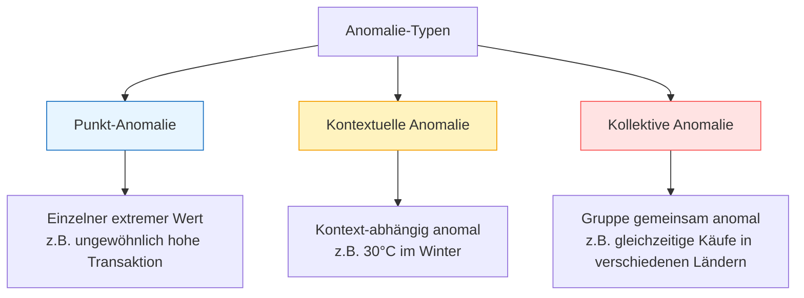
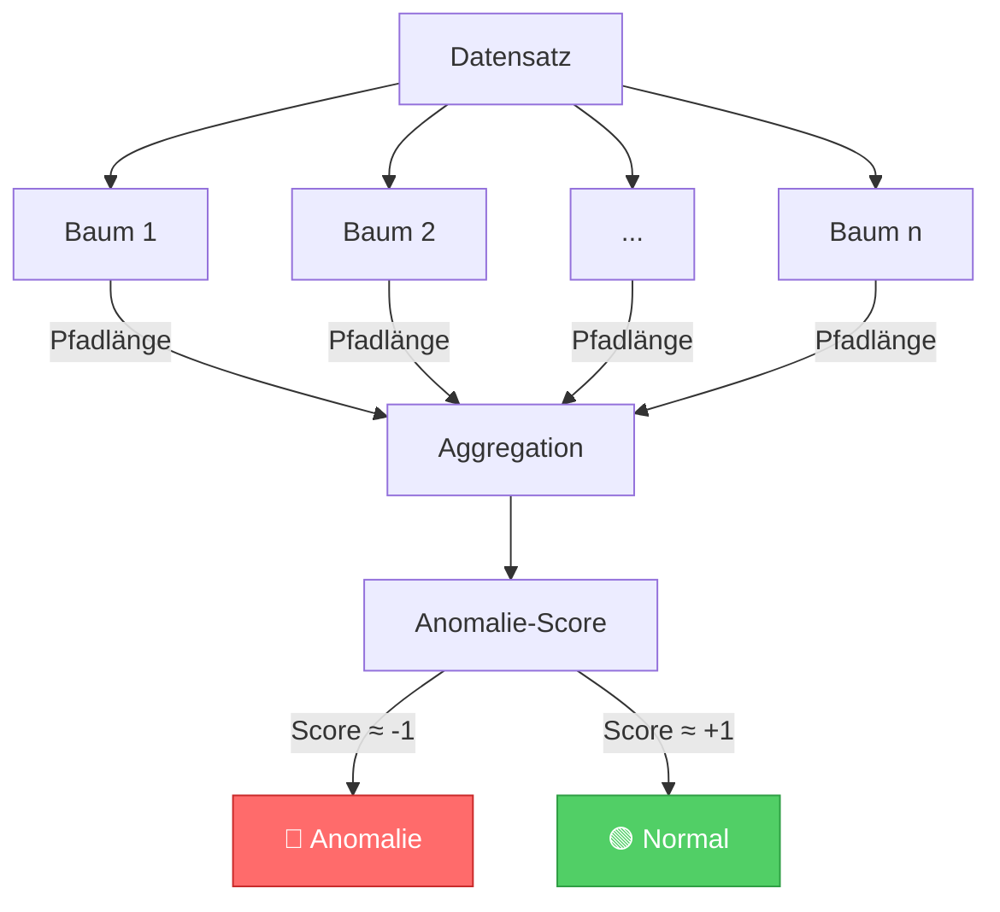
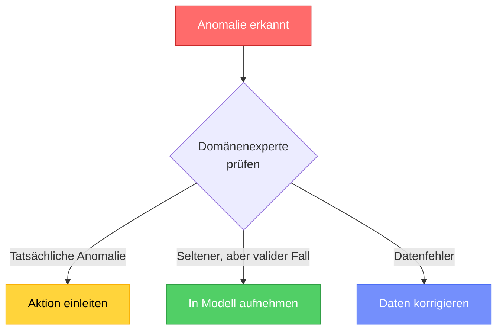

# Anomalie-Erkennung
{: .no_toc }

> **Anomalie-Erkennung identifiziert Datenpunkte, die signifikant vom erwarteten Muster abweichen. Der Anomalie-Score quantifiziert dabei, wie untypisch ein Datenpunkt im Vergleich zum Rest des Datensatzes ist.**

---

# Inhaltsverzeichnis
{: .no_toc .text-delta }

1. TOC
{:toc}

---

## Was ist Anomalie-Erkennung?

Anomalie-Erkennung ist ein Verfahren des unüberwachten Lernens, das Datensätze identifiziert, die für die gesamte Datenbasis untypisch sind. Anomalien – auch als Ausreißer oder Outliers bezeichnet – weichen signifikant vom normalen Verhalten ab.


---

## Anomalie-Typen

Anomalien lassen sich in drei grundlegende Kategorien einteilen:

### Punkt-/Globale Anomalien

Ein einzelner Datenpunkt, der in Bezug auf den gesamten Datensatz als anomal zu klassifizieren ist.

**Beispiel:** Eine einzelne Transaktion von 50.000 € bei einem Kunden mit durchschnittlichen Transaktionen von 100 €.

### Kontextuelle Anomalien

Ein Datenpunkt, der nur in einem bestimmten Kontext anomal erscheint.

**Beispiel:** Eine Außentemperatur von +30°C im Dezember in Deutschland ist anomal, im Juli jedoch normal.

### Kollektive Anomalien

Eine Menge verwandter Datenpunkte ist gemeinsam anomal, obwohl einzelne Punkte normal erscheinen können.

**Beispiel:** Kreditkartendaten zeigen Käufe in den USA und Frankreich zur gleichen Zeit – einzeln normal, zusammen verdächtig.



---
## Isolation Forest

Isolation Forest ist der am häufigsten verwendete Algorithmus zur Anomalie-Erkennung. Er basiert auf der Idee, dass Anomalien leichter zu isolieren sind als normale Datenpunkte.

### Funktionsweise

Der Algorithmus arbeitet mit einem Ensemble von Entscheidungsbäumen (ähnlich wie Random Forest):

1. **Zufällige Partitionierung:** Wähle zufällig ein Feature und einen Splitwert
2. **Rekursive Aufteilung:** Teile die Daten bis zur Isolation einzelner Punkte
3. **Pfadlänge messen:** Anomalien benötigen weniger Splits zur Isolation
4. **Score berechnen:** Durchschnittliche Pfadlänge über alle Bäume



### Grundannahmen

Der Isolation Forest basiert auf zwei zentralen Annahmen:

1. **Minderheitsklasse:** Anomalien sind im Vergleich zu normalen Daten selten
2. **Leichte Isolierbarkeit:** Anomalien haben ungewöhnliche Merkmalswerte und werden daher mit weniger Splits isoliert

---

## Praktische Implementierung

### Grundlegende Anwendung

```python
import numpy as np
import pandas as pd
from sklearn.ensemble import IsolationForest
import matplotlib.pyplot as plt

# Beispieldaten generieren
np.random.seed(42)
# Normale Daten: Cluster um (0, 0)
X_normal = np.random.randn(200, 2)
# Anomalien: verstreute Punkte
X_anomalies = np.random.uniform(low=-4, high=4, size=(20, 2))
X = np.vstack([X_normal, X_anomalies])

# Isolation Forest erstellen und trainieren
iso_forest = IsolationForest(
    n_estimators=100,      # Anzahl der Bäume
    contamination=0.1,     # Erwarteter Anteil Anomalien
    random_state=42
)

# Vorhersage: 1 = normal, -1 = Anomalie
predictions = iso_forest.fit_predict(X)

# Anomalie-Scores abrufen (negativ = anomaler)
scores = iso_forest.decision_function(X)

print(f"Erkannte Anomalien: {(predictions == -1).sum()}")
print(f"Score-Bereich: {scores.min():.3f} bis {scores.max():.3f}")
```

### Wichtige Hyperparameter

| Parameter | Beschreibung | Typische Werte |
|:----------|:-------------|:---------------|
| `n_estimators` | Anzahl der Bäume im Ensemble | 100-200 |
| `contamination` | Erwarteter Anteil Anomalien | 0.01-0.1 (1%-10%) |
| `max_samples` | Stichprobengröße pro Baum | 'auto' oder Anzahl |
| `max_features` | Features pro Baum | 1.0 (alle) |

### Visualisierung der Ergebnisse

```python
import matplotlib.pyplot as plt

# Visualisierung
fig, axes = plt.subplots(1, 2, figsize=(14, 5))

# Links: Klassifikation
colors = ['#51cf66' if p == 1 else '#ff6b6b' for p in predictions]
axes[0].scatter(X[:, 0], X[:, 1], c=colors, alpha=0.7, edgecolors='white')
axes[0].set_title('Anomalie-Erkennung')
axes[0].set_xlabel('Feature 1')
axes[0].set_ylabel('Feature 2')

# Legende hinzufügen
from matplotlib.patches import Patch
legend_elements = [
    Patch(facecolor='#51cf66', label='Normal'),
    Patch(facecolor='#ff6b6b', label='Anomalie')
]
axes[0].legend(handles=legend_elements)

# Rechts: Anomalie-Scores
scatter = axes[1].scatter(X[:, 0], X[:, 1], c=scores, cmap='RdYlGn', alpha=0.7)
axes[1].set_title('Anomalie-Scores')
axes[1].set_xlabel('Feature 1')
axes[1].set_ylabel('Feature 2')
plt.colorbar(scatter, ax=axes[1], label='Score (niedriger = anomaler)')

plt.tight_layout()
plt.show()
```


---

## Anwendungsgebiete

Die Anomalie-Erkennung findet in vielen Bereichen praktische Anwendung:

| Bereich | Anwendung | Beispiel |
|:--------|:----------|:---------|
| **Finanzen** | Betrugserkennung | Ungewöhnliche Kreditkartentransaktionen |
| **IT-Sicherheit** | Intrusion Detection | Anomale Netzwerkaktivitäten |
| **Produktion** | Qualitätskontrolle | Defekte Produkte erkennen |
| **Medizin** | Diagnose-Unterstützung | Ungewöhnliche Messwerte |
| **IoT** | Sensor-Überwachung | Fehlerhafte Sensordaten |

---

## Best Practices

### Empfehlungen für die Praxis

1. **Contamination schätzen:** Nutze Domänenwissen, um den erwarteten Anomalie-Anteil realistisch einzuschätzen

2. **Feature-Skalierung:** Standardisiere Features vor der Anwendung, besonders bei unterschiedlichen Wertebereichen

3. **Mehrere Algorithmen testen:** Vergleiche Isolation Forest mit anderen Methoden wie One-Class SVM oder Autoencoder

4. **Schwellenwert anpassen:** Der Standard-Schwellenwert ist nicht immer optimal – experimentiere mit verschiedenen Werten

5. **Ergebnisse validieren:** Lass Domänenexperten die erkannten Anomalien prüfen

### Häufige Fallstricke

> **Vorsicht vor Überinterpretation:** Nicht jede erkannte Anomalie ist problematisch. Manche "Anomalien" sind einfach seltene, aber valide Datenpunkte.



---

## Vergleich mit anderen Methoden

| Methode | Vorteile | Nachteile | Geeignet für |
|:--------|:---------|:----------|:-------------|
| **Isolation Forest** | Schnell, skalierbar, keine Annahmen über Verteilung | Schwer interpretierbar | Hochdimensionale Daten |
| **One-Class SVM** | Gut bei klarer Normalverteilung | Rechenintensiv bei großen Daten | Niedrigdimensionale Daten |
| **LOF** | Erkennt lokale Anomalien | Langsam bei großen Datensätzen | Dichte-basierte Anomalien |
| **Autoencoder** | Lernt komplexe Muster | Benötigt viele Daten, Tuning-aufwändig | Bild-/Sequenzdaten |

---

## Zusammenfassung

- **Anomalie-Erkennung** identifiziert untypische Datenpunkte im Vergleich zum Normalverhalten
- **Drei Anomalie-Typen:** Punkt-, kontextuelle und kollektive Anomalien
- **Anomalie-Score:** Quantifiziert die Abweichung (-1 = anomal, +1 = normal)
- **Isolation Forest:** Standard-Algorithmus basierend auf der leichten Isolierbarkeit von Anomalien
- **Wichtig:** Domänenwissen für Contamination-Parameter und Ergebnisvalidierung nutzen


---

**Version:** 1.0    
**Stand:** Januar 2026    
**Kurs:** Machine Learning. Verstehen. Anwenden. Gestalten.    