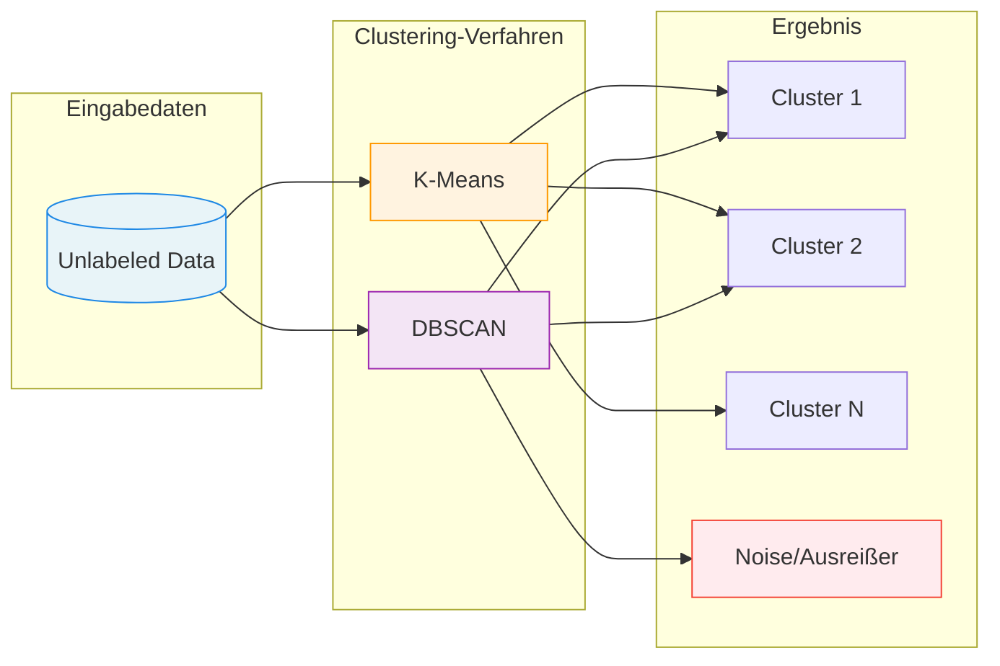
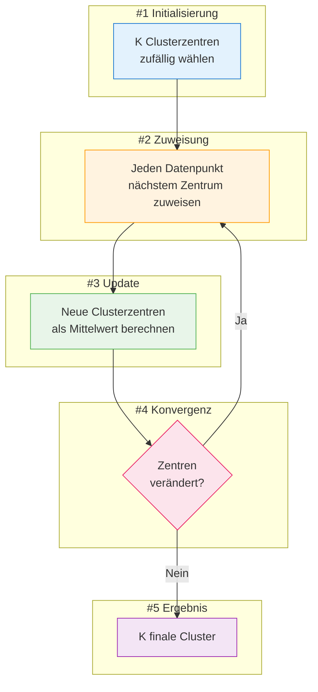
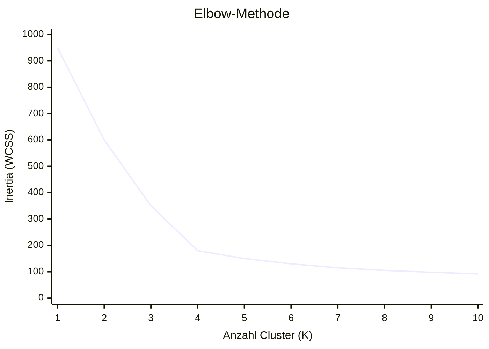
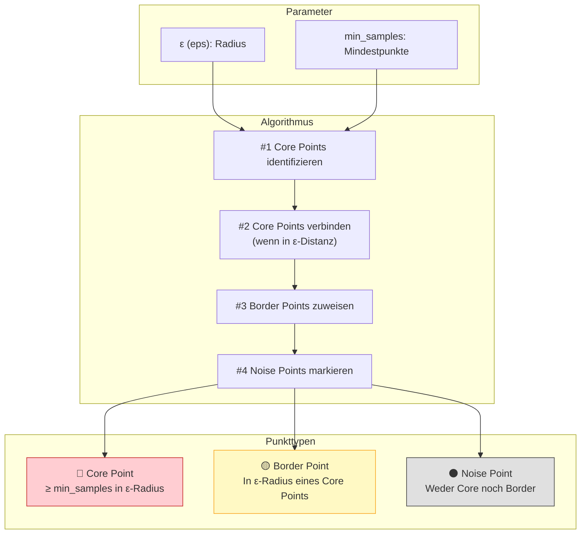
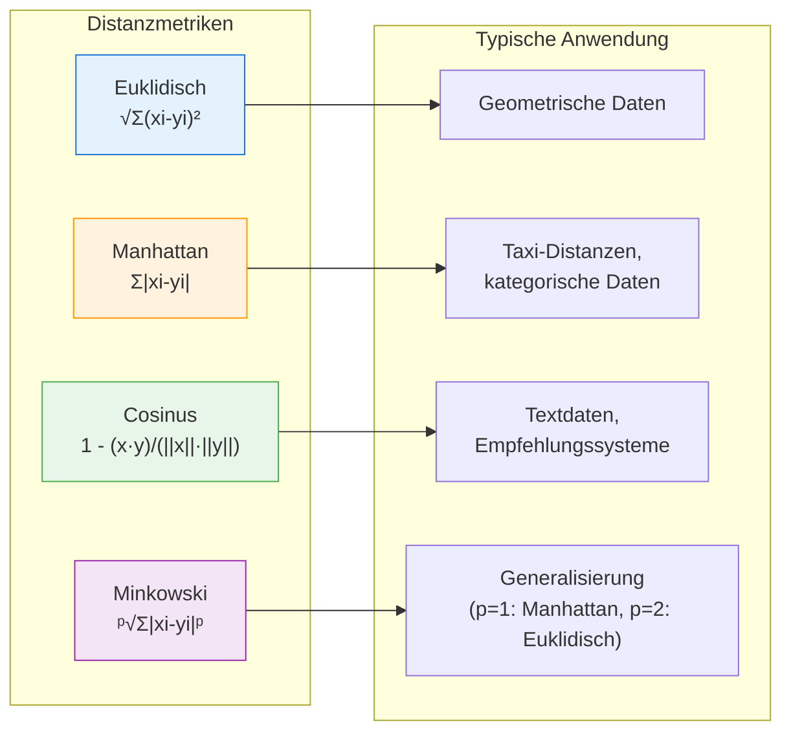
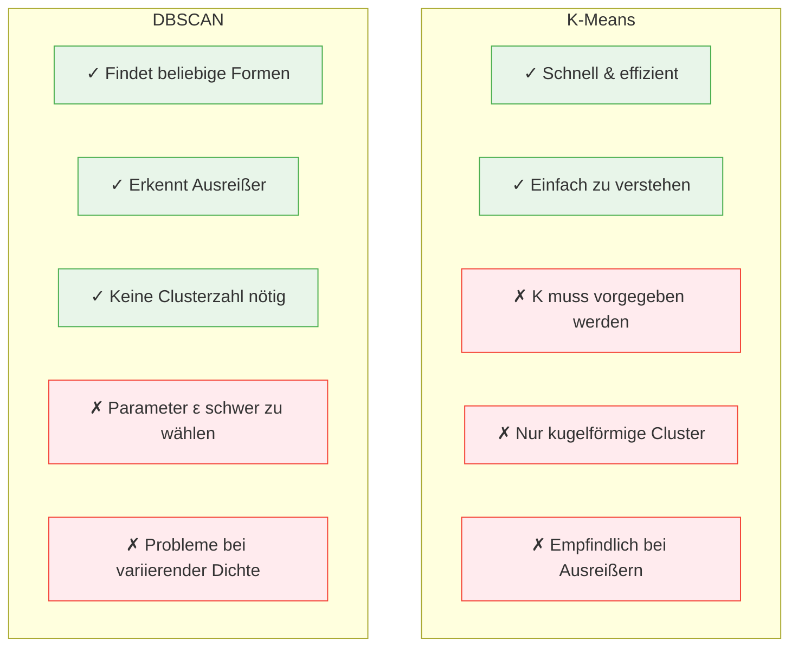

# Clustering: K-Means & DBSCAN
{: .no_toc }

> **Clustering-Verfahren entdecken verborgene Strukturen in Daten, indem sie ähnliche Datenpunkte zu Gruppen zusammenfassen.**    
>  K-Means eignet sich für kompakte, gleichmäßige Cluster, während DBSCAN beliebig geformte Cluster erkennt und Ausreißer identifiziert.

---

## Inhaltsverzeichnis
{: .no_toc .text-delta }

1. TOC
{:toc}

---

## Einführung in Clustering

Clustering bezeichnet Verfahren zur Entdeckung von Ähnlichkeitsstrukturen in Datenbeständen. Die gefundenen Gruppen ähnlicher Objekte werden als **Cluster** bezeichnet.

Im Gegensatz zum überwachten Lernen sind beim Clustering keine Labels vorhanden – der Algorithmus muss die Struktur selbst entdecken. Dies macht Clustering zu einem zentralen Werkzeug des **unüberwachten Lernens**.

---

## Clustering-Ansätze im Überblick

| Ansatz              | Methode              | Charakteristik                                                                   |
| ------------------- | -------------------- | -------------------------------------------------------------------------------- |
| **Partitionierend** | K-Means              | Teilt Daten in k vordefinierte Cluster; iterative Optimierung der Clusterzentren |
| **Dichtebasiert**   | DBSCAN               | Erkennt Cluster anhand der Datendichte; identifiziert Ausreißer automatisch      |

---

## K-Means Clustering

### Grundprinzip

K-Means ist ein **partitionierender** Clustering-Algorithmus, der einen Datensatz in **K verschiedene, nicht überlappende Cluster** aufteilt. Der Algorithmus gehört zu den am häufigsten verwendeten Techniken zur Gruppierung von Objekten, da er schnell die Zentren der Cluster findet.

### Algorithmus-Schritte

1. **Initialisierung**: Wähle K initiale Clusterzentren (zufällig oder mit K-Means++)
2. **Zuweisung**: Ordne jeden Datenpunkt dem nächsten Clusterzentrum zu
3. **Update**: Berechne neue Clusterzentren als Mittelwert aller zugewiesenen Punkte
4. **Iteration**: Wiederhole Schritte 2-3 bis Konvergenz (keine Änderung mehr)

### Eigenschaften von K-Means

| Eigenschaft      | Beschreibung                                                                |
| ---------------- | --------------------------------------------------------------------------- |
| **Clusterform**  | Bevorzugt kugelförmige, kompakte Cluster                                    |
| **Clustergröße** | Tendiert zu ähnlich großen Clustern                                         |
| **Varianz**      | Minimiert die Varianz innerhalb der Cluster                                 |

### Optimale Clusterzahl mit der Elbow-Methode

Die Wahl der richtigen Anzahl K ist entscheidend. Die **Elbow-Methode** hilft dabei, indem sie die Inertia (Within-Cluster Sum of Squares) für verschiedene K-Werte visualisiert.

> **Tipp:** Der "Ellbogen" im Plot zeigt die optimale Clusterzahl – dort, wo die Kurve abknickt und weitere Cluster nur noch geringe Verbesserungen bringen.

---

## DBSCAN Clustering

### Grundprinzip

**DBSCAN** (Density-Based Spatial Clustering of Applications with Noise) ist ein dichtebasierter Algorithmus, der Cluster als Regionen hoher Datendichte definiert, getrennt durch Gebiete niedriger Dichte.

Im Gegensatz zu K-Means benötigt DBSCAN keine Vorgabe der Clusterzahl und kann:
- **Beliebig geformte Cluster** erkennen
- **Rauschen (Noise)** automatisch identifizieren
- Mit **Ausreißern** umgehen

### Schlüsselkonzepte

| Konzept | Definition |
|---------|------------|
| **ε (epsilon)** | Der Radius, innerhalb dessen Nachbarn gesucht werden |
| **min_samples** | Minimale Anzahl Punkte für einen Core Point |
| **Core Point** | Punkt mit mindestens min_samples Nachbarn im ε-Radius |
| **Border Point** | Punkt im ε-Radius eines Core Points, aber selbst kein Core Point |
| **Noise Point** | Punkt, der weder Core noch Border Point ist (Ausreißer) |

### Algorithmus-Ablauf

1. **Core Points finden**: Alle Punkte mit ≥ min_samples Nachbarn im ε-Radius markieren
2. **Cluster bilden**: Verbundene Core Points gehören zum selben Cluster
3. **Border Points zuweisen**: Jedem erreichbaren Core Point-Cluster zuordnen
4. **Noise klassifizieren**: Übrige Punkte als Rauschen markieren

---

## Distanzmetriken

Die Wahl der Distanzmetrik beeinflusst das Clustering-Ergebnis erheblich. Beide Algorithmen können verschiedene Metriken verwenden.

### Übersicht gängiger Distanzmaße

### Vergleich der Distanzmetriken

| Metrik | Formel | Charakteristik | Anwendung |
|--------|--------|----------------|-----------|
| **Euklidisch** | √Σ(xᵢ-yᵢ)² | Direkte Luftlinie | Standard für kontinuierliche Daten |
| **Manhattan** | Σ\|xᵢ-yᵢ\| | Summe der Achsenabstände | Robuster bei Ausreißern |
| **Cosinus** | 1 - cos(θ) | Winkel zwischen Vektoren | Textähnlichkeit, Embeddings |
| **Minkowski** | (Σ\|xᵢ-yᵢ\|ᵖ)^(1/p) | Generalisierung | Parameter p anpassbar |

---

## K-Means vs. DBSCAN: Vergleich

### Entscheidungshilfe

| Kriterium | K-Means | DBSCAN |
|-----------|---------|--------|
| **Clusterzahl bekannt** | ✅ Ideal | ❌ Nicht nötig |
| **Kugelförmige Cluster** | ✅ Optimal | ⚠️ Möglich |
| **Beliebige Clusterformen** | ❌ Ungeeignet | ✅ Ideal |
| **Ausreißer im Datensatz** | ❌ Problematisch | ✅ Werden erkannt |
| **Große Datensätze** | ✅ Sehr schnell | ⚠️ Kann langsam sein |
| **Variierende Clusterdichte** | ⚠️ Problematisch | ❌ Problematisch |

---

---

## Best Practices

### Checkliste für erfolgreiches Clustering

- [ ] Daten auf fehlende Werte prüfen
- [ ] Features skalieren (StandardScaler oder MinMaxScaler)
- [ ] Bei K-Means: Optimales K mit Elbow-Methode bestimmen
- [ ] Bei DBSCAN: ε mit k-Distanz-Graph bestimmen
- [ ] Ergebnis mit Silhouette-Score evaluieren
- [ ] Cluster visualisieren und interpretieren

### Häufige Fehler vermeiden

| Fehler | Problem | Lösung |
|--------|---------|--------|
| Keine Skalierung | Unterschiedliche Feature-Skalen dominieren | StandardScaler verwenden |
| Falsches K | Over-/Underfitting | Elbow-Methode + Silhouette |
| ε zu klein/groß | Zu viele/wenige Cluster | k-Distanz-Graph analysieren |
| Nur ein Algorithmus | Suboptimale Ergebnisse | Beide Methoden vergleichen |

---

**Version:** 1.0    
**Stand:** Januar 2026    
**Kurs:** Machine Learning. Verstehen. Anwenden. Gestalten.    
