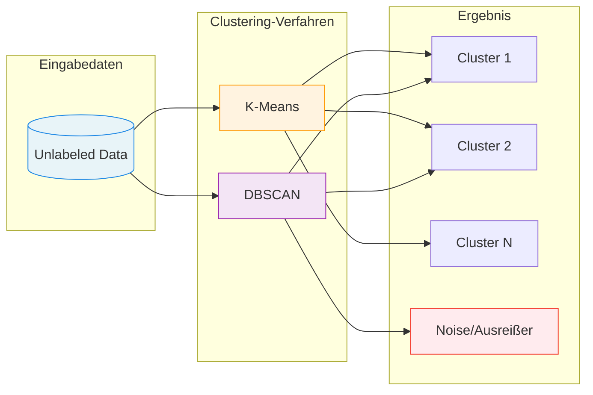
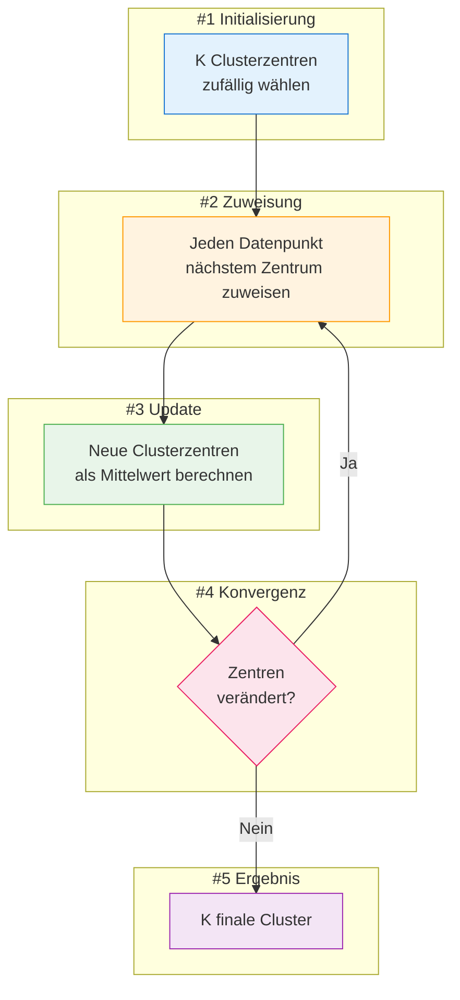
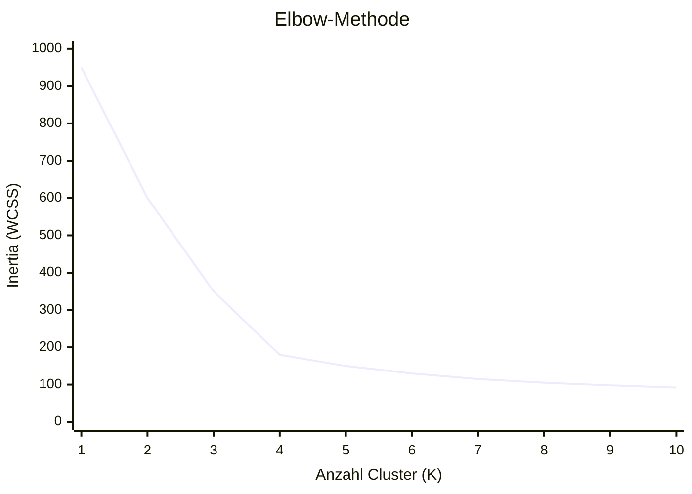
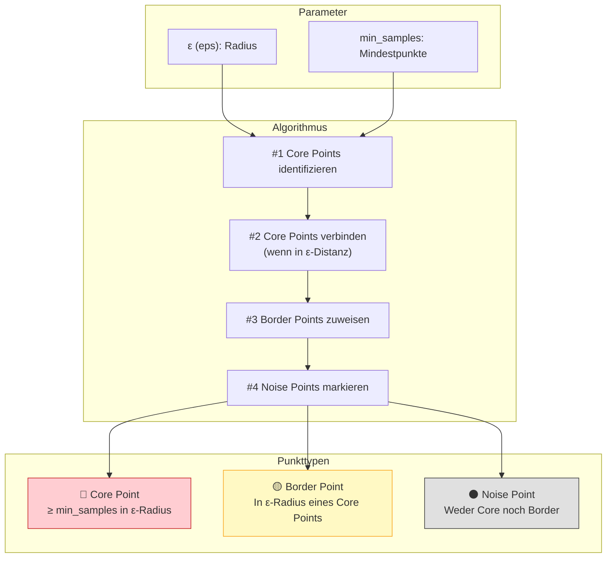
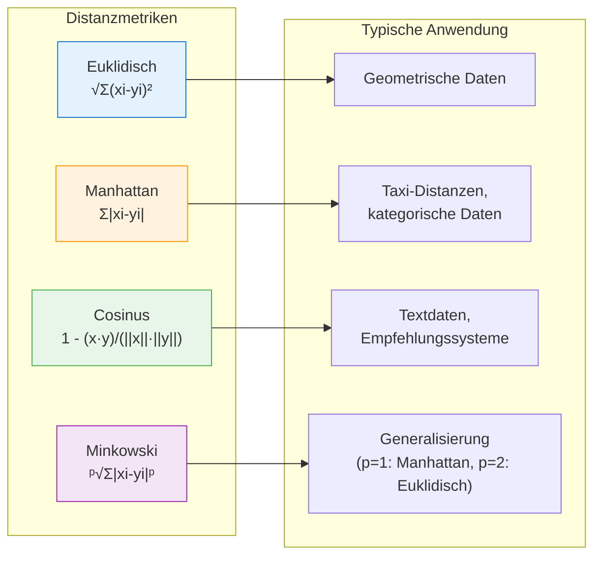
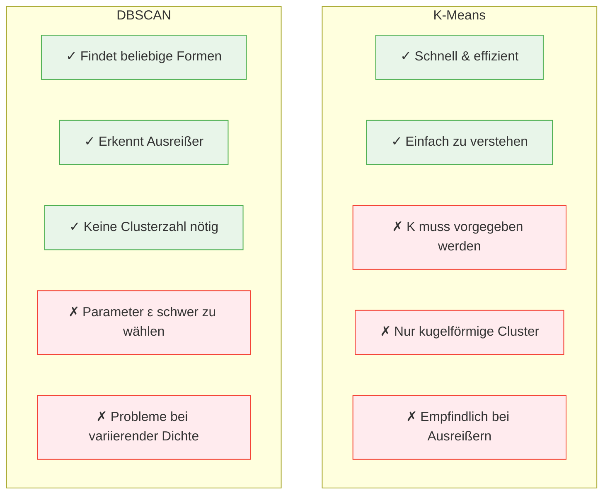

# Clustering: K-Means & DBSCAN
{: .no_toc }

> **Clustering-Verfahren entdecken verborgene Strukturen in Daten, indem sie ähnliche Datenpunkte zu Gruppen zusammenfassen.**    
>  K-Means eignet sich für kompakte, gleichmäßige Cluster, während DBSCAN beliebig geformte Cluster erkennt und Ausreißer identifiziert.

---

## Inhaltsverzeichnis
{: .no_toc .text-delta }

1. TOC
{:toc}

---

## Einführung in Clustering

Clustering bezeichnet Verfahren zur Entdeckung von Ähnlichkeitsstrukturen in Datenbeständen. Die gefundenen Gruppen ähnlicher Objekte werden als **Cluster** bezeichnet.

Im Gegensatz zum überwachten Lernen sind beim Clustering keine Labels vorhanden – der Algorithmus muss die Struktur selbst entdecken. Dies macht Clustering zu einem zentralen Werkzeug des **unüberwachten Lernens**.



---

## Clustering-Ansätze im Überblick

| Ansatz | Methode | Charakteristik |
|--------|---------|----------------|
| **Partitionierend** | K-Means | Teilt Daten in k vordefinierte Cluster; iterative Optimierung der Clusterzentren |
| **Dichtebasiert** | DBSCAN | Erkennt Cluster anhand der Datendichte; identifiziert Ausreißer automatisch |
| **Hierarchisch** | Agglomerativ/Divisiv | Baut Cluster-Hierarchie auf; keine Vorgabe der Clusterzahl nötig |

---

## K-Means Clustering

### Grundprinzip

K-Means ist ein **partitionierender** Clustering-Algorithmus, der einen Datensatz in **K verschiedene, nicht überlappende Cluster** aufteilt. Der Algorithmus gehört zu den am häufigsten verwendeten Techniken zur Gruppierung von Objekten, da er schnell die Zentren der Cluster findet.



### Algorithmus-Schritte

1. **Initialisierung**: Wähle K initiale Clusterzentren (zufällig oder mit K-Means++)
2. **Zuweisung**: Ordne jeden Datenpunkt dem nächsten Clusterzentrum zu
3. **Update**: Berechne neue Clusterzentren als Mittelwert aller zugewiesenen Punkte
4. **Iteration**: Wiederhole Schritte 2-3 bis Konvergenz (keine Änderung mehr)

### Eigenschaften von K-Means

| Eigenschaft | Beschreibung |
|-------------|--------------|
| **Clusterform** | Bevorzugt kugelförmige, kompakte Cluster |
| **Clustergröße** | Tendiert zu ähnlich großen Clustern |
| **Varianz** | Minimiert die Varianz innerhalb der Cluster |
| **Komplexität** | O(n × k × i × d) mit n=Datenpunkte, k=Cluster, i=Iterationen, d=Dimensionen |

### Implementation mit scikit-learn

```python
import numpy as np
import matplotlib.pyplot as plt
from sklearn.cluster import KMeans
from sklearn.datasets import make_blobs
from sklearn.preprocessing import StandardScaler

# Beispieldaten generieren
X, y_true = make_blobs(
    n_samples=300, 
    centers=4,
    cluster_std=0.60, 
    random_state=42
)

# Daten skalieren (wichtig für K-Means!)
scaler = StandardScaler()
X_scaled = scaler.fit_transform(X)

# K-Means Modell erstellen und trainieren
kmeans = KMeans(
    n_clusters=4,           # Anzahl der Cluster
    init='k-means++',       # Intelligente Initialisierung
    n_init=10,              # Anzahl der Initialisierungen
    max_iter=300,           # Maximale Iterationen
    random_state=42
)

# Cluster-Labels vorhersagen
cluster_labels = kmeans.fit_predict(X_scaled)

# Ergebnisse ausgeben
print(f"Clusterzentren:\n{kmeans.cluster_centers_}")
print(f"Inertia (Within-Cluster-Summe): {kmeans.inertia_:.2f}")
print(f"Anzahl Iterationen: {kmeans.n_iter_}")
```

### Optimale Clusterzahl mit der Elbow-Methode

Die Wahl der richtigen Anzahl K ist entscheidend. Die **Elbow-Methode** hilft dabei, indem sie die Inertia (Within-Cluster Sum of Squares) für verschiedene K-Werte visualisiert.

```python
from sklearn.cluster import KMeans
import matplotlib.pyplot as plt

# Inertia für verschiedene K-Werte berechnen
inertias = []
K_range = range(1, 11)

for k in K_range:
    kmeans = KMeans(n_clusters=k, random_state=42, n_init=10)
    kmeans.fit(X_scaled)
    inertias.append(kmeans.inertia_)

# Elbow-Plot erstellen
plt.figure(figsize=(10, 6))
plt.plot(K_range, inertias, 'bo-', linewidth=2, markersize=8)
plt.xlabel('Anzahl Cluster (K)', fontsize=12)
plt.ylabel('Inertia (WCSS)', fontsize=12)
plt.title('Elbow-Methode zur Bestimmung der optimalen Clusterzahl', fontsize=14)
plt.grid(True, alpha=0.3)
plt.xticks(K_range)
plt.show()
```



> **Tipp:** Der "Ellbogen" im Plot zeigt die optimale Clusterzahl – dort, wo die Kurve abknickt und weitere Cluster nur noch geringe Verbesserungen bringen.

---

## DBSCAN Clustering

### Grundprinzip

**DBSCAN** (Density-Based Spatial Clustering of Applications with Noise) ist ein dichtebasierter Algorithmus, der Cluster als Regionen hoher Datendichte definiert, getrennt durch Gebiete niedriger Dichte.

Im Gegensatz zu K-Means benötigt DBSCAN keine Vorgabe der Clusterzahl und kann:
- **Beliebig geformte Cluster** erkennen
- **Rauschen (Noise)** automatisch identifizieren
- Mit **Ausreißern** umgehen



### Schlüsselkonzepte

| Konzept | Definition |
|---------|------------|
| **ε (epsilon)** | Der Radius, innerhalb dessen Nachbarn gesucht werden |
| **min_samples** | Minimale Anzahl Punkte für einen Core Point |
| **Core Point** | Punkt mit mindestens min_samples Nachbarn im ε-Radius |
| **Border Point** | Punkt im ε-Radius eines Core Points, aber selbst kein Core Point |
| **Noise Point** | Punkt, der weder Core noch Border Point ist (Ausreißer) |

### Algorithmus-Ablauf

1. **Core Points finden**: Alle Punkte mit ≥ min_samples Nachbarn im ε-Radius markieren
2. **Cluster bilden**: Verbundene Core Points gehören zum selben Cluster
3. **Border Points zuweisen**: Jedem erreichbaren Core Point-Cluster zuordnen
4. **Noise klassifizieren**: Übrige Punkte als Rauschen markieren

### Implementation mit scikit-learn

```python
from sklearn.cluster import DBSCAN
from sklearn.preprocessing import StandardScaler
from sklearn.datasets import make_moons
import numpy as np

# Halbmond-Daten generieren (nicht-kugelförmige Cluster)
X, y_true = make_moons(n_samples=300, noise=0.05, random_state=42)

# Daten skalieren
scaler = StandardScaler()
X_scaled = scaler.fit_transform(X)

# DBSCAN Modell erstellen
dbscan = DBSCAN(
    eps=0.3,              # Epsilon: Radius für Nachbarsuche
    min_samples=5,        # Mindestpunkte für Core Point
    metric='euclidean'    # Distanzmetrik
)

# Cluster-Labels vorhersagen
cluster_labels = dbscan.fit_predict(X_scaled)

# Ergebnisse analysieren
n_clusters = len(set(cluster_labels)) - (1 if -1 in cluster_labels else 0)
n_noise = list(cluster_labels).count(-1)

print(f"Gefundene Cluster: {n_clusters}")
print(f"Noise-Punkte: {n_noise}")
print(f"Core-Samples: {len(dbscan.core_sample_indices_)}")
```

### Parameter-Tuning mit k-Distanz-Graph

Die Wahl von ε ist kritisch. Der **k-Distanz-Graph** hilft bei der Bestimmung:

```python
from sklearn.neighbors import NearestNeighbors
import numpy as np
import matplotlib.pyplot as plt

# k nächste Nachbarn berechnen (k = min_samples - 1)
k = 4
neighbors = NearestNeighbors(n_neighbors=k)
neighbors_fit = neighbors.fit(X_scaled)
distances, indices = neighbors_fit.kneighbors(X_scaled)

# Distanzen sortieren
distances = np.sort(distances[:, k-1])

# k-Distanz-Plot
plt.figure(figsize=(10, 6))
plt.plot(distances, linewidth=2)
plt.xlabel('Datenpunkte (sortiert)', fontsize=12)
plt.ylabel(f'{k}-Distanz', fontsize=12)
plt.title('k-Distanz-Graph zur Bestimmung von ε', fontsize=14)
plt.grid(True, alpha=0.3)
plt.axhline(y=0.3, color='r', linestyle='--', label='Vorgeschlagenes ε')
plt.legend()
plt.show()
```

> **Tipp:** Der "Knick" im k-Distanz-Graphen zeigt einen guten ε-Wert an. Punkte oberhalb dieses Knicks werden wahrscheinlich als Noise klassifiziert.

---

## Distanzmetriken

Die Wahl der Distanzmetrik beeinflusst das Clustering-Ergebnis erheblich. Beide Algorithmen können verschiedene Metriken verwenden.

### Übersicht gängiger Distanzmaße



### Vergleich der Distanzmetriken

| Metrik | Formel | Charakteristik | Anwendung |
|--------|--------|----------------|-----------|
| **Euklidisch** | √Σ(xᵢ-yᵢ)² | Direkte Luftlinie | Standard für kontinuierliche Daten |
| **Manhattan** | Σ\|xᵢ-yᵢ\| | Summe der Achsenabstände | Robuster bei Ausreißern |
| **Cosinus** | 1 - cos(θ) | Winkel zwischen Vektoren | Textähnlichkeit, Embeddings |
| **Minkowski** | (Σ\|xᵢ-yᵢ\|ᵖ)^(1/p) | Generalisierung | Parameter p anpassbar |

### Code-Beispiel: Verschiedene Metriken

```python
from sklearn.cluster import DBSCAN
from sklearn.metrics import pairwise_distances
import numpy as np

# Beispieldaten
X = np.array([[1, 2], [2, 2], [2, 3], [8, 7], [8, 8], [25, 80]])

# DBSCAN mit verschiedenen Metriken
metrics = ['euclidean', 'manhattan', 'cosine']

for metric in metrics:
    dbscan = DBSCAN(eps=0.5, min_samples=2, metric=metric)
    labels = dbscan.fit_predict(X)
    n_clusters = len(set(labels)) - (1 if -1 in labels else 0)
    print(f"{metric.capitalize():12} → Cluster: {n_clusters}, Labels: {labels}")
```

---

## K-Means vs. DBSCAN: Vergleich



### Entscheidungshilfe

| Kriterium | K-Means | DBSCAN |
|-----------|---------|--------|
| **Clusterzahl bekannt** | ✅ Ideal | ❌ Nicht nötig |
| **Kugelförmige Cluster** | ✅ Optimal | ⚠️ Möglich |
| **Beliebige Clusterformen** | ❌ Ungeeignet | ✅ Ideal |
| **Ausreißer im Datensatz** | ❌ Problematisch | ✅ Werden erkannt |
| **Große Datensätze** | ✅ Sehr schnell | ⚠️ Kann langsam sein |
| **Variierende Clusterdichte** | ⚠️ Problematisch | ❌ Problematisch |

---

## Vollständiges Beispiel: Kundensegmentierung

```python
import numpy as np
import pandas as pd
import matplotlib.pyplot as plt
from sklearn.cluster import KMeans, DBSCAN
from sklearn.preprocessing import StandardScaler
from sklearn.metrics import silhouette_score

# Simulierte Kundendaten erstellen
np.random.seed(42)
n_customers = 500

data = {
    'jahresumsatz': np.concatenate([
        np.random.normal(5000, 1000, 200),    # Gelegenheitskäufer
        np.random.normal(15000, 2000, 200),   # Stammkunden
        np.random.normal(50000, 5000, 100)    # Premium-Kunden
    ]),
    'kaufhaeufigkeit': np.concatenate([
        np.random.normal(3, 1, 200),          # Gelegenheitskäufer
        np.random.normal(12, 2, 200),         # Stammkunden
        np.random.normal(24, 3, 100)          # Premium-Kunden
    ])
}

df = pd.DataFrame(data)

# Daten skalieren
scaler = StandardScaler()
X_scaled = scaler.fit_transform(df)

# --- K-Means Clustering ---
kmeans = KMeans(n_clusters=3, random_state=42, n_init=10)
df['kmeans_cluster'] = kmeans.fit_predict(X_scaled)
silhouette_kmeans = silhouette_score(X_scaled, df['kmeans_cluster'])

# --- DBSCAN Clustering ---
dbscan = DBSCAN(eps=0.5, min_samples=10)
df['dbscan_cluster'] = dbscan.fit_predict(X_scaled)

# Noise-Punkte für Silhouette-Score ausschließen
mask = df['dbscan_cluster'] != -1
if mask.sum() > 1 and len(set(df.loc[mask, 'dbscan_cluster'])) > 1:
    silhouette_dbscan = silhouette_score(
        X_scaled[mask], 
        df.loc[mask, 'dbscan_cluster']
    )
else:
    silhouette_dbscan = None

# Ergebnisse ausgeben
print("=" * 50)
print("CLUSTERING-ERGEBNISSE")
print("=" * 50)
print(f"\nK-Means:")
print(f"  Silhouette Score: {silhouette_kmeans:.3f}")
print(f"  Clustergrößen: {df['kmeans_cluster'].value_counts().sort_index().to_dict()}")

print(f"\nDBSCAN:")
n_clusters_dbscan = len(set(df['dbscan_cluster'])) - (1 if -1 in df['dbscan_cluster'].values else 0)
n_noise = (df['dbscan_cluster'] == -1).sum()
print(f"  Gefundene Cluster: {n_clusters_dbscan}")
print(f"  Noise-Punkte: {n_noise}")
if silhouette_dbscan:
    print(f"  Silhouette Score (ohne Noise): {silhouette_dbscan:.3f}")
```

---

## Best Practices

### Datenvorbereitung

> **Wichtig:** Beide Algorithmen sind distanzbasiert – Skalierung ist essentiell!

```python
from sklearn.preprocessing import StandardScaler

# Immer vor dem Clustering skalieren
scaler = StandardScaler()
X_scaled = scaler.fit_transform(X)
```

### Checkliste für erfolgreiches Clustering

- [ ] Daten auf fehlende Werte prüfen
- [ ] Features skalieren (StandardScaler oder MinMaxScaler)
- [ ] Bei K-Means: Optimales K mit Elbow-Methode bestimmen
- [ ] Bei DBSCAN: ε mit k-Distanz-Graph bestimmen
- [ ] Ergebnis mit Silhouette-Score evaluieren
- [ ] Cluster visualisieren und interpretieren

### Häufige Fehler vermeiden

| Fehler | Problem | Lösung |
|--------|---------|--------|
| Keine Skalierung | Unterschiedliche Feature-Skalen dominieren | StandardScaler verwenden |
| Falsches K | Over-/Underfitting | Elbow-Methode + Silhouette |
| ε zu klein/groß | Zu viele/wenige Cluster | k-Distanz-Graph analysieren |
| Nur ein Algorithmus | Suboptimale Ergebnisse | Beide Methoden vergleichen |

---

## Weiterführende Ressourcen

- **StatQuest**: K-Means Clustering und DBSCAN Erklärungen
- **scikit-learn Dokumentation**: Clustering-Modul mit weiteren Algorithmen

---

**Version:** 1.0    
**Stand:** Januar 2026    
**Kurs:** Machine Learning. Verstehen. Anwenden. Gestalten.    
