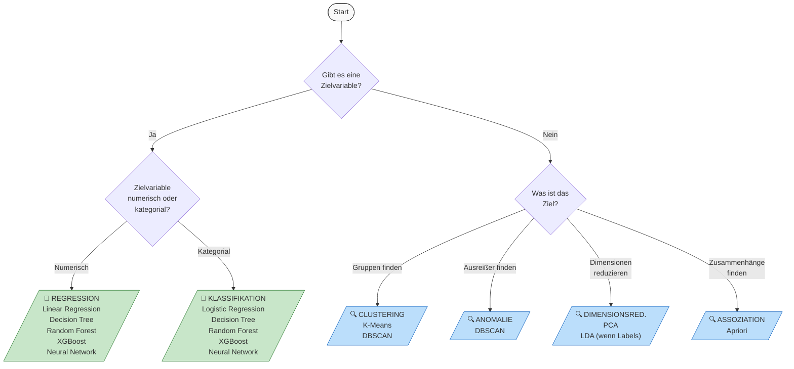

# Modell-Steckbriefe
{: .no_toc }

> **Kompakte Referenz zu den wichtigsten Machine Learning Algorithmen.**    
> Jeder Steckbrief enthält Einsatzbereich, Kernprinzip, Vor- und Nachteile sowie passende Bewertungsmetriken.

---

## Inhaltsverzeichnis
{: .no_toc .text-delta }

1. TOC
{:toc}

---

## Algorithmen auf einen Blick

| Algorithmus | Lernstrategie | Einsatzbereich | Hauptmetrik |
|-------------|---------------|----------------|-------------|
| **Decision Tree** | Supervised | Klassifikation, Regression | Accuracy / R² |
| **Random Forest** | Supervised | Klassifikation, Regression | Accuracy / R² |
| **Linear Regression** | Supervised | Regression | R², MAE |
| **Logistic Regression** | Supervised | Klassifikation | Accuracy, AUC |
| **Neural Network** | Supervised | Klassifikation, Regression | Accuracy / R² |
| **XGBoost** | Supervised | Klassifikation, Regression | Accuracy / R² |
| **LDA** | Supervised | Dimensionsreduktion, Klassifikation | Erklärte Varianz |
| **K-Means** | Unsupervised | Clustering | Silhouetten-Koeffizient |
| **DBSCAN** | Unsupervised | Clustering, Anomalieerkennung | Silhouetten-Koeffizient |
| **Apriori** | Unsupervised | Assoziationsanalyse | Support, Confidence, Lift |
| **PCA** | Unsupervised | Dimensionsreduktion | Erklärte Varianz |

> **Tipp:** Starten Sie mit einfachen, interpretierbaren Modellen (Linear/Logistic Regression, Decision Tree) und steigern Sie die Komplexität nur bei Bedarf. Die beste Modellwahl hängt immer vom konkreten Use Case, den verfügbaren Daten und den Anforderungen an Interpretierbarkeit ab.

---

**Interaktive Mindmap mit einem breiten Methodenüberblick:**
[Machine Learning Algorithms Mind Map](https://mindmapai.app/mind-map/machine-learning-algorithms-5f3b26fa)

---

## Übersicht nach Lernstrategie

Die folgende Tabelle bietet einen schnellen Überblick über alle behandelten Algorithmen, kategorisiert nach Lernstrategie und Einsatzbereich.

```mermaid
flowchart TB
    subgraph SL["🎯 Supervised Learning"]
        direction TB
        SL_CLASS["Klassifikation"]
        SL_REG["Regression"]
        SL_DIM["Dimensionsreduktion"]
        
        SL_CLASS --> DT1["Decision Tree"]
        SL_CLASS --> RF1["Random Forest"]
        SL_CLASS --> LOG["Logistic Regression"]
        SL_CLASS --> NN1["Neural Network"]
        SL_CLASS --> XGB1["XGBoost"]
        
        SL_REG --> DT2["Decision Tree"]
        SL_REG --> RF2["Random Forest"]
        SL_REG --> LIN["Linear Regression"]
        SL_REG --> NN2["Neural Network"]
        SL_REG --> XGB2["XGBoost"]
        
        SL_DIM --> LDA["LDA"]
    end
    
    subgraph UL["🔍 Unsupervised Learning"]
        direction TB
        UL_CLUST["Clustering"]
        UL_ANOM["Anomalieerkennung"]
        UL_ASSOC["Assoziationsanalyse"]
        UL_DIM["Dimensionsreduktion"]
        
        UL_CLUST --> KM["K-Means"]
        UL_CLUST --> DBS["DBSCAN"]

        UL_ANOM --> DBSCAN_ANOM["DBSCAN<br/>(siehe Clustering)"]

        UL_ASSOC --> APR["Apriori"]
        
        UL_DIM --> PCA["PCA"]
    end
    
    style SL fill:#e8f5e9,stroke:#2e7d32
    style UL fill:#e3f2fd,stroke:#1565c0
```

---

## Supervised Learning

### Decision Tree

| Eigenschaft | Beschreibung |
|-------------|--------------|
| **Lernstrategie** | Supervised Learning |
| **Einsatzbereich** | Klassifikation, Regression |
| **Kernprinzip** | Hierarchische Struktur von Entscheidungsregeln basierend auf Feature-Splits |

**Beschreibung**

Ein Entscheidungsbaum teilt die Daten auf der Grundlage von Entscheidungsregeln auf. Er ist einfach zu verstehen und zu interpretieren. Aus dem Trainingsdatensatz wird eine hierarchische Struktur von möglichst wenigen Regeln abgeleitet. Die beste Aufteilung wird anhand von Kriterien wie der Entropie oder dem Gini-Index ermittelt.

**Vorteile**
- Hohe Interpretierbarkeit und Transparenz
- Keine Datenskalierung erforderlich
- Kann kategoriale und numerische Features verarbeiten
- Schnelles Training und Vorhersage

**Nachteile**
- Neigung zu Overfitting bei tiefen Bäumen
- Instabil bei kleinen Datenänderungen
- Kann komplexe Beziehungen schlecht erfassen
- Bias bei unbalancierten Klassen

**Bewertungsmetriken**

| Klassifikation | Regression |
|----------------|------------|
| Accuracy, F1-Score | R², MAE |
| AUC, Confusion Matrix | Residual Plot |
| Cohen's Kappa | |

**Wichtige Hyperparameter**
- `max_depth`: Maximale Tiefe des Baums
- `min_samples_split`: Minimale Samples für einen Split
- `min_samples_leaf`: Minimale Samples pro Blatt
- `criterion`: Splitting-Kriterium (gini, entropy, log_loss)

---

### Random Forest

| Eigenschaft | Beschreibung |
|-------------|--------------|
| **Lernstrategie** | Supervised Learning |
| **Einsatzbereich** | Klassifikation, Regression |
| **Kernprinzip** | Ensemble-Methode, die mehrere Entscheidungsbäume kombiniert (Bagging) |

**Beschreibung**

Random Forest ist eine Gruppe (Ensemble) von Entscheidungsbäumen. Mehrere Bäume werden in „zufälliger" Weise aufgebaut und bilden einen Random Forest. Jeder Baum wird aus einer anderen Bootstrap-Stichprobe von Daten und Merkmalen erstellt. Die Vorhersagen aller Bäume werden dann aggregiert (Mehrheitsentscheidung oder Mittelwert).

**Vorteile**
- Robuster als einzelne Entscheidungsbäume
- Weniger anfällig für Overfitting
- Liefert Feature Importance
- Parallelisierbar

**Nachteile**
- Weniger interpretierbar als einzelne Bäume
- Höherer Speicher- und Rechenaufwand
- Kann bei vielen Features langsam werden
- Tendiert zu Bias bei unbalancierten Daten

**Bewertungsmetriken**

| Klassifikation | Regression |
|----------------|------------|
| Accuracy, F1-Score | R², MAE |
| AUC, Confusion Matrix | Residual Plot |
| Cohen's Kappa | |

**Wichtige Hyperparameter**
- `n_estimators`: Anzahl der Bäume im Wald
- `max_depth`: Maximale Tiefe der einzelnen Bäume
- `max_features`: Anzahl Features pro Split ('sqrt', 'log2', int)
- `bootstrap`: Bootstrap-Sampling aktivieren

---

### Linear Regression

| Eigenschaft | Beschreibung |
|-------------|--------------|
| **Lernstrategie** | Supervised Learning |
| **Einsatzbereich** | Regression |
| **Kernprinzip** | Modelliert linearen Zusammenhang zwischen Features und Zielvariable |

**Beschreibung**

Die lineare Regression ist ein statistisches Verfahren, bei dem eine abhängige Variable (y) durch eine oder mehrere unabhängige Variablen (x) erklärt wird. Es wird ein linearer Zusammenhang angenommen, darstellbar als Gerade y = b + ax mit b = Achsenabschnitt und a = Steigung. Das Training minimiert den quadratischen Fehler zwischen Vorhersage und tatsächlichem Wert.

**Vorteile**
- Sehr hohe Interpretierbarkeit
- Schnelles Training
- Gut für lineare Zusammenhänge
- Koeffizienten zeigen Feature-Einfluss

**Nachteile**
- Nur für lineare Beziehungen geeignet
- Empfindlich gegenüber Ausreißern
- Kann Multikollinearität nicht gut handhaben
- Begrenzte Ausdrucksstärke

**Bewertungsmetriken**

| Metrik | Beschreibung |
|--------|--------------|
| R² | Bestimmtheitsmaß (0-1) |
| MAE | Mittlerer absoluter Fehler |
| MSE / RMSE | (Wurzel aus) mittlerer quadratischer Fehler |
| Residual Plot | Visualisierung der Fehlerverteilung |

**Wichtige Hyperparameter**
- `fit_intercept`: Achsenabschnitt berechnen
- `normalize`: Features normalisieren (deprecated, besser StandardScaler)

---

### Logistic Regression

| Eigenschaft | Beschreibung |
|-------------|--------------|
| **Lernstrategie** | Supervised Learning |
| **Einsatzbereich** | Klassifikation |
| **Kernprinzip** | Schätzt Wahrscheinlichkeiten für Klassenzugehörigkeit mittels Sigmoid-Funktion |

**Beschreibung**

Die logistische Regression ist eine Form der Regressionsanalyse, bei der ein kategoriales Ergebnis vorhergesagt wird. Die Wahrscheinlichkeit für das Eintreten einer Klasse wird geschätzt. Die Sigmoid-Funktion transformiert die lineare Kombination der Features in Wahrscheinlichkeiten zwischen 0 und 1. In der Grundform werden dichotome Ergebnisse (0 oder 1) vorhergesagt.

**Vorteile**
- Gute Interpretierbarkeit
- Liefert Wahrscheinlichkeiten
- Schnelles Training
- Wenig Hyperparameter

**Nachteile**
- Nur für linear separierbare Daten optimal
- Kann komplexe Muster nicht erfassen
- Empfindlich gegenüber Multikollinearität

**Bewertungsmetriken**

| Metrik | Beschreibung |
|--------|--------------|
| Accuracy | Anteil korrekter Klassifikationen |
| Precision / Recall | Relevanz / Sensitivität |
| F1-Score | Harmonisches Mittel von Precision und Recall |
| AUC-ROC | Fläche unter der ROC-Kurve |
| Cohen's Kappa | Übereinstimmungsmaß |

**Wichtige Hyperparameter**
- `C`: Inverse Regularisierungsstärke
- `penalty`: Regularisierungsart ('l1', 'l2', 'elasticnet')
- `solver`: Optimierungsalgorithmus
- `max_iter`: Maximale Iterationen

---

### Neural Network (MLP)

| Eigenschaft | Beschreibung |
|-------------|--------------|
| **Lernstrategie** | Supervised Learning |
| **Einsatzbereich** | Klassifikation, Regression |
| **Kernprinzip** | Schichten von Neuronen mit gewichteten Verbindungen und Aktivierungsfunktionen |

**Beschreibung**

Künstliche neuronale Netze bestehen aus Schichten von Knoten (Neuronen) und können komplexe Beziehungen zwischen Eingaben und Ausgaben modellieren. Jedes Neuron berechnet eine gewichtete Summe seiner Eingaben, addiert einen Bias und wendet eine Aktivierungsfunktion an. Das Training erfolgt über Backpropagation und Gradient Descent.

**Vorteile**
- Kann komplexe, nichtlineare Muster lernen
- Flexibel einsetzbar
- Gut skalierbar
- State-of-the-Art für viele Aufgaben

**Nachteile**
- "Black Box" - schwer interpretierbar
- Benötigt viele Daten
- Rechenintensiv
- Viele Hyperparameter

**Bewertungsmetriken**

| Klassifikation | Regression |
|----------------|------------|
| Accuracy, F1-Score | R², MAE |
| AUC, Confusion Matrix | Residual Plot |
| Cohen's Kappa | |

**Wichtige Hyperparameter**
- `hidden_layer_sizes`: Architektur (z.B. (100, 50))
- `activation`: Aktivierungsfunktion ('relu', 'tanh', 'logistic')
- `solver`: Optimierer ('adam', 'sgd', 'lbfgs')
- `learning_rate_init`: Initiale Lernrate
- `alpha`: L2-Regularisierung

---

### XGBoost

| Eigenschaft | Beschreibung |
|-------------|--------------|
| **Lernstrategie** | Supervised Learning |
| **Einsatzbereich** | Klassifikation, Regression |
| **Kernprinzip** | Gradient Boosting mit optimierter Implementierung für Geschwindigkeit und Leistung |

**Beschreibung**

XGBoost (Extreme Gradient Boosting) ist eine optimierte Implementierung von Gradient Boosting. Beim Boosting werden mehrere schwache Modelle sequentiell kombiniert, wobei jedes neue Modell die Fehler der vorherigen korrigiert. XGBoost bietet zusätzlich Regularisierung, paralleles Computing und Cache-Optimierungen, was es etwa 10-mal schneller als herkömmliches Gradient Boosting macht.

**Vorteile**
- Sehr hohe Vorhersagegenauigkeit
- Eingebaute Regularisierung gegen Overfitting
- Effizientes Training durch Parallelisierung
- Robuster Umgang mit fehlenden Werten

**Nachteile**
- Viele Hyperparameter
- Weniger interpretierbar
- Kann bei kleinen Datensätzen overfitten
- Höherer Speicherverbrauch

**Bewertungsmetriken**

| Klassifikation | Regression |
|----------------|------------|
| Accuracy, F1-Score | R², MAE |
| AUC, Confusion Matrix | Residual Plot |
| Cohen's Kappa | |

**Wichtige Hyperparameter**
- `n_estimators`: Anzahl der Boosting-Runden
- `max_depth`: Maximale Baumtiefe
- `learning_rate`: Schrittweite (eta)
- `subsample`: Anteil der Trainingsdaten pro Runde
- `colsample_bytree`: Anteil der Features pro Baum

---

### Linear Discriminant Analysis (LDA)

| Eigenschaft | Beschreibung |
|-------------|--------------|
| **Lernstrategie** | Supervised Learning |
| **Einsatzbereich** | Dimensionsreduktion, Klassifikation |
| **Kernprinzip** | Findet Projektionen, die die Klassentrennung maximieren |

**Beschreibung**

Die Linear Discriminant Analysis ist eine Technik zur Dimensionsreduktion, die sich auf die Maximierung der Trennbarkeit zwischen bekannten Kategorien konzentriert. Die Methode sucht nach einer linearen Kombination der Merkmale, die die größte Varianz zwischen den Klassen und die kleinste Varianz innerhalb jeder Klasse aufweist. LDA kann auch direkt zur Klassifikation verwendet werden.

**Vorteile**
- Kombiniert Dimensionsreduktion mit Klassenziel
- Gut interpretierbar
- Schnelle Berechnung
- Effektiv bei vielen Features

**Nachteile**
- Nur für lineare Trennungen geeignet
- Empfindlich bei unbalancierten Klassen
- Benötigt mehr Samples als Features
- Annahme: Normalverteilung der Daten

**Bewertungsmetriken**

| Dimensionsreduktion | Klassifikation |
|---------------------|----------------|
| Erklärte Varianz | Accuracy, F1-Score |
| | AUC, Confusion Matrix |

**Wichtige Hyperparameter**
- `n_components`: Anzahl der Komponenten
- `solver`: Berechnungsmethode ('svd', 'lsqr', 'eigen')

---

## Unsupervised Learning

### K-Means

| Eigenschaft | Beschreibung |
|-------------|--------------|
| **Lernstrategie** | Unsupervised Learning |
| **Einsatzbereich** | Clustering |
| **Kernprinzip** | Partitioniert Daten in k Cluster basierend auf Ähnlichkeit zu Clusterzentren |

**Beschreibung**

K-Means-Clustering ist ein einfacher Ansatz zum Partitionieren eines Datensatzes in K verschiedene, nicht überlappende Cluster. Der Algorithmus initialisiert K Clusterzentren und ordnet jeden Datenpunkt dem nächstgelegenen Zentrum zu. Dann werden die Zentren als Mittelwert ihrer zugeordneten Punkte neu berechnet. Dieser Prozess wiederholt sich bis zur Konvergenz.

**Vorteile**
- Einfach und schnell
- Gut skalierbar
- Funktioniert gut bei kugelförmigen Clustern
- Leicht interpretierbar

**Nachteile**
- Anzahl K muss vorab festgelegt werden
- Empfindlich gegenüber Ausreißern
- Bevorzugt gleichgroße, kugelförmige Cluster
- Abhängig von Initialisierung

**Bewertungsmetriken**

| Metrik | Beschreibung |
|--------|--------------|
| Silhouetten-Koeffizient | Qualität der Clusterzuordnung (-1 bis 1) |
| Elbow-Methode | Optimale Clusteranzahl finden |
| Inertia | Summe der quadratischen Abstände zu Zentren |

**Wichtige Hyperparameter**
- `n_clusters`: Anzahl der Cluster
- `init`: Initialisierungsmethode ('k-means++', 'random')
- `n_init`: Anzahl der Initialisierungen
- `max_iter`: Maximale Iterationen

---

### DBSCAN

| Eigenschaft | Beschreibung |
|-------------|--------------|
| **Lernstrategie** | Unsupervised Learning |
| **Einsatzbereich** | Clustering |
| **Kernprinzip** | Dichtebasiertes Clustering, erkennt Cluster beliebiger Form |

**Beschreibung**

DBSCAN (Density-Based Spatial Clustering of Applications with Noise) ist ein dichtebasierter Clustering-Algorithmus. Er identifiziert Cluster als Bereiche hoher Datendichte, getrennt durch Bereiche geringer Dichte. Im Gegensatz zu K-Means kann DBSCAN Cluster beliebiger Form erkennen und klassifiziert Rauschpunkte (Outlier) separat.

**Vorteile**
- Findet Cluster beliebiger Form
- Erkennt automatisch Outlier
- Keine Clusteranzahl vorab nötig
- Robust gegenüber Ausreißern

**Nachteile**
- Empfindlich gegenüber Parameterwahl (eps, min_samples)
- Schwierigkeiten bei unterschiedlichen Dichten
- Nicht geeignet für hochdimensionale Daten
- Kann bei großen Datenmengen langsam sein

**Bewertungsmetriken**

| Metrik | Beschreibung |
|--------|--------------|
| Silhouetten-Koeffizient | Qualität der Clusterzuordnung |
| Davies-Bouldin-Index | Cluster-Separation (niedriger = besser) |
| Anzahl gefundener Cluster | Plausibilitätsprüfung |

**Wichtige Hyperparameter**
- `eps`: Maximaler Abstand für Nachbarschaft
- `min_samples`: Minimale Punkte für Kernpunkt
- `metric`: Distanzmetrik ('euclidean', 'manhattan', etc.)

> **Hinweis zur Anomalieerkennung:** Für die Erkennung von Anomalien und Ausreißern eignet sich **DBSCAN** (siehe Abschnitt "DBSCAN" oben), da dieser Algorithmus Rauschpunkte automatisch identifiziert und beliebig geformte Cluster erkennen kann.

---

### Apriori

| Eigenschaft | Beschreibung |
|-------------|--------------|
| **Lernstrategie** | Unsupervised Learning |
| **Einsatzbereich** | Assoziationsanalyse |
| **Kernprinzip** | Findet häufige Itemsets und leitet Assoziationsregeln ab |

**Beschreibung**

Der Apriori-Algorithmus dient dem Auffinden von Zusammenhängen in transaktionsbasierten Datenbanken. Er identifiziert häufig gemeinsam auftretende Items und generiert daraus Assoziationsregeln. Klassische Anwendung ist die Warenkorbanalyse: Welche Produkte werden häufig zusammen gekauft?

**Vorteile**
- Intuitive Ergebnisse
- Etablierter, gut verstandener Algorithmus
- Liefert interpretierbare Regeln
- Vielseitig einsetzbar

**Nachteile**
- Kann bei vielen Items sehr langsam werden
- Generiert oft viele Regeln
- Erfordert geschickte Parameterwahl
- Nur für kategoriale/diskrete Daten

**Bewertungsmetriken**

| Metrik | Beschreibung |
|--------|--------------|
| Support | Häufigkeit des Itemsets in allen Transaktionen |
| Confidence | Bedingte Wahrscheinlichkeit der Regel |
| Lift | Stärke der Abhängigkeit (>1 = positive Assoziation) |

**Wichtige Hyperparameter**
- `min_support`: Minimaler Support-Schwellenwert
- `min_confidence`: Minimale Konfidenz für Regeln
- `min_lift`: Minimaler Lift-Wert

---

### Principal Component Analysis (PCA)

| Eigenschaft | Beschreibung |
|-------------|--------------|
| **Lernstrategie** | Unsupervised Learning |
| **Einsatzbereich** | Dimensionsreduktion |
| **Kernprinzip** | Findet orthogonale Achsen maximaler Varianz zur Projektion der Daten |

**Beschreibung**

Die Hauptkomponentenanalyse (PCA) ist eine Methode zur Dimensionsreduktion, die Datenpunkte in einen Unterraum mit weniger Dimensionen projiziert. Der Unterraum wird so gewählt, dass die Varianz der projizierten Daten maximal ist. Die neuen Achsen (Hauptkomponenten) sind unkorreliert und nach erklärter Varianz sortiert.

**Vorteile**
- Reduziert Dimensionalität effektiv
- Entfernt korrelierte Features
- Beschleunigt nachfolgende Algorithmen
- Hilft bei Visualisierung

**Nachteile**
- Kann wichtige nichtlineare Strukturen verlieren
- Hauptkomponenten schwer interpretierbar
- Empfindlich gegenüber Skalierung
- Informationsverlust möglich

**Bewertungsmetriken**

| Metrik | Beschreibung |
|--------|--------------|
| Erklärte Varianz | Anteil der erhaltenen Information |
| Kumulative erklärte Varianz | Summe über Komponenten |
| Scree-Plot | Visualisierung des Varianzabfalls |

**Wichtige Hyperparameter**
- `n_components`: Anzahl zu behaltender Komponenten (int oder float für Varianzanteil)
- `svd_solver`: Berechnungsmethode ('auto', 'full', 'randomized')

---

## Schnellreferenz zur Modellauswahl

Das folgende Entscheidungsdiagramm hilft bei der Auswahl des passenden Algorithmus:

---

**Version:** 1.0    
**Stand:** Januar 2026    
**Kurs:** Machine Learning. Verstehen. Anwenden. Gestalten.    
