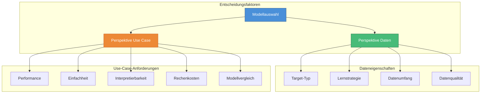
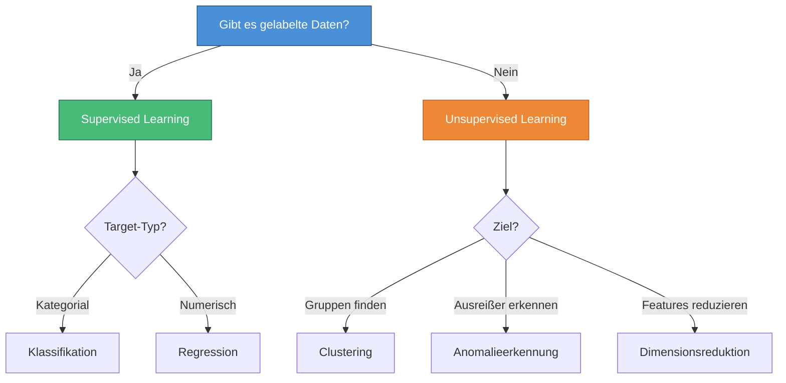
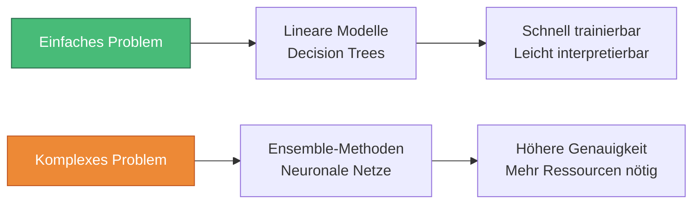
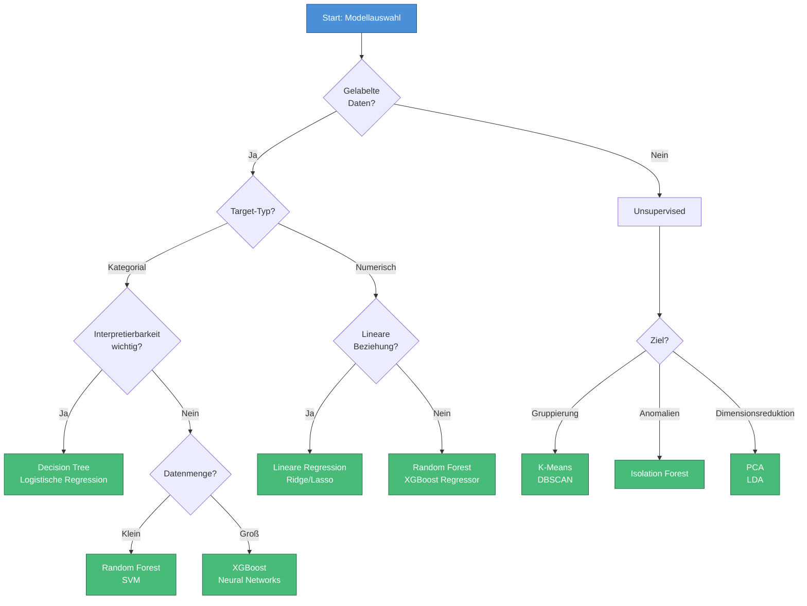

# Modellauswahl
{: .no_toc }

> **Die Wahl des richtigen Modells ist entscheidend für den Erfolg eines ML-Projekts.**     Diese Seite zeigt systematische Kriterien aus Daten- und Use-Case-Perspektive sowie praktische Entscheidungshilfen.

---

# Inhaltsverzeichnis
{: .no_toc .text-delta }

1. TOC
{:toc}

---

## Übersicht

Die Modellauswahl ist einer der kritischsten Schritte im Machine-Learning-Prozess. Ein falsch gewähltes Modell kann trotz perfekter Datenaufbereitung zu unbefriedigenden Ergebnissen führen. Die Auswahl erfolgt anhand zweier Hauptperspektiven: den **Dateneigenschaften** und den **Anforderungen des Use Cases**.

---

## Perspektive Daten

Die Eigenschaften der verfügbaren Daten bestimmen maßgeblich, welche Modelle überhaupt in Frage kommen.

### Target-Typ: Kategorial vs. Numerisch

Der Typ der Zielvariable ist das erste Auswahlkriterium:

| Target-Typ | Aufgabe | Geeignete Modelle |
|------------|---------|-------------------|
| **Kategorial (binär)** | Klassifikation | Logistische Regression, Decision Tree, Random Forest, SVM |
| **Kategorial (mehrere Klassen)** | Multi-Class-Klassifikation | Random Forest, XGBoost, Neuronale Netze |
| **Numerisch (stetig)** | Regression | Lineare Regression, Random Forest Regressor, XGBoost Regressor |
| **Kein Target** | Clustering/Anomalie | K-Means, DBSCAN, Isolation Forest |

### Lernstrategie

### Umfang des Datenbestands

Die Datenmenge beeinflusst die Modellwahl erheblich:

| Datenmenge | Empfohlene Modelle | Begründung |
|------------|-------------------|------------|
| **Klein (<1.000)** | Lineare Modelle, Decision Trees, Ridge/Lasso | Weniger anfällig für Overfitting |
| **Mittel (1.000-100.000)** | Random Forest, XGBoost, SVM | Gute Balance aus Performance und Robustheit |
| **Groß (>100.000)** | XGBoost, Neuronale Netze, LightGBM | Können komplexe Muster lernen |

### Datenqualität: Outlier und Missing Values

Verschiedene Modelle reagieren unterschiedlich auf Datenqualitätsprobleme:

| Problem | Robuste Modelle | Sensible Modelle |
|---------|-----------------|------------------|
| **Ausreißer** | Decision Trees, Random Forest | Lineare Regression, K-Means |
| **Missing Values** | XGBoost (nativ), Random Forest | SVM, Neuronale Netze |
| **Unbalancierte Klassen** | XGBoost (mit scale_pos_weight), Random Forest | Logistische Regression |

---

## Perspektive Use Case

Neben den Daten spielen die Anforderungen des konkreten Anwendungsfalls eine zentrale Rolle.

### Performance: Was ist akzeptabel?

Definieren Sie vorab, welche Metriken relevant sind und welche Schwellenwerte akzeptabel sind.

### Simplicity: Das richtige Maß an Komplexität

> **Grundregel:** Verwenden Sie kein komplexes Modell für ein einfaches Problem.

**Empfehlung:** Starten Sie immer mit einem einfachen Baseline-Modell und erhöhen Sie die Komplexität nur bei Bedarf:

### Interpretability: Nachvollziehbarkeit der Entscheidungen

Je nach Anwendungsbereich ist die Interpretierbarkeit unterschiedlich wichtig:

| Anwendungsbereich | Interpretierbarkeit | Empfohlene Modelle |
|-------------------|--------------------|--------------------|
| **Medizin/Gesundheit** | Sehr hoch | Decision Trees, Logistische Regression |
| **Finanzen/Kredit** | Hoch | Lineare Modelle, Rule-based Systems |
| **Marketing** | Mittel | Random Forest mit Feature Importance |
| **Bilderkennung** | Niedrig akzeptabel | Neuronale Netze, Deep Learning |

### Computation Costs: Zeit- und Ressourcenbedarf

Das Modell muss in angemessener Zeit trainierbar und mit verfügbarer Hardware anwendbar sein:

| Modell | Trainingszeit | Inferenzzeit | Speicherbedarf |
|--------|--------------|--------------|----------------|
| Logistische Regression | Sehr schnell | Sehr schnell | Gering |
| Decision Tree | Schnell | Sehr schnell | Gering |
| Random Forest | Mittel | Schnell | Mittel |
| XGBoost | Mittel-Lang | Schnell | Mittel |
| Neuronale Netze | Lang | Variabel | Hoch |

### Competition: Systematischer Modellvergleich

Wenn mehrere Modelle die Grundanforderungen erfüllen, hilft ein systematischer Vergleich:

---

## Entscheidungsbaum zur Modellauswahl

Der folgende Entscheidungsbaum bietet eine praktische Orientierungshilfe:

---

**Interaktive Mindmap mit einem breiten Methodenüberblick:**
[Machine Learning Algorithms Mind Map](https://mindmapai.app/mind-map/machine-learning-algorithms-5f3b26fa)

---
## Best Practices

### Do's ✓

- **Baseline zuerst:** Starten Sie immer mit einem einfachen Modell als Referenz
- **Cross-Validation nutzen:** Verwenden Sie CV für robuste Leistungsschätzungen
- **Mehrere Metriken:** Bewerten Sie Modelle anhand mehrerer relevanter Metriken
- **Dokumentieren:** Halten Sie fest, warum Sie sich für ein Modell entschieden haben
- **Iterativ vorgehen:** Erhöhen Sie die Komplexität schrittweise

### Don'ts ✗

- **Nicht das komplexeste Modell wählen:** Komplexität ≠ bessere Performance
- **Nicht nur Accuracy betrachten:** Besonders bei unbalancierten Daten irreführend
- **Nicht blind kopieren:** Was bei anderen funktioniert, passt nicht automatisch zu Ihren Daten
- **Nicht Trainingszeit ignorieren:** Produktionsanforderungen berücksichtigen
- **Nicht Interpretierbarkeit vernachlässigen:** Stakeholder müssen Ergebnisse verstehen

---

**Version:** 1.0    
**Stand:** Januar 2026    
**Kurs:** Machine Learning. Verstehen. Anwenden. Gestalten.    