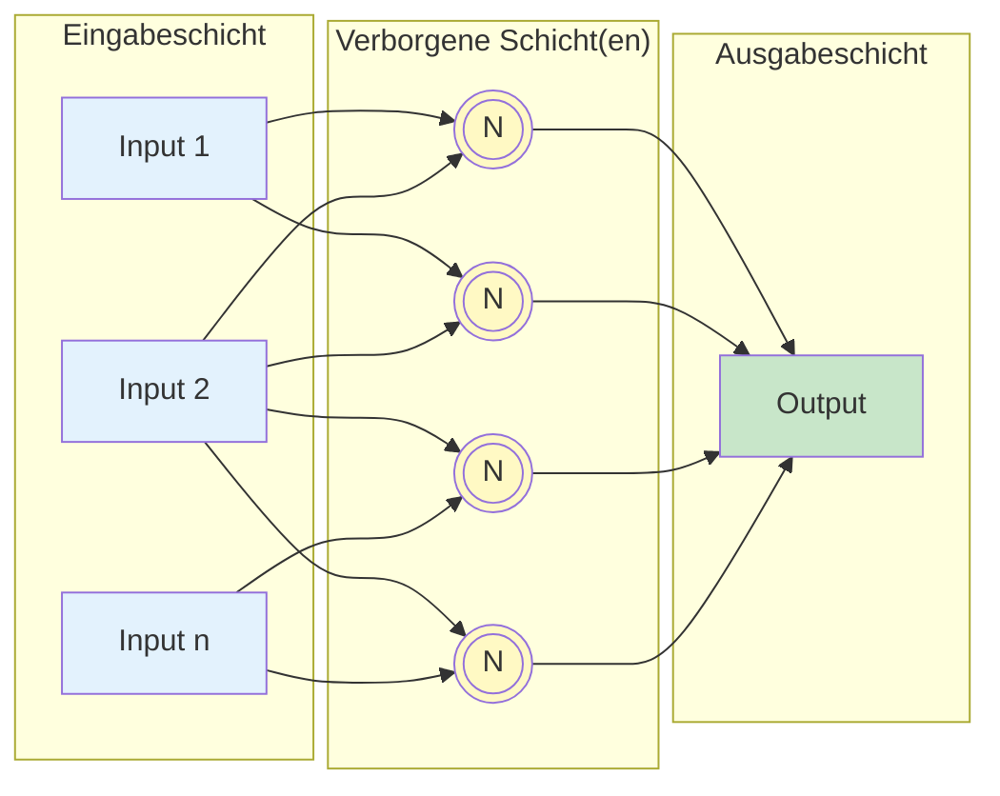
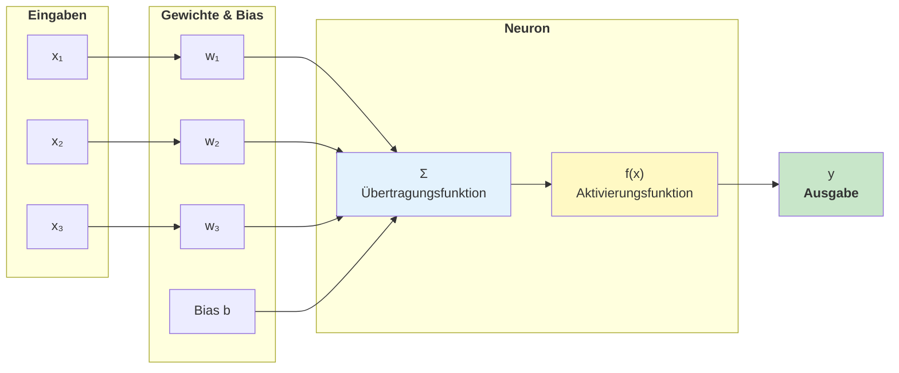
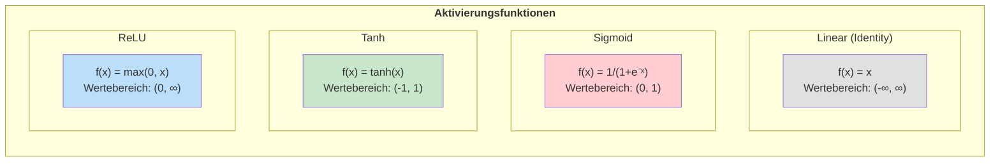
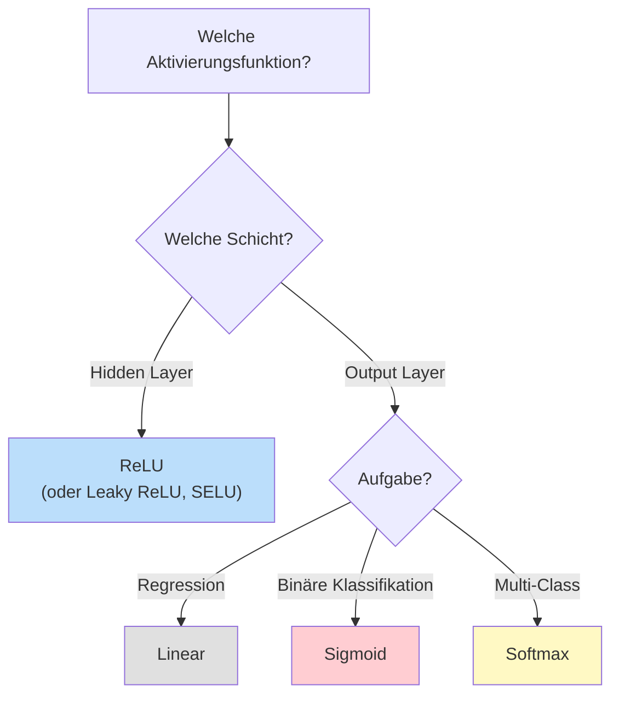
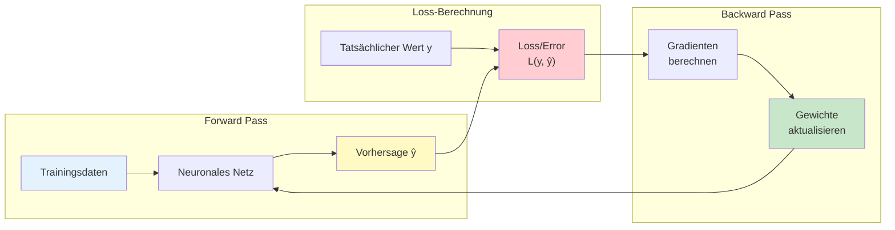
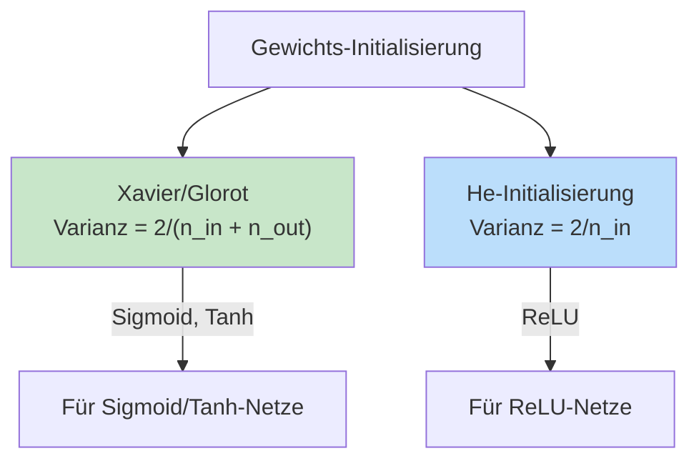
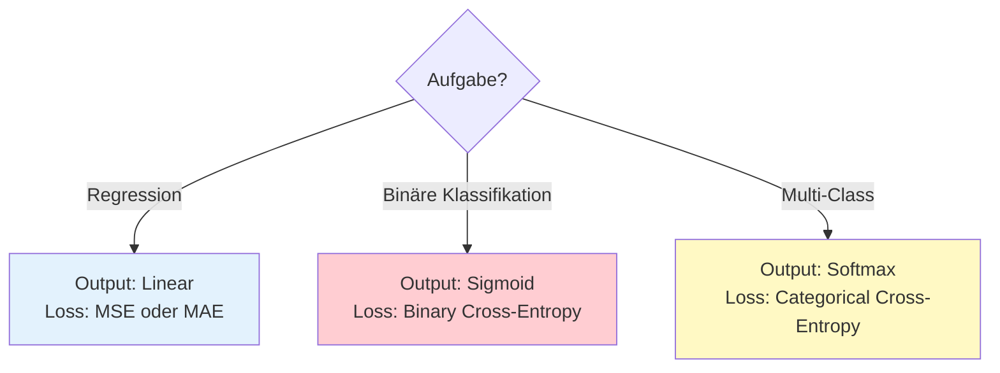

# Neuronale Netze
{: .no_toc }

> **Künstliche neuronale Netze (KNN) sind dem biologischen Nervensystem nachempfundene Modelle, die komplexe nichtlineare Zusammenhänge zwischen Ein- und Ausgaben lernen können. Sie bilden das Fundament moderner Deep-Learning-Systeme.**

---

## Inhaltsverzeichnis
{: .no_toc .text-delta }

1. TOC
{:toc}

---

## Überblick

Künstliche neuronale Netze (englisch: Artificial Neural Networks, ANN) sind Netze aus künstlichen Neuronen, die nach dem biologischen Vorbild des Nervensystems modelliert sind. Sie können sowohl für **Klassifikation** als auch für **Regression** eingesetzt werden.

### Grundlegende Bestandteile

Ein neuronales Netz besteht aus:

| Komponente            | Beschreibung                        | Funktion                                        |
| --------------------- | ----------------------------------- | ----------------------------------------------- |
| **Neuronen/Knoten**   | Grundbausteine des Netzwerks        | Verarbeiten Eingaben und erzeugen Ausgaben      |
| **Verbindungen**      | Gewichtete Kanten zwischen Neuronen | Übertragen Signale mit unterschiedlicher Stärke |
| **Schichten (Layer)** | Gruppierte Neuronen                 | Input → Hidden → Output                         |

---

## Aufbau eines Neuronalen Netzes

Ein künstliches Neuron kann durch vier Basiselemente beschrieben werden:

### Die vier Grundelemente

| Element | Beschreibung | Mathematisch |
|---------|--------------|--------------|
| **Gewichtung (Weights)** | Jeder Eingang erhält ein Gewicht, das den Einfluss der Eingabe bestimmt | w₁, w₂, ..., wₙ |
| **Bias** | Konstante additive Komponente, die den Schwellenwert verschiebt | b |
| **Übertragungsfunktion** | Berechnet die gewichtete Summe aller Eingaben | z = Σ(wᵢ · xᵢ) + b |
| **Aktivierungsfunktion** | Transformiert die Summe in die Ausgabe | y = f(z) |

---

## Aktivierungsfunktionen

Die Aktivierungsfunktion bestimmt den möglichen Wertebereich der Ausgabe eines Neurons. Ohne Aktivierungsfunktionen wäre ein tiefes Netzwerk mathematisch äquivalent zu einem einfachen linearen Modell.

### Übersicht der wichtigsten Aktivierungsfunktionen

| Funktion | Formel | Wertebereich | Typischer Einsatz |
|----------|--------|--------------|-------------------|
| **Linear (Identity)** | f(x) = x | (-∞, ∞) | Output-Layer bei Regression |
| **Sigmoid** | f(x) = 1/(1+e⁻ˣ) | (0, 1) | Binäre Klassifikation (Output) |
| **Tanh** | f(x) = tanh(x) | (-1, 1) | Hidden Layers, RNNs |
| **ReLU** | f(x) = max(0, x) | [0, ∞) | Hidden Layers (Standard) |
| **Softmax** | f(xᵢ) = eˣⁱ/Σeˣʲ | (0, 1), Summe = 1 | Multi-Class Klassifikation (Output) |

### Wann welche Aktivierungsfunktion?

---

## Training: Forward und Backward Pass

Das Training eines neuronalen Netzes erfolgt in zwei Phasen, die iterativ wiederholt werden:

### Der Trainingszyklus

1. **Forward Pass**: Eingabedaten werden durch das Netz propagiert → Vorhersage
2. **Loss-Berechnung**: Abweichung zwischen Vorhersage und tatsächlichem Wert
3. **Backward Pass**: Gradienten werden rückwärts durch das Netz berechnet
4. **Update**: Gewichte werden angepasst, um den Loss zu minimieren

 

---

## Initialisierung der Gewichte

Die Wahl der initialen Gewichte hat großen Einfluss auf das Training. Schlechte Initialisierung kann zu langsamer Konvergenz oder gar keinem Lernen führen.

### Probleme bei falscher Initialisierung

| Problem | Ursache | Konsequenz |
|---------|---------|------------|
| **Nullgewichte** | Alle Gewichte = 0 | Neuronen bleiben inaktiv |
| **Zu große Werte** | Gewichte >> 1 | Sättigung der Aktivierungsfunktion |
| **Symmetrische Gewichte** | Alle Gewichte identisch | Neuronen lernen dasselbe |

### Moderne Initialisierungsmethoden

---

## Loss Functions

Die Loss-Funktion (Verlustfunktion) quantifiziert, wie weit die Vorhersagen des Modells von den tatsächlichen Werten abweichen. Sie ist das Optimierungsziel beim Training.

### Übersicht: Aufgabe → Loss Function

| Aufgabe | Loss Function | Beschreibung |
|---------|---------------|--------------|
| **Regression** | MSE (Mean Squared Error) | Mittlerer quadratischer Fehler |
| **Regression** | MAE (Mean Absolute Error) | Mittlerer absoluter Fehler |
| **Binäre Klassifikation** | Binary Cross-Entropy | Logarithmischer Verlust für 2 Klassen |
| **Multi-Class Klassifikation** | Categorical Cross-Entropy | Logarithmischer Verlust für n Klassen |

### Kombinationen: Aktivierung + Loss

### Empfohlene Kombinationen für Supervised Learning

 

---

## Kombinationen für Unsupervised Learning

Neuronale Netze werden auch im unüberwachten Lernen eingesetzt:

| Use Case | Hidden Aktivierung | Output Aktivierung | Loss Function |
|----------|-------------------|-------------------|---------------|
| **Clustering** | ReLU, Leaky ReLU | Softmax | KL-Divergenz, Cosine Similarity |
| **Anomalieerkennung** | ReLU, Tanh, Sigmoid | Sigmoid | MSE, Binary Cross-Entropy |
| **Dimensionsreduktion** | ReLU, Leaky ReLU, Tanh | Linear, Sigmoid | MSE |
| **Generative Modelle (GAN)** | Leaky ReLU, SELU | Tanh (Generator), Sigmoid (Discriminator) | Binary Cross-Entropy |

---

## Best Practices

### Checkliste für neuronale Netze

- [ ] **Daten normalisieren**: StandardScaler oder MinMaxScaler verwenden
- [ ] **Passende Architektur**: Starte klein, erweitere bei Bedarf
- [ ] **ReLU in Hidden Layers**: Standard-Wahl für die meisten Aufgaben
- [ ] **Passende Output-Aktivierung**: Sigmoid (binär), Softmax (multi-class), Linear (Regression)
- [ ] **Passende Loss-Funktion**: Muss zur Aufgabe passen
- [ ] **Gewichtsinitialisierung**: He für ReLU, Xavier für Sigmoid/Tanh

### Häufige Fehler vermeiden

| Fehler | Problem | Lösung |
|--------|---------|--------|
| Sigmoid in allen Hidden Layers | Vanishing Gradients | ReLU verwenden |
| Softmax für binäre Klassifikation | Unnötige Komplexität | Sigmoid verwenden |
| Linear-Aktivierung in Hidden Layers | Keine Nichtlinearität | ReLU, Tanh verwenden |
| Falsche Loss-Funktion | Training konvergiert nicht | Loss an Aufgabe anpassen |
| Zu große Lernrate | Training instabil | Lernrate reduzieren |

---

**Version:** 1.0    
**Stand:** Januar 2026    
**Kurs:** Machine Learning. Verstehen. Anwenden. Gestalten.    