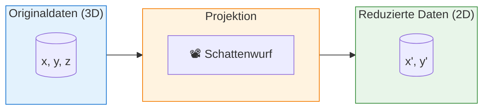
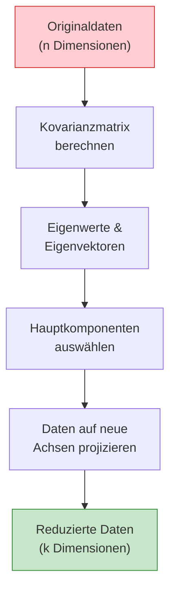
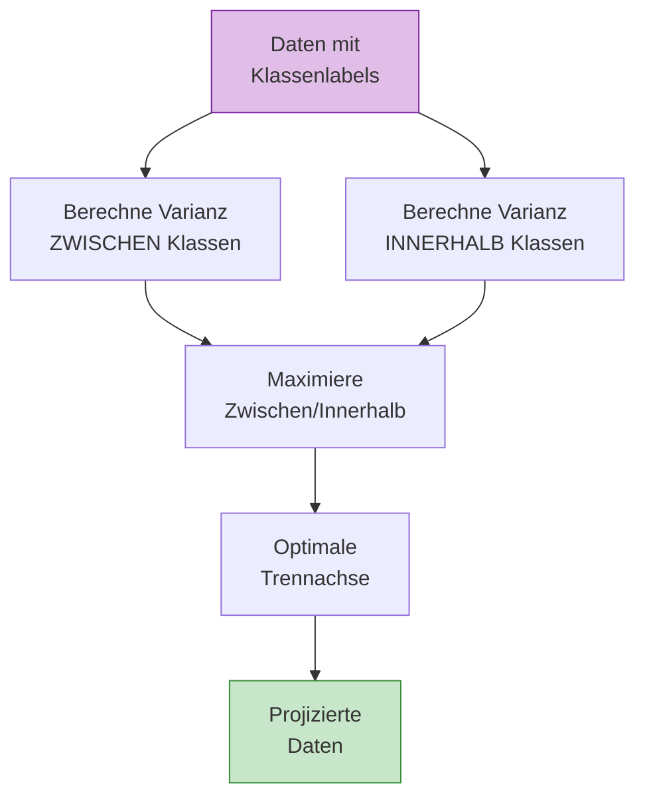
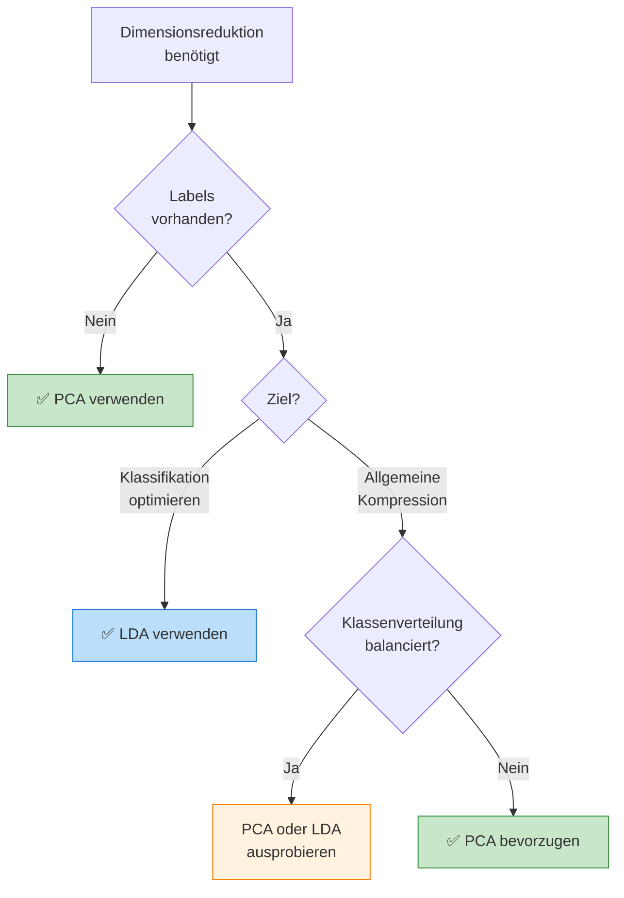
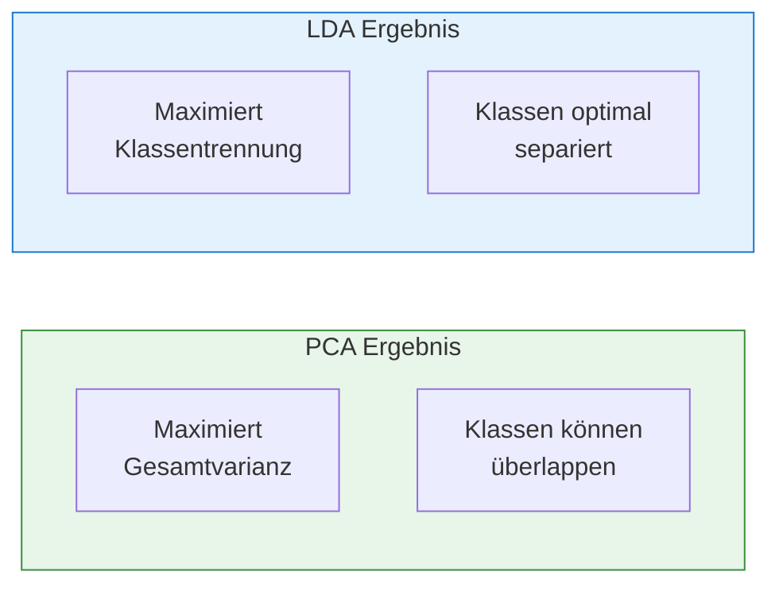
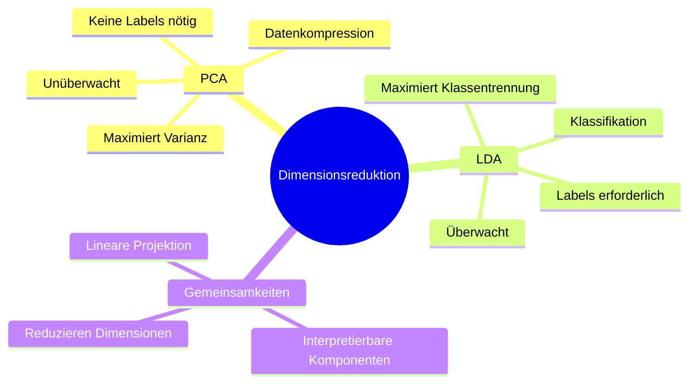

# PCA und LDA
{: .no_toc }

> **Dimensionsreduktion ist eine Schlüsseltechnik im Machine Learning, um hochdimensionale Daten auf ihre wesentlichen Merkmale zu reduzieren. PCA und LDA sind zwei fundamentale Ansätze, die unterschiedliche Ziele verfolgen: PCA maximiert die Varianz, während LDA die Klassentrennung optimiert.**

---

## Inhaltsverzeichnis
{: .no_toc .text-delta }

1. TOC
{:toc}

---

## Grundprinzip: Dimensionsreduktion durch Projektion

Die Projektion ist eine mathematische Funktion, die Datenpunkte so transformiert, dass sie mit weniger Komponenten beschreibbar werden. Das Konzept lässt sich anschaulich mit einem Schattenwurf vergleichen.



**Kernidee:** Ein dreidimensionaler Punkt kann als zweidimensionaler Punkt in einer Ebene dargestellt werden – ähnlich wie der Schatten eines Würfels auf einer Wand.

> **Beispiel**
>
> Stellen Sie sich einen Würfel vor, der von einer Lichtquelle beleuchtet wird. Der Schatten auf der Wand ist eine 2D-Projektion der 3D-Struktur. Dabei geht Information verloren, aber die wesentlichen Merkmale bleiben erhalten.

---

## Principal Component Analysis (PCA)

Die **Hauptkomponentenanalyse (PCA)** ist die am häufigsten verwendete Methode zur Dimensionsreduktion. Sie projiziert Datenpunkte in einen Unterraum mit weniger Dimensionen, wobei die **Varianz der Daten maximiert** wird.

### Funktionsweise



**Schrittweise Erklärung:**

1. **Varianzmaximierung:** Der Unterraum wird so gewählt, dass die Varianz der projizierten Datenpunkte maximal ist
2. **Erste Hauptkomponente:** Eine Gerade durch die Daten, welche die Varianz der orthogonal projizierten Punkte maximiert
3. **Weitere Komponenten:** Jede zusätzliche Achse steht senkrecht zur vorherigen und erklärt die verbleibende Varianz

### Eigenschaften von PCA

| Eigenschaft | Beschreibung |
|-------------|--------------|
| **Lerntyp** | Unüberwacht (keine Labels erforderlich) |
| **Ziel** | Maximierung der Gesamtvarianz |
| **Interpretierbarkeit** | Neue Achsen sind interpretierbar |
| **Anwendung** | Datenkompression, Visualisierung, Rauschreduktion |

### Implementierung mit scikit-learn

```python
from sklearn.preprocessing import StandardScaler
from sklearn.decomposition import PCA
import numpy as np

# Beispieldaten (Wichtig: Vor PCA standardisieren!)
scaler = StandardScaler()
data_scaled = scaler.fit_transform(data)

# PCA mit 2 Komponenten
pca = PCA(n_components=2)
data_pca = pca.fit_transform(data_scaled)

# Erklärte Varianz pro Komponente
print("Erklärte Varianz:", pca.explained_variance_ratio_)
print("Kumulierte Varianz:", np.cumsum(pca.explained_variance_ratio_))
```

### Bestimmung der Komponentenanzahl

Die optimale Anzahl der Hauptkomponenten wird oft über die **erklärte Varianz** bestimmt:

```python
from sklearn.decomposition import PCA
import matplotlib.pyplot as plt

# PCA mit allen Komponenten
pca_full = PCA()
pca_full.fit(data_scaled)

# Scree Plot erstellen
plt.figure(figsize=(10, 5))

plt.subplot(1, 2, 1)
plt.bar(range(1, len(pca_full.explained_variance_ratio_) + 1), 
        pca_full.explained_variance_ratio_)
plt.xlabel('Hauptkomponente')
plt.ylabel('Erklärte Varianz')
plt.title('Scree Plot')

plt.subplot(1, 2, 2)
plt.plot(range(1, len(pca_full.explained_variance_ratio_) + 1), 
         np.cumsum(pca_full.explained_variance_ratio_), 'bo-')
plt.axhline(y=0.95, color='r', linestyle='--', label='95% Varianz')
plt.xlabel('Anzahl Komponenten')
plt.ylabel('Kumulierte erklärte Varianz')
plt.title('Kumulierte Varianz')
plt.legend()

plt.tight_layout()
plt.show()
```

> **Faustregel**
>
> Wählen Sie die Anzahl der Komponenten so, dass mindestens **95% der Gesamtvarianz** erklärt wird. Der "Ellenbogen" im Scree Plot zeigt oft einen guten Kompromiss.

---

## Linear Discriminant Analysis (LDA)

Die **Lineare Diskriminanzanalyse (LDA)** ist eine überwachte Methode zur Dimensionsreduktion. Im Gegensatz zu PCA nutzt LDA die **Klasseninformationen**, um eine optimale Trennung zwischen den Klassen zu finden.

### Funktionsweise



**Kernidee:** LDA sucht nach linearen Kombinationen der Merkmale, die:
- Die **Varianz zwischen den Klassen** maximieren
- Die **Varianz innerhalb jeder Klasse** minimieren

### Eigenschaften von LDA

| Eigenschaft | Beschreibung |
|-------------|--------------|
| **Lerntyp** | Überwacht (Labels erforderlich) |
| **Ziel** | Maximierung der Klassentrennung |
| **Max. Komponenten** | Anzahl Klassen - 1 |
| **Anwendung** | Klassifikation, Vorverarbeitung |

### Implementierung mit scikit-learn

```python
from sklearn.discriminant_analysis import LinearDiscriminantAnalysis

# LDA benötigt Klassenlabels!
lda = LinearDiscriminantAnalysis(n_components=2)
data_lda = lda.fit_transform(data_scaled, target)

# LDA kann auch direkt zur Klassifikation verwendet werden
model = LinearDiscriminantAnalysis()
model.fit(data_train, target_train)
target_pred = model.predict(data_test)

# Erklärte Varianz (bei LDA: zwischen-Klassen-Varianz)
print("Erklärte Varianz:", lda.explained_variance_ratio_)
```

---

## Vergleich: PCA vs. LDA

Die Wahl zwischen PCA und LDA hängt vom Anwendungsfall und den verfügbaren Daten ab.



### Gegenüberstellung

| Kriterium | PCA | LDA |
|-----------|-----|-----|
| **Lerntyp** | Unüberwacht | Überwacht |
| **Ziel** | Maximierung der Gesamtvarianz | Maximierung der Klassentrennung |
| **Labels erforderlich** | ❌ Nein | ✅ Ja |
| **Max. Komponenten** | min(n_samples, n_features) | n_classes - 1 |
| **Overfitting-Risiko** | Gering | Höher (bei wenig Daten) |
| **Interpretierbarkeit** | Hoch | Moderat |
| **Typische Anwendung** | Datenkompression, Visualisierung | Klassifikation, Vorverarbeitung |

### Visuelle Unterschiede



---

## Praktisches Beispiel: PCA vs. LDA

```python
from sklearn.datasets import load_iris
from sklearn.preprocessing import StandardScaler
from sklearn.decomposition import PCA
from sklearn.discriminant_analysis import LinearDiscriminantAnalysis
import matplotlib.pyplot as plt

# Daten laden
iris = load_iris()
data = iris.data
target = iris.target

# Standardisierung
scaler = StandardScaler()
data_scaled = scaler.fit_transform(data)

# PCA und LDA anwenden
pca = PCA(n_components=2)
lda = LinearDiscriminantAnalysis(n_components=2)

data_pca = pca.fit_transform(data_scaled)
data_lda = lda.fit_transform(data_scaled, target)

# Visualisierung
fig, axes = plt.subplots(1, 2, figsize=(14, 5))

# PCA Plot
for i, label in enumerate(iris.target_names):
    mask = target == i
    axes[0].scatter(data_pca[mask, 0], data_pca[mask, 1], label=label, alpha=0.7)
axes[0].set_xlabel('PC1')
axes[0].set_ylabel('PC2')
axes[0].set_title('PCA - Maximiert Varianz')
axes[0].legend()

# LDA Plot
for i, label in enumerate(iris.target_names):
    mask = target == i
    axes[1].scatter(data_lda[mask, 0], data_lda[mask, 1], label=label, alpha=0.7)
axes[1].set_xlabel('LD1')
axes[1].set_ylabel('LD2')
axes[1].set_title('LDA - Maximiert Klassentrennung')
axes[1].legend()

plt.tight_layout()
plt.show()

# Erklärte Varianz vergleichen
print(f"PCA - Erklärte Varianz: {pca.explained_variance_ratio_.sum():.2%}")
print(f"LDA - Erklärte Varianz: {lda.explained_variance_ratio_.sum():.2%}")
```

---

## Wann welche Methode verwenden?

### PCA empfohlen bei:

- Keine Klassenlabels vorhanden
- Ziel ist allgemeine Datenkompression
- Visualisierung hochdimensionaler Daten
- Rauschreduktion gewünscht
- Vorverarbeitung für unüberwachtes Lernen

### LDA empfohlen bei:

- Klassenlabels verfügbar
- Nachfolgende Klassifikationsaufgabe
- Klassen sollen optimal getrennt werden
- Wenige Klassen im Verhältnis zu Features
- Klassenverteilung einigermaßen balanciert

> **Best Practice**
>
> In der Praxis werden PCA und LDA oft kombiniert: Zuerst reduziert PCA die Dimensionen auf ein handhabbares Maß, dann optimiert LDA die Klassentrennung in diesem reduzierten Raum.

---

## Zusammenfassung



| Aspekt | PCA | LDA |
|--------|-----|-----|
| **Kernfrage** | "Welche Richtung erklärt die meiste Variation?" | "Welche Richtung trennt die Klassen am besten?" |
| **Stärke** | Universell einsetzbar | Optimal für Klassifikation |
| **Schwäche** | Ignoriert Klassenzugehörigkeit | Braucht Labels, max. k-1 Komponenten |


---

**Version:** 1.0    
**Stand:** Januar 2026    
**Kurs:** Machine Learning. Verstehen. Anwenden. Gestalten.    