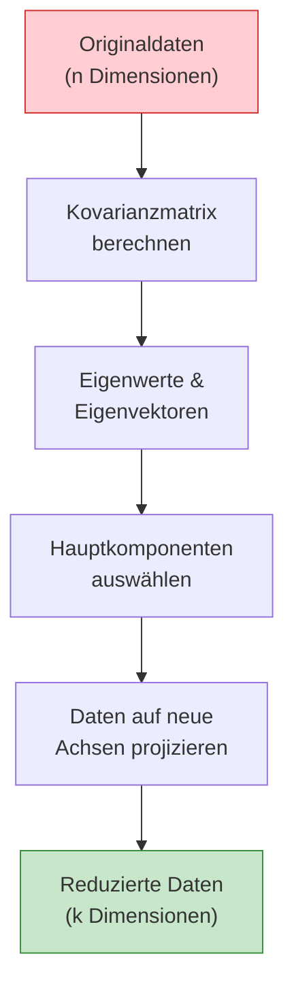
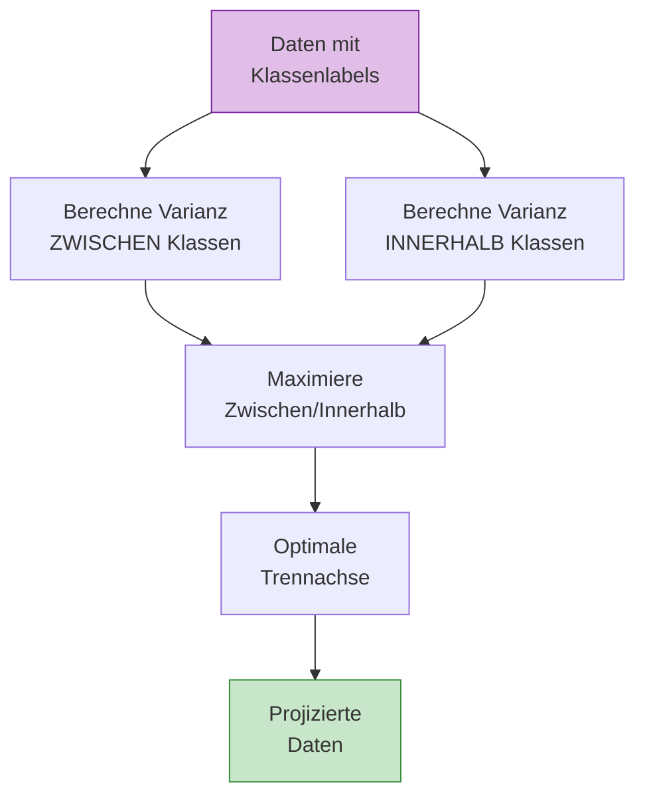
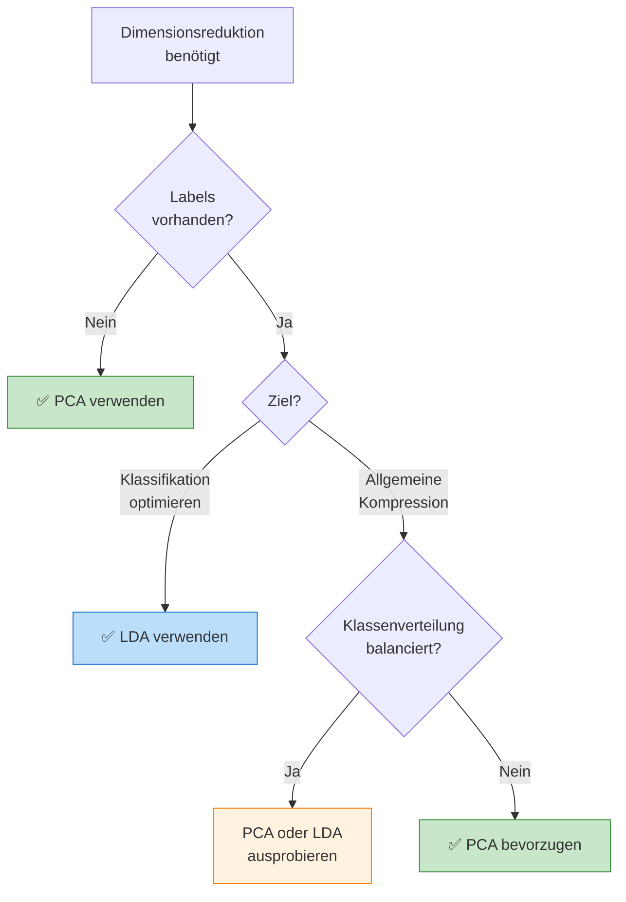
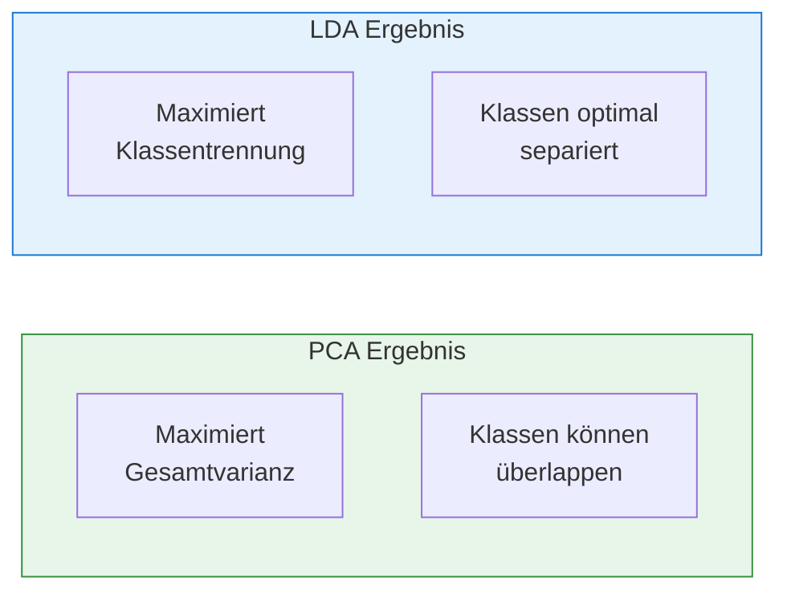
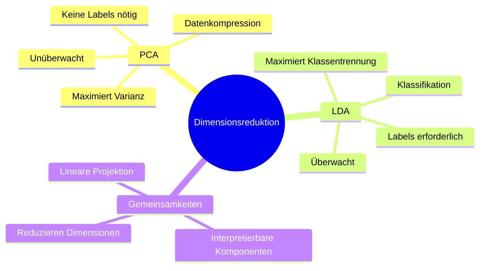

# PCA und LDA
{: .no_toc }

> **Dimensionsreduktion ist eine Schlüsseltechnik im Machine Learning, um hochdimensionale Daten auf ihre wesentlichen Merkmale zu reduzieren.**
> PCA und LDA sind zwei fundamentale Ansätze, die unterschiedliche Ziele verfolgen: PCA maximiert die Varianz, während LDA die Klassentrennung optimiert.

---

## Inhaltsverzeichnis
{: .no_toc .text-delta }

1. TOC
{:toc}

---

## Grundidee

### Das Problem: Zu viele Informationen

Heutzutage werden enorme Datenmengen gesammelt. Für das Training von KI-Systemen ist das einerseits gut, da mehr Daten oft zu besseren Ergebnissen führen. Andererseits benötigen diese riesigen Mengen extrem viel **Speicherplatz und Rechenzeit**, was besonders bei Echtzeitanwendungen zum Problem wird.

### Die Lösung: Dimensionsreduktion

Anstatt einfach Datenpunkte (Beispiele) zu löschen, verringert man bei der **Dimensionsreduktion** die Anzahl der **Merkmale** (Dimensionen). Es gibt zwei Wege, dies zu tun:

1. **Merkmalsauswahl**: Man pickt sich nur einen Teil der vorhandenen Merkmale heraus.
2. **Merkmalsprojektion**: Man rechnet alle Merkmale so um, dass sie durch weniger, neue Merkmale beschrieben werden können. Die **PCA** oder LDA gehört zu dieser zweiten Kategorie.

### Wie funktioniert die PCA? (Das Schatten-Beispiel)

Das Prinzip der PCA lässt sich vereinfacht mit einem **Schattenwurf** erklären:

- Stellen Sie sich einen dreidimensionalen Würfel vor. Wenn man ihn mit einer Taschenlampe anstrahlt, wirft er einen zweidimensionalen Schatten auf den Boden.
- Der Schatten ist eine **Projektion** des Würfels: Er hat weniger Dimensionen (2D statt 3D), zeigt aber immer noch die wesentlichen Eigenschaften des Objekts.
- Die PCA sucht nun genau den Winkel („die beste Lichtquelle“), bei dem der Schatten die meiste Information des Originals beibehält. Mathematisch bedeutet das, dass die **Varianz** (die Streuung der Daten) im Schattenwurf maximal sein soll.

### Hauptkomponenten und Nutzen

- **Hauptkomponenten**: Dies sind die neuen Koordinatenachsen, auf die die Daten projiziert werden. Die erste Hauptkomponente zeigt immer in die Richtung der größten Streuung.
- **Vorteile**: Neben der Ersparnis von Rechenzeit und Speicher kann die PCA auch dabei helfen, unerwünschtes **Rauschen** (Störsignale) in den Daten zu unterdrücken.
- **Risiko**: Man muss vorsichtig sein. In manchen Fällen kann die Reduktion dazu führen, dass verschiedene Datenklassen (zum Beispiel unterschiedliche Pflanzentypen) so stark überlappen, dass man sie nach der PCA nicht mehr voneinander unterscheiden kann.

Zusammenfassend ist die PCA also eine Methode, um die **Komplexität von Daten zu verringern**, indem man sie auf ihre wichtigsten Bestandteile reduziert, ähnlich wie ein aussagekräftiger Schatten ein komplexes Objekt vereinfacht darstellt.

---

[PCA - Eine Methode zur Dimensionsreduktion » Lamarr-Institut](https://lamarr-institute.org/de/blog/dimensionsreduktion-pca/)

---

## Principal Component Analysis (PCA)

Die **Hauptkomponentenanalyse (PCA)** ist die am häufigsten verwendete Methode zur Dimensionsreduktion. Sie projiziert Datenpunkte in einen Unterraum mit weniger Dimensionen, wobei die **Varianz der Daten maximiert** wird.

### Funktionsweise

**Schrittweise Erklärung:**

1. **Varianzmaximierung:** Der Unterraum wird so gewählt, dass die Varianz der projizierten Datenpunkte maximal ist
2. **Erste Hauptkomponente:** Eine Gerade durch die Daten, welche die Varianz der orthogonal projizierten Punkte maximiert
3. **Weitere Komponenten:** Jede zusätzliche Achse steht senkrecht zur vorherigen und erklärt die verbleibende Varianz

### Eigenschaften von PCA

| Eigenschaft             | Beschreibung                                      |
| ----------------------- | ------------------------------------------------- |
| **Lerntyp**             | Unüberwacht (keine Labels erforderlich)           |
| **Ziel**                | Maximierung der Gesamtvarianz                     |
| **Interpretierbarkeit** | Neue Achsen sind interpretierbar                  |
| **Anwendung**           | Datenkompression, Visualisierung, Rauschreduktion |

---

 *Beispiel Use Case "Cancer": siehe b240_ul_pca_special.ipynb*

---

## Linear Discriminant Analysis (LDA)

Die **Lineare Diskriminanzanalyse (LDA)** ist eine überwachte Methode zur Dimensionsreduktion. Im Gegensatz zu PCA nutzt LDA die **Klasseninformationen**, um eine optimale Trennung zwischen den Klassen zu finden.

### Funktionsweise

**Kernidee:** LDA sucht nach linearen Kombinationen der Merkmale, die:
- Die **Varianz zwischen den Klassen** maximieren
- Die **Varianz innerhalb jeder Klasse** minimieren

### Eigenschaften von LDA

| Eigenschaft | Beschreibung |
|-------------|--------------|
| **Lerntyp** | Überwacht (Labels erforderlich) |
| **Ziel** | Maximierung der Klassentrennung |
| **Max. Komponenten** | Anzahl Klassen - 1 |
| **Anwendung** | Klassifikation, Vorverarbeitung |

---

## Vergleich: PCA vs. LDA

Die Wahl zwischen PCA und LDA hängt vom Anwendungsfall und den verfügbaren Daten ab.

### Gegenüberstellung

| Kriterium | PCA | LDA |
|-----------|-----|-----|
| **Lerntyp** | Unüberwacht | Überwacht |
| **Ziel** | Maximierung der Gesamtvarianz | Maximierung der Klassentrennung |
| **Labels erforderlich** | ❌ Nein | ✅ Ja |
| **Max. Komponenten** | min(n_samples, n_features) | n_classes - 1 |
| **Overfitting-Risiko** | Gering | Höher (bei wenig Daten) |
| **Interpretierbarkeit** | Hoch | Moderat |
| **Typische Anwendung** | Datenkompression, Visualisierung | Klassifikation, Vorverarbeitung |

### Visuelle Unterschiede

---

## Wann welche Methode verwenden?

### PCA empfohlen bei:

- Keine Klassenlabels vorhanden
- Ziel ist allgemeine Datenkompression
- Visualisierung hochdimensionaler Daten
- Rauschreduktion gewünscht
- Vorverarbeitung für unüberwachtes Lernen

### LDA empfohlen bei:

- Klassenlabels verfügbar
- Nachfolgende Klassifikationsaufgabe
- Klassen sollen optimal getrennt werden
- Wenige Klassen im Verhältnis zu Features
- Klassenverteilung einigermaßen balanciert

> **Best Practice**
>
> In der Praxis werden PCA und LDA oft kombiniert: Zuerst reduziert PCA die Dimensionen auf ein handhabbares Maß, dann optimiert LDA die Klassentrennung in diesem reduzierten Raum.

---

## Zusammenfassung

| Aspekt | PCA | LDA |
|--------|-----|-----|
| **Kernfrage** | "Welche Richtung erklärt die meiste Variation?" | "Welche Richtung trennt die Klassen am besten?" |
| **Stärke** | Universell einsetzbar | Optimal für Klassifikation |
| **Schwäche** | Ignoriert Klassenzugehörigkeit | Braucht Labels, max. k-1 Komponenten |

---

**Version:** 1.0    
**Stand:** Januar 2026    
**Kurs:** Machine Learning. Verstehen. Anwenden. Gestalten.    