# PCA und LDA
{: .no_toc }

> **Dimensionsreduktion ist eine Schlüsseltechnik im Machine Learning, um hochdimensionale Daten auf ihre wesentlichen Merkmale zu reduzieren.**
> PCA und LDA sind zwei fundamentale Ansätze, die unterschiedliche Ziele verfolgen: PCA maximiert die Varianz, während LDA die Klassentrennung optimiert.

---

## Inhaltsverzeichnis
{: .no_toc .text-delta }

1. TOC
{:toc}

---

## Grundprinzip: Dimensionsreduktion durch Projektion

Die Projektion ist eine mathematische Funktion, die Datenpunkte so transformiert, dass sie mit weniger Komponenten beschreibbar werden. Das Konzept lässt sich anschaulich mit einem Schattenwurf vergleichen.

```mermaid
flowchart LR
    subgraph original["Originaldaten (3D)"]
        A[("x, y, z")]
    end
    
    subgraph projektion["Projektion"]
        P["📽️ Schattenwurf"]
    end
    
    subgraph reduziert["Reduzierte Daten (2D)"]
        B[("x', y'")]
    end
    
    original --> projektion --> reduziert
    
    style original fill:#e3f2fd,stroke:#1976d2
    style reduziert fill:#e8f5e9,stroke:#388e3c
    style projektion fill:#fff3e0,stroke:#f57c00
```

**Kernidee:** Ein dreidimensionaler Punkt kann als zweidimensionaler Punkt in einer Ebene dargestellt werden – ähnlich wie der Schatten eines Würfels auf einer Wand.

> **Beispiel**
>
> Stellen Sie sich einen Würfel vor, der von einer Lichtquelle beleuchtet wird. Der Schatten auf der Wand ist eine 2D-Projektion der 3D-Struktur. Dabei geht Information verloren, aber die wesentlichen Merkmale bleiben erhalten.

---

## Principal Component Analysis (PCA)

Die **Hauptkomponentenanalyse (PCA)** ist die am häufigsten verwendete Methode zur Dimensionsreduktion. Sie projiziert Datenpunkte in einen Unterraum mit weniger Dimensionen, wobei die **Varianz der Daten maximiert** wird.

### Funktionsweise

```mermaid
flowchart TD
    A["Originaldaten<br/>(n Dimensionen)"] --> B["Kovarianzmatrix<br/>berechnen"]
    B --> C["Eigenwerte &<br/>Eigenvektoren"]
    C --> D["Hauptkomponenten<br/>auswählen"]
    D --> E["Daten auf neue<br/>Achsen projizieren"]
    E --> F["Reduzierte Daten<br/>(k Dimensionen)"]
    
    style A fill:#ffcdd2,stroke:#d32f2f
    style F fill:#c8e6c9,stroke:#388e3c
```

**Schrittweise Erklärung:**

1. **Varianzmaximierung:** Der Unterraum wird so gewählt, dass die Varianz der projizierten Datenpunkte maximal ist
2. **Erste Hauptkomponente:** Eine Gerade durch die Daten, welche die Varianz der orthogonal projizierten Punkte maximiert
3. **Weitere Komponenten:** Jede zusätzliche Achse steht senkrecht zur vorherigen und erklärt die verbleibende Varianz

### Eigenschaften von PCA

| Eigenschaft | Beschreibung |
|-------------|--------------|
| **Lerntyp** | Unüberwacht (keine Labels erforderlich) |
| **Ziel** | Maximierung der Gesamtvarianz |
| **Interpretierbarkeit** | Neue Achsen sind interpretierbar |
| **Anwendung** | Datenkompression, Visualisierung, Rauschreduktion |

---

## Linear Discriminant Analysis (LDA)

Die **Lineare Diskriminanzanalyse (LDA)** ist eine überwachte Methode zur Dimensionsreduktion. Im Gegensatz zu PCA nutzt LDA die **Klasseninformationen**, um eine optimale Trennung zwischen den Klassen zu finden.

### Funktionsweise

**Kernidee:** LDA sucht nach linearen Kombinationen der Merkmale, die:
- Die **Varianz zwischen den Klassen** maximieren
- Die **Varianz innerhalb jeder Klasse** minimieren

### Eigenschaften von LDA

| Eigenschaft | Beschreibung |
|-------------|--------------|
| **Lerntyp** | Überwacht (Labels erforderlich) |
| **Ziel** | Maximierung der Klassentrennung |
| **Max. Komponenten** | Anzahl Klassen - 1 |
| **Anwendung** | Klassifikation, Vorverarbeitung |

---

## Vergleich: PCA vs. LDA

Die Wahl zwischen PCA und LDA hängt vom Anwendungsfall und den verfügbaren Daten ab.

### Gegenüberstellung

| Kriterium | PCA | LDA |
|-----------|-----|-----|
| **Lerntyp** | Unüberwacht | Überwacht |
| **Ziel** | Maximierung der Gesamtvarianz | Maximierung der Klassentrennung |
| **Labels erforderlich** | ❌ Nein | ✅ Ja |
| **Max. Komponenten** | min(n_samples, n_features) | n_classes - 1 |
| **Overfitting-Risiko** | Gering | Höher (bei wenig Daten) |
| **Interpretierbarkeit** | Hoch | Moderat |
| **Typische Anwendung** | Datenkompression, Visualisierung | Klassifikation, Vorverarbeitung |

### Visuelle Unterschiede

---

## Wann welche Methode verwenden?

### PCA empfohlen bei:

- Keine Klassenlabels vorhanden
- Ziel ist allgemeine Datenkompression
- Visualisierung hochdimensionaler Daten
- Rauschreduktion gewünscht
- Vorverarbeitung für unüberwachtes Lernen

### LDA empfohlen bei:

- Klassenlabels verfügbar
- Nachfolgende Klassifikationsaufgabe
- Klassen sollen optimal getrennt werden
- Wenige Klassen im Verhältnis zu Features
- Klassenverteilung einigermaßen balanciert

> **Best Practice**
>
> In der Praxis werden PCA und LDA oft kombiniert: Zuerst reduziert PCA die Dimensionen auf ein handhabbares Maß, dann optimiert LDA die Klassentrennung in diesem reduzierten Raum.

---

## Zusammenfassung

```mermaid
mindmap
  root((Dimensionsreduktion))
    PCA
      Unüberwacht
      Maximiert Varianz
      Keine Labels nötig
      Datenkompression
    LDA
      Überwacht
      Maximiert Klassentrennung
      Labels erforderlich
      Klassifikation
    Gemeinsamkeiten
      Lineare Projektion
      Reduzieren Dimensionen
      Interpretierbare Komponenten
```

| Aspekt | PCA | LDA |
|--------|-----|-----|
| **Kernfrage** | "Welche Richtung erklärt die meiste Variation?" | "Welche Richtung trennt die Klassen am besten?" |
| **Stärke** | Universell einsetzbar | Optimal für Klassifikation |
| **Schwäche** | Ignoriert Klassenzugehörigkeit | Braucht Labels, max. k-1 Komponenten |

---

**Version:** 1.0    
**Stand:** Januar 2026    
**Kurs:** Machine Learning. Verstehen. Anwenden. Gestalten.    