# Random Forest
{: .no_toc }

> **Random Forest ist ein Ensemble-Algorithmus, der multiple Entscheidungsbäume kombiniert, um robuste und genaue Vorhersagen zu treffen. Durch Bagging und Feature-Randomisierung reduziert er Overfitting und liefert zuverlässige Ergebnisse für Klassifikation und Regression.**

---

# Inhaltsverzeichnis
{: .no_toc .text-delta }

1. TOC
{:toc}

---

## Grundkonzept

Random Forest ist eine **Ensemble-Methode**, die mehrere Entscheidungsbäume zu einem leistungsfähigen Gesamtmodell kombiniert. Der Name leitet sich aus der Kombination zweier Konzepte ab:

- **Random**: Zufällige Auswahl von Daten und Features
- **Forest**: Sammlung (Wald) von Entscheidungsbäumen

```mermaid
flowchart TD
    subgraph Trainingsdaten
        D[("Originaldatensatz")]
    end
    
    subgraph Bootstrap["Bootstrap Sampling"]
        B1["Stichprobe 1"]
        B2["Stichprobe 2"]
        B3["Stichprobe 3"]
        Bn["Stichprobe n"]
    end
    
    subgraph Forest["Random Forest"]
        T1["🌲 Baum 1"]
        T2["🌲 Baum 2"]
        T3["🌲 Baum 3"]
        Tn["🌲 Baum n"]
    end
    
    subgraph Aggregation
        V["Voting / Averaging"]
    end
    
    D --> B1
    D --> B2
    D --> B3
    D --> Bn
    
    B1 --> T1
    B2 --> T2
    B3 --> T3
    Bn --> Tn
    
    T1 --> V
    T2 --> V
    T3 --> V
    Tn --> V
    
    V --> P["Finale Vorhersage"]
    
    style D fill:#e1f5fe
    style V fill:#c8e6c9
    style P fill:#fff9c4
```



---

## Funktionsprinzip

### Bagging (Bootstrap Aggregating)

Random Forest nutzt das **Bagging-Prinzip**, bei dem jeder Baum auf einer zufälligen Stichprobe der Trainingsdaten trainiert wird:

1. **Bootstrap-Sampling**: Ziehen von Datenpunkten mit Zurücklegen
2. **Paralleles Training**: Jeder Baum wird unabhängig trainiert
3. **Aggregation**: Kombination der Einzelvorhersagen


### Feature-Randomisierung

An jedem Splitpunkt wird nur eine **zufällige Teilmenge der Features** betrachtet:

| Parameter | Typischer Wert | Beschreibung |
|-----------|----------------|--------------|
| Klassifikation | √m Features | Wurzel aus Gesamtzahl der Features |
| Regression | m/3 Features | Ein Drittel der Features |
| max_features | 'sqrt', 'log2', int | Scikit-learn Parameter |

Diese Randomisierung führt zu **dekorrellierten Bäumen**, was die Varianz des Ensembles reduziert.

---

## Vorhersage-Aggregation

```mermaid
flowchart TD
    subgraph Input["<b>Neuer Datenpunkt"]
        X["Features: x₁, x₂, ..., xₙ"]
    end
    
    subgraph Trees["<b>Individuelle Vorhersagen"]
        T1["Baum 1: Klasse A"]
        T2["Baum 2: Klasse B"]
        T3["Baum 3: Klasse A"]
        T4["Baum 4: Klasse A"]
        T5["Baum 5: Klasse B"]
    end
    
    subgraph Klassifikation["<b>Klassifikation: Majority Voting"]
        MV["A: 3 Stimmen ✓<br/>B: 2 Stimmen"]
    end
    
    subgraph Regression["<b>Regression: Mittelwert"]
        AVG["(y₁ + y₂ + y₃ + y₄ + y₅) / 5"]
    end
    
    X --> T1
    X --> T2
    X --> T3
    X --> T4
    X --> T5
    
    T1 --> MV
    T2 --> MV
    T3 --> MV
    T4 --> MV
    T5 --> MV
    
    MV --> Result1["Vorhersage: Klasse A"]
    AVG --> Result2["Vorhersage: ȳ"]
    
    style Input fill:#e1f5fe
    style Result1 fill:#c8e6c9
    style Result2 fill:#c8e6c9
```



| Aufgabe | Aggregationsmethode | Beschreibung |
|---------|---------------------|--------------|
| **Klassifikation** | Majority Voting | Häufigste Klasse gewinnt |
| **Regression** | Mittelwert/Median | Durchschnitt aller Vorhersagen |
| **Wahrscheinlichkeit** | Durchschnitt | Mittlere Wahrscheinlichkeit pro Klasse |

---


## Wichtige Hyperparameter


### Parameter-Übersicht

| Parameter | Default | Empfohlener Bereich | Effekt |
|-----------|---------|---------------------|--------|
| `n_estimators` | 100 | 100-500 | Mehr Bäume → stabilere Vorhersagen |
| `max_depth` | None | 5-30 | Begrenzt Komplexität, verhindert Overfitting |
| `min_samples_split` | 2 | 2-20 | Höher → konservativere Splits |
| `min_samples_leaf` | 1 | 1-10 | Mindestgröße der Blattknoten |
| `max_features` | 'sqrt' | 'sqrt', 'log2', 0.3-0.7 | Dekorrelation der Bäume |
| `bootstrap` | True | True/False | Bootstrap Sampling aktivieren |

---

## Feature Importance

Random Forest bietet eingebaute **Feature Importance** basierend auf der durchschnittlichen Reduktion der Unreinheit (Gini/Entropy):


---

## Out-of-Bag (OOB) Score

Durch Bootstrap-Sampling werden ca. **37% der Daten** pro Baum nicht verwendet. Diese können zur Validierung genutzt werden:

```python
model = RandomForestClassifier(
    n_estimators=100,
    oob_score=True,        # OOB Score aktivieren
    random_state=42,
    n_jobs=-1
)

model.fit(data_train, target_train)

print(f"OOB Score: {model.oob_score_:.4f}")
print(f"Test Score: {model.score(data_test, target_test):.4f}")
```

> **Vorteil**: OOB Score liefert eine Schätzung der Generalisierungsfähigkeit ohne zusätzlichen Validierungsdatensatz.

---


## Vor- und Nachteile

### Vorteile

| Vorteil | Erklärung |
|---------|-----------|
| ✅ **Robustheit** | Weniger anfällig für Overfitting als einzelne Bäume |
| ✅ **Keine Skalierung nötig** | Funktioniert mit Original-Features |
| ✅ **Gemischte Datentypen** | Verarbeitet numerische und kategoriale Features |
| ✅ **Feature Importance** | Eingebaute Bewertung der Feature-Relevanz |
| ✅ **Parallelisierbar** | Bäume können parallel trainiert werden |
| ✅ **OOB-Validierung** | Integrierte Cross-Validation |

### Nachteile

| Nachteil | Erklärung |
|----------|-----------|
| ❌ **Black Box** | Schwieriger zu interpretieren als einzelner Baum |
| ❌ **Speicherbedarf** | Viele Bäume benötigen viel Speicher |
| ❌ **Langsame Vorhersage** | Bei sehr vielen Bäumen |
| ❌ **Overfitting bei Rauschen** | Kann Rauschen in Daten überanpassen |
| ❌ **Extrapolation** | Kann nicht über Trainingsdatenbereich hinaus extrapolieren |

---

## Entscheidungshilfe: Wann Random Forest?

```mermaid
flowchart TD
    Start["Neues ML-Problem"] --> Q1{"Viele Features?"}
    
    Q1 -->|Ja| Q2{"Interpretierbarkeit<br/>wichtig?"}
    Q1 -->|Nein| Q3{"Kleine Datenmenge?"}
    
    Q2 -->|Sehr wichtig| DT["Decision Tree"]
    Q2 -->|Weniger wichtig| RF1["✅ Random Forest"]
    
    Q3 -->|Ja| RF2["✅ Random Forest<br/>(mit weniger Bäumen)"]
    Q3 -->|Nein| Q4{"Höchste Accuracy<br/>erforderlich?"}
    
    Q4 -->|Ja| XGB["XGBoost/LightGBM"]
    Q4 -->|Nein| RF3["✅ Random Forest"]
    
    style RF1 fill:#c8e6c9
    style RF2 fill:#c8e6c9
    style RF3 fill:#c8e6c9
    style DT fill:#fff9c4
    style XGB fill:#e1f5fe
```



---

## Best Practices

### Do's ✅

| Empfehlung | Begründung |
|------------|------------|
| Mit 100 Bäumen starten | Guter Kompromiss zwischen Performance und Trainingszeit |
| OOB Score nutzen | Schnelle Validierung ohne separaten Split |
| Feature Importance analysieren | Hilft beim Verständnis und Feature Selection |
| n_jobs=-1 setzen | Nutzt alle CPU-Kerne für paralleles Training |
| Cross-Validation verwenden | Robustere Evaluation als einfacher Train-Test-Split |

### Don'ts ❌

| Vermeiden | Grund |
|-----------|-------|
| Zu viele Bäume ohne Verbesserung | Erhöht nur Rechenaufwand |
| max_depth ignorieren | Kann zu sehr tiefen, überangepassten Bäumen führen |
| Bei Zeitreihen ohne Vorsicht | Random Forest ignoriert zeitliche Ordnung |
| Für Extrapolation verwenden | Kann nur innerhalb des Trainingsdatenbereichs vorhersagen |

---

## Zusammenfassung

```mermaid
mindmap
  root((Random Forest))
    Kernkonzepte
      Ensemble aus Decision Trees
      Bootstrap Aggregating
      Feature Randomisierung
      Majority Voting / Averaging
    Stärken
      Robust gegen Overfitting
      Keine Feature-Skalierung
      Eingebaute Feature Importance
      Parallelisierbar
    Parameter
      n_estimators
      max_depth
      max_features
      min_samples_split
    Anwendung
      Klassifikation
      Regression
      Feature Selection
```



> **Kernaussage**: Random Forest kombiniert die Einfachheit von Entscheidungsbäumen mit der Robustheit von Ensemble-Methoden. Durch Bagging und Feature-Randomisierung entstehen dekorrelierte Bäume, deren aggregierte Vorhersagen stabiler und genauer sind als die eines einzelnen Baums.

---


**Version:** 1.0     
**Stand:** Januar 2026     
**Kurs:** Machine Learning. Verstehen. Anwenden. Gestalten.    