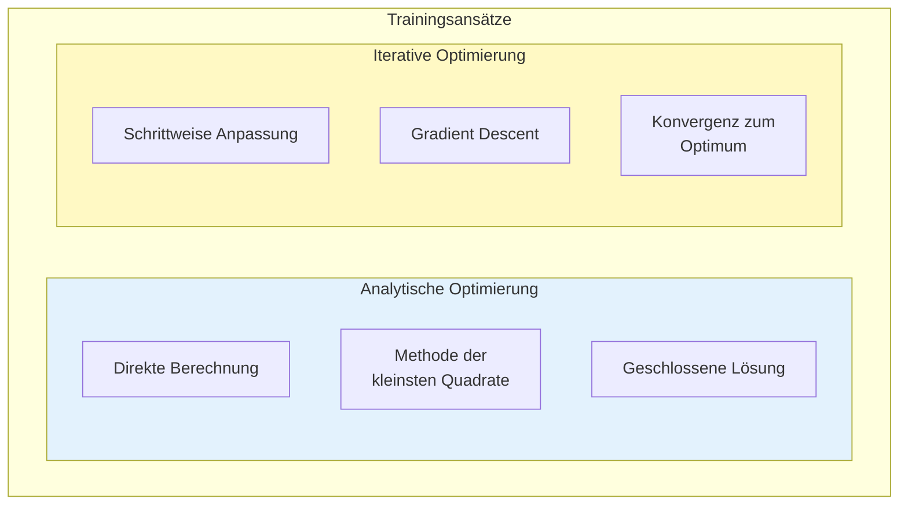
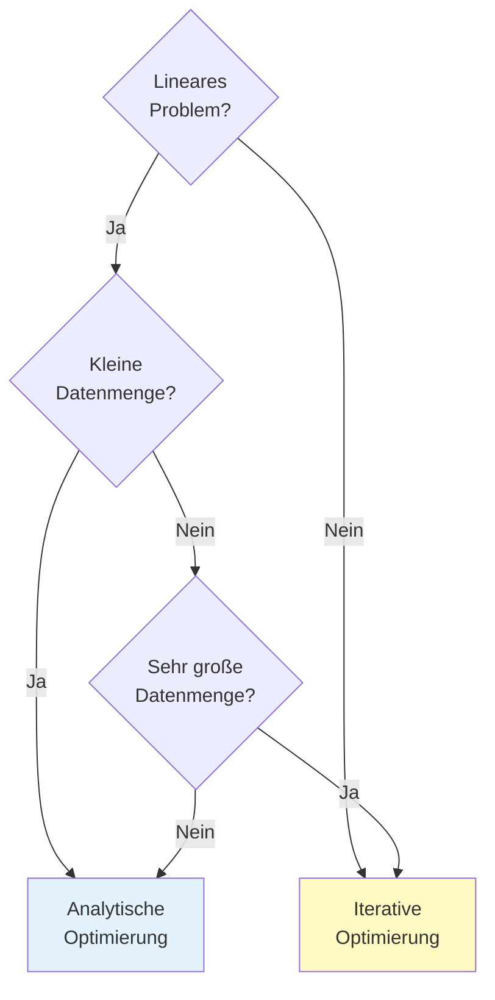
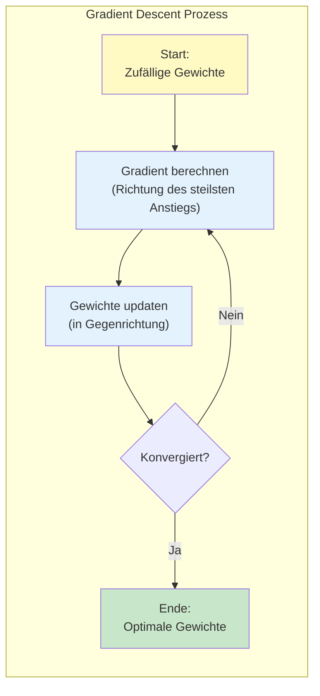
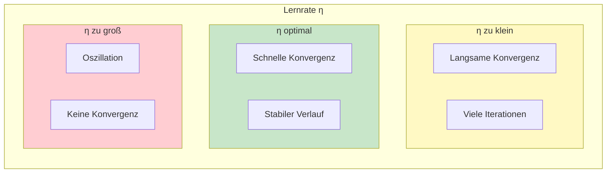
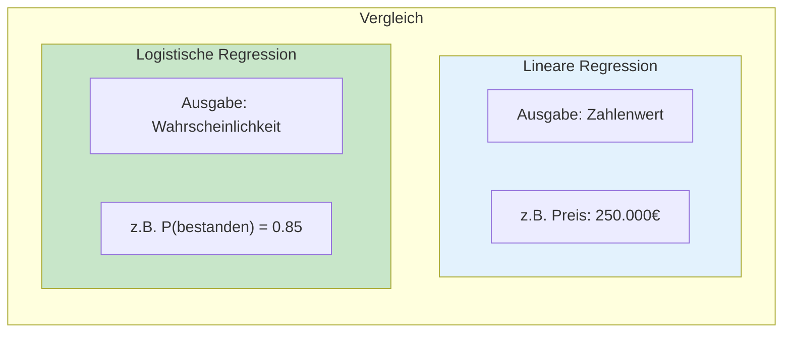
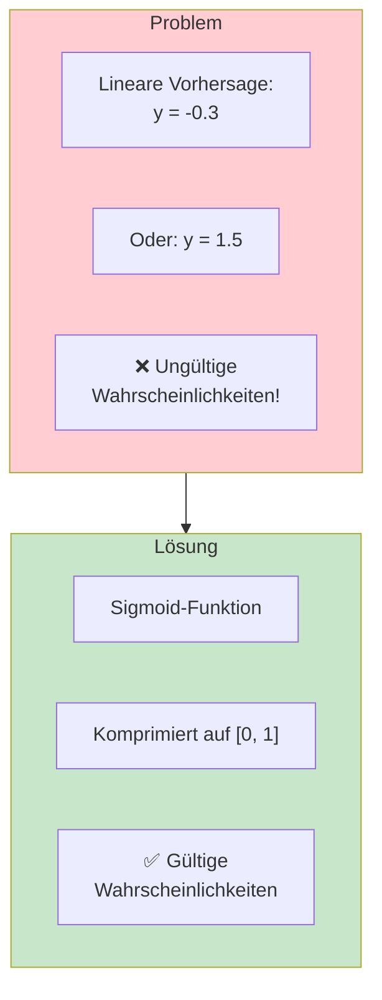
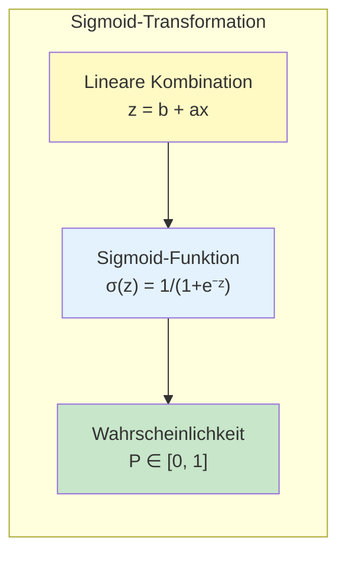
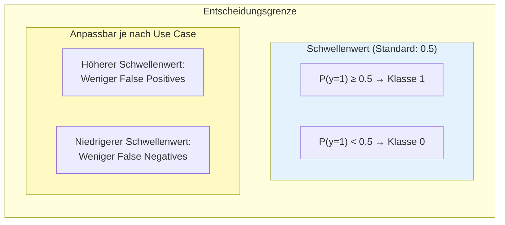
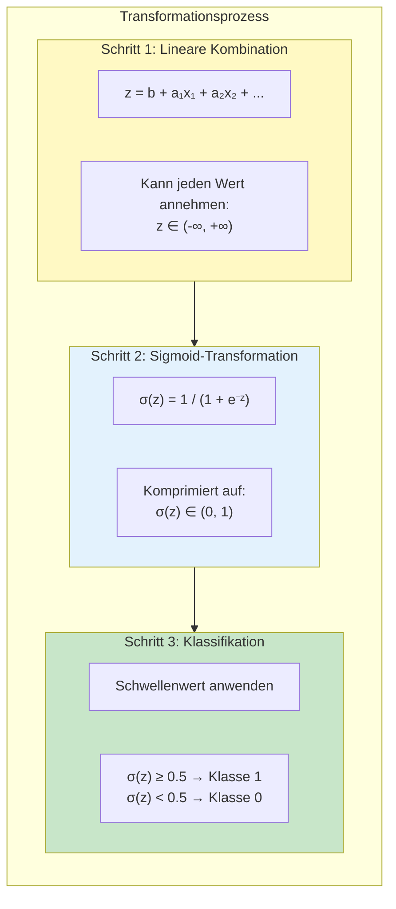
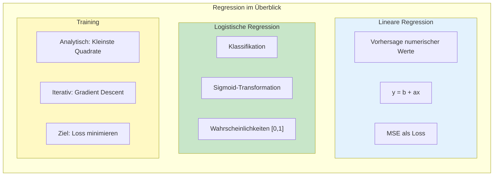

# Regression
{: .no_toc }

> **Regressionsmodelle sagen stetige, numerische Werte voraus**
> Lineare und logistische Regression, Loss-Funktionen und Gradient Descent

---

# Inhaltsverzeichnis
{: .no_toc .text-delta }

1. TOC
{:toc}

---

## Lineare Regression

Die lineare Regression ist ein statistisches Verfahren, mit dem eine beobachtete **abhängige Variable (y)** durch eine oder mehrere **unabhängige Variablen (x)** erklärt wird. Dabei wird ein linearer Zusammenhang zwischen den Variablen angenommen.


### Die Regressionsgleichung

Der lineare Zusammenhang lässt sich als Gerade darstellen:

$$y = b + ax$$

| Parameter | Bezeichnung                   | Bedeutung                    |
| --------- | ----------------------------- | ---------------------------- |
| **b**     | Intercept (Y-Achsenabschnitt) | Wert von y, wenn x = 0       |
| **a**     | Slope (Steigung)              | Änderung von y pro Einheit x |


### Implementierung mit scikit-learn

```python
from sklearn.linear_model import LinearRegression
from sklearn.model_selection import train_test_split
import numpy as np

# Beispieldaten
data = np.array([[1], [2], [3], [4], [5], [6], [7], [8]])  # Stunden Vorbereitung
target = np.array([20, 35, 45, 55, 60, 70, 75, 85])          # Klausurpunkte

# Train-Test-Split
data_train, data_test, target_train, target_test = train_test_split(
    data, target, test_size=0.2, random_state=42
)

# Modell erstellen und trainieren
model = LinearRegression()
model.fit(data_train, target_train)

# Parameter ausgeben
print(f"Intercept (b): {model.intercept_:.2f}")
print(f"Steigung (a):  {model.coef_[0]:.2f}")

# Vorhersage
data_new = np.array([[5]])  # 5 Stunden Vorbereitung
prediction = model.predict(data_new)
print(f"Vorhersage für 5 Stunden: {prediction[0]:.1f} Punkte")
```

---

## Prognosefehler und Loss

### Was ist Loss?

Als **Loss** (Verlust) wird die Abweichung zwischen dem tatsächlichen Wert (y) und der Vorhersage (ŷ) bezeichnet. Der Loss quantifiziert, wie gut oder schlecht ein Modell vorhersagt.


### Wichtige Loss-Funktionen für Regression

| Loss-Funktion | Formel | Eigenschaften |
|---------------|--------|---------------|
| **MSE** (Mean Squared Error) | $\frac{1}{n}\sum(y_i - \hat{y}_i)^2$ | Bestraft große Fehler stärker |
| **MAE** (Mean Absolute Error) | $\frac{1}{n}\sum\|y_i - \hat{y}_i\|$ | Robust gegenüber Ausreißern |
| **RMSE** (Root MSE) | $\sqrt{MSE}$ | Gleiche Einheit wie Zielvariable |


### Loss berechnen mit scikit-learn

```python
from sklearn.metrics import mean_squared_error, mean_absolute_error
import numpy as np

# Vorhersagen erstellen
target_pred = model.predict(data_test)

# Loss-Metriken berechnen
mse = mean_squared_error(target_test, target_pred)
mae = mean_absolute_error(target_test, target_pred)
rmse = np.sqrt(mse)

print(f"MSE:  {mse:.2f}")
print(f"MAE:  {mae:.2f}")
print(f"RMSE: {rmse:.2f}")
```

---

## Ansätze zum Trainieren von Modellen

Das Training eines Modells bedeutet, die optimalen Parameter (Gewichte) zu finden, die den Loss minimieren. Dafür gibt es zwei grundlegende Ansätze:



### Vergleich der Ansätze

| Eigenschaft | Analytische Optimierung | Iterative Optimierung |
|-------------|------------------------|----------------------|
| **Lösungsart** | Direkte Ermittlung | Schrittweise Anpassung |
| **Methode** | Kleinste Quadrate | Gradient Descent |
| **Algorithmus** | Lineare Regression | Gradient Boosting, Neuronale Netze |
| **Geschwindigkeit** | Schnell bei einfachen Modellen | Schnell bei großen/komplexen Modellen |
| **Nichtlineare Probleme** | Ungeeignet | Geeignet |
| **Abhängigkeit von Startwerten** | Gering | Hoch |
| **Konvergenz** | Garantiert optimal | Lokale Minima möglich |

### Wann welchen Ansatz verwenden?



---

## Gradient Descent

### Intuition

Stellen Sie sich vor, Sie stehen auf einem Berg im Nebel und möchten den tiefsten Punkt (das Tal) finden. Die Strategie: Schauen Sie, in welche Richtung es am steilsten bergab geht, und machen Sie einen Schritt in diese Richtung. Wiederholen Sie dies, bis Sie im Tal angekommen sind.



### Die Update-Regel

Die Gewichte werden nach folgender Regel angepasst:

$$w_{neu} = w_{alt} - \eta \cdot \nabla L$$

| Symbol | Bedeutung |
|--------|-----------|
| $w$ | Gewicht (Parameter) |
| $\eta$ | Lernrate (Schrittgröße) |
| $\nabla L$ | Gradient der Loss-Funktion |

### Die Lernrate

Die **Lernrate** (Learning Rate) bestimmt die Schrittgröße bei der Optimierung:



### Varianten von Gradient Descent

| Variante | Datenmenge pro Update | Eigenschaften |
|----------|----------------------|---------------|
| **Batch GD** | Alle Daten | Stabil, aber langsam |
| **Stochastic GD** | 1 Datenpunkt | Schnell, aber verrauscht |
| **Mini-Batch GD** | Kleine Teilmenge | Kompromiss aus beiden |

### Beispiel: Gradient Descent visualisieren

```python
import numpy as np
import matplotlib.pyplot as plt

# Einfache quadratische Funktion: L(w) = w²
def loss(w):
    return w ** 2

def gradient(w):
    return 2 * w

# Gradient Descent
w = 5.0                  # Startwert
learning_rate = 0.1
history = [w]

for i in range(20):
    grad = gradient(w)
    w = w - learning_rate * grad
    history.append(w)

# Visualisierung
w_range = np.linspace(-5, 5, 100)
plt.figure(figsize=(10, 5))
plt.plot(w_range, loss(w_range), label='Loss-Funktion')
plt.scatter(history, [loss(w) for w in history], 
            c=range(len(history)), cmap='Reds', s=100, zorder=5)
plt.xlabel('Gewicht w')
plt.ylabel('Loss L(w)')
plt.title('Gradient Descent: Weg zum Minimum')
plt.legend()
plt.colorbar(label='Iteration')
plt.show()

print(f"Optimales Gewicht: {history[-1]:.6f}")
```

---

## Logistische Regression

### Von Regression zu Klassifikation

Trotz ihres Namens ist die logistische Regression ein **Klassifikationsverfahren**. Sie sagt Wahrscheinlichkeiten für kategoriale Ergebnisse voraus.



### Das Problem der linearen Regression bei Klassifikation

Die lineare Regression kann Werte außerhalb von [0, 1] vorhersagen – das ergibt bei Wahrscheinlichkeiten keinen Sinn!



### Die Sigmoid-Funktion

Die **Sigmoid-Funktion** transformiert jeden Eingabewert in eine Wahrscheinlichkeit zwischen 0 und 1:

$$\sigma(z) = \frac{1}{1 + e^{-z}}$$



### Beispiel: Führerscheinprüfung

Vorhersage, ob ein Fahrschüler die Prüfung besteht:

```python
from sklearn.linear_model import LogisticRegression
from sklearn.model_selection import train_test_split
import numpy as np

# Features: [Fahrstunden, Theorie-Teilnahme (0/1)]
data = np.array([
    [10, 0], [15, 0], [20, 1], [25, 1], [30, 1],
    [12, 1], [18, 0], [22, 1], [28, 1], [35, 1]
])

# Ergebnis: 0 = nicht bestanden, 1 = bestanden
target = np.array([0, 0, 0, 1, 1, 0, 0, 1, 1, 1])

# Train-Test-Split
data_train, data_test, target_train, target_test = train_test_split(
    data, target, test_size=0.2, random_state=42
)

# Modell trainieren
model = LogisticRegression()
model.fit(data_train, target_train)

# Vorhersage für neuen Schüler: 20 Fahrstunden, Theorie besucht
new_student = np.array([[20, 1]])
probability = model.predict_proba(new_student)
prediction = model.predict(new_student)

print(f"Wahrscheinlichkeit zu bestehen: {probability[0][1]:.2%}")
print(f"Vorhersage: {'Bestanden' if prediction[0] == 1 else 'Nicht bestanden'}")
```

### Entscheidungsgrenze

Die logistische Regression teilt den Merkmalsraum durch eine **lineare Entscheidungsgrenze**:



### Evaluation der logistischen Regression

```python
from sklearn.metrics import accuracy_score, classification_report

# Vorhersagen
target_pred = model.predict(data_test)
target_prob = model.predict_proba(data_test)[:, 1]

# Metriken
print(f"Accuracy: {accuracy_score(target_test, target_pred):.2%}")
print("\nKlassifikationsbericht:")
print(classification_report(target_test, target_pred,
                          target_names=['Nicht bestanden', 'Bestanden']))
```

---

## Von der linearen zur logistischen Regression

### Die Transformation im Detail



### Vergleich: Lineare vs. Logistische Regression

| Aspekt | Lineare Regression | Logistische Regression |
|--------|-------------------|----------------------|
| **Aufgabe** | Regression | Klassifikation |
| **Ausgabe** | Kontinuierlicher Wert | Wahrscheinlichkeit [0,1] |
| **Aktivierung** | Identität (keine) | Sigmoid |
| **Loss-Funktion** | MSE | Binary Cross-Entropy |
| **Beispiel** | Hauspreis vorhersagen | Spam erkennen |

### Vollständiges Beispiel mit Visualisierung

```python
import numpy as np
import matplotlib.pyplot as plt
from sklearn.linear_model import LogisticRegression
from sklearn.model_selection import train_test_split

# Synthetische Daten erstellen
np.random.seed(42)
n_samples = 100

# Zwei Klassen
class_0 = np.random.randn(n_samples // 2, 2) + np.array([0, 0])
class_1 = np.random.randn(n_samples // 2, 2) + np.array([3, 3])

data = np.vstack([class_0, class_1])
target = np.array([0] * (n_samples // 2) + [1] * (n_samples // 2))

# Train-Test-Split
data_train, data_test, target_train, target_test = train_test_split(
    data, target, test_size=0.2, random_state=42, stratify=target
)

# Modell trainieren
model = LogisticRegression()
model.fit(data_train, target_train)

# Entscheidungsgrenze visualisieren
fig, ax = plt.subplots(figsize=(10, 8))

# Scatter Plot
scatter = ax.scatter(data[:, 0], data[:, 1], c=target, cmap='RdYlGn',
                     edgecolors='black', s=100)

# Entscheidungsgrenze
x_min, x_max = data[:, 0].min() - 1, data[:, 0].max() + 1
y_min, y_max = data[:, 1].min() - 1, data[:, 1].max() + 1
xx, yy = np.meshgrid(np.linspace(x_min, x_max, 200),
                     np.linspace(y_min, y_max, 200))
Z = model.predict_proba(np.c_[xx.ravel(), yy.ravel()])[:, 1]
Z = Z.reshape(xx.shape)

# Wahrscheinlichkeits-Konturen
contour = ax.contourf(xx, yy, Z, levels=20, alpha=0.3, cmap='RdYlGn')
ax.contour(xx, yy, Z, levels=[0.5], colors='black', linewidths=2)

ax.set_xlabel('Feature 1')
ax.set_ylabel('Feature 2')
ax.set_title('Logistische Regression: Entscheidungsgrenze')
plt.colorbar(contour, label='P(Klasse 1)')
plt.legend(*scatter.legend_elements(), title="Klassen")
plt.show()

# Modellgüte
print(f"Trainings-Accuracy: {model.score(data_train, target_train):.2%}")
print(f"Test-Accuracy:      {model.score(data_test, target_test):.2%}")
```

---

## Zusammenfassung



### Kernkonzepte

1. **Lineare Regression** modelliert lineare Zusammenhänge zwischen Features und Zielvariable
2. **Loss-Funktionen** quantifizieren die Vorhersagequalität
3. **Gradient Descent** findet iterativ optimale Modellparameter
4. **Logistische Regression** transformiert lineare Ausgaben in Wahrscheinlichkeiten

### Weiterführende Themen

- **Regularisierung**: Ridge (L2) und Lasso (L1) zur Vermeidung von Overfitting
- **Polynomiale Regression**: Nichtlineare Zusammenhänge modellieren
- **Multiple Logistische Regression**: Mehr als zwei Klassen (Softmax)

---

*Referenzen:*
- KNIME: Linear Regression, Behind the Scenes
- StatQuest: Linear Regression, Logistic Regression, Gradient Descent
- scikit-learn Dokumentation: [LinearRegression](https://scikit-learn.org/stable/modules/generated/sklearn.linear_model.LinearRegression.html), [LogisticRegression](https://scikit-learn.org/stable/modules/generated/sklearn.linear_model.LogisticRegression.html)

---

**Version:** 1.0
**Stand:** Januar 2026
**Kurs:** Machine Learning. Verstehen. Anwenden. Gestalten.
