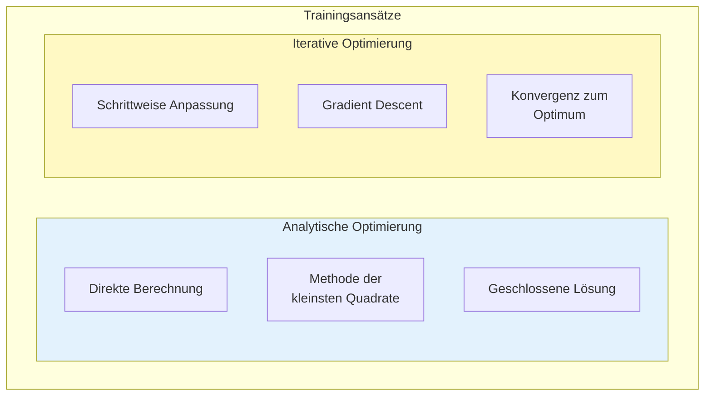
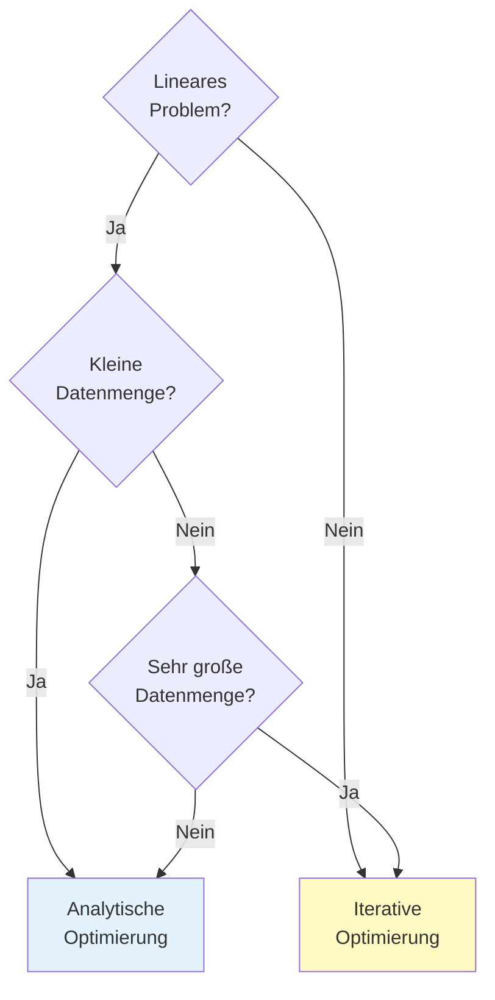
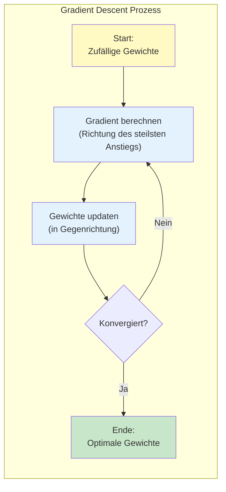
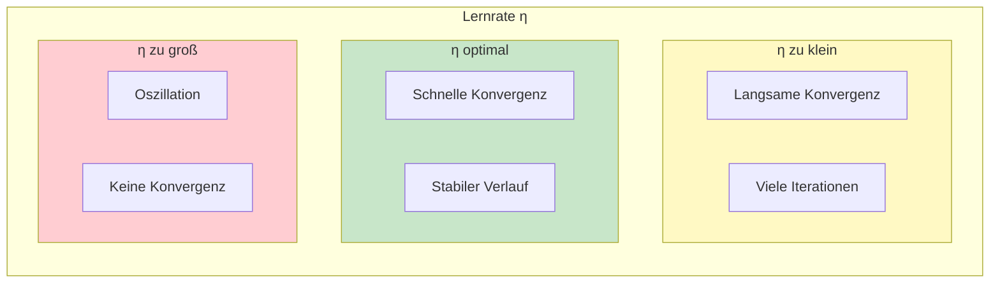
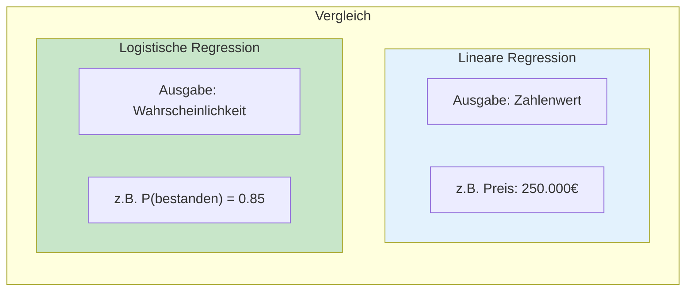
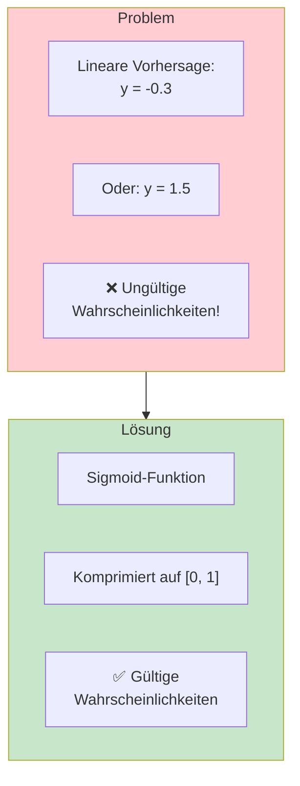
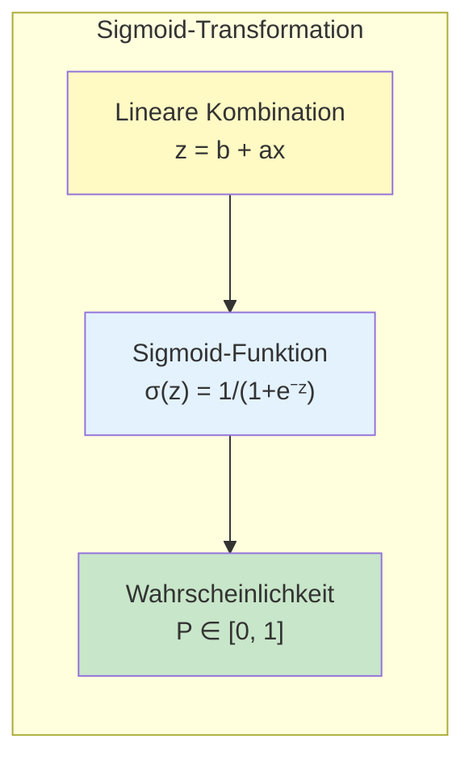
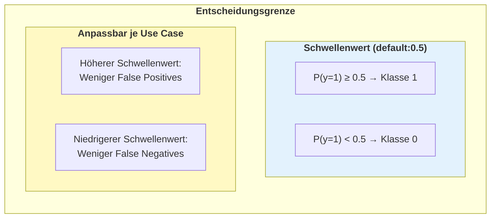
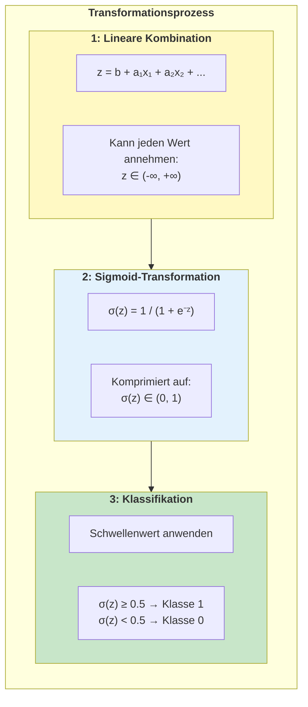
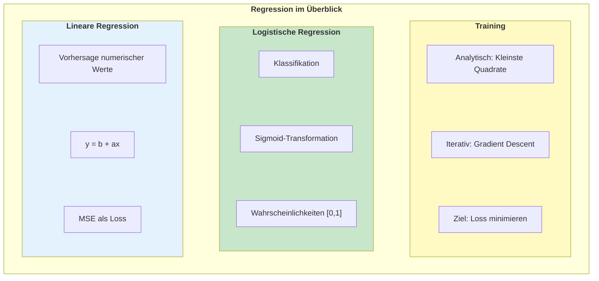

# Regression
{: .no_toc }

> **Regressionsmodelle sagen stetige, numerische Werte voraus**
> Lineare und logistische Regression, Loss-Funktionen und Gradient Descent

---

# Inhaltsverzeichnis
{: .no_toc .text-delta }

1. TOC
{:toc}

---

## Lineare Regression

Die lineare Regression ist ein statistisches Verfahren, mit dem eine beobachtete **abhängige Variable (y)** durch eine oder mehrere **unabhängige Variablen (x)** erklärt wird. Dabei wird ein linearer Zusammenhang zwischen den Variablen angenommen.


### Die Regressionsgleichung

Der lineare Zusammenhang lässt sich als Gerade darstellen:

$$y = b + ax$$

| Parameter | Bezeichnung                   | Bedeutung                    |
| --------- | ----------------------------- | ---------------------------- |
| **b**     | Intercept (Y-Achsenabschnitt) | Wert von y, wenn x = 0       |
| **a**     | Slope (Steigung)              | Änderung von y pro Einheit x |


---

## Prognosefehler und Loss

### Was ist Loss?

Als **Loss** (Verlust) wird die Abweichung zwischen dem tatsächlichen Wert (y) und der Vorhersage (ŷ) bezeichnet. Der Loss quantifiziert, wie gut oder schlecht ein Modell vorhersagt.


### Wichtige Loss-Funktionen für Regression

| Loss-Funktion | Formel | Eigenschaften |
|---------------|--------|---------------|
| **MSE** (Mean Squared Error) | $\frac{1}{n}\sum(y_i - \hat{y}_i)^2$ | Bestraft große Fehler stärker |
| **MAE** (Mean Absolute Error) | $\frac{1}{n}\sum\|y_i - \hat{y}_i\|$ | Robust gegenüber Ausreißern |
| **RMSE** (Root MSE) | $\sqrt{MSE}$ | Gleiche Einheit wie Zielvariable |


---
## Linearer Zusammenhang (Der schnelle Check)

Vor der Modellbildung lässt sich prüfen, ob bzw.  wie stark der lineare Zusammenhang zwischen den Merkmalen und der Zielvariable ist.


```Python
import pandas as pd

# Zeigt die Korrelation aller Spalten zur Zielvariable 'target'
correlations = df.corr()['target'].sort_values(ascending=False)
print(correlations)
```

- **Werte nah bei 1 oder -1:** Starker linearer Zusammenhang.    
- **Werte nah bei 0:** Kein linearer Zusammenhang (die lineare Regression wird hier wahrscheinlich scheitern).

---
## Ansätze zum Trainieren von Modellen

Das Training eines Modells bedeutet, die optimalen Parameter (Gewichte) zu finden, die den Loss minimieren. Dafür gibt es zwei grundlegende Ansätze:



### Vergleich der Ansätze

| Eigenschaft | Analytische Optimierung | Iterative Optimierung |
|-------------|------------------------|----------------------|
| **Lösungsart** | Direkte Ermittlung | Schrittweise Anpassung |
| **Methode** | Kleinste Quadrate | Gradient Descent |
| **Algorithmus** | Lineare Regression | Gradient Boosting, Neuronale Netze |
| **Geschwindigkeit** | Schnell bei einfachen Modellen | Schnell bei großen/komplexen Modellen |
| **Nichtlineare Probleme** | Ungeeignet | Geeignet |
| **Abhängigkeit von Startwerten** | Gering | Hoch |
| **Konvergenz** | Garantiert optimal | Lokale Minima möglich |

### Wann welchen Ansatz verwenden?



---

## Gradient Descent

### Intuition

Stellen Sie sich vor, Sie stehen auf einem Berg im Nebel und möchten den tiefsten Punkt (das Tal) finden. Die Strategie: Schauen Sie, in welche Richtung es am steilsten bergab geht, und machen Sie einen Schritt in diese Richtung. Wiederholen Sie dies, bis Sie im Tal angekommen sind.



### Die Update-Regel

Die Gewichte werden nach folgender Regel angepasst:

$$w_{neu} = w_{alt} - \eta \cdot \nabla L$$

| Symbol | Bedeutung |
|--------|-----------|
| $w$ | Gewicht (Parameter) |
| $\eta$ | Lernrate (Schrittgröße) |
| $\nabla L$ | Gradient der Loss-Funktion |

### Die Lernrate

Die **Lernrate** (Learning Rate) bestimmt die Schrittgröße bei der Optimierung:



### Varianten von Gradient Descent

| Variante | Datenmenge pro Update | Eigenschaften |
|----------|----------------------|---------------|
| **Batch GD** | Alle Daten | Stabil, aber langsam |
| **Stochastic GD** | 1 Datenpunkt | Schnell, aber verrauscht |
| **Mini-Batch GD** | Kleine Teilmenge | Kompromiss aus beiden |


---

## Logistische Regression

### Von Regression zu Klassifikation

Trotz ihres Namens ist die logistische Regression ein **Klassifikationsverfahren**. Sie sagt Wahrscheinlichkeiten für kategoriale Ergebnisse voraus.



### Das Problem der linearen Regression bei Klassifikation

Die lineare Regression kann Werte außerhalb von [0, 1] vorhersagen – das ergibt bei Wahrscheinlichkeiten keinen Sinn!



### Die Sigmoid-Funktion

Die **Sigmoid-Funktion** transformiert jeden Eingabewert in eine Wahrscheinlichkeit zwischen 0 und 1:

$$\sigma(z) = \frac{1}{1 + e^{-z}}$$




### Entscheidungsgrenze

Die logistische Regression teilt den Merkmalsraum durch eine **lineare Entscheidungsgrenze**:



---

## Von der linearen zur logistischen Regression

### Die Transformation im Detail



### Vergleich: Lineare vs. Logistische Regression

| Aspekt | Lineare Regression | Logistische Regression |
|--------|-------------------|----------------------|
| **Aufgabe** | Regression | Klassifikation |
| **Ausgabe** | Kontinuierlicher Wert | Wahrscheinlichkeit [0,1] |
| **Aktivierung** | Identität (keine) | Sigmoid |
| **Loss-Funktion** | MSE | Binary Cross-Entropy |
| **Beispiel** | Hauspreis vorhersagen | Spam erkennen |


---

## Zusammenfassung




---


**Version:** 1.0
**Stand:** Januar 2026
**Kurs:** Machine Learning. Verstehen. Anwenden. Gestalten.
