# Spezielle Neuronale Netze
{: .no_toc }

> **Computer Vision mit CNNs, Sequenzmodellierung mit RNNs und LSTMs sowie AutoEncoder für Dimensionsreduktion und Anomalieerkennung**

---

# Inhaltsverzeichnis
{: .no_toc .text-delta }

1. TOC
{:toc}

---

## Computer Vision

Computer Vision analysiert Bilder und Videos, um deren Inhalt zu verstehen oder geometrische Informationen zu extrahieren. Typische Aufgaben sind die Objekterkennung, Bildklassifizierung und Segmentierung.

### Bilder als Daten

Technisch interpretiert ein Computer-Vision-Modell Bilder als eine Reihe von **Pixeln**. Ein Pixel (Bildpunkt) bezeichnet den einzelnen Farbwert einer digitalen Rastergrafik.


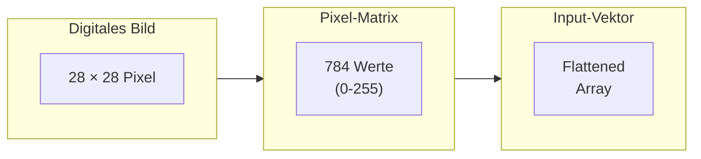

**Beispiel: MNIST-Datensatz**

Der MNIST-Datensatz enthält handgeschriebene Ziffern als monochromes Bild mit einer Größe von 28 × 28 Pixel. Jedes Pixel hat einen Grauwert zwischen 0 (schwarz) und 255 (weiß).

```python
from tensorflow import keras
import matplotlib.pyplot as plt

# MNIST-Datensatz laden
(X_train, y_train), (X_test, y_test) = keras.datasets.mnist.load_data()

# Bildform prüfen
print(f"Bildgröße: {X_train[0].shape}")  # (28, 28)
print(f"Anzahl Trainingsbilder: {X_train.shape[0]}")  # 60000

# Beispielbild anzeigen
plt.imshow(X_train[0], cmap='gray')
plt.title(f"Label: {y_train[0]}")
plt.axis('off')
plt.show()
```

### Farbbilder und Kanäle

Während Graustufenbilder nur einen Kanal haben, bestehen Farbbilder aus mehreren Kanälen:

| Bildtyp    | Kanäle | Shape (Beispiel) |
| ---------- | ------ | ---------------- |
| Graustufen | 1      | (28, 28, 1)      |
| RGB        | 3      | (224, 224, 3)    |


```python
# Normalisierung der Pixelwerte (0-1 statt 0-255)
X_train = X_train.astype('float32') / 255.0
X_test = X_test.astype('float32') / 255.0

# Reshape für CNN (Kanal hinzufügen)
X_train = X_train.reshape(-1, 28, 28, 1)
X_test = X_test.reshape(-1, 28, 28, 1)
```

---

## Convolutional Neural Networks (CNN)

Convolutional Neural Networks sind mehrschichtige neuronale Netze, die besonders gut darin sind, Merkmale aus Bilddaten zu extrahieren. Sie funktionieren hervorragend mit Bildern und benötigen wenig Vorverarbeitung.

### Grundprinzip

CNNs nutzen zwei Kernkonzepte:

1. **Faltungen (Convolutions)**: Erkennen lokale Muster wie Kanten, Texturen oder komplexe Formen
2. **Pooling**: Reduzieren die räumliche Größe und extrahieren dominante Merkmale

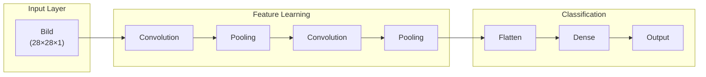

### CNN-Architektur im Detail

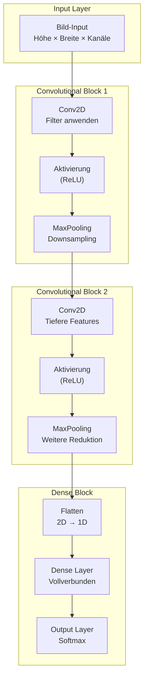

### Layer-Typen erklärt

#### Input Layer

Die Eingabeschicht definiert die Bildmaße: Höhe, Breite und Anzahl der Farbkanäle.

```python
from tensorflow.keras.layers import Input

# Für MNIST (Graustufen)
input_layer = Input(shape=(28, 28, 1))

# Für Farbbilder
input_layer_rgb = Input(shape=(224, 224, 3))
```

#### Convolutional Layer

Der Convolutional Layer wendet Filter (Kernel) auf das Bild an, um **Merkmale zu erkennen**.

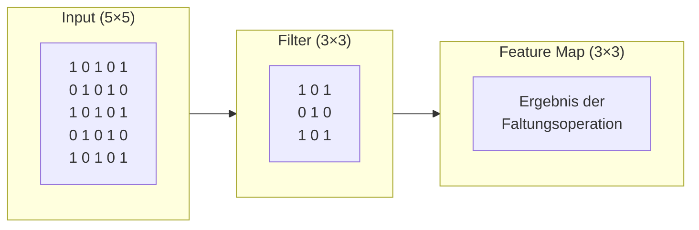

**Funktionsweise:**
1. Der Kernel "gleitet" über das Eingabebild
2. An jeder Position: elementweise Multiplikation und Summation
3. Das Ergebnis ist eine Feature Map

```python
from tensorflow.keras.layers import Conv2D

# Convolutional Layer mit 32 Filtern (3×3)
conv_layer = Conv2D(
    filters=32,           # Anzahl der Filter
    kernel_size=(3, 3),   # Größe des Filters
    activation='relu',    # Aktivierungsfunktion
    padding='same'        # Ausgabegröße = Eingabegröße
)
```


#### Pooling Layer

Das Pooling reduziert die **räumliche** Größe der Feature Maps und extrahiert dominante Merkmale.

| Pooling-Typ | Beschreibung | Verwendung |
|-------------|--------------|------------|
| **Max Pooling** | Nimmt den maximalen Wert | Standard, wirkt entrauschend |
| **Average Pooling** | Berechnet den Durchschnitt | Glättung der Features |
| **Global Average** | Ein Wert pro Feature Map | Vor dem Output Layer |

```python
from tensorflow.keras.layers import MaxPooling2D, AveragePooling2D

# Max Pooling (2×2 Fenster)
max_pool = MaxPooling2D(pool_size=(2, 2))

# Average Pooling
avg_pool = AveragePooling2D(pool_size=(2, 2))
```

#### Flatten Layer

Wandelt die mehrdimensionalen Feature Maps in einen eindimensionalen Vektor um.

```python
from tensorflow.keras.layers import Flatten

# Beispiel: (7, 7, 64) → (3136,)
flatten = Flatten()
```

#### Dense Layer

Vollständig verbundene Schichten für die finale Klassifizierung.

```python
from tensorflow.keras.layers import Dense

# Hidden Layer
dense1 = Dense(128, activation='relu')

# Output Layer (10 Klassen)
output = Dense(10, activation='softmax')
```

### Vollständiges CNN-Beispiel

```python
from tensorflow import keras
from tensorflow.keras import layers

def create_cnn_model(input_shape=(28, 28, 1), num_classes=10):
    """
    Erstellt ein CNN für Bildklassifizierung.
    
    Parameters:
    -----------
    input_shape : tuple
        Form der Eingabebilder (Höhe, Breite, Kanäle)
    num_classes : int
        Anzahl der Klassen
        
    Returns:
    --------
    keras.Model
        Kompiliertes CNN-Modell
    """
    model = keras.Sequential([
        # Input Layer
        layers.Input(shape=input_shape),
        
        # Erster Convolutional Block
        layers.Conv2D(32, (3, 3), activation='relu', padding='same'),
        layers.MaxPooling2D((2, 2)),
        
        # Zweiter Convolutional Block
        layers.Conv2D(64, (3, 3), activation='relu', padding='same'),
        layers.MaxPooling2D((2, 2)),
        
        # Dritter Convolutional Block
        layers.Conv2D(64, (3, 3), activation='relu', padding='same'),
        
        # Classification Head
        layers.Flatten(),
        layers.Dense(64, activation='relu'),
        layers.Dropout(0.5),  # Regularisierung
        layers.Dense(num_classes, activation='softmax')
    ])
    
    model.compile(
        optimizer='adam',
        loss='sparse_categorical_crossentropy',
        metrics=['accuracy']
    )
    
    return model

# Modell erstellen und trainieren
model = create_cnn_model()
model.summary()

# Training
history = model.fit(
    X_train, y_train,
    epochs=10,
    batch_size=32,
    validation_split=0.2,
    verbose=1
)

# Evaluation
test_loss, test_acc = model.evaluate(X_test, y_test, verbose=0)
print(f"Test Accuracy: {test_acc:.4f}")
```

### CNN-Parameter verstehen

| Parameter | Beschreibung | Typische Werte |
|-----------|--------------|----------------|
| `filters` | Anzahl der Kernel/Filter | 32, 64, 128, 256 |
| `kernel_size` | Größe des Filters | (3, 3), (5, 5) |
| `strides` | Schrittweite des Filters | (1, 1), (2, 2) |
| `padding` | Randbehandlung | 'valid', 'same' |
| `activation` | Aktivierungsfunktion | 'relu' |

> **Best Practice**
>
> Beginne mit wenigen Filtern (32) und erhöhe die Anzahl in tieferen Schichten. Die räumliche Auflösung nimmt ab, während die Anzahl der Feature Maps zunimmt.

---

## Sequenzmodellierung

Sequenzmodellierung befasst sich mit Daten, bei denen die Reihenfolge wichtig ist. Dies umfasst zwei Hauptanwendungsbereiche:

1. **Natural Language Processing (NLP)** - Textverarbeitung
2. **Zeitreihenanalyse** - Temporale Daten

### Natural Language Processing (NLP)

NLP ist der Bereich, der sich mit der Verarbeitung und dem Verständnis menschlicher Sprache befasst.

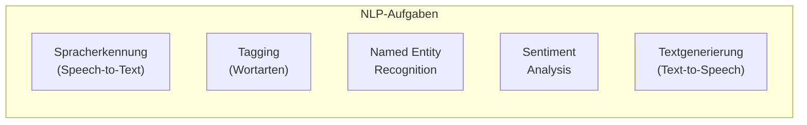

**Typische NLP-Aufgaben:**

| Aufgabe | Beschreibung | Beispiel |
|---------|--------------|----------|
| **Spracherkennung** | Audio → Text | Diktiersoftware |
| **POS-Tagging** | Wortarten bestimmen | "Der [DET] Hund [NOUN] läuft [VERB]" |
| **NER** | Entitäten erkennen | "Berlin [LOC]", "Siemens [ORG]" |
| **Sentiment Analysis** | Stimmung erkennen | Positiv, Negativ, Neutral |
| **Textgenerierung** | Text erzeugen | ChatGPT, Claude |

### Text-Preprocessing

Das Preprocessing für NLP unterscheidet sich von der normalen Datenbereinigung:

```python
import re
from tensorflow.keras.preprocessing.text import Tokenizer
from tensorflow.keras.preprocessing.sequence import pad_sequences

def preprocess_text(texts, max_words=10000, max_len=100):
    """
    Bereitet Texte für neuronale Netze vor.
    
    Parameters:
    -----------
    texts : list
        Liste von Texten
    max_words : int
        Maximale Anzahl der Wörter im Vokabular
    max_len : int
        Maximale Sequenzlänge
        
    Returns:
    --------
    tuple
        (padded_sequences, tokenizer)
    """
    # Normalisierung
    cleaned_texts = []
    for text in texts:
        # Kleinschreibung
        text = text.lower()
        # Sonderzeichen entfernen
        text = re.sub(r'[^\w\s]', '', text)
        # Mehrfache Leerzeichen entfernen
        text = re.sub(r'\s+', ' ', text).strip()
        cleaned_texts.append(text)
    
    # Tokenisierung
    tokenizer = Tokenizer(num_words=max_words, oov_token='<OOV>')
    tokenizer.fit_on_texts(cleaned_texts)
    
    # Text zu Sequenzen
    sequences = tokenizer.texts_to_sequences(cleaned_texts)
    
    # Padding (gleiche Länge)
    padded = pad_sequences(sequences, maxlen=max_len, padding='post')
    
    return padded, tokenizer

# Beispiel
texts = ["Das ist ein Test.", "Machine Learning ist spannend!"]
sequences, tokenizer = preprocess_text(texts)
print(f"Vokabulargröße: {len(tokenizer.word_index)}")
```

### Zeitreihenanalyse

Zeitreihendaten sind Datenpunkte, die in zeitlicher Reihenfolge indiziert sind.

**Wichtige Eigenschaften:**

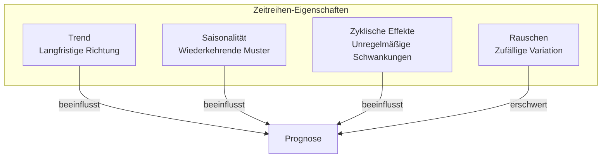

| Eigenschaft | Beschreibung | Beispiel |
|-------------|--------------|----------|
| **Trend** | Systematischer Anstieg/Abfall | Wirtschaftswachstum |
| **Saisonalität** | Regelmäßige Muster | Weihnachtsgeschäft |
| **Zyklische Effekte** | Unregelmäßige Schwankungen | Konjunkturzyklen |

---

## Recurrent Neural Networks (RNN)

Recurrent Neural Networks sind eine Architektur für die Verarbeitung von sequenziellen Daten. Sie haben eingebaute Rückkopplungsschleifen, die es ermöglichen, Informationen aus vorherigen Zeitschritten zu nutzen.

### Grundkonzept

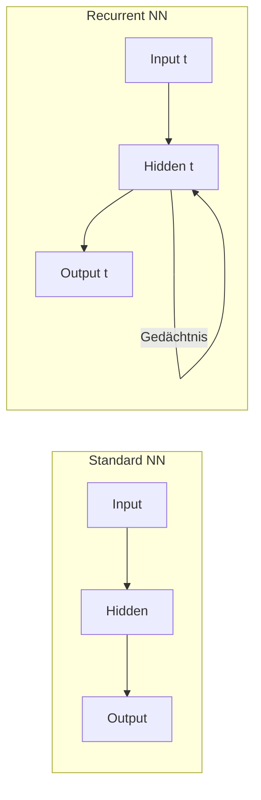

**Kernidee:** Ein RNN nutzt nicht nur die aktuelle Eingabe, sondern auch das "Gedächtnis" aus vorherigen Schritten.

### RNN aufgefaltet

Wenn man ein RNN über die Zeit "auffaltet", wird die Rückkopplungsschleife sichtbar:

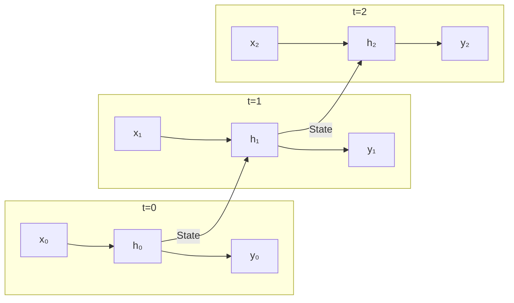

### Einfaches RNN in Keras

```python
from tensorflow.keras.layers import SimpleRNN, Embedding

def create_simple_rnn(vocab_size, embedding_dim, rnn_units, output_dim):
    """
    Erstellt ein einfaches RNN für Sequenzklassifizierung.
    
    Parameters:
    -----------
    vocab_size : int
        Größe des Vokabulars
    embedding_dim : int
        Dimension der Wort-Embeddings
    rnn_units : int
        Anzahl der RNN-Einheiten
    output_dim : int
        Ausgabedimension (Anzahl Klassen)
    """
    model = keras.Sequential([
        # Embedding Layer: Wörter → Vektoren
        Embedding(vocab_size, embedding_dim, input_length=100),
        
        # RNN Layer
        SimpleRNN(rnn_units, return_sequences=False),
        
        # Output
        layers.Dense(output_dim, activation='softmax')
    ])
    
    return model
```

### Problem: Vanishing Gradients

RNNs haben Schwierigkeiten, langfristige Abhängigkeiten zu lernen. Bei langen Sequenzen werden die Gradienten während des Backpropagation entweder sehr klein (vanishing) oder sehr groß (exploding).

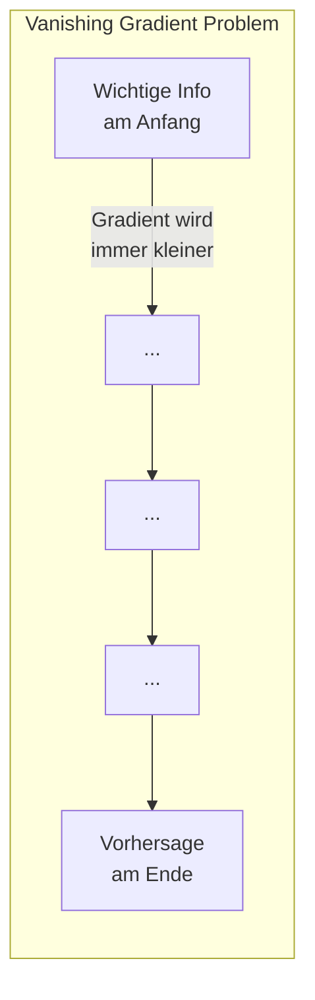

**Lösung:** Long Short-Term Memory (LSTM)

---

## Long Short-Term Memory (LSTM)

LSTMs sind eine spezielle RNN-Architektur, die das Problem der verschwindenden Gradienten löst. Sie können Informationen über lange Zeiträume hinweg effektiv speichern und verarbeiten.

### LSTM-Zelle Architektur

Eine LSTM-Zelle enthält drei "Gates" (Tore), die den Informationsfluss steuern:

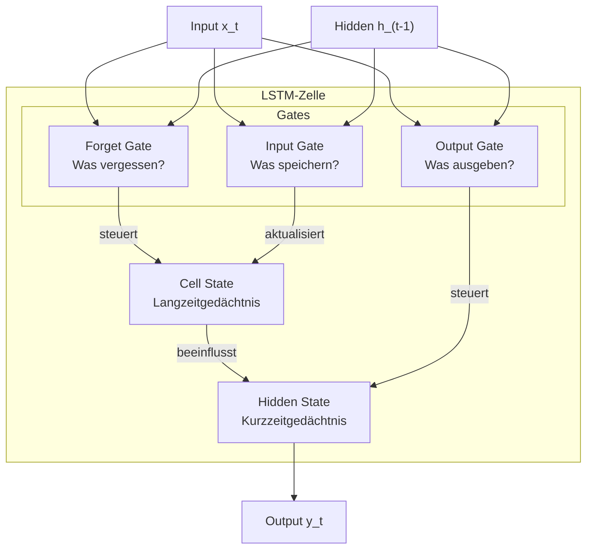

### Die drei Gates erklärt

| Gate | Funktion | Analogie |
|------|----------|----------|
| **Forget Gate** | Entscheidet, welche Informationen aus dem Zellzustand gelöscht werden | "Was kann ich vergessen?" |
| **Input Gate** | Entscheidet, welche neuen Informationen gespeichert werden | "Was ist wichtig zu merken?" |
| **Output Gate** | Entscheidet, welche Informationen als Output verwendet werden | "Was ist jetzt relevant?" |

### LSTM in Keras

```python
from tensorflow.keras.layers import LSTM, Bidirectional

def create_lstm_model(vocab_size=10000, embedding_dim=128, 
                      lstm_units=64, num_classes=2, max_len=100):
    """
    Erstellt ein LSTM-Modell für Textklassifizierung.
    
    Parameters:
    -----------
    vocab_size : int
        Größe des Vokabulars
    embedding_dim : int
        Dimension der Wort-Embeddings
    lstm_units : int
        Anzahl der LSTM-Einheiten
    num_classes : int
        Anzahl der Klassen
    max_len : int
        Maximale Sequenzlänge
    """
    model = keras.Sequential([
        # Embedding Layer
        layers.Embedding(vocab_size, embedding_dim, input_length=max_len),
        
        # LSTM Layer
        layers.LSTM(lstm_units, return_sequences=True),
        layers.Dropout(0.2),
        
        # Zweiter LSTM Layer
        layers.LSTM(lstm_units // 2),
        layers.Dropout(0.2),
        
        # Dense Layers
        layers.Dense(32, activation='relu'),
        layers.Dense(num_classes, activation='softmax')
    ])
    
    model.compile(
        optimizer='adam',
        loss='sparse_categorical_crossentropy',
        metrics=['accuracy']
    )
    
    return model

# Modell erstellen
model = create_lstm_model()
model.summary()
```

### Bidirektionale LSTMs

Bidirektionale LSTMs verarbeiten die Sequenz in beide Richtungen (vorwärts und rückwärts), was oft zu besseren Ergebnissen führt.

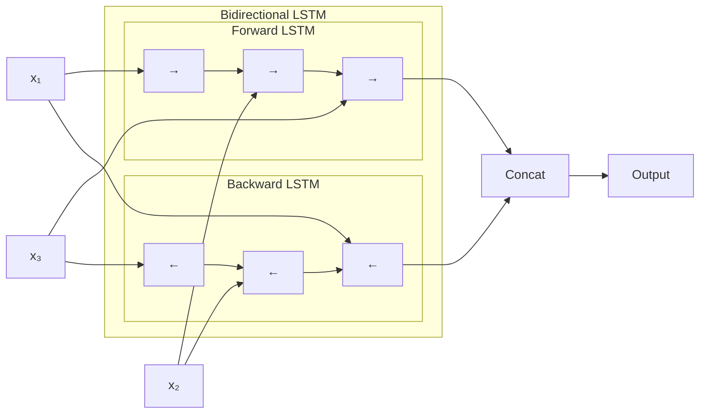

```python
# Bidirektionales LSTM
model = keras.Sequential([
    layers.Embedding(vocab_size, embedding_dim, input_length=max_len),
    layers.Bidirectional(layers.LSTM(64, return_sequences=True)),
    layers.Bidirectional(layers.LSTM(32)),
    layers.Dense(64, activation='relu'),
    layers.Dense(num_classes, activation='softmax')
])
```

### LSTM vs. SimpleRNN

| Aspekt | SimpleRNN | LSTM |
|--------|-----------|------|
| **Architektur** | Einfache Rückkopplung | Drei Gates + Cell State |
| **Langzeitgedächtnis** | Schwach | Stark |
| **Trainingszeit** | Schneller | Langsamer |
| **Parameter** | Weniger | Mehr |
| **Anwendung** | Kurze Sequenzen | Lange Sequenzen |

> **Best Practice**
>
> Verwende LSTMs für die meisten Sequenzprobleme. Für sehr lange Sequenzen oder wenn Kontextverständnis in beide Richtungen wichtig ist, nutze bidirektionale LSTMs.

---

## AutoEncoder

Ein AutoEncoder ist ein spezieller Typ von neuronalem Netzwerk, das Daten auf ihre wichtigsten Merkmale komprimiert und dann wieder rekonstruiert.

### Architektur

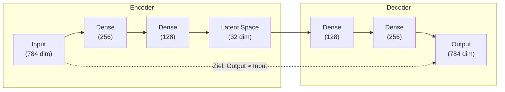

**Komponenten:**

| Komponente | Funktion | Beschreibung |
|------------|----------|--------------|
| **Encoder** | Komprimierung | Reduziert Eingabe auf wesentliche Merkmale |
| **Latent Space** | Repräsentation | Komprimierte Darstellung der Daten |
| **Decoder** | Rekonstruktion | Erzeugt Ausgabe aus komprimierter Darstellung |

### Anwendungsbereiche

1. **Dimensionsreduktion**: Alternative zu PCA
2. **Anomalieerkennung**: Normale Daten rekonstruieren besser
3. **Rauschunterdrückung**: Denoising AutoEncoder
4. **Generative Modelle**: Variational AutoEncoder (VAE)

### Implementierung

```python
from tensorflow import keras
from tensorflow.keras import layers

def create_autoencoder(input_dim, encoding_dim=32):
    """
    Erstellt einen AutoEncoder für Dimensionsreduktion.
    
    Parameters:
    -----------
    input_dim : int
        Dimension der Eingabedaten
    encoding_dim : int
        Dimension des Latent Space
        
    Returns:
    --------
    tuple
        (autoencoder, encoder, decoder) Modelle
    """
    # Encoder
    input_layer = layers.Input(shape=(input_dim,))
    encoded = layers.Dense(256, activation='relu')(input_layer)
    encoded = layers.Dense(128, activation='relu')(encoded)
    encoded = layers.Dense(encoding_dim, activation='relu')(encoded)
    
    # Decoder
    decoded = layers.Dense(128, activation='relu')(encoded)
    decoded = layers.Dense(256, activation='relu')(decoded)
    decoded = layers.Dense(input_dim, activation='sigmoid')(decoded)
    
    # Modelle erstellen
    autoencoder = keras.Model(input_layer, decoded, name='autoencoder')
    encoder = keras.Model(input_layer, encoded, name='encoder')
    
    # Decoder-Modell (für spätere Nutzung)
    encoded_input = layers.Input(shape=(encoding_dim,))
    decoder_layer = autoencoder.layers[-3](encoded_input)
    decoder_layer = autoencoder.layers[-2](decoder_layer)
    decoder_layer = autoencoder.layers[-1](decoder_layer)
    decoder = keras.Model(encoded_input, decoder_layer, name='decoder')
    
    autoencoder.compile(
        optimizer='adam',
        loss='mse'  # Mean Squared Error für Rekonstruktion
    )
    
    return autoencoder, encoder, decoder

# Beispiel mit MNIST
(X_train, _), (X_test, _) = keras.datasets.mnist.load_data()

# Normalisierung und Flattening
X_train = X_train.astype('float32') / 255.0
X_test = X_test.astype('float32') / 255.0
X_train = X_train.reshape(-1, 784)
X_test = X_test.reshape(-1, 784)

# AutoEncoder erstellen und trainieren
autoencoder, encoder, decoder = create_autoencoder(input_dim=784, encoding_dim=32)

autoencoder.fit(
    X_train, X_train,  # Input = Target (Rekonstruktion)
    epochs=50,
    batch_size=256,
    shuffle=True,
    validation_data=(X_test, X_test)
)
```

### Anomalieerkennung mit AutoEncoder

AutoEncoder eignen sich hervorragend zur Anomalieerkennung: Anomalien werden schlechter rekonstruiert als normale Daten.

```python
import numpy as np

def detect_anomalies(autoencoder, data, threshold=None):
    """
    Erkennt Anomalien basierend auf Rekonstruktionsfehler.
    
    Parameters:
    -----------
    autoencoder : keras.Model
        Trainierter AutoEncoder
    data : np.ndarray
        Zu prüfende Daten
    threshold : float, optional
        Schwellwert für Anomalien (Standard: Mean + 2*Std)
        
    Returns:
    --------
    tuple
        (anomaly_mask, reconstruction_errors)
    """
    # Rekonstruktion
    reconstructed = autoencoder.predict(data, verbose=0)
    
    # Rekonstruktionsfehler (MSE pro Sample)
    mse = np.mean(np.power(data - reconstructed, 2), axis=1)
    
    # Threshold bestimmen
    if threshold is None:
        threshold = np.mean(mse) + 2 * np.std(mse)
    
    # Anomalien identifizieren
    anomalies = mse > threshold
    
    return anomalies, mse

# Anwendung
anomaly_mask, errors = detect_anomalies(autoencoder, X_test)
print(f"Gefundene Anomalien: {np.sum(anomaly_mask)}")
print(f"Threshold: {np.mean(errors) + 2 * np.std(errors):.4f}")
```

### Denoising AutoEncoder

Ein Denoising AutoEncoder lernt, verrauschte Eingaben zu bereinigen:

```python
def add_noise(data, noise_factor=0.5):
    """Fügt Gaußsches Rauschen hinzu."""
    noisy_data = data + noise_factor * np.random.normal(size=data.shape)
    return np.clip(noisy_data, 0., 1.)

# Verrauschte Trainingsdaten erstellen
X_train_noisy = add_noise(X_train)
X_test_noisy = add_noise(X_test)

# Training: Noisy Input → Clean Output
autoencoder.fit(
    X_train_noisy, X_train,  # Rausch → Original
    epochs=50,
    batch_size=256,
    validation_data=(X_test_noisy, X_test)
)
```

---

## Zusammenfassung

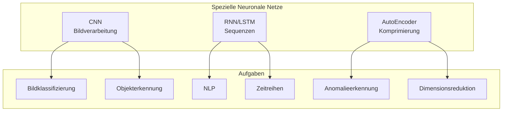

| Architektur | Stärke | Typische Anwendung |
|-------------|--------|-------------------|
| **CNN** | Lokale Muster in 2D-Daten | Bilder, Videos |
| **RNN** | Sequenzielle Abhängigkeiten | Kurze Sequenzen |
| **LSTM** | Langzeit-Abhängigkeiten | Text, Zeitreihen |
| **AutoEncoder** | Komprimierung & Rekonstruktion | Anomalien, Rauschen |

> **Ausblick**
>
> Moderne Architekturen wie **Transformer** (BERT, GPT) haben in vielen NLP-Aufgaben LSTMs abgelöst. Für Computer Vision sind **Vision Transformer (ViT)** und fortgeschrittene CNNs wie **ResNet** oder **EfficientNet** Stand der Technik.

---

## Weiterführende Ressourcen

- **StatQuest**: [Neural Networks Playlist](https://www.youtube.com/playlist?list=PLblh5JKOoLUIxGDQs4LFFD--41Vzf-ME1) - Verständliche Erklärungen
- **Keras Documentation**: [Official Guides](https://keras.io/guides/) - Detaillierte Anleitungen
- **TensorFlow Tutorials**: [Computer Vision](https://www.tensorflow.org/tutorials/images) - Hands-on Beispiele

---

**Version:** 1.0     
**Stand:** Januar 2026     
**Kurs:** Machine Learning. Verstehen. Anwenden. Gestalten.     