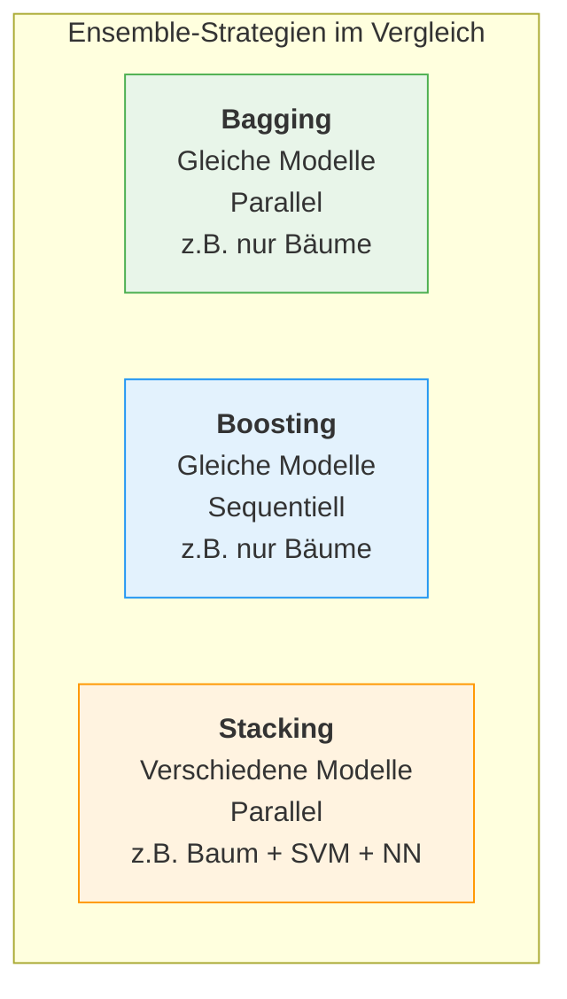
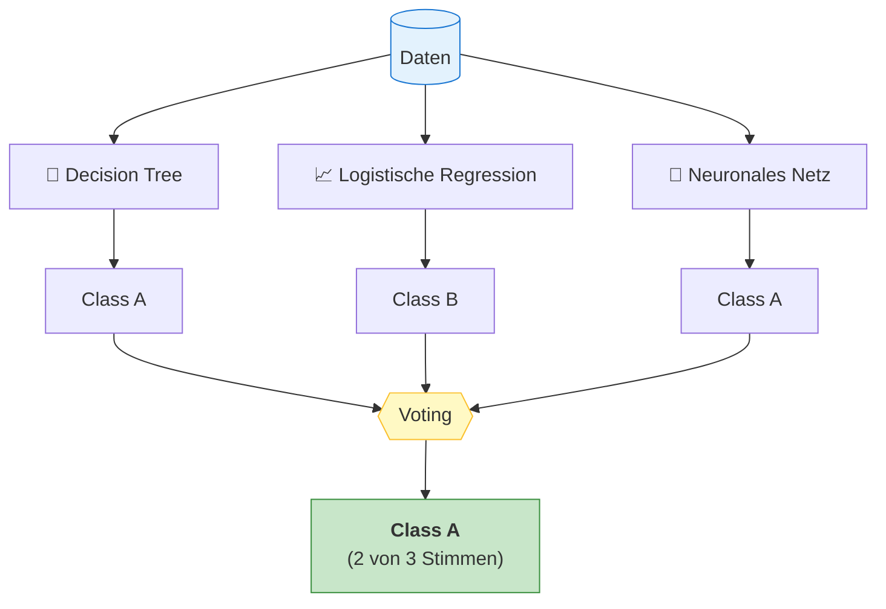
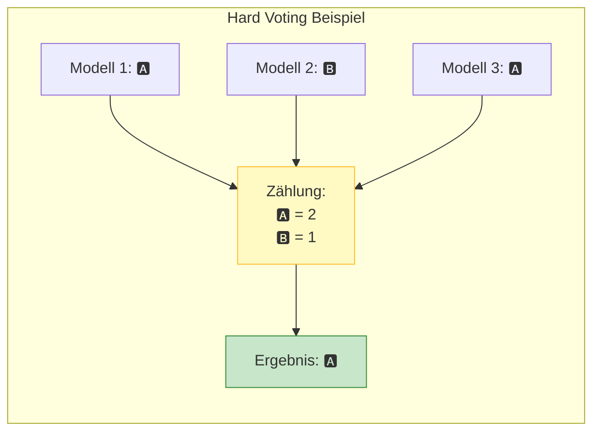
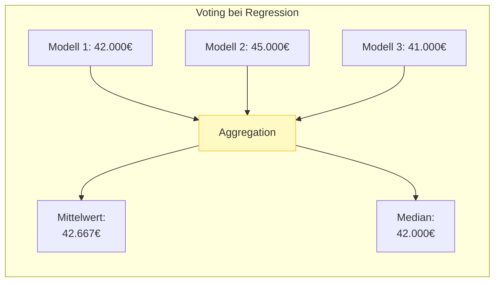
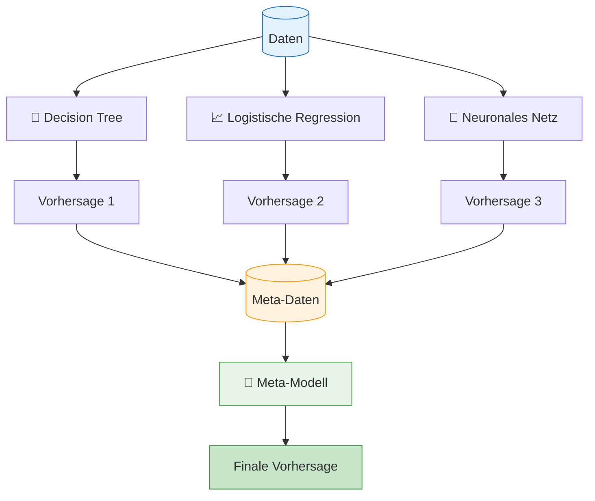
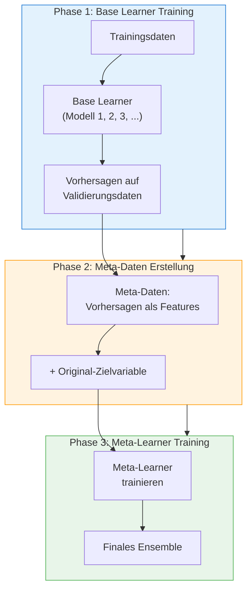
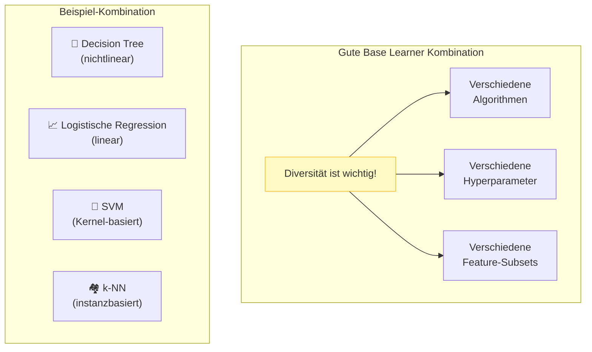
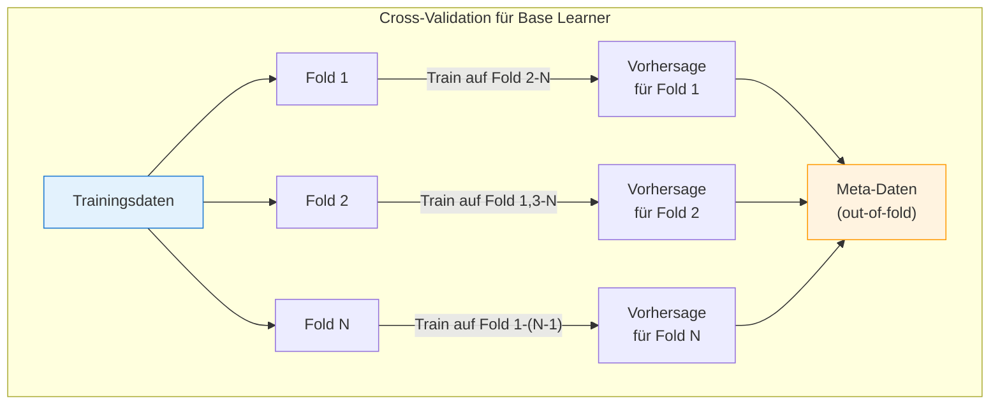
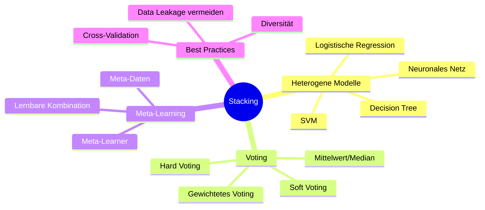

# Stacking
{: .no_toc }

> **Stacking (Stacked Generalization) kombiniert verschiedenartige Modelle zu einem Ensemble. Im Gegensatz zu Bagging und Boosting verwendet Stacking heterogene Modelle – etwa einen Entscheidungsbaum, eine logistische Regression und ein neuronales Netz gemeinsam. Die Kombination erfolgt durch Voting oder Meta-Learning.**

---

# Inhaltsverzeichnis
{: .no_toc .text-delta }

1. TOC
{:toc}

---

## Überblick: Stacking-Strategien

Stacking unterscheidet sich fundamental von Bagging und Boosting durch die **Heterogenität** der verwendeten Modelle:

### Die zwei Stacking-Varianten

| Variante | Kombination | Komplexität |
|----------|-------------|-------------|
| **Voting** | Direkte Aggregation der Vorhersagen | Einfach |
| **Meta-Learning** | Ein zusätzliches Modell lernt die optimale Kombination | Fortgeschritten |

---

## Voting

Beim **Voting** werden die Vorhersagen mehrerer unterschiedlicher Modelle direkt aggregiert – ohne ein zusätzliches Lernverfahren.

### Voting-Strategien

#### Hard Voting (Mehrheitsentscheidung)

Bei der **Klassifikation** gewinnt die Klasse mit den meisten Stimmen:

#### Soft Voting (Wahrscheinlichkeits-Durchschnitt)

Bei **Soft Voting** werden die Wahrscheinlichkeiten gemittelt:

| Modell | P(Class A) | P(Class B) |
|--------|------------|------------|
| Decision Tree | 0.70 | 0.30 |
| Logistische Regression | 0.40 | 0.60 |
| Neuronales Netz | 0.80 | 0.20 |
| **Durchschnitt** | **0.63** | **0.37** |
| **Ergebnis** | ✓ Class A | |

#### Regression: Mittelwert oder Median

Bei **Regressionsaufgaben** werden die Vorhersagen numerisch aggregiert:

### Gewichtetes Voting

Die Stimmen können auch **gewichtet** werden, z.B. basierend auf der Modellperformance:

| Modell | Accuracy | Gewicht | Stimme |
|--------|----------|---------|--------|
| Decision Tree | 0.85 | 0.30 | Class A |
| Logistische Regression | 0.82 | 0.25 | Class B |
| Neuronales Netz | 0.90 | 0.45 | Class A |

**Gewichtete Stimmen:** Class A = 0.30 + 0.45 = **0.75** vs. Class B = **0.25** → Class A gewinnt

---

## Meta-Learning

Beim **Meta-Learning** (auch: Stacked Generalization) wird ein zusätzliches Modell trainiert, das lernt, wie die Vorhersagen der Basismodelle optimal kombiniert werden.

### Der Meta-Learning Prozess

### Beispiel: Meta-Daten Struktur

Die **Base Learner** erzeugen Vorhersagen, die als Features für den Meta-Learner dienen:

| Sample | Pred_Tree | Pred_LogReg | Pred_NN | True_Label |
|--------|-----------|-------------|---------|------------|
| 1 | Class A | Class A | Class B | Class A |
| 2 | Class B | Class B | Class B | Class B |
| 3 | Class A | Class B | Class A | Class A |
| ... | ... | ... | ... | ... |

Der **Meta-Learner** lernt aus diesen Daten, wann welches Modell vertrauenswürdig ist.

### Vorteile von Meta-Learning gegenüber Voting

| Aspekt | Voting | Meta-Learning |
|--------|--------|---------------|
| **Kombinationslogik** | Fest (Mehrheit/Durchschnitt) | Lernbar |
| **Modellstärken nutzen** | Gleichwertig oder fest gewichtet | Adaptiv gelernt |
| **Komplexe Muster** | Nicht erkennbar | Kann Interaktionen lernen |
| **Implementierung** | Einfach | Komplexer |
| **Overfitting-Risiko** | Gering | Höher (mehr Parameter) |

---

## Best Practices für Stacking

### Auswahl der Base Learner

> **Regel**
>
> Base Learner sollten möglichst **unterschiedliche Fehler** machen. Modelle, die die gleichen Fehler machen, bringen keinen Mehrwert im Ensemble.

### Vermeidung von Data Leakage

Beim Meta-Learning ist **Cross-Validation** für die Base Learner wichtig:

---

## Vergleich: Voting vs. Meta-Learning

| Kriterium | Voting | Meta-Learning |
|-----------|--------|---------------|
| **Wann verwenden?** | Schnelle, robuste Lösung | Maximale Performance |
| **Datenmenge** | Auch bei wenig Daten | Braucht mehr Daten |
| **Interpretierbarkeit** | Einfach nachvollziehbar | Schwieriger |
| **Trainingsaufwand** | Gering | Höher |
| **Overfitting** | Geringes Risiko | Höheres Risiko |

---

## Weiterführende Ressourcen

| Ressource | Beschreibung |
|-----------|--------------|
| [Kaggle Ensembling Guide](https://www.kaggle.com/) | Praktische Stacking-Tutorials |
| [scikit-learn StackingClassifier](https://scikit-learn.org/) | Offizielle Dokumentation |
| [scikit-learn VotingClassifier](https://scikit-learn.org/) | Voting-Implementierung |

---

## Zusammenfassung

**Die wichtigsten Erkenntnisse:**

- **Stacking** kombiniert **verschiedenartige** Modelle (heterogenes Ensemble)
- **Voting** aggregiert Vorhersagen direkt durch Mehrheitsentscheidung oder Durchschnitt
- **Meta-Learning** trainiert ein zusätzliches Modell zur optimalen Kombination
- **Diversität** der Base Learner ist entscheidend für den Ensemble-Erfolg
- **Cross-Validation** bei Meta-Learning verhindert Data Leakage
- Stacking kann höhere Performance erreichen, erfordert aber mehr Aufwand
