# Stacking
{: .no_toc }

> **Stacking (Stacked Generalization) kombiniert verschiedenartige Modelle zu einem Ensemble.** Im Gegensatz zu Bagging und Boosting verwendet Stacking heterogene Modelle – etwa einen Entscheidungsbaum, eine logistische Regression und ein neuronales Netz gemeinsam. Die Kombination erfolgt durch Voting oder Meta-Learning.

---

# Inhaltsverzeichnis
{: .no_toc .text-delta }

1. TOC
{:toc}

---

## Überblick: Stacking-Strategien

Stacking unterscheidet sich fundamental von Bagging und Boosting durch die **Heterogenität** der verwendeten Modelle:

```mermaid
flowchart TD
    subgraph Vergleich["Ensemble-Strategien im Vergleich"]
        direction LR
        
        BAG["<b>Bagging</b><br>Gleiche Modelle<br>Parallel<br>z.B. nur Bäume"]
        
        BOOST["<b>Boosting</b><br>Gleiche Modelle<br>Sequentiell<br>z.B. nur Bäume"]
        
        STACK["<b>Stacking</b><br>Verschiedene Modelle<br>Parallel<br>z.B. Baum + SVM + NN"]
    end
    
    style BAG fill:#e8f5e9,stroke:#4caf50
    style BOOST fill:#e3f2fd,stroke:#2196f3
    style STACK fill:#fff3e0,stroke:#ff9800
```

### Die zwei Stacking-Varianten

| Variante | Kombination | Komplexität |
|----------|-------------|-------------|
| **Voting** | Direkte Aggregation der Vorhersagen | Einfach |
| **Meta-Learning** | Ein zusätzliches Modell lernt die optimale Kombination | Fortgeschritten |

---

## Voting

Beim **Voting** werden die Vorhersagen mehrerer unterschiedlicher Modelle direkt aggregiert – ohne ein zusätzliches Lernverfahren.

```mermaid
flowchart TD
    D[("Daten")]
    
    D --> M1["🌳 Decision Tree"]
    D --> M2["📈 Logistische Regression"]
    D --> M3["🧠 Neuronales Netz"]
    
    M1 --> P1["Class A"]
    M2 --> P2["Class B"]
    M3 --> P3["Class A"]
    
    P1 --> V{{"Voting"}}
    P2 --> V
    P3 --> V
    
    V --> FINAL["<b>Class A</b><br>(2 von 3 Stimmen)"]
    
    style D fill:#e3f2fd,stroke:#1976d2
    style V fill:#fff9c4,stroke:#fbc02d
    style FINAL fill:#c8e6c9,stroke:#388e3c
```

### Voting-Strategien

#### Hard Voting (Mehrheitsentscheidung)

Bei der **Klassifikation** gewinnt die Klasse mit den meisten Stimmen:

```mermaid
flowchart LR
    subgraph HV["Hard Voting Beispiel"]
        M1["Modell 1: 🅰️"] 
        M2["Modell 2: 🅱️"]
        M3["Modell 3: 🅰️"]
        
        M1 --> COUNT["Zählung:<br>🅰️ = 2<br>🅱️ = 1"]
        M2 --> COUNT
        M3 --> COUNT
        
        COUNT --> RESULT["Ergebnis: 🅰️"]
    end
    
    style COUNT fill:#fff9c4,stroke:#fbc02d
    style RESULT fill:#c8e6c9,stroke:#388e3c
```

#### Soft Voting (Wahrscheinlichkeits-Durchschnitt)

Bei **Soft Voting** werden die Wahrscheinlichkeiten gemittelt:

| Modell | P(Class A) | P(Class B) |
|--------|------------|------------|
| Decision Tree | 0.70 | 0.30 |
| Logistische Regression | 0.40 | 0.60 |
| Neuronales Netz | 0.80 | 0.20 |
| **Durchschnitt** | **0.63** | **0.37** |
| **Ergebnis** | ✓ Class A | |

#### Regression: Mittelwert oder Median

Bei **Regressionsaufgaben** werden die Vorhersagen numerisch aggregiert:

```mermaid
flowchart LR
    subgraph RV["Voting bei Regression"]
        M1["Modell 1: 42.000€"]
        M2["Modell 2: 45.000€"]
        M3["Modell 3: 41.000€"]
        
        M1 --> AGG["Aggregation"]
        M2 --> AGG
        M3 --> AGG
        
        AGG --> MW["Mittelwert:<br>42.667€"]
        AGG --> MED["Median:<br>42.000€"]
    end
    
    style AGG fill:#fff9c4,stroke:#fbc02d
```

### Gewichtetes Voting

Die Stimmen können auch **gewichtet** werden, z.B. basierend auf der Modellperformance:

| Modell | Accuracy | Gewicht | Stimme |
|--------|----------|---------|--------|
| Decision Tree | 0.85 | 0.30 | Class A |
| Logistische Regression | 0.82 | 0.25 | Class B |
| Neuronales Netz | 0.90 | 0.45 | Class A |

**Gewichtete Stimmen:** Class A = 0.30 + 0.45 = **0.75** vs. Class B = **0.25** → Class A gewinnt

---

## Meta-Learning

Beim **Meta-Learning** (auch: Stacked Generalization) wird ein zusätzliches Modell trainiert, das lernt, wie die Vorhersagen der Basismodelle optimal kombiniert werden.

```mermaid
flowchart TD
    D[("Daten")]
    
    D --> M1["🌳 Decision Tree"]
    D --> M2["📈 Logistische Regression"]
    D --> M3["🧠 Neuronales Netz"]
    
    M1 --> P1["Vorhersage 1"]
    M2 --> P2["Vorhersage 2"]
    M3 --> P3["Vorhersage 3"]
    
    P1 --> META[("Meta-Daten")]
    P2 --> META
    P3 --> META
    
    META --> MM["🎯 Meta-Modell"]
    
    MM --> FINAL["Finale Vorhersage"]
    
    style D fill:#e3f2fd,stroke:#1976d2
    style META fill:#fff3e0,stroke:#ff9800
    style MM fill:#e8f5e9,stroke:#4caf50
    style FINAL fill:#c8e6c9,stroke:#388e3c
```

### Der Meta-Learning Prozess

### Beispiel: Meta-Daten Struktur

Die **Base Learner** erzeugen Vorhersagen, die als Features für den Meta-Learner dienen:

| Sample | Pred_Tree | Pred_LogReg | Pred_NN | True_Label |
|--------|-----------|-------------|---------|------------|
| 1 | Class A | Class A | Class B | Class A |
| 2 | Class B | Class B | Class B | Class B |
| 3 | Class A | Class B | Class A | Class A |
| ... | ... | ... | ... | ... |

Der **Meta-Learner** lernt aus diesen Daten, wann welches Modell vertrauenswürdig ist.

### Vorteile von Meta-Learning gegenüber Voting

| Aspekt | Voting | Meta-Learning |
|--------|--------|---------------|
| **Kombinationslogik** | Fest (Mehrheit/Durchschnitt) | Lernbar |
| **Modellstärken nutzen** | Gleichwertig oder fest gewichtet | Adaptiv gelernt |
| **Komplexe Muster** | Nicht erkennbar | Kann Interaktionen lernen |
| **Implementierung** | Einfach | Komplexer |
| **Overfitting-Risiko** | Gering | Höher (mehr Parameter) |

---

## Best Practices für Stacking

### Auswahl der Base Learner

```mermaid
flowchart TD
    subgraph Auswahl["Gute Base Learner Kombination"]
        DIV["Diversität ist wichtig!"]
        
        DIV --> D1["Verschiedene<br>Algorithmen"]
        DIV --> D2["Verschiedene<br>Hyperparameter"]
        DIV --> D3["Verschiedene<br>Feature-Subsets"]
    end
    
    subgraph Beispiel["Beispiel-Kombination"]
        E1["🌳 Decision Tree<br>(nichtlinear)"]
        E2["📈 Logistische Regression<br>(linear)"]
        E3["🎯 SVM<br>(Kernel-basiert)"]
        E4["🏘️ k-NN<br>(instanzbasiert)"]
    end
    
    style DIV fill:#fff9c4,stroke:#fbc02d
```

> **Regel**
>
> Base Learner sollten möglichst **unterschiedliche Fehler** machen. Modelle, die die gleichen Fehler machen, bringen keinen Mehrwert im Ensemble.

### Vermeidung von Data Leakage

Beim Meta-Learning ist **Cross-Validation** für die Base Learner wichtig:

```mermaid
flowchart TD
    subgraph CV["Cross-Validation für Base Learner"]
        DATA["Trainingsdaten"]
        
        DATA --> F1["Fold 1"]
        DATA --> F2["Fold 2"]
        DATA --> FN["Fold N"]
        
        F1 --> |"Train auf Fold 2-N"| P1["Vorhersage<br>für Fold 1"]
        F2 --> |"Train auf Fold 1,3-N"| P2["Vorhersage<br>für Fold 2"]
        FN --> |"Train auf Fold 1-(N-1)"| PN["Vorhersage<br>für Fold N"]
        
        P1 --> META["Meta-Daten<br>(out-of-fold)"]
        P2 --> META
        PN --> META
    end
    
    style DATA fill:#e3f2fd,stroke:#1976d2
    style META fill:#fff3e0,stroke:#ff9800
```

---

## Vergleich: Voting vs. Meta-Learning

| Kriterium | Voting | Meta-Learning |
|-----------|--------|---------------|
| **Wann verwenden?** | Schnelle, robuste Lösung | Maximale Performance |
| **Datenmenge** | Auch bei wenig Daten | Braucht mehr Daten |
| **Interpretierbarkeit** | Einfach nachvollziehbar | Schwieriger |
| **Trainingsaufwand** | Gering | Höher |
| **Overfitting** | Geringes Risiko | Höheres Risiko |

---

## Zusammenfassung

```mermaid
mindmap
  root((Stacking))
    Heterogene Modelle
      Decision Tree
      Logistische Regression
      Neuronales Netz
      SVM
    Voting
      Hard Voting
      Soft Voting
      Gewichtetes Voting
      Mittelwert/Median
    Meta-Learning
      Meta-Daten
      Meta-Learner
      Lernbare Kombination
    Best Practices
      Diversität
      Cross-Validation
      Data Leakage vermeiden
```

**Die wichtigsten Erkenntnisse:**

- **Stacking** kombiniert **verschiedenartige** Modelle (heterogenes Ensemble)
- **Voting** aggregiert Vorhersagen direkt durch Mehrheitsentscheidung oder Durchschnitt
- **Meta-Learning** trainiert ein zusätzliches Modell zur optimalen Kombination
- **Diversität** der Base Learner ist entscheidend für den Ensemble-Erfolg
- **Cross-Validation** bei Meta-Learning verhindert Data Leakage
- Stacking kann höhere Performance erreichen, erfordert aber mehr Aufwand

---

**Version:** 1.0    
**Stand:** Januar 2026    
**Kurs:** Machine Learning. Verstehen. Anwenden. Gestalten.    
