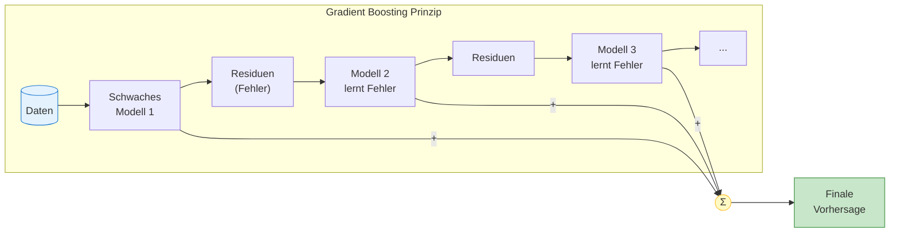
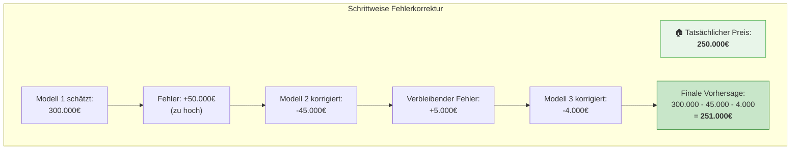
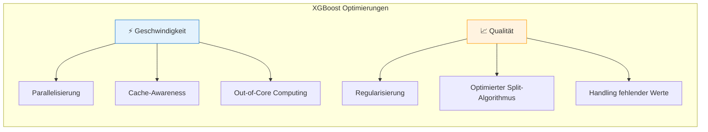
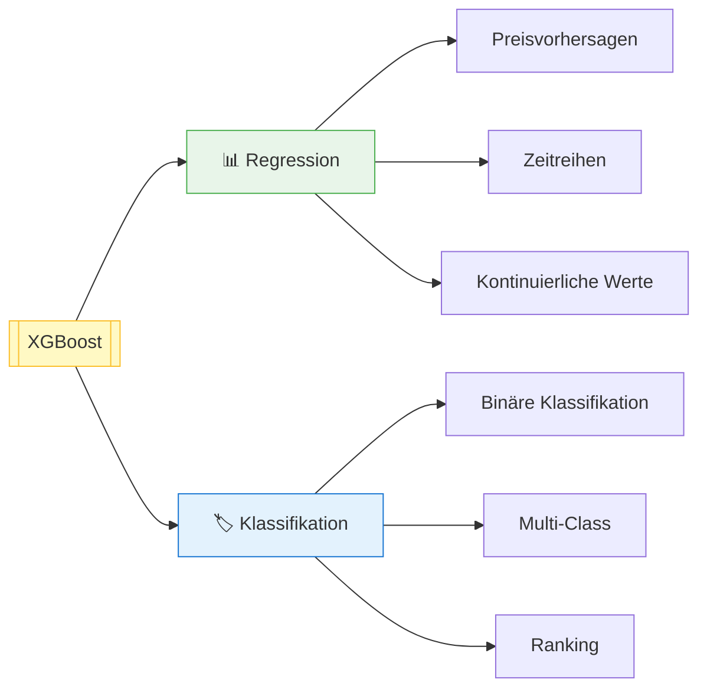
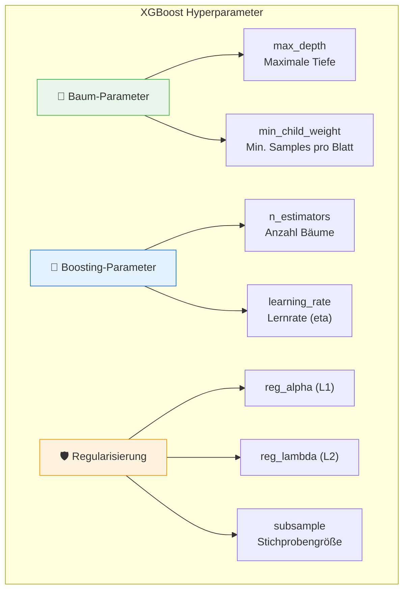

# XGBoost
{: .no_toc }

> **XGBoost (Extreme Gradient Boosting) ist eine hochoptimierte Implementierung des Gradient Boosting, die für Geschwindigkeit und Leistung entwickelt wurde.**    #
> Der Algorithmus kombiniert schwache Modelle sequentiell, wobei jedes neue Modell die Fehler der vorherigen korrigiert.

---

# Inhaltsverzeichnis
{: .no_toc .text-delta }

1. TOC
{:toc}

---

## Grundprinzip: Gradient Boosting

XGBoost basiert auf dem **Gradient Boosting**-Prinzip: Ein einzelnes schwaches Modell wird schrittweise "verstärkt", indem es mit einer Reihe weiterer Modelle kombiniert wird.

```mermaid
flowchart LR
    subgraph GB["Gradient Boosting Prinzip"]
        D[("Daten")] --> M1["Schwaches<br>Modell 1"]
        M1 --> R1["Residuen<br>(Fehler)"]
        R1 --> M2["Modell 2<br>lernt Fehler"]
        M2 --> R2["Residuen"]
        R2 --> M3["Modell 3<br>lernt Fehler"]
        M3 --> RN["..."]
    end
    
    M1 --> |"+"|SUM((Σ))
    M2 --> |"+"|SUM
    M3 --> |"+"|SUM
    
    SUM --> P["Finale<br>Vorhersage"]
    
    style D fill:#e3f2fd,stroke:#1976d2
    style SUM fill:#fff9c4,stroke:#fbc02d
    style P fill:#c8e6c9,stroke:#388e3c
```

### Der Boosting-Ablauf in 4 Schritten

| Schritt | Beschreibung |
|---------|--------------|
| **1** | Modell 1 macht erste Vorhersagen (oft noch ungenau) |
| **2** | Modell 2 lernt, wo Modell 1 falsch lag und korrigiert diese Fehler |
| **3** | Modell 3 korrigiert die verbleibenden Fehler von Modell 1+2 |
| **4** | Finale Vorhersage = Summe aller Modellbeiträge |

### Anschauliches Beispiel: Hauspreis-Vorhersage

```mermaid
flowchart TD
    subgraph Beispiel["Schrittweise Fehlerkorrektur"]
        REAL["🏠 Tatsächlicher Preis:<br><b>250.000€</b>"]
        
        M1["Modell 1 schätzt:<br>300.000€"]
        E1["Fehler: +50.000€<br>(zu hoch)"]
        
        M2["Modell 2 korrigiert:<br>-45.000€"]
        E2["Verbleibender Fehler:<br>+5.000€"]
        
        M3["Modell 3 korrigiert:<br>-4.000€"]
        
        PRED["Finale Vorhersage:<br>300.000 - 45.000 - 4.000<br>= <b>251.000€</b>"]
    end
    
    M1 --> E1 --> M2 --> E2 --> M3 --> PRED
    
    style REAL fill:#e8f5e9,stroke:#4caf50
    style PRED fill:#c8e6c9,stroke:#388e3c
```

> **Kernidee**
>
> Jedes neue Modell spezialisiert sich auf die verbleibenden Fehler. Dadurch werden die Vorhersagen mit jedem Schritt präziser.

---

## Was macht XGBoost "eXtreme"?

Das "eXtreme" in XGBoost bezieht sich auf mehrere Optimierungen, die den Algorithmus etwa **10x schneller** machen als herkömmliches Gradient Boosting.

```mermaid
flowchart TD
    subgraph XGB["XGBoost Optimierungen"]
        direction TB
        
        SPEED["⚡ Geschwindigkeit"]
        SPEED --> S1["Parallelisierung"]
        SPEED --> S2["Cache-Awareness"]
        SPEED --> S3["Out-of-Core Computing"]
        
        QUALITY["📈 Qualität"]
        QUALITY --> Q1["Regularisierung"]
        QUALITY --> Q2["Optimierter Split-Algorithmus"]
        QUALITY --> Q3["Handling fehlender Werte"]
    end
    
    style SPEED fill:#e3f2fd,stroke:#1976d2
    style QUALITY fill:#fff3e0,stroke:#ff9800
```

### Optimierungen im Detail

| Optimierung | Beschreibung | Vorteil |
|-------------|--------------|---------|
| **Parallel Computing** | Baumkonstruktion wird parallelisiert | Schnelleres Training |
| **Cache-Awareness** | Optimierte Speicherzugriffe | Effiziente Ressourcennutzung |
| **Regularisierung** | L1 und L2 integriert | Reduziert Overfitting |
| **Optimierter Split-Finder** | Approximative Split-Suche | Schneller bei großen Daten |
| **Sparsity-Awareness** | Effiziente Behandlung von Nullwerten | Besser mit fehlenden Daten |

---

## Einsatzbereiche

> [!NOTE] Wann XGBoost? 
> XGBoost ist besonders stark bei tabellarischen, heterogenen Daten mit nichtlinearen Zusammenhängen.

XGBoost kann für beide Hauptaufgaben des überwachten Lernens verwendet werden:

```mermaid
flowchart LR
    XGB[["XGBoost"]]
    
    XGB --> REG["📊 Regression"]
    XGB --> CLASS["🏷️ Klassifikation"]
    
    REG --> R1["Preisvorhersagen"]
    REG --> R2["Zeitreihen"]
    REG --> R3["Kontinuierliche Werte"]
    
    CLASS --> C1["Binäre Klassifikation"]
    CLASS --> C2["Multi-Class"]
    CLASS --> C3["Ranking"]
    
    style XGB fill:#fff9c4,stroke:#fbc02d
    style REG fill:#e8f5e9,stroke:#4caf50
    style CLASS fill:#e3f2fd,stroke:#1976d2
```

### Typische Anwendungsfälle

- **Kaggle-Wettbewerbe:** XGBoost ist einer der erfolgreichsten Algorithmen
- **Kreditrisiko-Bewertung:** Klassifikation von Kreditwürdigkeit
- **Fraud Detection:** Erkennung betrügerischer Transaktionen
- **Churn Prediction:** Vorhersage von Kundenabwanderung
- **Demand Forecasting:** Nachfragevorhersage im Retail

---

## XGBoost vs. Random Forest

| Aspekt | XGBoost | Random Forest |
|--------|---------|---------------|
| **Strategie** | Boosting (sequentiell) | Bagging (parallel) |
| **Fehlerkorrektur** | Fokus auf schwierige Fälle | Gleichmäßige Behandlung |
| **Geschwindigkeit** | Optimiert, aber sequentiell | Gut parallelisierbar |
| **Overfitting** | Regularisierung integriert | Natürlich robust |
| **Hyperparameter** | Mehr Tuning-Optionen | Weniger Tuning nötig |
| **Performance** | Oft höhere Genauigkeit | Robuster out-of-the-box |

---

## Wichtige Hyperparameter

> [!WARNING] Komplexität vs. Generalisierung 
> Zu tiefe Bäume und hohe `n_estimators` ohne passende Regularisierung erhöhen das Overfitting-Risiko.

```mermaid
flowchart TD
    subgraph HP["XGBoost Hyperparameter"]
        TREE["🌳 Baum-Parameter"]
        TREE --> T1["max_depth<br>Maximale Tiefe"]
        TREE --> T2["min_child_weight<br>Min. Samples pro Blatt"]
        
        BOOST["🔄 Boosting-Parameter"]
        BOOST --> B1["n_estimators<br>Anzahl Bäume"]
        BOOST --> B2["learning_rate<br>Lernrate (eta)"]
        
        REG["🛡️ Regularisierung"]
        REG --> R1["reg_alpha (L1)"]
        REG --> R2["reg_lambda (L2)"]
        REG --> R3["subsample<br>Stichprobengröße"]
    end
    
    style TREE fill:#e8f5e9,stroke:#4caf50
    style BOOST fill:#e3f2fd,stroke:#1976d2
    style REG fill:#fff3e0,stroke:#ff9800
```

| Parameter | Beschreibung | Typische Werte |
|-----------|--------------|----------------|
| `n_estimators` | Anzahl der Boosting-Runden | 100-1000 |
| `learning_rate` | Schrittgröße bei Updates | 0.01-0.3 |
| `max_depth` | Maximale Baumtiefe | 3-10 |
| `subsample` | Anteil der Trainingsdaten pro Baum | 0.5-1.0 |
| `colsample_bytree` | Anteil der Features pro Baum | 0.5-1.0 |
| `reg_alpha` | L1-Regularisierung | 0-1 |
| `reg_lambda` | L2-Regularisierung | 0-1 |

> [!TIP] Learning Rate und n_estimators 
> Eine niedrigere Learning Rate (z. B. `0.01`) erfordert mehr Boosting-Runden, liefert aber häufig robustere Ergebnisse.

---

## Zusammenfassung

**Die wichtigsten Erkenntnisse:**

- **XGBoost** ist eine hochoptimierte Gradient-Boosting-Implementierung
- Jedes Modell lernt aus den **Fehlern der Vorgänger**
- Die finale Vorhersage ist die **Summe aller Modellbeiträge**
- **Regularisierung** ist integriert und reduziert Overfitting
- Besonders erfolgreich bei **tabellarischen Daten** und in **ML-Wettbewerben**
- Erfordert mehr **Hyperparameter-Tuning** als Random Forest
## Abgrenzung zu verwandten Dokumenten

| Thema                                                           | Abgrenzung                                                                                                        |
| --------------------------------------------------------------- | ----------------------------------------------------------------------------------------------------------------- |
| [Ensemble-Methoden](./ensemble.html)                            | XGBoost spezialisiert Gradient Boosting; Ensemble-Methoden decken Bagging, Boosting und Stacking uebergreifend ab |
| [Random Forest](./random-forest.html)                           | Random Forest nutzt paralleles Bagging; XGBoost nutzt sequentielle Fehlerkorrektur durch Boosting                 |
| [Hyperparameter-Tuning](../evaluate/hyperparameter_tuning.html) | XGBoost ist die Modellklasse; Hyperparameter-Tuning optimiert Parameter wie learning_rate und max_depth           |

---

**Version:** 1.1 
**Stand:** April 2026 
**Kurs:** Machine Learning. Verstehen. Anwenden. Gestalten.