# XGBoost
{: .no_toc }

> **XGBoost (Extreme Gradient Boosting) ist eine hochoptimierte Implementierung des Gradient Boosting, die für Geschwindigkeit und Leistung entwickelt wurde. Der Algorithmus kombiniert schwache Modelle sequentiell, wobei jedes neue Modell die Fehler der vorherigen korrigiert.**

---

# Inhaltsverzeichnis
{: .no_toc .text-delta }

1. TOC
{:toc}

---

## Grundprinzip: Gradient Boosting

XGBoost basiert auf dem **Gradient Boosting**-Prinzip: Ein einzelnes schwaches Modell wird schrittweise "verstärkt", indem es mit einer Reihe weiterer Modelle kombiniert wird.

### Der Boosting-Ablauf in 4 Schritten

| Schritt | Beschreibung |
|---------|--------------|
| **1** | Modell 1 macht erste Vorhersagen (oft noch ungenau) |
| **2** | Modell 2 lernt, wo Modell 1 falsch lag und korrigiert diese Fehler |
| **3** | Modell 3 korrigiert die verbleibenden Fehler von Modell 1+2 |
| **4** | Finale Vorhersage = Summe aller Modellbeiträge |

### Anschauliches Beispiel: Hauspreis-Vorhersage

```mermaid
flowchart TD
    subgraph Beispiel["Schrittweise Fehlerkorrektur"]
        REAL["🏠 Tatsächlicher Preis:<br><b>250.000€</b>"]
        
        M1["Modell 1 schätzt:<br>300.000€"]
        E1["Fehler: +50.000€<br>(zu hoch)"]
        
        M2["Modell 2 korrigiert:<br>-45.000€"]
        E2["Verbleibender Fehler:<br>+5.000€"]
        
        M3["Modell 3 korrigiert:<br>-4.000€"]
        
        PRED["Finale Vorhersage:<br>300.000 - 45.000 - 4.000<br>= <b>251.000€</b>"]
    end
    
    M1 --> E1 --> M2 --> E2 --> M3 --> PRED
    
    style REAL fill:#e8f5e9,stroke:#4caf50
    style PRED fill:#c8e6c9,stroke:#388e3c
```

> **Kernidee**
>
> Jedes neue Modell spezialisiert sich auf die verbleibenden Fehler. Dadurch werden die Vorhersagen mit jedem Schritt präziser.

---

## Was macht XGBoost "eXtreme"?

Das "eXtreme" in XGBoost bezieht sich auf mehrere Optimierungen, die den Algorithmus etwa **10x schneller** machen als herkömmliches Gradient Boosting.

```mermaid
flowchart TD
    subgraph XGB["XGBoost Optimierungen"]
        direction TB
        
        SPEED["⚡ Geschwindigkeit"]
        SPEED --> S1["Parallelisierung"]
        SPEED --> S2["Cache-Awareness"]
        SPEED --> S3["Out-of-Core Computing"]
        
        QUALITY["📈 Qualität"]
        QUALITY --> Q1["Regularisierung"]
        QUALITY --> Q2["Optimierter Split-Algorithmus"]
        QUALITY --> Q3["Handling fehlender Werte"]
    end
    
    style SPEED fill:#e3f2fd,stroke:#1976d2
    style QUALITY fill:#fff3e0,stroke:#ff9800
```

### Optimierungen im Detail

| Optimierung | Beschreibung | Vorteil |
|-------------|--------------|---------|
| **Parallel Computing** | Baumkonstruktion wird parallelisiert | Schnelleres Training |
| **Cache-Awareness** | Optimierte Speicherzugriffe | Effiziente Ressourcennutzung |
| **Regularisierung** | L1 und L2 integriert | Reduziert Overfitting |
| **Optimierter Split-Finder** | Approximative Split-Suche | Schneller bei großen Daten |
| **Sparsity-Awareness** | Effiziente Behandlung von Nullwerten | Besser mit fehlenden Daten |

---

## Einsatzbereiche

XGBoost kann für beide Hauptaufgaben des überwachten Lernens verwendet werden:

```mermaid
flowchart LR
    XGB[["XGBoost"]]
    
    XGB --> REG["📊 Regression"]
    XGB --> CLASS["🏷️ Klassifikation"]
    
    REG --> R1["Preisvorhersagen"]
    REG --> R2["Zeitreihen"]
    REG --> R3["Kontinuierliche Werte"]
    
    CLASS --> C1["Binäre Klassifikation"]
    CLASS --> C2["Multi-Class"]
    CLASS --> C3["Ranking"]
    
    style XGB fill:#fff9c4,stroke:#fbc02d
    style REG fill:#e8f5e9,stroke:#4caf50
    style CLASS fill:#e3f2fd,stroke:#1976d2
```

### Typische Anwendungsfälle

- **Kaggle-Wettbewerbe:** XGBoost ist einer der erfolgreichsten Algorithmen
- **Kreditrisiko-Bewertung:** Klassifikation von Kreditwürdigkeit
- **Fraud Detection:** Erkennung betrügerischer Transaktionen
- **Churn Prediction:** Vorhersage von Kundenabwanderung
- **Demand Forecasting:** Nachfragevorhersage im Retail

---

## XGBoost vs. Random Forest

| Aspekt | XGBoost | Random Forest |
|--------|---------|---------------|
| **Strategie** | Boosting (sequentiell) | Bagging (parallel) |
| **Fehlerkorrektur** | Fokus auf schwierige Fälle | Gleichmäßige Behandlung |
| **Geschwindigkeit** | Optimiert, aber sequentiell | Gut parallelisierbar |
| **Overfitting** | Regularisierung integriert | Natürlich robust |
| **Hyperparameter** | Mehr Tuning-Optionen | Weniger Tuning nötig |
| **Performance** | Oft höhere Genauigkeit | Robuster out-of-the-box |

---

## Wichtige Hyperparameter

```mermaid
flowchart TD
    subgraph HP["XGBoost Hyperparameter"]
        TREE["🌳 Baum-Parameter"]
        TREE --> T1["max_depth<br>Maximale Tiefe"]
        TREE --> T2["min_child_weight<br>Min. Samples pro Blatt"]
        
        BOOST["🔄 Boosting-Parameter"]
        BOOST --> B1["n_estimators<br>Anzahl Bäume"]
        BOOST --> B2["learning_rate<br>Lernrate (eta)"]
        
        REG["🛡️ Regularisierung"]
        REG --> R1["reg_alpha (L1)"]
        REG --> R2["reg_lambda (L2)"]
        REG --> R3["subsample<br>Stichprobengröße"]
    end
    
    style TREE fill:#e8f5e9,stroke:#4caf50
    style BOOST fill:#e3f2fd,stroke:#1976d2
    style REG fill:#fff3e0,stroke:#ff9800
```

| Parameter | Beschreibung | Typische Werte |
|-----------|--------------|----------------|
| `n_estimators` | Anzahl der Boosting-Runden | 100-1000 |
| `learning_rate` | Schrittgröße bei Updates | 0.01-0.3 |
| `max_depth` | Maximale Baumtiefe | 3-10 |
| `subsample` | Anteil der Trainingsdaten pro Baum | 0.5-1.0 |
| `colsample_bytree` | Anteil der Features pro Baum | 0.5-1.0 |
| `reg_alpha` | L1-Regularisierung | 0-1 |
| `reg_lambda` | L2-Regularisierung | 0-1 |

> **Tipp: Learning Rate und n_estimators**
>
> Eine **niedrigere Learning Rate** (z.B. 0.01) erfordert **mehr Boosting-Runden** (n_estimators), führt aber oft zu besseren Ergebnissen. Der Trade-off ist längere Trainingszeit.

---

## Weiterführende Ressourcen

| Ressource | Beschreibung |
|-----------|--------------|
| [StatQuest XGBoost Part 1](https://www.youtube.com/c/joshstarmer) | Regression mit XGBoost |
| [StatQuest XGBoost Part 2](https://www.youtube.com/c/joshstarmer) | Klassifikation mit XGBoost |
| [StatQuest XGBoost Part 3](https://www.youtube.com/c/joshstarmer) | Mathematische Details |
| [StatQuest XGBoost Part 4](https://www.youtube.com/c/joshstarmer) | Optimierungen |
| [XGBoost Documentation](https://xgboost.readthedocs.io/) | Offizielle Dokumentation |

---

## Zusammenfassung

**Die wichtigsten Erkenntnisse:**

- **XGBoost** ist eine hochoptimierte Gradient-Boosting-Implementierung
- Jedes Modell lernt aus den **Fehlern der Vorgänger**
- Die finale Vorhersage ist die **Summe aller Modellbeiträge**
- **Regularisierung** ist integriert und reduziert Overfitting
- Besonders erfolgreich bei **tabellarischen Daten** und in **ML-Wettbewerben**
- Erfordert mehr **Hyperparameter-Tuning** als Random Forest

---

**Version:** 1.0    
**Stand:** Januar 2026    
**Kurs:** Machine Learning. Verstehen. Anwenden. Gestalten.    
