# Outlier – Ausreißer erkennen und behandeln
{: .no_toc }

> **Identifikation und Behandlung von Ausreißern in Datensätzen**    
> Z-Score, IQR, Isolation Forest - Capping, Winsorizing und robuste Methoden

---

## Überblick

Ein Ausreißer (Outlier) ist ein Datenpunkt, dessen Ausprägung stark von der Norm abweicht. Ausreißer können die Ergebnisse von Analysen und Machine-Learning-Modellen erheblich verzerren. Die korrekte Identifikation und Behandlung von Ausreißern ist daher ein wichtiger Schritt in der Datenvorverarbeitung.

## Kategorien von Ausreißern

```mermaid
flowchart TB
    subgraph kategorien["Kategorien von Ausreißern"]
        direction LR
        
        subgraph echt["Echte Ausreißer"]
            direction TB
            real["<b>Reale Anomalien</b><br/>Tatsächlich<br/>ungewöhnliche Werte"]
            real_ex["Beispiel:<br/>Betrugsfall,<br/>seltene Krankheit"]
        end
        
        subgraph fehler["Fehlerhafte Ausreißer"]
            direction TB
            error["<b>Datenfehler</b><br/>Falsche Eingaben<br/>oder Messungen"]
            error_ex["Beispiel:<br/>Tippfehler,<br/>Sensordefekt"]
        end
        
        subgraph einfluss["Einflussreiche Punkte"]
            direction TB
            influence["<b>Leverage Points</b><br/>Starker Einfluss auf<br/>Modellparameter"]
            influence_ex["Beispiel:<br/>Extremwert am<br/>Rand der Verteilung"]
        end
    end
    
    real --> real_ex
    error --> error_ex
    influence --> influence_ex

    style real fill:#4CAF50,color:#fff
    style error fill:#f44336,color:#fff
    style influence fill:#FF9800,color:#fff
```

## Typen von Anomalien

```mermaid
flowchart TD
    subgraph typen["Anomalie-Typen"]
        direction TB
        
        punkt["<b>Punkt-/Globale Anomalie</b><br/>Einzelner Datenpunkt weicht<br/>von gesamter Datenbasis ab"]
        kontext["<b>Kontextuelle Anomalie</b><br/>Wert ist nur im bestimmten<br/>Kontext anomal"]
        kollektiv["<b>Kollektive Anomalie</b><br/>Gruppe von Datenpunkten<br/>ist gemeinsam anomal"]
    end
    
    punkt --> punkt_ex["Beispiel:<br/>Gehalt von 1 Million €<br/>bei Durchschnitt 50.000 €"]
    
    kontext --> kontext_ex["Beispiel:<br/>30°C Außentemperatur<br/>im Januar (Mitteleuropa)"]
    
    kollektiv --> kollektiv_ex["Beispiel:<br/>Kreditkartenkäufe in USA<br/>und Frankreich zur gleichen Zeit"]

    style punkt fill:#e3f2fd
    style kontext fill:#fff3e0
    style kollektiv fill:#fce4ec
```

## Methoden zur Identifikation

```mermaid
flowchart TB
    subgraph methoden["Identifikationsmethoden"]
        direction LR
        
        subgraph wissen["Wissensbasiert"]
            domain["<b>Domänenwissen</b><br/>Fachexperten definieren<br/>plausible Bereiche"]
            rules["<b>Geschäftsregeln</b><br/>Vordefinierte Grenzen<br/>und Constraints"]
        end
        
        subgraph statistik["Statistikbasiert"]
            zscore["<b>Z-Score</b><br/>Standardabweichungen<br/>vom Mittelwert"]
            iqr["<b>IQR-Methode</b><br/>Interquartilsabstand"]
            percentile["<b>Perzentile</b><br/>Extreme Quantile"]
        end
        
        subgraph ml["ML-basiert"]
            iforest["<b>Isolation Forest</b><br/>Anomalie-Isolation<br/>durch Entscheidungsbäume"]
            lof["<b>Local Outlier Factor</b><br/>Lokale Dichte-<br/>abweichungen"]
            dbscan["<b>DBSCAN</b><br/>Dichtebasiertes<br/>Clustering"]
        end
    end

    style wissen fill:#e8f5e9
    style statistik fill:#e3f2fd
    style ml fill:#fff3e0
```

## Entscheidungsbaum zur Behandlung

```mermaid
flowchart TD
    start([Ausreißer erkannt]) --> analyse["Ursache analysieren"]
    
    analyse --> ursache{Ursache?}
    
    ursache -->|"Datenfehler"| korrigieren{"Korrektur<br/>möglich?"}
    ursache -->|"Echter Wert"| wichtig{"Fachlich<br/>wichtig?"}
    ursache -->|"Unklar"| vorsicht["Vorsichtiger<br/>Umgang"]
    
    korrigieren -->|"Ja"| fix["Wert korrigieren"]
    korrigieren -->|"Nein"| remove["Datenpunkt<br/>entfernen ❌"]
    
    wichtig -->|"Ja"| behalten["Behalten ✓<br/>Evtl. robust Modell"]
    wichtig -->|"Nein"| transform{"Transformation<br/>sinnvoll?"}
    
    transform -->|"Ja"| trans_methods["Capping / Winsorizing<br/>Log-Transformation"]
    transform -->|"Nein"| remove
    
    vorsicht --> robust["Robuste Methoden<br/>verwenden"]
    vorsicht --> sensitivity["Sensitivitätsanalyse<br/>mit/ohne Ausreißer"]
    
    fix --> ende([Ende])
    remove --> ende
    behalten --> ende
    trans_methods --> ende
    robust --> ende
    sensitivity --> ende

    style start fill:#2196F3,color:#fff
    style ende fill:#4CAF50,color:#fff
    style remove fill:#f44336,color:#fff
    style behalten fill:#4CAF50,color:#fff
```

## Statistische Methoden

### Z-Score Methode

```mermaid
flowchart LR
    subgraph zscore["Z-Score Methode"]
        direction TB
        formel["Z = (x - μ) / σ"]
        regel["Typische Regel:<br/>|Z| > 3 → Ausreißer"]
    end
    
    formel --> annahme["⚠️ Annahme:<br/>Normalverteilung"]
    regel --> vorteil["✅ Einfach<br/>✅ Interpretierbar"]
    regel --> nachteil["❌ Sensitiv bei<br/>nicht-normalverteilten Daten"]

    style zscore fill:#e3f2fd
```

### IQR-Methode (Tukey's Fences)

```mermaid
flowchart TB
    subgraph iqr["IQR-Methode"]
        direction TB
        calc["IQR = Q3 - Q1"]
        lower["Untere Grenze:<br/>Q1 - 1.5 × IQR"]
        upper["Obere Grenze:<br/>Q3 + 1.5 × IQR"]
    end
    
    calc --> lower
    calc --> upper
    
    lower --> outlier_check{"Wert außerhalb<br/>der Grenzen?"}
    upper --> outlier_check
    
    outlier_check -->|"Ja"| is_outlier["→ Ausreißer"]
    outlier_check -->|"Nein"| normal["→ Normaler Wert"]

    style iqr fill:#e8f5e9
    style is_outlier fill:#ffcdd2
    style normal fill:#c8e6c9
```

## Behandlungsstrategien

```mermaid
flowchart TB
    subgraph strategien["Behandlungsstrategien"]
        direction LR
        
        subgraph entfernen["Entfernen"]
            delete["<b>Löschen</b><br/>Zeilen mit Ausreißern<br/>aus Datensatz entfernen"]
        end
        
        subgraph anpassen["Anpassen"]
            cap["<b>Capping</b><br/>Auf Grenzwert<br/>begrenzen"]
            winsor["<b>Winsorizing</b><br/>Auf Perzentil-<br/>werte setzen"]
            transform["<b>Transformation</b><br/>Log, Wurzel,<br/>Box-Cox"]
        end
        
        subgraph robust["Robuste Methoden"]
            median_model["<b>Median statt Mean</b><br/>Robuste Statistiken"]
            robust_algo["<b>Robuste Algorithmen</b><br/>RANSAC, Huber"]
            ensemble["<b>Ensemble</b><br/>Ausreißer-resistente<br/>Modelle"]
        end
        
        subgraph behalten["Behalten"]
            keep["<b>Unverändert lassen</b><br/>Wenn fachlich<br/>relevant"]
            flag["<b>Markieren</b><br/>Als Feature für<br/>das Modell"]
        end
    end

    style entfernen fill:#ffcdd2
    style anpassen fill:#fff3e0
    style robust fill:#e3f2fd
    style behalten fill:#c8e6c9
```

## Visualisierung zur Erkennung

```mermaid
flowchart LR
    subgraph viz["Visualisierungsmethoden"]
        direction TB
        boxplot["<b>Boxplot</b><br/>Quartile und Ausreißer<br/>auf einen Blick"]
        scatter["<b>Scatterplot</b><br/>Multivariate<br/>Ausreißer erkennen"]
        histogram["<b>Histogramm</b><br/>Verteilung und<br/>extreme Werte"]
        violin["<b>Violinplot</b><br/>Verteilung mit<br/>Dichtedarstellung"]
    end
    
    boxplot --> bp_use["Schnelle univariate<br/>Analyse"]
    scatter --> sc_use["Beziehungen zwischen<br/>Variablen"]
    histogram --> hist_use["Verteilungsform<br/>verstehen"]
    violin --> vio_use["Detaillierte<br/>Verteilungsanalyse"]

    style viz fill:#f3e5f5
```

## Algorithmus: Isolation Forest

```mermaid
flowchart TD
    subgraph iforest["Isolation Forest Prinzip"]
        direction TB
        idea["<b>Grundidee:</b><br/>Anomalien sind leichter<br/>zu isolieren als normale Punkte"]
        
        step1["1. Zufällige Auswahl<br/>eines Features"]
        step2["2. Zufälliger Split-Wert<br/>zwischen Min und Max"]
        step3["3. Rekursive Partitionierung<br/>bis Isolation"]
        step4["4. Pfadlänge messen"]
        
        idea --> step1 --> step2 --> step3 --> step4
        
        step4 --> result{"Pfadlänge?"}
        result -->|"Kurz"| anomaly["🔴 Anomalie<br/>(schnell isoliert)"]
        result -->|"Lang"| normal["🟢 Normal<br/>(schwer zu isolieren)"]
    end

    style idea fill:#fff3e0
    style anomaly fill:#ffcdd2
    style normal fill:#c8e6c9
```

## Best Practices

| Empfehlung | Beschreibung |
|------------|--------------|
| **Immer visualisieren** | Boxplots und Scatterplots vor statistischen Tests |
| **Kontext verstehen** | Fachexperten einbeziehen bei der Interpretation |
| **Dokumentieren** | Welche Ausreißer wurden wie behandelt |
| **Mehrere Methoden** | Verschiedene Erkennungsmethoden kombinieren |
| **Sensitivitätsanalyse** | Modell mit und ohne Ausreißer vergleichen |
| **Vorsicht beim Löschen** | Nur echte Fehler entfernen, nicht unbequeme Werte |
| **Reihenfolge beachten** | Ausreißer vor Missing Values behandeln (oder umgekehrt konsistent) |

## Auswirkungen auf ML-Modelle

```mermaid
flowchart TB
    outlier["Unbehandelte<br/>Ausreißer"]
    
    outlier --> linreg["<b>Lineare Regression</b><br/>Stark beeinflusst<br/>❌ Sehr sensitiv"]
    outlier --> tree["<b>Entscheidungsbäume</b><br/>Weniger beeinflusst<br/>✓ Relativ robust"]
    outlier --> knn["<b>KNN</b><br/>Distanz-sensitiv<br/>❌ Sensitiv"]
    outlier --> svm["<b>SVM</b><br/>Abhängig von Kernel<br/>⚠️ Mittel"]
    outlier --> nn["<b>Neuronale Netze</b><br/>Gradient-beeinflusst<br/>❌ Sensitiv"]
    outlier --> rf["<b>Random Forest</b><br/>Ensemble-Effekt<br/>✓ Robust"]

    style outlier fill:#f44336,color:#fff
    style linreg fill:#ffcdd2
    style knn fill:#ffcdd2
    style nn fill:#ffcdd2
    style tree fill:#c8e6c9
    style rf fill:#c8e6c9
    style svm fill:#fff3e0
```

## Scikit-learn Klassen

| Klasse | Verwendung |
|--------|------------|
| `IsolationForest` | Unsupervised Anomalie-Erkennung |
| `LocalOutlierFactor` | Dichtebasierte lokale Ausreißer |
| `EllipticEnvelope` | Gaussian-basierte Ausreißer-Erkennung |
| `OneClassSVM` | SVM für Anomalie-Erkennung |

---

**Version:** 1.0    
**Stand:** Januar 2026    
**Kurs:** Machine Learning. Verstehen. Anwenden. Gestalten.    
