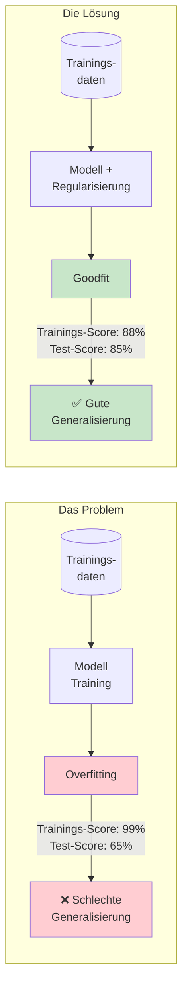
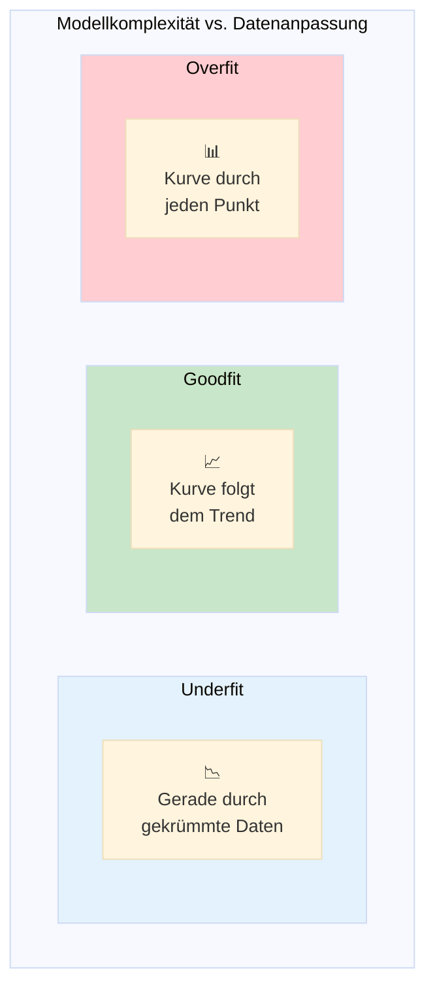
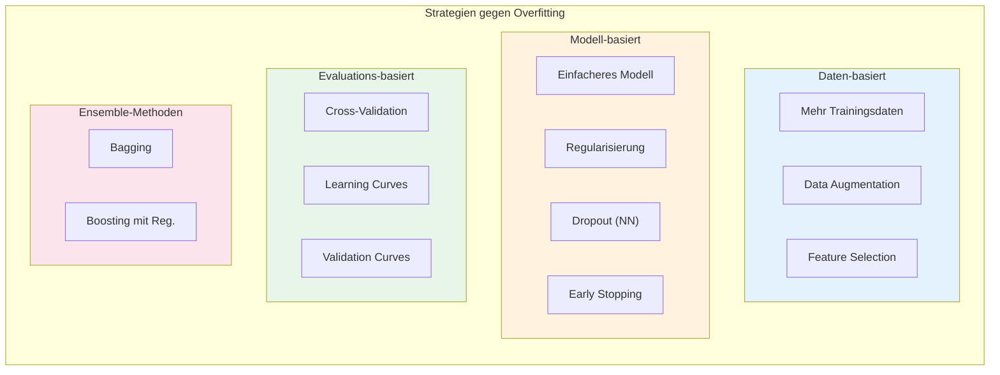
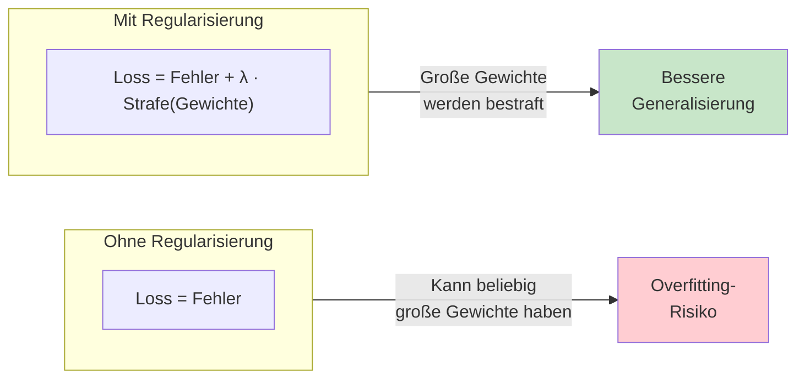
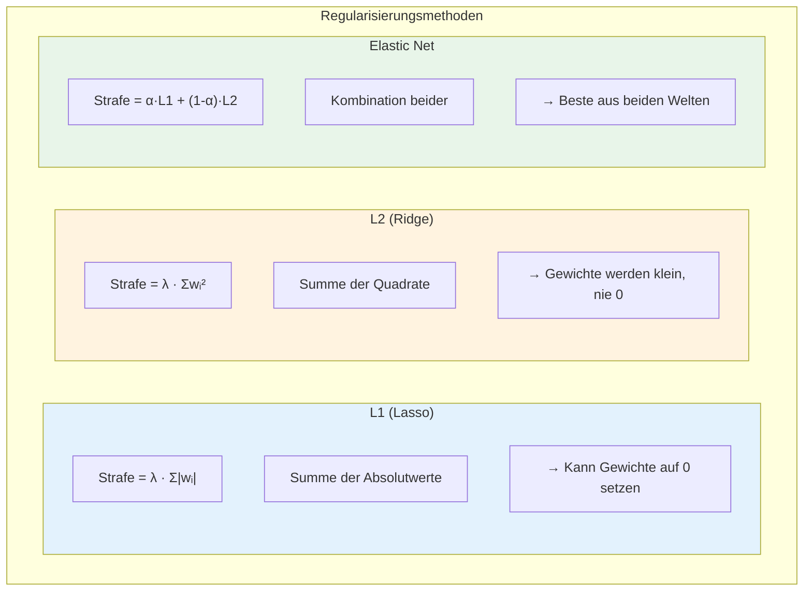
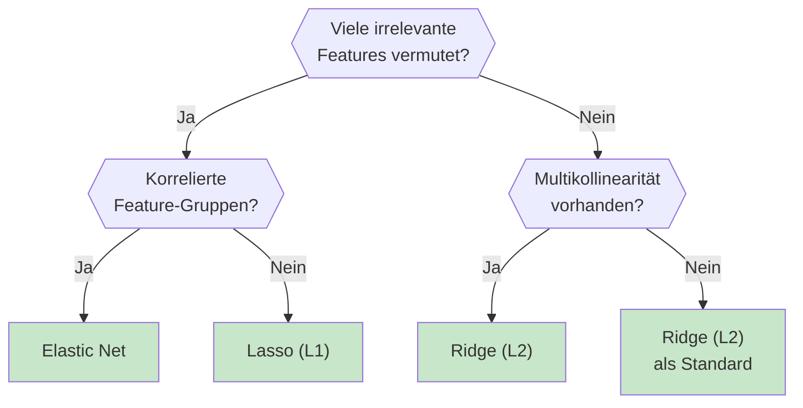
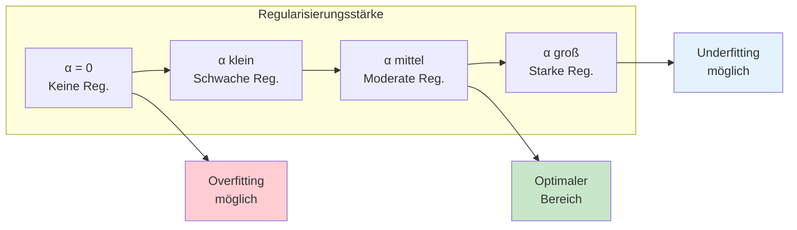
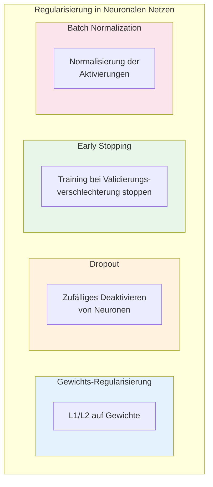
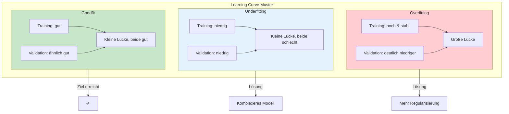
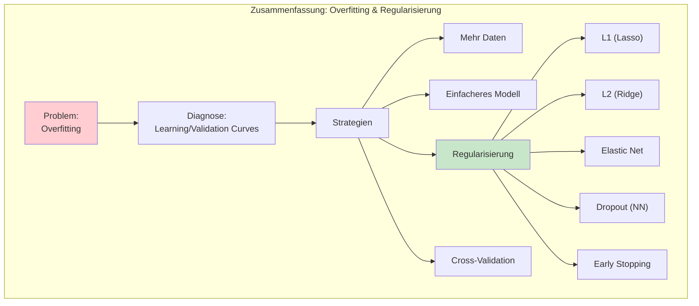

# Overfitting und Regularisierung
{: .no_toc }

> **Kontrolle der Modellkomplexität**
> L1 & L2 Regularisierung, Ridge, Lasso, Elastic Net und Early Stopping

---

## Überblick

Overfitting ist eines der zentralen Probleme im Machine Learning: Ein Modell lernt die Trainingsdaten "auswendig", anstatt allgemeine Muster zu erkennen. Regularisierung ist eine Familie von Techniken, die diesem Problem entgegenwirken, indem sie die Modellkomplexität kontrollieren.



## Underfit, Overfit und Goodfit

Die Qualität eines Machine-Learning-Modells lässt sich anhand seiner Fähigkeit beurteilen, sowohl Trainings- als auch Testdaten korrekt vorherzusagen.


### Visuelle Darstellung



### Charakteristiken im Detail

| Aspekt | Underfit | Goodfit | Overfit |
|--------|----------|---------|---------|
| **Modellkomplexität** | Zu niedrig | Angemessen | Zu hoch |
| **Trainings-Performance** | Schlecht | Gut | Sehr gut (oft ~100%) |
| **Test-Performance** | Schlecht | Gut | Schlecht |
| **Bias** | Hoch | Niedrig | Niedrig |
| **Varianz** | Niedrig | Niedrig | Hoch |
| **Problem** | Modell zu einfach | — | Modell zu komplex |
| **Lösung** | Komplexeres Modell | — | Regularisierung |

### Erkennung von Overfitting

```python
from sklearn.model_selection import train_test_split
from sklearn.ensemble import RandomForestClassifier
from sklearn.metrics import accuracy_score

# Daten aufteilen
X_train, X_test, y_train, y_test = train_test_split(X, y, test_size=0.2, random_state=42)

# Modell trainieren
model = RandomForestClassifier(n_estimators=100, max_depth=None, random_state=42)
model.fit(X_train, y_train)

# Performance vergleichen
train_score = accuracy_score(y_train, model.predict(X_train))
test_score = accuracy_score(y_test, model.predict(X_test))

print(f"Training Accuracy: {train_score:.3f}")
print(f"Test Accuracy:     {test_score:.3f}")
print(f"Differenz:         {train_score - test_score:.3f}")

# Faustregel: Differenz > 0.1 deutet auf Overfitting hin
if train_score - test_score > 0.1:
    print("⚠️ Mögliches Overfitting erkannt!")
```

## Strategien gegen Overfitting

Es gibt verschiedene Ansätze, um Overfitting zu vermeiden oder zu reduzieren:



### Übersicht der Strategien

| Strategie | Beschreibung | Wann anwenden? |
|-----------|--------------|----------------|
| **Mehr Daten** | Größerer Trainingsdatensatz | Wenn möglich, immer hilfreich |
| **Data Augmentation** | Künstliche Erweiterung der Daten | Bilder, Text, wenn echte Daten knapp |
| **Feature Selection** | Entfernen irrelevanter Merkmale | Viele Features, wenig Samples |
| **Einfacheres Modell** | Weniger Parameter/Komplexität | Als erste Maßnahme |
| **Regularisierung** | Bestrafung großer Gewichte | Standard bei linearen Modellen, NN |
| **Early Stopping** | Training vorzeitig beenden | Neuronale Netze |
| **Dropout** | Zufälliges Deaktivieren von Neuronen | Neuronale Netze |
| **Cross-Validation** | K-Fold zur robusten Bewertung | Immer empfohlen |
| **Ensemble-Methoden** | Kombination mehrerer Modelle | Random Forest, XGBoost |

## Regularisierung

Regularisierung fügt dem Optimierungsproblem einen Strafterm hinzu, der große Modellgewichte "bestraft". Dadurch wird das Modell gezwungen, einfachere Lösungen zu finden.



### Die drei Regularisierungsmethoden



### L1-Regularisierung (Lasso)

**Lasso** (Least Absolute Shrinkage and Selection Operator) verwendet die Summe der Absolutwerte der Gewichte als Strafterm.

**Eigenschaften:**
- Kann Gewichte exakt auf 0 setzen → **Feature Selection**
- Erzeugt sparse Modelle (wenige Features mit Gewicht ≠ 0)
- Robust gegenüber Ausreißern
- Gut bei vielen irrelevanten Features

```python
from sklearn.linear_model import Lasso, LassoCV
from sklearn.preprocessing import StandardScaler
from sklearn.model_selection import train_test_split

# Daten vorbereiten (Skalierung wichtig bei Regularisierung!)
scaler = StandardScaler()
X_train_scaled = scaler.fit_transform(X_train)
X_test_scaled = scaler.transform(X_test)

# Lasso mit festem Alpha
lasso = Lasso(alpha=0.1, random_state=42)
lasso.fit(X_train_scaled, y_train)

# Anzahl der Features mit Gewicht != 0
n_features_used = (lasso.coef_ != 0).sum()
print(f"Features verwendet: {n_features_used} von {X_train.shape[1]}")
print(f"R² Score: {lasso.score(X_test_scaled, y_test):.3f}")

# Optimales Alpha mit Cross-Validation finden
lasso_cv = LassoCV(cv=5, random_state=42)
lasso_cv.fit(X_train_scaled, y_train)
print(f"Optimales Alpha: {lasso_cv.alpha_:.4f}")
```

### L2-Regularisierung (Ridge)

**Ridge Regression** verwendet die Summe der quadrierten Gewichte als Strafterm.

**Eigenschaften:**
- Reduziert alle Gewichte, setzt aber keines auf 0
- Besserer Umgang mit Multikollinearität
- Empfindlicher gegenüber Ausreißern als Lasso
- Behält alle Features bei

```python
from sklearn.linear_model import Ridge, RidgeCV

# Ridge mit festem Alpha
ridge = Ridge(alpha=1.0)
ridge.fit(X_train_scaled, y_train)

print(f"R² Score: {ridge.score(X_test_scaled, y_test):.3f}")
print(f"Kleinster Koeffizient: {abs(ridge.coef_).min():.6f}")  # Nie exakt 0

# Optimales Alpha mit Cross-Validation
ridge_cv = RidgeCV(alphas=[0.01, 0.1, 1.0, 10.0, 100.0], cv=5)
ridge_cv.fit(X_train_scaled, y_train)
print(f"Optimales Alpha: {ridge_cv.alpha_:.2f}")
```

### Elastic Net (Kombination L1 + L2)

**Elastic Net** kombiniert die Vorteile beider Methoden.

**Eigenschaften:**
- Balance zwischen Feature Selection (L1) und Gruppierung korrelierter Features (L2)
- Kontrollparameter `l1_ratio`: 0 = Ridge, 1 = Lasso, dazwischen = Mix
- Gut bei vielen korrelierten Features

```python
from sklearn.linear_model import ElasticNet, ElasticNetCV

# Elastic Net mit festen Parametern
elastic = ElasticNet(alpha=0.1, l1_ratio=0.5, random_state=42)
elastic.fit(X_train_scaled, y_train)

print(f"R² Score: {elastic.score(X_test_scaled, y_test):.3f}")
print(f"Features mit Gewicht != 0: {(elastic.coef_ != 0).sum()}")

# Optimale Parameter mit Cross-Validation
elastic_cv = ElasticNetCV(
    l1_ratio=[0.1, 0.5, 0.7, 0.9, 0.95, 1.0],
    cv=5,
    random_state=42
)
elastic_cv.fit(X_train_scaled, y_train)
print(f"Optimales Alpha: {elastic_cv.alpha_:.4f}")
print(f"Optimales l1_ratio: {elastic_cv.l1_ratio_:.2f}")
```

### Vergleich der Regularisierungsmethoden

| Aspekt | L1 (Lasso) | L2 (Ridge) | Elastic Net |
|--------|------------|------------|-------------|
| **Strafterm** | Σ\|wᵢ\| | Σwᵢ² | α·L1 + (1-α)·L2 |
| **Feature Selection** | Ja (setzt Gewichte auf 0) | Nein | Ja |
| **Korrelierte Features** | Wählt eines aus | Behält alle | Gruppiert |
| **Ausreißer-Robustheit** | Robuster | Empfindlicher | Mittel |
| **Sparse Lösung** | Ja | Nein | Ja |
| **Beste Anwendung** | Viele irrelevante Features | Multikollinearität | Korrelierte Feature-Gruppen |

### Entscheidungshilfe



## Der Regularisierungsparameter λ (Alpha)

Der Parameter λ (in scikit-learn als `alpha` bezeichnet) steuert die Stärke der Regularisierung:



### Optimales Alpha finden

```python
import numpy as np
import matplotlib.pyplot as plt
from sklearn.linear_model import Ridge, Lasso
from sklearn.model_selection import cross_val_score

# Alpha-Werte zum Testen
alphas = np.logspace(-4, 4, 50)

# Scores für verschiedene Alphas berechnen
ridge_scores = []
lasso_scores = []

for alpha in alphas:
    # Ridge
    ridge = Ridge(alpha=alpha)
    scores = cross_val_score(ridge, X_train_scaled, y_train, cv=5, scoring='r2')
    ridge_scores.append(scores.mean())
    
    # Lasso
    lasso = Lasso(alpha=alpha, max_iter=10000)
    scores = cross_val_score(lasso, X_train_scaled, y_train, cv=5, scoring='r2')
    lasso_scores.append(scores.mean())

# Visualisierung
fig, ax = plt.subplots(figsize=(10, 5))
ax.semilogx(alphas, ridge_scores, label='Ridge', linewidth=2)
ax.semilogx(alphas, lasso_scores, label='Lasso', linewidth=2)
ax.set_xlabel('Alpha (Regularisierungsstärke)')
ax.set_ylabel('R² Score (Cross-Validation)')
ax.set_title('Regularisierungsstärke vs. Modellperformance')
ax.legend()
ax.grid(True, alpha=0.3)

# Optimale Alphas markieren
best_ridge_alpha = alphas[np.argmax(ridge_scores)]
best_lasso_alpha = alphas[np.argmax(lasso_scores)]
ax.axvline(best_ridge_alpha, color='blue', linestyle='--', alpha=0.5)
ax.axvline(best_lasso_alpha, color='orange', linestyle='--', alpha=0.5)

plt.tight_layout()
plt.savefig('regularization_alpha.png', dpi=150)
plt.show()

print(f"Optimales Alpha für Ridge: {best_ridge_alpha:.4f}")
print(f"Optimales Alpha für Lasso: {best_lasso_alpha:.4f}")
```

## Regularisierung in Neuronalen Netzen

In neuronalen Netzen gibt es zusätzliche Regularisierungstechniken:



### L1/L2-Regularisierung in Keras

```python
from tensorflow import keras
from tensorflow.keras import layers, regularizers

# Modell mit L2-Regularisierung
model = keras.Sequential([
    layers.Dense(64, activation='relu',
                 kernel_regularizer=regularizers.l2(0.01),  # L2 auf Gewichte
                 input_shape=(n_features,)),
    layers.Dense(32, activation='relu',
                 kernel_regularizer=regularizers.l2(0.01)),
    layers.Dense(1, activation='sigmoid')
])

# Oder L1-Regularisierung
model_l1 = keras.Sequential([
    layers.Dense(64, activation='relu',
                 kernel_regularizer=regularizers.l1(0.01),
                 input_shape=(n_features,)),
    layers.Dense(1, activation='sigmoid')
])

# Oder Elastic Net (L1 + L2)
model_elastic = keras.Sequential([
    layers.Dense(64, activation='relu',
                 kernel_regularizer=regularizers.l1_l2(l1=0.01, l2=0.01),
                 input_shape=(n_features,)),
    layers.Dense(1, activation='sigmoid')
])
```

### Dropout

Dropout deaktiviert während des Trainings zufällig einen Anteil der Neuronen, was das Netzwerk zwingt, robustere Features zu lernen.

```python
from tensorflow.keras import layers

model = keras.Sequential([
    layers.Dense(128, activation='relu', input_shape=(n_features,)),
    layers.Dropout(0.3),  # 30% der Neuronen werden deaktiviert
    layers.Dense(64, activation='relu'),
    layers.Dropout(0.3),
    layers.Dense(32, activation='relu'),
    layers.Dropout(0.2),  # Weniger Dropout in späteren Schichten
    layers.Dense(1, activation='sigmoid')
])
```

### Early Stopping

Early Stopping beendet das Training, wenn die Validierungsperformance nicht mehr verbessert wird.

```python
from tensorflow.keras.callbacks import EarlyStopping

# Early Stopping Callback
early_stopping = EarlyStopping(
    monitor='val_loss',      # Metrik überwachen
    patience=10,             # Epochen ohne Verbesserung warten
    restore_best_weights=True,  # Beste Gewichte wiederherstellen
    verbose=1
)

# Training mit Early Stopping
history = model.fit(
    X_train, y_train,
    epochs=200,              # Maximale Epochen
    validation_split=0.2,
    callbacks=[early_stopping],
    verbose=1
)

print(f"Training nach {len(history.history['loss'])} Epochen gestoppt")
```

### Kombinierte Regularisierung

```python
from tensorflow.keras.callbacks import EarlyStopping, ReduceLROnPlateau

# Modell mit mehreren Regularisierungstechniken
model = keras.Sequential([
    layers.Dense(128, activation='relu',
                 kernel_regularizer=regularizers.l2(0.001),
                 input_shape=(n_features,)),
    layers.BatchNormalization(),
    layers.Dropout(0.3),
    
    layers.Dense(64, activation='relu',
                 kernel_regularizer=regularizers.l2(0.001)),
    layers.BatchNormalization(),
    layers.Dropout(0.2),
    
    layers.Dense(1, activation='sigmoid')
])

# Callbacks
callbacks = [
    EarlyStopping(monitor='val_loss', patience=15, restore_best_weights=True),
    ReduceLROnPlateau(monitor='val_loss', factor=0.5, patience=5)
]

model.compile(optimizer='adam', loss='binary_crossentropy', metrics=['accuracy'])

history = model.fit(
    X_train, y_train,
    epochs=200,
    validation_split=0.2,
    callbacks=callbacks,
    batch_size=32
)
```

## Learning Curves zur Diagnose

Learning Curves zeigen, wie sich Training- und Validierungsperformance mit zunehmender Datenmenge entwickeln.

```python
import numpy as np
import matplotlib.pyplot as plt
from sklearn.model_selection import learning_curve

def plot_learning_curve(estimator, X, y, title, cv=5, scoring='accuracy'):
    """
    Erstellt Learning Curve zur Overfitting-Diagnose.
    """
    train_sizes, train_scores, val_scores = learning_curve(
        estimator, X, y,
        cv=cv,
        scoring=scoring,
        train_sizes=np.linspace(0.1, 1.0, 10),
        n_jobs=-1
    )
    
    train_mean = train_scores.mean(axis=1)
    train_std = train_scores.std(axis=1)
    val_mean = val_scores.mean(axis=1)
    val_std = val_scores.std(axis=1)
    
    fig, ax = plt.subplots(figsize=(10, 6))
    
    ax.fill_between(train_sizes, train_mean - train_std, train_mean + train_std,
                    alpha=0.1, color='blue')
    ax.fill_between(train_sizes, val_mean - val_std, val_mean + val_std,
                    alpha=0.1, color='orange')
    ax.plot(train_sizes, train_mean, 'o-', color='blue', label='Training Score')
    ax.plot(train_sizes, val_mean, 'o-', color='orange', label='Validation Score')
    
    ax.set_xlabel('Anzahl Trainingsbeispiele')
    ax.set_ylabel(scoring.capitalize())
    ax.set_title(title)
    ax.legend(loc='best')
    ax.grid(True, alpha=0.3)
    
    # Diagnose
    gap = train_mean[-1] - val_mean[-1]
    if gap > 0.1:
        ax.annotate('⚠️ Overfitting', xy=(train_sizes[-1], val_mean[-1]),
                   fontsize=12, color='red')
    
    plt.tight_layout()
    return fig

# Beispiel: Vergleich mit und ohne Regularisierung
from sklearn.linear_model import LogisticRegression

# Ohne Regularisierung
fig1 = plot_learning_curve(
    LogisticRegression(C=1000, max_iter=1000),  # C=1/λ, groß = wenig Reg.
    X_train_scaled, y_train,
    'Learning Curve: Schwache Regularisierung'
)

# Mit Regularisierung
fig2 = plot_learning_curve(
    LogisticRegression(C=0.1, max_iter=1000),  # Starke Regularisierung
    X_train_scaled, y_train,
    'Learning Curve: Starke Regularisierung'
)

plt.show()
```

### Interpretation der Learning Curves



## Validation Curves

Validation Curves zeigen, wie ein Hyperparameter (z.B. Regularisierungsstärke) die Performance beeinflusst.

```python
from sklearn.model_selection import validation_curve

def plot_validation_curve(estimator, X, y, param_name, param_range, title):
    """
    Erstellt Validation Curve für einen Hyperparameter.
    """
    train_scores, val_scores = validation_curve(
        estimator, X, y,
        param_name=param_name,
        param_range=param_range,
        cv=5,
        scoring='accuracy',
        n_jobs=-1
    )
    
    train_mean = train_scores.mean(axis=1)
    train_std = train_scores.std(axis=1)
    val_mean = val_scores.mean(axis=1)
    val_std = val_scores.std(axis=1)
    
    fig, ax = plt.subplots(figsize=(10, 6))
    
    ax.fill_between(param_range, train_mean - train_std, train_mean + train_std,
                    alpha=0.1, color='blue')
    ax.fill_between(param_range, val_mean - val_std, val_mean + val_std,
                    alpha=0.1, color='orange')
    ax.semilogx(param_range, train_mean, 'o-', color='blue', label='Training Score')
    ax.semilogx(param_range, val_mean, 'o-', color='orange', label='Validation Score')
    
    # Optimalen Wert markieren
    best_idx = np.argmax(val_mean)
    ax.axvline(param_range[best_idx], color='green', linestyle='--',
               label=f'Optimal: {param_range[best_idx]:.4f}')
    
    ax.set_xlabel(param_name)
    ax.set_ylabel('Accuracy')
    ax.set_title(title)
    ax.legend(loc='best')
    ax.grid(True, alpha=0.3)
    
    plt.tight_layout()
    return fig, param_range[best_idx]

# Beispiel: C-Parameter bei Logistic Regression (C = 1/λ)
from sklearn.linear_model import LogisticRegression

C_range = np.logspace(-4, 4, 20)
fig, best_C = plot_validation_curve(
    LogisticRegression(max_iter=1000),
    X_train_scaled, y_train,
    param_name='C',
    param_range=C_range,
    title='Validation Curve: Regularisierungsstärke (C = 1/λ)'
)

print(f"Optimaler C-Wert: {best_C:.4f}")
print(f"Entspricht Alpha: {1/best_C:.4f}")
plt.show()
```

## Vollständiges Beispiel: Regularisierung in der Praxis

```python
import numpy as np
import pandas as pd
import matplotlib.pyplot as plt
from sklearn.datasets import load_breast_cancer
from sklearn.model_selection import train_test_split, cross_val_score
from sklearn.preprocessing import StandardScaler
from sklearn.linear_model import LogisticRegression, Ridge, Lasso, ElasticNet
from sklearn.metrics import accuracy_score, classification_report

# 1. Daten laden
data = load_breast_cancer()
X, y = data.data, data.target
feature_names = data.feature_names

print(f"Dataset: {X.shape[0]} Samples, {X.shape[1]} Features")

# 2. Train-Test-Split
X_train, X_test, y_train, y_test = train_test_split(
    X, y, test_size=0.2, random_state=42, stratify=y
)

# 3. Skalierung (wichtig für Regularisierung!)
scaler = StandardScaler()
X_train_scaled = scaler.fit_transform(X_train)
X_test_scaled = scaler.transform(X_test)

# 4. Modelle mit verschiedenen Regularisierungsstärken vergleichen
results = []

for C in [0.001, 0.01, 0.1, 1, 10, 100, 1000]:
    model = LogisticRegression(C=C, max_iter=1000, random_state=42)
    model.fit(X_train_scaled, y_train)
    
    train_acc = accuracy_score(y_train, model.predict(X_train_scaled))
    test_acc = accuracy_score(y_test, model.predict(X_test_scaled))
    n_nonzero = (model.coef_ != 0).sum()
    
    results.append({
        'C (1/λ)': C,
        'λ': 1/C,
        'Train Acc': train_acc,
        'Test Acc': test_acc,
        'Gap': train_acc - test_acc,
        'Non-zero Coef': n_nonzero
    })

results_df = pd.DataFrame(results)
print("\nVergleich verschiedener Regularisierungsstärken:")
print(results_df.to_string(index=False))

# 5. Bestes Modell mit Cross-Validation finden
from sklearn.model_selection import GridSearchCV

param_grid = {'C': np.logspace(-3, 3, 20)}
grid_search = GridSearchCV(
    LogisticRegression(max_iter=1000, random_state=42),
    param_grid,
    cv=5,
    scoring='accuracy',
    return_train_score=True
)
grid_search.fit(X_train_scaled, y_train)

print(f"\nBester C-Wert: {grid_search.best_params_['C']:.4f}")
print(f"Beste CV-Accuracy: {grid_search.best_score_:.4f}")

# 6. Finales Modell evaluieren
best_model = grid_search.best_estimator_
y_pred = best_model.predict(X_test_scaled)

print("\nKlassifikationsbericht:")
print(classification_report(y_test, y_pred, target_names=data.target_names))

# 7. Feature Importance visualisieren
coef_df = pd.DataFrame({
    'Feature': feature_names,
    'Coefficient': best_model.coef_[0]
}).sort_values('Coefficient', key=abs, ascending=False)

print("\nTop 10 wichtigste Features:")
print(coef_df.head(10).to_string(index=False))
```

## Best Practices

### Dos ✅

- **Immer skalieren** vor Regularisierung (StandardScaler oder MinMaxScaler)
- **Cross-Validation** zur Auswahl des Regularisierungsparameters
- **Mit schwacher Regularisierung beginnen** und schrittweise erhöhen
- **Learning Curves** zur Diagnose von Overfitting nutzen
- **Kombination von Techniken** bei neuronalen Netzen (Dropout + L2 + Early Stopping)

### Don'ts ❌

- **Keine Skalierung** führt zu verzerrten Regularisierungseffekten
- **Zu starke Regularisierung** führt zu Underfitting
- **Regularisierung auf Test-Daten anpassen** (nur Training/Validation!)
- **Blind eine Methode wählen** ohne Datenanalyse

## Faustregeln für die Praxis

| Situation | Empfohlene Regularisierung | Begründung |
|-----------|---------------------------|-------------|
| Viele Features, vermutlich irrelevante | **Lasso (L1)** | Eliminiert unwichtige Features |
| Multikollinearität | **Ridge (L2)** | Behält alle Features, reduziert Gewichte |
| Sparsames Modell gewünscht | **Lasso (L1)** | Führt zu weniger Features im Modell |
| Mehr Features als Samples | **Lasso oder Elastic Net** | Reduziert Dimensionalität |
| Robustheit gegenüber Ausreißern | **Ridge (L2)** | Weniger empfindlich |
| Korrelierte Feature-Gruppen | **Elastic Net** | Kombiniert Vorteile beider |
| Neuronales Netz | **Dropout + L2 + Early Stopping** | Kombinierte Techniken |
| Unsicher | **Ridge (L2)** | Guter Default |

## Zusammenfassung



| Konzept | Beschreibung |
|---------|--------------|
| **Overfitting** | Modell lernt Trainingsdaten auswendig, versagt bei neuen Daten |
| **Underfitting** | Modell zu einfach, erfasst keine Muster |
| **Regularisierung** | Strafterm für komplexe Modelle im Loss |
| **L1 (Lasso)** | Feature Selection, sparse Modelle |
| **L2 (Ridge)** | Alle Features behalten, Gewichte klein |
| **Elastic Net** | Kombination L1 + L2 |
| **Wichtiger Parameter** | λ (alpha) steuert Regularisierungsstärke |
| **Skalierung** | Immer vor Regularisierung erforderlich |

Regularisierung ist ein fundamentales Werkzeug im Machine Learning. Die richtige Balance zwischen Modellkomplexität und Generalisierungsfähigkeit zu finden, ist der Schlüssel zu robusten, zuverlässigen Modellen.

## Weiterführende Themen

- **Cross-Validation**: K-Fold zur robusten Modellbewertung
- **Hyperparameter-Tuning**: GridSearchCV, RandomizedSearchCV
- **Ensemble-Methoden**: Random Forest, XGBoost mit eingebauter Regularisierung
- **Batch Normalization**: Implizite Regularisierung in Deep Learning

---

*Referenzen:*
- scikit-learn Dokumentation: [Regularization](https://scikit-learn.org/stable/modules/linear_model.html)
- StatQuest: [Regularization](https://www.youtube.com/watch?v=Q81RR3yKn30)
- KNIME: Regularization Tutorial
