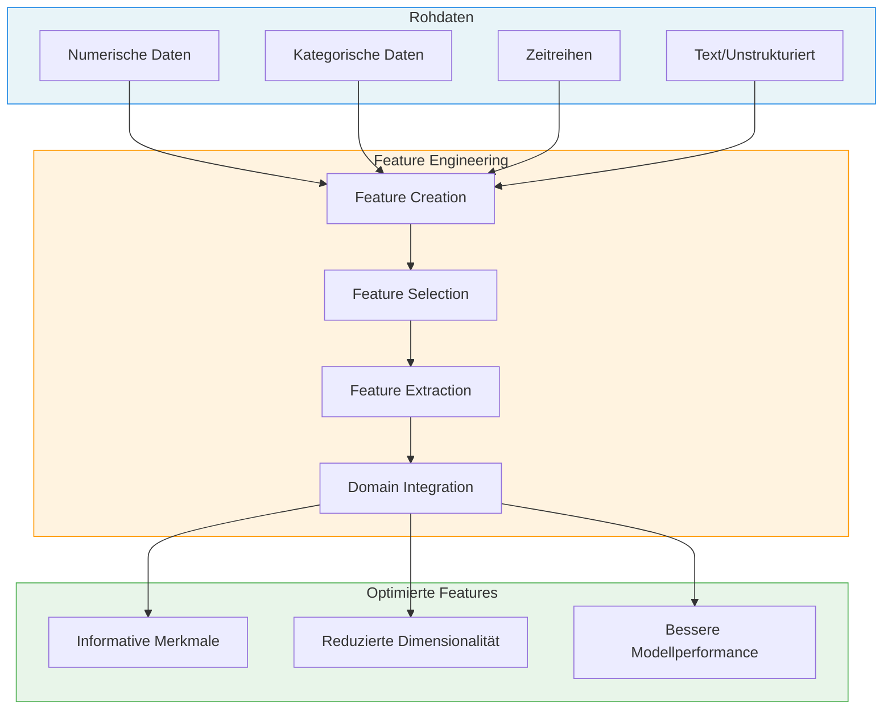
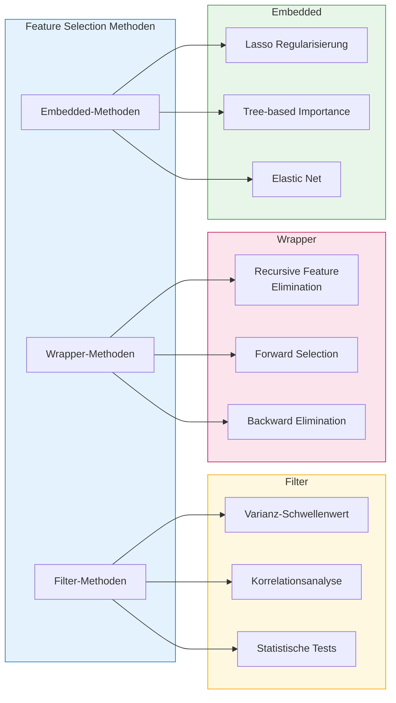
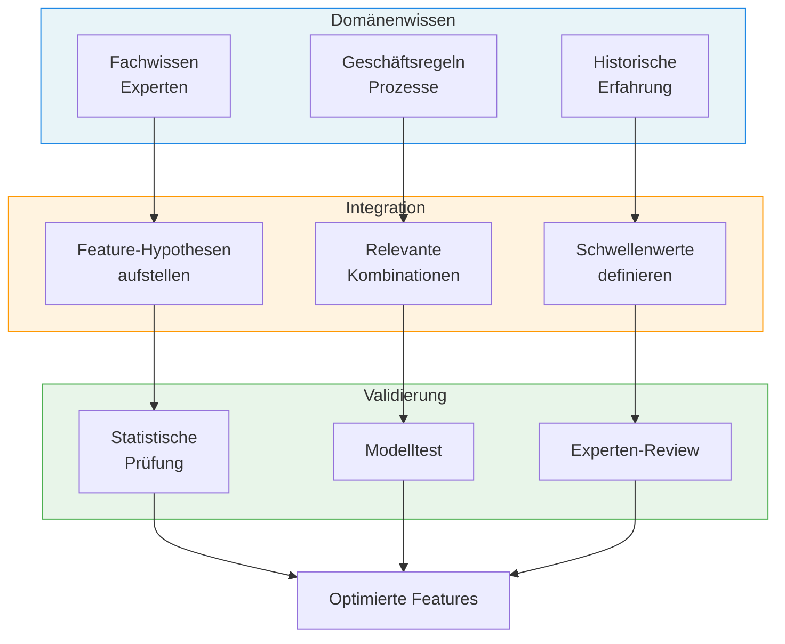
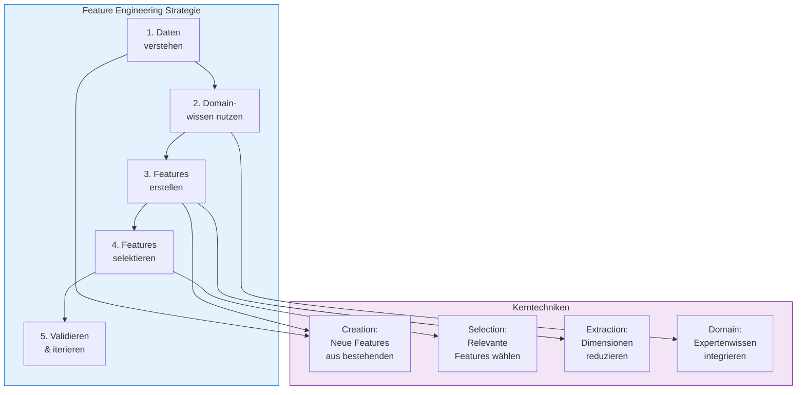

# Feature Engineering
{: .no_toc }

> **Feature Engineering umfasst alle Techniken zur systematischen Erstellung, Auswahl und Transformation von Merkmalen, um die Vorhersagekraft von Machine-Learning-Modellen zu maximieren. Es ist oft der entscheidende Faktor zwischen einem mittelmäßigen und einem exzellenten Modell.**

---

## Inhaltsverzeichnis
{: .no_toc .text-delta }

1. TOC
{:toc}

---

## Grundlagen des Feature Engineering

Feature Engineering ist der Prozess der Nutzung von Domänenwissen und statistischen Techniken, um aus Rohdaten informative Merkmale zu erstellen. Die Qualität der Features beeinflusst die Modellperformance oft stärker als die Wahl des Algorithmus.



### Warum Feature Engineering wichtig ist

| Aspekt | Auswirkung |
|--------|------------|
| **Modellgenauigkeit** | Bessere Features führen zu präziseren Vorhersagen |
| **Trainingszeit** | Relevante Features reduzieren die Rechenzeit |
| **Interpretierbarkeit** | Aussagekräftige Features erleichtern das Modellverständnis |
| **Generalisierung** | Robuste Features verbessern die Performance auf neuen Daten |
| **Dimensionalität** | Feature Selection reduziert den Fluch der Dimensionalität |

---

## Feature Creation

Feature Creation (Merkmalskonstruktion) bezeichnet das Erstellen neuer Features aus bestehenden Daten durch arithmetische, logische oder domänenspezifische Transformationen.

### Arithmetische Transformationen

Neue Features entstehen durch mathematische Verknüpfung bestehender Merkmale.

```python
import pandas as pd
import numpy as np

# Beispieldaten: Immobiliendaten
data = pd.DataFrame({
    'wohnflaeche': [80, 120, 95, 150, 75],
    'zimmer': [3, 4, 3, 5, 2],
    'baujahr': [1990, 2015, 2005, 2020, 1985],
    'preis': [250000, 450000, 320000, 580000, 180000]
})

# Feature Creation durch arithmetische Operationen
data['preis_pro_qm'] = data['preis'] / data['wohnflaeche']
data['qm_pro_zimmer'] = data['wohnflaeche'] / data['zimmer']
data['alter'] = 2025 - data['baujahr']
data['ist_neubau'] = (data['alter'] <= 5).astype(int)

print("Erweiterte Features:")
print(data[['wohnflaeche', 'preis_pro_qm', 'qm_pro_zimmer', 'alter', 'ist_neubau']])
```

### Interaktions-Features

Interaktions-Features erfassen Beziehungen zwischen mehreren Variablen, die einzeln betrachtet nicht sichtbar wären.

```python
from sklearn.preprocessing import PolynomialFeatures
import pandas as pd
import numpy as np

# Beispieldaten
data = pd.DataFrame({
    'feature_a': [1, 2, 3, 4, 5],
    'feature_b': [2, 4, 6, 8, 10],
    'feature_c': [1, 3, 2, 4, 3]
})

# Polynomial Features erzeugen (Grad 2, nur Interaktionen)
poly = PolynomialFeatures(degree=2, interaction_only=True, include_bias=False)
data_poly = poly.fit_transform(data)

# Feature-Namen generieren
feature_names = poly.get_feature_names_out(data.columns)
data_expanded = pd.DataFrame(data_poly, columns=feature_names)

print("Original Features:", list(data.columns))
print("Erweiterte Features:", list(feature_names))
print("\nErweiterte Daten:")
print(data_expanded.head())
```

### Binning und Diskretisierung

Kontinuierliche Variablen werden in kategorische Bereiche (Bins) umgewandelt, um nichtlineare Beziehungen zu erfassen.

```python
import pandas as pd
import numpy as np

# Beispieldaten: Alter von Kunden
data = pd.DataFrame({
    'alter': [22, 35, 48, 19, 67, 54, 31, 45, 28, 72]
})

# Methode 1: Gleichmäßige Bins (cut)
data['altersgruppe_gleichmaessig'] = pd.cut(
    data['alter'], 
    bins=4, 
    labels=['Jung', 'Mittel', 'Aelter', 'Senior']
)

# Methode 2: Quantil-basierte Bins (qcut)
data['altersgruppe_quantil'] = pd.qcut(
    data['alter'], 
    q=4, 
    labels=['Q1', 'Q2', 'Q3', 'Q4']
)

# Methode 3: Benutzerdefinierte Grenzen
bins_custom = [0, 25, 40, 60, 100]
labels_custom = ['U25', '25-40', '40-60', 'Ue60']
data['altersgruppe_custom'] = pd.cut(
    data['alter'], 
    bins=bins_custom, 
    labels=labels_custom
)

print(data)
```

### Zeitbasierte Features

Aus Zeitstempeln lassen sich vielfältige informative Features ableiten.

```python
import pandas as pd
import numpy as np

# Beispieldaten mit Zeitstempeln
data = pd.DataFrame({
    'timestamp': pd.date_range('2024-01-01', periods=10, freq='D'),
    'umsatz': [1200, 980, 1450, 2100, 2300, 1100, 950, 1300, 1800, 2000]
})

# Zeitbasierte Features extrahieren
data['jahr'] = data['timestamp'].dt.year
data['monat'] = data['timestamp'].dt.month
data['tag'] = data['timestamp'].dt.day
data['wochentag'] = data['timestamp'].dt.dayofweek  # 0=Montag, 6=Sonntag
data['wochentag_name'] = data['timestamp'].dt.day_name()
data['ist_wochenende'] = (data['wochentag'] >= 5).astype(int)
data['quartal'] = data['timestamp'].dt.quarter
data['kalenderwoche'] = data['timestamp'].dt.isocalendar().week

# Zyklische Kodierung für Wochentag (sinnvoll für Modelle)
data['wochentag_sin'] = np.sin(2 * np.pi * data['wochentag'] / 7)
data['wochentag_cos'] = np.cos(2 * np.pi * data['wochentag'] / 7)

print(data[['timestamp', 'wochentag_name', 'ist_wochenende', 'wochentag_sin', 'wochentag_cos']])
```

> **Hinweis zur zyklischen Kodierung**
>
> Bei zyklischen Features wie Wochentag oder Monat ist eine Sinus/Kosinus-Transformation sinnvoll, da sie die zyklische Natur abbildet: Montag und Sonntag liegen nahe beieinander, obwohl ihre numerischen Werte (0 und 6) weit auseinander sind.

---

## Feature Selection

Feature Selection identifiziert die relevantesten Merkmale und entfernt redundante oder irrelevante Features. Dies verbessert die Modellperformance und reduziert Overfitting.



### Filter-Methoden

Filter-Methoden bewerten Features unabhängig vom Modell anhand statistischer Kennzahlen.

#### Varianz-Schwellenwert

Features mit geringer Varianz tragen wenig zur Unterscheidung bei und können entfernt werden.

```python
from sklearn.feature_selection import VarianceThreshold
import pandas as pd
import numpy as np

# Beispieldaten mit einem konstanten Feature
data = pd.DataFrame({
    'feature_a': [1, 2, 3, 4, 5, 6, 7, 8, 9, 10],
    'feature_b': [1, 1, 1, 1, 1, 1, 1, 1, 1, 1],  # Konstant - keine Varianz
    'feature_c': [0.1, 0.2, 0.1, 0.2, 0.1, 0.2, 0.1, 0.2, 0.1, 0.2],  # Geringe Varianz
    'feature_d': [10, 25, 15, 30, 20, 35, 25, 40, 30, 45]
})

print("Varianz der Features:")
print(data.var())

# VarianceThreshold anwenden (Schwellenwert: 0.1)
selector = VarianceThreshold(threshold=0.1)
data_selected = selector.fit_transform(data)

# Ausgewählte Features identifizieren
selected_features = data.columns[selector.get_support()]
print(f"\nAusgewählte Features: {list(selected_features)}")
print(f"Entfernte Features: {list(data.columns[~selector.get_support()])}")
```

#### Korrelationsanalyse

Hoch korrelierte Features liefern redundante Informationen. Eines davon kann entfernt werden.

```python
import pandas as pd
import numpy as np
import matplotlib.pyplot as plt
import seaborn as sns

# Beispieldaten mit korrelierten Features
np.random.seed(42)
data = pd.DataFrame({
    'feature_a': np.random.randn(100),
    'feature_b': np.random.randn(100),
})
# feature_c ist stark korreliert mit feature_a
data['feature_c'] = data['feature_a'] * 0.9 + np.random.randn(100) * 0.1
data['feature_d'] = np.random.randn(100)

# Korrelationsmatrix berechnen
correlation_matrix = data.corr()
print("Korrelationsmatrix:")
print(correlation_matrix.round(3))

def remove_highly_correlated(df, threshold=0.8):
    """Entfernt Features mit hoher Korrelation."""
    corr_matrix = df.corr().abs()
    upper = corr_matrix.where(np.triu(np.ones(corr_matrix.shape), k=1).astype(bool))
    
    to_drop = [column for column in upper.columns if any(upper[column] > threshold)]
    return df.drop(columns=to_drop), to_drop

data_reduced, dropped = remove_highly_correlated(data, threshold=0.8)
print(f"\nEntfernte Features (Korrelation > 0.8): {dropped}")
print(f"Verbleibende Features: {list(data_reduced.columns)}")
```

#### SelectKBest mit statistischen Tests

SelectKBest wählt die k besten Features basierend auf statistischen Tests aus.

```python
from sklearn.feature_selection import SelectKBest, f_classif, mutual_info_classif
from sklearn.datasets import make_classification
import pandas as pd

# Synthetische Klassifikationsdaten
data, target = make_classification(
    n_samples=200, 
    n_features=10, 
    n_informative=3,  # Nur 3 sind wirklich informativ
    n_redundant=2, 
    n_classes=2, 
    random_state=42
)

feature_names = [f'feature_{i}' for i in range(10)]
data_df = pd.DataFrame(data, columns=feature_names)

# SelectKBest mit F-Test (ANOVA)
selector_f = SelectKBest(score_func=f_classif, k=5)
selector_f.fit(data, target)

# Ergebnisse anzeigen
scores_df = pd.DataFrame({
    'Feature': feature_names,
    'F-Score': selector_f.scores_,
    'p-Value': selector_f.pvalues_
}).sort_values('F-Score', ascending=False)

print("Feature Ranking (F-Test):")
print(scores_df.round(4))

# Beste Features auswählen
best_features = data_df.columns[selector_f.get_support()]
print(f"\nAusgewählte Top-5 Features: {list(best_features)}")
```

### Wrapper-Methoden

Wrapper-Methoden verwenden ein Modell, um Features iterativ zu bewerten.

#### Recursive Feature Elimination (RFE)

RFE entfernt schrittweise die unwichtigsten Features basierend auf dem Modell.

```python
from sklearn.feature_selection import RFE, RFECV
from sklearn.ensemble import RandomForestClassifier
from sklearn.datasets import make_classification
from sklearn.model_selection import cross_val_score
import pandas as pd

# Daten generieren
data, target = make_classification(
    n_samples=200, 
    n_features=15, 
    n_informative=5, 
    n_redundant=3, 
    random_state=42
)

feature_names = [f'feature_{i}' for i in range(15)]
data_df = pd.DataFrame(data, columns=feature_names)

# RFE mit Random Forest
model = RandomForestClassifier(n_estimators=100, random_state=42)
rfe = RFE(estimator=model, n_features_to_select=5, step=1)
rfe.fit(data, target)

# Ergebnisse
rfe_results = pd.DataFrame({
    'Feature': feature_names,
    'Ranking': rfe.ranking_,
    'Ausgewählt': rfe.support_
}).sort_values('Ranking')

print("RFE Feature Ranking:")
print(rfe_results)

# Alternativ: RFECV mit automatischer Bestimmung der optimalen Feature-Anzahl
rfecv = RFECV(estimator=model, step=1, cv=5, scoring='accuracy')
rfecv.fit(data, target)
print(f"\nOptimale Anzahl Features (RFECV): {rfecv.n_features_}")
```

### Embedded-Methoden

Embedded-Methoden integrieren die Feature Selection in den Trainingsprozess.

#### Feature Importance aus Tree-basierten Modellen

```python
from sklearn.ensemble import RandomForestClassifier
from sklearn.datasets import make_classification
import pandas as pd
import numpy as np

# Daten generieren
data, target = make_classification(
    n_samples=300, 
    n_features=12, 
    n_informative=4, 
    n_redundant=2, 
    random_state=42
)

feature_names = [f'feature_{i}' for i in range(12)]

# Random Forest trainieren
model = RandomForestClassifier(n_estimators=100, random_state=42)
model.fit(data, target)

# Feature Importance extrahieren
importance_df = pd.DataFrame({
    'Feature': feature_names,
    'Importance': model.feature_importances_
}).sort_values('Importance', ascending=False)

print("Feature Importance (Random Forest):")
print(importance_df.round(4))

# Features mit Importance über Schwellenwert auswählen
threshold = 0.05
selected = importance_df[importance_df['Importance'] > threshold]['Feature'].tolist()
print(f"\nAusgewählte Features (Importance > {threshold}): {selected}")
```

#### Lasso Regularisierung (L1)

Lasso-Regression setzt die Koeffizienten irrelevanter Features auf null und führt so automatisch Feature Selection durch.

```python
from sklearn.linear_model import LassoCV
from sklearn.preprocessing import StandardScaler
from sklearn.datasets import make_regression
import pandas as pd
import numpy as np

# Regressionsdaten generieren
data, target = make_regression(
    n_samples=200, 
    n_features=15, 
    n_informative=5, 
    noise=10, 
    random_state=42
)

feature_names = [f'feature_{i}' for i in range(15)]

# Skalierung ist wichtig für Lasso
scaler = StandardScaler()
data_scaled = scaler.fit_transform(data)

# LassoCV findet automatisch den optimalen Regularisierungsparameter
model = LassoCV(cv=5, random_state=42)
model.fit(data_scaled, target)

# Koeffizienten analysieren
coef_df = pd.DataFrame({
    'Feature': feature_names,
    'Koeffizient': model.coef_
}).sort_values('Koeffizient', key=abs, ascending=False)

print("Lasso Koeffizienten:")
print(coef_df.round(4))

# Features mit Koeffizient != 0
selected_features = coef_df[coef_df['Koeffizient'] != 0]['Feature'].tolist()
print(f"\nAusgewählte Features (Koeffizient ≠ 0): {len(selected_features)} von {len(feature_names)}")
```

---

## Feature Extraction

Feature Extraction transformiert Rohdaten in eine kompaktere, informativere Repräsentation. Im Gegensatz zur Feature Selection werden hier neue Features aus den bestehenden abgeleitet.

### Hauptkomponentenanalyse (PCA)

PCA reduziert die Dimensionalität, indem es die Daten auf die Hauptvarianzrichtungen projiziert.

```python
from sklearn.decomposition import PCA
from sklearn.preprocessing import StandardScaler
from sklearn.datasets import load_iris
import pandas as pd
import numpy as np

# Iris-Datensatz laden
iris = load_iris()
data = iris.data
feature_names = iris.feature_names

print(f"Original: {data.shape[1]} Features")

# Standardisierung (wichtig für PCA)
scaler = StandardScaler()
data_scaled = scaler.fit_transform(data)

# PCA anwenden
pca = PCA()
data_pca = pca.fit_transform(data_scaled)

# Erklärte Varianz pro Komponente
variance_df = pd.DataFrame({
    'Komponente': [f'PC{i+1}' for i in range(len(pca.explained_variance_ratio_))],
    'Erklärte Varianz': pca.explained_variance_ratio_,
    'Kumulativ': np.cumsum(pca.explained_variance_ratio_)
})

print("\nErklärte Varianz pro Hauptkomponente:")
print(variance_df.round(4))

# PCA mit 2 Komponenten für Visualisierung
pca_2d = PCA(n_components=2)
data_2d = pca_2d.fit_transform(data_scaled)

print(f"\nReduziert auf 2 Komponenten: {pca_2d.explained_variance_ratio_.sum()*100:.1f}% Varianz erklärt")
```

### Text-Feature-Extraktion

Aus Textdaten lassen sich numerische Features durch verschiedene Techniken extrahieren.

```python
from sklearn.feature_extraction.text import CountVectorizer, TfidfVectorizer
import pandas as pd

# Beispiel-Texte
texte = [
    "Machine Learning ist ein Teilgebiet der künstlichen Intelligenz",
    "Deep Learning verwendet neuronale Netze mit vielen Schichten",
    "Feature Engineering verbessert die Modellperformance",
    "Neuronale Netze lernen komplexe Muster aus Daten"
]

# Bag of Words (CountVectorizer)
count_vec = CountVectorizer()
bow_matrix = count_vec.fit_transform(texte)

print("Bag of Words - Vokabular:")
print(count_vec.get_feature_names_out()[:10])  # Erste 10 Wörter
print(f"\nMatrix-Form: {bow_matrix.shape}")

# TF-IDF (Term Frequency - Inverse Document Frequency)
tfidf_vec = TfidfVectorizer()
tfidf_matrix = tfidf_vec.fit_transform(texte)

# TF-IDF Werte für ersten Text
tfidf_df = pd.DataFrame(
    tfidf_matrix.toarray()[0:1],
    columns=tfidf_vec.get_feature_names_out()
).T.sort_values(0, ascending=False)

print("\nTF-IDF Scores (Text 1, Top 5):")
print(tfidf_df.head().round(3))
```

### Aggregations-Features

Bei gruppierten Daten können statistische Aggregationen als Features dienen.

```python
import pandas as pd
import numpy as np

# Beispiel: Transaktionsdaten
transaktionen = pd.DataFrame({
    'kunde_id': [1, 1, 1, 2, 2, 3, 3, 3, 3, 4],
    'betrag': [50, 120, 80, 200, 150, 30, 45, 60, 55, 500],
    'kategorie': ['A', 'B', 'A', 'C', 'C', 'A', 'A', 'B', 'A', 'C']
})

# Aggregations-Features pro Kunde
kunden_features = transaktionen.groupby('kunde_id').agg(
    anzahl_transaktionen=('betrag', 'count'),
    summe_betrag=('betrag', 'sum'),
    durchschnitt_betrag=('betrag', 'mean'),
    max_betrag=('betrag', 'max'),
    min_betrag=('betrag', 'min'),
    std_betrag=('betrag', 'std'),
    anzahl_kategorien=('kategorie', 'nunique')
).reset_index()

# Fehlende Standardabweichung (bei nur einer Transaktion) füllen
kunden_features['std_betrag'] = kunden_features['std_betrag'].fillna(0)

print("Aggregierte Kunden-Features:")
print(kunden_features.round(2))
```

---

## Domain Knowledge Integration

Die Integration von Domänenwissen ist oft der Schlüssel zu wirklich aussagekräftigen Features. Expertenwissen ermöglicht es, Zusammenhänge zu erkennen, die rein datengetriebene Methoden übersehen würden.



### Branchenspezifische Features

Verschiedene Branchen haben charakteristische Feature-Typen, die aus Domänenwissen entstehen.

| Branche | Domänenspezifische Features |
|---------|---------------------------|
| **E-Commerce** | Warenkorbgröße, Retourenquote, Session-Dauer, Klickpfade |
| **Finanzwesen** | Debt-to-Income-Ratio, Kreditauslastung, Zahlungshistorie |
| **Gesundheit** | BMI, Vitalwerte-Trends, Medikamenteninteraktionen |
| **Immobilien** | Preis pro m², Lage-Score, Infrastruktur-Index |
| **Produktion** | OEE-Kennzahlen, Ausschussrate, Maschinenlaufzeit |

### Beispiel: E-Commerce Feature Engineering

```python
import pandas as pd
import numpy as np

# Beispiel-Kundendaten im E-Commerce
kunden = pd.DataFrame({
    'kunde_id': [1, 2, 3, 4, 5],
    'bestellungen_gesamt': [15, 3, 42, 8, 1],
    'bestellwert_gesamt': [1250, 180, 5600, 720, 45],
    'retouren_gesamt': [2, 1, 5, 0, 0],
    'tage_seit_registrierung': [365, 30, 720, 180, 7],
    'tage_seit_letzter_bestellung': [14, 25, 3, 90, 7],
    'newsletter_abonniert': [1, 0, 1, 0, 0]
})

# Domain-basierte Features
# Customer Lifetime Value Proxy
kunden['avg_bestellwert'] = kunden['bestellwert_gesamt'] / kunden['bestellungen_gesamt']

# Bestellfrequenz (Bestellungen pro Monat)
kunden['bestellfrequenz'] = kunden['bestellungen_gesamt'] / (kunden['tage_seit_registrierung'] / 30)

# Retourenquote (wichtig für Profitabilität)
kunden['retourenquote'] = kunden['retouren_gesamt'] / kunden['bestellungen_gesamt']

# Recency Score (niedrig = kürzlich aktiv)
kunden['recency_score'] = np.where(
    kunden['tage_seit_letzter_bestellung'] <= 30, 'Aktiv',
    np.where(kunden['tage_seit_letzter_bestellung'] <= 90, 'Warm', 'Kalt')
)

# Customer Value Segment (basierend auf Domänenwissen)
def customer_segment(row):
    if row['bestellwert_gesamt'] > 1000 and row['bestellfrequenz'] > 1:
        return 'Premium'
    elif row['bestellwert_gesamt'] > 500 or row['bestellfrequenz'] > 0.5:
        return 'Standard'
    else:
        return 'Gelegentlich'

kunden['kundensegment'] = kunden.apply(customer_segment, axis=1)

print("E-Commerce Features mit Domänenwissen:")
print(kunden[['kunde_id', 'avg_bestellwert', 'bestellfrequenz', 'retourenquote', 
              'recency_score', 'kundensegment']].round(2))
```

### Beispiel: Finanz-Feature Engineering

```python
import pandas as pd
import numpy as np

# Beispiel-Kreditdaten
kredite = pd.DataFrame({
    'antrag_id': [1, 2, 3, 4, 5],
    'einkommen_monatlich': [3500, 5200, 2800, 8000, 4200],
    'schulden_gesamt': [15000, 8000, 25000, 12000, 5000],
    'kreditbetrag_beantragt': [20000, 15000, 10000, 50000, 8000],
    'laufzeit_monate': [48, 36, 24, 60, 24],
    'bestehende_kredite': [2, 1, 3, 0, 1],
    'kreditkarten_limit': [5000, 8000, 3000, 15000, 4000],
    'kreditkarten_nutzung': [3500, 2000, 2800, 3000, 1000]
})

# Domänenspezifische Finanzkennzahlen

# Debt-to-Income Ratio (DTI) - Kernkennzahl für Kreditwürdigkeit
kredite['dti_ratio'] = kredite['schulden_gesamt'] / (kredite['einkommen_monatlich'] * 12)

# Monatliche Rate (vereinfacht ohne Zinsen)
kredite['monatliche_rate'] = kredite['kreditbetrag_beantragt'] / kredite['laufzeit_monate']

# Payment-to-Income Ratio
kredite['pti_ratio'] = kredite['monatliche_rate'] / kredite['einkommen_monatlich']

# Kreditkartenauslastung (wichtiger Score-Faktor)
kredite['kk_auslastung'] = kredite['kreditkarten_nutzung'] / kredite['kreditkarten_limit']

# Risikokategorie basierend auf Domänenwissen
def risiko_kategorie(row):
    score = 0
    if row['dti_ratio'] > 0.4:
        score += 2
    elif row['dti_ratio'] > 0.3:
        score += 1
    
    if row['pti_ratio'] > 0.3:
        score += 2
    elif row['pti_ratio'] > 0.2:
        score += 1
    
    if row['kk_auslastung'] > 0.7:
        score += 1
    
    if row['bestehende_kredite'] > 2:
        score += 1
    
    if score >= 4:
        return 'Hoch'
    elif score >= 2:
        return 'Mittel'
    else:
        return 'Niedrig'

kredite['risiko'] = kredite.apply(risiko_kategorie, axis=1)

print("Finanz-Features mit Domänenwissen:")
print(kredite[['antrag_id', 'dti_ratio', 'pti_ratio', 'kk_auslastung', 'risiko']].round(3))
```

---

## Best Practices

### Empfehlungen für effektives Feature Engineering

| Empfehlung | Beschreibung |
|------------|--------------|
| **Iterativ vorgehen** | Feature Engineering ist ein iterativer Prozess – beginne einfach und verfeinere schrittweise |
| **Domänenexperten einbeziehen** | Fachexperten können wertvolle Hinweise auf relevante Zusammenhänge geben |
| **Features dokumentieren** | Halte fest, wie jedes Feature berechnet wird und welche Annahmen zugrunde liegen |
| **Validierung nicht vergessen** | Prüfe neue Features auf Korrelation mit dem Target und auf Data Leakage |
| **Skalierung beachten** | Viele Algorithmen erfordern skalierte Features – berücksichtige dies bei der Feature-Erstellung |

### Häufige Fehler vermeiden

> **Data Leakage vermeiden**
>
> Features dürfen keine Informationen enthalten, die zum Vorhersagezeitpunkt nicht verfügbar wären. Ein klassischer Fehler: Aggregationen über den gesamten Datensatz (inkl. Testdaten) berechnen, statt nur über Trainingsdaten.

```python
from sklearn.model_selection import train_test_split
import pandas as pd
import numpy as np

# Beispiel: Korrekte Feature-Berechnung ohne Data Leakage
np.random.seed(42)
data = pd.DataFrame({
    'feature': np.random.randn(100),
    'target': np.random.randint(0, 2, 100)
})

# Erst Split, dann Feature Engineering
data_train, data_test = train_test_split(data, test_size=0.2, random_state=42)

# RICHTIG: Mittelwert nur aus Trainingsdaten
train_mean = data_train['feature'].mean()
data_train['feature_centered'] = data_train['feature'] - train_mean
data_test['feature_centered'] = data_test['feature'] - train_mean  # Gleicher Wert!

print(f"Trainingsdaten Mittelwert: {train_mean:.4f}")
print("Feature Engineering korrekt auf Basis von Trainingsdaten durchgeführt.")
```

---

## Zusammenfassung



Feature Engineering ist eine Kunst, die Domänenwissen, statistische Methoden und Kreativität vereint. Die wichtigsten Erkenntnisse:

- **Feature Creation** erweitert den Informationsgehalt durch neue Merkmale aus bestehenden Daten
- **Feature Selection** reduziert Dimensionalität und verbessert Modellperformance
- **Feature Extraction** transformiert Daten in kompaktere Repräsentationen
- **Domänenwissen** ist oft der entscheidende Faktor für aussagekräftige Features

Der iterative Prozess aus Hypothese, Implementierung und Validierung führt schrittweise zu einem optimalen Feature-Set für das jeweilige Problem.

---

**Version:** 1.0
**Stand:** Januar 2026
**Kurs:** Machine Learning. Verstehen. Anwenden. Gestalten.
