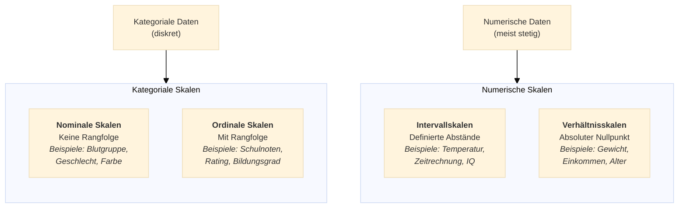
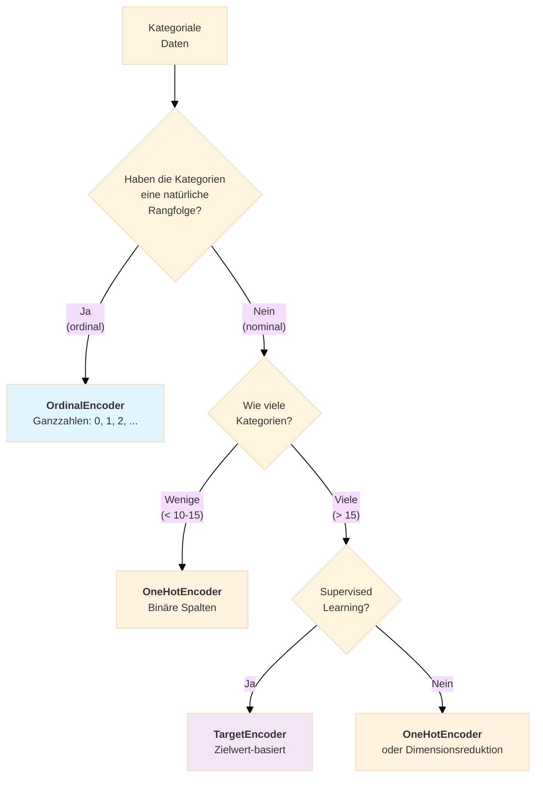
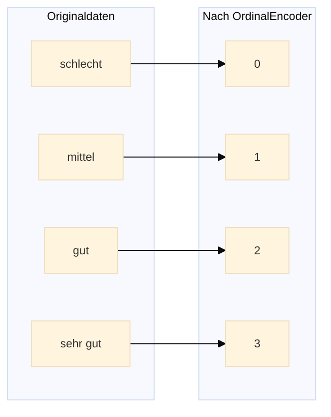
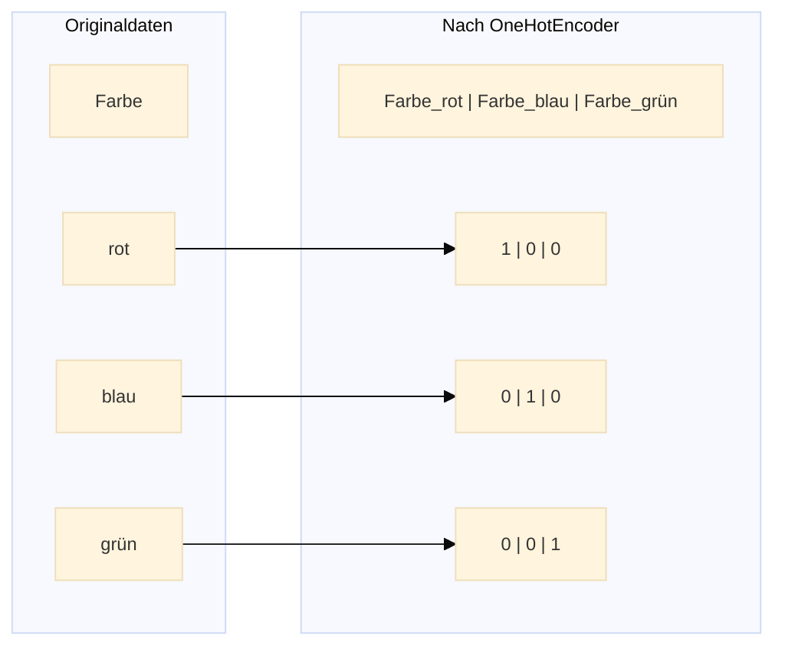
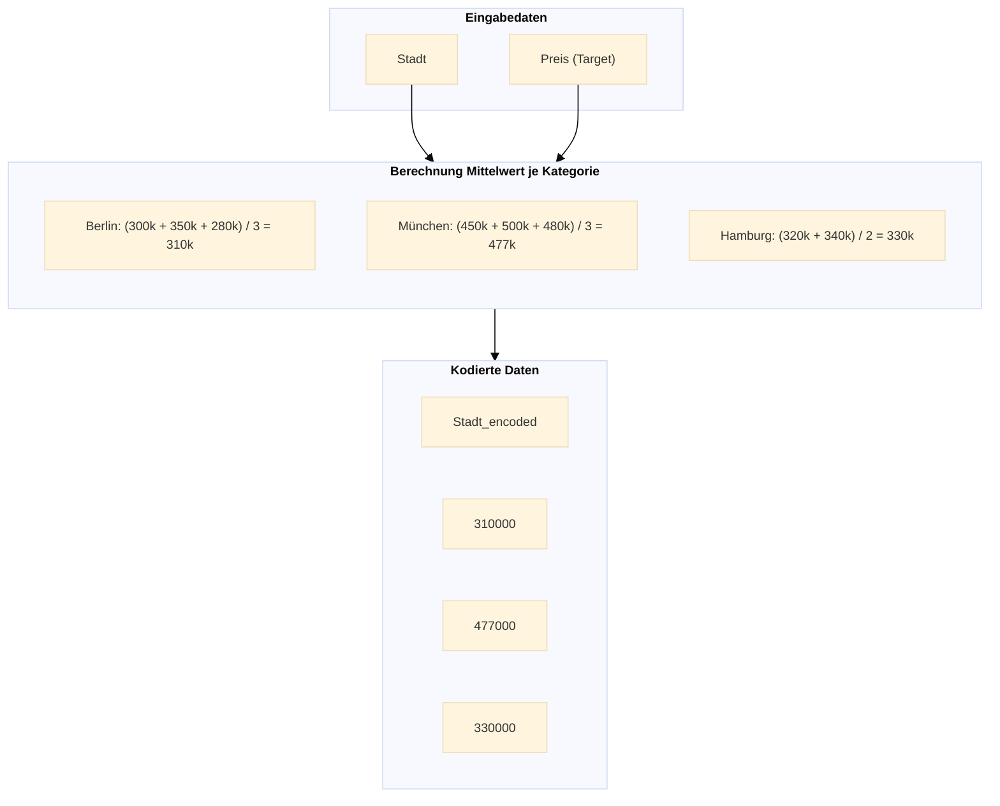
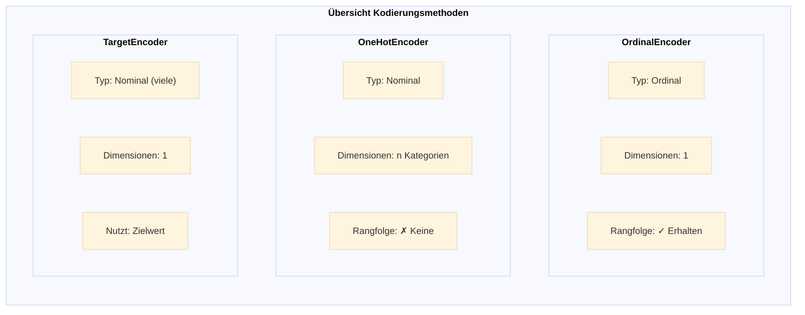

# Kodierung kategorialer Daten
{: .no_toc }

> **Transformation kategorialer Merkmale in numerische Formate**      
> Nominale vs. ordinale Daten, OrdinalEncoder, OneHotEncoder und TargetEncoder

---

# Inhaltsverzeichnis
{: .no_toc .text-delta }

1. TOC
{:toc}

---


## Einführung

Die **meisten** Machine-Learning-Algorithmen können **nur** mit **numerischen Daten** arbeiten. Kategoriale Daten – also Merkmale mit diskreten Ausprägungen wie Farben, Kategorien oder Bewertungen – müssen daher in numerische Formate umgewandelt werden. Dieser Prozess wird als **Kodierung** (Encoding) bezeichnet.

Die Wahl der richtigen Kodierungsmethode hängt dabei maßgeblich vom **Skalenniveau** der Daten ab.

## Skalenniveaus kategorialer Daten



### Nominale Daten
- Merkmalsausprägungen haben **keine unterschiedliche Wertigkeit**
- Reihenfolge ist beliebig und bedeutungslos
- Beispiele: Blutgruppe (A, B, AB, 0), Geschlecht, Automarke, Farbe

### Ordinale Daten
- Merkmalsausprägungen haben eine **natürliche Rangfolge**
- Abstände zwischen den Kategorien sind nicht definiert
- Beispiele: Schulnoten (1-6), Kundenzufriedenheit (sehr unzufrieden bis sehr zufrieden), Bildungsgrad

## Entscheidungsbaum: Welche Kodierung verwenden?



## Kodierungsmethoden im Detail

### 1. OrdinalEncoder (für ordinale Daten)

Der **OrdinalEncoder** konvertiert kategoriale Merkmale in ganzzahlige Werte (0 bis n-1). Diese Methode ist geeignet, wenn die Kategorien eine **natürliche Rangfolge** besitzen.

#### Funktionsweise



#### Beispiel in scikit-learn

```python
from sklearn.preprocessing import OrdinalEncoder
import pandas as pd

# Beispieldaten mit ordinaler Kategorie
df = pd.DataFrame({
    'bildung': ['Hauptschule', 'Realschule', 'Abitur', 'Bachelor', 'Master']
})

# Encoder mit definierter Reihenfolge
encoder = OrdinalEncoder(
    categories=[['Hauptschule', 'Realschule', 'Abitur', 'Bachelor', 'Master']]
)

# Transformation
df['bildung_encoded'] = encoder.fit_transform(df[['bildung']])

# Ergebnis:
# Hauptschule -> 0
# Realschule  -> 1
# Abitur      -> 2
# Bachelor    -> 3
# Master      -> 4
```

#### Wann verwenden?
- Bildungsgrad, Einkommensklassen, Zufriedenheitsskalen
- Größenangaben (S, M, L, XL)
- Qualitätsstufen (niedrig, mittel, hoch)

#### Vorteile und Nachteile

| Vorteile | Nachteile |
|----------|-----------|
| Erhält die Rangfolge | Impliziert gleiche Abstände |
| Speichereffizient (eine Spalte) | Nur für ordinale Daten geeignet |
| Keine Dimensionserhöhung | Kann bei nominalen Daten irreführend sein |

### 2. OneHotEncoder (für nominale Daten)

Der **OneHotEncoder** erstellt für jede Kategorie eine eigene binäre Spalte. Diese Methode ist ideal für **nominale Daten ohne natürliche Rangfolge**.

#### Funktionsweise



#### Beispiel in scikit-learn

```python
from sklearn.preprocessing import OneHotEncoder
import pandas as pd

# Beispieldaten mit nominaler Kategorie
df = pd.DataFrame({
    'farbe': ['rot', 'blau', 'grün', 'rot', 'blau']
})

# OneHotEncoder
encoder = OneHotEncoder(sparse_output=False, drop=None)
encoded = encoder.fit_transform(df[['farbe']])

# Als DataFrame mit Spaltennamen
encoded_df = pd.DataFrame(
    encoded, 
    columns=encoder.get_feature_names_out(['farbe'])
)

# Ergebnis:
#    farbe_blau  farbe_grün  farbe_rot
# 0         0.0         0.0        1.0
# 1         1.0         0.0        0.0
# 2         0.0         1.0        0.0
# 3         0.0         0.0        1.0
# 4         1.0         0.0        0.0
```

#### Parameter-Optionen

```python
# Drop='first' vermeidet Multikollinearität (für lineare Modelle)
encoder = OneHotEncoder(sparse_output=False, drop='first')

# handle_unknown='ignore' für unbekannte Kategorien in neuen Daten
encoder = OneHotEncoder(sparse_output=False, handle_unknown='ignore')
```

#### Wann verwenden?
- Farben, Länder, Produktkategorien
- Zahlungsmethoden, Versandarten
- Alle nominalen Daten mit **wenigen Kategorien** (< 10-15)

#### Vorteile und Nachteile

| Vorteile | Nachteile |
|----------|-----------|
| Keine implizite Rangfolge | Dimensionserhöhung (Curse of Dimensionality) |
| Funktioniert mit allen Algorithmen | Speicherintensiv bei vielen Kategorien |
| Vermeidet ordinale Beziehungen | Sparse Matrizen können Probleme verursachen |

### 3. TargetEncoder (für nominale Daten mit vielen Kategorien)

Der **TargetEncoder** ersetzt kategoriale Werte durch einen Wert, der aus dem Zielmerkmal (Target) berechnet wird – typischerweise der Mittelwert des Targets für diese Kategorie.

#### Funktionsweise



#### Beispiel in scikit-learn

```python
from sklearn.preprocessing import TargetEncoder
import pandas as pd

# Beispieldaten
df = pd.DataFrame({
    'stadt': ['Berlin', 'München', 'Berlin', 'Hamburg', 'München', 'Berlin'],
    'preis': [300000, 450000, 350000, 320000, 500000, 280000]
})

# TargetEncoder
encoder = TargetEncoder(smooth='auto')
df['stadt_encoded'] = encoder.fit_transform(
    df[['stadt']], 
    df['preis']
)

# Ergebnis: Jede Stadt wird durch den mittleren Preis ersetzt
```

#### Wann verwenden?
- Postleitzahlen, Städte mit vielen Ausprägungen
- Produkt-IDs, Kunden-IDs
- Kategorien mit **mehr als 15-20 Ausprägungen**

#### Vorteile und Nachteile

| Vorteile | Nachteile |
|----------|-----------|
| Keine Dimensionserhöhung | Risiko von Overfitting |
| Effektiv bei vielen Kategorien | Mögliche Data Leakage |
| Bezieht Zielinformation ein | Nur für Supervised Learning |

## Vergleich der Kodierungsmethoden



| Kriterium              | OrdinalEncoder | OneHotEncoder    | TargetEncoder        |
| ---------------------- | -------------- | ---------------- | -------------------- |
| **Datentyp**           | Ordinal        | Nominal          | Nominal              |
| **Kategorien**         | Beliebig       | Wenige (< 15)    | Viele (> 15)         |
| **Dimensionen**        | 1              | n Kategorien     | 1                    |
| **Rangfolge**          | Erhalten       | Keine impliziert | Keine                |
| **Supervised**         | Nein           | Nein             | Ja (benötigt Target) |
| **Overfitting-Risiko** | Gering         | Gering           | Höher                |


Die Wahl der richtigen Kodierung ist entscheidend für die Modellperformance. Grundregel: **Ordinale Daten** mit OrdinalEncoder, **nominale Daten** mit OneHotEncoder (wenige Kategorien) oder TargetEncoder (viele Kategorien).


---

**Version:** 1.0     
**Stand:** Januar 2026     
**Kurs:** Machine Learning. Verstehen. Anwenden. Gestalten.     
