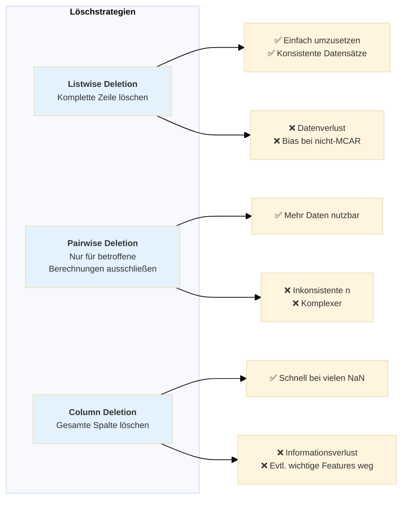
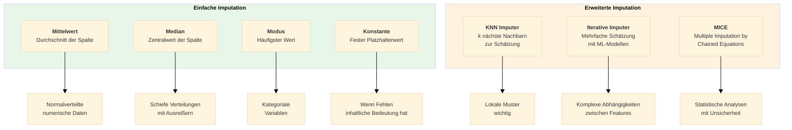

# Missing Values – Fehlende Werte behandeln
{: .no_toc }

> **Behandlung fehlender Werte in Machine Learning Projekten**    
> MCAR, MAR, MNAR - Deletion vs. Imputation - Strategien und Best Practices

---

# Inhaltsverzeichnis
{: .no_toc .text-delta }

1. TOC
{:toc}

---

## Überblick

Fehlende Werte (Missing Values) sind ein häufiges Problem in realen Datensätzen. Sie entstehen durch unvollständige Datenerfassung, Übertragungsfehler, Systemausfälle oder bewusst nicht beantwortete Fragen. Die korrekte Behandlung fehlender Werte ist entscheidend für die Qualität eines Machine-Learning-Modells.

## Entscheidungsbaum zur Behandlung

## Strategien im Detail

### 1. Löschen (Deletion)

### 2. Imputation (Auffüllen)

## Konsequenzen falscher Behandlung

## Best Practices

| Empfehlung | Beschreibung |
|------------|--------------|
| **Dokumentieren** | Anzahl und Verteilung fehlender Werte vor der Behandlung festhalten |
| **Visualisieren** | Muster in fehlenden Werten erkennen (z.B. mit `missingno`) |
| **Kontext beachten** | Fachliche Bedeutung fehlender Werte berücksichtigen |
| **Mehrere Strategien testen** | Auswirkung verschiedener Methoden auf Modellgüte vergleichen |
| **Pipeline nutzen** | Imputation als Teil der sklearn-Pipeline für konsistente Anwendung |
| **Train/Test trennen** | Imputation nur auf Trainingsdaten fitten, dann auf Testdaten anwenden |

## Scikit-learn Klassen

| Klasse | Verwendung |
|--------|------------|
| `SimpleImputer` | Einfache Strategien (mean, median, most_frequent, constant) |
| `KNNImputer` | K-Nearest-Neighbors basierte Imputation |
| `IterativeImputer` | Multivariate Imputation mit ML-Modellen |

---

**Version:** 1.0    
**Stand:** Januar 2026    
**Kurs:** Machine Learning. Verstehen. Anwenden. Gestalten.    
