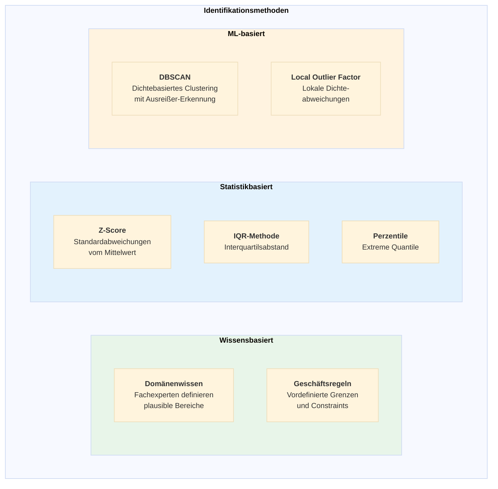
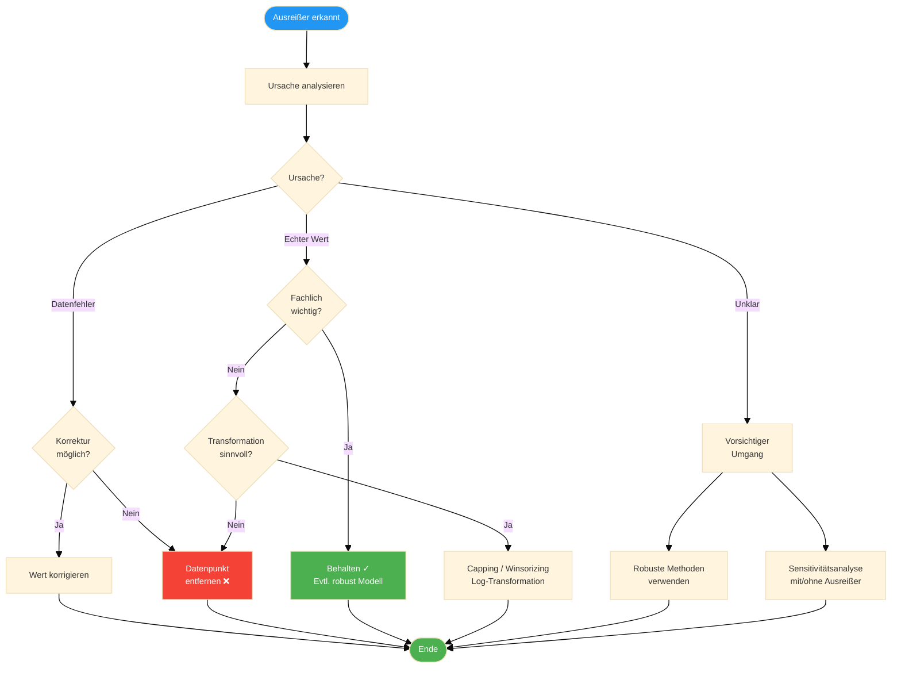
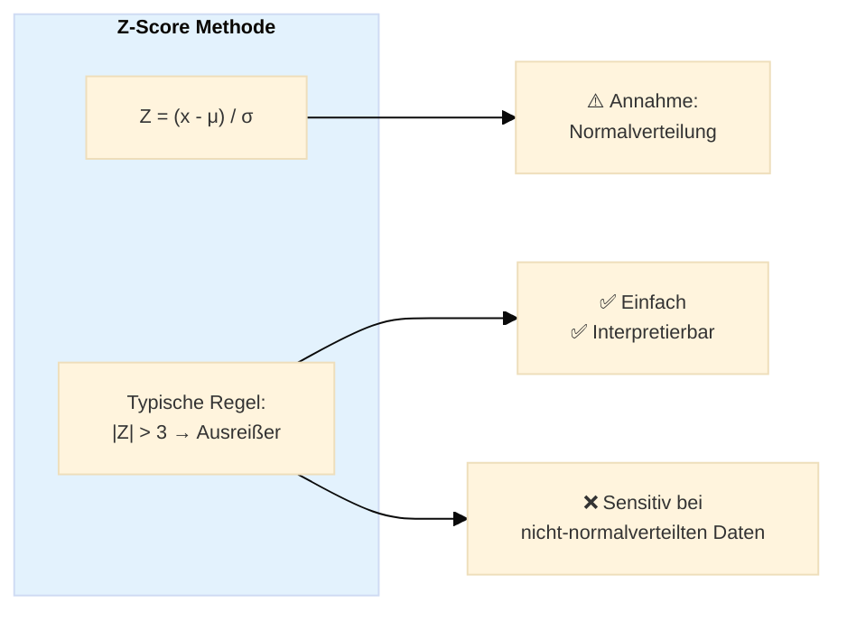
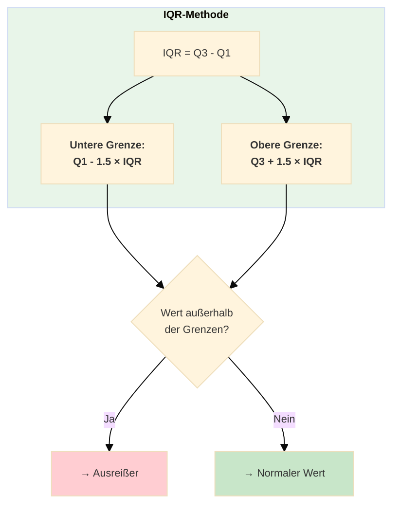
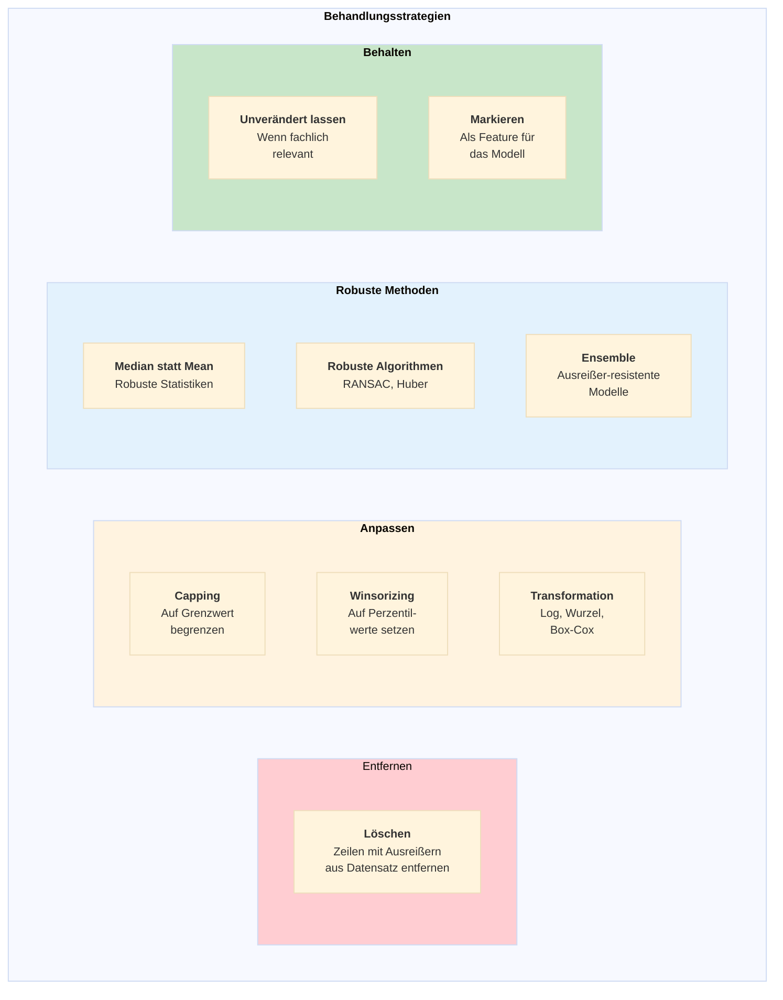
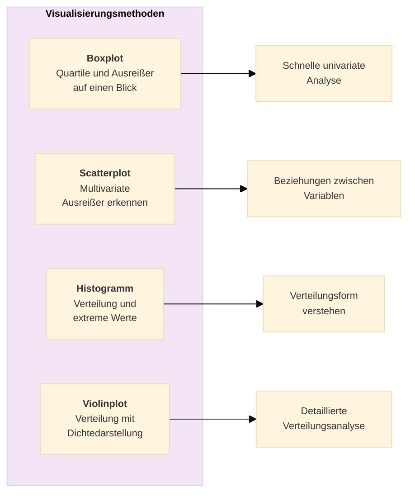
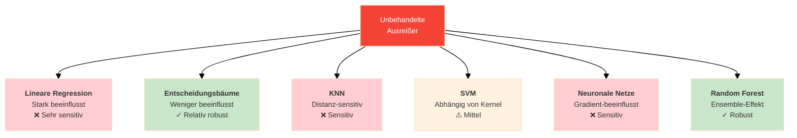

# Outlier – Ausreißer erkennen und behandeln
{: .no_toc }

> **Identifikation und Behandlung von Ausreißern in Datensätzen**     
> Z-Score, IQR, Isolation Forest - Capping, Winsorizing und robuste Methoden

---

# Inhaltsverzeichnis
{: .no_toc .text-delta }

1. TOC
{:toc}

---

## Überblick

Ein Ausreißer (Outlier) ist ein Datenpunkt, dessen Ausprägung stark von der Norm abweicht. Ausreißer können die Ergebnisse von Analysen und Machine-Learning-Modellen erheblich verzerren. Die korrekte Identifikation und Behandlung von Ausreißern ist daher ein wichtiger Schritt in der Datenvorverarbeitung.

## Methoden zur Identifikation

## Entscheidungsbaum zur Behandlung

## Statistische Methoden

### Z-Score Methode

### IQR-Methode

## Behandlungsstrategien

## Visualisierung zur Erkennung

## Best Practices

| Empfehlung                | Beschreibung                                                       |
| ------------------------- | ------------------------------------------------------------------ |
| **Immer visualisieren**   | Boxplots und Scatterplots vor statistischen Tests                  |
| **Kontext verstehen**     | Fachexperten einbeziehen bei der Interpretation                    |
| **Dokumentieren**         | Welche Ausreißer wurden wie behandelt                              |
| **Mehrere Methoden**      | Verschiedene Erkennungsmethoden kombinieren                        |
| **Sensitivitätsanalyse**  | Modell mit und ohne Ausreißer vergleichen                          |
| **Vorsicht beim Löschen** | Nur echte Fehler entfernen, nicht unbequeme Werte                  |
| **Reihenfolge beachten**  | Ausreißer vor Missing Values behandeln (oder umgekehrt konsistent) |

## Auswirkungen auf ML-Modelle

## Scikit-learn Klassen

| Klasse | Verwendung |
|--------|------------|
| `DBSCAN` | Dichtebasiertes Clustering mit Ausreißer-Erkennung |
| `LocalOutlierFactor` | Dichtebasierte lokale Ausreißer |
| `EllipticEnvelope` | Gaussian-basierte Ausreißer-Erkennung |
| `OneClassSVM` | SVM für Anomalie-Erkennung |

---

**Version:** 1.0    
**Stand:** Januar 2026    
**Kurs:** Machine Learning. Verstehen. Anwenden. Gestalten.    
