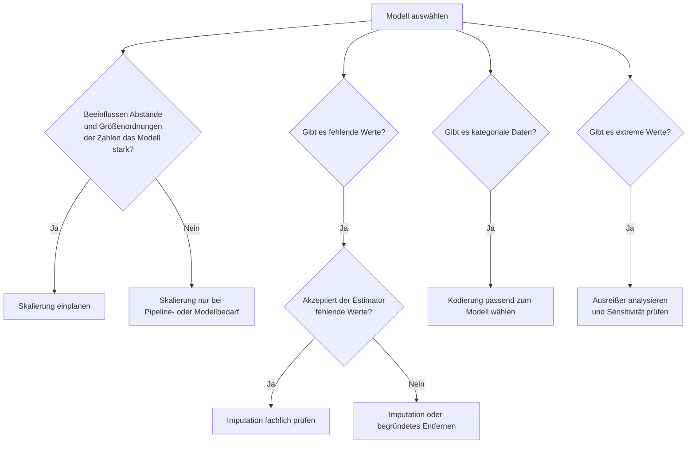

# Prepare nach Modell
{: .no_toc }

Vorverarbeitung ist kein fester Block, der für jedes Modell gleich aussieht. Ein Entscheidungsbaum braucht andere Datenvorbereitung als K-Means, eine logistische Regression oder ein LSTM. Entscheidend ist, ob ein Verfahren mit fehlenden Werten umgehen kann, ob es Distanzen oder Gradienten nutzt, ob es numerische Eingaben erwartet und ob Ausreißer das Lernsignal verzerren.

> [!IMPORTANT] Pipeline-Regel 
> Alles, was aus Daten gelernt wird, wird nur auf Trainingsdaten gefittet. Imputation, Encoding, Skalierung und Feature Selection gehören deshalb in eine Pipeline oder in einen klar getrennten Train/Test-Workflow.

---

## Inhaltsverzeichnis
{: .no_toc .text-delta }

1. TOC
{:toc}

---

## Entscheidungslogik

Die wichtigste Frage ist nicht, ob ein Schritt grundsätzlich existiert, sondern ob das gewählte Verfahren davon abhängt. Einige Modelle vergleichen Zahlen direkt miteinander: große Wertebereiche können dann stärker wirken als kleine, auch wenn sie fachlich nicht wichtiger sind. Baumverfahren sind dagegen meist robuster gegenüber unterschiedlichen Skalen. Association-Rules-Verfahren wie Apriori benötigen wiederum keine klassische Skalierung, sondern eine transaktionale, binäre Datenstruktur.

## Überblick

| Algorithmus im Kurs                  | Fehlende Werte erlaubt?                     | Skalierung nötig?            | Kodierung nötig?             | Ausreißer kritisch?         | Besondere Prepare-Hinweise                                                                   |
| ------------------------------------ | ------------------------------------------- | ---------------------------- | ---------------------------- | --------------------------- | -------------------------------------------------------------------------------------------- |
| **Supervised Learning**              |                                             |                              |                              |                             |                                                                                              |
| Decision Tree Classifier/Regressor   | Ja, in aktuellen scikit-learn-Versionen     | Nein                         | Ja                           | Eher nein                   | Für ältere Versionen oder vorgelagerte Pipeline-Schritte trotzdem imputieren.                |
| Random Forest Classifier/Regressor   | Ja, in aktuellen scikit-learn-Versionen     | Nein                         | Ja                           | Eher nein                   | Robust, aber Feature-Auswahl und saubere Kodierung bleiben sinnvoll.                         |
| Extra Trees                          | Ja, in aktuellen scikit-learn-Versionen     | Nein                         | Ja                           | Eher nein                   | Gilt im Kurs vor allem als PyCaret-/Ensemble-Vergleichsmodell.                               |
| Gradient Boosting                    | Nein bei klassischen scikit-learn-Varianten | Nein                         | Ja                           | Mittel                      | Missing Values vorher behandeln; Hist-Gradient-Boosting ist ein Sonderfall.                  |
| XGBoost Classifier/Regressor         | Ja                                          | Nein                         | Ja                           | Mittel                      | Missing Values werden intern behandelt; Kategorien im Kurs meist vorher kodieren.            |
| LightGBM                             | Bedingt                                     | Nein                         | Bedingt                      | Mittel                      | Bei manueller Nutzung Library-Regeln für Kategorien und Missing Values beachten.             |
| CatBoost                             | Bedingt                                     | Nein                         | Bedingt                      | Mittel                      | Kann Kategorien speziell behandeln; in AutoML-Vergleichen wird viel automatisch vorbereitet. |
| Explainable Boosting Classifier      | Bedingt                                     | Nein                         | Ja                           | Mittel                      | Erklärbarkeit profitiert von sauber benannten, stabilen Features.                            |
| Linear Regression                    | Nein                                        | Meist ja                     | Ja                           | Ja                          | Ausreißer und Multikollinearität besonders prüfen.                                           |
| Logistic Regression                  | Nein                                        | Ja                           | Ja                           | Ja                          | Skalierung ist besonders bei Regularisierung wichtig.                                        |
| KNN                                  | Nein                                        | Kritisch                     | Ja                           | Ja                          | Distanzbasiert: Skalierung und Ausreißerbehandlung prägen das Ergebnis.                      |
| Linear SVC / SVM                     | Nein                                        | Kritisch                     | Ja                           | Ja                          | Ohne Skalierung dominieren Merkmale mit großem Wertebereich.                                 |
| Stacking Classifier                  | Hängt von Base Models ab                    | Hängt von Base Models ab     | Ja                           | Hängt von Base Models ab    | Prepare muss zu Basis- und Meta-Modell passen.                                               |
| Voting Regressor                     | Hängt von Einzelmodellen ab                 | Hängt von Einzelmodellen ab  | Ja                           | Hängt von Einzelmodellen ab | Gemeinsame Pipeline am empfindlichsten Einzelmodell ausrichten.                              |
| **Unsupervised Learning**            |                                             |                              |                              |                             |                                                                                              |
| K-Means                              | Nein                                        | Kritisch                     | Ja                           | Ja                          | Cluster werden über Distanzen gebildet; Ausreißer verschieben Zentren.                       |
| DBSCAN                               | Nein                                        | Kritisch                     | Ja                           | Mittel                      | Skalierung bestimmt direkt `eps`; Ausreißer können bewusst als Noise erkannt werden.         |
| PCA                                  | Nein                                        | Ja                           | Ja                           | Ja                          | Varianzbasiert: Skalierung ist in der Regel Pflicht.                                         |
| Apriori / Association Rules          | Nein                                        | Nein                         | Speziell                     | Bedingt                     | Erwartet transaktionale, binär kodierte Warenkorb-Daten.                                     |
| **Neural Network**                   |                                             |                              |                              |                             |                                                                                              |
| MLP Classifier/Regressor             | Nein                                        | Ja                           | Ja                           | Ja                          | Skalierung stabilisiert Optimierung und Konvergenz.                                          |
| Keras Dense-Netze                    | Nein                                        | Ja                           | Ja                           | Ja                          | Eingaben numerisch, skaliert und als Arrays/Tensoren vorbereiten.                            |
| Keras CNN                            | Nein                                        | Ja                           | Bedingt                      | Mittel                      | Bilddaten normalisieren; Zielwerte als Labels oder One-Hot-Matrix vorbereiten.               |
| Keras LSTM / Sequenzmodelle          | Nein                                        | Ja                           | Bedingt                      | Ja                          | Reihenfolge, Fensterbildung und zeitlicher Split sind entscheidend.                          |
| Autoencoder                          | Nein                                        | Ja                           | Ja / bedingt                 | Ja                          | Bei Anomalieerkennung sind Ausreißer oft Zielsignal, nicht automatisch Fehler.               |
| **Übrige**                           |                                             |                              |                              |                             |                                                                                              |
| PyCaret AutoML                       | Wird automatisiert behandelt                | Wird automatisiert behandelt | Wird automatisiert behandelt | Prüfen                      | Automatisierung ersetzt keine fachliche Kontrolle von Datenqualität und Leakage.             |

**Legende**

| Eintrag      | Bedeutung                                                                        |
| ------------ | -------------------------------------------------------------------------------- |
| **Ja**       | In der Regel notwendig oder klar empfehlenswert.                                 |
| **Nein**     | Normalerweise nicht erforderlich.                                                |
| **Bedingt**  | Abhängig von Daten, Library, Pipeline oder Zielsetzung.                          |
| **Kritisch** | Ohne diesen Schritt werden Ergebnisse häufig instabil oder fachlich irreführend. |

## Modellgruppen

### Supervised Learning

Baum- und Ensemble-Modelle sind gegenüber unterschiedlichen Wertebereichen meist robust. Ein Decision Tree, Random Forest oder XGBoost profitiert deshalb selten von Skalierung. Kategoriale Features bleiben trotzdem ein Thema, weil scikit-learn-Modelle numerische Eingaben erwarten. Bei fehlenden Werten ist die Lage versions- und libraryabhängig: moderne scikit-learn-Bäume akzeptieren `NaN`, klassische Gradient-Boosting-Varianten nicht immer.

Lineare Modelle, KNN und SVM reagieren deutlich stärker auf die Datenaufbereitung. Lineare Regression und Logistic Regression leiden unter Ausreißern und profitieren meist von skalierten numerischen Features. KNN und SVM sind noch strenger: Ohne Skalierung bildet oft nicht die fachliche Ähnlichkeit die Nachbarschaft, sondern nur der größte Zahlenbereich.

### Unsupervised Learning

K-Means und DBSCAN sind Distanzverfahren. Skalierung verändert dort unmittelbar, welche Punkte als ähnlich gelten. PCA ist varianzbasiert und braucht ebenfalls skalierte numerische Daten, wenn Features unterschiedliche Einheiten haben. Apriori folgt einer anderen Logik: Nicht Mittelwerte, Distanzen oder Gradienten sind relevant, sondern Transaktionen und binäre Item-Indikatoren.

### Neural Network

Neuronale Netze benötigen numerische und konsistent skalierte Eingaben. Bei MLP- und Dense-Netzen geht es vor allem um stabile Optimierung. Bei CNNs werden Pixelwerte typischerweise normalisiert. Bei LSTMs ist zusätzlich die zeitliche Struktur Teil des Preprocessing: Fensterbildung, Reihenfolge und zeitbasierte Splits sind dort wichtiger als ein zufälliger Train-Test-Split.

> [!WARNING] Autoencoder und Ausreißer 
> Bei Anomalieerkennung sind Ausreißer häufig nicht Schmutz in den Daten, sondern das Zielsignal. Ein automatisches Entfernen vor dem Training kann genau die Fälle löschen, die später erkannt werden sollen.

### Übrige

PyCaret und AutoML übernehmen viele Vorverarbeitungsschritte automatisch. Das reduziert manuellen Aufwand, nimmt aber keine fachliche Prüfung ab. Besonders fehlende Werte, Leckage durch zeitlich falsche Splits, unausgewogene Zielklassen und unplausible Ausreißer müssen weiterhin verstanden werden.

## Typische Fehler

| Fehler | Problem |
|--------|---------|
| Skalierung vor dem Train-Test-Split | Testdaten beeinflussen die Transformation: Data Leakage. |
| Encoding auf allen Daten fitten | Kategorien aus Testdaten können ins Training leaken. |
| Ausreißer automatisch entfernen | Echte Extremfälle und fachlich wichtige Signale gehen verloren. |
| Baumverfahren unnötig skalieren | Meist kein Schaden, aber zusätzliche Komplexität ohne Modellnutzen. |
| Distanzverfahren unskaliert trainieren | Große Zahlenbereiche dominieren Ähnlichkeit und Clusterstruktur. |
| AutoML ungeprüft vertrauen | Automatisierung erkennt nicht jedes fachliche Datenproblem. |

## Abgrenzung zu verwandten Dokumenten

| Dokument | Frage |
|----------|-------|
| [Modellauswahl](../modeling/modellauswahl.html) | Nach welchen Kriterien wird ein Algorithmus ausgewählt? |
| [Modell-Steckbriefe](../modeling/modell-steckbriefe.html) | Welche Stärken und Grenzen haben die Modelle selbst? |
| [Workflow Design](../grundlagen/workflow-design.html) | Wie werden Pipelines so gebaut, dass keine Leakage entsteht? |
| [Cross-Validation](../evaluate/cross_validation.html) | Wie wird Modellqualität geprüft, wenn Prepare-Schritte innerhalb der CV-Schleife liegen müssen? |

---

**Version:** 1.1 
**Stand:** Mai 2026 
**Kurs:** Machine Learning. Verstehen. Anwenden. Gestalten.
