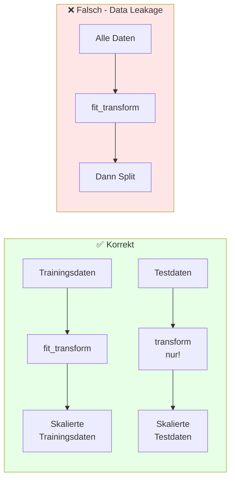
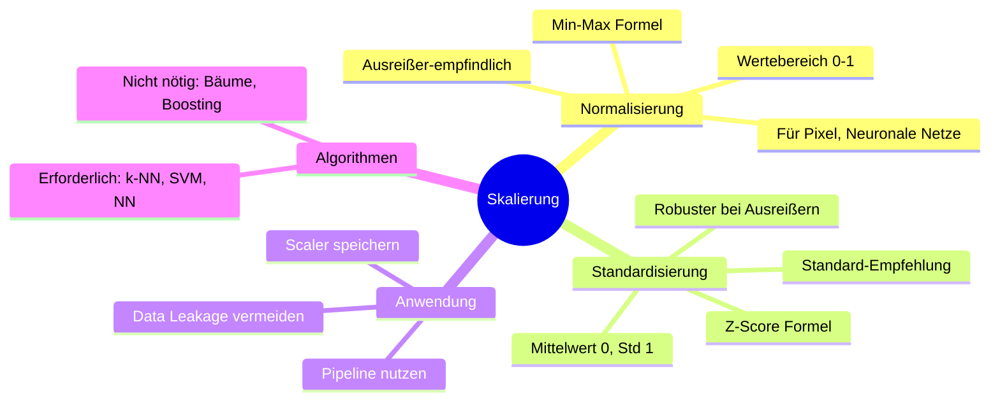

# Skalierung
{: .no_toc }

> **Feature-Skalierung ist ein kritischer Vorverarbeitungsschritt, der numerische Merkmale auf einen einheitlichen Wertebereich bringt.**      
> Sie verbessert die Konvergenz von Algorithmen und stellt sicher, dass alle Features gleichwertig in die Modellbildung einfließen.

---

## Inhaltsverzeichnis
{: .no_toc .text-delta }

1. TOC
{:toc}

---

## Warum Skalierung notwendig ist

Machine-Learning-Algorithmen arbeiten mit numerischen Daten, deren Wertebereiche sich stark unterscheiden können. Ohne Skalierung können Features mit größeren Wertebereichen die Modellbildung dominieren.

### Das Problem unterschiedlicher Wertebereiche

Betrachten wir ein einfaches Beispiel mit zwei Features:

| Feature | Wertebereich | Beispielwerte |
|---------|--------------|---------------|
| Alter | 18 - 80 | 25, 45, 67 |
| Einkommen | 20.000 - 500.000 | 35.000, 120.000, 280.000 |

Das Einkommen hat einen deutlich größeren Wertebereich als das Alter. Bei vielen Algorithmen führt dies dazu, dass das Einkommen einen unverhältnismäßig hohen Einfluss auf die Vorhersage hat – nicht weil es wichtiger ist, sondern allein aufgrund seiner numerischen Größe.

### Auswirkungen fehlender Skalierung


---

## Effekte der Skalierung

Die Skalierung von Features hat mehrere positive Auswirkungen auf den Machine-Learning-Prozess:

### 1. Faire Gewichtung der Features

Ohne Skalierung werden die Regressionskoeffizienten **direkt** von der Größenordnung der Features beeinflusst. Ein Feature mit Werten im Millionenbereich erhält automatisch einen kleinen Koeffizienten, während ein Feature mit Werten zwischen 0 und 1 einen großen Koeffizienten erhält – unabhängig von ihrer tatsächlichen Wichtigkeit.

### 2. Schnellere Konvergenz

Viele Optimierungsalgorithmen (wie Gradient Descent) konvergieren schneller, wenn alle Features ähnliche Wertebereiche haben. Bei unterschiedlichen Skalen kann der Gradient in einer Dimension sehr steil und in einer anderen sehr flach sein, was zu ineffizienten Lernpfaden führt.

### 3. Verbesserte Modellperformance

Durch Skalierung können Algorithmen die tatsächlichen Zusammenhänge in den Daten besser erfassen, was zu genaueren Vorhersagen führt.

---

## Die zwei Hauptmethoden

Es gibt zwei grundlegende Ansätze zur Feature-Skalierung: **Normalisierung** (Min-Max-Skalierung) und **Standardisierung** (Z-Score-Normalisierung).


---

## Normalisierung (Min-Max-Skalierung)

Die Normalisierung transformiert alle Werte linear in einen festen Bereich, typischerweise [0, 1].

### Formel

$$x_{norm} = \frac{x - x_{min}}{x_{max} - x_{min}}$$

Dabei ist:
- $x$ der ursprüngliche Wert
- $x_{min}$ der kleinste Wert im Feature
- $x_{max}$ der größte Wert im Feature

### Eigenschaften

| Aspekt | Beschreibung |
|--------|--------------|
| **Wertebereich** | Fest definiert, üblicherweise [0, 1] oder [-1, 1] |
| **Verteilung** | Originalverteilung bleibt erhalten |
| **Ausreißer-Empfindlichkeit** | ⚠️ Sehr hoch – ein einzelner Extremwert komprimiert alle anderen Werte |

### Rechenbeispiel

Gegeben: Werte [20, 40, 60, 80, 100]

- $x_{min} = 20$
- $x_{max} = 100$

Für $x = 60$:

$$x_{norm} = \frac{60 - 20}{100 - 20} = \frac{40}{80} = 0.5$$

Ergebnis: [0.0, 0.25, 0.5, 0.75, 1.0]

### Implementierung mit scikit-learn

```python
from sklearn.preprocessing import MinMaxScaler
import numpy as np

# Beispieldaten
data = np.array([[20], [40], [60], [80], [100]])

# Scaler erstellen und anwenden
scaler = MinMaxScaler()
data_normalized = scaler.fit_transform(data)

print("Normalisierte Daten:")
print(data_normalized.flatten())
# Ausgabe: [0.   0.25 0.5  0.75 1.  ]

# Rücktransformation möglich
data_original = scaler.inverse_transform(data_normalized)
```

---

## Standardisierung (Z-Score-Normalisierung)

Die Standardisierung transformiert die Daten so, dass sie einen Mittelwert von 0 und eine Standardabweichung von 1 haben.

### Formel

$$x_{std} = \frac{x - \mu}{\sigma}$$

Dabei ist:
- $x$ der ursprüngliche Wert
- $\mu$ der Mittelwert des Features
- $\sigma$ die Standardabweichung des Features

### Eigenschaften

| Aspekt | Beschreibung |
|--------|--------------|
| **Wertebereich** | Unbegrenzt, zentriert um 0 |
| **Verteilung** | Mittelwert = 0, Standardabweichung = 1 |
| **Ausreißer-Empfindlichkeit** | Moderater – Ausreißer beeinflussen μ und σ, aber weniger drastisch |

### Rechenbeispiel

Gegeben: Werte [20, 40, 60, 80, 100]

- $\mu = \frac{20 + 40 + 60 + 80 + 100}{5} = 60$
- $\sigma = \sqrt{\frac{(20-60)^2 + (40-60)^2 + (60-60)^2 + (80-60)^2 + (100-60)^2}{5}} \approx 28.28$

Für $x = 60$:

$$x_{std} = \frac{60 - 60}{28.28} = 0$$

Ergebnis: [-1.41, -0.71, 0, 0.71, 1.41]

### Implementierung mit scikit-learn

```python
from sklearn.preprocessing import StandardScaler
import numpy as np

# Beispieldaten
data = np.array([[20], [40], [60], [80], [100]])

# Scaler erstellen und anwenden
scaler = StandardScaler()
data_standardized = scaler.fit_transform(data)

print("Standardisierte Daten:")
print(data_standardized.flatten())
# Ausgabe: [-1.41421356 -0.70710678  0.          0.70710678  1.41421356]

# Mittelwert und Standardabweichung abrufen
print(f"Mittelwert: {scaler.mean_[0]}")
print(f"Standardabweichung: {scaler.scale_[0]}")
```

---

## Vergleich: Normalisierung vs. Standardisierung


### Übersichtstabelle

| Kriterium | Normalisierung (Min-Max) | Standardisierung (Z-Score) |
|-----------|--------------------------|----------------------------|
| **Formel** | $\frac{x - min}{max - min}$ | $\frac{x - \mu}{\sigma}$ |
| **Wertebereich** | [0, 1] oder definierter Bereich | Unbegrenzt, zentriert um 0 |
| **Ausreißer-Robustheit** | ❌ Gering | ✅ Besser |
| **Interpretierbarkeit** | ✅ Einfach (0-100%) | ⚠️ Erfordert Statistik-Verständnis |
| **Originalverteilung** | Bleibt erhalten | Wird zu Standardnormalverteilung |

### Typische Anwendungsfälle

| Methode | Empfohlene Algorithmen | Begründung |
|---------|------------------------|------------|
| **Normalisierung** | k-NN, k-Means, Neuronale Netze (mit Sigmoid/Tanh) | Fester Wertebereich, distanzbasierte Berechnungen |
| **Standardisierung** | Lineare/Logistische Regression, SVM, PCA, Neuronale Netze (allgemein) | Robuster bei Ausreißern, einheitliche Feature-Skalierung |

---

## Wann welche Methode verwenden?

### Standardisierung bevorzugen, wenn:

1. **Ausreißer vorhanden sind** – Ein einzelner Extremwert verzerrt bei Min-Max-Skalierung alle anderen Werte
2. **Lineare Modelle verwendet werden** – Regression, SVM profitieren von standardisierten Features
3. **Die Verteilung annähernd normal ist** – Standardisierung nutzt die Eigenschaften der Normalverteilung
4. **Unklar ist, welche Methode besser ist** – Standardisierung ist die sichere Wahl

### Normalisierung bevorzugen, wenn:

1. **Keine oder wenige Ausreißer vorhanden sind** – Die Daten sind sauber
2. **Ein fester Wertebereich benötigt wird** – z.B. Pixelwerte (0-255) → (0-1)
3. **Neuronale Netze mit bestimmten Aktivierungsfunktionen** – Sigmoid, Tanh erwarten Eingaben in bestimmten Bereichen
4. **Die Originalverteilung erhalten bleiben soll** – Nur die Skala ändert sich

---

## Das Ausreißer-Problem

Ausreißer beeinflussen Normalisierung und Standardisierung unterschiedlich stark:

### Beispiel: Auswirkung eines Ausreißers

```python
import numpy as np
from sklearn.preprocessing import MinMaxScaler, StandardScaler

# Normale Daten
normal_data = np.array([[30], [35], [40], [45], [50]])

# Daten mit Ausreißer
data_with_outlier = np.array([[30], [35], [40], [45], [500]])  # 500 ist Ausreißer

# Normalisierung
minmax = MinMaxScaler()
print("Min-Max ohne Ausreißer:", minmax.fit_transform(normal_data).flatten())
# [0.   0.25 0.5  0.75 1.  ]

print("Min-Max mit Ausreißer:", minmax.fit_transform(data_with_outlier).flatten())
# [0.    0.01  0.02  0.03  1.  ]  ← Fast alle Werte nahe 0!

# Standardisierung
standard = StandardScaler()
print("\nZ-Score ohne Ausreißer:", standard.fit_transform(normal_data).flatten().round(2))
# [-1.41 -0.71  0.    0.71  1.41]

print("Z-Score mit Ausreißer:", standard.fit_transform(data_with_outlier).flatten().round(2))
# [-0.59 -0.56 -0.54 -0.51  2.2 ]  ← Weniger extreme Verzerrung
```

Bei der Normalisierung werden durch den Ausreißer (500) alle anderen Werte (30-45) auf einen winzigen Bereich (0.00-0.03) komprimiert. Die Standardisierung ist robuster, da sie auf Mittelwert und Standardabweichung basiert.

---

## Robuste Skalierung

Für Daten mit starken Ausreißern bietet scikit-learn den `RobustScaler`, der Median und Interquartilsabstand statt Mittelwert und Standardabweichung verwendet:

```python
from sklearn.preprocessing import RobustScaler

# Verwendet Median und IQR (25%-75% Perzentile)
robust_scaler = RobustScaler()
data_robust = robust_scaler.fit_transform(data_with_outlier)

print("Robust-Skalierung mit Ausreißer:")
print(data_robust.flatten().round(2))
# [-0.67 -0.33  0.    0.33 30.67]  ← Normale Werte gut verteilt
```

---

## Skalierung in der Pipeline

### Wichtig: Data Leakage vermeiden

Die Skalierung muss auf den **Trainingsdaten** angepasst (fit) und dann auf **Trainings- und Testdaten** angewendet (transform) werden:



### Implementierung mit Pipeline

```python
from sklearn.pipeline import Pipeline
from sklearn.preprocessing import StandardScaler
from sklearn.linear_model import LogisticRegression
from sklearn.model_selection import train_test_split

# Pipeline erstellt – Skalierung automatisch korrekt angewendet
model = Pipeline([
    ('scaler', StandardScaler()),
    ('classifier', LogisticRegression())
])

# Train-Test-Split
data_train, data_test, target_train, target_test = train_test_split(data, target, test_size=0.2)

# Pipeline trainieren – fit_transform auf Trainingsdaten
model.fit(data_train, target_train)

# Vorhersage – transform (nicht fit!) auf Testdaten
target_pred = model.predict(data_test)
```

### ColumnTransformer für gemischte Datentypen

Wenn numerische und kategorische Features gemeinsam verarbeitet werden:

```python
from sklearn.compose import ColumnTransformer
from sklearn.preprocessing import StandardScaler, OneHotEncoder

# Verschiedene Transformationen für verschiedene Spaltentypen
preprocessor = ColumnTransformer(
    transformers=[
        ('num', StandardScaler(), ['alter', 'einkommen', 'erfahrung']),
        ('cat', OneHotEncoder(), ['abteilung', 'stadt'])
    ]
)

# In Pipeline integrieren
model = Pipeline([
    ('preprocessor', preprocessor),
    ('classifier', LogisticRegression())
])
```

---

## Welche Algorithmen benötigen Skalierung?


### Erklärung

**Skalierung erforderlich:**
- **Distanzbasierte Algorithmen** (k-NN, k-Means): Berechnen Abstände zwischen Datenpunkten
- **Gradientenbasierte Optimierung**: Konvergenz hängt von der Skalierung ab
- **Regularisierte Modelle**: Bestrafen große Koeffizienten – unskalierte Features werden unfair behandelt

**Skalierung nicht erforderlich:**
- **Baumbasierte Algorithmen**: Splitpunkte werden pro Feature unabhängig berechnet
- **Naive Bayes**: Basiert auf Wahrscheinlichkeiten, nicht auf Abständen


## Best Practices

### Checkliste für die Skalierung

- [ ] **Datenanalyse durchführen** – Verteilung und Ausreißer prüfen
- [ ] **Methode wählen** – Standardisierung als Default, Normalisierung bei spezifischen Anforderungen
- [ ] Neben den numerischen auch **ordinal-kodierte Spalten** skalieren 
- [ ] **Nur Trainingsdaten für fit verwenden** – Data Leakage vermeiden
- [ ] **Pipeline nutzen** – Automatisch korrekte Anwendung auf Train/Test
- [ ] **Scaler speichern** – Für die Anwendung auf neue Daten im Deployment
- [ ] **Rücktransformation ermöglichen** – Ergebnisse interpretierbar halten


### Häufige Fehler vermeiden

| Fehler | Problem | Lösung |
|--------|---------|--------|
| Skalierung vor Train-Test-Split | Data Leakage | Pipeline verwenden |
| Testdaten mit eigenem fit_transform | Inkonsistente Skalierung | Nur transform auf Testdaten |
| Baumbasierte Modelle skalieren | Unnötiger Aufwand | Algorithmus-Anforderungen prüfen |
| Kategorische Daten skalieren | Sinnlose Transformation | Nur numerische Features skalieren |

---

## Zusammenfassung



> **Kernbotschaft:** Skalierung ist ein unverzichtbarer Vorverarbeitungsschritt für viele Machine-Learning-Algorithmen. Standardisierung ist die sichere Wahl für die meisten Anwendungsfälle, während Normalisierung bei spezifischen Anforderungen (fester Wertebereich, ausreißerfreie Daten) bevorzugt werden kann. Entscheidend ist die korrekte Anwendung: fit nur auf Trainingsdaten, transform auf alle Daten.

---

## Ressourcen

- [scikit-learn: Preprocessing Data](https://scikit-learn.org/stable/modules/preprocessing.html)
- [Feature Scaling - Machine Learning Mastery](https://machinelearningmastery.com/standardscaler-and-minmaxscaler-transforms-in-python/)
- [StatQuest: Feature Scaling](https://www.youtube.com/watch?v=mnKm3YP56PY)

---

**Version:** 1.0     
**Stand:** Januar 2026     
**Kurs:** Machine Learning. Verstehen. Anwenden. Gestalten.     
